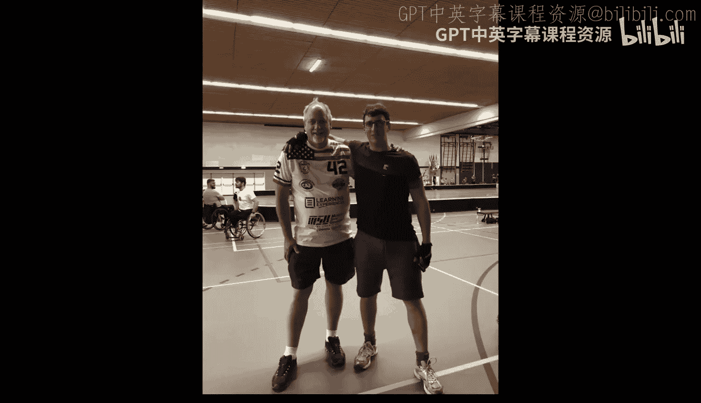
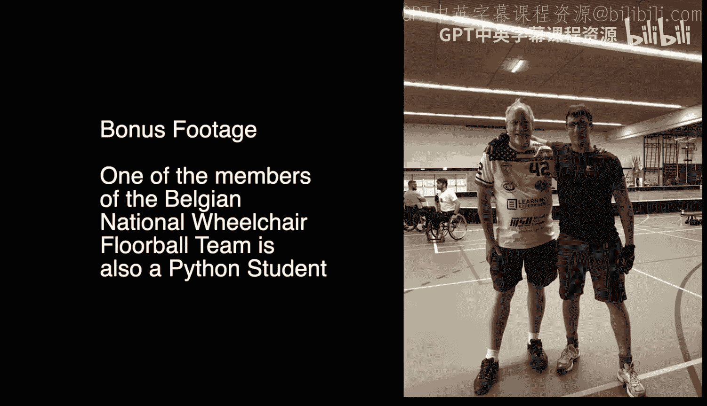

# Django for Everybody：课程简介：荷兰布雷达面对面办公时间回顾

在本节课中，我们将回顾密歇根大学《Django for Everybody》课程在荷兰布雷达举行的一次特殊面对面办公时间。本次会议汇集了来自世界各地的学生，他们分享了学习Python和Django的经历与感受。

---

查克刚刚在荷兰布雷达结束了又一次精彩的面对面办公时间。他的儿子正在这里参加国际地板球锦标赛。多位学生出席了本次活动，查克邀请他们进行自我介绍并谈谈对课程的体会。

以下是部分学生的分享：

*   **学生一**：我名叫霍尔。我很喜欢学习你的课程。
*   **学生二**：我是杰里，来自比利时。我热爱Python。我甚至在肯塔基州纹了一个Python语言的纹身，因为我非常喜欢Python，也非常享受你的课程。
*   **学生三**：我是罗杰。我的故事没那么精彩，我没有Python纹身。我在荷兰。感谢你的课程帮助我入门Python，它确实起到了这个作用。
*   **学生四**：我是贝基。我很感激几年前学习了这门课程，它让我开始了计算机科学的学习。我从一名法律专业学生转行到了技术领域。
*   **学生五**：我是亚历克斯。你的课程帮助我开始了Python学习，我非常喜欢，感谢你做的一切。
*   **学生六**：我是瑞维卡。我和我的老板以及另一位同事一起学习了你的课程。课程非常棒。
*   **学生七**：我是丹妮拉。我非常感谢查克的启发，两年前我开始学习Django，并且打算尽快开始教授Django。
*   **学生八**：我是詹娜。我和贝基一起开始了Python课程，现在我已经转向了PHP，并且本周早些时候刚刚毕业。我也有一个很酷的纹身，是吃豆人图案。

查克感谢大家的参与，并提到七月他将在美国各地旅行，届时可能会再次与大家见面。

---

上一节我们听到了普通课程学生的分享，本节中我们来看看一个特别的场景。查克身处荷兰布雷达的残奥会比赛现场，他的儿子正在美国轮椅地板球队效力。出乎意料的是，比利时国家队中有一位他的课程学生。

查克邀请了托马斯和他的比利时轮椅地板球队队友们进行介绍。

以下是比利时队部分成员的介绍：

*   **托马斯**：我名叫托马斯，34岁。我和我的比利时地板球队队友们在一起。我一直学习你的Python课程，它非常棒，讲解清晰，练习很好，我从中受益匪浅，非常感谢。
*   **迈克尔**：我是迈克尔，来自比利时，住在布雷达，36岁。
*   **迪特尔**：我是迪特尔，我接下来可能也会学习你的Python课程，很期待。
*   **队员四**：我27岁，是比利时国家队的一名守门员。

由于即将进行比利时对阵美国的比赛，队员们需要参加赛前会议，介绍匆匆结束。查克表示会在视频中加入一些比美比赛的片段。

---

本节课中我们一起回顾了一次特别的线下交流活动。我们看到了来自不同背景的学生如何通过《Django for Everybody》课程开启编程之旅，并将学习热情延伸到生活的其他领域，例如体育团队中。这体现了编程学习的广泛影响力和社区交流的价值。