# Python for Everybody：14.1：Python对象术语入门 🐍

在本节课中，我们将学习面向对象编程（OOP）的核心术语。我们的目标不是立即学会如何编写复杂的对象，而是理解诸如“类”、“对象”、“方法”、“属性”等关键概念。这对于阅读Python文档和使用各种库（如数据库操作库或BeautifulSoup）至关重要。

---

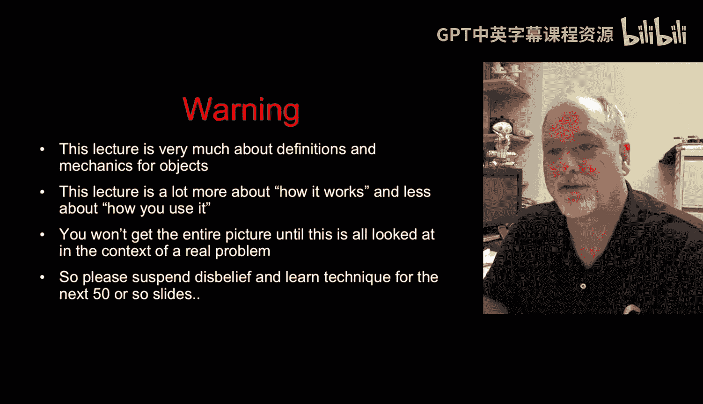

## 程序的传统视角

上一节我们提到了学习术语的重要性，本节我们先回顾一下对程序的传统理解。

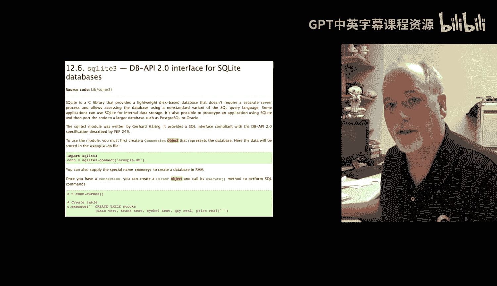

一个经典的程序模型是**输入-处理-输出**。例如，一个将欧洲电梯楼层转换为美国电梯楼层的程序。在这个模型中，我们使用变量、逻辑、算法和循环等一系列步骤来实现目标。

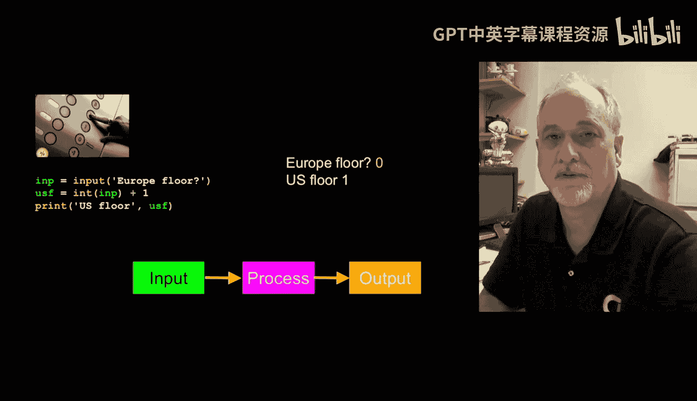

**代码示例：**
```python
# 传统的过程式编程示例：楼层转换
euro_floor = input('请输入欧洲楼层: ')
us_floor = int(euro_floor) + 1
print('对应的美国楼层是:', us_floor)
```

---

## 面向对象视角

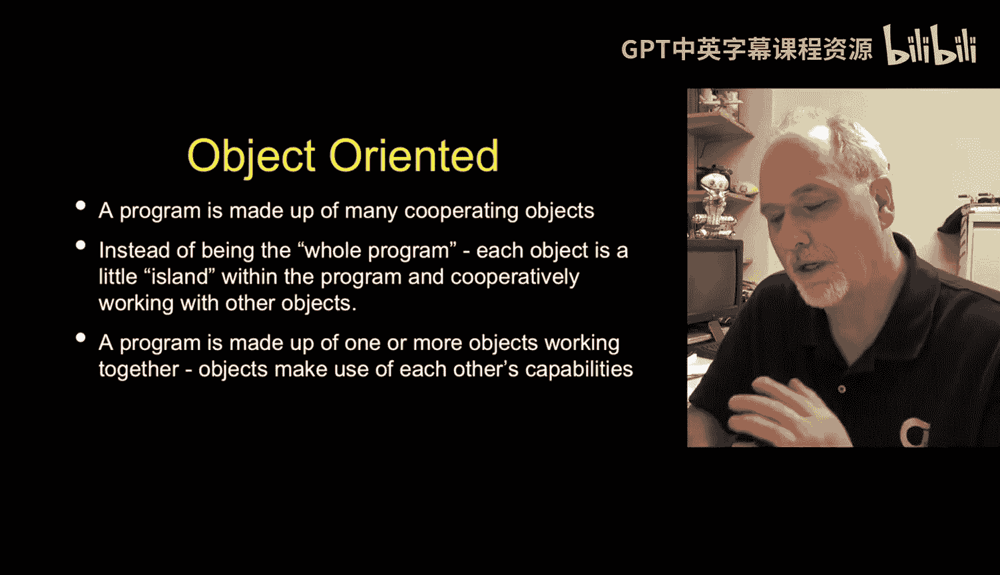

实际上，从学习Python的第一天起，我们就在使用对象。字符串、列表、字典都是对象。

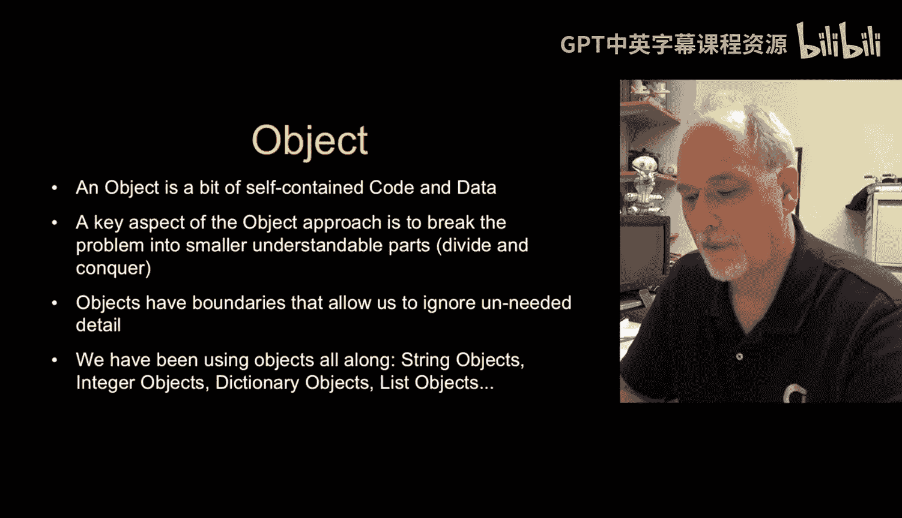

在面向对象视角下，程序由许多**对象**组成。数据在这些对象之间流动。每个对象都是一个自包含的小单元，内部包含**代码**（方法）和**数据**（属性）。通过将复杂问题分解为多个可以独立开发和交互的对象，能使问题变得更简单。

例如，一个字符串对象内部既有字符数据，也有像 `.upper()` 或 `.strip()` 这样的方法代码。

---

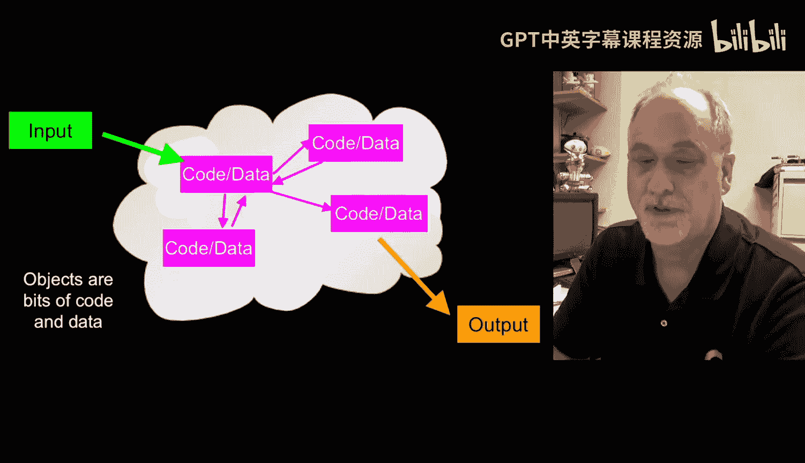

## 对象的边界与封装

面向对象模式的一个优点是它建立了清晰的**边界**。

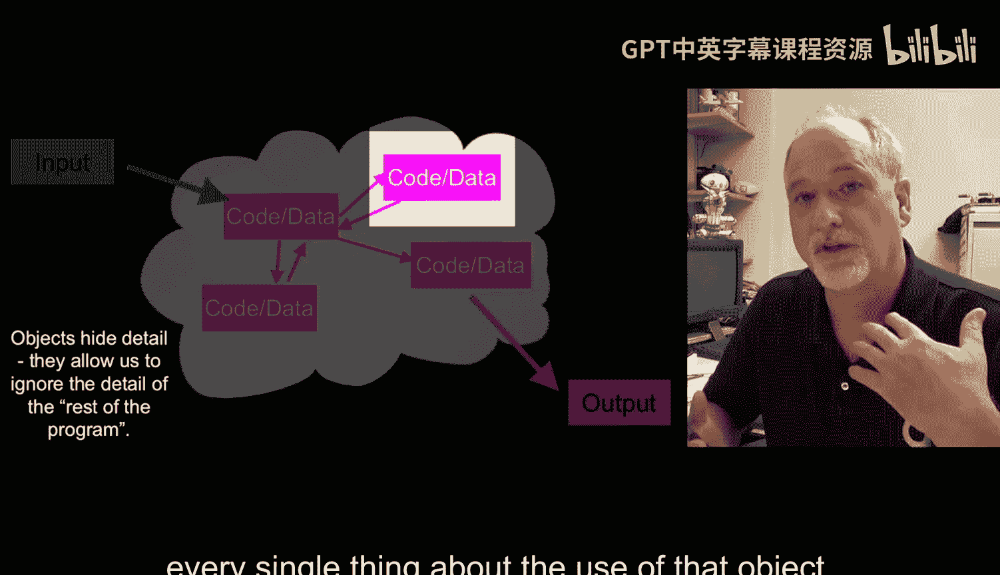

*   **对象的创建者**负责构建内部功能，并提供一个**接口**供外部使用。创建者无需关心对象外部如何使用它。
*   **对象的使用者**通过接口与对象交互，获取数据或调用功能，而无需了解对象内部的复杂实现细节。

这种“隔离墙”对编写对象和使用对象的程序员都非常有益，是一种强大的设计模式。

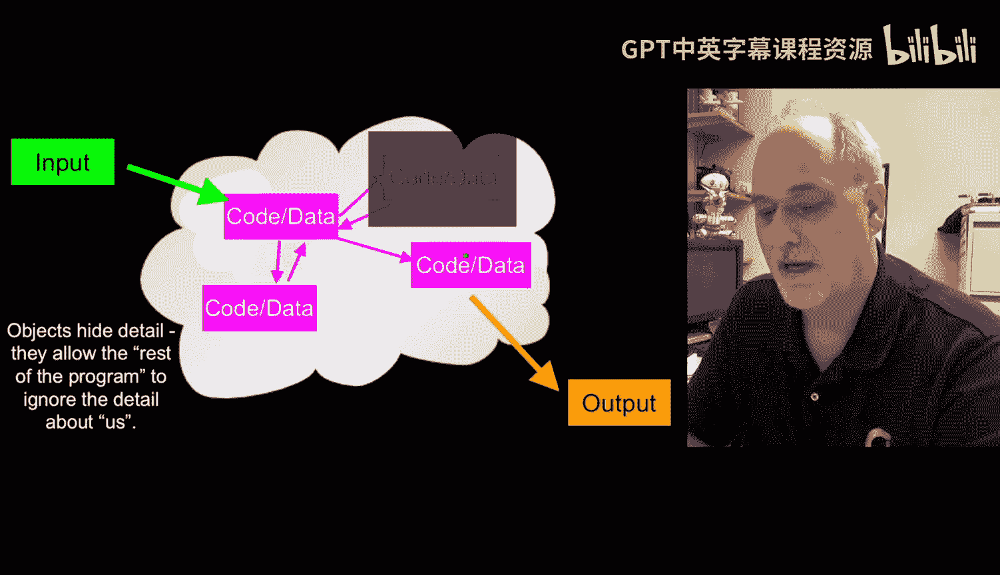

---

## 核心术语定义

现在，我们来正式定义一些核心术语。理解这些词汇是阅读文档和进行交流的基础。

以下是关键术语及其解释：

*   **类**
    *   **定义**：类是创建对象的**模板**或蓝图。它定义了未来对象将拥有哪些数据（属性）和代码（方法）。
    *   **类比**：就像**饼干模具**。模具本身不是饼干，但它定义了饼干的形状。类本身不是一个具体的对象。
    *   **公式/概念**：`类 = 模板`

*   **对象 / 实例**
    *   **定义**：对象是类的一个具体**实例**。它是根据类的模板创建出来的、实际存在于内存中的实体。
    *   **类比**：用同一个饼干模具压出来的**每一块饼干**都是一个独立的实例。根据“狗”这个类，可以创建出名为“Lassie”的具体狗对象。
    *   **公式/概念**：`对象 = 类的实例`

*   **方法**
    *   **定义**：方法是定义在类内部的函数。它是对象能够执行的**操作**或**行为**。
    *   **说明**：它本质上是一个函数，但其作用域被限定在所属的类或对象内部。在某些语境下，调用方法也被称为向对象“发送消息”。
    *   **代码示例**：字符串的 `.upper()` 就是一个方法。

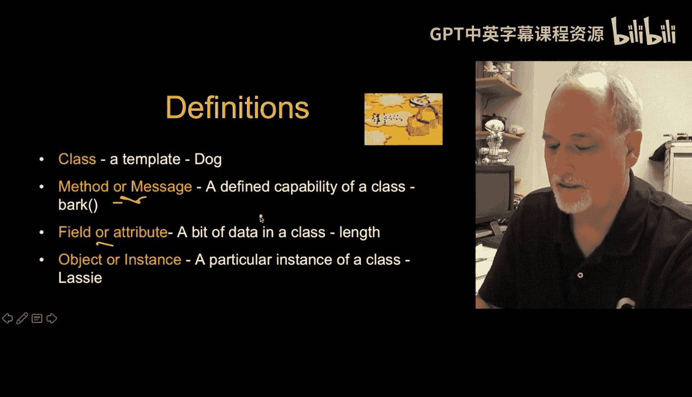

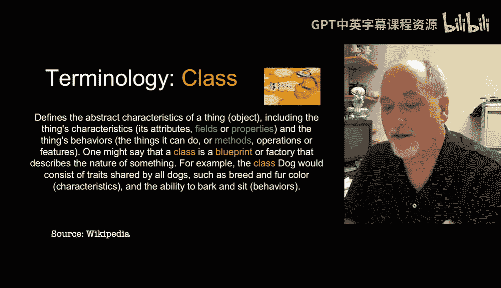

*   **属性 / 字段**
    *   **定义**：属性是存储在对象内部的**数据**。每个对象都有自己独立的属性值。
    *   **说明**：“属性”和“字段”这两个术语经常互换使用，都指对象内部的数据变量。
    *   **代码示例**：一个“狗”对象可能拥有 `name`、`age`、`breed` 等属性。

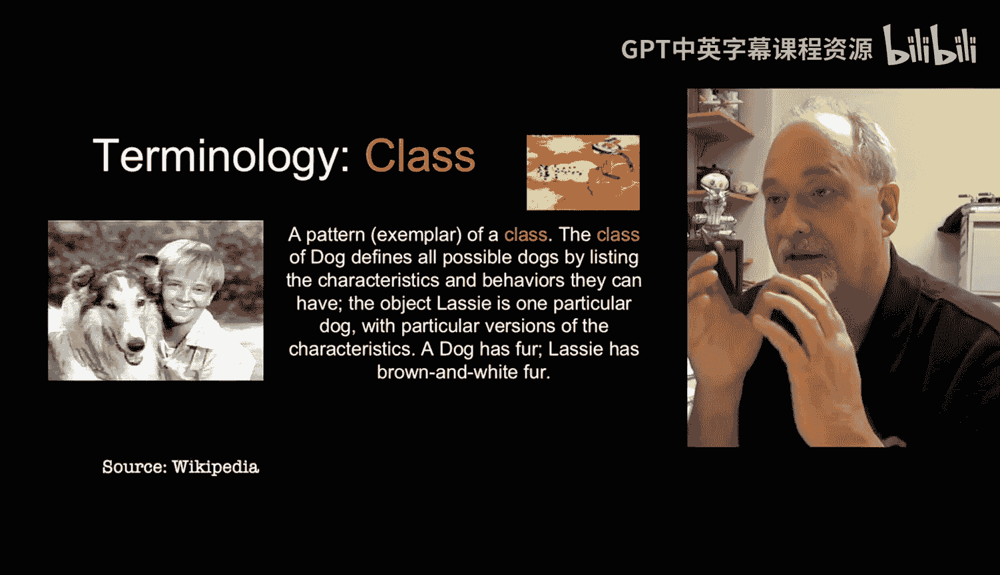

---

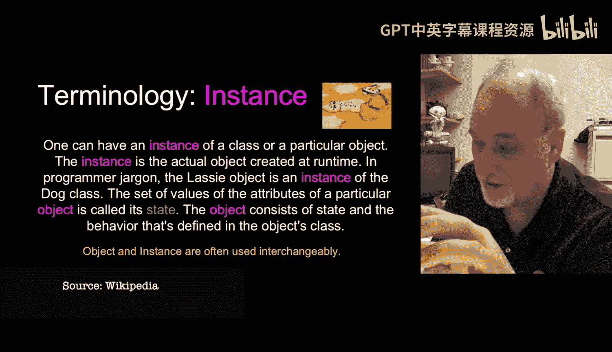

## 总结

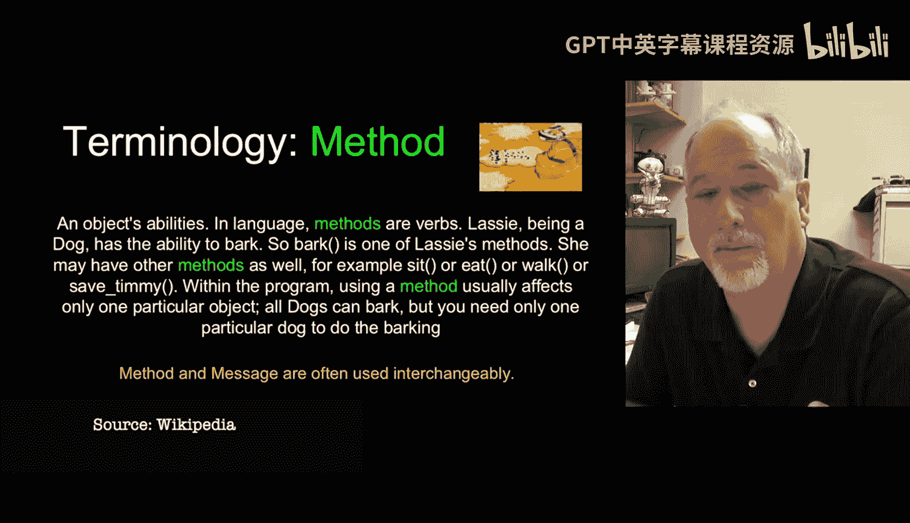

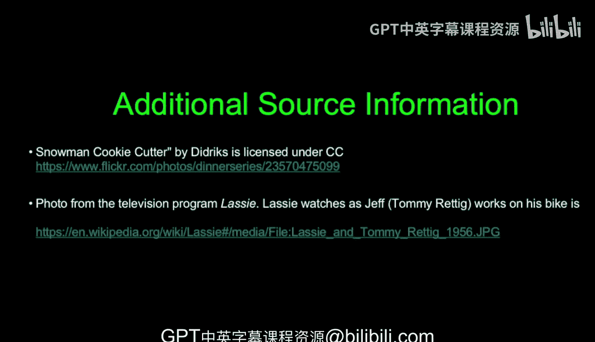

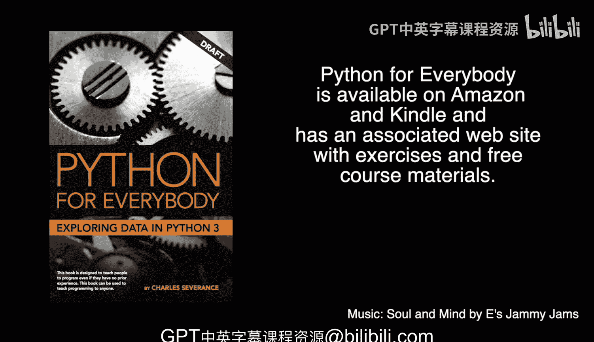

本节课中，我们一起学习了面向对象编程的基础术语。我们了解到**类**是创建对象的模板，**对象**是类的具体实例。对象封装了**数据**（属性）和**操作**（方法），并通过清晰的边界与程序的其他部分交互。虽然作为初学者可能还不需要编写复杂的类，但理解这些概念对于有效使用Python强大的内置对象和第三方库至关重要。在接下来的课程中，我们将看到这些概念在实际代码中的应用。