# 密歇根大学《给所有人的Django课程（简介、开发Web APP、特征和库、JavaScript和JSON）｜Django for Everybody》中英字幕 p46 20_04_04_Python对象-py4e第14章第2部分.zh_en -BV1Kt421V7EE_p46-

Okay， so now that we've gotten through the definitions， let's work into some sample code， but hey。

 look at this， we've got ourselves a cookie cutter and some cookies。

 so remember that a class is a template， it's not the actual thing， an object。

Is an instance of a class。 So you have to take to class and do something to make the object。

 And actually， you can see here some other classes。

 There's clearly a sort of a snowflake class and a gingerbread man class。

 That's an object object object somewhere out here。

 There is a snowflake class and a gingerbread class。

 But we got a snowman object and a snowman object and a snowman class。 so。Class is the template。

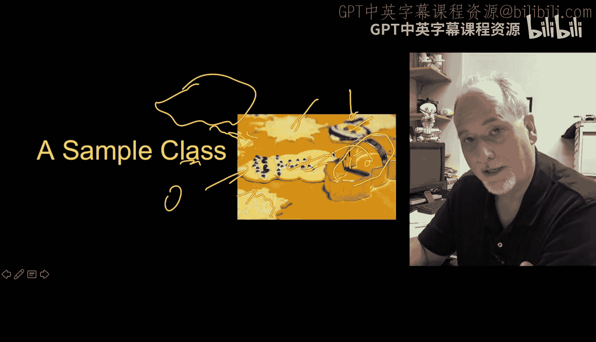

Object is the instance， so here's a bit of Python code。 so let's take a look at what we got here。

Class is a new reserved word kind of like deaf， we have the name the class that is a name that we choose we're going that's the name by which we'll refer to this class for the rest of this program。

 and it has a colon at the end of it and which means it starts an indented block。

 which ends when we de indent。Inside the class， there are generally two things。 There is some data。

 and this just looks like an assignment statement in the class X equals 0。 And then there is a deaf。

 deaf This looks just like a function。 and then it starts with a deaf has a colon indentense。

 So that function finishes right there。 The difference is is this is a method because it lives inside of a class。

 And so there is no function called party。 There is a function called party within party animal class。

And we'll talk in a second about this self thing， it is the way that inside this code we refer back to that variable。

So this is not actually executing an encode。 It's sort of remembering the template。

 defining the class party animal。 This is what we call constructing or constructing using the party animal template or class。

 we are making a party animal。 And then once we make that， we stick it in the variable A。

 And then we're going to call this party animal， this party method  three times 1，2，3。 Now。

 this self thing and we'll take a look at the self。 The self ends up being an alias of A。

 And so you can look at this syntax is just kind of an equivalent of this syntax。

 it's calling the party method within the party animal class and passing the instance in as the first parameter。

 And so self ends up being an alias of A each time these are called。 Now。

 if we make a different variable and a second object， which we will eventually。

 you will see that that works a little bit differently。

 And so this syntax is a short version of that syntax。

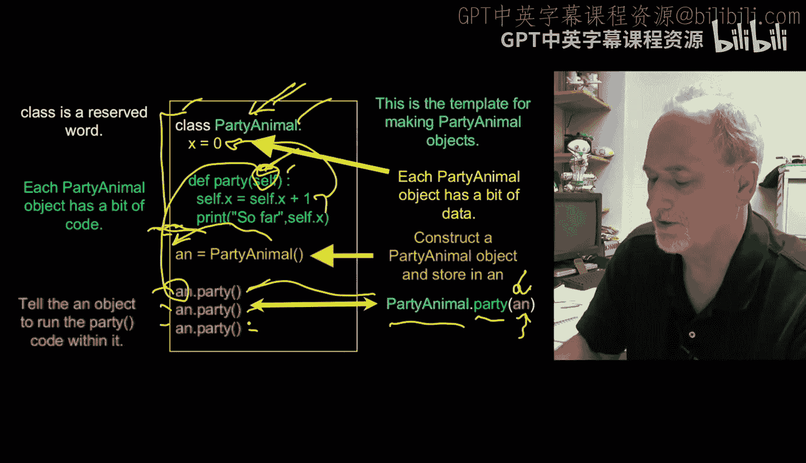

So if we watch how this executes。

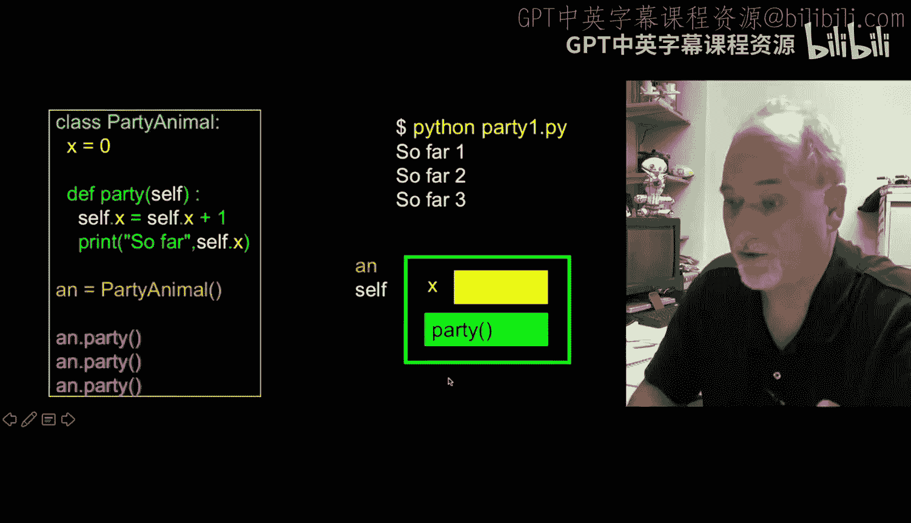

It'stops。It starts up here。

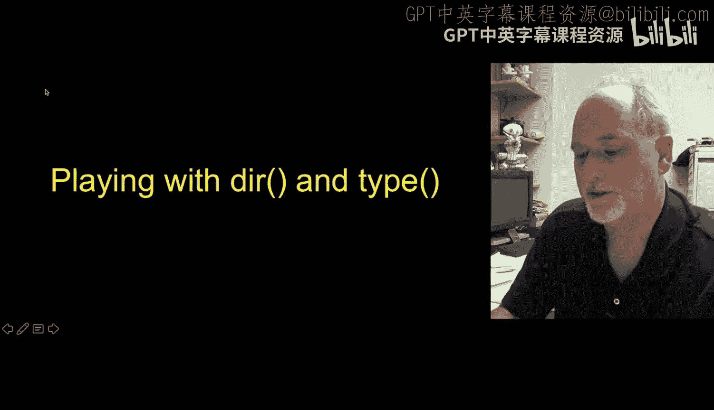

It just defines it。And then we construct it。And that's what basically constructing it。

 we know how to construct it because we look at the class and we make a variable X。

 we make some code party， and then we construct that that's what the party animal does。

 and then we assign that into AN， and so AN is now pointing at that。

Then when we call the party method that basically takes this AN and passes it in as the first parameter。

 which is used as self， and so self dot x， which is what we're doing in this line right here。

 self dot x is a variable， x starts out as0。X starts out as0 because when it was constructed。

 it was set to0， So we're in here。 AN is an alias of self， and now it looks up self dot x， which is0。

 adds one to it， and so this becomes one。 and then we print so far so far one and then the code returns and it goes done and does it again and X becomes two。

 prints out so far two comes back down and does the last time calls it again， self dot x is 2。

 add one to it and stick it back in so this becomes3， and we print out three。

 and then the program finishes and so you can think of this as constructing the object and then associating it with this an variable。

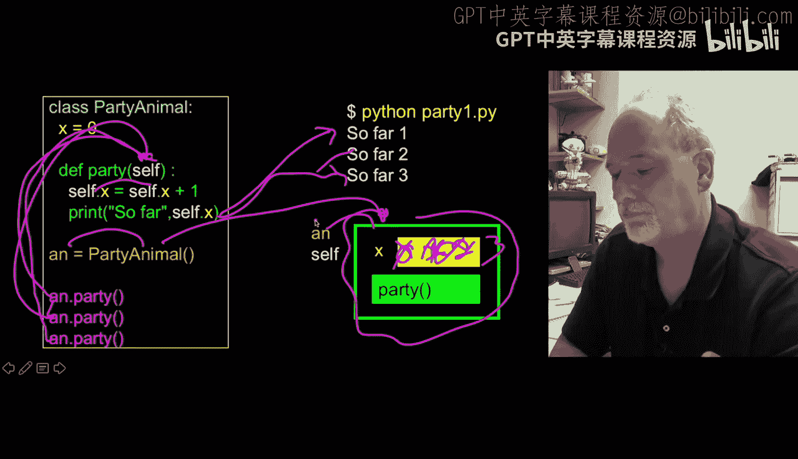

Now we've created this object， we can play around with things we've played around before with Drian type。

 we use Drian type to kind of inspect variables and types and objects。

 so we've been using objects all along。

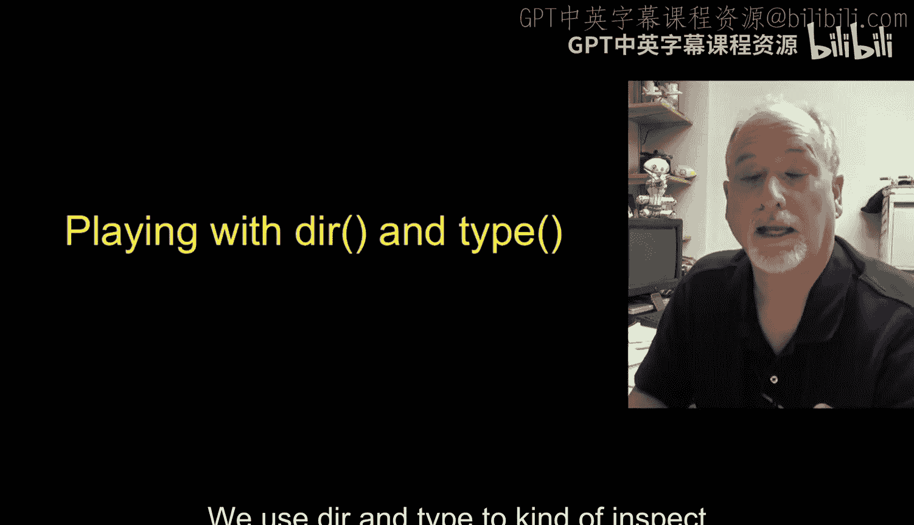

We this code here says， hey， make me an empty list。 Well。

 it turns out that what we're saying is there is already a list class inside of Python。

 and we're constructing an empty list。 And when we get back this empty list。

 We're assigning that into X。 So X， in a sense， contains or points to an empty list。 So then we say。

 hey， what is in X。 What kind of thing is X。 Well， it's a list。 This is a thing， it's a list type。

 It lists have list of things in them。 And， you know。

 use a pen and all the things we've been doing before， they're just objects。 And then the D。

 if you remember the D， the dir is the capabilities。

And there's all these internal capabilities that do things like implement the bracket operator。

 etctera， those double underscore ones， we can ignore them。

 although you can even look them up and figure out what they mean if you feel like it。

 but the methods that we tend to call are in this class and so things like x dot sort。

I've always told you that is the sort method within the X thing and the dot operator is the operator that we use to look something up within an object。

 and so you've been using the syntax all along， X dot sort， dictionary dot items。

 all of those are methods within the corresponding class。

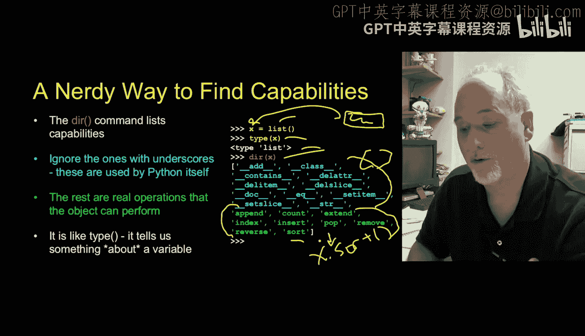

If we take a look at this line of code that we've been doing for a very long time， which says， oh。

 stick hello there into why。It's if I reword that as more O，0 or object oriented。

 what this single quote does says， make me a string object。And put some text in it。

 and then when that is done being constructed， stick that into why。RightAnd so why now？

Points to a string object that's been pre-initialized to the string hello there。

 Now that's a long way of saying hello there ends up in Y， But in O O terms， we can talk about that。

 If we do a du of that， we see a whole bunch of internal methods which have double underscores。

 and then we see all kinds of methods that we've been using， we've been using methods like upper。

 we've been using methods like find， we've been using methods like R strip， right。

 we've been using these methods， So we've go like Y do R strip。Prenhesy， again， that's a method。

 that's an object。Not a class， it's an object， and that is the object lookup operator。

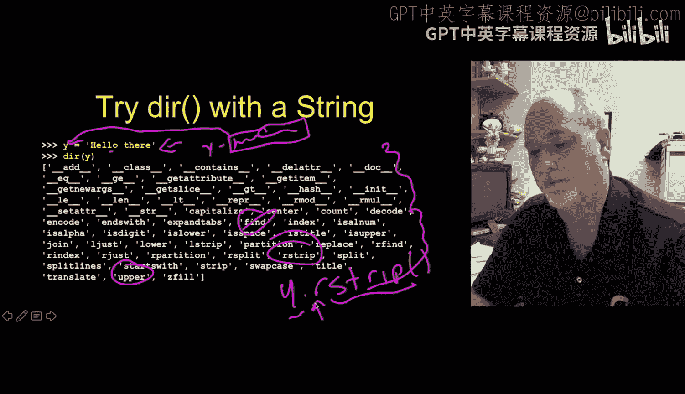

Now， if we do the same thing to code that we've built or a class that we've built。

 so now we have a party animal class。 remember this up to here is just definition。

 Now we construct it and we store it in AN。 So anN is a variable that contains an object of type party animal We ask it what type it is and it prints out here it says this is a class and its main underscore party animal and this whole thing here is the underscore main it's scope to underscore me。

 but you can see that you have made a new type。 you built a type by using this class keyword and then we use the Dr remember Dr looks for capabilities and again you will see。

You'll see a whole bunch of underscore things， they have meaning， you can look them up。

 but eventually you'll see the two things that you've put in it。

 one is the method party and the other is the attribute or field X。

 and again these are the things that you can say A do X。Or AN dot party。Because this dot。

Is the object operator， the object lookup operator that says look up in the object， anN the thing X。

 or look up in the object AN the thing party。Okay。

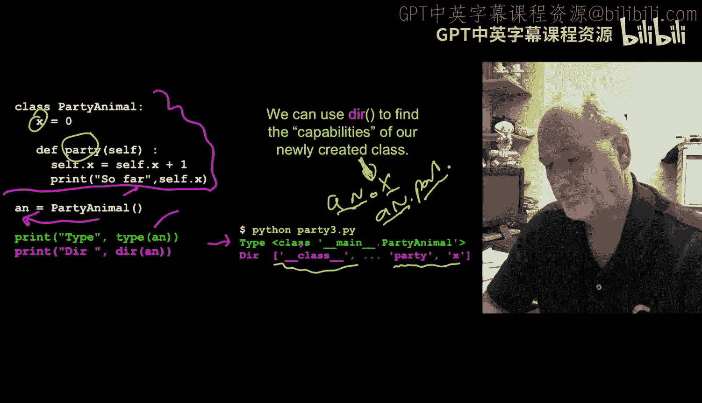

So up next we'll talk a little bit about how objects are created and destroyed。

 we also call that object lifecycle。

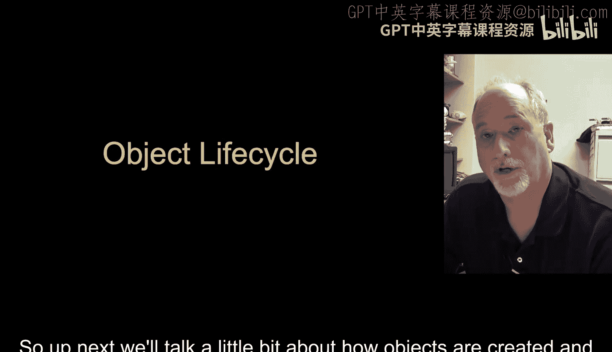

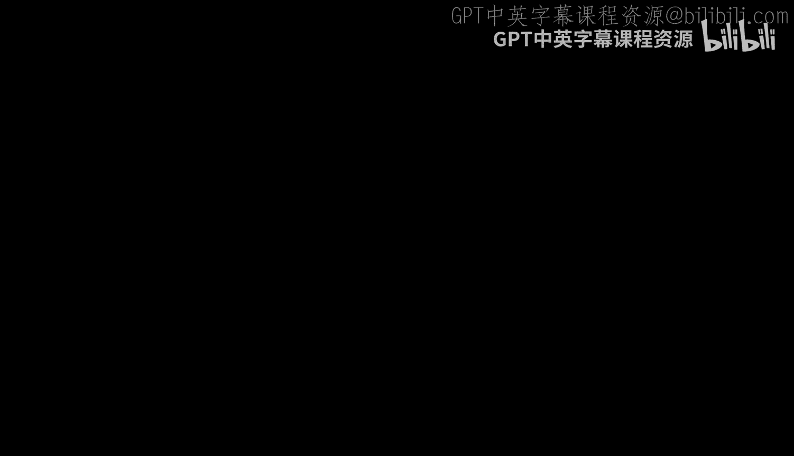

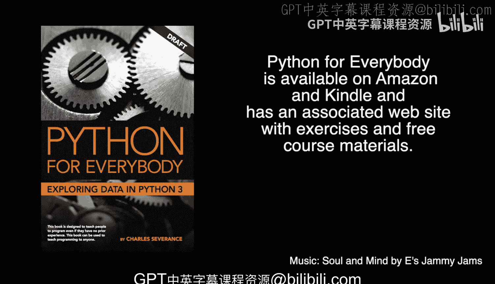