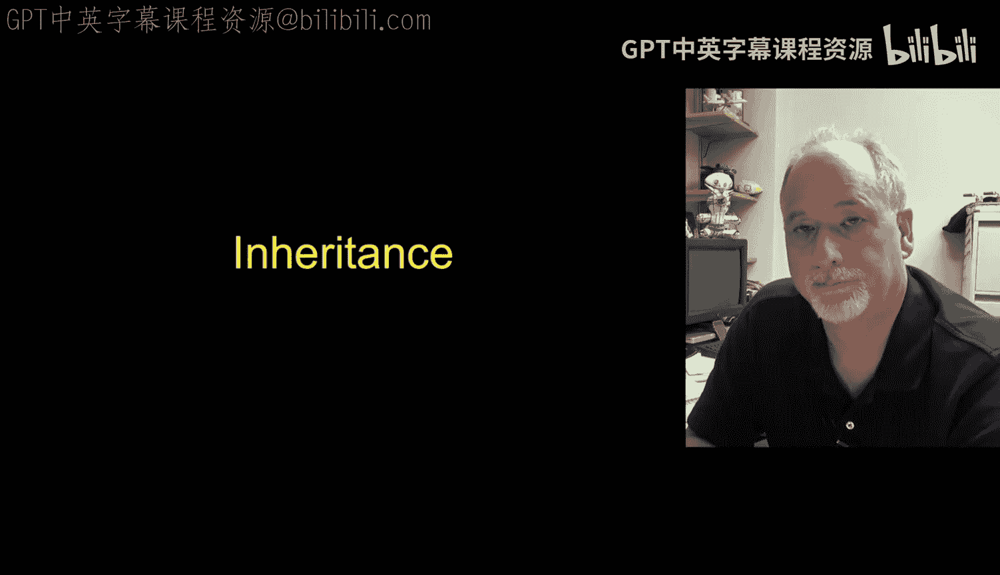
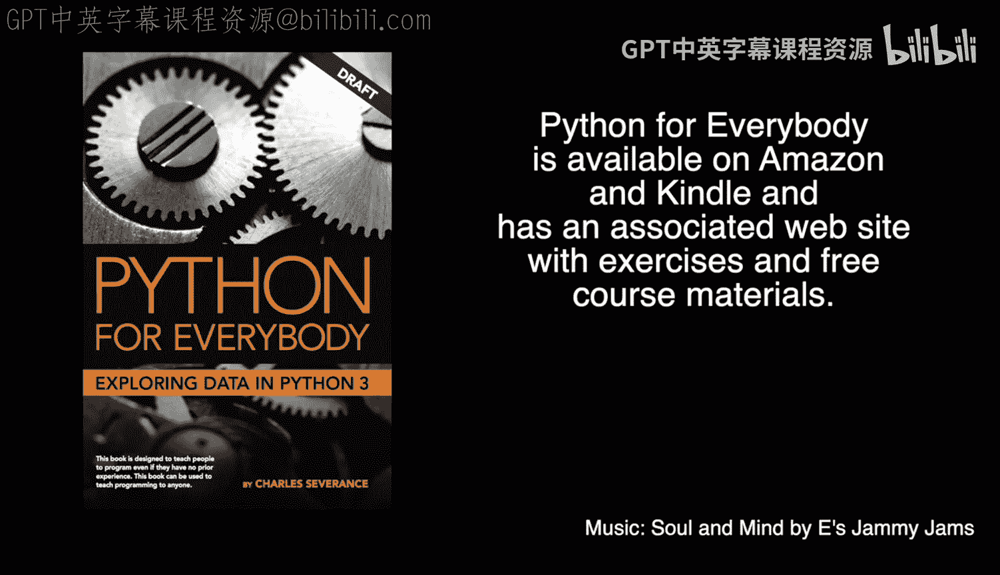

# Python面向对象编程：第14章：对象生命周期与继承

在本节课中，我们将要学习Python对象的生命周期，包括对象的创建与销毁过程，并初步了解面向对象编程中一个重要的概念——继承。

## 对象生命周期 🧬

上一节我们介绍了对象的基本概念和方法。本节中我们来看看对象的生命周期。对象生命周期指的是对象从创建到被销毁的整个过程。我们作为对象的创建者，可以在对象创建和销毁的时刻插入特定的代码来执行初始化或清理工作。

为此，我们使用两个特殊的函数：**构造函数**和**析构函数**。我们通常不直接调用它们，而是由Python在特定时刻自动调用。

*   **构造函数**：在对象被创建时自动调用，常用于设置变量的初始值。它更为常用。
*   **析构函数**：在对象被销毁时自动调用，用于执行清理工作，但实际使用频率较低。

以下是构造函数和析构函数的一个代码示例：

```python
class PartyAnimal:
    x = 0

    def __init__(self):
        print('I am constructed')

    def party(self):
        self.x = self.x + 1
        print('So far', self.x)

    def __del__(self):
        print('I am destructed', self.x)

an = PartyAnimal()
an.party()
an.party()
an = 42
print('an contains', an)
```

运行这段代码，输出如下：

```
I am constructed
So far 1
So far 2
I am destructed 2
an contains 42
```

代码执行过程如下：
1.  `an = PartyAnimal()` 这行代码创建了一个`PartyAnimal`对象，并自动调用了构造函数 `__init__`，打印出“I am constructed”。
2.  随后两次调用 `an.party()` 方法，增加`x`的值并打印。
3.  当执行 `an = 42` 时，变量`an`不再指向`PartyAnimal`对象，而是指向整数`42`。此时，原来的`PartyAnimal`对象不再被引用，Python在销毁它之前会自动调用其析构函数 `__del__`，打印出“I am destructed 2”。
4.  最后打印`an`的值，确认它现在是整数`42`。

这个例子展示了我们如何介入对象的创建和销毁时刻。需要注意的是，如果你像上面那样覆盖了一个变量，就相当于丢弃了原来的对象。

## 多个对象实例 🧩

到目前为止，我们创建了一个类，然后只创建它的一个实例（对象）。更有趣的情况是，当我们创建同一个类的多个实例，并将它们存储在不同的变量中时，每个实例都拥有自己独立的实例变量副本。

让我们看看下面的代码，这里我们移除了析构函数，并为构造函数添加了参数：

```python
class PartyAnimal:
    x = 0
    name = ''

    def __init__(self, z):
        self.name = z
        print(self.name, 'constructed')

    def party(self):
        self.x = self.x + 1
        print(self.name, 'party count', self.x)

s = PartyAnimal('Sally')
s.party()

j = PartyAnimal('Jim')
j.party()
s.party()
```

代码执行过程如下：
1.  `s = PartyAnimal('Sally')` 创建第一个实例，构造函数参数 `z` 接收字符串 `'Sally'`，并将其赋值给实例变量 `self.name`。这个实例存储在变量 `s` 中。
2.  调用 `s.party()`，`s` 实例的 `x` 值变为 1。
3.  `j = PartyAnimal('Jim')` 创建第二个独立的实例，`self.name` 被设置为 `'Jim'`，存储在变量 `j` 中。
4.  调用 `j.party()`，`j` 实例的 `x` 值变为 1。
5.  再次调用 `s.party()`，`s` 实例的 `x` 值从1增加到2。

关键点在于，每次使用 `new` 关键字（在Python中是直接调用类名）进行构造时，都会创建一套全新的实例变量。因此，`s.x` 和 `j.x` 是两个完全独立的变量。我们拥有了两个对象：一个在变量 `s` 中，一个在变量 `j` 中，它们拥有各自独立的实例变量副本。

## 继承简介 🧬➡️🧬

接下来我们将讨论**继承**。继承是指以一个已有的类为基础，扩展其功能以创建新类的思想。这允许新类（子类）获取现有类（父类）的属性和方法，并可以添加或覆盖特定的功能。我们将在后续课程中详细探讨这个概念。

---





本节课中我们一起学习了Python对象的生命周期，理解了构造函数和析构函数的作用，实践了如何创建同一个类的多个独立实例，并初步认识了面向对象编程的核心概念——继承。掌握这些知识是构建更复杂、模块化程序的基础。