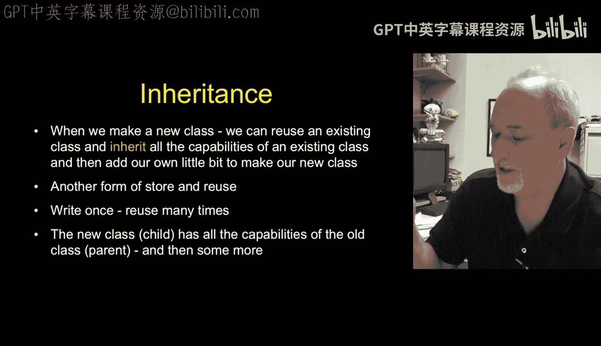
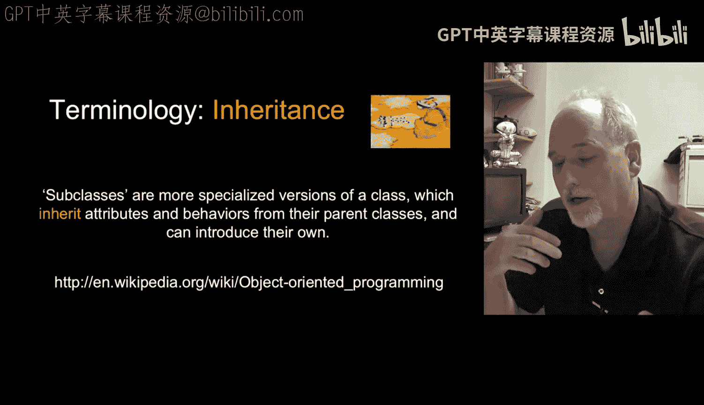
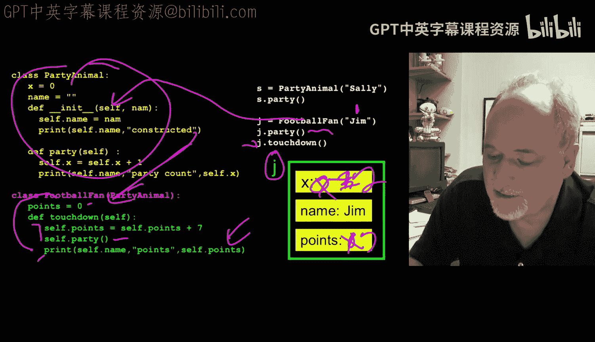
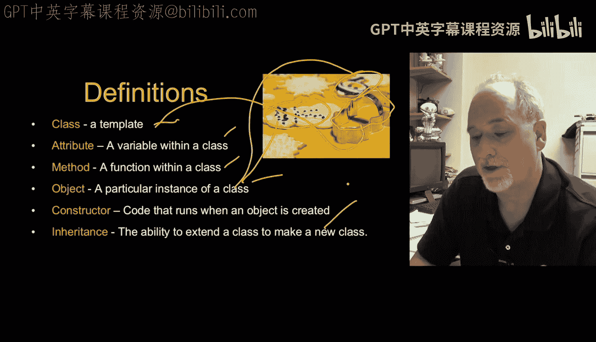
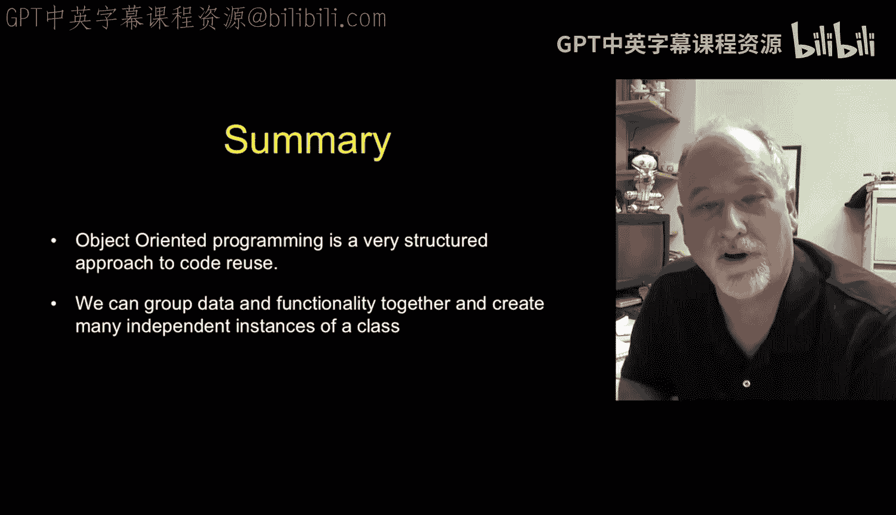
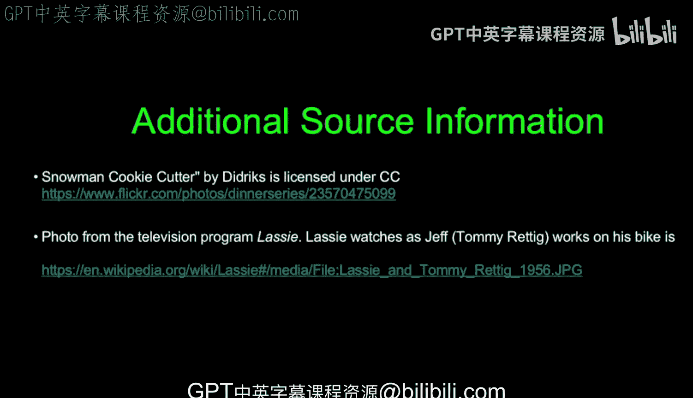
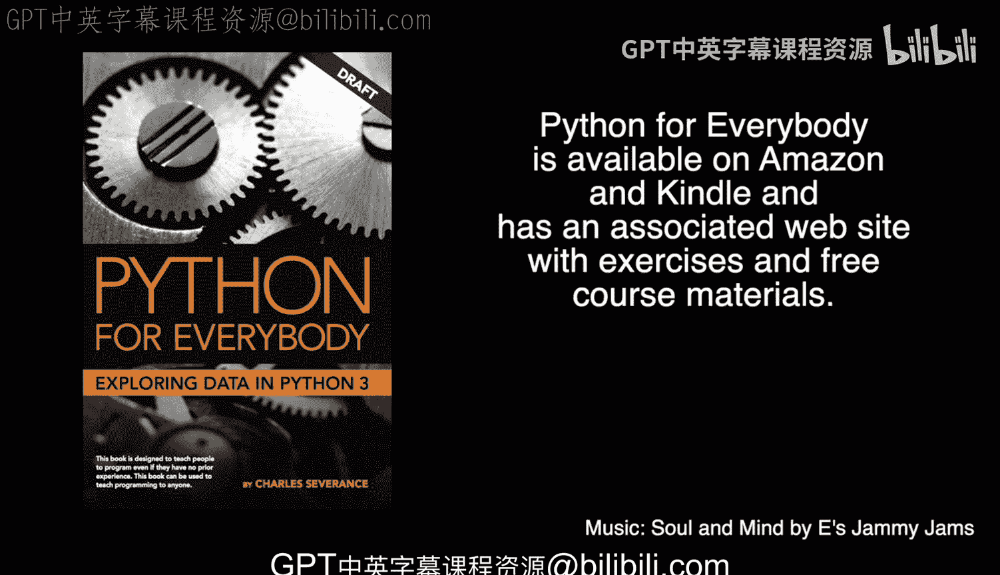

# 密歇根大学《给所有人的Django课程（简介、开发Web APP、特征和库、JavaScript和JSON）｜Django for Everybody》中英字幕 p48 22_04_06_Python对象-py4e第14章第4部分.zh_en -BV1Kt421V7EE_p48-

So the last topic we'll talk about here in object orientation is the notion of inheritance。

 and this is a form of code reuse and it's one of the more advanced aspects of object orientationient programming so just kind of understand what it is at a high level and then you know where to come back to when you need to learn a bit more about inheritance。

So the idea is instead of making a new class from scratch。

 we actually make a new class by starting with an existing class， we are extending it。

 or another word for this is subclassing and it's sort of a situation where you're like I'm I've got this code and I've got this data and I just need to add a few things to it and then I'll have a whole new thing and as you design objects and what we call object hierarchies you often do this and it's a form of sort of real clever code reuse。

But again。Don't necessarily think that you're supposed to know when to use this or why to use this is right now。

 it's just terminology。 Okay， just terminology。 We have what call these as parent child relationships。

 The original class is called a parent and the new class is called the child class。

 So subclass are another word for this。 you have a class and then you subclass it。

 I think extending and inheriting and parent child are probably better ways of expressing it than a subclassing。

 So here's a bit of code。's take a look at this。 This is this code's unchanged。

 It's the party animal code that we've been saying all along。

 It's the one that we construct and put a name in。 And now what we're going to do is extend it。

 And so you'll notice that this code down here is the part that's doing the extending。

 So we're making a new class football fan。 And by putting in parentheses before the colon party animal。

 That says。

Football fan inherits everything that is party animal， meaning the X， the name， the in， the party。

 all those methods and data are sitting there， and now we're going to add a new variable so football fan has in addition to all those other variables has points and it has a touchdown method。

And， you know， point self points is added， you know。

 to we add seven of the points and then we call the party and that does that。

 So this is calling this method because football fan includes X name and party and a knit and everything and all this this constructor。

 So so this football fan is really an amalgamation of all these things together。 party animal。

Is just this stuff right but and so we still have two classes we don't just have one。

 we didn't erase the party animal class and so if we take a look at the code that we can run here。

 we can say， oh okay， let's make a party animal Sally and so that constructstructs an object like this and then stores that in S and with an X starting out zero and then we call S party its better change that color。

Starts out at zero， and then we call the party method and that changes it to one。 Okay。

 and so this is this bit of code。 it's as if this part doesn't matter at all because it is a party animal。

 It's not a football fan。 but now if we take a look at。This code down here。Take this code down here。

 we're going to construct a football fan。And pass in gym。

 But football fan has no underscore underscore knit。

 So that actually uses the underscore knit from party animal because we extended party animal to make football fan。

 So we inherited all of the good that was in there。 So there it's going to make a name， a variable X。

 which is going to start at0， a variable name that's going to have gym in it。

 and a variable points It's going to have a0 in it。

 So this J variable has more things in it than the S variable has。 And so we can call the J party。

And if we call J party， that goes here and adds1 to x， so that adds1 to x。

 and then we call J touchdown。 Well that comes down in here。And adds seven to the points。

Right and then calls party within us and so so self dot party is the current object i。

e self in J are the same thing， right， self dot party。

 and then it goes up here and passes self in and it adds one to the x in this case of this J variable。

 so this becomes2。And that's where it prints out， it prints out， you know，7 and 2 in a way you go。

 And so it's a way for you to kind of take all this stuff and stuff it into a class by making a new class and just add the extending bits。

 the bits that are in addition to the other stuff。 So like I said。

Inheritance is a powerful and wonderful concept， it's a form of excellent form of reuse。

 but basically。The whole purpose of this lecture was so that I could in the future just use these words and you would understand them as compared to。

 I just want to say method and I've been saying method all long and it's high time that I defined it。

 so let's just review one last time class is a template。

 It is not actually a thing it is a shape of a thing and we define it and say when we make one of these things it's going to have these variables in it it' going to have these method in it attributes。

 variables within a class method is a function that's inside of a class object is once we construct a class we get back an object and so object here is。

The snowman cookies class is the snowman Cook cutter。

And a constructor is a bit of code that sets up our object our instance when it first is created。

 and inheritance is this ability to create a new class。

 but take all and import and affect all the capabilities of an existing class。

Object Orient is awesome。For the rest of this class， we're not going to write any object code。

 we're not going to use class at all， but we are going to use objects and literally you've been using objects from the beginning of this course as soon as you said print。

 whoops， as soon as you said， you know x equals high。That's an object。

 and as soon as you said x dot upper。You were calling a method， right。

 You've been calling a method all along when you're doing something like FH equals open。

This thing you're getting back， that's an object， and then you do FH。read or whatever。

You're calling a method in the dot operator so you've been using objects all along I now I'm just finally explaining to you when I say call the read method or call the upper method or what's this little dot and why is that there So again it's time for us to understand that but you will it will take you a long time before you encounter a problem that's large enough where as part of your solution you're going to make a new object but when you do it's really a powerful thing I mean。

It's a really bad idea for me as a teacher say oh write a bunch of objects it's like it's premature for that it's later is when you will actually learn how to use objects and you'd be like。

 oh thank heaven that these objects are here， okay？So that's all for now。

 thanks for listening and see on the net。

