# 密歇根大学《给所有人的Django课程（简介、开发Web APP、特征和库、JavaScript和JSON）｜Django for Everybody》中英字幕 p56 30_06_05_Django中的CSRF支持.zh_en -BV1Kt421V7EE_p56-

So now that we've introduced CSRF conceptually， let's talk about how we actually implement it running in Django。

So if you， if you remember， I didn't really point this out too much when we went through it this was the。

My first form where I showed you how data could be transported to the server using a post request。

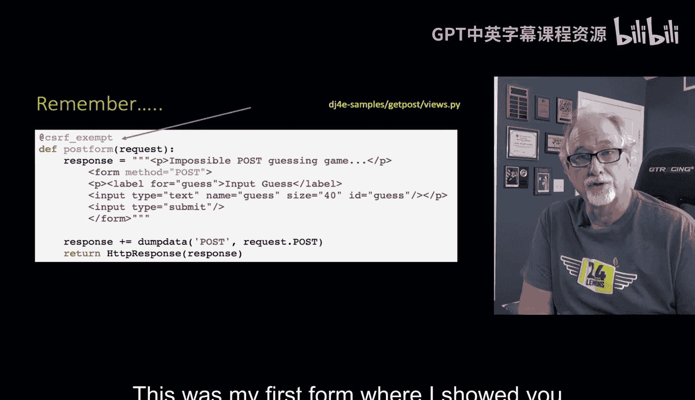

If you look at the top， I have this little annotation at CSRf underscore exempt and there's a little report above it in the views file。

 And what I was basically telling D django is don't blow this up because because I'm not handling CSRf properly So what we're going to do sort of do the exact same view except we're just not going to have that little thing so we'll call this one fail form and we're going to throw out a form we're going to press submit everything looks fine。

 the only difference is is I did not turn off CSsRf processing So on a post request。

 CSRf processing is on by default， which means that we have to do something explicitly when we're making post forms。

 but I didn't do it yet， So this is what happens if you don't do it So get you get a form and you press type some stuff in and you hit submit query and boom you get this forbidden message that's a 403 So among all the HtP responses as we've。

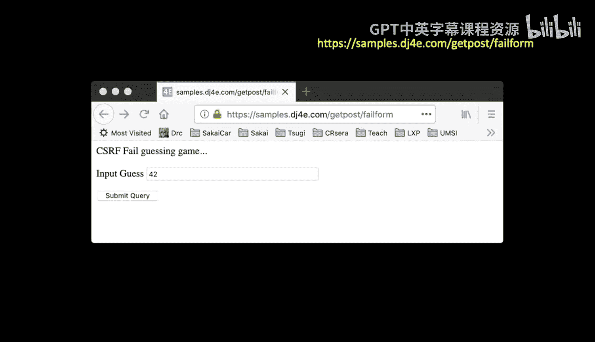

200 which is okay weve got 302 which is moved and we got 404 which is not found 403 is you're not getting this page but not because I don't have it but because you're not authorized to do it So this is it aborting and stopping the post so it comes in it looked up the session and everything looked good except the CSRf did not match now。

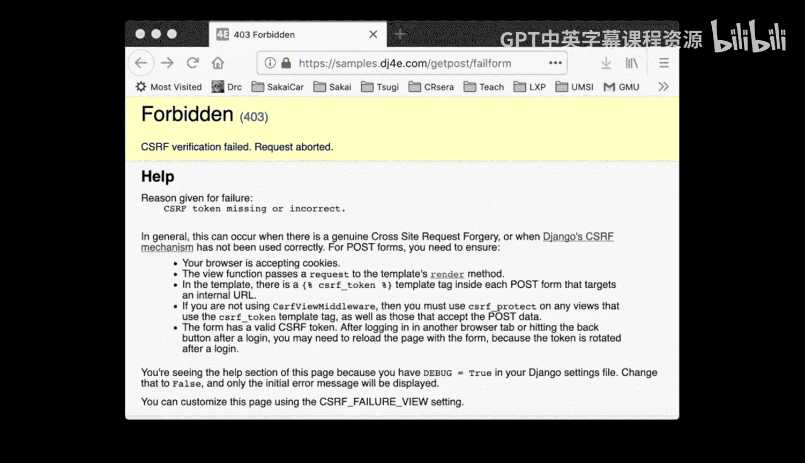

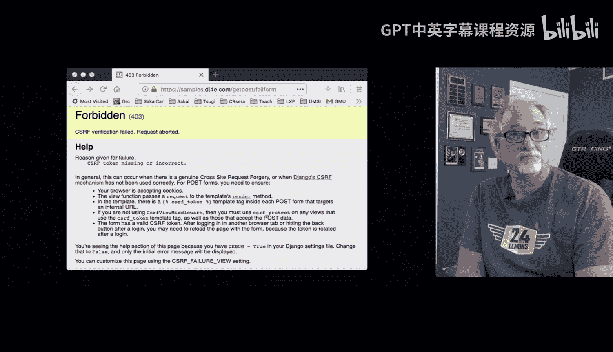

This， we are a legit server。 So what we've got to do is we've got to actually add the CSRf to the post on the way out。

 Okay， so this is the exact same。

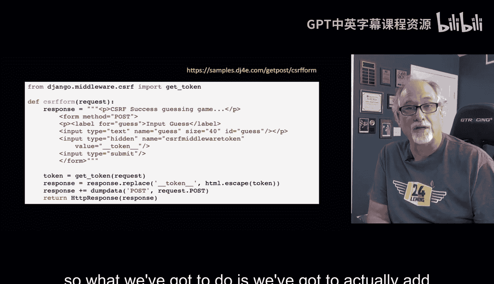

Post and I'm doing this kind of at a low level and I'll show you'll show you a much easier way to do it in a minute。

 So we have an input hidden。 I just happen to know that CSfsrf middleware token is the proper name for it。

 and I'm just gonna have a placeholder which is under cornerner core token。

 And so then what I'm going to do is I'm gonna talk to that middleware CSRf got token。

 Now that token is probably just a number sitting in the session， but I don't need to know that。

 I just say hey， give me the token for the current request。 request is of course。

 all that data that's coming in。 It's got the S's got everything else in it。 So hey。

 give me that token。 This is a big long string， which is really just a big long random number or big long random string。

And then what I'm going to do is take whatever that big long random number is。

 and I'm going to replace this little bit with a stir， a simple replace。

 and then I'm going to send that out。

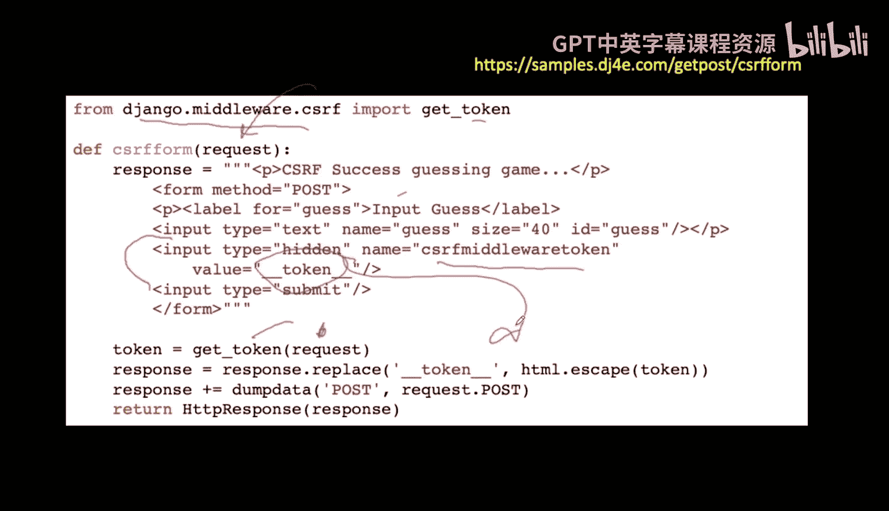

And so this time。When we go to that page， you'll see that now we have an input type equals hidden。

 name equals CSRF middleware token， and then the big long middleware token， whatever that is。

And then now when we submit it， it bundles up both the guess and the middleware token and it actually bundles up to submit as well if it's got a name and sends that in as post data。

 so now when it dumps out， you see， oh， well， youve got guess equals 42 and CSRF middleware now。

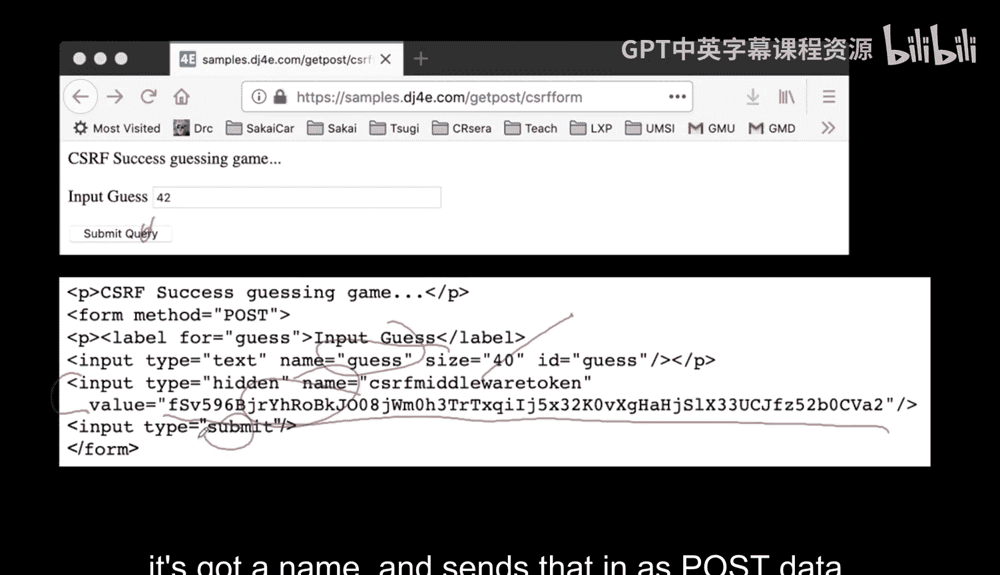

By the time it's got to this point， we're not really doing the checking here。

 The checking was done before the view started。 And so if we go back to the view here。

 the checking is done。

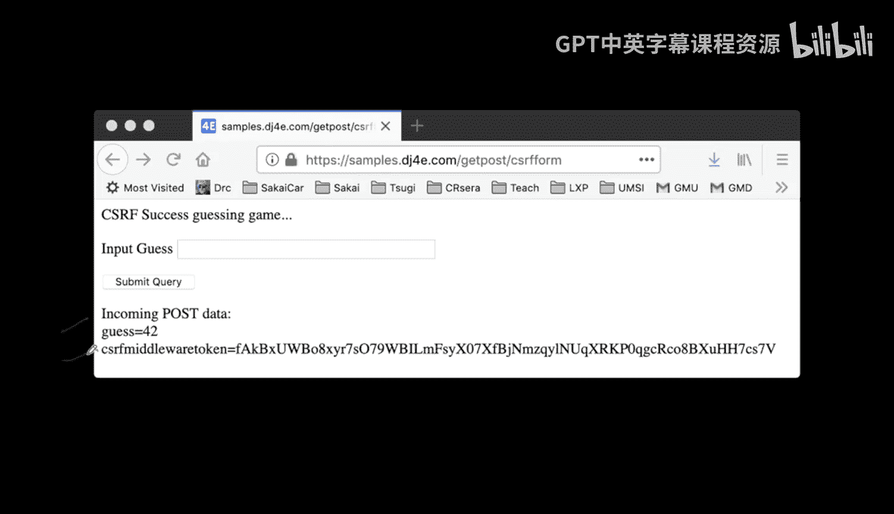

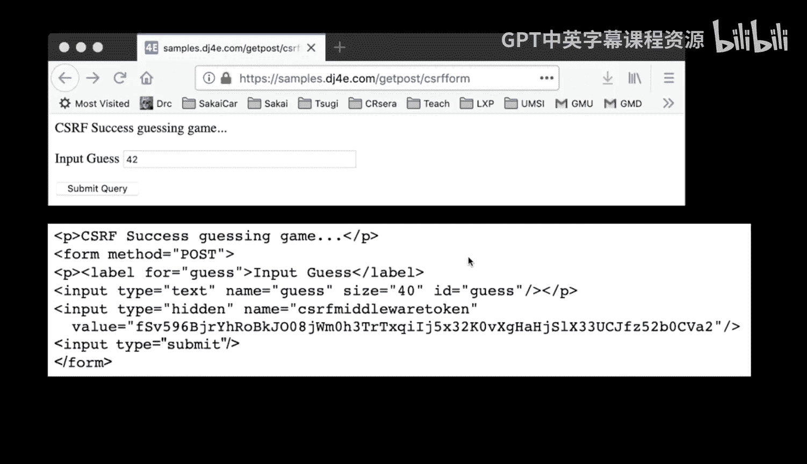

Before it gets to here when you're dispatching from a URLs do Py to this。 And it says。

 you didn't tell me not to do CSsrf， and it's not done properly。 so'm to blow you up。

 So if it's going to work， it's already worked。 the fact that we've come in here and we're dumping this stuff out of the post。

 that's just sort of like we see it。 but it would have blown up before it would have even got to our code at that point。

 but we do get it and see it as post data， we don't need to because if by the very fact that our view is running。

 means that the CSrf processing has been successful。 And again。

 the rogue system has to somehow get its hands on this。 the actual number of the CSRf。

 And that changes every time you log in。 And literally it could change every hour or so or whatever。

 And so it's a hard number to guess and it's hard number to get your hands on。

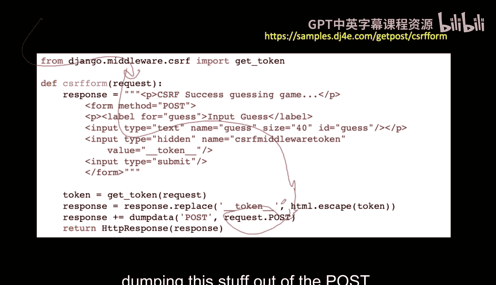

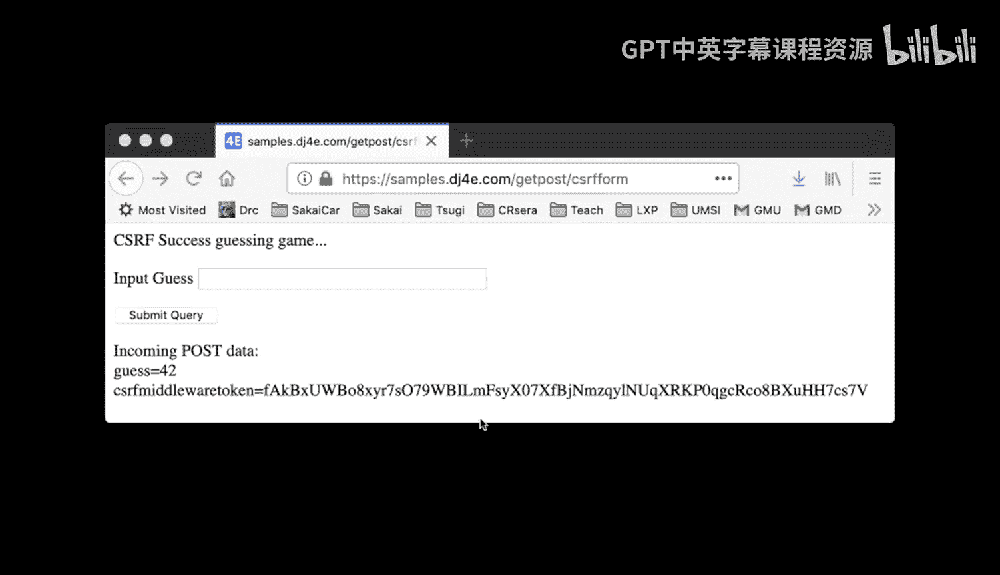

Now。That manual thing is not the easiest way to put this in。 There's the easy way in CSRf。

 you simply say， so here's our form， here's our slash form。

 I do all the stuff I want to do that I want to do and then I use the code is called template tag when you have CSRf enabled in your Python you have a template tag of CSRf underscore token and that emits the input。

 the type equals hidden the right name and all that stuff。 So you as the developer using templates。

 you don't have to know anything about that and so that's how we do CSRf。

 and the only other thing we've got is guessing game and then we're going to pass a message into that and we're going to do that in a bit we're going to use this for a whole bunch of little examples So kind of remember this particular guess at HTMLml template But the key right now that we're talking about is the fact that we've got this CSRf token in Now I'm going to write a bunch of guessing games and these guessing games I'm actually going to start checking the guesses。

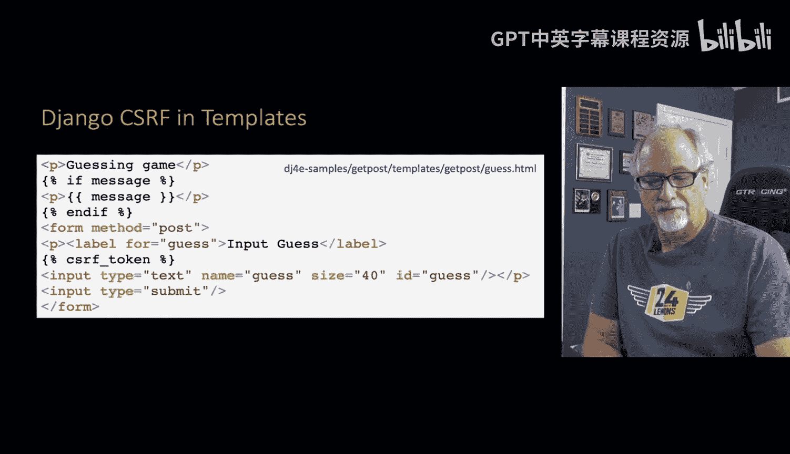

So I'm going to have a function in this view that's got a called check guess and it's pretty simple。

 it returns a string or false If the guess is an actual non falsealse thing we check to see if it's too low。

 too high or right on time or if it doesn't if it doesn't if it doesn't convert if this end guess throws a trace back well then we'll say bad format equals guess and then just because it probably came from the user we're going escape it and then send that back so whatever it does we're going to send back a nice little message going back。

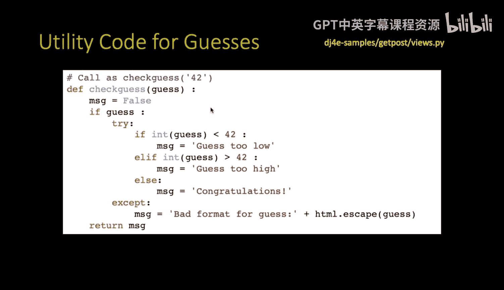

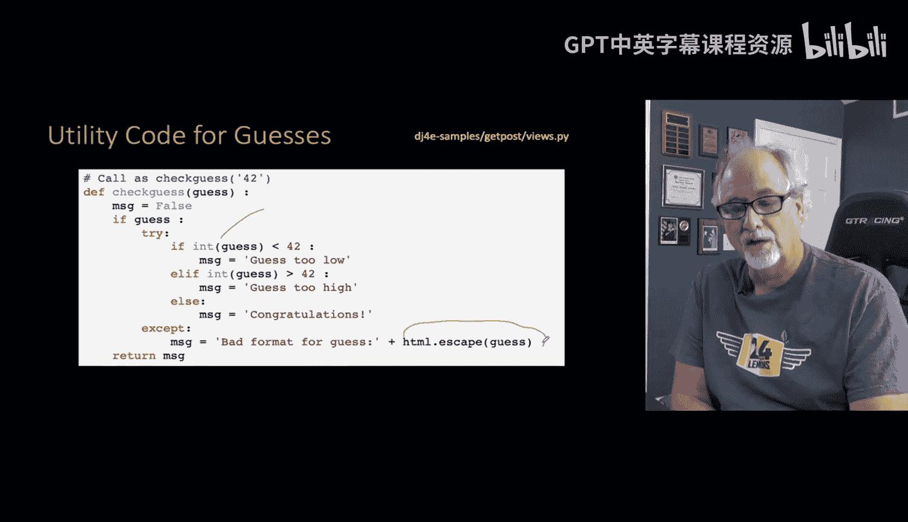

And so here is a simple guessing game that we're going to do and if you so we're using a viewbased view a classbased view this time。

 of course we extend the class view and remember how it works is it's not just a function。

 we actually have two methods， one is a get request and the get is called when we are receiving get request and the post is called when we're receiving a post request this alone is one of the nice reasons to do this。

 you don't actually have to say if it's a get guess get do one thing if it's a post to another thing。

 we just have two methods and Django properly routes the requests in and so this is going to be a form post So on a get。

 we just render with no messages we render with no messages there and we have a CRRF token that goes out so we just render it。

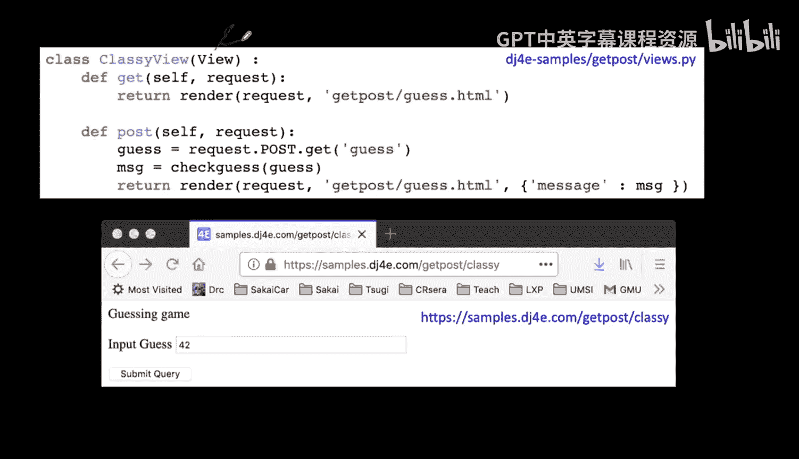

Then we'll click the button so that this render right here will produce this page。

 then we type in the guess of 42 and we hit submit query， and then that bundles it all up。

 including CSRF and goes to the post。 the CSRF as long as we put it in that template。

 we don't have care because before that post method gets activated。

 CSRF has been processed and we get a 403 if the CSRF isn't right so if we go back up here。

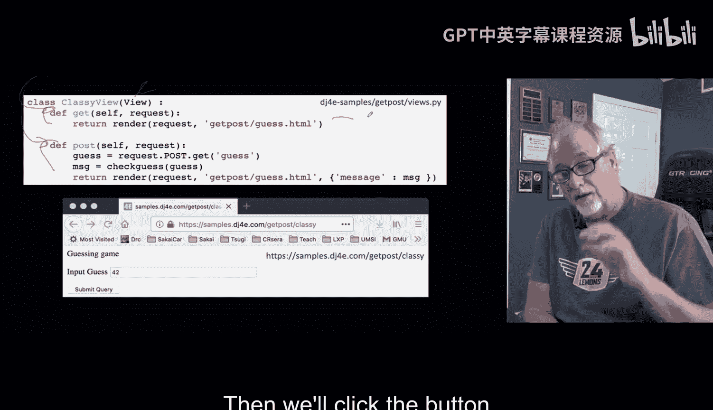

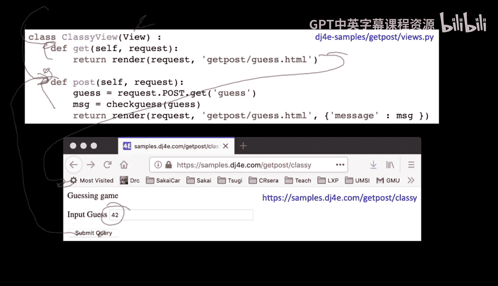

You knowAnd you don't put this in and you run this code， the CSRF token， you don't put it in。

 then when you hit the it's never going to make it to the post， I mean。

 it blows up in route to the post。 If the CSRF doesn't happen。

 but we've got CSRF and it's all automatic。 we just throw that one line inside of our form and that's all we've got to do so。

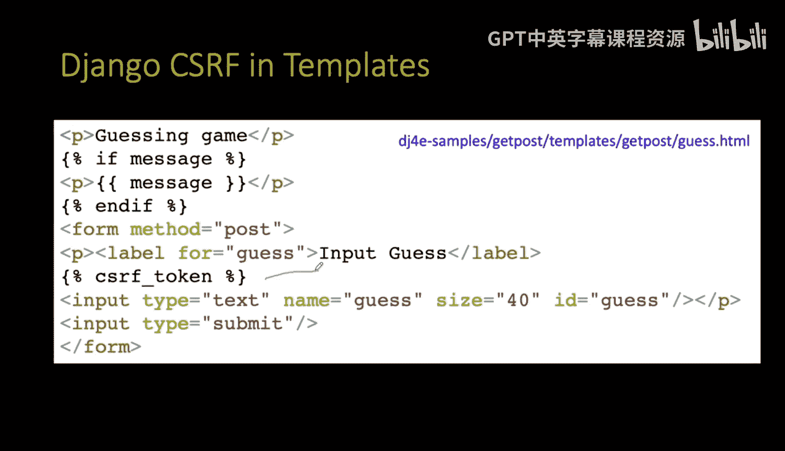

We put 42 in， we hit submit query， pass the CSRF it comes in， so we grab the post data。

 the guess from the post data， we call my little check message。

 check guess that's going to give me that little message， whether it's too low。

 too high or some kind of other mistake and then I'm going to pass in a context。

 the string message has that string and if then we go I have it down here have it up here。

 so then the message comes out So you'll notice I've surrounded this by an if so that message is false or not present。

 then it doesn't put anything out， but if it is it actually puts the message out。

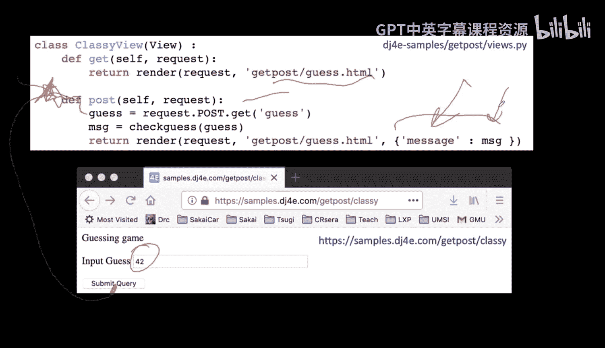

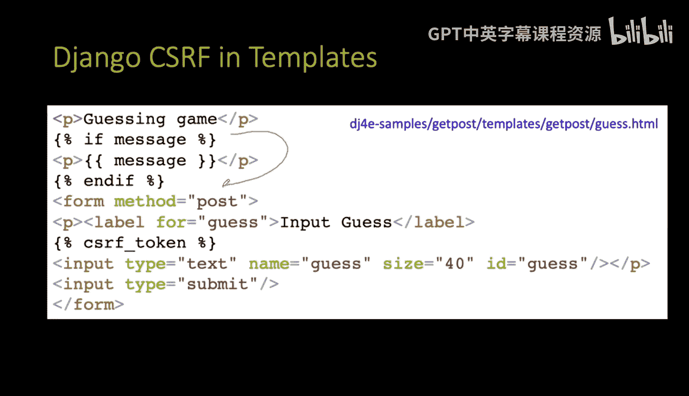

And so。

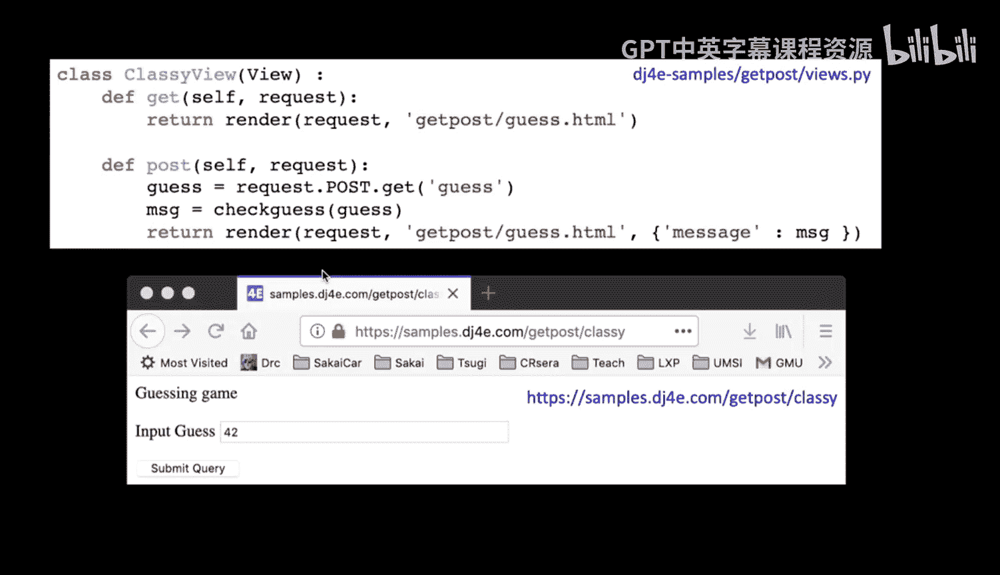

Out comeses the guess。🎼And so this is what it looks like when then we do a get request right we see this。

 then we're going to see all this you know stuff， we're gonna type our number in。

 we're going to hit submit query and then it's going to fire up a post request and so then it's going to come back into the post request it's going to get the guess from the post data it's going to check it and then it's going to pass the message in and so the message is going to come out here and then and then we're going to return that page you're going to see something like congratulations 42 so that took that was part of the post and so we now have made a successful guessing gate。

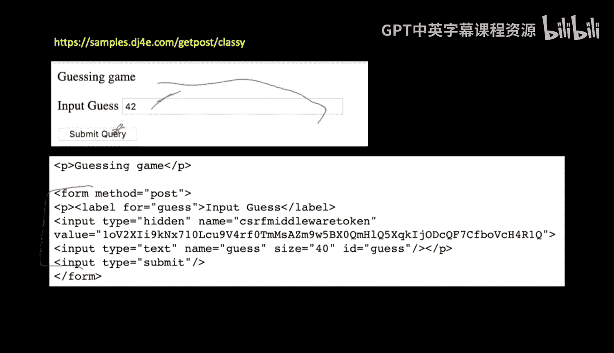

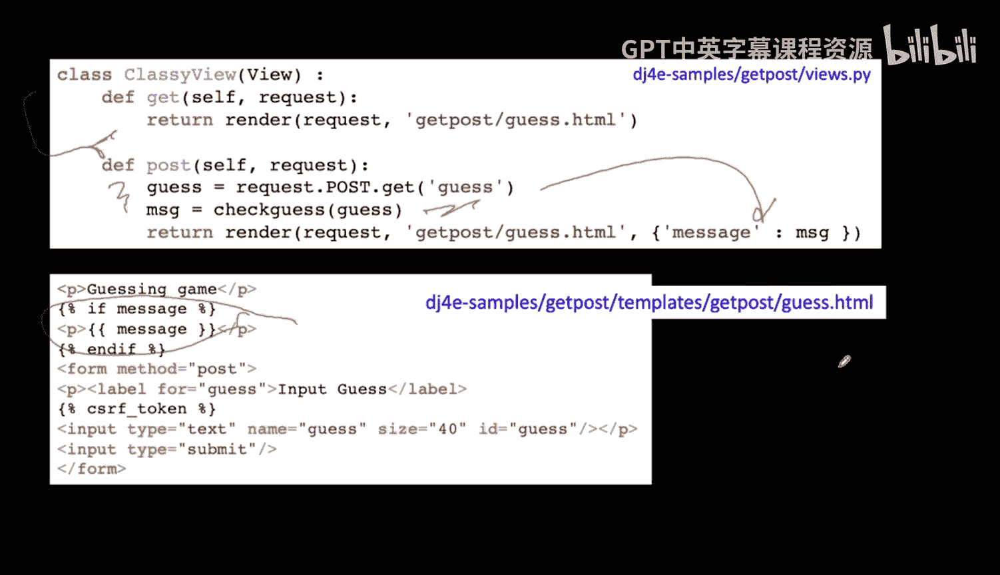

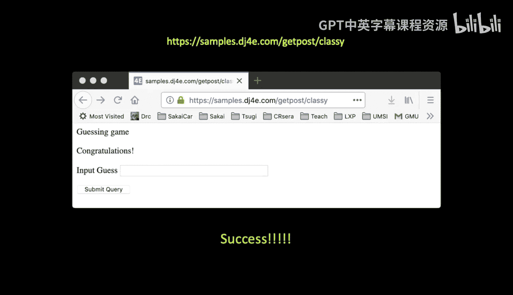

So next what we're going to talk about。Just when we get something work and there's always something that we have to say。

 oh but there's a little detail that we forgot about。

 so up next we'll talk about post and refresh which is a little problem that we're just going to have to fix。

