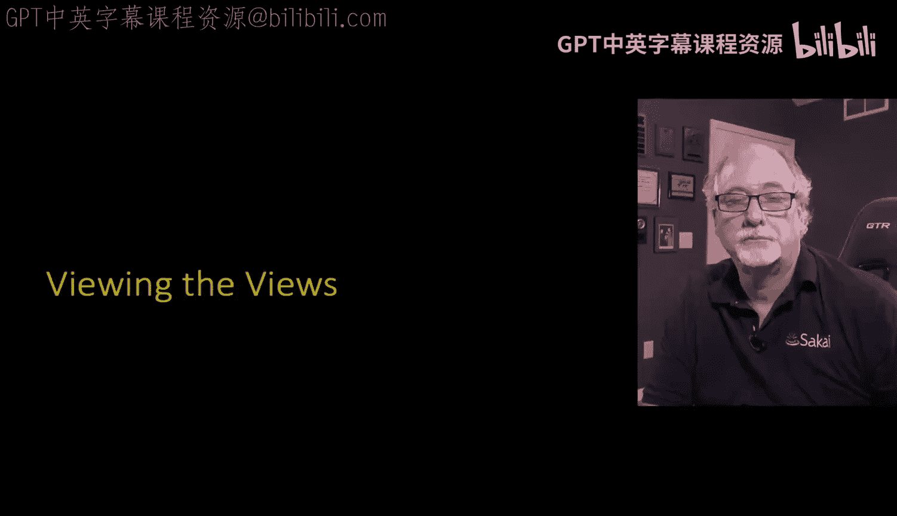
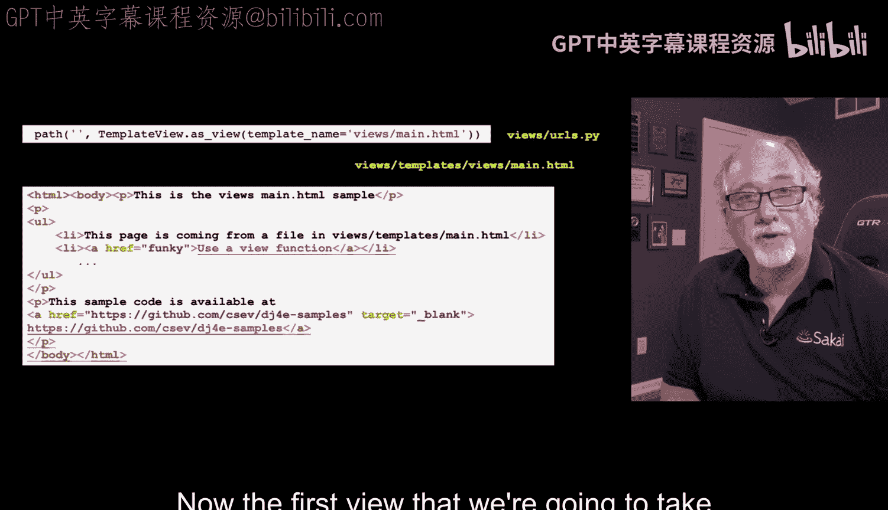
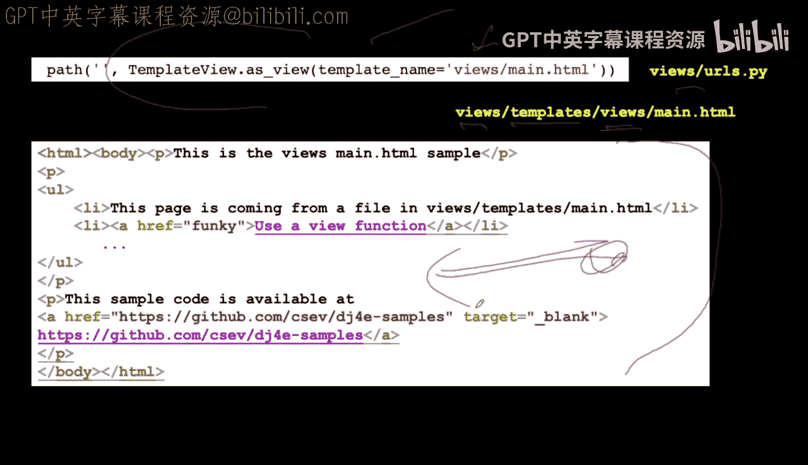
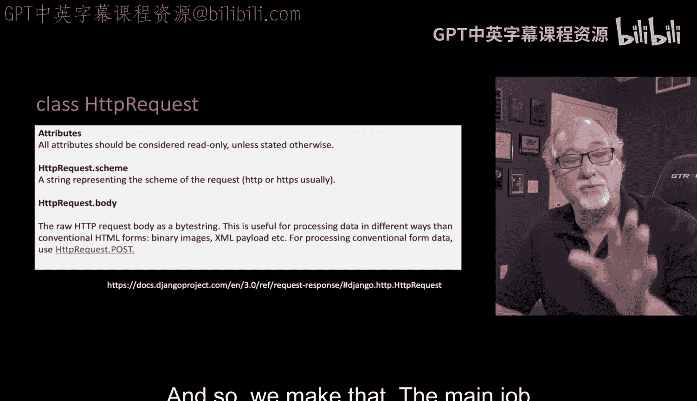
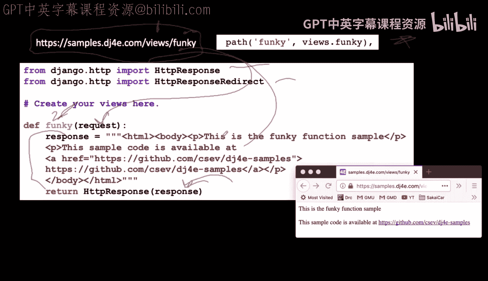
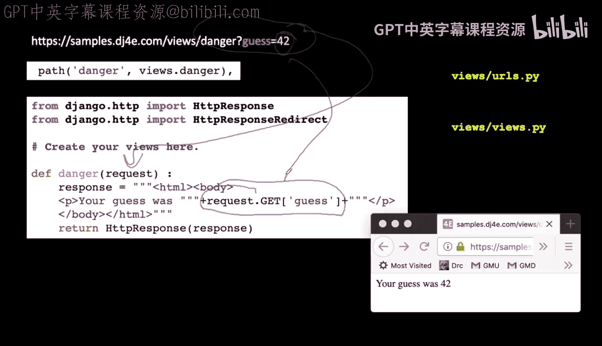
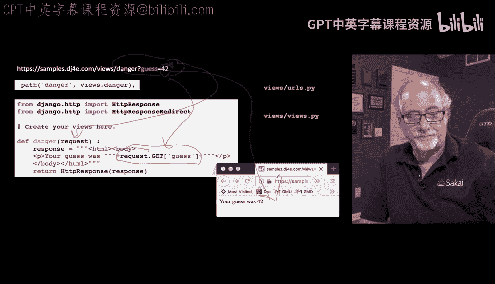
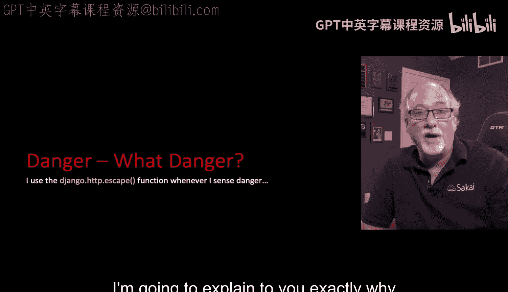

# Django for Everybody：03_01_02：Django视图



在本节课中，我们将学习Django视图（Views）的核心概念。视图是处理Web请求并返回响应的关键组件。我们将探讨如何编写视图代码，包括使用无需编写Python代码的预定义视图，以及如何编写自定义视图函数来处理请求和响应。

---

## 静态HTML视图



上一节我们介绍了视图的基本概念，本节中我们来看看如何创建一个简单的静态HTML视图，而无需编写任何Python逻辑。

Django提供了一个名为`TemplateView`的预定义类视图。我们只需在`urls.py`中配置它，并指定一个模板文件，Django便会自动读取该HTML文件并将其发送回浏览器。这是一种常见的模式，适用于仅需返回静态内容的页面。

以下是配置步骤：



*   从`django.views.generic`导入`TemplateView`。
*   在`urlpatterns`列表中，使用`path`函数将URL路径映射到`TemplateView.as_view()`，并通过`template_name`参数指定模板文件路径。
*   模板文件的路径结构通常为`{应用名}/templates/{应用名}/{模板文件名}.html`。这种重复应用名的做法是为了避免不同应用间的模板文件命名冲突。

例如，在`urls.py`中的配置代码如下：
```python
from django.views.generic import TemplateView

urlpatterns = [
    path('', TemplateView.as_view(template_name='myapp/main.html')),
]
```
对应的模板文件应位于：`myapp/templates/myapp/main.html`。

---

## 请求与响应对象

了解了静态视图后，我们来看看在需要编写Python代码的自定义视图中，如何处理数据。这涉及到两个核心对象：**请求对象**和**响应对象**。

当Django收到一个HTTP请求时，它会将请求数据封装成一个`HttpRequest`对象，并作为第一个参数传递给视图函数。这个对象包含了所有传入的数据，例如请求方法（GET/POST）、URL参数、请求头等信息。



视图函数的主要职责是处理这个请求，并生成一个`HttpResponse`对象作为返回。响应可以是HTML文本，也可以是一个重定向指令。

一个最简单的自定义视图函数示例如下：
```python
from django.http import HttpResponse

def simple_view(request):
    html_content = "<html><body><h1>Hello, World!</h1></body></html>"
    return HttpResponse(html_content)
```
在这个例子中，`request`参数包含了所有请求信息，函数最终返回一个包含HTML字符串的`HttpResponse`对象。

---

## 处理URL查询参数

上一节我们看到了基本的请求处理，本节中我们来看看如何从URL中提取具体的参数。这在处理用户输入时非常有用。



当用户访问一个带有查询字符串的URL（例如`/somepath?guess=42`）时，这些参数会被存储在`request.GET`对象中。`request.GET`是一个类似字典的结构，我们可以通过键名来获取对应的值。

以下是一个处理查询参数的视图函数示例：
```python
from django.http import HttpResponse

def show_guess(request):
    # 从 request.GET 字典中获取名为 'guess' 的参数值
    guess_value = request.GET.get('guess', 'No guess provided')
    response_html = f"<html><body><p>Your guess was: {guess_value}</p></body></html>"
    return HttpResponse(response_html)
```
如果用户访问`/show_guess?guess=42`，页面将显示“Your guess was: 42”。如果未提供`guess`参数，则会显示默认值“No guess provided”。

---



## 课程总结





本节课中我们一起学习了Django视图的基础知识。我们首先介绍了如何使用`TemplateView`来直接渲染静态HTML模板而无需编写视图函数。接着，我们深入探讨了视图函数的核心，即处理`HttpRequest`对象并返回`HttpResponse`对象。最后，我们学习了如何通过`request.GET`字典来获取URL中的查询参数，从而实现基本的动态内容渲染。掌握这些概念是构建Django Web应用交互功能的第一步。