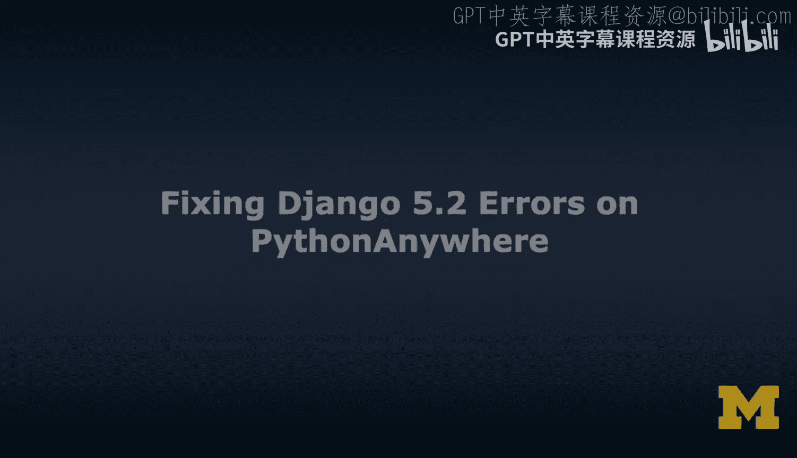
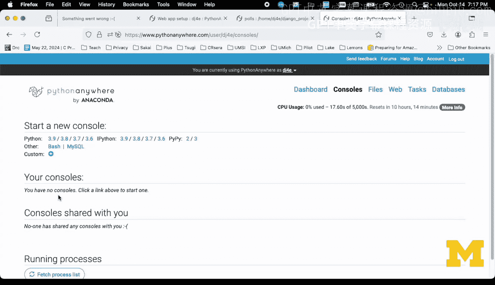
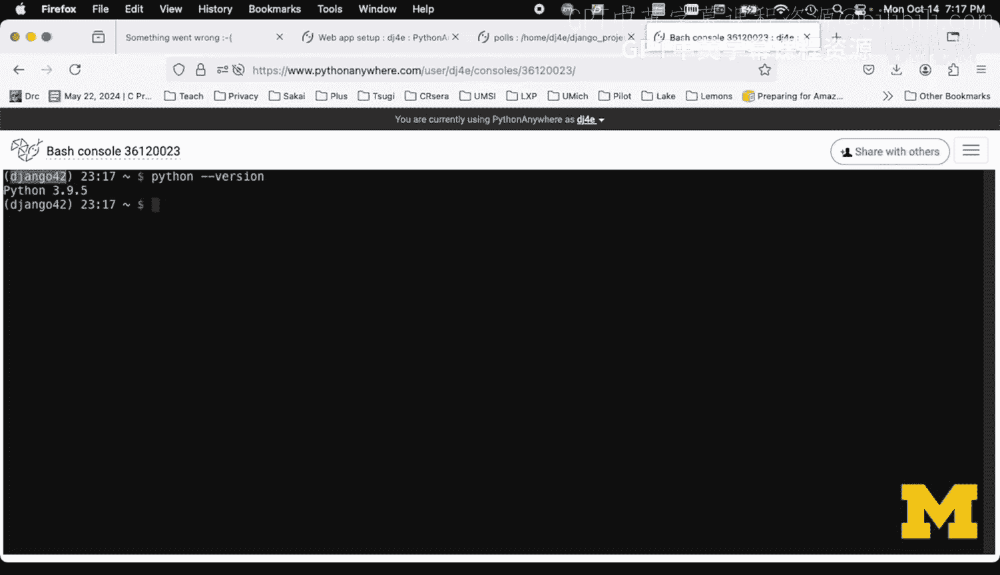
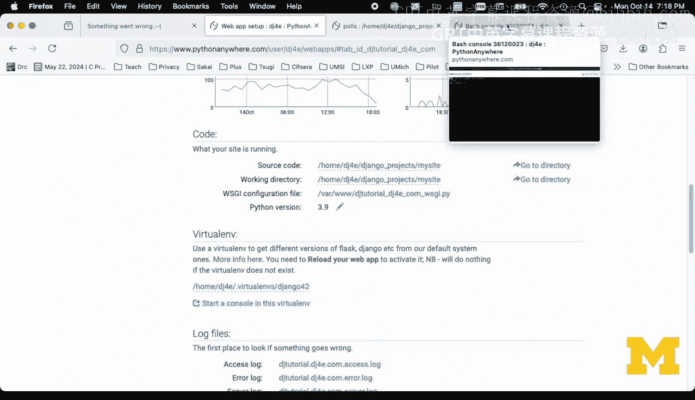
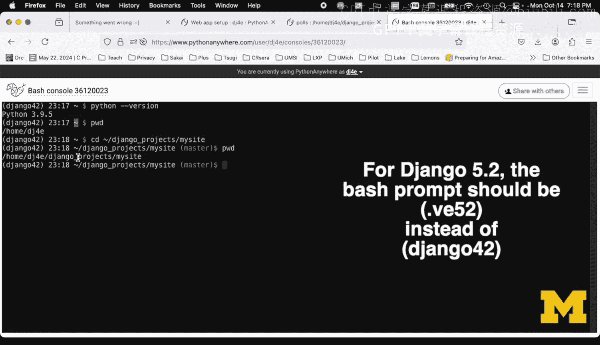
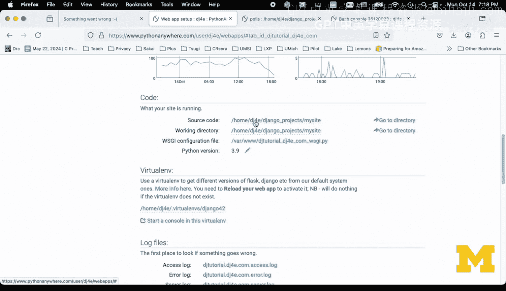
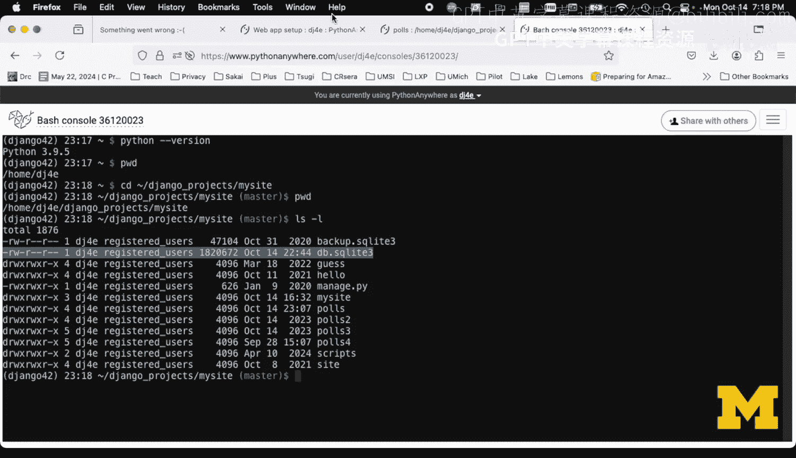
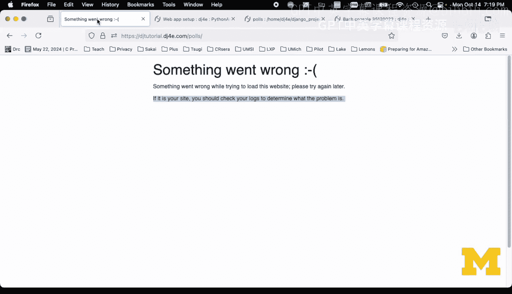
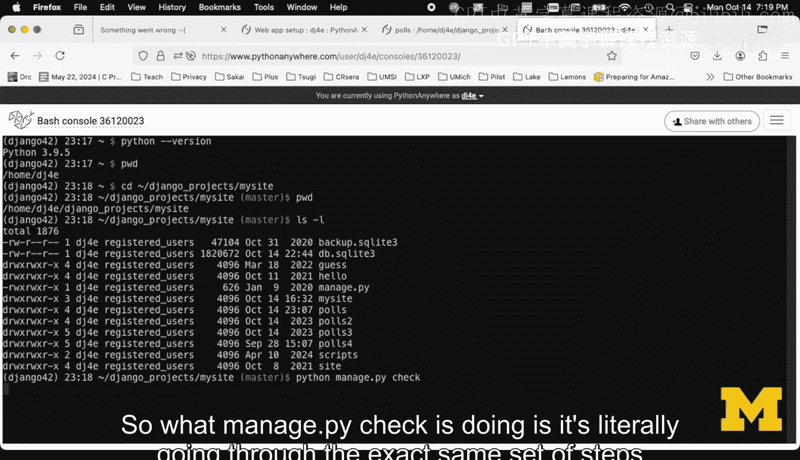
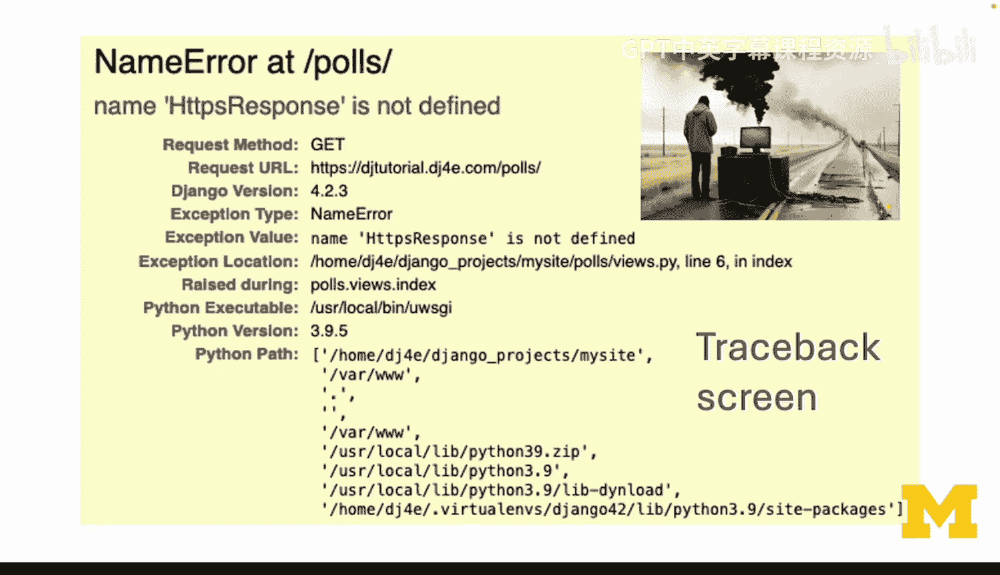

# Django for Everybody： 05： 修复PythonAnywhere上的Django应用错误 🐛




在本节课中，我们将学习如何在PythonAnywhere平台上调试和修复Django应用中的两种常见错误：**启动失败**和**运行时错误（Traceback）**。我们将通过具体的步骤和命令，帮助你快速定位并解决问题。

---

## 概述

当你在PythonAnywhere上开发Django应用时，可能会遇到两种主要错误。第一种是**启动失败**，此时应用完全无法启动，页面显示“Something went wrong”。第二种是**运行时错误**，应用可以启动，但在处理请求时会抛出异常，显示黄色的错误追踪（Traceback）页面。本节将分别介绍这两种情况的诊断和修复方法。

---

## 启动失败：诊断与修复

上一节我们概述了两种错误类型，本节中我们来看看如何解决第一种——启动失败。当你的应用完全无法启动时，需要按以下步骤进行诊断。

### 诊断步骤

以下是诊断启动失败问题的标准流程：

1.  **打开Bash控制台**：在PythonAnywhere控制面板中，创建一个新的Bash控制台。
2.  **检查虚拟环境**：确保你位于正确的虚拟环境中。虚拟环境决定了Python版本、Django版本和所有依赖包。你可以使用以下命令检查：
    ```bash
    python --version
    ```
    同时，确认Web应用配置中的虚拟环境名称与此处一致。
3.  **进入项目目录**：使用`cd`命令切换到你的Django项目目录。通常路径类似`/home/你的用户名/django_projects/mysite`。你可以使用`pwd`命令确认当前路径。
4.  **运行Django检查命令**：这是最关键的一步。在项目根目录（即`manage.py`文件所在目录）运行：
    ```bash
    python manage.py check
    ```
    这个命令会模拟Django的启动过程，加载`settings.py`、`urls.py`以及所有已安装的应用，并检查其中的Python代码错误。

### 解读错误信息

运行`python manage.py check`后，如果存在错误，你会看到一个追踪信息（Traceback）。解读它的关键是找到错误链条的末端，那里通常指向你的代码。

例如，错误信息可能显示：
```
File “/home/.../polls/views.py”， line 1， in <module>
    from django.https import HttpResponse
ModuleNotFoundError： No module named ‘django.https’
```
这表明在`polls/views.py`文件的第1行，你错误地导入了`django.https`，而正确的应该是`django.http`。



### 修复与验证

1.  根据错误提示，打开对应的文件（如`polls/views.py`）并修正错误。
2.  保存文件后，**不要立即点击Web界面的“重载”按钮**。建议再次运行`python manage.py check`命令。如果命令执行成功且没有输出错误，说明代码层面的启动问题已解决。
3.  此时，再返回PythonAnywhere的Web应用配置页面，点击“重载”按钮来重启你的应用。
4.  刷新你的应用网页，检查是否恢复正常。





---







## 运行时错误：解读Traceback



解决了启动问题后，应用可能还会在运行中出错。本节我们来看看如何处理运行时错误，即黄色的Traceback页面。



当应用能够启动但处理请求时出错，你会看到一个包含详细错误信息的黄色页面。这实际上是一个好迹象，说明Django框架本身和你的应用基础配置是正常的，问题出在具体的业务逻辑代码上。

### 分析Traceback页面

Traceback页面包含了错误的完整调用堆栈。分析时，请关注以下几点：

1.  **错误摘要**：页面顶部通常会有一个简短的错误描述，如 `NameError at /polls/`。
2.  **错误详情**：描述下方会明确指出错误类型和相关信息，例如 `name ‘HttpsResponse’ is not defined`。
3.  **本地变量**：页面还会显示错误发生时相关函数的局部变量，这对理解上下文非常有帮助。
4.  **追踪路径**：你需要从下往上阅读“Traceback”部分。最下面的行通常是最初引发错误的你的代码文件。向上追溯，可以看到Django内部是如何调用到你的代码的。

例如，一个典型的错误可能指向：
```
File “/home/.../polls/views.py”， line 6， in index
    return HttpsResponse(“Hello， world”)
NameError： name ‘HttpsResponse’ is not defined
```
这清楚地指出，在`polls/views.py`的第6行，你使用了一个未定义的变量名`HttpsResponse`（正确应为`HttpResponse`）。

### 利用代码编辑器提示

在PythonAnywhere的在线编辑器中修改代码时，可以利用其自带的错误提示功能。编辑器会用黄色三角形标记出它检测到的问题，例如未使用的导入或未定义的变量名。修复这些提示后，黄色标记会消失，这能帮助你提前避免一些错误。

修复代码后，保存文件并点击Web应用配置页面的“重载”按钮，然后刷新你的应用页面即可。

---

## 查看错误日志

如果问题依然存在，或者你想查看历史错误记录，可以查看PythonAnywhere提供的错误日志。

1.  在Web应用配置页面，找到“Error log”的链接并点击。
2.  日志文件按时间顺序记录，最新的错误在文件底部。
3.  日志中的错误信息与你在Bash中运行`python manage.py check`或Traceback页面看到的信息是一致的，只是查看方式不同。

---

## 总结

本节课中我们一起学习了在PythonAnywhere上调试Django应用的两种核心方法：

1.  **对于应用无法启动（“Something went wrong”）**：使用Bash控制台，进入项目目录，运行 `python manage.py check` 命令来定位启动过程中的代码错误。
2.  **对于运行时错误（黄色Traceback页面）**：仔细阅读Traceback信息，从底部开始找到你的代码文件及出错行，根据错误描述进行修复。善用编辑器的实时错误提示功能。




记住，`python manage.py check` 是诊断启动问题的利器，而耐心阅读Traceback是解决运行时错误的关键。通过反复实践，你会越来越熟练地处理这些调试场景。