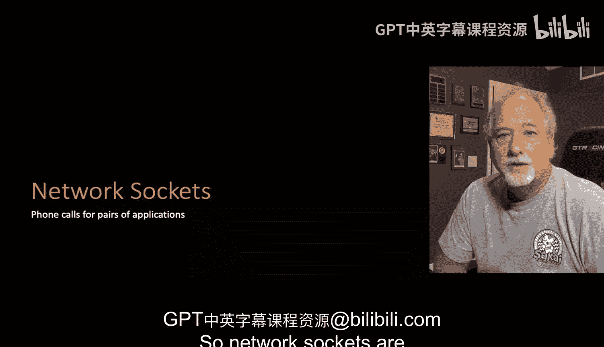
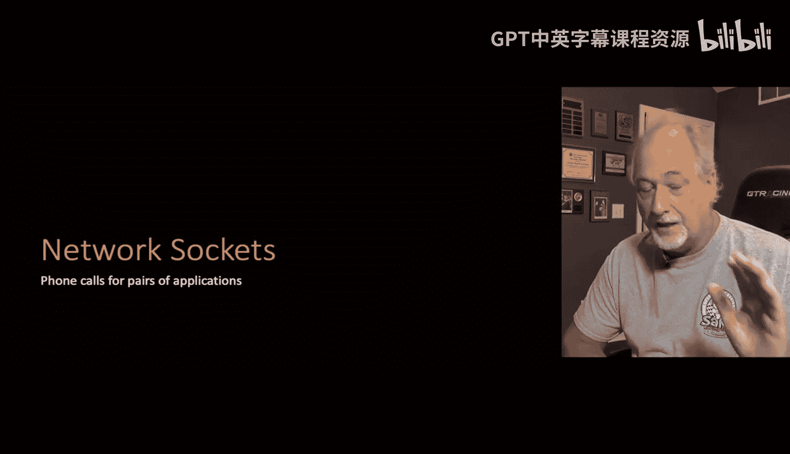
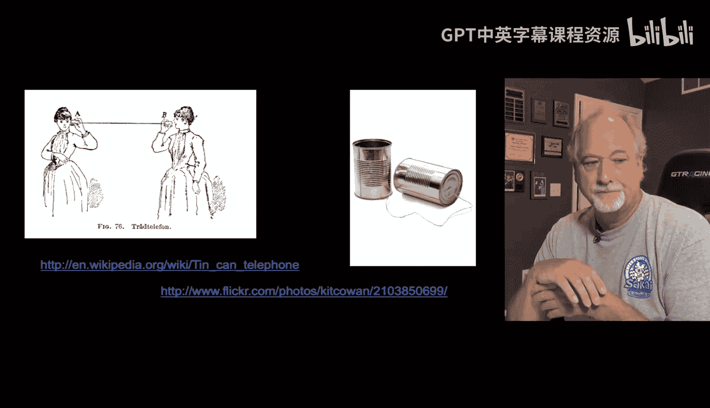
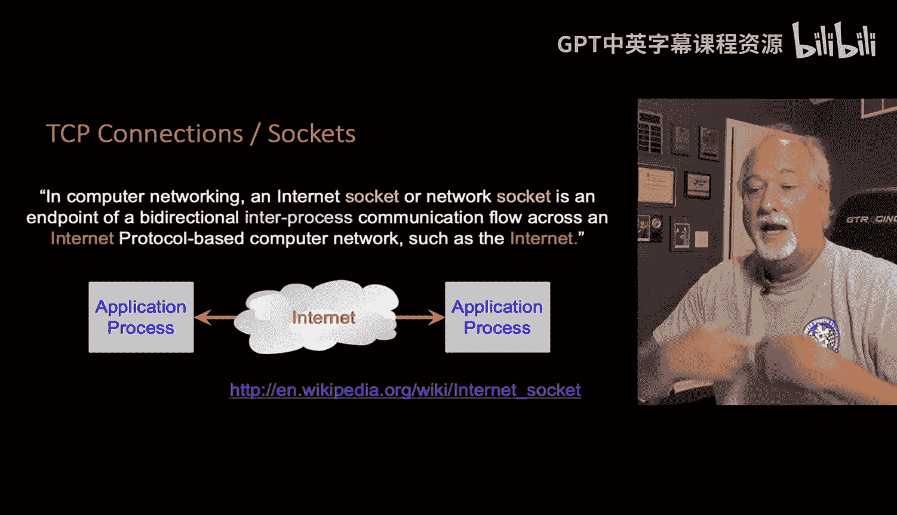
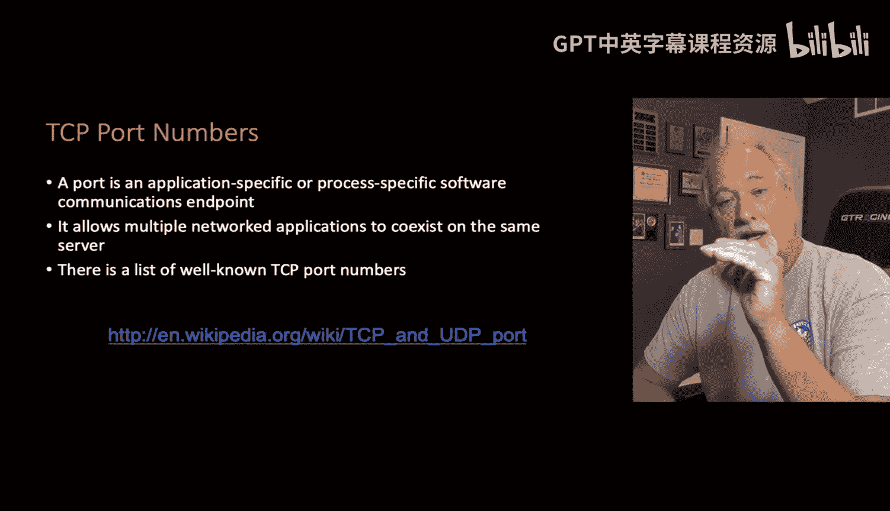
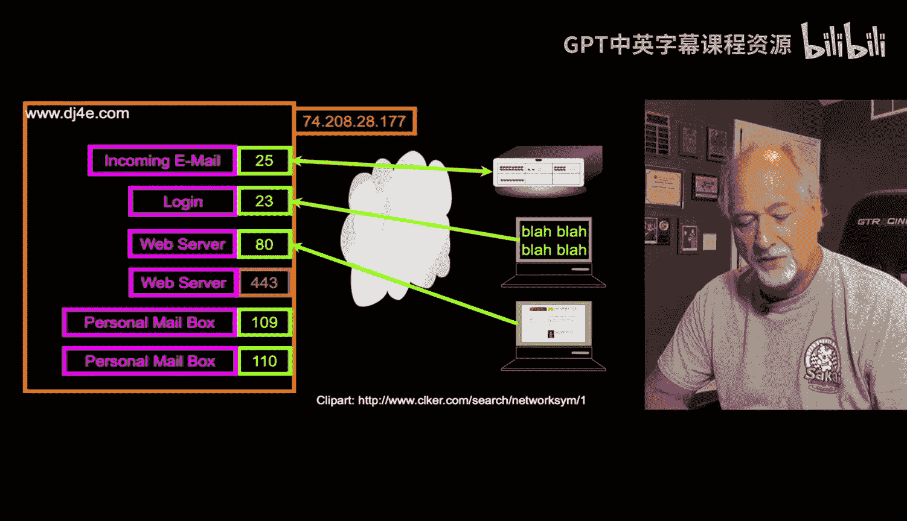

# Django for Everybody：08_02_04：网络套接字与连接 🔌

在本节课中，我们将要学习网络通信的基础概念——网络套接字。我们将了解套接字如何像电话系统一样工作，以及计算机如何通过IP地址和端口号进行通信。

## 网络套接字的概念 📞

网络套接字是计算机进行通信的方式。这个概念在20世纪60年代设计网络软件时被提出。其核心思想是，计算机之间的数据交换并非通过永久连接进行，而是像打电话一样：建立连接、交换数据、然后断开连接。

当时的设计者认为，由于未来会有大量计算机和数据源，让每台计算机都永久连接到所有数据是不现实的。他们设想了一个协议：当需要数据时，计算机“拨号”连接到数据源，获取数据后便释放连接。这种“连接-交谈-断开”的模式，使得互联网能够扩展到数十亿设备，就像电话系统能够服务全球所有人一样。

## 套接字的工作原理

在软件中，套接字是通过一个名为“Sockets”的抽象库来实现的。套接字本质上就是计算机之间的电话呼叫。

以下是套接字通信的基本步骤：
1.  **发起呼叫**：一方知道另一方的地址并发起连接。
2.  **等待应答**：被呼叫方接受连接。
3.  **双向通信**：连接建立后，双方可以进行读写操作，就像操作一个文件，但可以同时读写。
4.  **遵循协议**：通信双方需要遵循约定好的协议，以确定谁先发送、谁先接收，就像打电话时说“你好”一样。

重要的是，即使你只是在浏览器中请求一个文件，你的程序也是在和服务器上的另一个应用程序对话。这个服务器端的应用程序负责读取文件并将其发送出来。例如，当我们上传图片时，后续查看图片也需要通过服务器端的应用程序来决定是否有权限访问，而不仅仅是直接获取文件。

## IP地址与端口号 🌐

上一节我们介绍了套接字的基本工作模式，本节中我们来看看计算机如何精确地找到彼此并进行对话。这依赖于IP地址和端口号系统。

每台联网的计算机都有一个IP地址，它是一个数字标识。目前主要有两种IP地址格式：IPv4和IPv6。IPv4地址由四组用点分隔的数字组成，例如 `142.16.42.114`。

由于互联网通信本质上是应用程序之间的对话，我们需要一种方法来区分同一台计算机上运行的不同应用程序。这就是TCP端口号的作用。你可以把端口号想象成电话分机号：IP地址是总机号码，端口号是内部分机。

`IP地址 : 端口号`

因此，我们不需要为每个应用程序分配一个独立的IP地址，而是通过“IP地址+端口号”的组合来定位特定服务。

## 常见的端口号与应用

以下是互联网上一些常见服务及其对应的标准端口号：

*   **25**：用于服务器之间的电子邮件通信（SMTP协议）。
*   **23**：用于旧的远程登录服务（Telnet协议）。
*   **80**：用于不加密的Web通信（HTTP协议）。
*   **443**：用于加密的Web通信（HTTPS协议），这是当前的首选方式。
*   **109/110**：用于邮件客户端（如Thunderbird）从服务器获取邮件的协议（POP3）。

在上图中，客户端（可能是一台个人电脑或另一台服务器）通过连接到IP地址 `74.208.28.177` 的 **25** 号端口来发送电子邮件。箭头代表不同的协议，这意味着与电子邮件服务器通信需要使用电子邮件协议，与Web服务器通信则需要使用HTTP或HTTPS协议。

在开发Web应用时，我们最常打交道的是 **80** 端口（HTTP）和 **443** 端口（HTTPS）。

## 过渡到HTTP协议

了解了网络套接字和端口的基础后，接下来我们将简要看一下超文本传输协议（HTTP）。

HTTP正是我们用来与 **80** 或 **443** 端口上的Web服务器进行对话的协议。在接下来的课程中，我们将深入探索这个构成万维网基础的协议。

## 总结

本节课中我们一起学习了网络通信的核心机制。我们了解到网络套接字是计算机间临时性、协议化的“电话呼叫”。通信通过“IP地址”定位计算机，再通过“端口号”定位计算机上的具体应用程序来实现。这种设计使得全球数十亿设备能够高效、有序地进行数据交换，构成了当今互联网的基石。