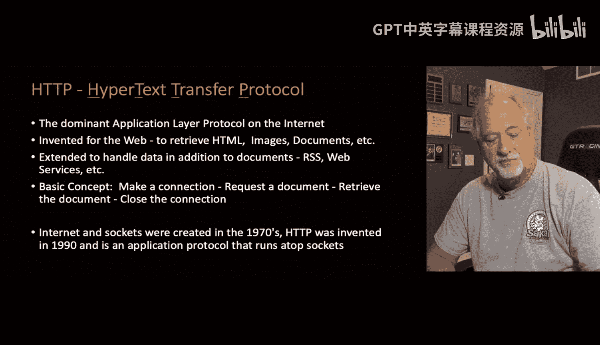
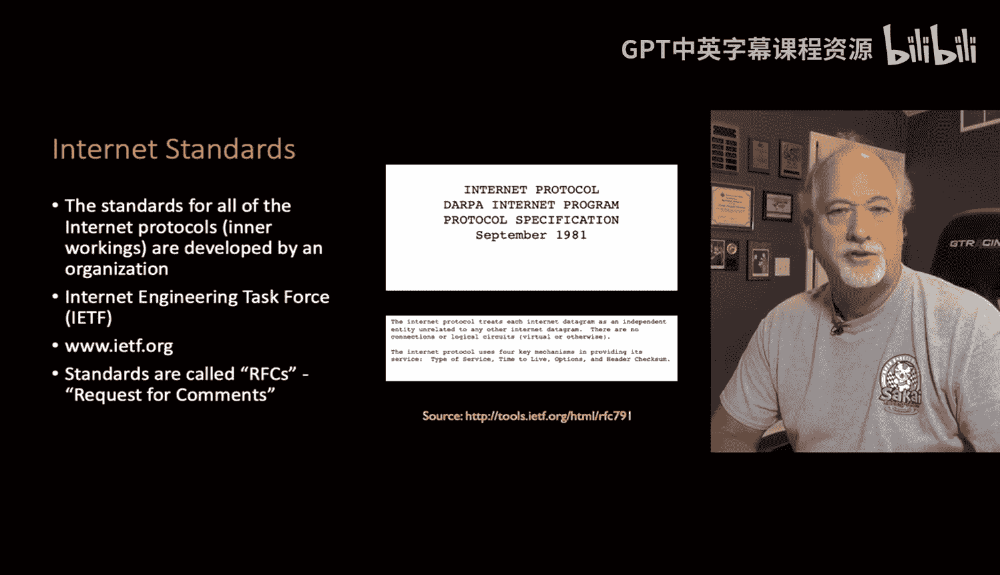
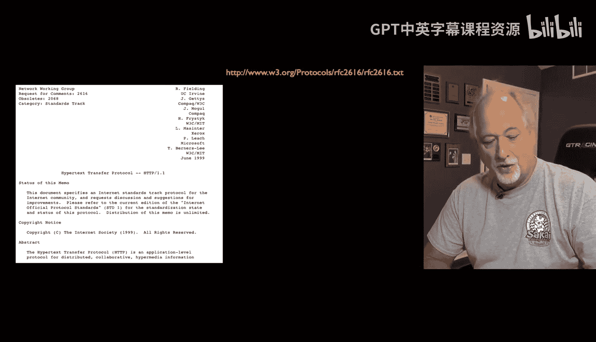
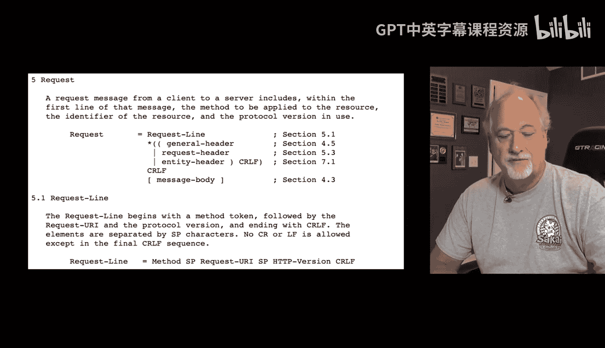
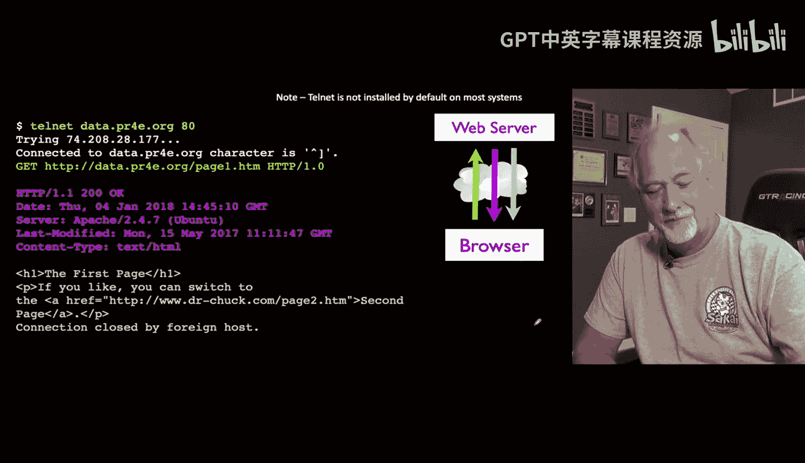
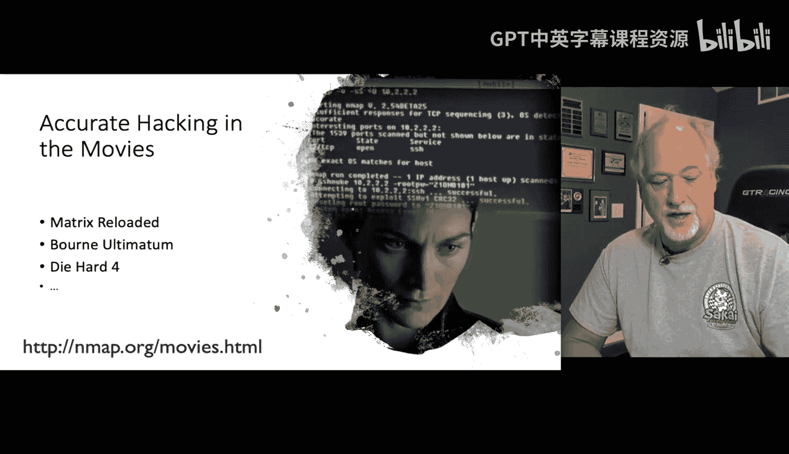
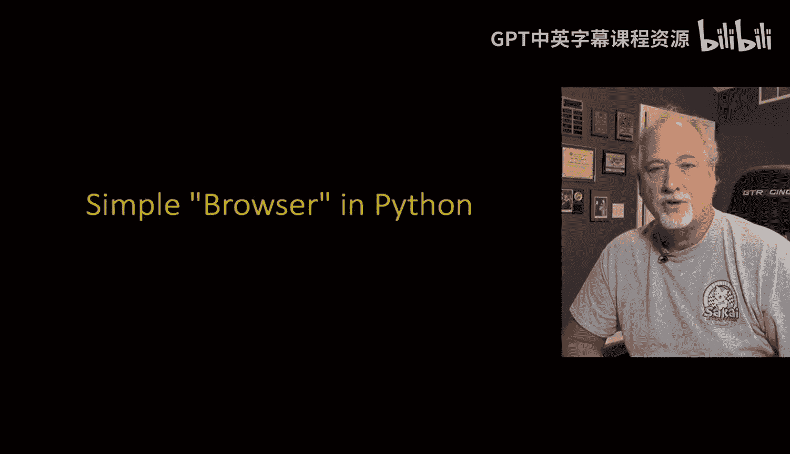

# 密歇根大学《给所有人的Django课程（简介、开发Web APP、特征和库、JavaScript和JSON）｜Django for Everybody》中英字幕 p69 09_02_05_超文本传输协议.zh_en -BV1Kt421V7EE_p69-

Hypertex transfer protocol is the protocol that browsers use to talk to servers。 Now。

 we've used it for all kinds of other things because it turns out that it's a super simple and super elegant protocol。

 but this goes to a long time ago this protocol was invented in 1990， which is。

Like going on 30 years ago， yeah， going on 30 years ago now or more。And there were many protocols。

 you would have one piece of software and there was server software and client software。

 you had to match them up and then you talk to the right port with this server software and one of the inventions of Tim Bernerssley and Robert Kayu at CN was that we came up with this notion of instead of lots of pieces of software we would have one piece of software called web browserrower and it would be multiprotocol。

And so we have this thing called the URL or uniform resource locator and we just sling these around。

 we just use them， but these things， this was itself an amazing innovation in 1990 because in the old days it'd be like。

 use this piece of software and talk to this address。

So the URL captured three really important very separate things。

 the first thing it did is allowed for multiple protocols Now the one that you mostly have seen is HtTP or HB。

 but that's a protocol FTP colon or mail to colon might be the other ones that you've seen and then a host。

And then a document， and that host is a domain name。

 which is a nice symbolic way to get a server address。

And that eventually resolves to an IP address like 141， 206， 1422 or something。

 and then document within that server and that slash page 1。

htm is the document in the server and I'm just saying before 1990 there were many protocols and we did many things。

 but after 1990 this one protocol HtDP。Found its way into so many awesome solutions that it's by far other than email the dominant protocol that we use on the internet。

Like I said， it was invented at CEN by Ters Lee and Robert Kayu to retrieve documents and images and as soon as they built it because it was all the other protocols that came mostly the other protocols were kind of complex because we're computer scientists and we make complex things and we love complex things and we're very。

 very good at complex things， but this was you know when web was being built。

Tim and Robert were not like we're going to make the greatest thing ever。

 we're just going to make a simple thing， so they made a simple thing。

 but it turned out to be the greatest thing ever because。Different engineers would be like， oh wow。

 I can use that a little different way and it was the grounding of it was super simple and the basic concept was you connect to a server。

 you figure out where it is， you send a single command with a bit of extra data and then you get back something document。

 it could be an image it could be data it could be HTML and it was really amazing and so the sockets。

 the underlying sockets are the things that make the phone call HTTP is what we do once these phone call has been established。

So one of the things that made the internet so successful starting in the 1960s was a radical openness。

 a very。We're all around the same campfire feeling， very friendly。

 respectful that still allowed criticism， there wasn't like one super genius that designed this or one company that designed this。

 this was a collaboration and the collaboration was around a set of open standards and meetings to help build these standards and they were called RFCs。

 they are called Request for Com and there was a group that built these called the Internet engineeringing Task Force。

 the IETF and the request for comments is a fun notion we're looking here at a September 1981 document which is 40 years old about now and it's called a requestquest for Com and the idea is as engineers。

We might have a design that， you know everyone thinks is the greatest thing ever。

 but we should always question。No design is perfect。 No design is beyond question。

 No design is beyond commentary。 And so even when they're 40 years old and use world and dang amazing。

We still say there is room for improvement and so this talks about I think this one's IP and there's an IPV6 there's another one if you look for this RFC that we're looking at here there'd be IPV6 and you'd start reading it and it's pretty dense reading but as an engineer it gives you all the details to build a router or build a piece of software or build whatever and these are 1100% public documents the idea was is that no company because literally the companies that were around in 1960 if they had said。

Burrows or Sperry owns the Internet or digital equipment owns the Internet。

 They're all out of business because they didn't make good choices。

 but the market was able to make good choices。 And because the commons were these open standards and open specifications。

 new companies like Sun microcrosystems and new operating systems like Linux could come in and even Windows could come in and participate as full participants because they just read these specs and all of a sudden they're interopering with everybody else。

 This is fundamental and foundational to how the Internet works。

 And I'm not saying you're supposed to go read them。

 But it's just fascinating to understand that the entire technological infrastructure upon which the Internet is built is free。

License free， royalty free， and you could build a brand new。

Gdget and you could hook it to the Internet by reading these specifications。

 You don't have to pay a developer's license or nothing。 It's dang， it's cool。 sorry。

 I'm just a little bit too excited about that。 So let's take a look at one of these in particular。

 Now this this is probably supplanted， but we'll look at RC 2616。 They go up in numbers。 And so。

This is HTTP Hypertext transferfer Pro， and if you wanted to build a web browser or a web server。

 you could read this document， go ahead， read the document。

And if you read down far enough， you'll say， oh， this is how you make a request， blah， blah， blah。

 it's got a header and it's got like a carriage turn line feed and then a message body and you got to do this and this is what it looks like。

This is how it works right and so at some point you're deep in this document and you're finding out in this page right here of this document how your browser is supposed to format it。

 and this tells both the client and the server what the rules of the protocol are。

Now， it's a lot easier just for me to tell you。So you connect to the server on a socket。

 usually port 80 or port 443。And then the client is supposed to make the first。

Sound it makes first request it sends a line with a character turn line feed at the end that has the characters。

 theres other ones but get GET space， a URL space and then a protocol and right now I'm using this HB 1。

0 because I can do it by hand right and and so you ask for a document and then you can optionally send some header information things like what language this browser person at this browser prefers。

You know what are the capabilities of this browser version browser we have so there's a series of things you say give me this document and here's something about the browser that's requesting the document including information like cookies that are being said now so this in case you want to know who is doing this request because you've logged somebody in and set a cookie to indicate that they're logged in that's all sent on this get request but we'll not send the headers。

 there's actually incoming headers and then outgoing headers we'll see these when we start looking at you know Firefox' debugging console。

And so this is an entire interaction that you can do on your laptop now I'm not going to do it for you。

 but I would note that the program Tnet that this uses is been removed from most computers it makes me sad they think of it as a security hole because it doesn't use encrypted connections like Port 80 is is not an encrypt encrypted connection。

 but ultimately you can install， go go search on your favorite search engine and find out how to install Tnet。

 but if you get in a command line， whether it's a Windows command line or a Mac command line or Linux command line and you get Tnet properly installed you can type the following command Tmet。

Data PR4。org 80。And then hit enter and at that point。

 subtnet originally was used to log into computers。

 but if the server we're talking to and the protocol that we're talking to is simple enough and in this case。

 HttP1 is simple enough for us to be able to do this。

We're actually talking to the server because I remember I said that these are applications。

 they're not you're not your browser is not talking to files。

 your browser is talking to an application on a server and the server might give you back a file。

 so it's really talking to a piece of software and we'll see this in more detail in the next section and so what will happen is because the HDB protocol requires that the client speak first。

We have to type now， if you can get this working and type wrong things and you know type a couple enters。

 new lines， you will see that you're talking to a piece of software and it will say you have violated my protocol。

 You're not talking to a thing that has any online help or user interface or anything like that。

 You're talking to a server and your job is to request some data using the proper format because you read the specifications about the proper format。

 right。So in this particular one， we just， it's easier to cut and paste this because some of these servers。

 if you don't type fast enough， they'll be like， you're not a software， you're a human。

 quit playing with me。Like you talk to Facebook or something and you can talk to Facebook and see what happens on port 80 and it will time you out really fast so it's good to have a cut and paste buffer so you paste this get command in。

And the other thing that's important is you got to put an extra blank line and this extra blank line is to indicate that you're not going to send any of those headers if we were going to send things like what language we would prefer or what formats we would prefer as a browser the browser has certain languages and other configurations and login information and that can get sent up to the web server along with the request for the document and we would be to type them in here。

 but we're not going to do that in this very simple we're just going to say enter which means no more headers if you were putting in headers you type header。

 header header header and then enter on a blank line and then the server would know that our request was finished。

 but we can just ask for a page。And then what the server does is it sends us back two pieces of information first it sends us headers。

 the first header is HP 1。1200 okay that's actually a status line now you'd have to go read the documentation on how what that works。

 but for example， 200 means that you got a document。

Another one that you might have seen is 404 it might say 404 not found。

 so if you go to a web page and it doesn't exist， something will say 404 in your browser usually unless it says here's a search box。

 go find it， but you can there's a status and so you might the thing that you're typing page 1。

 hM may or may not be on this server if it is。then you'll get a 200 okay and the data or youll get a 404 and out phone。

And then we get some response data， some header response。

 and this header response looks pretty much like the same format of the data we would asent into the browser if we were sending things like that in there it here its what the data is。

 what the server we're using last modified and one of the important things is what kind of content are you about to see content type in this case is text/lash HTML。

 which means the thing coming next， and then there's a blank line in the blank line is our indication as we're reading this data。

That we finished the header， which is really metadata about the page we're retrieving and the actual page itself。

 and so the rest of this page is the actual data and we know the format of it because we are told before the page starts。

This could be image slash PNG， this could be XMl， the application slash Xml。

 then it could be JSON it could be like anything and then the browser is supposed to un if you this was an image it would be like garble garble garble。

 garble， garble garble right it would be all garbled stuff that we can't really see but the browser knows what a PNG or JPEG looks like and it shows it to you。

And it basically uses this text slash HTML to tell you what's going on。 And so this。

 then your browser has read all this information， it has both the metadata and the data about the retrieve page。

 and then its job is to sort of produce。A pretty rendered version of the page and show it to you。

 and that is the request Re cycle。Again you don't have to do this you can just sort of believe that it's done here。

 but if you want install Tent on your system， it's not a bad thing to install Tnet。

 it's kind of a classic fun thing， it's far less useful than it was in the early days because we used to use TNNe to test everything now we've got like browser developer consoles that are way easier than Tnet but it's kind of a cool thing feel free to do this and you'll be like I know what's really going on。

And。

So I'm a big fan of using the console， of using the terminal of using textbased interfaces。

 I think they're actually way more accessible， I think it's awesome and in a way。

 all these fancy graphical user interfaces distract us from the simplicity of what's going on inside of computers because you think。

 well， or where's the button and the answer is oh there's probably some command inside this computer that does what the button does。

So I have a former student of mine who actually wrote the scene and I think maybe it was matrix2。

 I think this was matrix 2 yeah， matrix reloaded and this scene where Trinity is breaking into the power grid and she is using the console and it turned out that the way this scene was written is it was written exactly as a hacker whether that's a hacker with bad intent or good intent because there are hackers with good intent who are trying to break into your system so they can tell you for you pay them to break into your system so that they can tell your vulnerabilities but you can take a look at the analysis of this little scene and just。

This sort of is just one of the cool things about me teaching people about how to use the command line and increasingly me teaching people about how to use Linux。

 I really think that。🎼It's okay to know your Mac and Windows command line。

 but really increasingly the world in the server world and we're starting to work on web servers in this class。

 and you might as well start learning some Linux because that's an important skill。

 just write in some Javava code or Ruby code or django code， That's a skill。

 But knowing how to start the server to bug your application， find log files， etc ceter。

 in the command line is really important in real production systems because we're going to play in some simplified environments to make it a little easier But those simplified environments。

 go away once you go into real production in a real job。 And so I'm really into teaching you Linux。

 command line， etc cetera， etc cetera。 So up next， we're going to show you in Python in effect。

 as few lines as I can possibly show you how a browser works。 how a browser sends the HttP protocol。

 how a server reacts to the HttP protocol and returns documents。 So that's what's coming up next。

