# 密歇根大学《给所有人的Django课程（简介、开发Web APP、特征和库、JavaScript和JSON）｜Django for Everybody》中英字幕 p70 10_02_06_用Python构建简单Web浏览器.zh_en -BV1Kt421V7EE_p70-

So now we're going to build a very simple browser and server in Python。

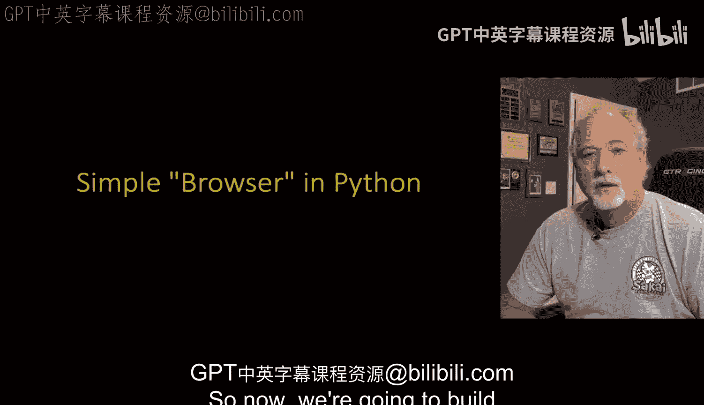

Okay， so we import a library， import socket。And that just like you know import math or import whatever that pulls into a library into Python Sockets are built into Python it's very cool and it's very。

 very simple， so where sockets kind of function like files。

 but their files that we can send data to and receive data to。

 but when you're using a file in Python you've got to first open it。

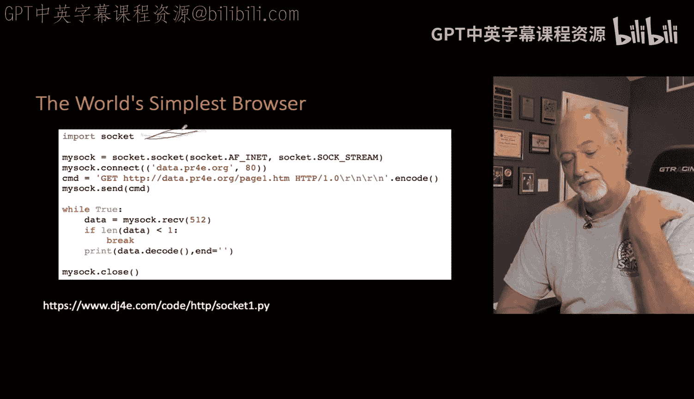

And so the opening of a file of a socket is really a two step process first you create the socket and that socket sort of lives in your computer as as an endpoint that's not yet finished' it's the endpoint that you're going to send and receive data to inside your computer but then we have to actually make the phone call so socket do socket and don't worry too much about this syntax we don't change it socket。

 socket basically says make a phone that's what we're making and then my sock dot connect。

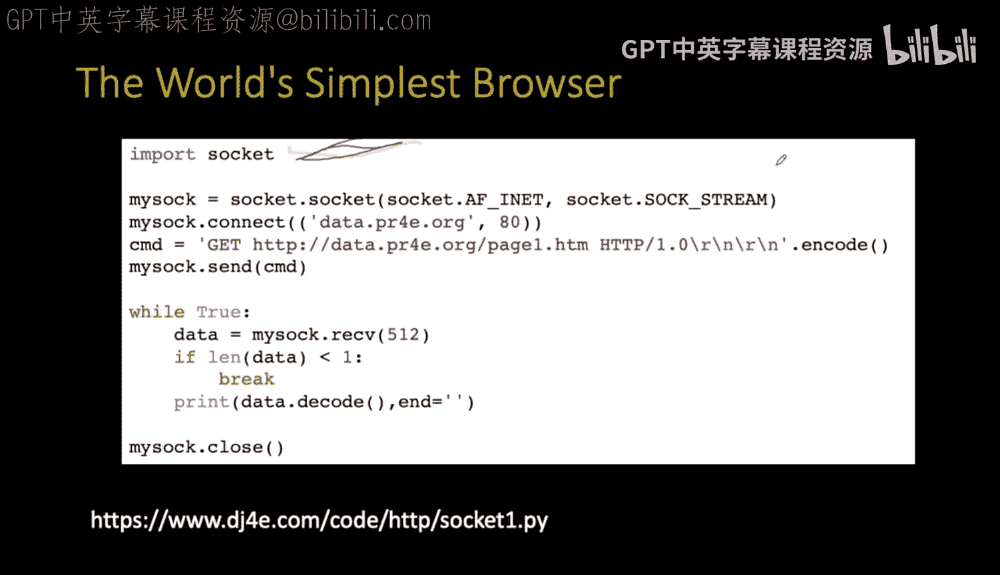

That second line is dial the phone。And we're dialing the phone to a domain name， datad。pr4。org。

 and a port in that domain name。So that is the call now if we made a mistake， right。

 if we had we were dialing and not talking to the right server。

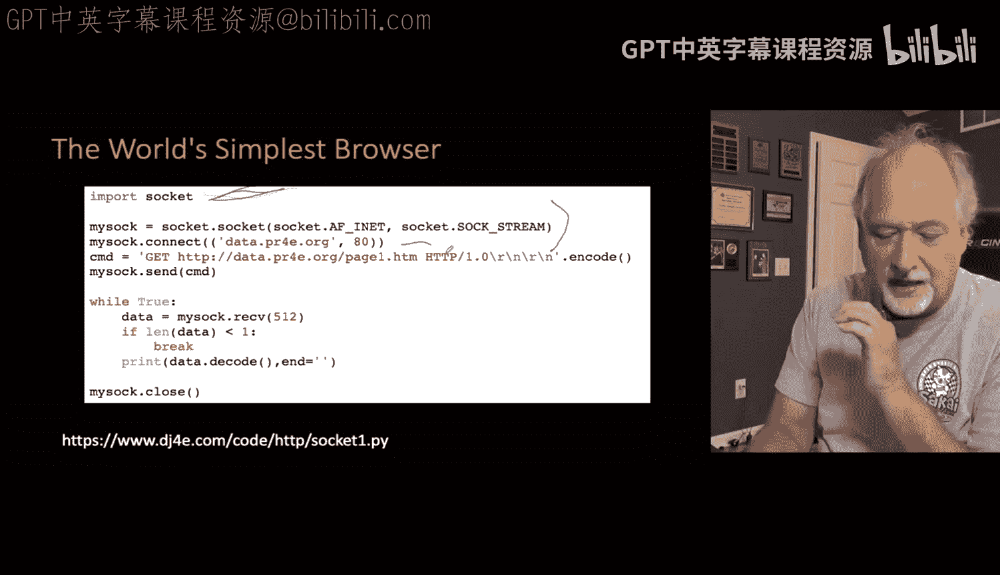

And for that server didn't exist， this connect would blow up， meaning we'd make a phone call。

 a data phone call to a server that doesn't exist， that line is what's going to blow up。

 but as you continue down to the next line， if you continue down to the next line if it gets that far now he'd put try and accepts around this if there was a。

 but I don't I want to keep this really short， so I'm not putting in all the stuff。

All the error checking so connect might blow up， socket do socket won't blow up because it's like unless you' don't have networking in a hole in your computer。

 but it's unlikely these days， but My Sock Connect is like dial the phone。

 dial the data phone to this endpoint and it includes the port。

 the port 80 that we talked about before。

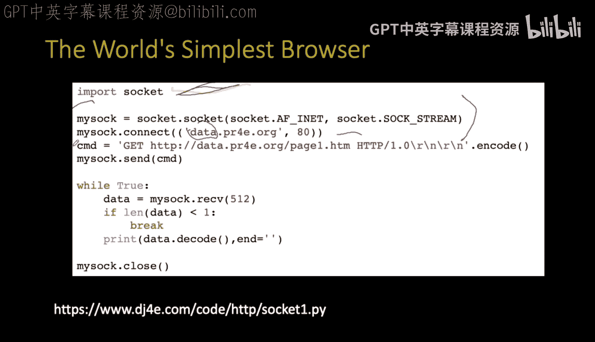

And now we need to send a command and in this command， it's exactly what we talked about before。

 it's exactly what we sent by telenet。It's a get followed by a space followed by our URL。

 followed by a space followed by a protocol HttP s1。

0 and then we hit the enter Now it turns out in network world。

 you actually hit two things it's the R n is a return in a new line and you have to hit it twice the enter at the beginning the first line and then remember we had to put that blank line in because to say no headers now we would put in between here we put all our headers in there if we were going to do that。

 but we're not going to do that and then you have to use encode code and in code means that the data sent across the internet is generally sent in what's called UTF8 inside of Python the data is in UniIcode so that you could put literally any character in a Python string and then preparing it to send it out across the internet。

 we kind of encode it into the more dense UT more compressed UTF8 format rather than we don't send strings across the internet。

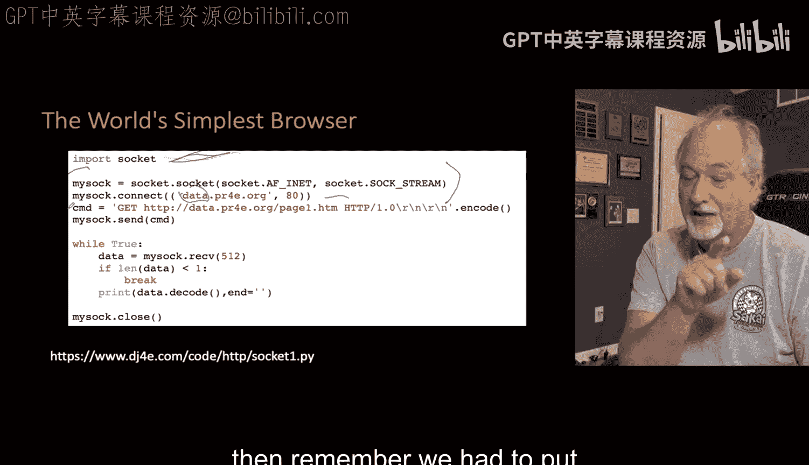

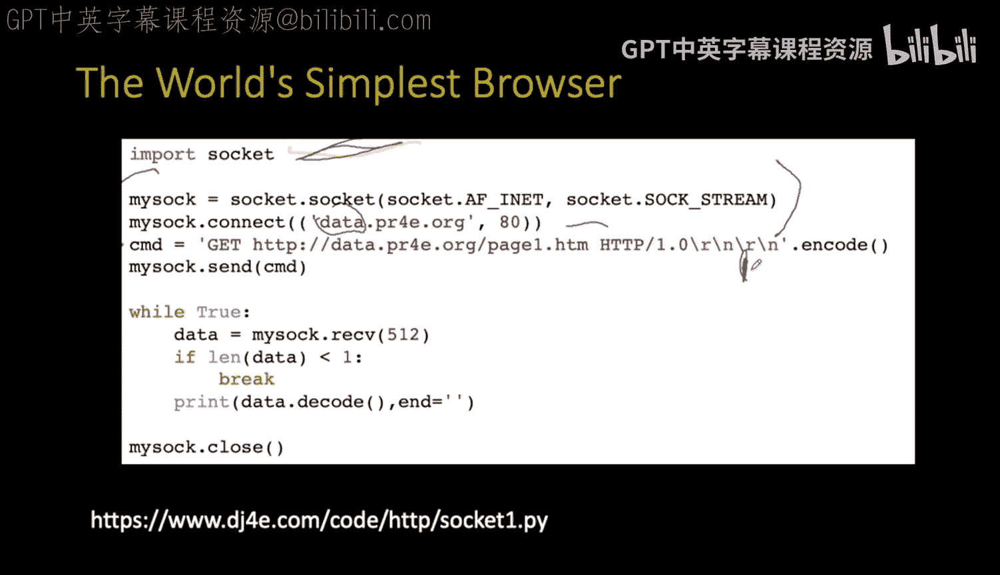

And uncode in general， I mean it's very rare， but you'd have to control both ends。

 we want to send them in UTF8 and so the string gap blah， blah， blah。

 that's in the Uniicode string and Python and dotted code says convert this into a UTF 8 string and so command CMD is a variable that has a UTF8 string in it。

And then we say send。 Now remember I said that you can simultaneously send and receive on these sockets。

 but the protocol tells us whether the first thing we're supposed to do is listen or talk and we're the browser in this case。

 And so we're supposed to talk first So we send the request out and that's just like you typed it in Tnet because in effect your scripting tnet Tellnet。

 we liked tnet in the old days' because it was kinda like a socket。

 I could connect to any host any port and type things and see if it's broken or not。嗯。

And then the protocol says once the server has received the first line。

 any headers and then the blank line then it's to return it。

 so then the next part of this is we're going to have a little loop so the protocol tells us we are supposed to receive data until the sockets closed and at the bottom of that teleant you saw that it sent a bunch of lines like four I think and then it it closed it。

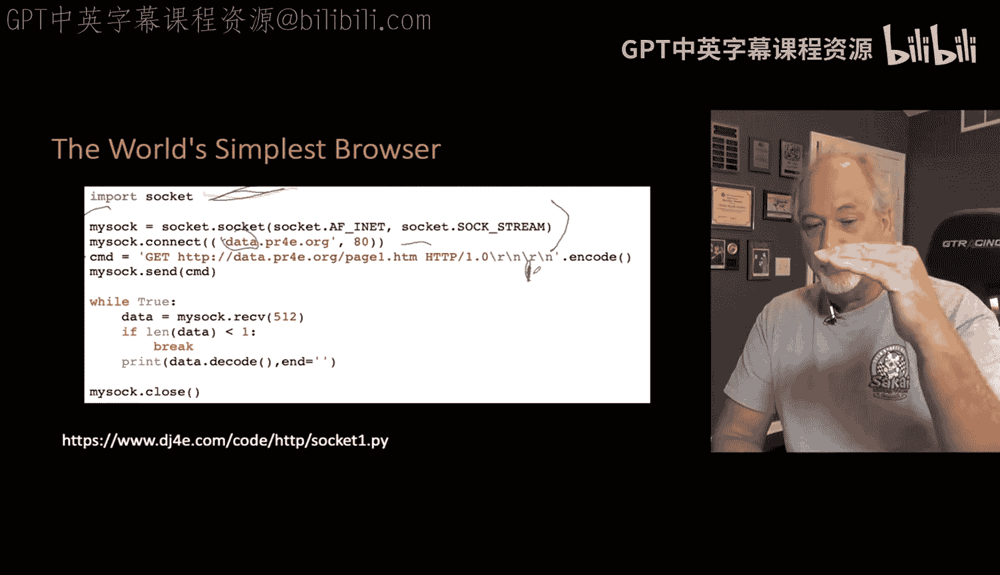

That's what's going on here， we are retrieving data。And then this receive。

 this actually waits if the server is coming slow or the network is slow， this piece of Python only。

Sit， sit， sit， sit， oh， got a little bit， got a little bit up to 512 characters。

 it will wait until it's gotten 512 or that it's done and it's got 10 or so。

But the receive is a blocking waiting operation Python says give me up to the next 512 characters now usually the network so fast that the Python doesn't even wait because the operating system already has it。

 but we get it。And if we get no data whatsoever， that isnt our indication that the network connection。

 the socket has been hung up on closed by the remote server and a away you go。

 so that's why we are going break if the length of the data is less than one and if not we're going to simply print out the data but we're decoding it and that's because the data that comes in。

 is in UTFA， but the print statement wants to print UniIcode and so decode says here's a variable that has UTF8 in it。

 convert it to UniIcode for printing inside of Python so because this data is externalized to us。

 we encode it before we send it and we decode it when we receive it before we use it because Python inside itself doesn't use UTFA Python inside itself uses UniIcode which is awesome and a whole separate conversation I'm just going to bringing that up to remind you how important it is because we're not going to write much of this in Python really。

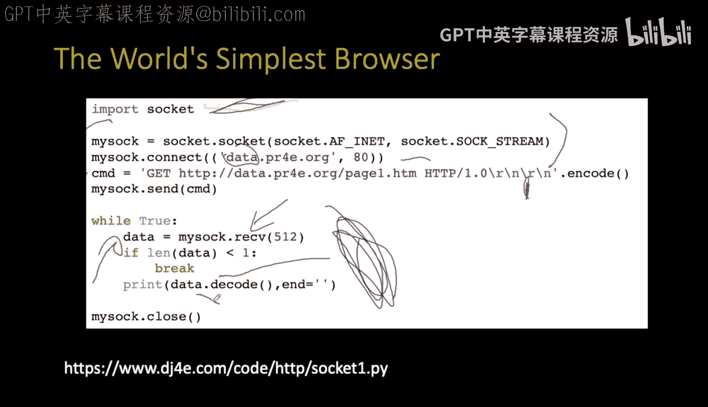

All this stuff is taken care for us in web servers when we get to that point。

 but it's just a good time to review Python's strings and UniIcode and encodecode and decode because it's really important。

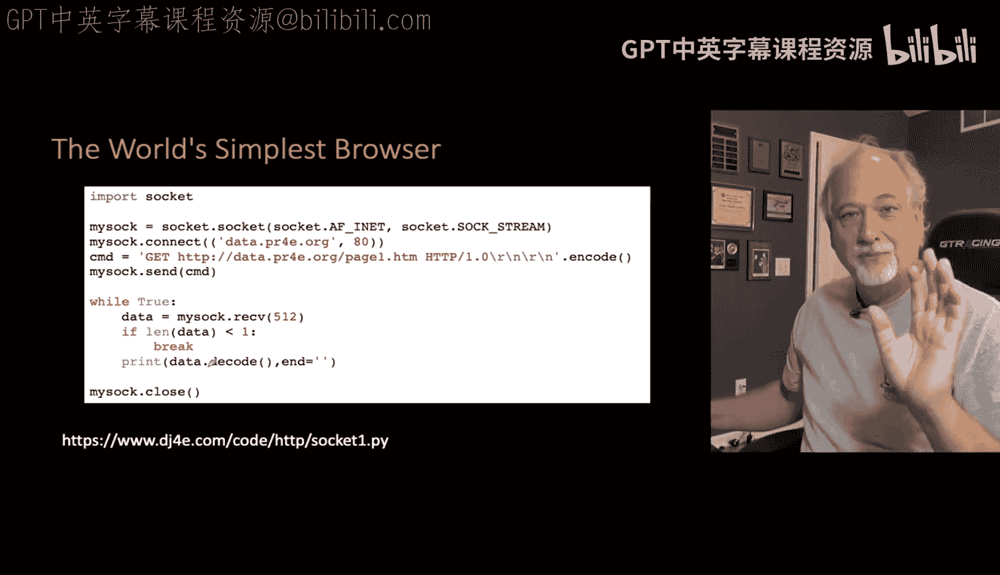

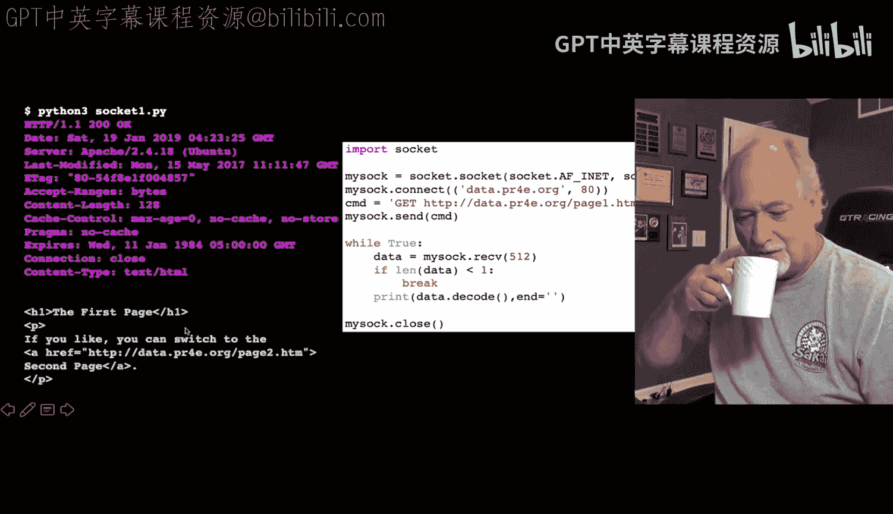

So if you run this and you've got it right， it runs pretty simply。Let's get the color back。

Get back to yellow here。So if you run it in your system， Pythonscket1。pyy。

It will all the work is done up here before you see your first output and then this all this output that you see is just as loop running and what you see is really the exact headers that are coming from this server and then you see a blank line and then you see the actual page that's coming out and you don't see it but at the end here the connection gets closed and you break out and you're done and then we close our end of the socket the socket the fire end was already closed that's how we know to stop reading data and then we hang ourse up so that our local system does not end up with a bunch of half halfhung up phone calls and so that's basically how we talk to a socket in Python。

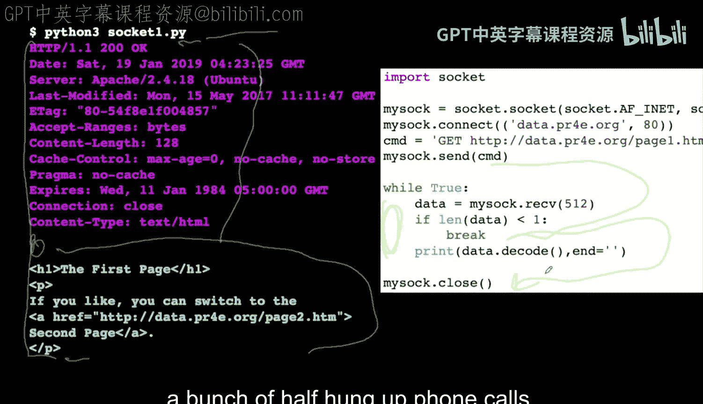

Now。That was literally。T0 years ago， how I would debug applications。

 I would like Tnet or write a little thing like that and dump all the headers。

And that got really tiring， really boring， really tiring。

 And so browser developer mode is gonna be your friend In a way， browser developer mode。

 I'm gonna have a separate video on this browsers developer mode lets you look at the scent headers。

 the received headers， the received data， the sent data what URL it went to and it's super awesome。

 especially because a lot of web pages have like 40 to 150 request response cycles so you don't want to debug them all by hand。

 You just let the browser do its thing and say， what was that second one And what went wrong in the second one I spend a lot of time when I'm debugging web applications using the developer mode and that's why I have a special little video that gets you familiar that I tell you by the time you've done web stuff for a little while you're gonna know your browser developer mode。

So next we're going to talk about writing code in the server to respond to these requests。

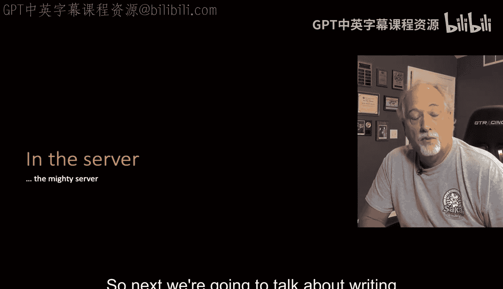