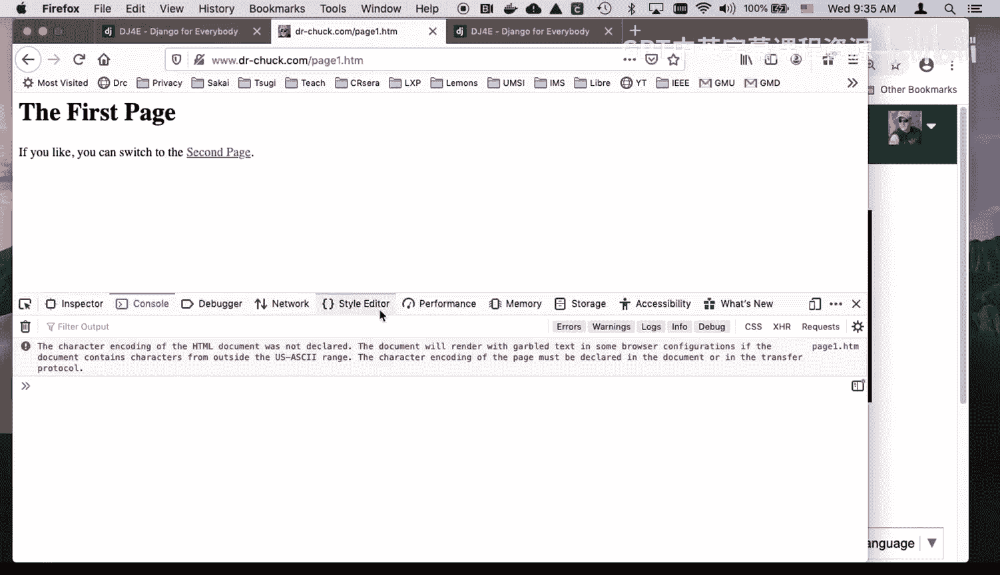
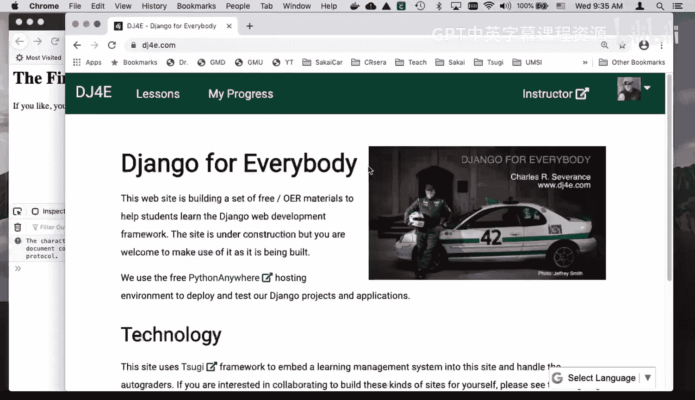
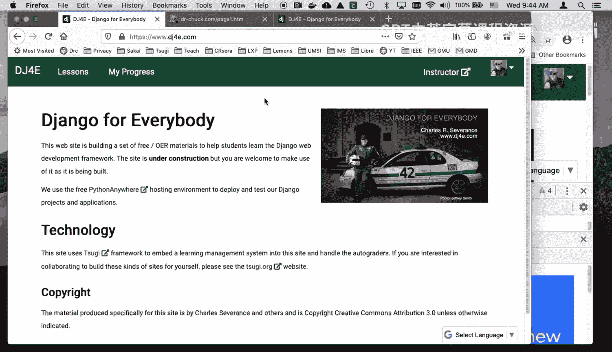
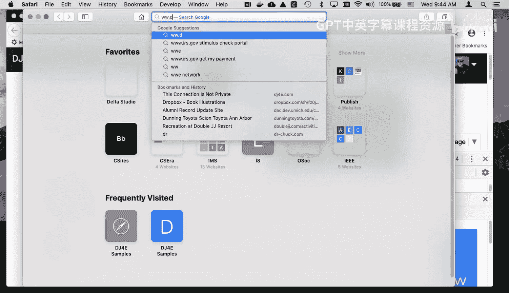
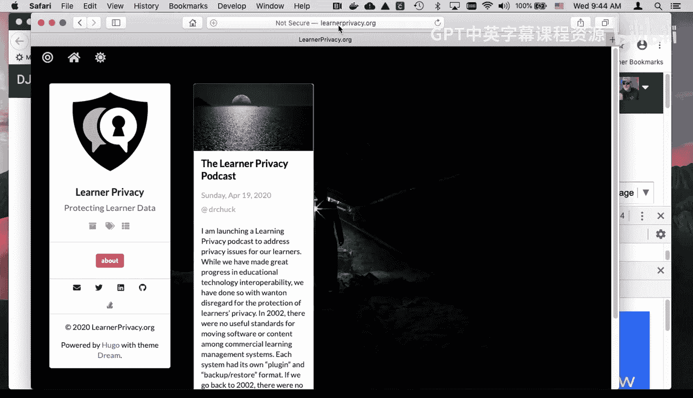
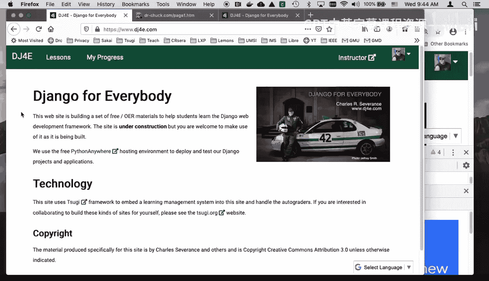

# 密歇根大学《给所有人的Django课程（简介、开发Web APP、特征和库、JavaScript和JSON）｜Django for Everybody》中英字幕 p72 12_02_08_浏览器开发者模式详解.zh_en -BV1Kt421V7EE_p72-

Hello and welcome to another walkthrough for Chango for everybody in this walkthrough。

 we are going to talk about the browser debugger console and so this is something that in the old days was only in Firefox。

 but eventually everybody built it in and used to have to build a plugin。

And and it shows up at different places and so in Firefox it's here under tools。

 it turns out that you can kind of go to any of these things because。These are the。

 you know they're just different tabs here in Chrome。

You do view developer JavaScript console and then you see a similar kind of thing here， right。

So I'm going to do it in。And， in。Firrefox here。And so you can see things like you can see the document object model。

 you can see the JavaScript console this little error hardly matters。

 it's because it's such a simple page， you can actually debug JavaScript code。

 you can watch the network， you can play with CSS， etc， etc cetera， etc ceter。

 performs cookies are in here， so there's a lot of things that you can do。

I'm going to start and show you right now。 we're at the very beginning class。

 I'm just going to show you some of the most basic things here。 I'm going。Clear this out。

And then refresh the page。And so what you see here is you see each request response cycle right and so I came up here is if I type this。

 let me clear it again see you see I'm gonna to type this。

 I'm going to press enter and that tells the browser to go retrieve this page so it connects to the server wwwD。

chuck。 co and gets the document page1。 hm this favconicco that's basically getting this little favcon right here。

 that's the little thing that shows up in in the tool in the tab bar and so websites can have a file and later we will actually make a favcon but what I want to show you from a request response cycle is you can see some detail here So let's go up here and you can see detail。

You can see that this was the URL。 We sent request a get request。 We got back a status code。

 The status is the first thing， 200 isn't okay404 is not found and we use htp version 1。

1 The request headers will they always show you the request headers response headers first So these request headers are actually part of the httP protocol where we are telling things like what my preferred languages whether what kind of documents we can handle you know and cookies that we're sending back in we'll learn more about all of this stuff。

 And so this is actually when the browser makes the connection to port 80 sends the get request to the URL it's interested in get http ww。

chuck co s page 1。htm space htp 1。1 And then after it it sends these and this is pretty much the format except call blah。

 blah， blah。And so that is the and then it sends an empty line and then it's done and then the browser sends back first a set of headers。

You know what the content type is very important， the size is sometimes in here。

 G zip means that it compressed it on the way， and so these are the response headers and so if I go to an error page。

嗯。Not not a page dot HM。It's not going to clear this。And what's happening here is。

It's putting up a page from my hosting system， but the most important one here is this。

 and that is the 404 error。And so it was going and it sent a get request to htb。chuck。com not aage。

htm， and it got back a 404not found so that was that 404not found is a different status code that said this is a thing that's not there。

 500 means the server had an error and we'll talk about all these codes。

 but the point is as you can debug all this stuff quite nicely。So let me go back to page1。htm。嗯。

let's clear this and refresh it to make sure we got it all right Okay so we grab the page and now I can another thing that you probably by now have figured out to be able to do is inspect element。

 So now you're actually looking at this document object model right and so this document object model is not necessarily the code that came back from the server。

 I go here to network and I click on get and I look at the response。 This is the response down here。

 This is what actually came back from the server and then and then the browser pars this and turns it into what's called the document object model。

 So this is the source。 now just just as for fun here。

 you'll notice that I can change the document object model here。Right？If you are cool。

You can switch to the second page。 So you'll notice the document object model changed。

 and what I saw up here changed as well。 And so this is like In element。

 I can do something like I can even add here。 I can add some CSS style equals color， red， semicolon。

 And if all goes well。 there you go。 You see， I switch the color。 This is the document object model。

 Now， the server was completely uninvolved in that。 And later。

 we're going write a lot of code to mess with the document object model。 So the server is still。

 it doesn't have the red in here。 It didn't change this to cool。

 So this is what we originally got from the server。 And this is what we've got in the browser。

 And so once that page comes from the server， you or jascript can mess with that page。

 So it' it's pretty dang cool。Okay， so and I'm going to clear it and I'm just going to click on eight this second page which is an anchor let's inspect it well it's an anchor tag and so it's going to do another get request and so this time it went and grab page two and there's a second page and you can go back to the first page and so there's a lot of things that you can see。

This persist logs is an important feature that means that it keeps them crossed more than one request and disable cache means that sometimes the browser wants to keep a copy of something and you。

 while you're debugging， you want to say， hey， go get the original every time。

And so this right now I'm giving you starting you on very simple pages。

 but if you take a more complex page and。I can never remember where it is view developer network。

 let's go here if you take a more complex page with a bunch of things in it。

And you hit refresh up in this page， you will see that it does a get request。

 but then as it parss that get request， it finds things like all kinds of stuff right so here this took 44 request response cycles 1。

6 megabytes。And it took almost one second to download all that stuff。

 it took a second to download it。And so if you go， you scroll all the way up to the top。

 the original get request was to this URL， which is slash lessons slash RRC， which is the URL。

 but then if you were to look at the response，And I don't want to see that。

 I want to see the actual H。 So if you look at the response， you see all these。嗯。

All these URLs for more stuff， some CSS or from JavaScript， some who knows what。

 and so then what you see is you see it then retrieving all these other things that it needs to actually construct the page some CSS grabbed a font。

 it grabbed JQury it grabbed。Time ago， that's a little thing like and then grabbed a bunch of jascript and fonts in this。

 and then the translates， you see this little translate thing。 It's doing that。

 And so you'll see that's how it quickly builds up to about4。

44 request response cycles to produce a page now。So that's just my quick introduction to this。

 you may not see these little dropdowns。Like this。 You might have to turn them on in preferences。

 So you go into preferences somewhere。 I turned them on a long time ago。

 I probably couldn't even find it but。 You might see it。 The other thing that I would suggest is。

Don't use Safari because Safari。Just so far as trying to hide too much。

Too much stuff like it doesn't even show you the URL unless you click on it。

 So safari is kind of a pain in the neck。 And so I would suggest that for this class。

 you either use Firefox or you use Chrome in addition to using safari Safaris fine for daily use。

 but I just find it as a debugger。 It's bad， which is really sad for safari。 they they made safari。

Unfriendly to software developers， which means we're not going to test our stuff on Safari。

 which means if it breaks too bad so okay， well enough of that little safari diatribe again。

 I hope that you found this walkthrough for Chango for everybody as usual， helpful cheers。

