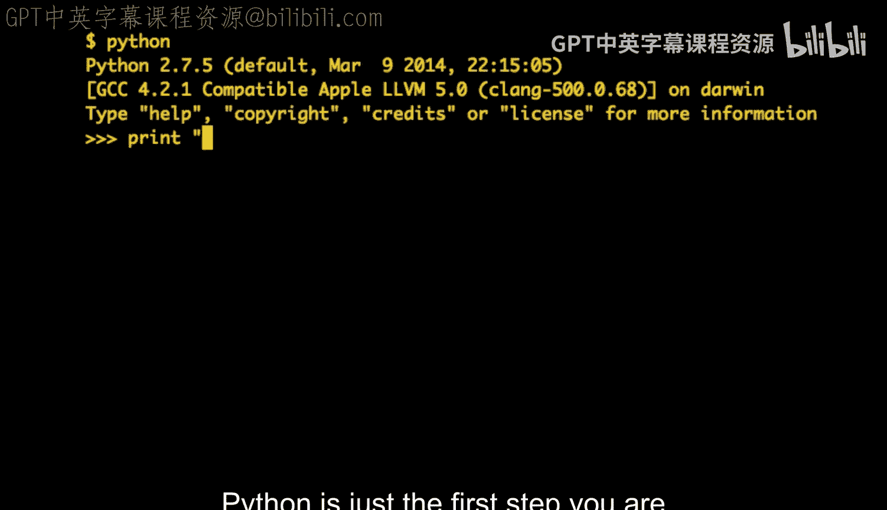
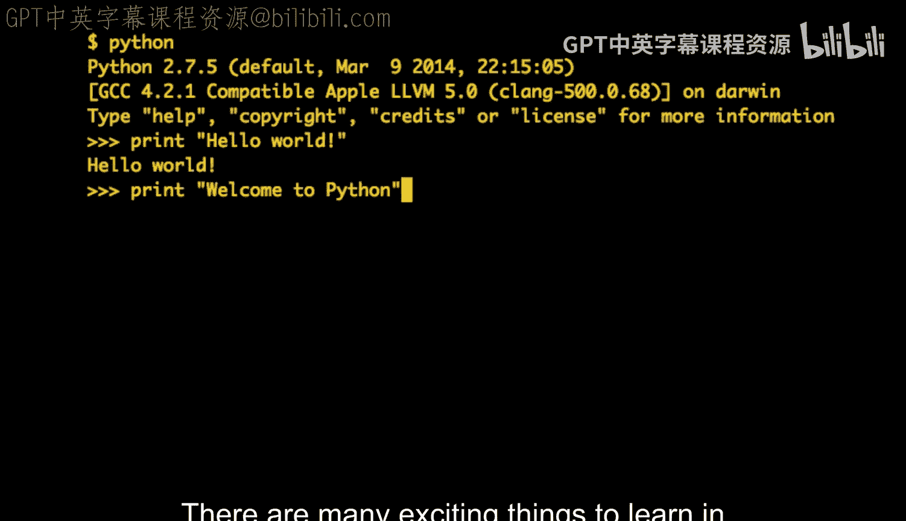
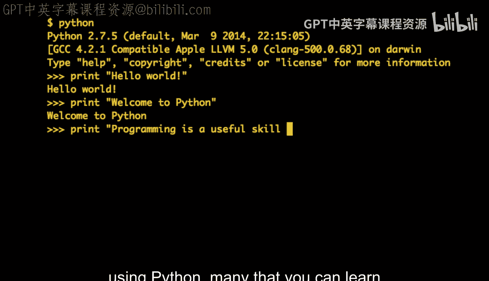

# 密歇根大学《给所有人的Django课程》：P73：吉多·范罗苏姆的欢迎致辞

在本节课中，我们将学习Python语言创始人吉多·范罗苏姆的欢迎致辞。他将分享关于Python、编程学习以及社区支持的重要观点。

我是吉多·范罗苏姆，我创造了Python语言。

我在Python上工作了25年，当然，也与Python社区中一个庞大的群体共同协作。

看到你们所有人都参加这门课程，我感到非常兴奋。

我为你们使用我的语言来学习感到非常自豪。

Python只是你们踏上编程之路的第一步。

编程中有许多令人兴奋的东西可以学习，其中很多都可以使用Python来学习，也有很多可以使用其他工具来学习。

你们不会孤单。

将有数以百万计的人走在你们前面，或者与你们同时学习Python。

你们可以互相帮助。

你们可以一起学习。

---

本节课中我们一起学习了Python创始人吉多·范罗苏姆的欢迎致辞。他鼓励初学者以Python为起点开启编程之旅，并强调了学习过程中的社区支持与协作精神。