# 密歇根大学《给所有人的Django课程（简介、开发Web APP、特征和库、JavaScript和JSON）｜Django for Everybody》中英字幕 p76 16_03_02_Cookie与会话.zh_en -BV1Kt421V7EE_p76-

Hello and welcome to my lecture on cookies and S， so taking a look at sort of how all this stuff works out。

We are again in our application and so there's two distinct topics that we're going to cover and it's really important to keep them clear。

 so there's cookies which are a browser concept and then there are sessions which are a server concept when we write Python code in like our views。

 PY we talk to the session。Cookies are essential to sessions。

 cookies are used to look up which among the sessions that we're going to use。

So we're going to do is I'm going to first talk about really just the cookies， how cookies talk。

 how the servers talk to the cookies， and then separately we'll talk about sessions。

 so keep the two concepts the same， a lot of people tend to confuse the concept of sessions and cookies because one of the most common use of cookies is to establish and maintain sessions。

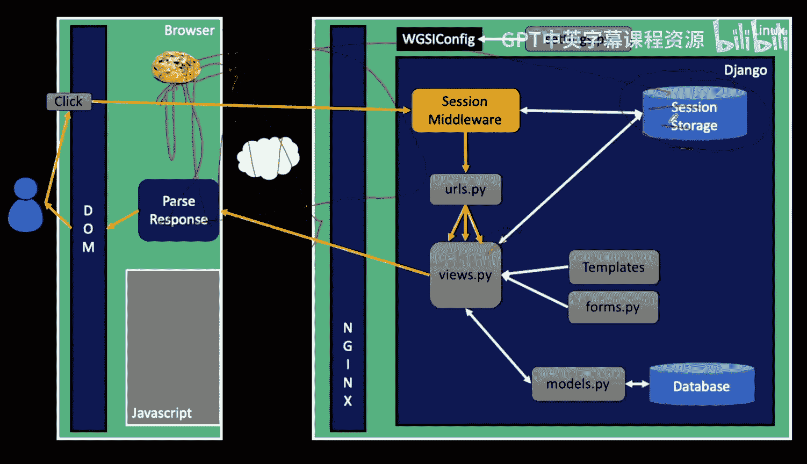

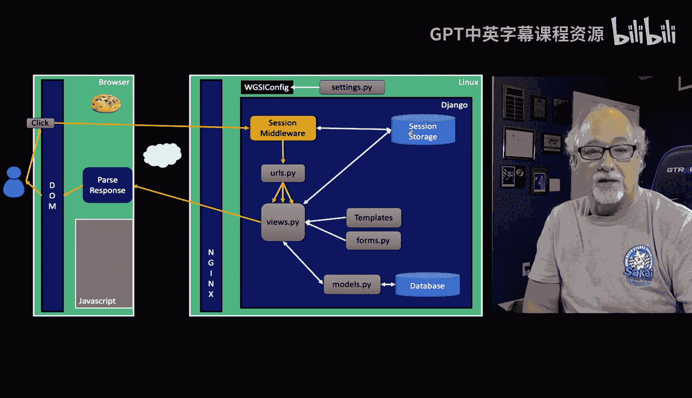

So the first thing about。The web in general is that。

You have a web server and when you're just developing。

 you think there's only one person which is you talking to the web server。 But in reality。

 when a web server is in production connected the internet。

 there could be 100 connections to 1000 different browsers and it's essential that the server can figure out at any moment which browser it is talking to we don't maintain a permanent connection to these browsers that's one of the reasons that the internet scales as hard as as high as it does right but so we still have to have some way of distinguishing when a request comes in from this server versus when it comes in from that server And so what we want to do is we want a way to basically put a little mark on each browser and say。

 oh， that's this browser and so when you log in from this browser I can know that it's you So marking the browser is different from saying I have browser 41。

42，43，44 and there's each browser ends up with a mark。In the early days。

 the web was pretty much a read only medium， we didn't do a lot of logging in。

 we didn't do a lot of uploading， there were password mechanisms， but they were very。

 very clunky and so all the browsers were pretty much reading the same information and as long as you're not logging in and modifying stuff。

 it just doesn't matter。So quickly in the early days of the web。The idea of cookie was created。

 and that was a way to serve for the server to store a little bit of data on each of the browsers。

 and there are just little pieces of data written by the servers read by the server sent by the browsers and read by the server。

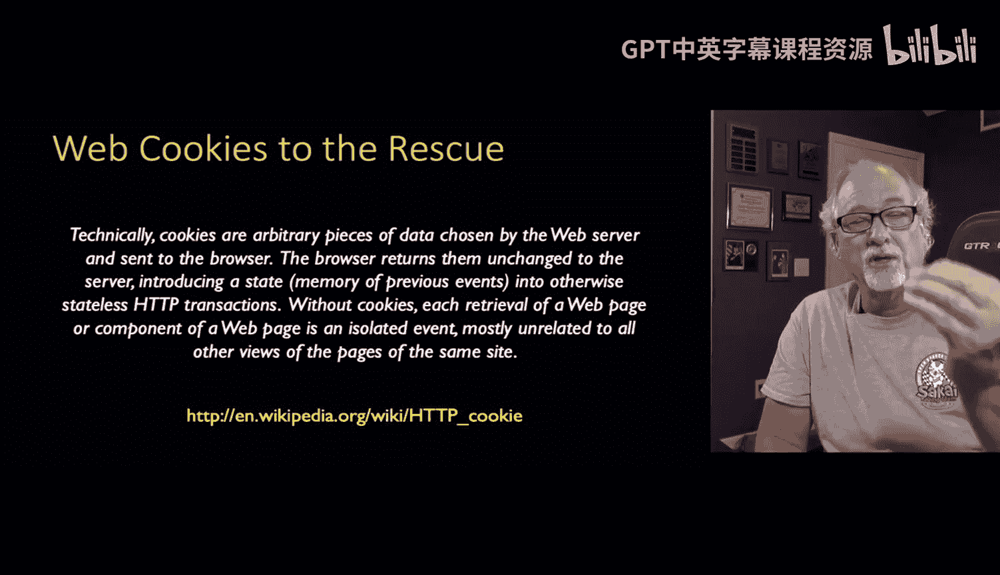

Now， it has nothing to do with logging in。 It has to do with writing a little mark on every browser and then getting that browser mark back every time we ask it。

 So often when server makes gets a first request from a web page that doesn't have its little mark on it。

 it makes up a number and sends that cookie back。 So it sets the cookie。

 there may be many interactionsions between the time you're starting to talk to a server and when you log in。

 but often the cookie is set immediately。 And so but the key is is that once I set that cookie。

 it's like storage from my server on your browser and each of the servers and that can be sort of temporary or permanent storage。

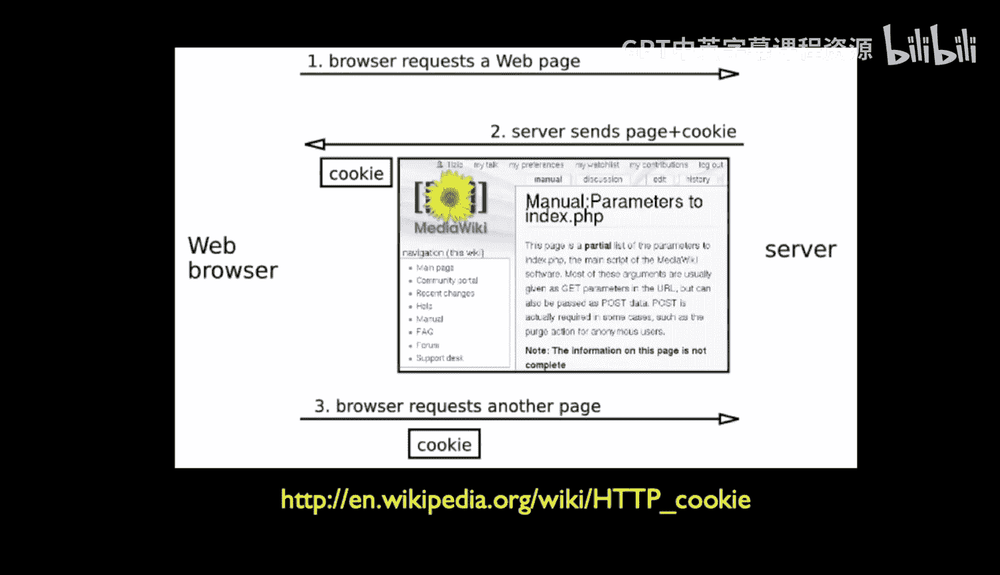

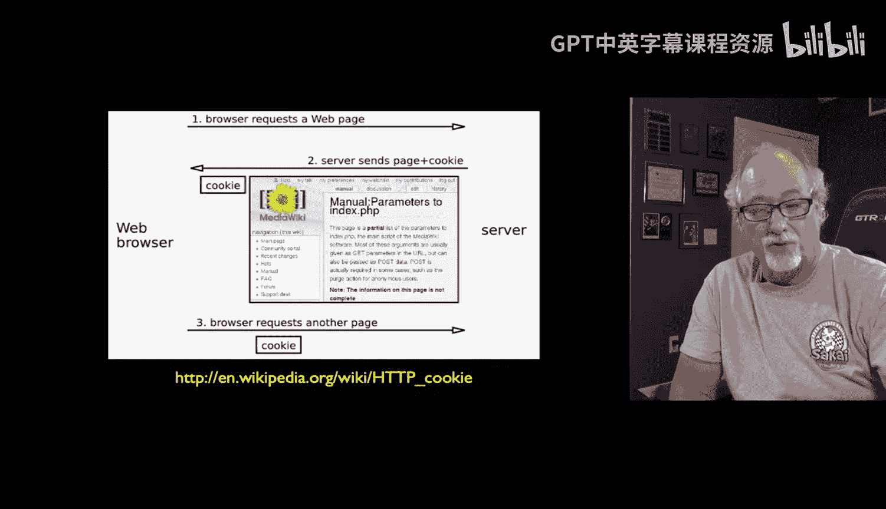

So they're marked in the browser by the web addresses as they came from， it's a security thing。

 you're not allowed to read cookies from a page， if your page comes from a particular server。

 it can only read the cookies associated with that server and vice ver and vers。

 so they're like a little stove piped。Cookies have an expiration date。

 there is two kinds of expiration dates they're sort of by a certain time or a number of seconds or there is。

Stay logged in or keep this cookie until the browser is shut down we call those session cookies。

 which is kind of weird because we often use them we often use session cookies for sessions but we still got to keep them cookies So here's a bit of sample code。

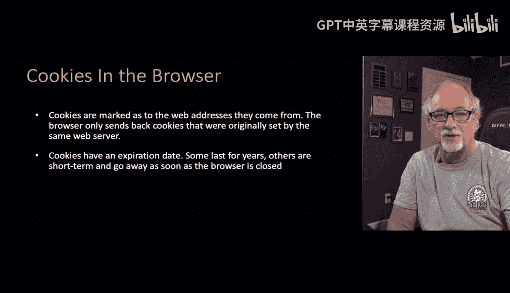

So one of the things you can do is you can go into your browser console and you find something like storage and you can see for the website of the current page。

 the current website that you're on that website's cookies are stored here and so I'm looking at the cookies here and I see there's only one cookie this CFfduI that's this server is using a proxy to help speed itself up and so that cookies not really part of our application and so what happens is there is no cookie is not set and so we go in and click on this if you give a browser a cookie and it's going to route to this particular view and so in this we're going to do a print of request cookies so what happens is I mention that every time a web request comes in all the cookies gets sent in with that web request that are associated with that server so we're going to print them out and they come in just like request get request post and request cookies is jangle's way of handing us all that information。

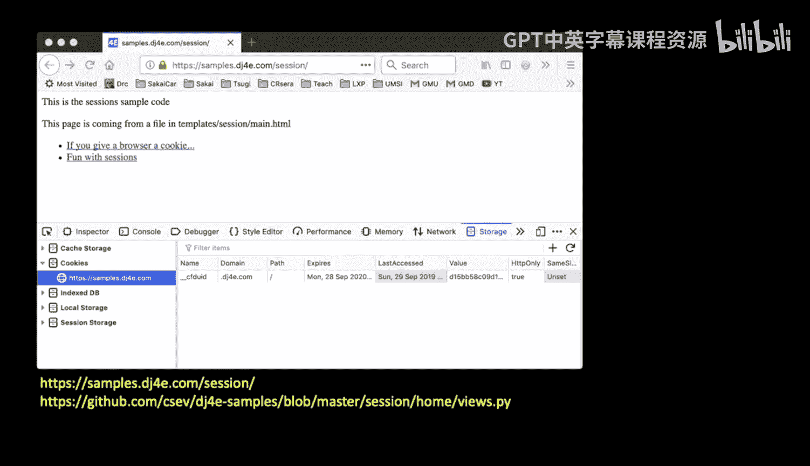

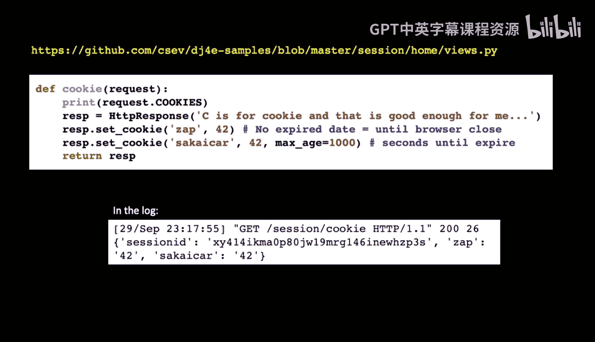

。And so in this case， I'm not actually going to send the response back in the return value。

 I'm actually going to create the response。 That's rePHtV response with a string。

 And then I'm going to set some cookie。 So cookies are part of the response。

 they're actually part of the headers of the response。

 And I'm going to just set one cookie they're my name's I set them。

 this application cookie name Zap to 42。 and then a cookie name Sakkaai car with a value of 42 and I give it1 thousand seconds。

 So that's one is a session cookie and the other is a cookie with a fixed expiration date。

 Now this thousand seconds， you can go much longer than a thousand seconds。

 if you start looking at the cookies that you're talking to on the various things。

 these are yearlong multiyear cookies， etctera， etca， etc ce。

 And so if you were to see the printout that is coming from that request on cookies。

 you would see that it's basically a dictionary of key value pairs。

 Now that's after the second response。

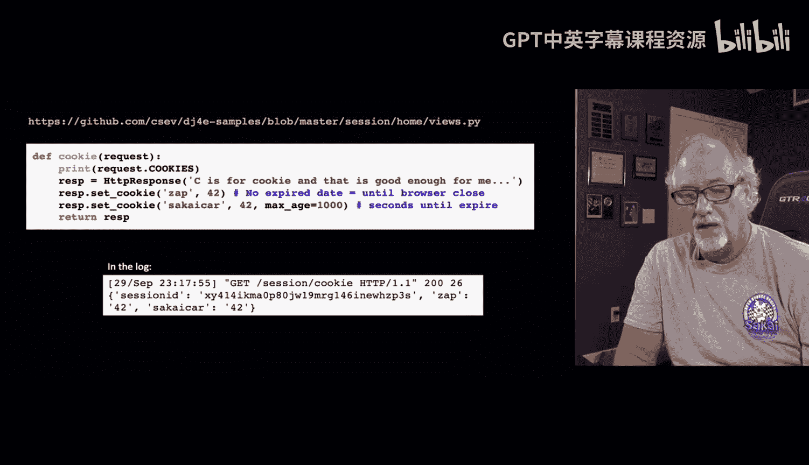

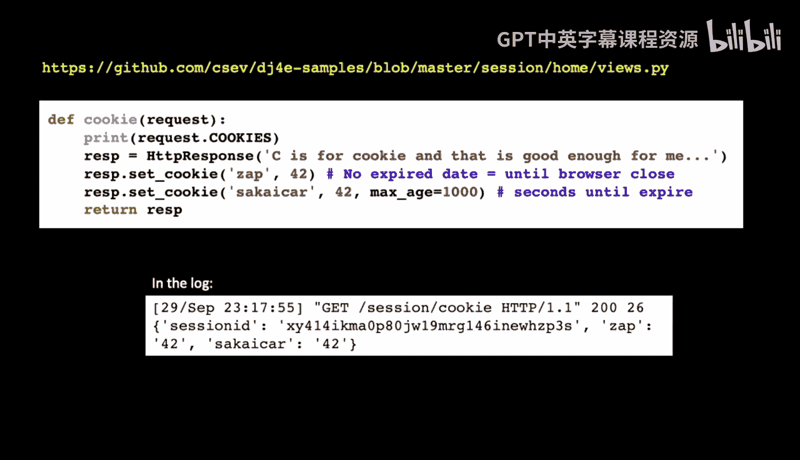

So if we go and we click on the cookie and we start with no cookies whatsoever。

If we start with no cookies whatsoever， we're going to send this code out and it's going to send two cookies back and so what you can see here is you can see if you look closely and the response headers to set cookie responses so the response headers are like the content type etca。

 et cea， et cetera， they're not the actual page， the actual page is C is for cookie and it's good enough for me but basically when when this response came back。

 the server said hey， set this key value pair and this key value pair and have this second one expire。

 which is exactly what I did inside that code and so now if we take a quick look and we take a look in our storage。

 what we're going to see is that we now have two value。

 Sai car is 42 Zap is also 42 Sai car is going to expire a certain amount of time in the future and Zap is a session cookie because we gave it with no expiration which means once I want to close all the tabs in my browser and close the browser。

And the browser will throw this away the Sai car will be persisted to disk or some other place so that if I close all my browsers and open browsers up and go back to this website samples dj4。

 co it'll start sending that cookie so that's a permanent cookie with an expiration date on it now that's pretty short expiration thousand0 seconds is like what 20 minutes I think and so that's going to go away but a lot of these cookies last much longer。

So that's after the set cookie comes back from the server。

Then we can take a look and we can see as we make another request we're going to see that thus the browser is going to look up the cookies and we have this one here that that's part of the hosting environment。

 but Zap equals 42 Sakai car。 So now incos a get request and as part of the request headers。

 it's telling us all the cookie values for samples dj4。

 co and then when I look in my code and I say request cookies。

 requestquest cookies contains the parsed versions of Zap42 and saicar 42。

 So I end up with a dictionary with two values in it and Zap and Saicar。

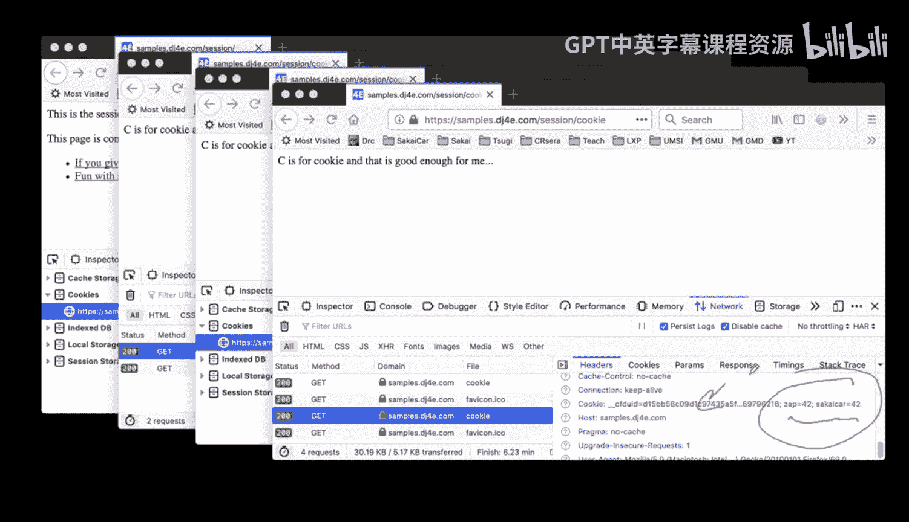

And so the way to think about this is when the browser first come in。

 first first comes into the server， it looks for the cookie。

 it might say do I have this cookie already set now my application that I wrote is real simple and then you are going to send the cookie back and then the browser stores the cookie inside the browser and then from that point forward every time it makes a request that comes in and we can see this in the variable request cookies inside it so we really only have to set it once。

 although the code I wrote sets it every time but it doesn't matter。

Until it expires or until the browser closes， the job of the browser is to send that cookie back。

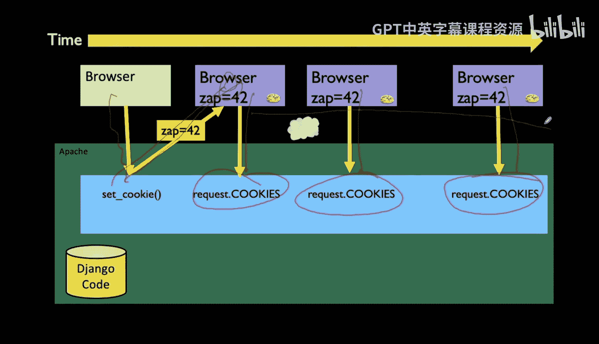

Okay， so remember what I said I said we're going to mark this each browser with a different number so we can know which browsers which that's exactly what it is now it doesn't always set it to 42。

Usually it chooses a large random number but we'll get to that in a second so up next we're going to like make some sense of this by adding the backend part of this。

 which is the sessions which stores all the data from a cr to request。

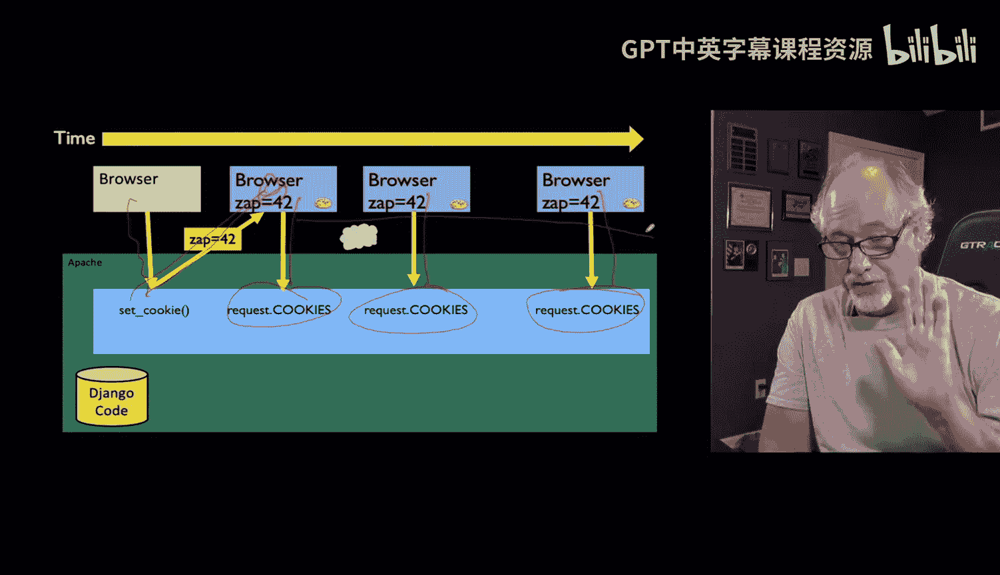