# 密歇根大学《给所有人的Django课程（简介、开发Web APP、特征和库、JavaScript和JSON）｜Django for Everybody》中英字幕 p77 17_03_03_Django会话管理.zh_en -BV1Kt421V7EE_p77-

So now we talked about cookies and how the server can set cookies in the browser and how the browser has to give it back。

 now we're going to actually do something useful with it and that is we're going to build sessions and Session is a place on the server will record things like this user。

 such and so user has logged in so let's take a look at this。

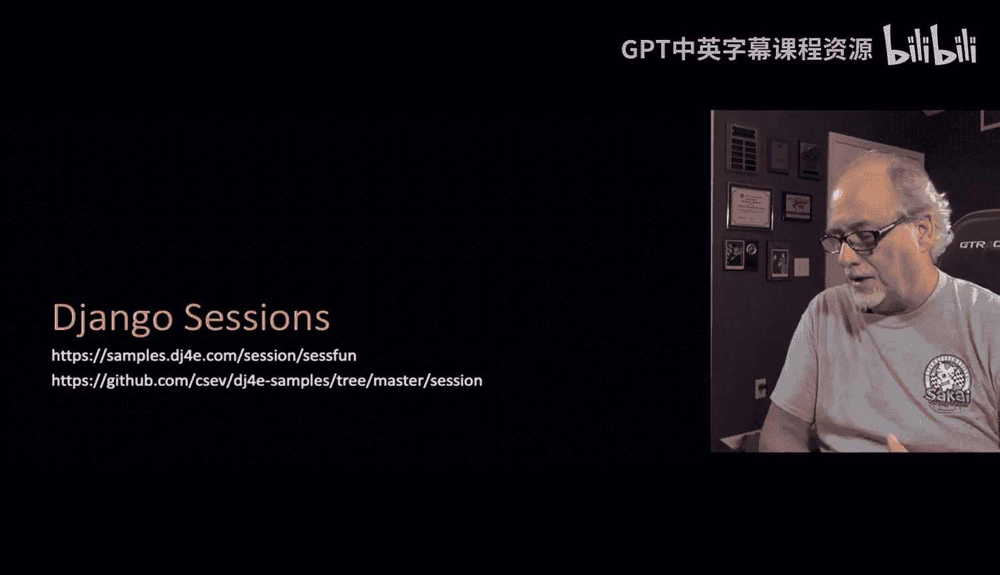

So。Inside the server， there is some code that we've enabled in django called session middleware and what it basically does is it kind of grabs every incoming request right before it comes in to URLs。

 py and it sort of injects itself。 before URLs。pyy runs And what it does is it uses the particular cookie value maybe 3e comes in as a cookie and then it actually grabs the particular session and associates it with a request and so by the time you're coming into one of your URLs py when your views from URLs。

pyy。 What you find is the cookies have all been set the session has been set up it's made a session if necessary。

 it's looked up an old session if necessary， and so there's a whole bunch of session and the session are stored in the database on files or other kind of places and there is pretty much one session object for each distinct browser that's out there and we looked them up by knowing what。

TheC value was that we set it and so one of the things the session middleware does is if it doesn't see a cookie coming in。

 it actually like， oh well I'll pick a large random number and then I'll send the cookie back。

 I will create a new session and Ill send the cookie back and then I'll be able to look that session up on all of the future requests。

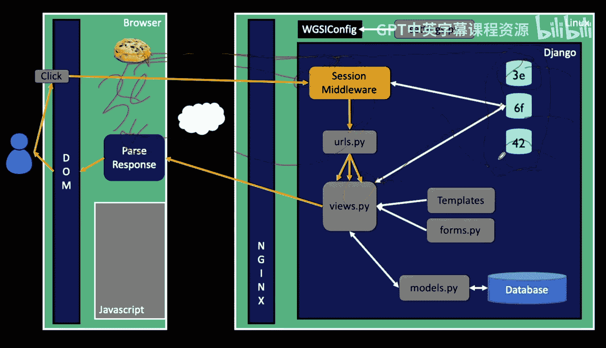

So。Usually we just go ahead and start sessions when we meet a new browser， it's simpler， I mean。

 can you can sort of sometimes delay it to save a little bit of resources。

 but often for most applications right away， you start using sessions and then later you've logged a person in。

 you are going to mark each browser with some unique random number and then when that cookie sent back to us。

 then we can reassoociate the session with the incoming request。

So Django Middleware handles the creation deletion， the inserting of data， the deleting of data。

 and the updating of data in these sessions。The session identifier is a large random number that we put in a browser cookie。

 first time we meet a browser and then we store using that same number a bit of data on the server and then later when that cookie comes back in on an upcoming request。

 we basically look up to session data and then reassociate it with request before we go through URLs。

pyy and into our views。

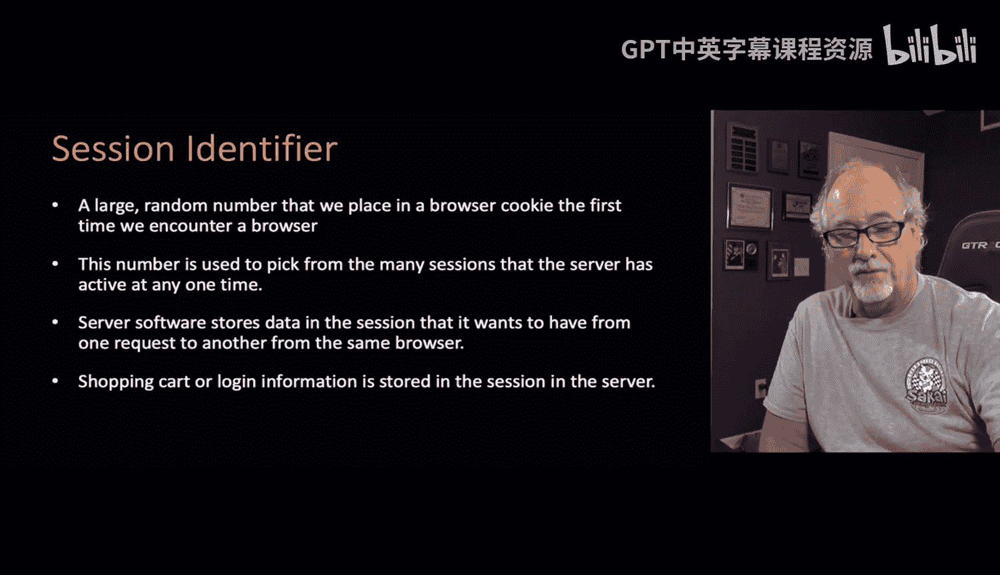

So we have to enable this and if you used managejango admin to create your project。

 this is already there， you can go ahead and look in your settings。

pyy and you'll see that it's there and you'll also notice that by now you've probably done a bunch of make migrations and migrates and you see it making a session table so there's all going defaults that are set up so that most of your firstjango applications are set up to a support sessions and B store sessions in the database which is a fine way to go four small to mediums sites。

 so like I said， they're going to be stored in the database you do this migration and you see that it's creating a sessions table for you。

In your Sqite D V dot Sq L3 database。

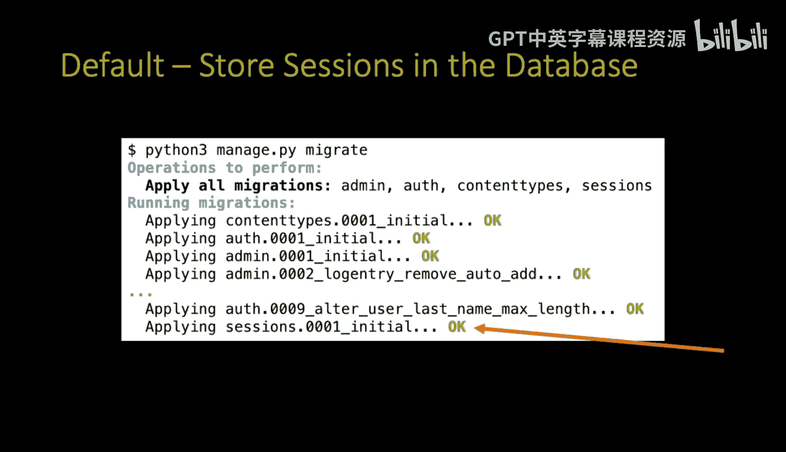

So here we go。 we have， as I said， out there。 we've met these browsers。

 We've made a session object in our database， and weve put a cookie in each one。

 So there's some kind of a cookie that we've they're all name the same。

 So we'll name these cookies C I or something。 And so what we've picked random numbers and we've marked them。

 And so what happens is is that a browser， a browser comes in。

A browser sends a request in and they send their cookie along with it。

 the Dnangle middleware looks among all the sessions and then connects it up and then it does the request。

 So there's many browsers each with a different number， and then there's many sessions。

 each with a different number and part of connecting is creating it now if we look at this from the point of view of one browser and one session object。

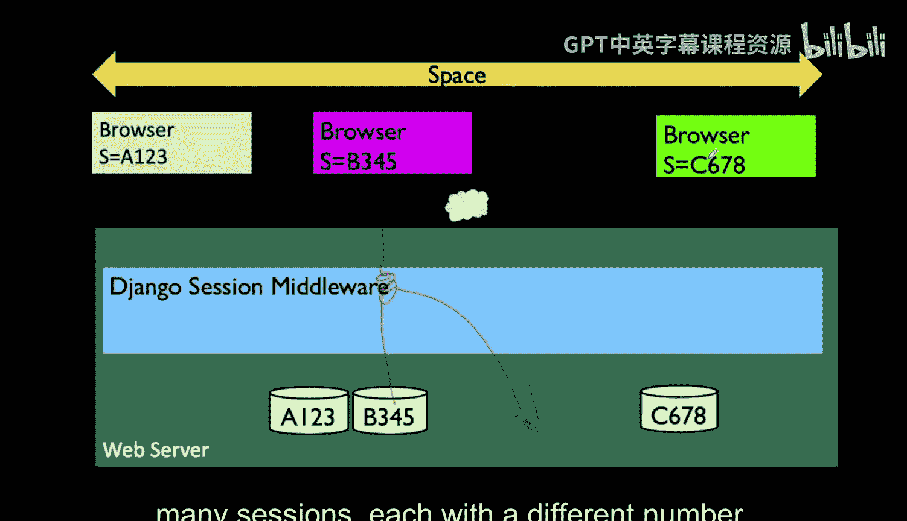

One session storage area。 you know， at some point， we come in and it reassociates the session and we're doing some work and we're writing some stuff into the session。

 and then we respond we go to another request。 We can read what we wrote。

 So we write stuff into the session， we can read it from another one。

 And then here we can read that same information。 And then here we get a post。

 we read a bunch of information， but we write some more information。

 And so you can kind of think ultimately just sort of at some level， relax about all the detail。

 and realize that this session is a variable that last across many request response cycles。

 the cookie variable sort of also last across many request response cycles。

 The get in the post data they vanish。 So the get data for for each one。

 you use it and you consume it or you store a database。

 but the get data from one request is not available on the next request。 So we have to use。

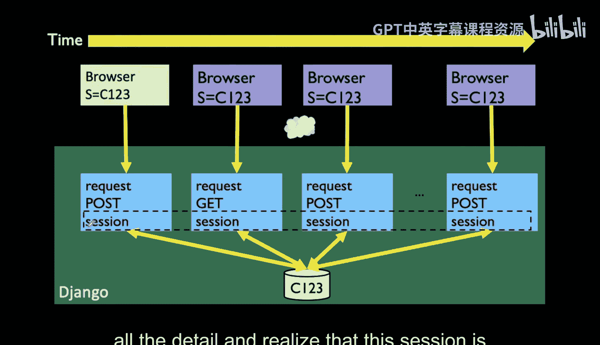

Things like sessions sometimes to store little bits of information so that in a later request。

 we can get it back。

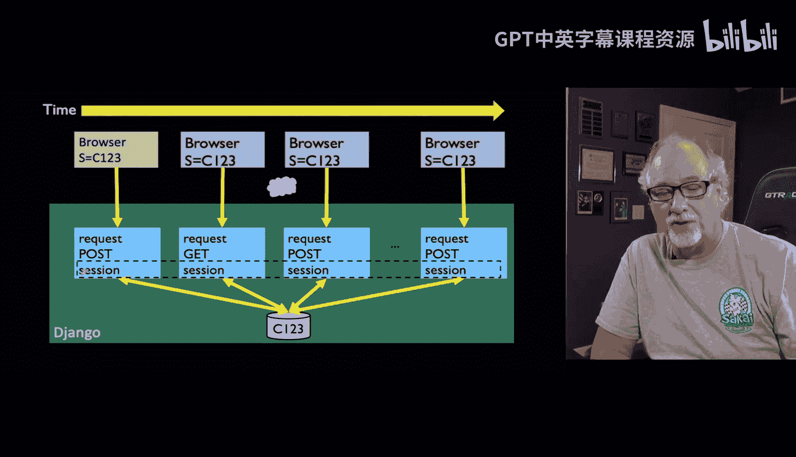

So the request object has this little attribute called request session which is basically a dictionary。

 we can put keys in it， we can delete those keys， we can update those keys。

 we can call dot get and retrieve a key to see if it's there， etctera。

 etc And so in a sense we just take request out session and treat it as a magical dictionary now we have to remember that each browser has its own dictionary but when we're in a。

View function， we're only dealing with one browser and so that session is the one associated with that browser。

 so it's this persistent interface， persistent data that lasts across all these things。

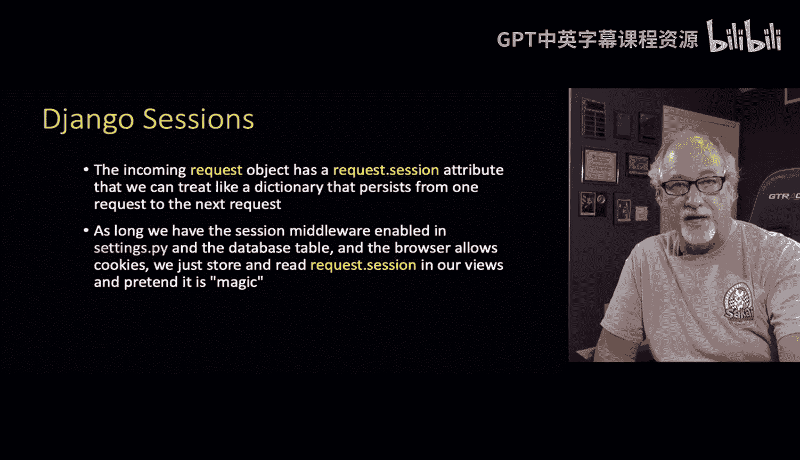

So here's a real tiny view function。You can see in this view function what we're going to do is request session。

 This is where request out session is where you see the session data。

 it's basically a dictionary so we can say dot get then we have a key and we have zero is the default。

 nu visits is the key zero is the default value and then we're going to get that and add one to it and then store that and this is kind of like how we do counting if we get it。

 if it was four before we're going to go to plus1 and get to5。 if it's not there。

 we just set it to zero so we set it to one so somehow nu visits is either one or one more than what was previously there。

 and so then what we see is we see the line that actually just stores it back into the session that's it。

 It's a dictionary。 It's a magic dictionary。 It existed before it came in。

 and we're just going to leave it there and somehow magic things take care of updating all this stuff。

 And so the other thing that we're going to do is we're going to have this go up by one。

If it gets over we're going over four then we're going to wipe it out so this will count1，2，3，4，1，2。

3，4 and well actually yeah  one， two，3，4， one，2，34 and so this Dell is just the standard pointython syntax to remove a entry from a。

To remove an entry from a dictionary， and then we just kind of print out the number of visits in our little string in our response and so if we go。

 we start we have no we have no cookie。

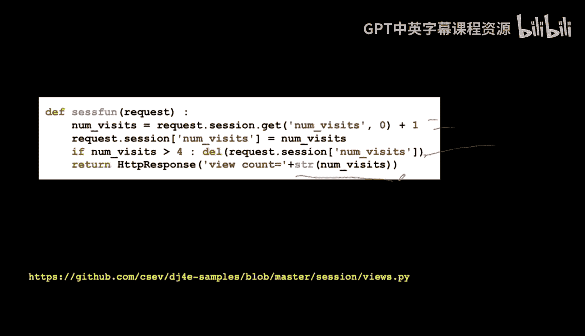

And means that we also then have no session。 and then we go into the session code。

 and you see that it has set a session cookie， right， So we see a session cookie called Csh I。

 It's got an expiration date， which is is not a expire when the browser goes away session and it's got some big long random number。

 And so that is basically the session Id until we get a new session。 And as a side effect of that。

 we've also stored the value1 inside the session in the server and printed it out。

So we went we came in， we established a session， we didn't do any of that right if we look at our view here。

 we didn't establish the session， all we did is grabbed something out of it and that's because the establishment of the session happens in the middleware that's kind of outside of us and so the middleware happens before our code starts and after our code is done and so the session stuff is just taken care of when we do that。

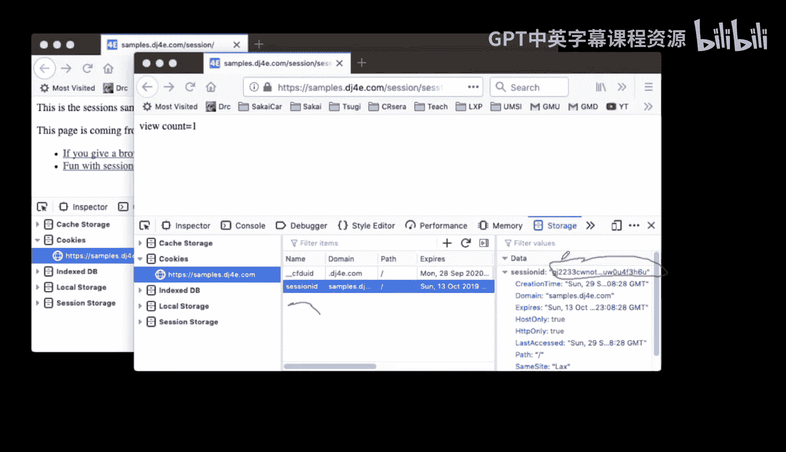

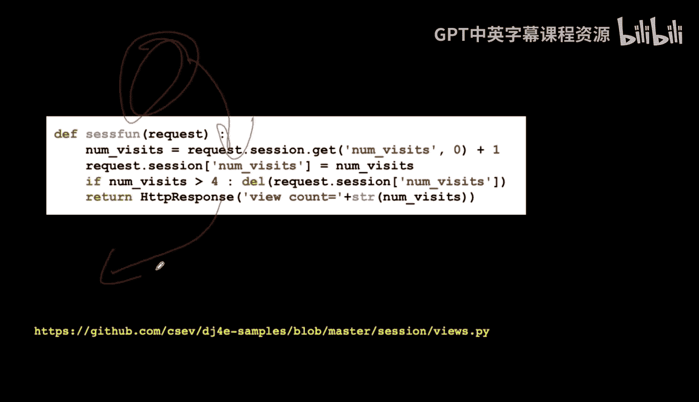

So view count is one。And then what happens is when we just hit refresh。

 it's going to send the cookie in for that session ID。 it's going to load up the。

 the session that's G J2233， and then our code is going to add one to that number and store it back into the session and then it's going to be two。

 And if we can't refresh， it would say3，4， then I would do a reset we1。 and so in this code。

 we just kind of say request that session and put stuff in it and read stuff out of it。

 And the cookie is the thing that looks that up。

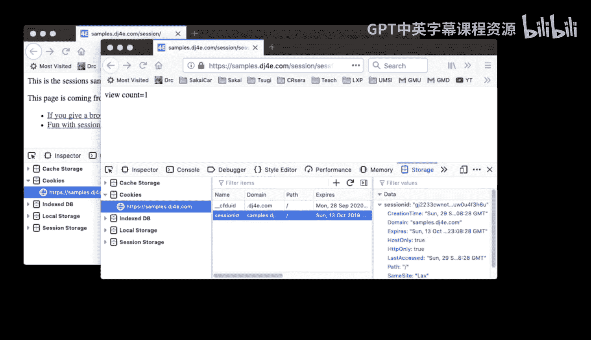

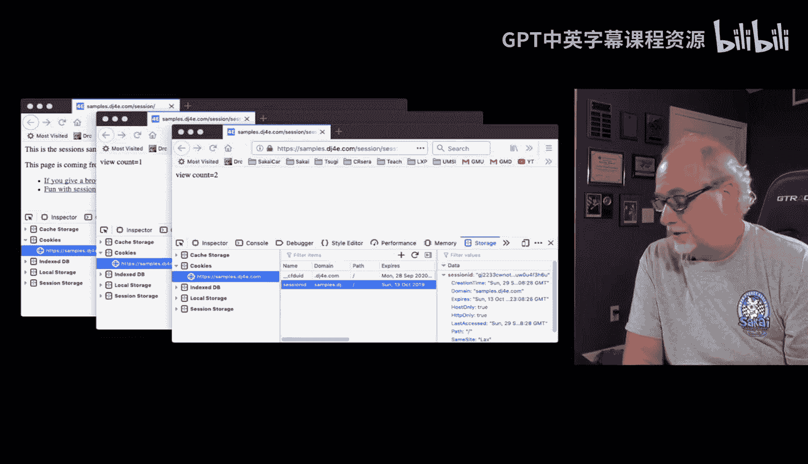

Now if we wanted to take a look at what's in the session table。

 it's really just a session and you can see that it gets created by your migrate and you make migrations so we can go right into the database we can ask for the tables。

 we can see the Django underscore session and then we can say select star from Django underscore session and so that will show us the data that's there and so what we're going to see。

Is the key。Whi is at session key and then a time and that's used to expire the session because these sessions don't last forever。

 The django middleware kind of cleans these up after a while。

 otherwise you'd have sessions that just lasted forever and ever and never。

And then the actual data is this big long string。 So what this is is this is actually an encoded string and if you really want to look at it。

 it's encoded using a technique called base 64 and there's a base 64 parsing library basease 64 is a way of taking arbitrary data and encoding it in basically letters and numbers upper or lower case it's a little less dense。

 I mean it kind of expands， it's not like a compression， it's the opposite of compression。

It expands it but makes it expands the data when it's encoded into base 64。

 but it also means that then you can store it， you have to worry about any special characters because sometimes when you're going like pasting single quotes and double quotes mess up all that kind of stuff by saying here's this string I'm going to encode it in base 64。

 I basically am guaranteed that there will be no weird weird characters that will cause some kind of problem farther on down the line。

So if we take a look at。And our thing， and we grabbed the little thing。

 that's the base 64 encoded variable。If you decode this， we're going to base 64 tocode it。

 you see that ultimately it's just kind of like a little key value pair that looks pretty much like a dictionary。

 it's a serialized version of a dictionary， it's a dictionary that has been put into a serialized form and it's in also JSON format and so we can actually sort of tear this apart and use the JSON library to load it up and see what we've got。

So that's there， you don't have to worry too much about that。

 it just somehow this big long thing is being read and written and read and written on every request response cycle that is certainly read on every request response cycle and it's written when you modify the data in the session。

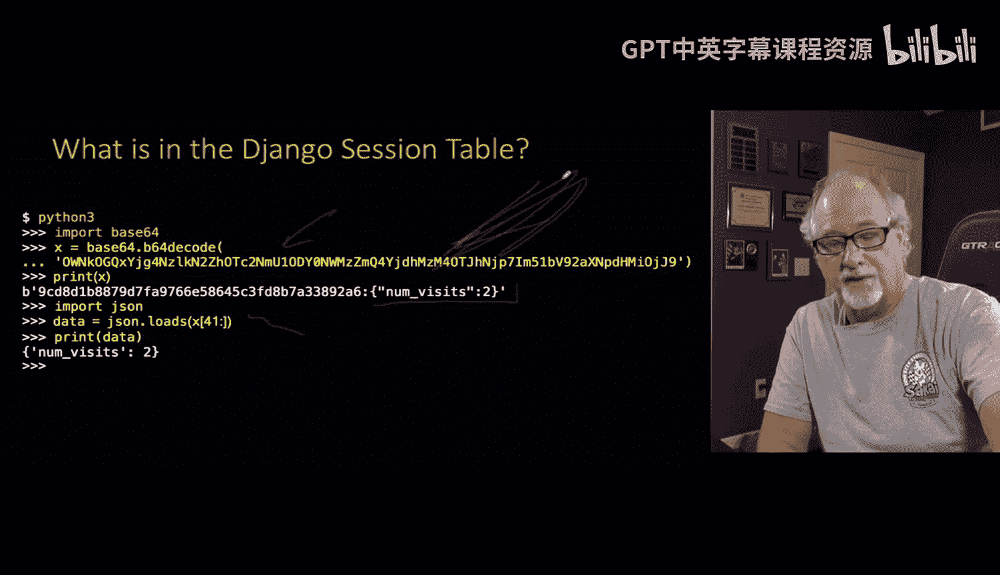

So this has been a quick set of lectures， we talked about cookies。

 a way of marking each browser with a big random number and then sessions which are a bit of data that's stored in a database indexed by that large random number。

 and then each request comes in we get the cookie back and then we look up the session。

 the data session data， key values， key value pairs basically a dictionary is all stored in there and so we talked a little bit about how we do request session in Django to implement to access session capabilities in our Django applications。

