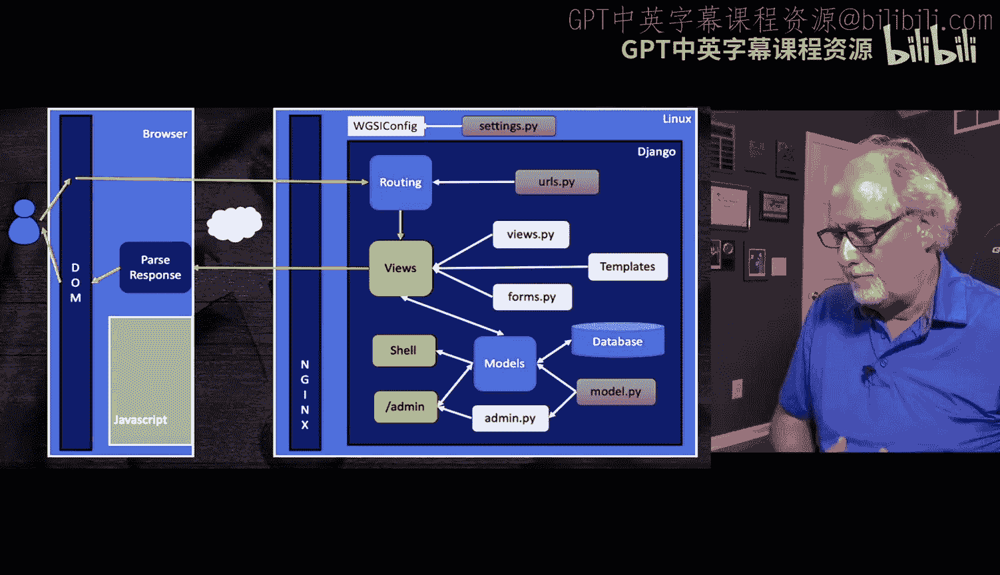
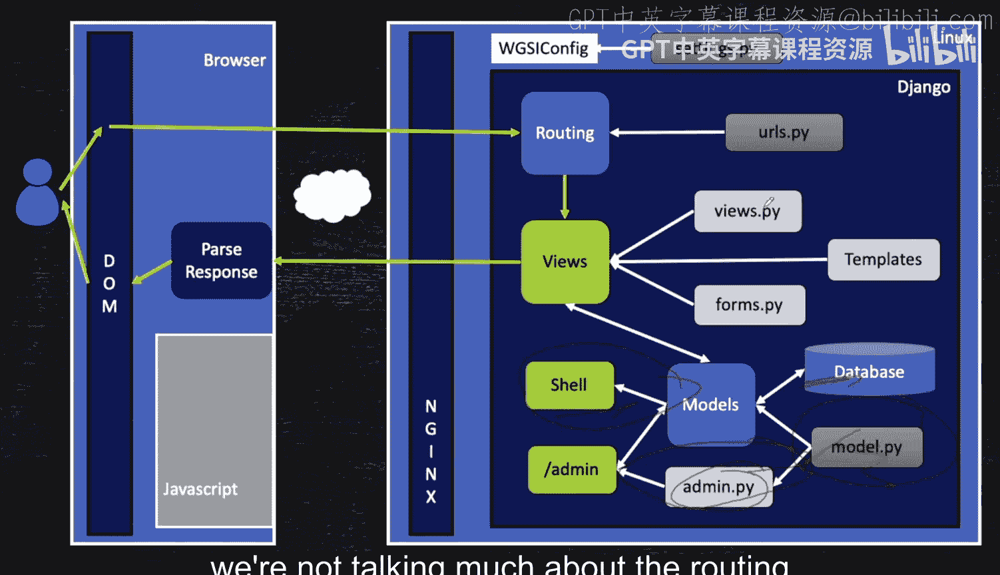
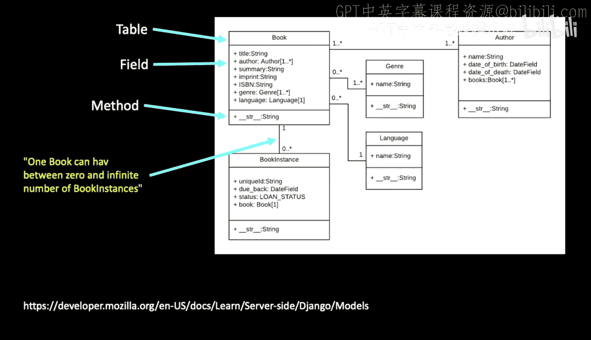
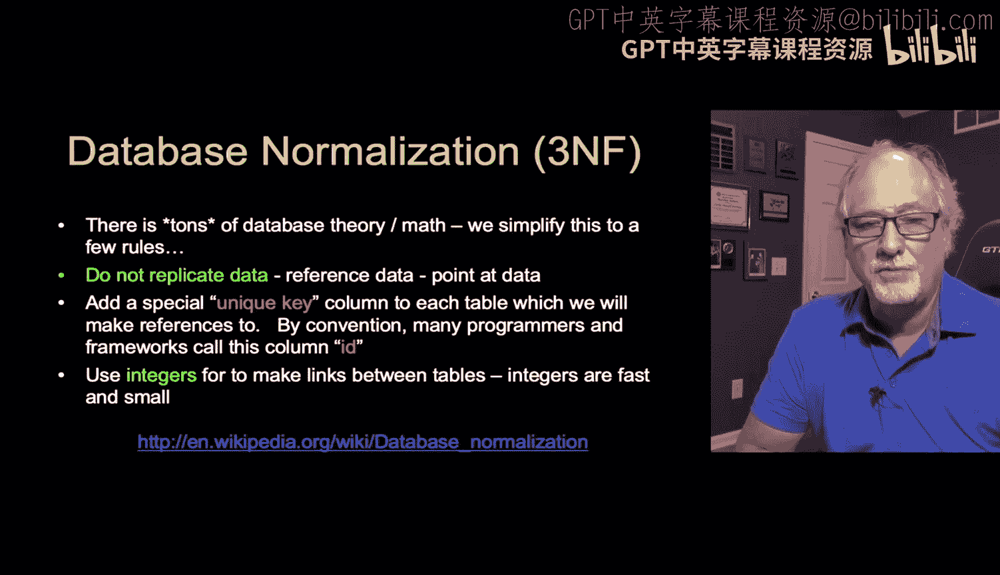
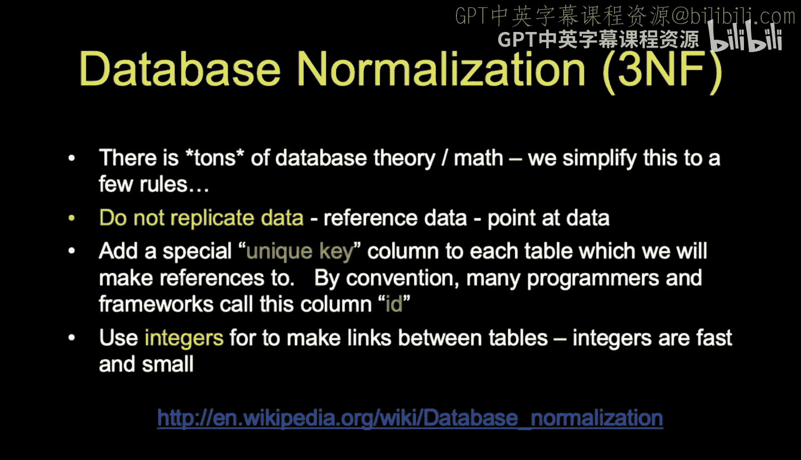
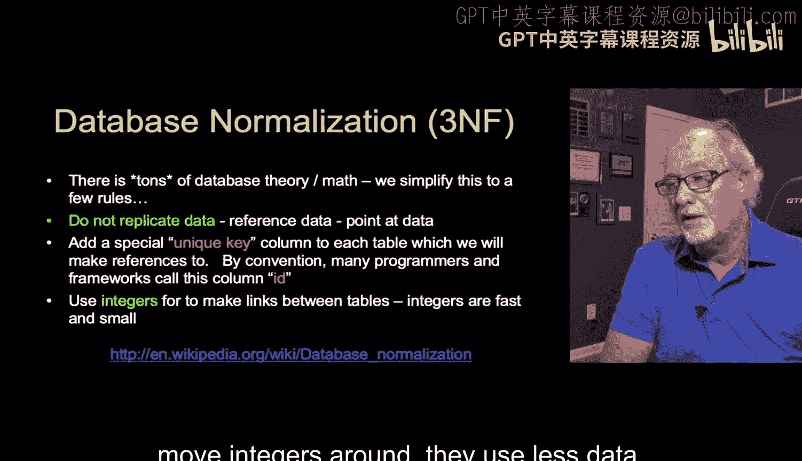

# Django for Everybody：4.2：一对多模型概述 🗂️




在本节课中，我们将学习数据建模的基础知识，特别是“一对多”关系模型。这是理解数据库设计中最简单也最核心的概念。

## 数据建模简介

上一节我们介绍了Django应用的基本结构。本节中，我们来看看数据建模的核心部分。我们目前正逐步构建一个Django应用，虽然尚未完成整个应用，但重点聚焦在 `models.py` 文件上，并会涉及一些 `admin.py` 的内容。`models.py` 是我们定义数据库结构的地方。我们通过数据模型对象来查看这个数据库，并且可以在 `admin.py` 中注册我们的数据模型。本节课我们不会过多讨论路由、视图、表单或模板，而是专注于Django应用的数据建模部分。后续课程我们会涵盖其他内容。

## 为什么数据建模很重要



我接触数据库的时间比较晚。很久以前在研究生阶段见过一点，当时不太喜欢关系型数据库。后来为了工作学习了关系型数据库，那时我已经是相当资深的程序员了，他们教我如何进行数据模型设计，我学得很快，并且彻底爱上了数据库。

模型设计是一个有趣的待解决问题，其基本理念归根结底是**数据存储和检索的效率**。这就像如果你构建一个像Facebook这样的在线应用，如果不巧妙地设计数据存储方式，假设每次登录Facebook都需要读取其所有数据来验证你的身份，那么登录一次可能需要花费2000到3000小时。显然，Facebook每秒有数百万人登录，其速度远快于此。因此，数据库的价值就在于将读取数据的时间从数天缩短到每秒数百万次。有时在数据建模时，你可能会觉得这很困难，会问为什么我们要如此费力。答案是，如果不这样做，应用就无法扩展。对于简单的数据挖掘，你可以遍历数据，但在构建交互式在线应用时，速度至关重要。

事实证明，像数据库中的大多数事情一样，你可以很快学会基础知识，而其余部分则是一种需要不断实践才能掌握的艺术。

## 数据建模的目标与方法

我们的目标是确定应用中想要存储的数据，然后绘制一张图，将这些数据分布到多个表中，并在这些表之间创建链接。通常，我们会从一个样本数据集开始。下图是我们将要构建的本地图书馆应用的数据模型，也是我们后续会反复参考的最终目标。不过，我们不会直接到达这个终点，而是从数据本身开始。

以下是该数据模型的图示：


在不同的应用或组织中工作时，你会发现数据模型非常重要。例如，下图是我的自动评分器（基于我构建的名为“Suie”的框架）的数据模型。如果你早期学习这个，我会展示数据模型、存储方式以及各种关联。这个数据模型花费了大量时间来完善，是应用的重要组成部分。另一个我参与的开源学习管理系统“Schi”的数据模型则复杂得多，下图只是其一小部分。如果你想改进这个应用，就必须理解其数据模型，因为数据最终会以扁平形式呈现在用户界面，但实际存储在非常特定的位置并通过链接关联，这就是为什么你会看到许多小方框和连接线。

以下是“Schi”系统部分数据模型的图示：


## 数据库规范化理论

关于数据库规范化有一整套理论，它非常重要。如果你有时间，建议阅读相关资料，如第一范式、第二范式、第三范式等。我不打算深入讲解其中的数学原理。




数据库规范化的关键要点可以归结为：**不要重复存储字符串数据**。这里的字符串数据指的是姓名、URL等内容。在一个系统中，任何字符串数据原则上只应存储一次。例如，我的电子邮件地址在系统中应以文本形式存储，且只存储一次，不应该出现多个副本。你需要做的是将电子邮件地址存储在一个地方，并赋予它一个编号（ID），然后在所有需要引用该电子邮件地址的地方使用这个编号。

这些整数编号就是**键**。我们创建键作为查找的句柄，然后指向这些键，并使用整数在表之间建立链接。因为整数处理速度快，计算机更擅长理解和移动整数，它们占用数据量少，比较速度也快。因此，整数在数据库链接中非常重要。


## 核心概念总结

让我们用公式和代码来总结核心概念：



*   **核心目标**：通过规范化设计，避免数据冗余，提升存储和查询效率。
*   **关键实现**：使用**主键** 和**外键** 在表之间建立关联。
    *   **主键公式**：`Primary Key = Unique Identifier for each row in a table`
    *   **外键公式**：`Foreign Key in Table A = Primary Key from Table B`，用于建立从A到B的引用。
*   **代码示例（Django模型概念）**：
    ```python
    # 假设Author和Book是一对多关系（一个作者写多本书）
    class Author(models.Model):
        name = models.CharField(max_length=100)
        email = models.EmailField(unique=True)  # 确保电子邮件唯一

    class Book(models.Model):
        title = models.CharField(max_length=200)
        # 外键字段，指向Author模型的主键，建立“一对多”关系
        author = models.ForeignKey(Author, on_delete=models.CASCADE)
    ```
    在上面的代码中，`Book` 模型中的 `author` 字段是一个外键，它存储的是 `Author` 表中某条记录的主键（一个整数ID），而不是直接存储作者的姓名或电子邮件字符串。这避免了重复存储作者信息。

## 后续内容预告

接下来，我们将查看一些示例数据，然后为这些数据设计一个数据模型。

## 本节课总结





本节课中，我们一起学习了数据建模的基础，重点理解了一对多关系模型的重要性。我们探讨了数据建模的目标是提高效率，其核心方法是避免数据冗余，并通过整数主键和外键在表之间建立高效的链接。我们还简要了解了数据库规范化的概念，并预览了后续的实践步骤。掌握这些基础是设计出高效、可扩展Django应用的关键。