# 密歇根大学《给所有人的Django课程（简介、开发Web APP、特征和库、JavaScript和JSON）｜Django for Everybody》中英字幕 p80 20_04_03_一对多模型中的去重优化.zh_en -BV1Kt421V7EE_p80-

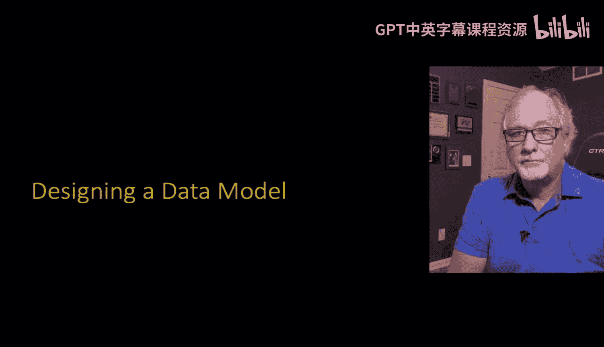

So now let's design a data model。Usually you start out with a user interface that if we're going to build an application。

 you're going to end up with a user interface。In this I'm not going to really start with the user interface。

 I'm going to start with like a spreadsheet view and if you've ever done something like tried to organize your music collection with a spreadsheet or a video collection with a spreadsheet or you know you find that spreadsheets are super convenient because you can scroll around and do stuff and you you've learned SQL you know you can go into various cells with SQL。

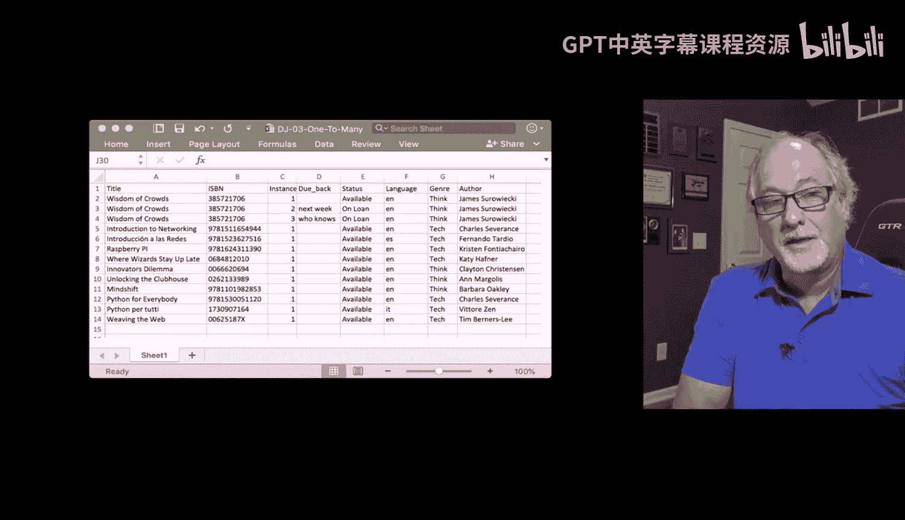

Rrows and columns and updating and do all this stuff。But you find that after a while。

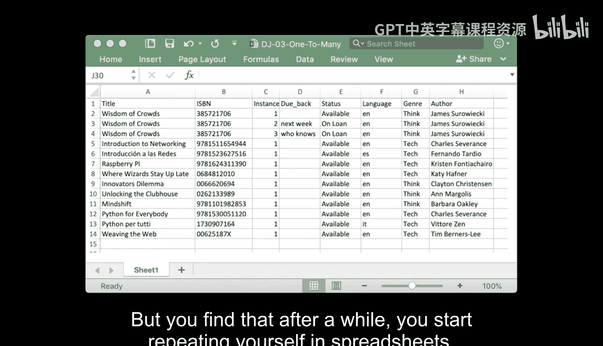

You， you start repeating yourself in spreadsheets and you find it's really difficult because it's really easy when you're putting data into copy。

 paste， copy， paste， paste， paste， paste， paste， paste， and put the same stuff in。

 But then what if you want to change it。 And this is where this vertical replication or the replication of data in multiple places is very bad。

 So here's kind of an exploded table view of that same data。 And this is it's okay。

 this is the data that we've got to do。 And so if we look at the use cases of our application。

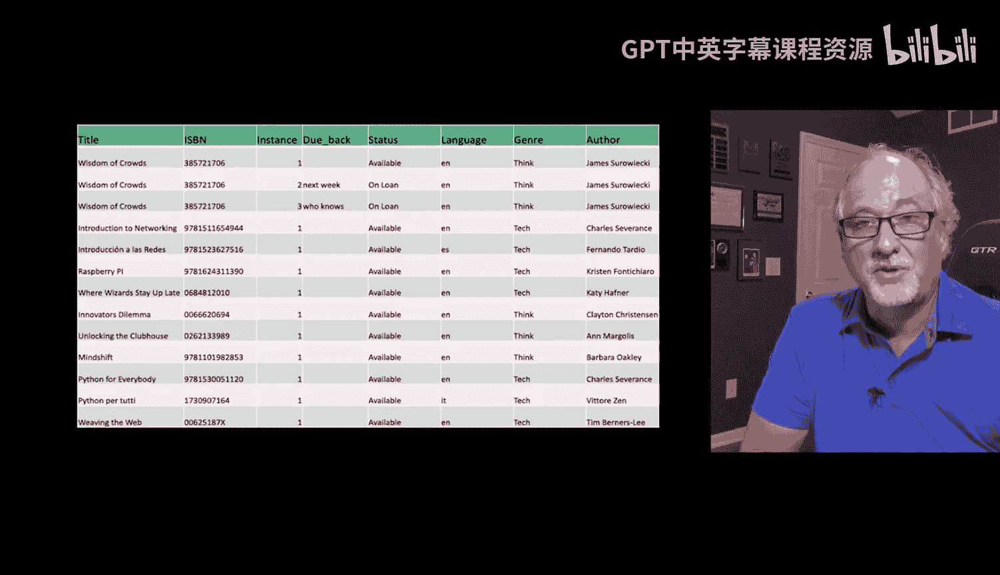

What we see is there's a series of books。Like in this cross， Widom McCrowds is a book。

 introductiontrouction to networking， these are all books coming down here unlocking the clubhouse。

So the first column is titles of books， the second column is the ISBN。

 and then we are sort of keeping track because we're a library and so we might have more than one book and we're going to call those the book instance。

 so instance one instance 2， instance 3， each book each physical actual book so you might have no physical books actually or you might have one physical book or five physical books and each physical book might be checked out and have a due date and so we have a status and then we have something like say the language of the book or the genre of the book or who wrote the book right and so that's kind of our the data we're going to represent in this application。

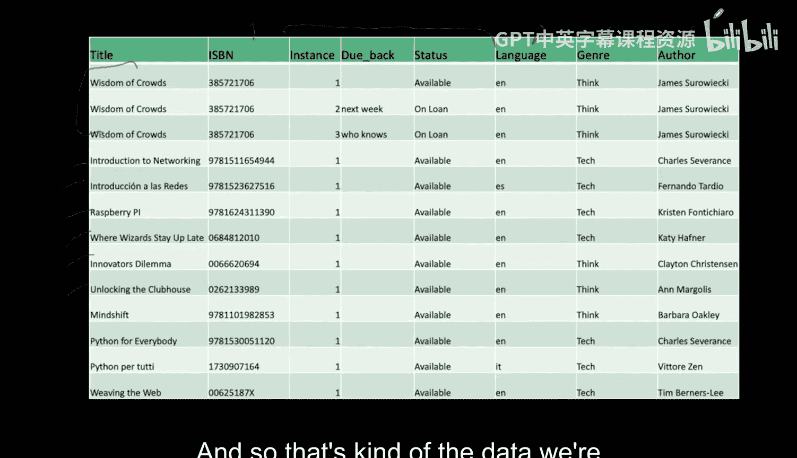

Now， when you're looking at this， the first thing you do is you go like。

Anything where you've got vertical replication is a problem。 And so you've got to be careful。

 So you look for vertical replication。 And the places that are problematic in this table view of all of our data。

 like the status， the language， the genre。 you see the word think， think， think， think， think。

 Those are strings， right， They're not numbers。 Wi of crowdrows。

 wisdomdom of crowds wisdom of crowds。 and the problem here with wisdom of crowdrows is that there are three instances of the book。

 But then because we've got this all in one row， I mean。

 one table with just a bunch of columns and not multiple tables。 Well。

 we have to replicate the name wisdom of crowds three times so that we represent the three instances。

 The same is true about the English language and the genre and the author name， right。

 are these these are the same authors。 So this vertical replication is your first clue that says that you've got to you've got to come up with a smarter data model than just this。

😊。

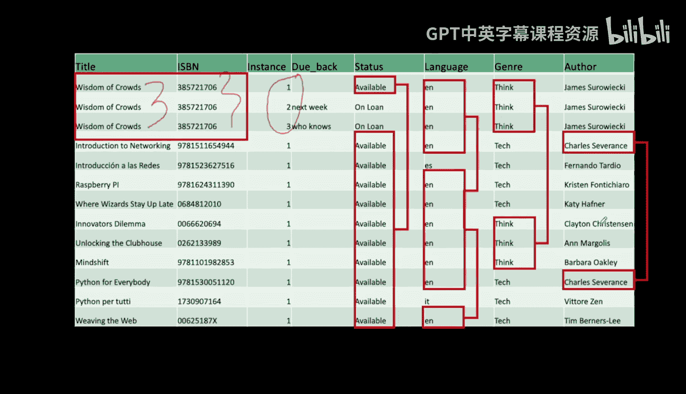

And so the idea is， is you're not allowed to put something like the string E N English in more than once in your whole database。

 So what you have to do is you have to split this all out。

 Some you have to glue duplication by making a language table， a book table and an instance table。

 And so in the book table， you only put wisdom of crowds once。

 and you only put the English language in once in Spanish in once。

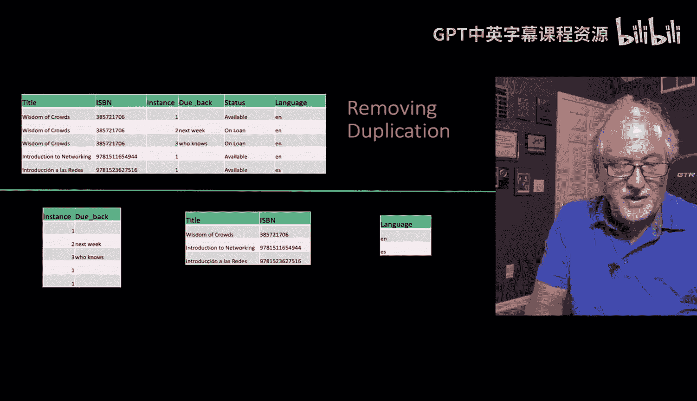

But then the problem is， okay， somehow we've taken this data and moved it from one big。

 long bunch of columns。To three tables with sets of columns。

 but we still have to represent all the original data that we were working with before。

 we have to represent all that stuff。

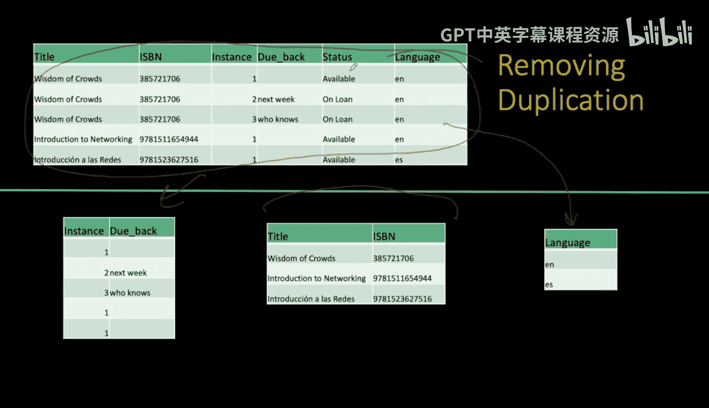

嗯。And so this is where we have to be able to make connections。

 and this is the essence of relational databases and that is。They don't replicate data。

 but they make connections from one data item to another data item。

 And so what we're going to do here is in the case of the wisdomdom of crowds。

 we are going to have three book instances。 But somehow they all point to one book in the book table。

 right， And so， and so we have two books that point to the English language and one point to the Spanish language。

 Now， this seems。

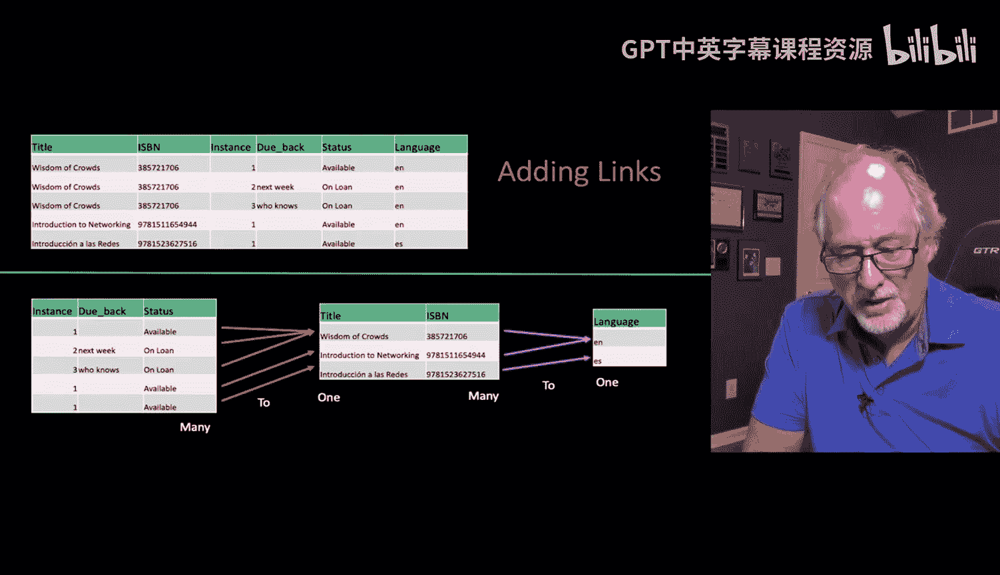

Like， wow， that wasn't such a big deal。 But when you do millions of records， it actually matters。

 It's the string data that gets you in trouble and requires far more scanning and far more storage。

 And another thing that happens is when you follow this rule of only one copy。

 But what if we wanted to turn this to uppercase E N or something。

 that means as long as the data is linked rather than replicated。

 That means you're only changing one copy。 So the replication has a performance advantage as a storage advantage and it has a modifiability advantage when there's only one place。

 if we mistakenly misspelled the title of wisdom of crowds。 It's easy。 We fix it。

 that's not in these other tables。 Where if we misspell the wisdom of crowds here。

 we have to go find on the top one， where it's just all one big， long spreadsheet。

 we got to go and like do a search and in place。 But but what if what if that's in a different column in So So the idea of getting to the point where we have unique rows and we。

those rows now I haven't told you much about how this magically works。

 I just said we can draw some arrows， and so by drawing those arrows。

 we've got to show you how those arrows get drawn because that's really important。

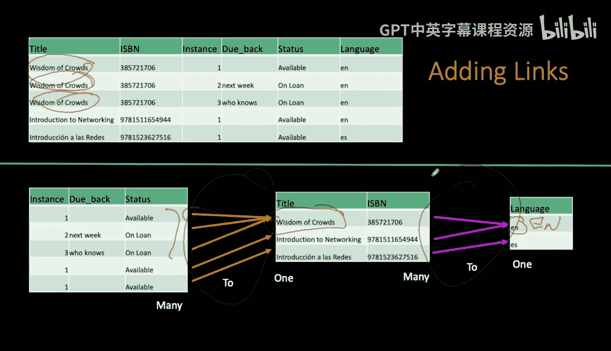

So this is how you start drawing the picture of your database。

The kind relationship we're going to have between tables is like a many to one。

So when we say many to one， what we're saying is that there is。One English language entry。

 and then there are many books that go to it。So that's a many to one relationship。

 so it could be just one， but it's many。And if we look at the data model that we see from the Django example from the MazilDevelop network。

 we can look at this and we can see here， right？This connection between the book table and the language table has two ends to it。

 and it has a direction to it。 And one n says 0 dot dot asterisk， and the other end says one。

 So this is many0 dot dot asterisk means a number between 0 and infinity， including 0。

 which means it's possible for a book not to have a language。 We'd call that。

 we call that null and database concept。 So theres， there's a book with no language。

 or many books can have one language。 So is there's one language English。

 And there is as many books as we want， including potentially zero books， right。

 So we might have a language that has no books in our library with that language， and that's okay。

 So in this one。

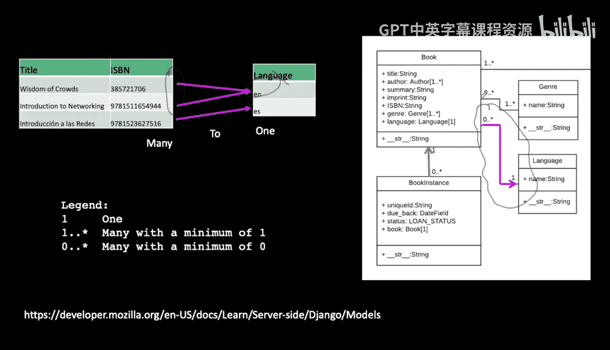

Between book and language， it's okay to have 0。 So 0 through infinity on the book side of the relationship and one on the language side of the relationship。

 If then we look at the the relationship between the。

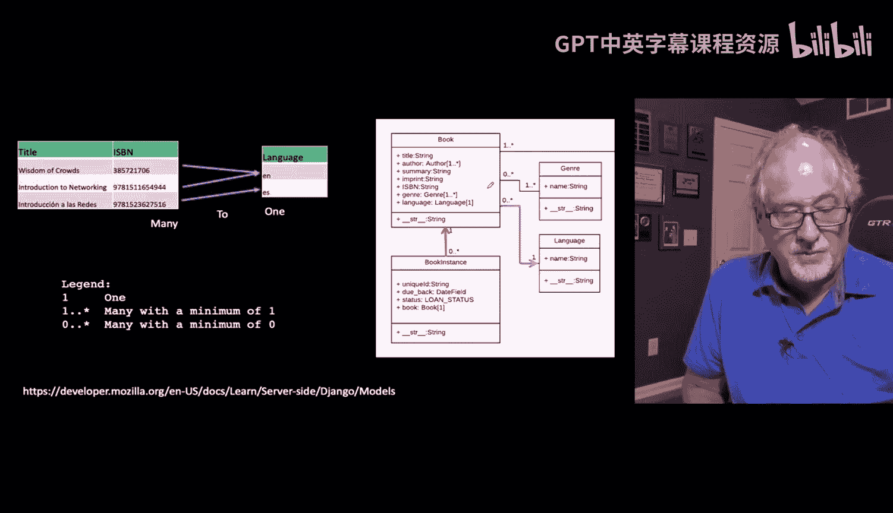

The book。And the book instance。 Now， remember what the book instance purpose is to record the fact that we have multiple the actual physical copies of the books that we have。

 And so we might have multiple copies。 And so if you look at this， it's pretty much the same。

In that there is any number of book instances from zero until infinities。

 and you could have a book in your book table。For which you didn't actually own a physical copy。

 and that'd be okay。 We would know things like what its author was， what its genre was， et cetera。

 And then we would buy a copy of said book， and we'd add a copy to the instance table。

 and then we'd link that into that book。 So again， you can have0 book instances0 through infinity book instances mapped to a single book entry。

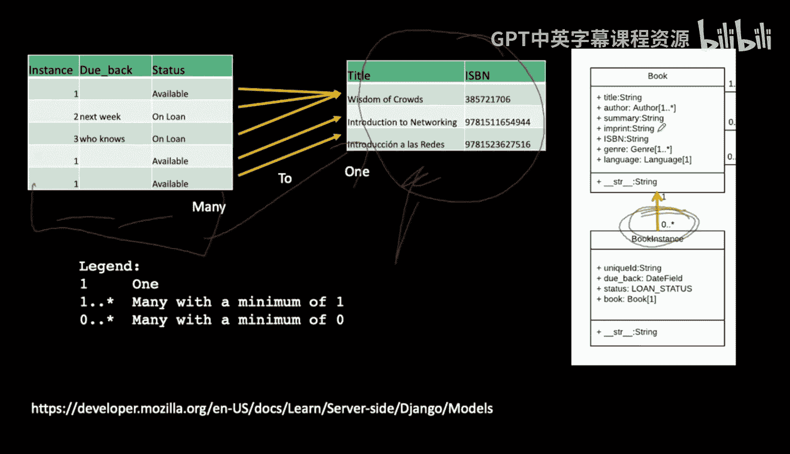

Okay， and so this little legend， you know， zero to infinity to one is。Is how we read this table。

 And you will see database tables that have different syntaxes。

 but they all are capturing the same thing。 And that's the cardinality or the number of things at each end of the arrow。

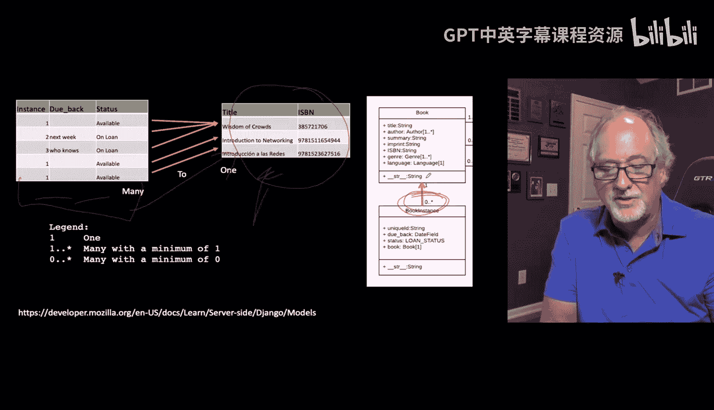

So up next we're going to show you how to actually physically store this information in the database so far I've been just sort of saying and there's an arrow。

 but we have to have a way to actually store it in the database。

