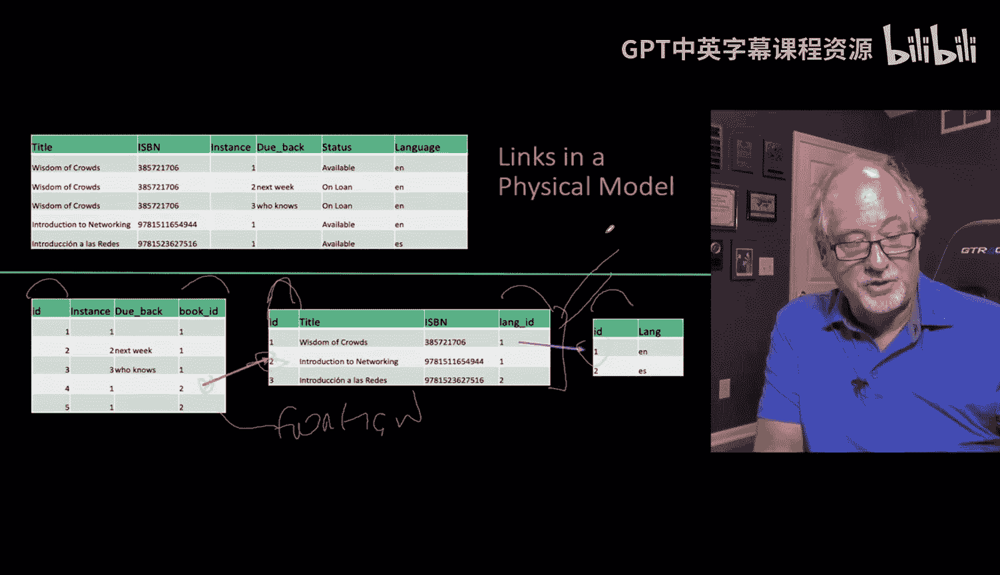
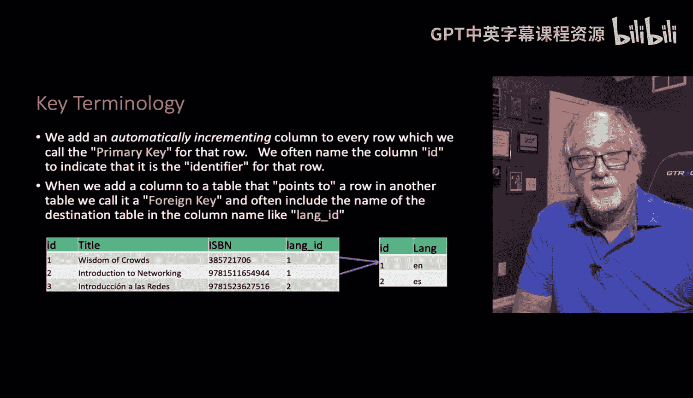
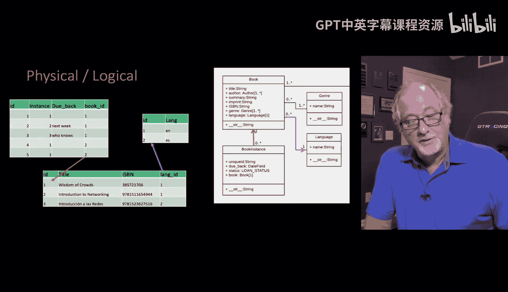

# Django for Everybody：4：数据库中主键与外键的存储 🔑


在本节课中，我们将要学习如何在数据库中表示表与表之间的链接关系。我们将重点介绍主键和外键这两个核心概念，它们是构建关系型数据库模型的基础。

---

## 数据库中的链接表示

到目前为止，我们一直在用箭头图示表之间的关系，并假设你已经理解了其原理。例如，一些“书籍实例”行可以神奇地连接到一些“书籍”行，而“书籍”行又可以连接到“语言”行。


实际上，我们是通过一种特定的方式来实现这种连接的，即在每个表中添加一个称为“键”的列。

---

## 主键：行的唯一标识符

我们称这种键列为**主键**。通常，我们将这个列命名为 `id`。数据库中有一种方法可以将其设置为**自动递增**和**主键**，并为其建立索引，这使得查询速度非常快。这个主键就像是行的“句柄”。

主键是箭头指向的终点。例如，我们可以设定“英语”是语言表中的第1行（`id=1`），“Wi of crowds”是书籍表中的第1行（`id=1`），“Introduction to networking”是书籍表中的第2行（`id=2`）。这个 `id` 可以在整个系统的其他地方被引用，整数重复在这里不是问题。

**核心概念**：主键是表中唯一标识每一行的列。
```sql
CREATE TABLE book (
    id INT AUTO_INCREMENT PRIMARY KEY,
    title VARCHAR(255),
    ...
);
```

---

## 外键：指向其他表的链接

接下来，我们在表中添加另一种列，称为**外键**。这些外键是箭头的起点。按照惯例，我们以目标表的名称加上下划线和 `id` 来命名它们，例如 `book_id`。

外键允许我们从一个表指向另一个表。通过在每个需要作为箭头起点的位置设置外键，并在每个需要作为箭头终点的位置设置主键，我们就建立了表之间的关系。实际上，我们几乎为每个表都设置了主键，以确保每一行都有一个唯一标识。

在这个例子中，一个表可能只有一个外键，但一个表完全可以拥有多个外键，指向多个不同的表。

**核心概念**：外键是一个表中的列，它引用另一个表的主键，用于建立表间关系。
```python
# 在Django模型中的示例
class BookInstance(models.Model):
    book = models.ForeignKey(Book, on_delete=models.CASCADE)  # book_id 就是外键
```

---

## 主键与外键的关系

正如之前所说，**主键**是我们添加的、作为行句柄的列。而**外键**是我们添加到表中、用于指向其他表某行的列。




一旦我们创建了这些外键列和主键列，就可以开始利用这些链接来构建数据模型。这些链接共同作用，最终形成了我们之前图示的完整数据关系网络。




---

## 总结与预告

本节课中，我们一起学习了数据库关系模型的核心：**主键**和**外键**。主键唯一标识表中的每一行，是关系的目标；外键则存储了指向其他表主键的值，是关系的起点。通过组合使用它们，我们可以在数据库中清晰地表示和管理复杂的数据关联。

在下一节中，我们将探讨如何在Django框架中表示和操作这些链接关系。



