# Django for Everybody：4.5：Django中一对多模型的表示 🗂️

在本节课中，我们将学习如何在Django数据模型中表示一对多关系。我们将探讨如何使用外键字段链接不同的模型，理解模型迁移的工作原理，并学习如何配置删除行为以维护数据的一致性。

## 数据模型与关系表示

上一节我们讨论了如何通过将数据拆分到多个表并使用主键和外键链接来减少数据冗余。但在Django课程中，我们不会直接操作数据库层面，而是通过Django的数据模型来实现。

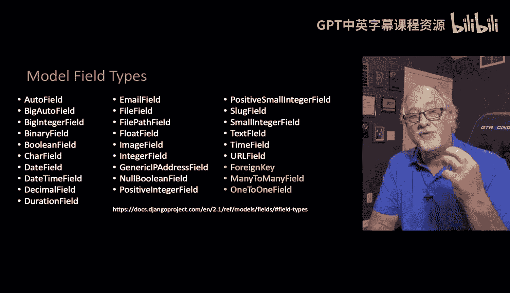

在Django中，我们使用`models.py`文件中的数据模型来完成这项工作。模型字段类型包括字符、数字、日期或长文本字段等。但其中一些字段是特殊的，用于处理关系，例如**一对多外键字段**和**多对多字段**。这些字段用于在我们的Django数据模型中建立链接。

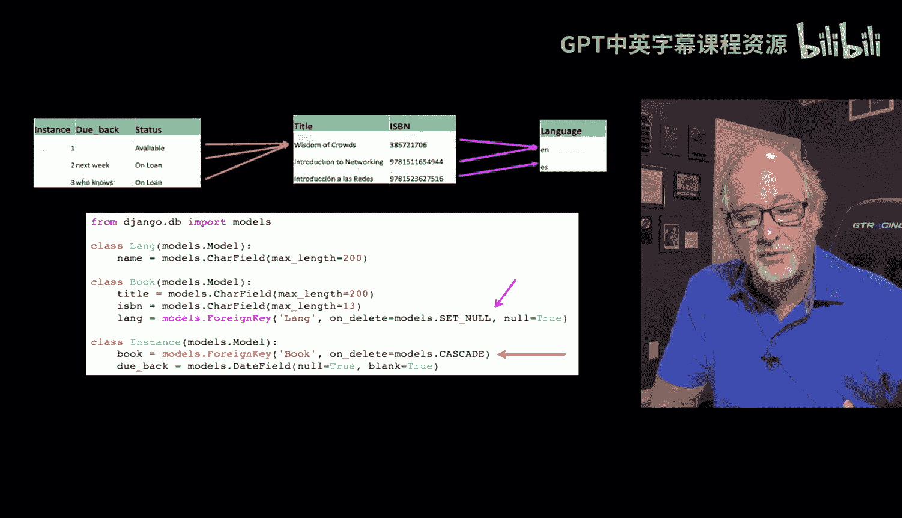

以下是这些关系在模型中的表示方式：


如果我们的`BookInstance`模型链接到`Book`表，而`Book`表又链接到`Language`表，最终在我们的模型中会形成特殊的关联线。


## 定义模型与外键

我们来看一个具体的模型定义。大部分内容都很熟悉。我们有一个`Language`模型，它有一个`name`字段。关于Django的一个特点是它会自动添加`id`字段，这很方便。因此，你可以假设数据模型中的每个表都会自动拥有`id`字段。

我们甚至不需要讨论外键的名称，尽管Django会按照我展示的方式（例如`lang_id`）来命名它们。我们只需要定义一个常规的字段。`Language`模型适合作为链接的目标，因为它有一个由Django自动添加的`id`列。`Book`表也有一个`id`列，因此也适合作为链接的目标。

但关键在于`Book`模型中的这个字段：

```python
language = models.ForeignKey('Language', on_delete=models.SET_NULL, null=True)
```

这是我们实际建模`Book`表与`Language`表之间链接需求的地方。我们从箭头的起点（即`Book`模型）开始，声明我们需要一个`language`字段。但这个`language`不是一个字符串或数字，它是一个**外键**，指向名为`Language`的表。这个名为`Language`的表与模型匹配。

这里有几个参数需要说明：
*   `on_delete`：我们稍后会详细讨论。
*   `null=True`：表示该字段是否必需。当`null=True`时，我们允许该字段为空。这意味着`Book`表中的一条记录可以没有关联的语言。

类似地，`Instance`表（即`BookInstance`模型）指向一本书：

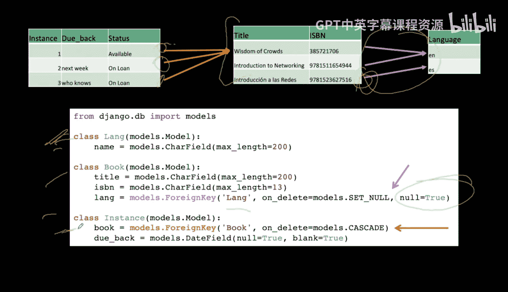


```python
book = models.ForeignKey('Book', on_delete=models.CASCADE)
```

它是一个指向`Book`模型的外键，并且有一个`due_back`字段。这里的状态字段被我简化了。我们再次定义了箭头的起点，因为箭头的终点是隐含的（即目标模型的`id`）。

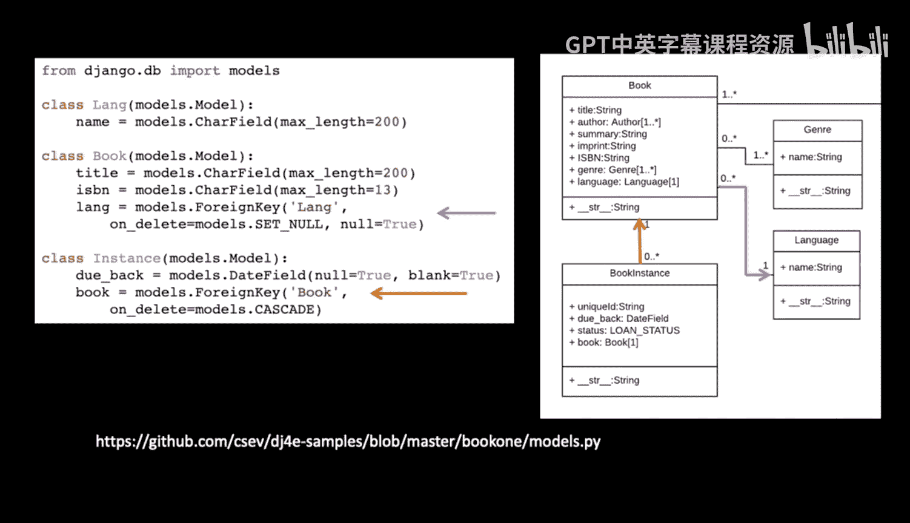

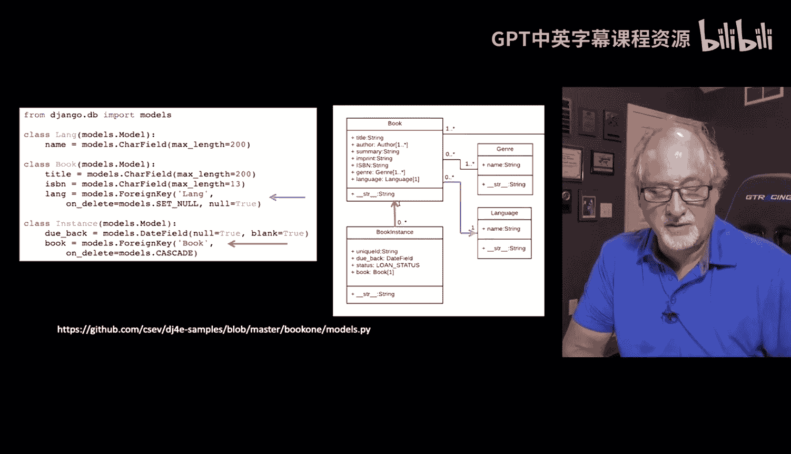

Django会自动为这些模型中的每一行提供主键，我们无需显式声明。但如果你想覆盖主键的名称，也可以在Django模型中指定。不过，通常大家只需要一个名为`id`的列，所以不声明它，Django会自动为你添加。


再次从数据模型的角度来看，`Book`和`Language`之间的箭头代表多对一关系，`BookInstance`和`Book`之间也是一个多对一关系。这些外键链接代表了数据模型中的箭头。


## 模型迁移流程

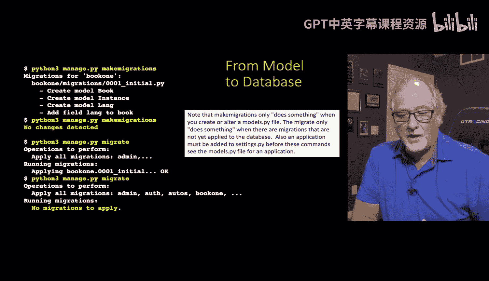

现在来回顾一下，你可能已经做过一些迁移操作。一旦你编辑了这些数据模型并确认正确，你需要执行一个两步流程，使你的数据库反映出这些模型的变化。

第一步是**创建迁移**。`makemigrations`命令的工作方式是：检查你`settings.py`中注册的所有应用程序，对于每一个应用，它都会检查数据模型自上次运行`makemigrations`以来是否发生了变化。

`makemigrations`实际上会根据`models.py`在你的应用程序中创建文件。这些是一系列文件，例如这里的`0001`是第一个。如果我们更改了模型并再次运行`makemigrations`，将会生成`0002`。`0002`是在`0001`基础上的演进。

迁移文件是**可移植的**，它们不特定于MySQL数据库或SQLite数据库等。


第二步是**应用迁移**。`migrate`命令读取这些迁移文件，然后更新数据库中的实际表。因此，`migrate`是将数据库中应有的内容的可移植表示，映射到数据库中的实际物理表示。

你会注意到，如果你成功运行这两条命令后再运行，它们会显示“未检测到更改”。因为对于`makemigrations`，它会比较你的模型和已有的迁移文件，如果完全匹配，就认为没有变化。对于`migrate`，它会比较迁移文件中的内容和数据库表，如果一切都已就绪，也会认为没有变化。

这有时会让人困惑。在我的文档中，我可能会说“运行`makemigrations`”，而你看到“未检测到更改”。另一个可能导致“未检测到更改”的原因是，你必须在`settings.py`文件中添加该应用，它才能被检测到。所以你可能编辑了`models.py`文件并进行了更改，但如果该应用不在`settings.py`中，那么更改就不会被检测到。`makemigrations`会遍历`settings.py`中列出的所有应用程序，检查`models.py`和迁移文件之间的差异。通过实际操作展示可能更容易理解，我们稍后会看到。

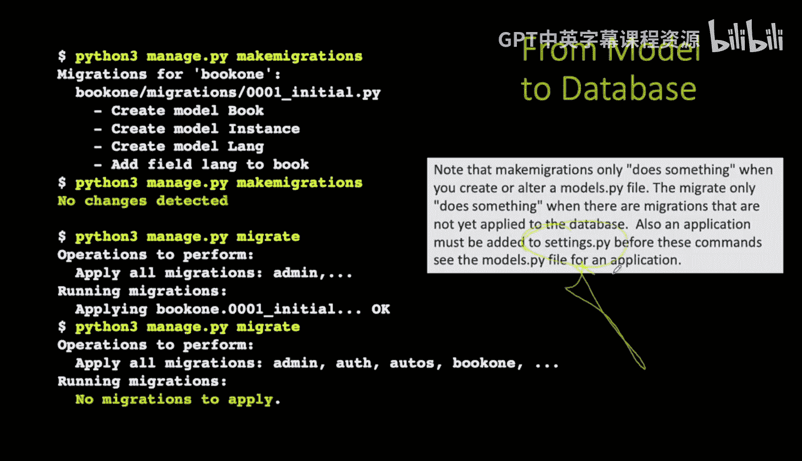


## 迁移的底层实现

如果我们看看`migrate`做了什么，它会创建SQLite文件。你可以在运行`migrate`后查看这个文件（虽然不是必须的）。

你可以看到，我使用了一个通配符`%`来查询所有以`book1`开头的表。结果显示有三个表：`book1_book`、`book1_instance`和`book1_language`。`book1`是应用程序的名称，因为Django有项目和项目内的应用程序，`book1`就是我们正在操作的应用程序。而`instance`、`book`和`language`是我们在`models.py`中指定的三个模型。

如果我们使用`schema`命令查看`book1_book`表，可以看到`migrate`语句是如何生成这个表的。

我们创建了`book1_book`表。它有自动递增的`id`字段，这是SQL的标准内容。它有`title`和`ISBN`字段，然后有这个`lang_id`字段，这就是外键。所以它现在正以正确的方式构建外键。

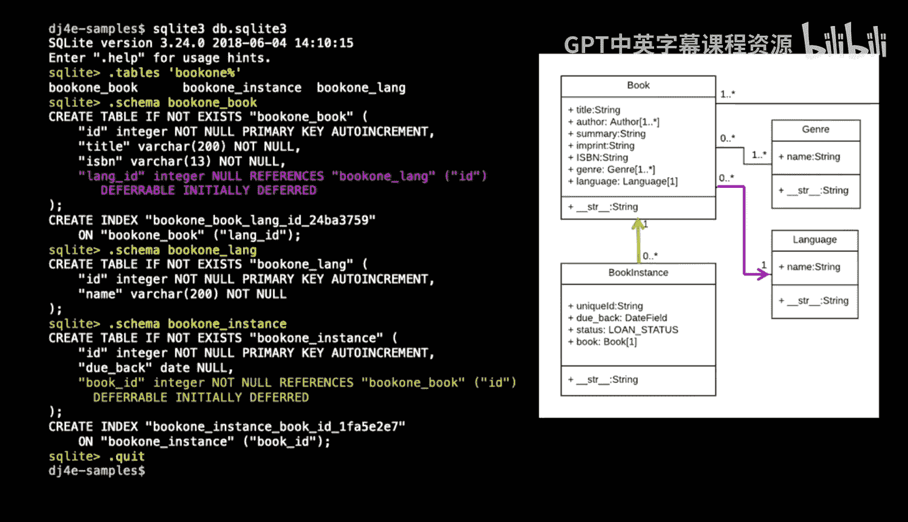


在SQLite中构建外键有一种方式，在MySQL中有另一种方式。`migrate`操作理解如何构建所有这些差异。

如果你查看`language`表，你只会看到自动生成的`id`列和一个`name`列。查看`instance`表，你会看到`id`、`due_back`（日期类型），以及`book_id`，这是指向`book`表的外键。这样，你就能大致看出这些表是如何实现图中描述的链接的。

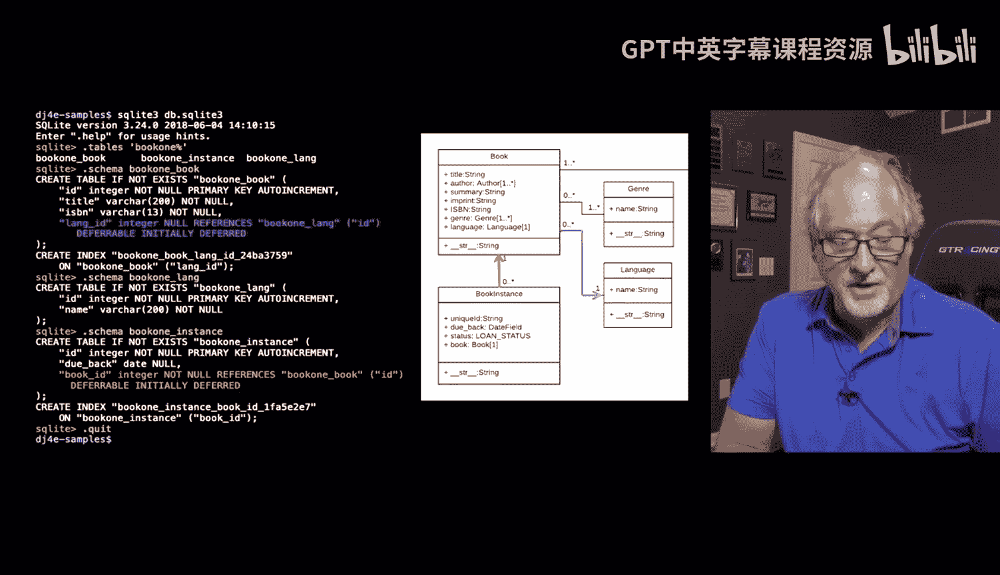


## 配置删除行为

现在，我来谈谈之前提到的`on_delete`参数。问题是，当你有一个表中的一行（例如`book`表中的一行）指向`language`表中的一行，并且有记录指向它时，会发生什么。假设有两本书都指向“英语”。然后你删除了“英语”这一行。那些指向它的行会怎样？

有几种不同的处理方式，但两种常见的方式是`CASCADE`（级联）和`SET_NULL`（置空）。
*   `CASCADE`表示：如果你删除那些行（指目标行），你将删除所有具有匹配`language_id`的行。
*   `SET_NULL`基本上表示：没关系，我们只是清除这些链接并将它们设为`NULL`。

在这个例子中，如果我们从`language`表中删除一种语言，我们可能只想将其设为`NULL`。

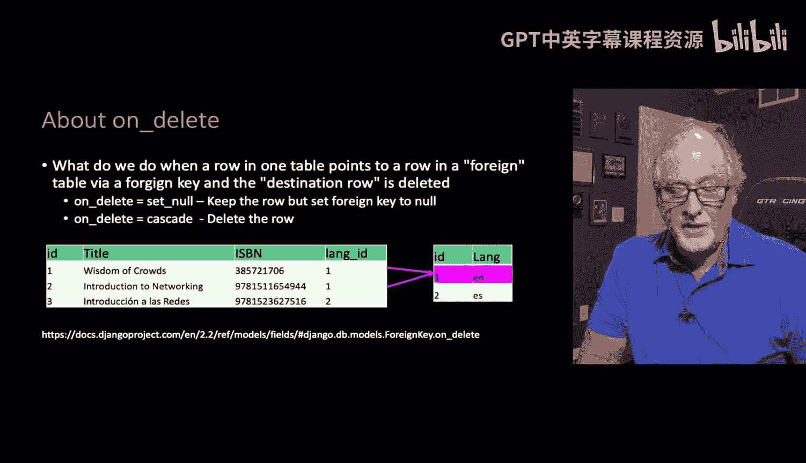
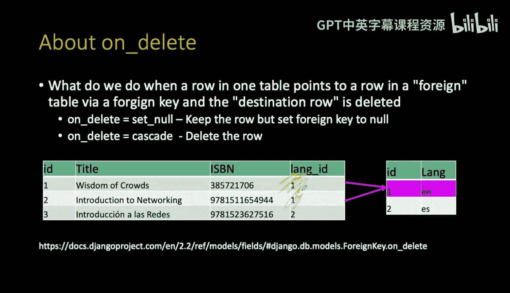


因此，如果你查看`Book`和`Language`之间的关系（就在这里），如果我们删除其中一个，我们将其设置为`NULL`。我们将相应的语言设置为`NULL`。从某种意义上说，我们只是丢弃了这些链接，这是可以的，因为书籍被允许没有语言。所以语言字段允许为`NULL`（`null=True`）。

另一方面，如果我们从`books`表中删除一本书，那么我们可能希望清除与该书相关的所有实例。这就是为什么我们在`BookInstance`模型的`book`外键条目中，设置`on_delete=models.CASCADE`，并且没有设置`null=True`。

`SET_NULL`要求你能够接受该字段为`NULL`（即`null=True`）。所以你必须说：我愿意允许此列中出现空值。哦，顺便说一下，如果此列指向的内容被删除，则将其设置为`NULL`，这意味着不要删除该行。

而`CASCADE`意味着：如果我们指向的内容被删除，则删除此行，因为我们不想要不一致的数据。我们不希望那些小东西指向无处，变得毫无意义。

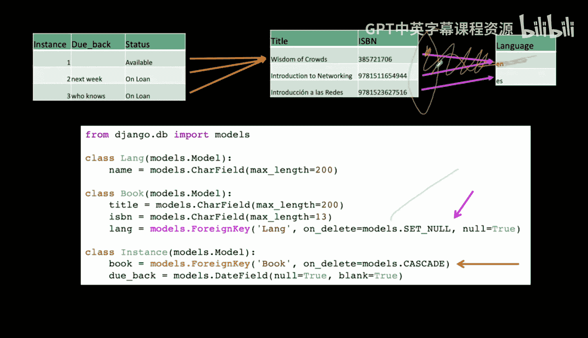
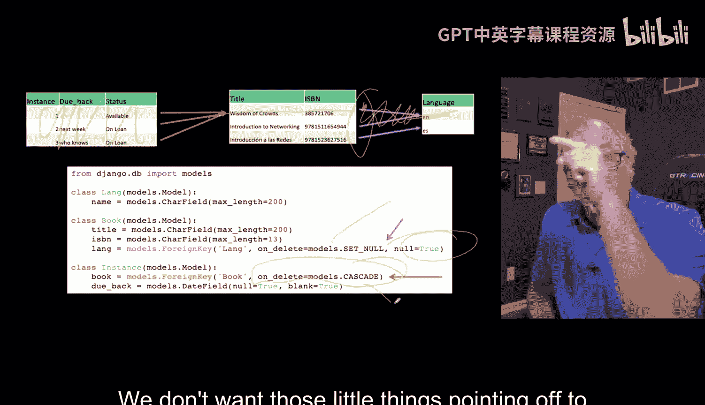

## 总结


本节课中，我们一起学习了在Django中如何通过外键定义一对多关系。我们了解了模型字段`ForeignKey`的用法，包括关键的`on_delete`参数（如`CASCADE`和`SET_NULL`）如何控制关联数据的删除行为。我们还回顾了Django的迁移机制：通过`makemigrations`生成可移植的迁移文件，再通过`migrate`命令将这些变更应用到数据库，从而在底层数据库中正确地创建表和外键约束。理解这些概念是构建复杂、数据关系清晰的Django应用的基础。

接下来，我们将更深入地探讨模型、迁移和数据库在较低层次上是如何工作的。