# Django for Everybody：4.6：使用Django Shell探索一对多模型 🐚

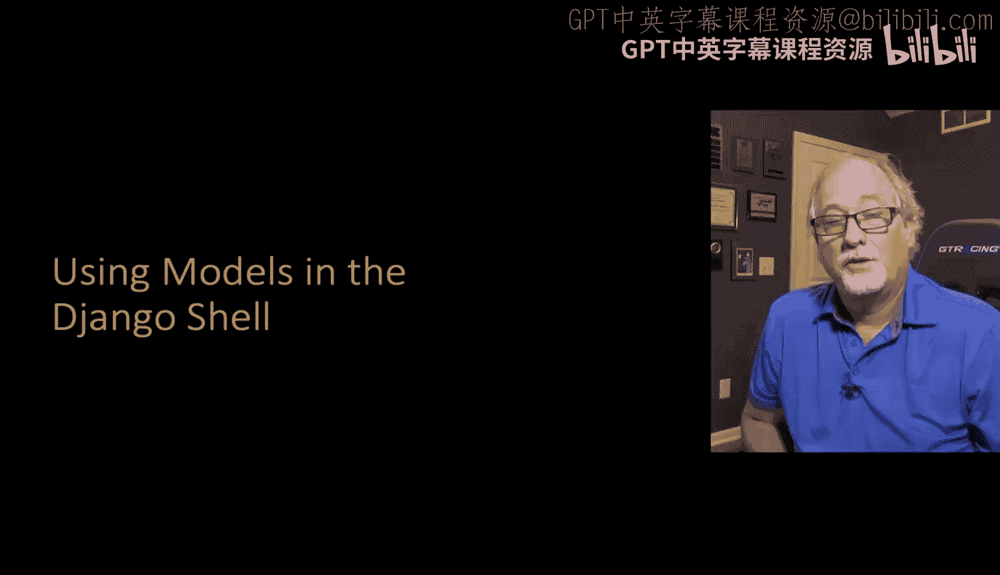

在本节课中，我们将学习如何使用Django Shell来操作数据模型。我们将通过编写Python代码，创建、保存和查询具有“一对多”关系的模型对象，从而理解Django ORM如何简化数据库操作。


---

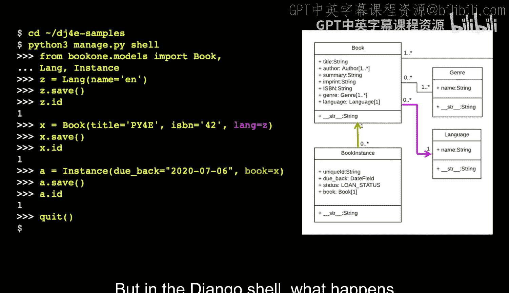

上一节我们介绍了Django的数据模型设计。本节中，我们来看看如何通过代码来操作这些模型。

为了操作数据模型，我们需要使用Django Shell。Django Shell看起来很像Python交互式Shell，但它会预先加载许多Django环境配置。你不能直接运行普通的Python交互模式。在Django Shell中，系统会读取`settings.py`文件，找到所有已注册的应用并预先加载它们，然后才提供一个Shell环境。这意味着在你进入Shell之前，已经完成了一系列初始化工作。

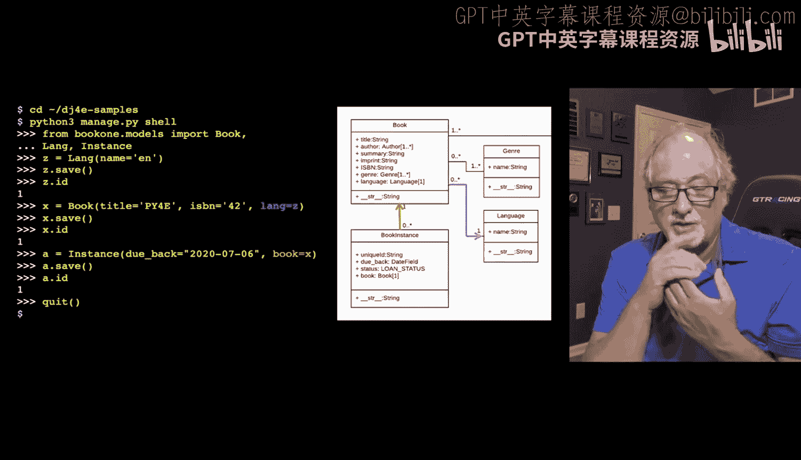

例如，执行`from book1.models import Book, Language, Instance`这样的导入语句，在普通的Python Shell中是无法工作的。这是因为`book1`应用是通过`python3 manage.py shell`命令加载的。之后，所有相关的类就被预加载好了，你可以运行任何你想操作的Django类和对象的Python代码。

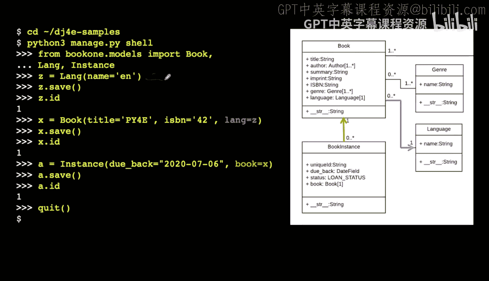

让我们看看具体能做什么。


如果你还记得，我们的数据模型中有一个名为`Language`的模型。我们可以在内存中创建一个新的`Language`对象，代码如下：
```python
z = Language(name='E')
```
这行代码的意思是：给我一个新的`Language`对象，将其`name`属性设置为`'E'`，并将这个对象赋值给变量`z`。这是一个面向对象的构造函数，我们在构造一个对象。

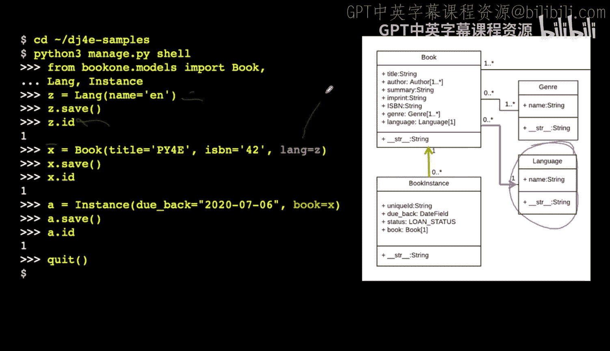

此时，这个对象并没有被存入数据库，它只是在内存中被创建并返回。它是一个拥有`name`属性的Python对象，并且Django知道它是一个`Language`模型。

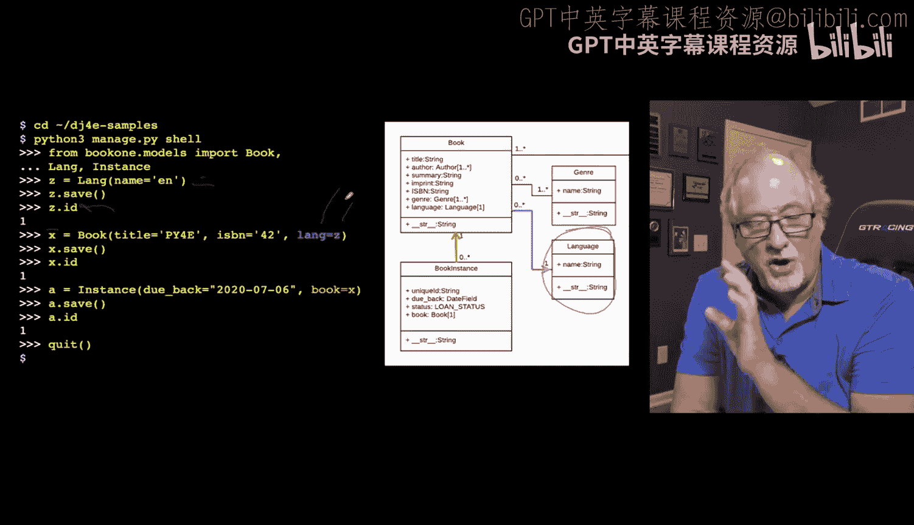

`save()`方法`z.save()`的作用是，将这个内存中的对象持久化到数据库中，即写入并传输到数据库。

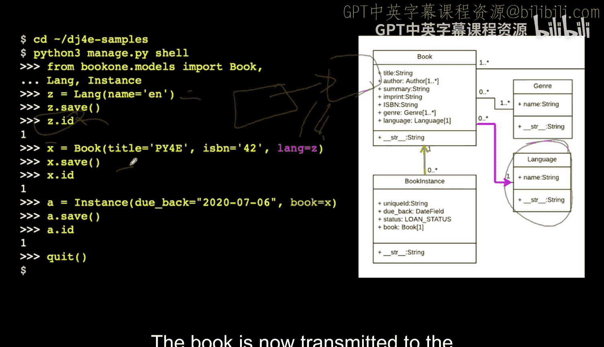

这个操作的一个很酷的地方在于，`id`字段会在保存的那一刻被自动设置。所以我们可以查询`z.id`来获取它。请记住，我们放入模型的每一行数据都会获得一个`id`值，我们将使用这个`id`值作为指向该行的句柄。这就是主键，是我们指向表中某一行的方法。

接下来，我们可以创建一本书。我们已经创建了一个语言`z`并知道了它的`id`。现在我们来创建一本书，它有`title`和`isbn`等属性。我们这样写：
```python
x = Book(title='PY4E', isbn='42', lang=z)
```
这里的`lang=z`，`z`就是那个变量。我们不需要直接使用`id`。Django完全了解`id`是如何工作的。所以当你写`lang=z`时，它会自动创建一个`lang_id`字段，并将语言行的`id`值放进去。所有这些操作都是自动完成的。你只需要有一个包含`id`值的变量，并将其传入即可。

这段代码的作用是创建一本书，并将其与一个语言关联起来。同样，这本书在调用`x.save()`之前也不会被保存。保存后，这本书被传输到数据库。它内部有一个外键，并且获得了自己的主键。这是我们插入的第一本书，所以它的主键`x.id`是1。

然后，我们可以创建一个借阅实例`Instance`。实例需要一个`due_back`日期，以及它属于哪本书。我们使用变量`x`来指明我们谈论的是哪本书。
```python
a = Instance(due_back='2024-01-01', book=x)
a.save()
```
这行代码创建了一个内存中的`Instance`对象，并将其赋值给变量`a`。这个实例指向变量`x`所代表的书籍（即`PY4E ISBN 42`）。保存后，它也会有一个`id`。

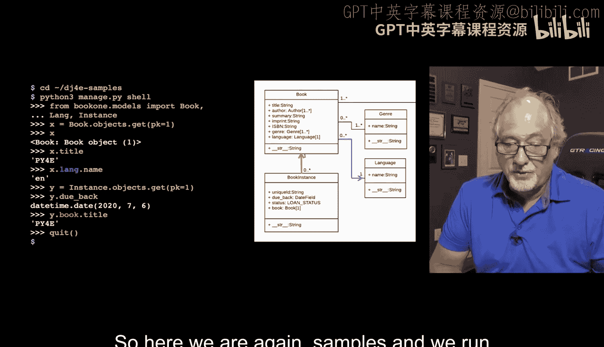

至此，我们创建了一个语言记录，然后创建了一本链接到该语言记录的书籍记录，最后创建了一个链接到该书籍记录的借阅实例记录。这就是整个链接过程。这些就是指针，而Django在这种情况下试图向我们隐藏外键和主键的整个概念，除了我们主动询问`id`的时候。实际上你并不需要经常操作`id`。你只需要说：看，我有一本书，它的语言是这个东西。我不知道它的`id`是什么，请你帮我创建一个列并完成所有这些神奇的操作。因此，这些“一对多”关系或外键关系的大部分簿记工作，在Django中都是自动完成的。

现在，我们可以检索这些对象，并沿着这些关系链进行遍历。我们再次进入Shell，导入我们的模型。

我们可以这样写：
```python
x = Book.objects.get(pk=1)
```
`Book`是我们从`models`导入的类（即`book1.models.Book`）。我们与这些类内部进行交互的许多方法都在`.objects`属性下。你可以将其理解为该模型中所有的行或所有对象，即存在于该表中的所有行。`Book.objects.get(pk=1)`的意思是：你想要哪一个？获取主键等于1的那一个。`pk`代表主键。我认为叫`id`可能更直观，但`id`是主键列的常用命名约定，大约98%的情况下都是如此。这不是强制要求，但太常见了，几乎可以认为是事实。所以`pk`实际上指的是主键，而十有八九它就是`id`列。

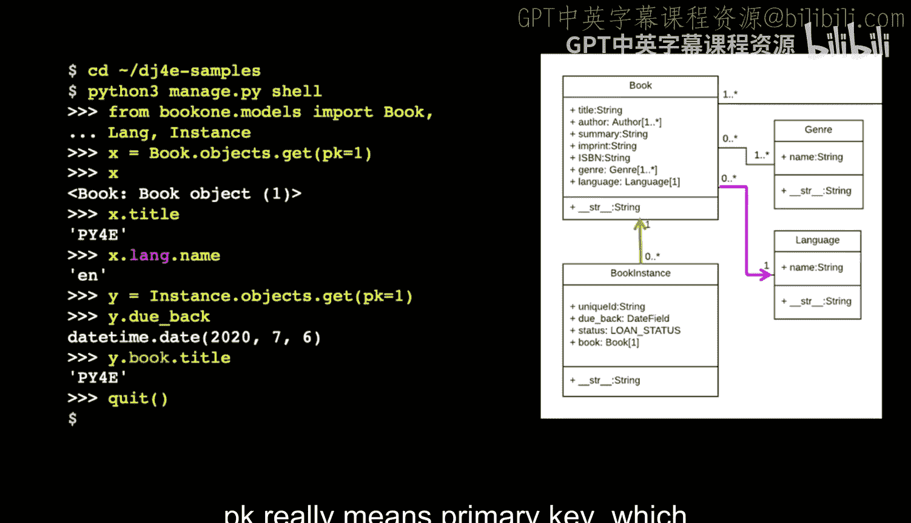

因此，我们从`books`表中加载数据，获取`books`表中行号为1的那一行。然后我们可以查询它的标题`x.title`，结果是`'PY4E'`。

有标题，还有`lang`。`lang`是指向语言的外键。所以我们可以说`x.lang`，这代表整个语言行。而`x.lang.name`则是该行中的`name`列。我们就像沿着小箭头向下走，然后从对应的行中取出一个元素。这就像从一本书走到对应的语言行，然后从那个对应的语言行中取出名称。我认为这是一个非常漂亮的语法，一段时间后就会开始理解。你沿着这些小箭头遍历。这就是为什么数据模型的图示如此重要。

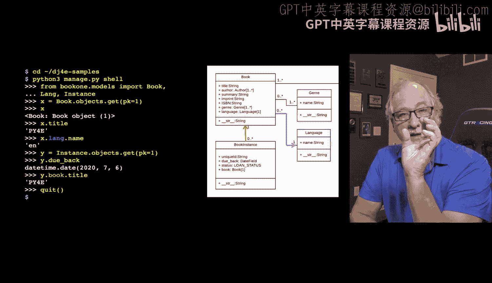

接下来，我们去获取第一个借阅实例，即`book_instance`表中的第一行。
```python
y = Instance.objects.get(pk=1)
```
这行代码表示：给我第一行，将其返回到变量`y`中。这个实例的`due_back`日期是什么？然后你可以继续遍历。你可以说：我处在一个`book instance`，我想沿着外键走到`book`表，获取那本书，然后给我那本书的标题。
```python
y.book.title
```
所以，从一个借阅实例，你可以走到书籍表，然后获取书籍的标题，我们得到`'PY4E'`。你可以看到，这是从一行开始，走到由这个关系指向的对应行，这就是这种关系的本质。

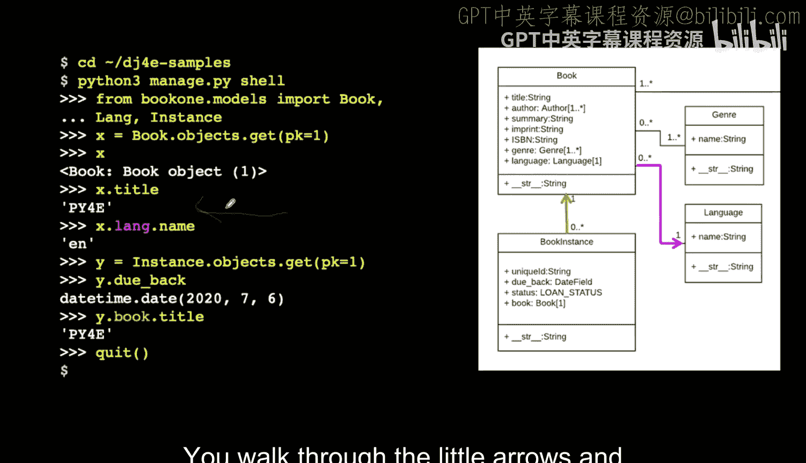

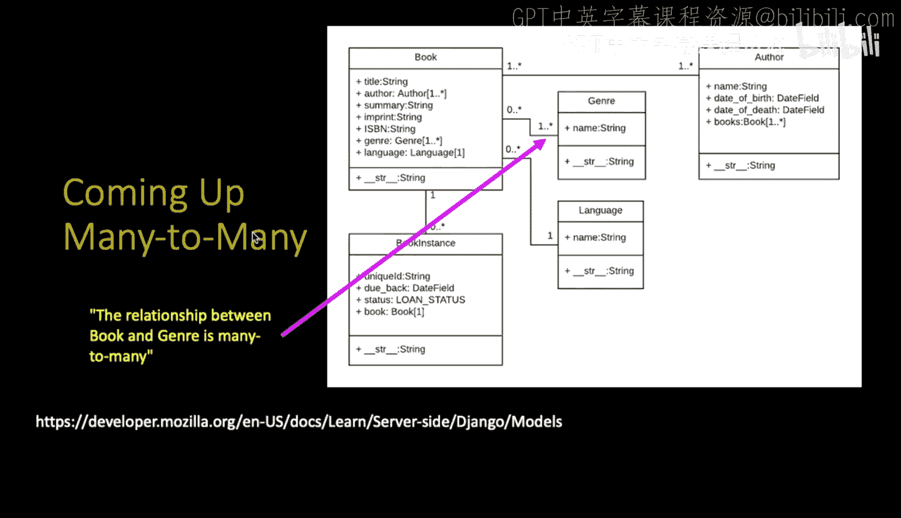

我们将大量进行这样的操作，当我们再次回顾时，这一切都会显得非常直观。


---

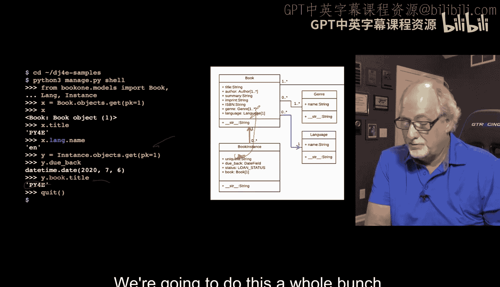

本节课中，我们一起学习了如何使用Django Shell来探索和操作“一对多”数据模型。我们掌握了如何创建、保存模型对象，以及如何通过简洁的语法（如`x.lang.name`和`y.book.title`）沿着外键关系进行遍历查询。Django ORM自动处理了大部分外键关系的簿记工作，使我们能够更专注于业务逻辑。