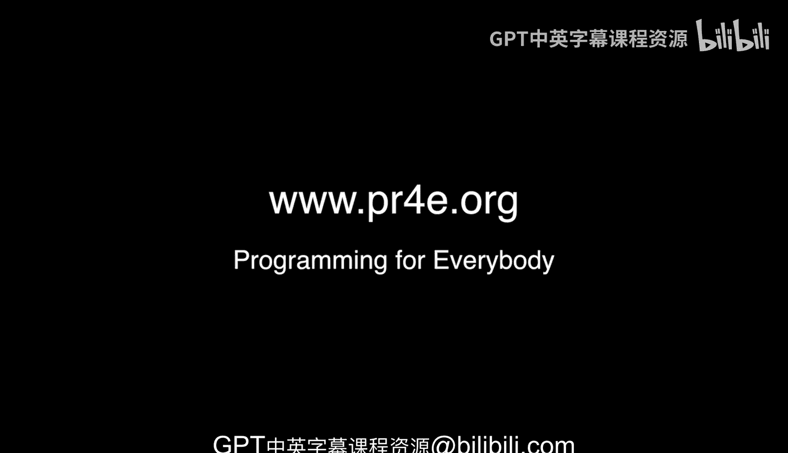

# Django for Everybody：课程概述：波特兰面对面办公时间记录

在本节课中，我们将回顾密歇根大学《Django for Everybody》课程在俄勒冈州波特兰市举行的一次线下办公时间。本次记录旨在展示学习社区的互动，并分享部分参与者的学习经历与感受。

---

## 开场与地点

大家好，我们现位于俄勒冈州的波特兰市，正在进行又一次的课程办公时间活动。

我差点说错地点，但至少我确认了是在正确的州——俄勒冈州，波特兰市。我们所在的那条街道非常繁忙，并且在这里成功举办了一次办公时间。和往常一样，我希望向课程的其他学员介绍在场的各位。

---

## 学员自我介绍

以下是部分参与课程的学员进行的简短自我介绍。

*   **Arvin**：我报名过很多在线课程，而这门Python课程是我第一个完整完成全部四个部分的学习。这要感谢优秀的讲师。
*   **Scott**：大家好，我是Scott，我正在学习《Python for Informatics》课程。
*   **Alireza**：大家好，我是Alireza。在过去的四个月里，我见到Chuck博士的次数比见到我孩子的次数还多。我刚刚完成了Python数据结构部分，课程非常棒。
*   **Paul**：大家好，我是Paul。我17岁的儿子也叫Paul。我们正在一起通过Coursera学习，这是一个父子合作项目。他是一名高中生，学得很好。对我来说这是爱好，对他则是为了掌握未来可用的技能。
*   **Maddie**：大家好，我是Maddie，我是Pitzer学院的有机生物学专业学生，但我对学习Python感到非常兴奋。
*   **Margaret**：大家好，我是Margaret，实际上我是从田纳西州来这里度假的。Python课程是我一直想开始的编程入门课。
*   **Diane**：大家好，我是Diane。我正在学习这个系列课程的第四门，并将在今年夏天完成毕业项目。这非常有趣。
*   **Alejandro**：大家好，我是Alejandro。很多年前，当我住在古巴哈瓦那并工作时，就学习了精彩的互联网历史课程。感谢Chuck博士的精彩课程。
*   **Andrew**：大家好，我是Andrew。我和我的同事Nathan一起加入了Coursera，他今天因为工作没能到场。他算是以虚拟方式“抢镜”了。多亏了Chuck博士的所有出色工作。
*   **Herb**：大家好，我是Herb。很久以前我学习了互联网历史、技术与安全课程，后来成为了课程的社区助教，现在是一名导师。我参与这个课程已经很长时间了，非常享受帮助学生的过程。

上一节我们听到了学员们的自我介绍，其中Herb作为课程导师的角色尤为突出。接下来，我们将特别关注他的贡献。

---

## 导师的重要性

Herb是课程中不到十位的导师之一。他孜孜不倦地帮助所有学生，并且完全是义务劳动。因此，我喜欢做的一件事就是去导师们所在的城市，请他们吃顿饭。对于多年辛勤工作来说，一顿免费的晚餐只是微小的补偿。

但如果没有像Herb这样的导师，这些课程将无法保持活力。即使有最好的讲座视频、作业和测验，如果没有人性的互动，也毫无意义。因为学习是关乎人的事情，而不是单纯的信息传递。正是像Herb这样的人，让这些课程在我离开、所有讲座都结束后，依然能够持续运行。

---

## 更多学员分享

让我们继续聆听其他学员的分享。

*   **Maureen**：我是一名化学家。我学习这门课程是为了能够以自动化的方式提取数据并每周生成图表，而不是在Excel中手动完成。

---

## 活动总结与未来预告

好的，以上就是本次办公时间的全部内容。

下一次办公时间将在不到24小时后于西雅图举行。在那之后，大家还可以参加再之后在英国布莱切利园举行的办公时间。所以，如果你计划去英国度假，欢迎来参加办公时间。

---

在本节课中，我们一起回顾了波特兰线下办公时间的记录，听到了来自不同背景学员的学习故事，并了解了课程导师对学习社区不可或缺的支持作用。这体现了在线课程背后真实的人际连接与学习热情。