# 密歇根大学《给所有人的Django课程（简介、开发Web APP、特征和库、JavaScript和JSON）｜Django for Everybody》中英字幕 p89 29_06_02_使用Django表单功能.zh_en -BV1Kt421V7EE_p89-

So up to now， we've mostly just talked about how forms work。

We've been talking about how forms work across whatever programming language you're using or framework you're using。

 we've mostly talked about how the browsers treat forms， how we generate HTML to make forms。

 how posts work， how refresh works， how post redirect works， how CSRf works。

 that's other than subtle details， those are topics that are true， no matter what you do。

 no matter what language you're writing and what framework that you're using now we're going pivot a little bit and talk about how Django helps you do all those things that we just got done talking about doing。

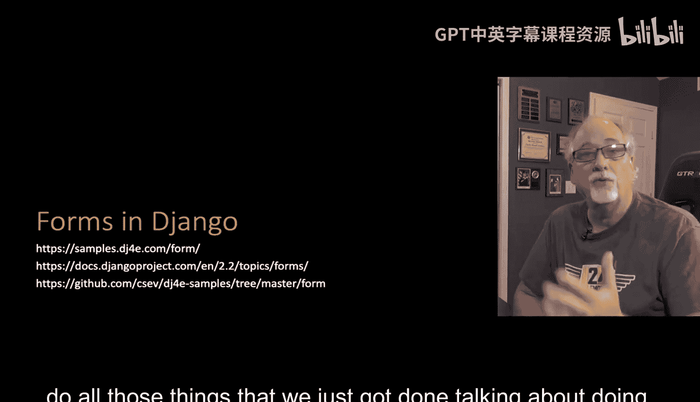

So if you look at this picture。If you look at the picture。

 you see that like forms are kind of in the middle of this picture that's the final piece we're filling in and forms are connected a lot of ways。

 forms can be connected to models they're used in the view and they're used in templates and so they're a very powerful part and all the things that we've been doing as abstractions where we've read a little bit of code and find lots of ways to reuse that code or we write some code that extends an object and then we add a little bit to it and then we've got some very powerful object when we're all said and done and so that's what we're doing here in forms and forms can be used in views that can use in templates and they can interact even with models and so we're going to talk a lot about forms。

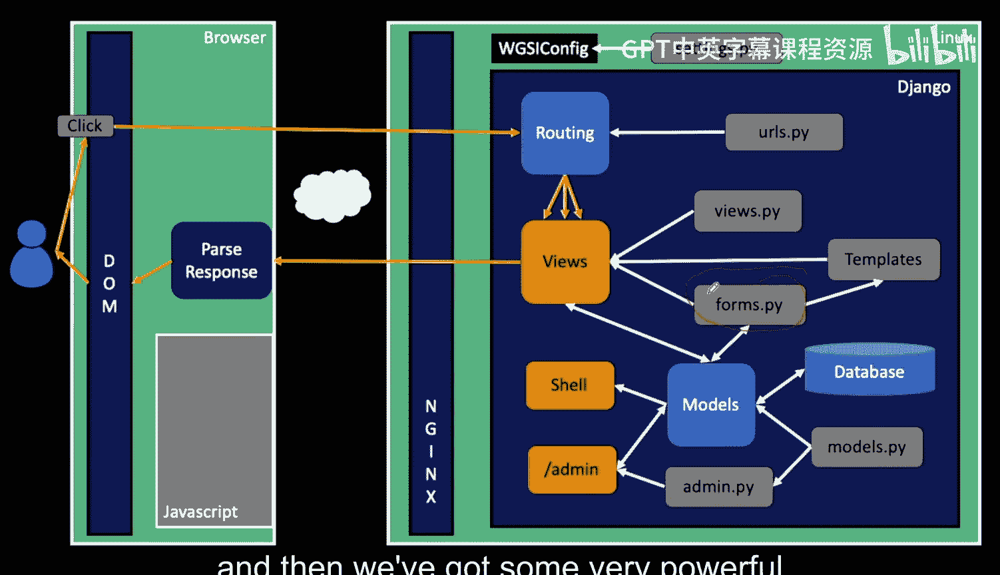

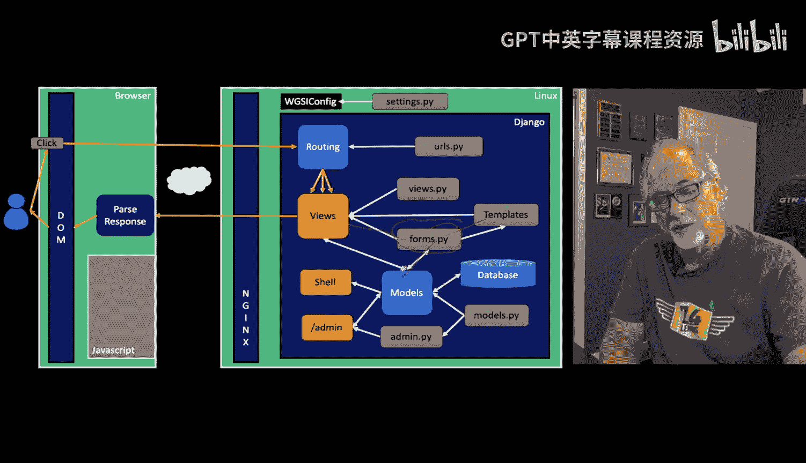

There's a lot of like just men labor that just work and inform and if you really had to build all the HTML by from scratch like I did in some of those earlier examples。

 it's just really painful and there's other problems too and that is that you know there's just a lot of repeating yourself we kind of avoid one we use like object or techniques and other techniques to not repeat ourselves。

And it's really easy to put the HTML for a crappy form， but why wouldn't you want a beautiful form。

 and so if you write the HTML and you write some CSS and you do a kind of crappy version of it。

 then you have to fix it or hand it to a designer and then they have to go fix 100 pages。

There are things in Django， crispy forms is something we'll talk about later that just like says。

 hey， I'm using forms in Django， wait a sec I want them to be pretty now and then you just make them pretty and if you want to change how they're pretty you can change how that works。

And then you change them all at the same time， and so not repeating yourself。

 being able to like lean on utility code。Sees like why would we do this， but in complex applications。

 you just fall in love with this idea that you don't have to repeat yourself。

And even though I've showed you some of the things like post redirect， refresh， CSRF， all that stuff。

 it's even more complex than that， especially when you start talking about pulling data from the database and putting it in an edit form and then checking to see if the data is valid if the data is not valid。

 send back an error form， and give a chance to resubmit it。

 if they're successful you do post redirect and then you send a message in the session。

 we've done all that in really simple， but if you really look at everything that you need to look at。

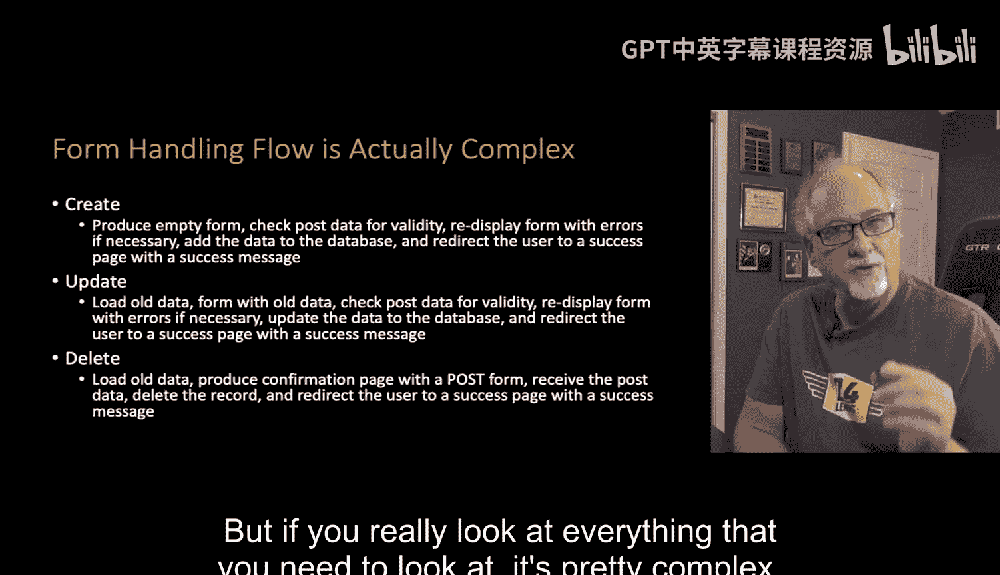

It's pretty complex。 And so we're not going to do all this in this first lecture。

 but this gives you a sense of the kinds of things that a create form where you're going to go like you know new cat and then you got some forms to fill out fields to fill out about the cat and then you hit the save。

 and so if we just go through this， these are the steps you need to do to insert a cat in your cat database right so your browser initially goes and gets a get request and then you fill out the empty form with a bunch of fill in the blank fields。

 the user can almost cancel out of that and get out the user might enter some data and hit post。

Now the problem is， what if you have some rules about the data such this is required that has to be at least five characters。

 etc ce。 you have to then send a form back with that data to let them fix it and resubmit it again。

 Or if it's good， you go ahead and store the data in the database。

 but then we have to put some kind of a success message like in a session or something and then send a redirect out。

 and then the browser immediately comes back and gets the redirect URL， which pulls the message out。

 sends the page and sends the success。 And so we've done parts of this already we've done parts of this already the big part we haven't done is kind of like this middle part here where we're like validating the data and have this error error retry loop that we put the user back in the loop and give them another chance。

 Now that's the create form。 the edit process where you're pulling in an existing cat and you're going edit their fields is even more complex。

 know you go load up a cat， but you might have an error page because you don't get the。

Get they're looking for a cat that didn't exist on our database。

 you send out the form with the old data they might leave。 they might edit it。 they might come back。

 they might validate the data and get in error， then they have to fix the data and they got to go around here until okay we got some valid data and then you store the data in the database。

 send out a put a message in a session send out a redirect to a success URL and that success URL you put out the message in and say gayy so that's that's complex too and and we're gonna figure that out delete is not as simple as you might see the problem with deleting things is that you can't delete with a get request so usually you have to go navigate it like you see a little delete button you click on it and you go to a delete page it's going to load the data that youll want to delete so you can build a confirmation page confirmation page is turn out to be really important。

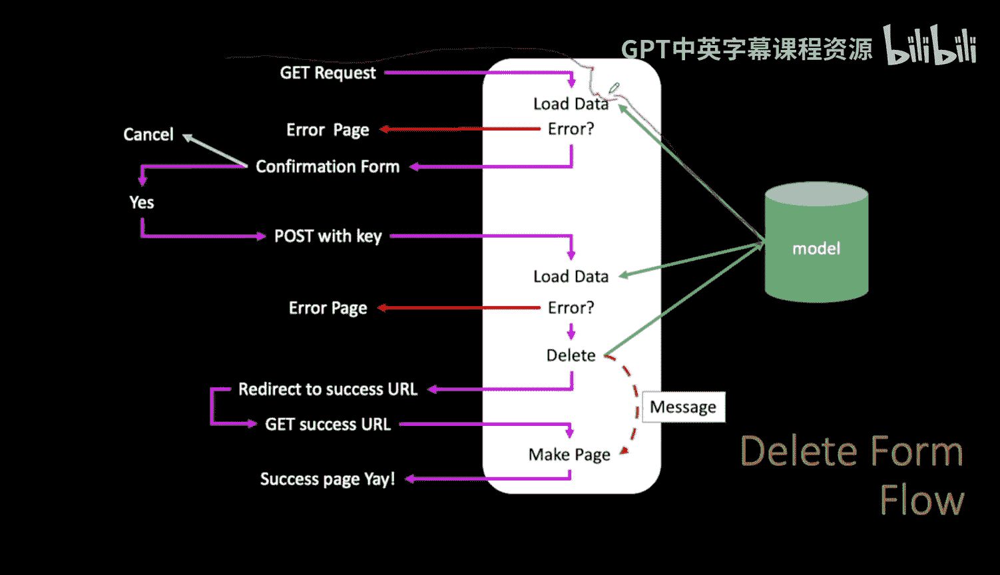

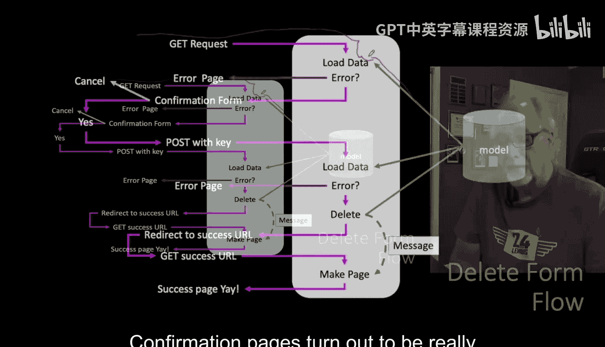

Because they're also a tricky way to convert a get to a post。

 but if they're asking for the wrong data， we have to send an error message。

 Otherwise we send a conversion a confirmation form that says are you sure you want to delete this that's both nice for the user to give a confirmation but it also then turns this into a form and of course they can leave a cancel but if they click on yes。

 that turns into a post and it has the key so the first thing it does is it has to load the data again from the model and then if that data is not there。

 they got the wrong key， then you send an error page out and if you got the right key and the user has permission to delete the data then you go talk to the model and you delete the thing right then you put a congratulations on your deletion in a session or something and go with a redirect as you can't respond with a 200 get it respond with a 302 and then the browser immediately does it get a success URL pulls the message out a session makes a success page with the message。

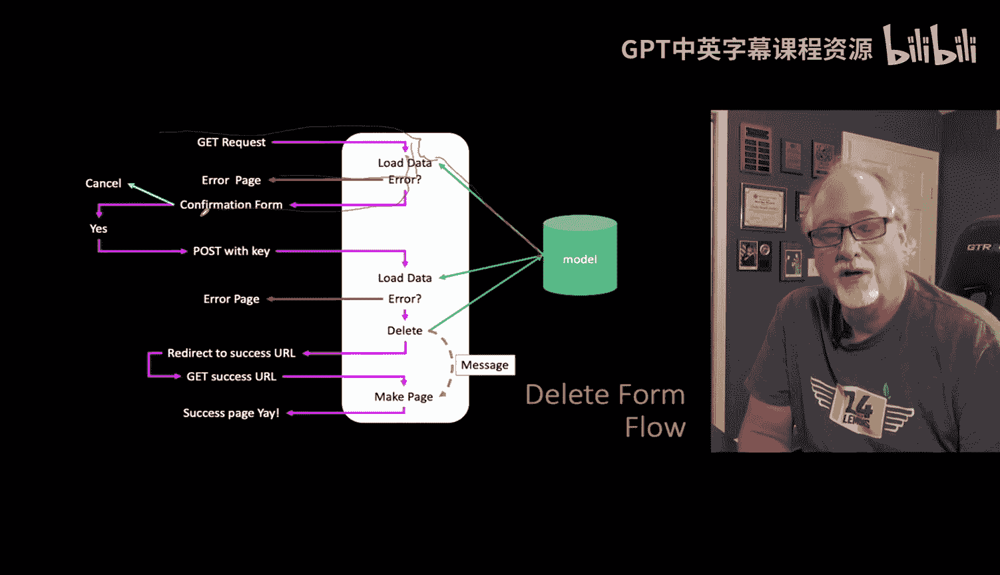

Now we're going to cover this a bunch of times， so you don't have to get this the first time。

 but I just am telling you that forms are complex and what's cool is。

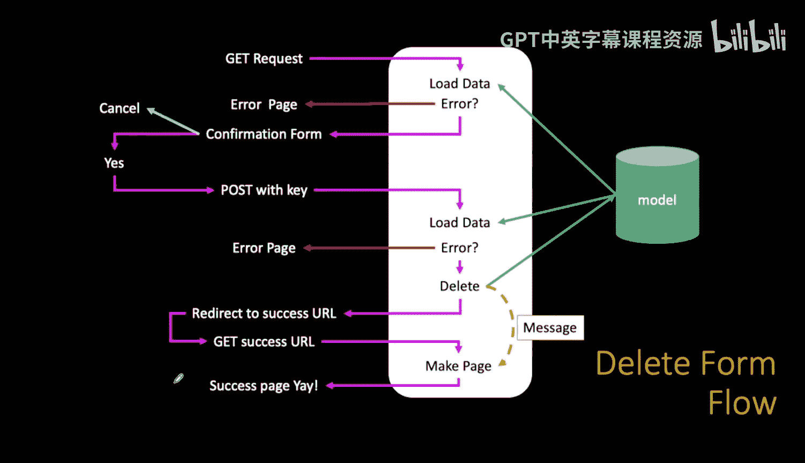

Jangleangle form objects that we're going to create。Act like glue， they can generate the HTML。

 they allow for a consistent look and feel， and they allow for you to change the look and feel。

When the post data comes back from the browser and a form that it created。

 then it puts it all in the right spot， it validates the data based on a set of rules that you say like this has to be this kind of a thing and that kind of a thing or a date or a character or an integer or a floating point。

 whatever it is the rules are that's all done for you in Django and if something goes wrong。

 then it hands you an error form that you can send right back to the user really greatly and then of course。

Once it's validated， it moves it into a model and then actually can even do the database store automatically。

 so the form is like this glue thing that sort of talks to templates， it talks to browsers。

 it reads data from browsers， it's like stuff and and so in a way the form is like the controller。

 it's like the view， it just makes your views really succinct。

 and you're going to love it once you understand it。

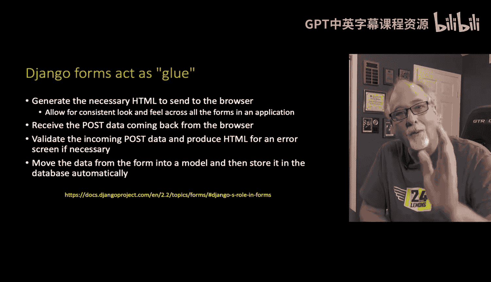

So here is a simple form， and so forms live in a file called forms。pyy， not surprisingly。

And basically just like it looks a lot like the models file。

 And so you're going to see the one thing that forms do differently is they can have these things called validators。

 models have rules about max length， etc cetera。 But there are even more complex validators and you can even write code that you have your own functions that when the form is coming in。

 you're going to look at this one field and you're going to say like oh。

 I wanted two uppercase characters followed by three lowercase characters。 Sorry。

 you didn't do what I said， that's what's called a validator and that's when that error page goes back and it says。

 hey， you're missing this stuff and we'll show you how the validator stuff works。

 but basically you put in little lines just like you did for the model。

And you're effectively defining a user interface plus a bunch of logic behind it。

 Now the one thing I'm not doing in this particular section will do soon is connecting this to a model so you could say。

 wait a sec， I'd like to make a form and I will really mostly want to inherit from a model you can do that but that's not this one that's coming up in the whole next section but it won't be long。

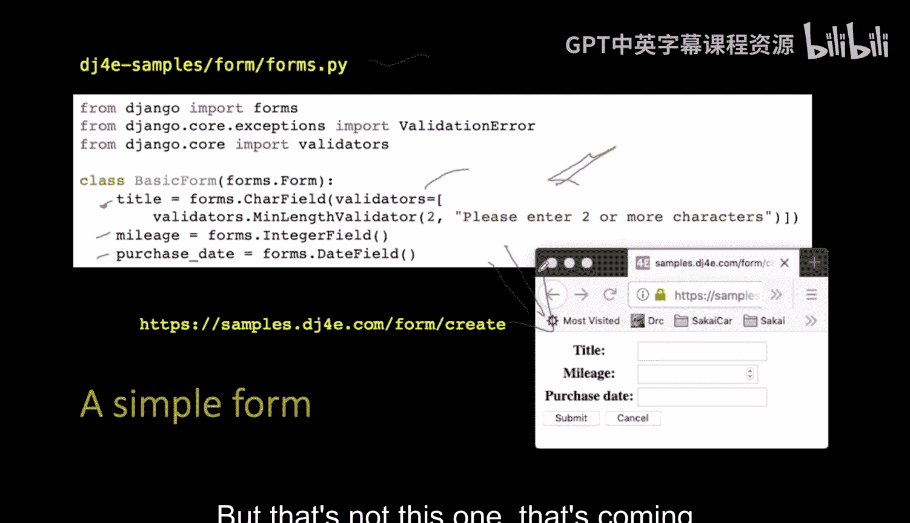

So the form object， right？We're going so here's this form we just made。

 it's got three fields in it and this is a real simple view， it's not useful。

 it just kind of shows you one of the things you can do so make a basic form when the basic form is defined as having these three fields and then you say form and then a call the method as table and so what this produces it's just a dump there's nothing the UI this looks really ugly but basically it generates all this HTML for you。

 all this HTML input tags and' we told it to do it as table that's necessarily not necessarily the pretiest way to do it but。

All that HTML is generated from the form utility so it can send it out as a list。

 you can send it out as paragraphs， et cea， et cetera， et ce。

 And so this is just to show you kind of the dump if you go to this URL do a view source on it so you see this stuff in here so that you define a form object and one of the things you can do is make me HTML and this is not a good example will come up in a bit with a better example。

 the better example of course is to use it in a template。

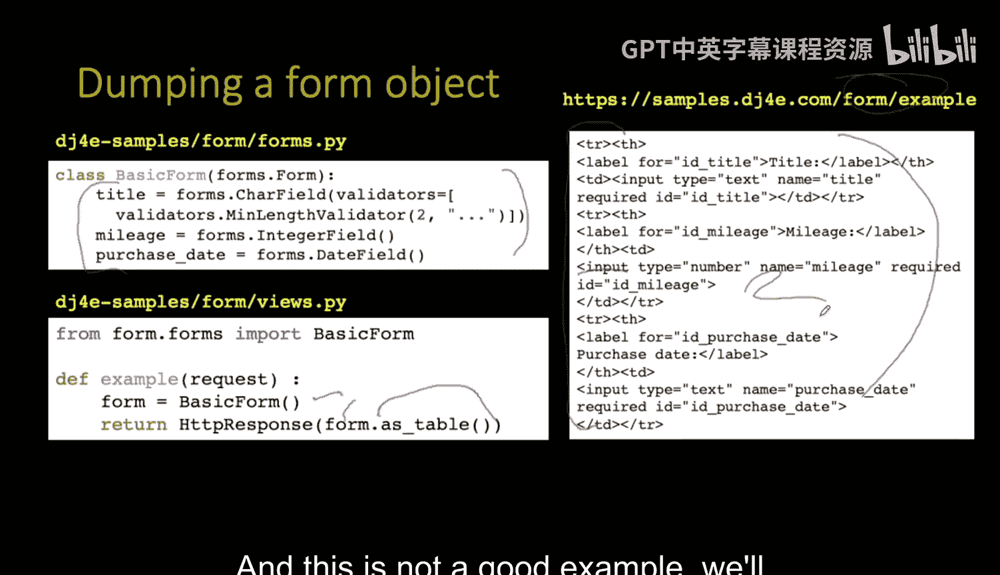

And so here is a template with a simple form in it， we got a form， it's a post。

 we got some submit stuff， we got ourselves a cancel， you know， button that we put in。

 and we got a CSRF token， and we're going to use that form as table and we're going to surround it by a table tag so that it looks a lot prettier。

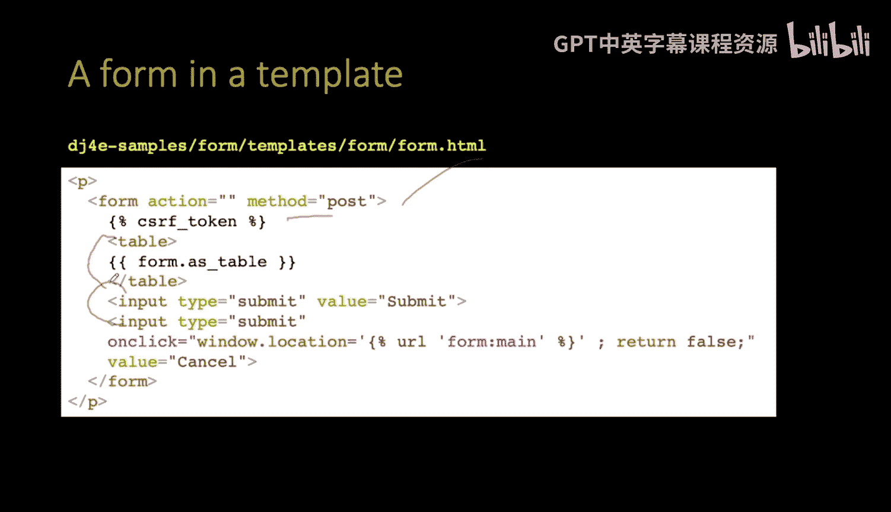

And so this is a far more typical way of doing it， that first one was just to dump it。And so this。

 when you do this and you give it， you sort of make the form in a get request。

 you make the form and you pass it into the context， if you remember Form。As table。

 that's a very comeback。You're too far， too far。

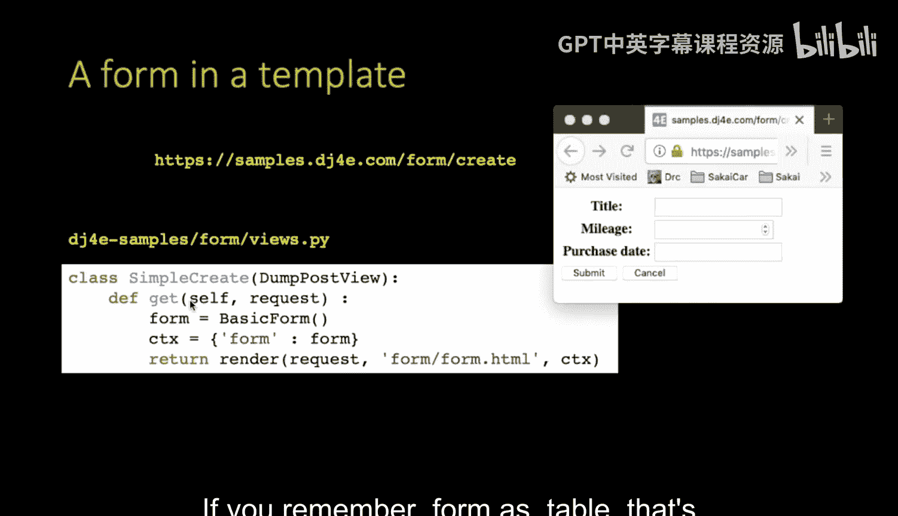

Formed outs table came from the context came from the past in variableable。

 and that is right here and right here。 and so we make the form object。

 which has all the fields in it， and then we pass it into our view our template and it renders that。

 and so then this is what it looks like much prettier And if you do a view source of that。

 if you go to this form， create and you do a view source on that。

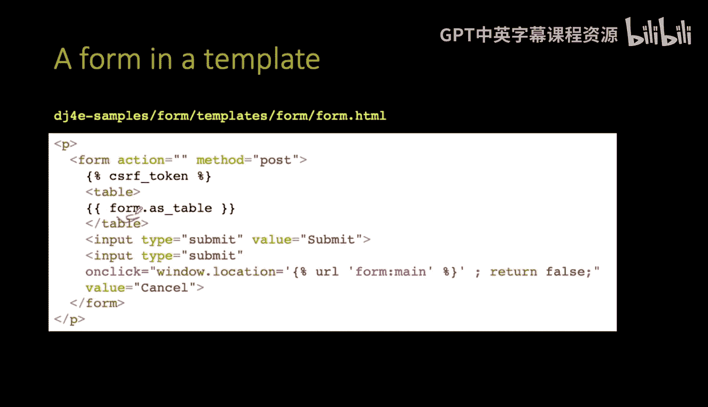

You'll see it's all that same table stuff you know it's the same table stuff that we had before it's just now wrapped in some stuff to make it look a little pretier。

 we put a submit button， it's got a form tag and then you can actually hit the submit button and something that actually happens。

 So this is by far the more typical way of using the form in a template。

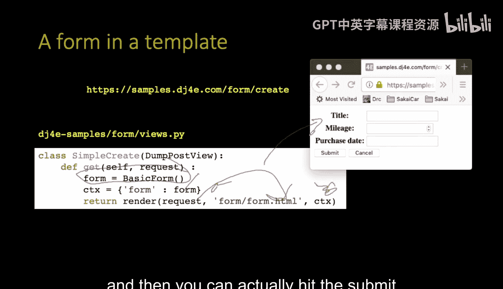

So I talked about the create form， the update form and the delete form this is kind of an example of how forms can be used Now I'm not actually talking in the model yet。

 we'll do that in a bit so I'm just going to pretend that we have some old data and so this normally would come from the model this old data title mileage purchase date that would come from the model normally but for now we're just going to like make it up and so then you basically start a form and you pass this old data in as the constructor that's a constructor for a basic form from the basic form class pass in old data and give me back the form give me back an object of basic of type basic form and I'm going to have it in the variable form and then I'm gonna pass it into context and you'll notice I'm using the exact same template the one I showed you before because that form as table understands that sometimes there's data in these fields and it properly puts the data in it properly escapes the data it understands that。

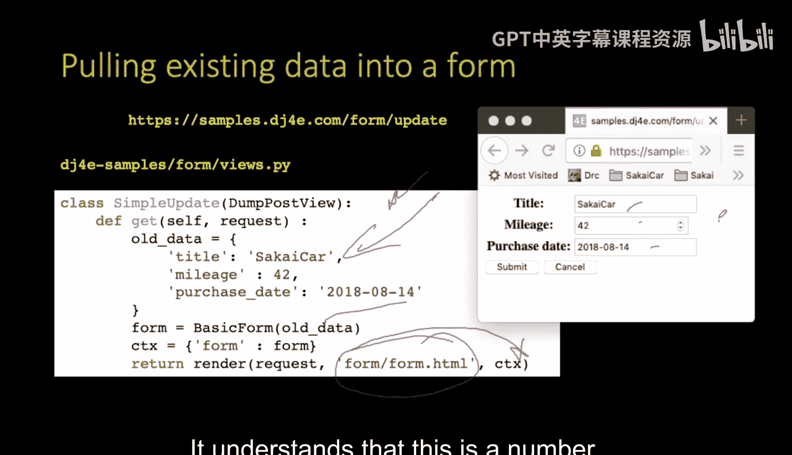

This is a number it understands that this is a date。

 it's got all that stuff all figured out right and so this is how it works as you just somehow get your hands on key value pairs of the old data。

 you pass it into the constructor and now you render the form and the formss library takes care of putting in all that old data。

Believe you me， you're probably glad I'm not showing you how to do you HTML and code and all these things and when you do encode but this is a little different because it's inside of an attribute。

 you don't want to know that because you just are going to use format table and it's got all the rules figured out and this is hundreds of lines of code that you're not writing。

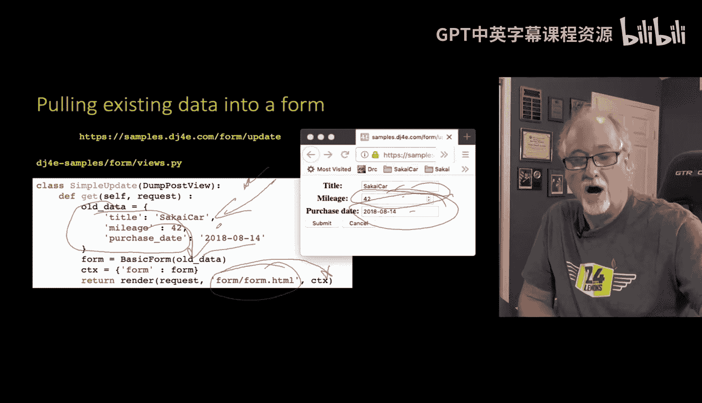

So up next we're going to talk about the validation part。

 so that's actually what happens when we receive data back from the browser。

