# Django for Everybody： 4.3： Django中POST重定向的实现 🔄

在本节课中，我们将学习如何解决一个常见的Web开发问题：用户提交表单（POST请求）后刷新页面导致数据重复提交。我们将使用“POST重定向”模式来解决这个问题，并了解如何通过会话（Session）传递临时消息。

---

## 问题背景与解决方案

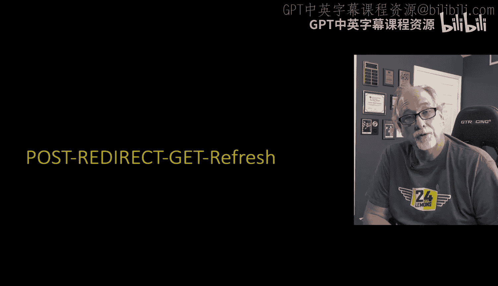

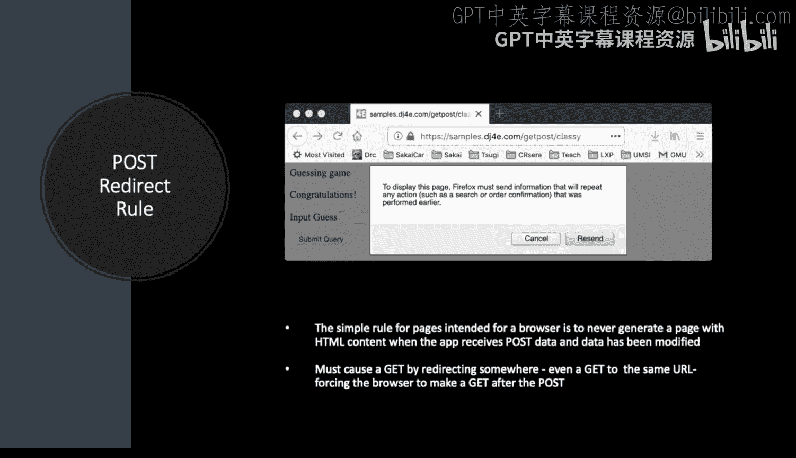

上一节我们讨论了表单提交的基本流程。本节中我们来看看一个具体问题：当用户提交表单（POST请求）后，如果直接刷新浏览器页面，可能会导致表单被重复提交（例如，订单被创建两次）。

这个问题的核心在于，浏览器刷新时会重复执行上一次的请求。如果上一次是POST请求，浏览器会询问用户是否确认重新提交表单。如果用户确认，就会导致重复操作。

解决方案是采用 **POST/重定向/GET** 模式。其基本规则是：**永远不要在POST请求的响应中直接返回HTML页面**。正确的做法是，在处理完POST请求的数据后，返回一个重定向响应（HTTP 302），将用户的浏览器引导至另一个URL，该URL通常通过GET请求来加载最终页面。

这种模式在MVC（模型-视图-控制器）架构中属于**控制器**的职责。控制器负责根据用户操作，决定将其浏览器引导至何处。

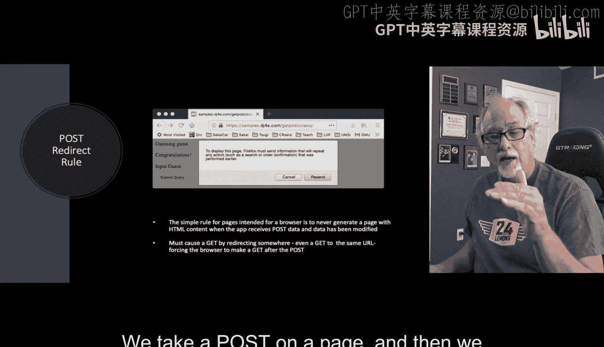

以下是该模式的核心步骤：
1.  用户通过GET请求访问表单页面。
2.  用户填写并提交表单，发送POST请求。
3.  服务器处理POST数据（如保存到数据库）。
4.  服务器不返回HTML，而是返回一个**302重定向**响应，指向一个成功页面（通常是同一个表单页面或一个确认页面）。
5.  浏览器自动向重定向的地址发送一个新的GET请求。
6.  服务器响应这个GET请求，返回最终的HTML页面（例如“操作成功”）。

这样，用户最后看到的页面是GET请求的结果。此时再刷新页面，只会重复GET请求，而不会重复提交POST数据，从而避免了重复操作。

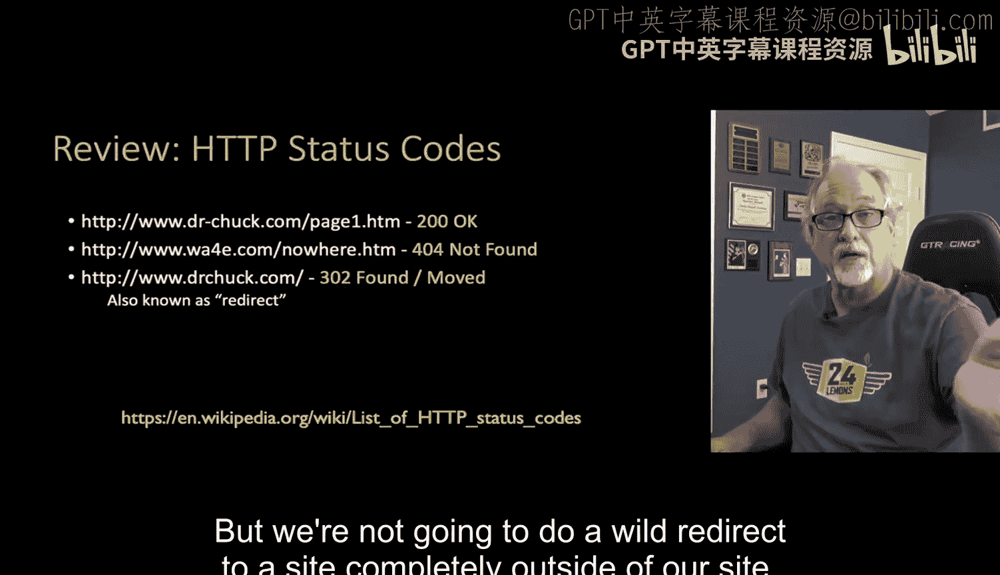

---

## HTTP状态码回顾

在深入实现之前，我们先回顾几个关键的HTTP状态码：
*   **200 OK**： 请求成功，通常伴随请求的页面或数据。
*   **302 Found**： 请求的资源已被暂时移动到另一个URL，浏览器应自动访问该URL。这正是我们实现重定向所需的状态码。
*   **403 Forbidden**： 服务器理解请求但拒绝授权。
*   **404 Not Found**： 服务器找不到请求的资源。

我们将利用 **302** 状态码来实现重定向功能。

---

## POST/重定向/GET模式详解

下图清晰地展示了问题所在及解决方案的流程：


**问题流程（左侧）：**
1.  用户提交表单（POST）。
2.  服务器处理数据并返回“成功”页面（200 OK）。
3.  用户刷新页面，浏览器询问是否重新提交表单。
4.  用户确认，导致POST请求被再次发送，数据被重复处理。

**解决方案流程（右侧）：**
1.  用户提交表单（POST）。
2.  服务器处理数据，但**不返回页面**，而是返回 **302 重定向** 响应。
3.  浏览器自动向重定向地址发送 **GET** 请求。
4.  服务器对GET请求返回“成功”页面（200 OK）。
5.  此时用户刷新页面，只会重复GET请求，安全地再次显示成功信息，而不会重复提交数据。

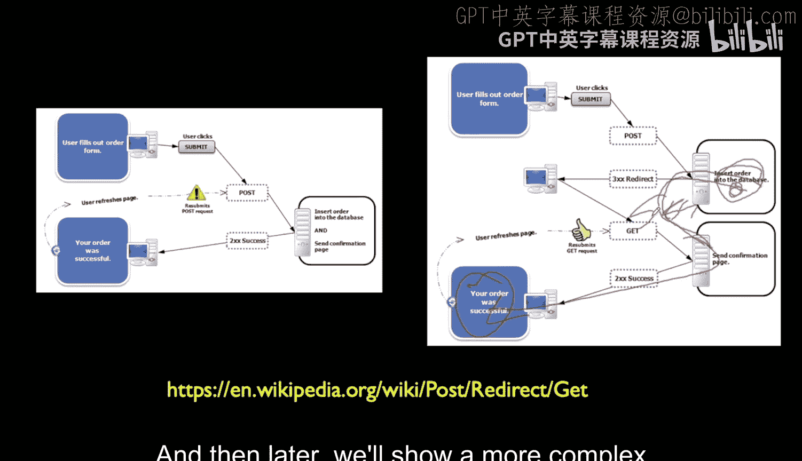

---

## 使用会话传递消息

在POST请求中，我们生成了“猜对了”、“猜高了”等消息，但随后我们进行了重定向。那么，如何将这个短暂的消息传递到重定向后的GET请求中并显示给用户呢？

答案是使用 **会话（Session）**。我们可以将消息临时存储在用户的会话中，在重定向后的GET请求里再从会话中取出并显示，然后立即将其从会话中删除。这种技术被称为 **闪现消息（Flash Message）**。

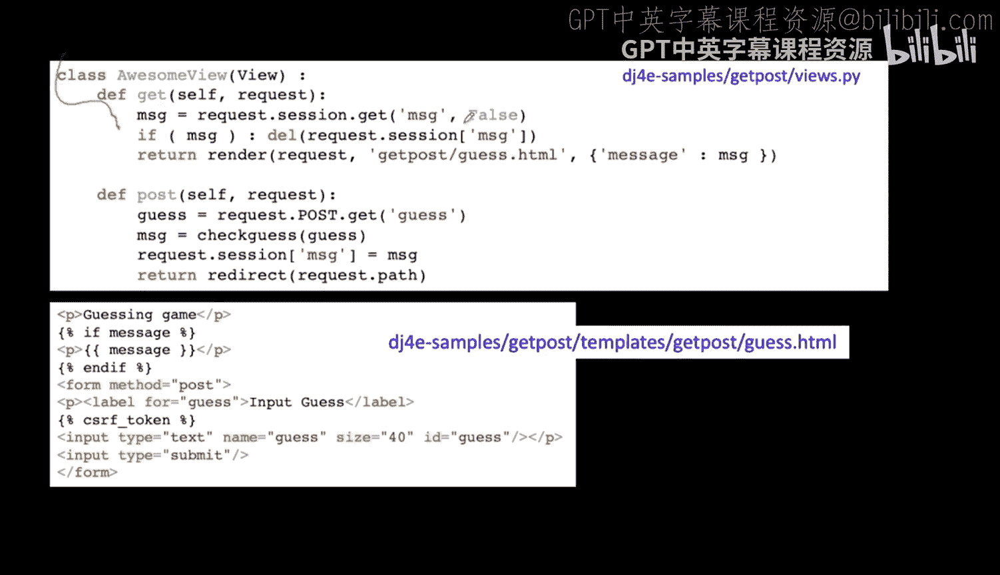

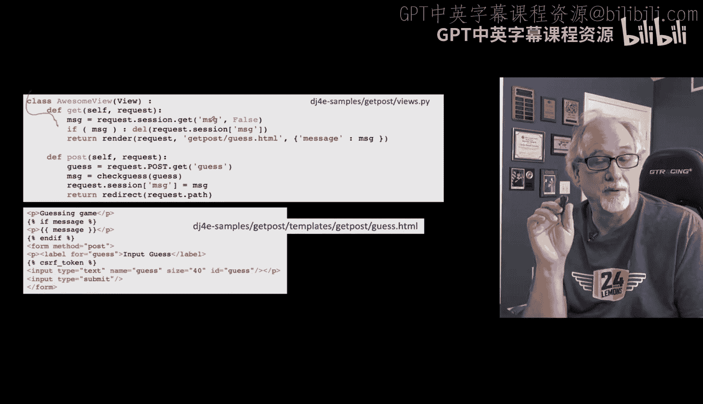

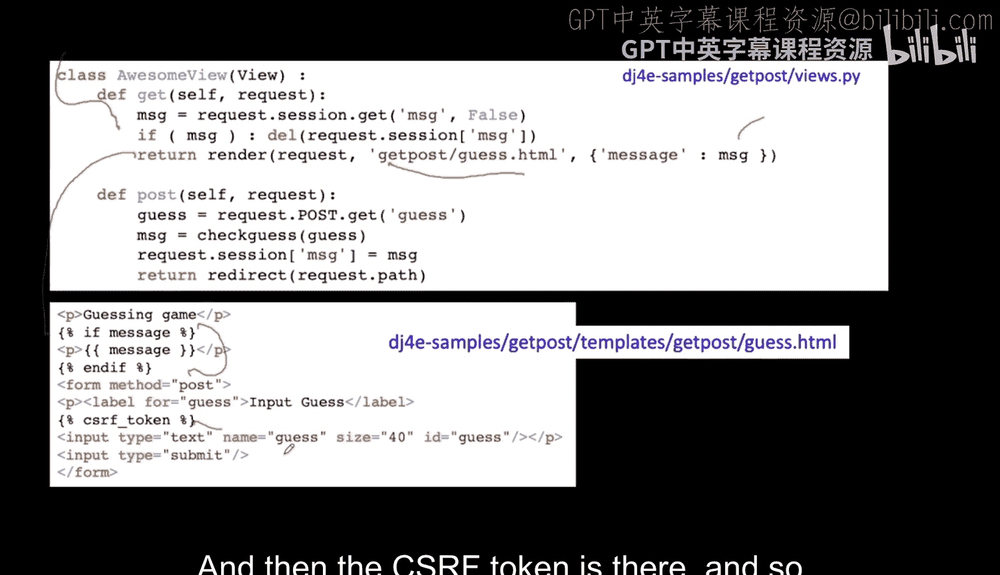

下面我们将通过一个“猜数字”的例子，展示一个简单的实现方式。

---

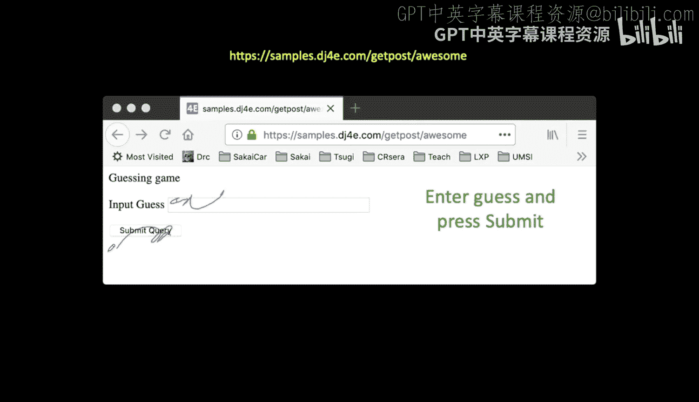

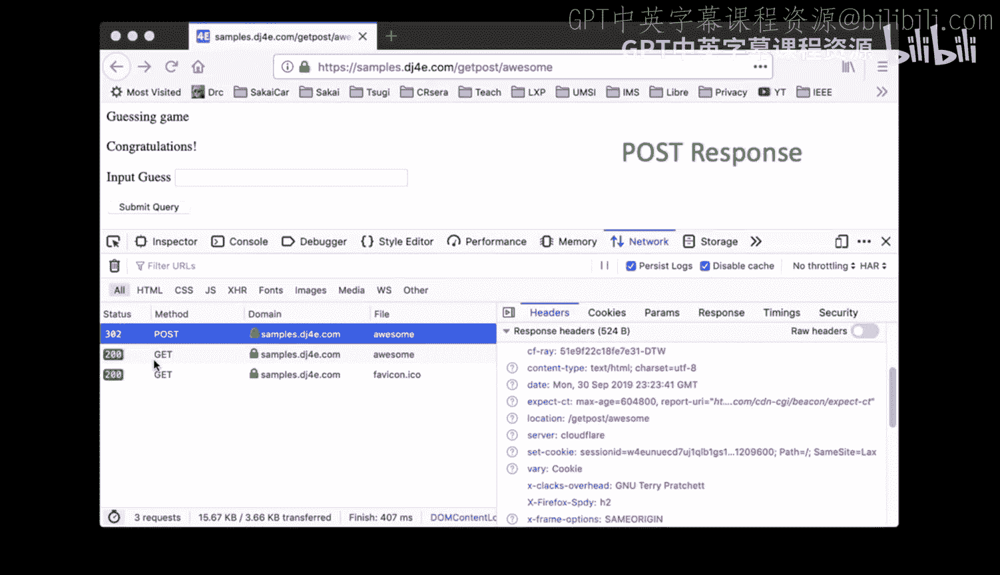

## 代码实现：猜数字游戏

以下是实现POST重定向和闪现消息的关键代码逻辑。

### 处理GET请求的视图

当用户首次访问页面或重定向后访问时，处理的是GET请求。

```python
def get_guess(request):
    # 尝试从会话中获取可能存在的消息（来自之前的POST处理）
    message = request.session.get('message', False)
    
    # 如果消息存在，则获取后立即从会话中删除它（闪现一次）
    if message:
        del request.session['message']
    
    # 渲染页面，将消息（如果有）传递给模板
    return render(request, 'guess.html', {'message': message})
```

**流程说明：**
1.  检查会话中是否存在 `'message'` 键。
2.  如果存在，将其值赋给变量 `message`，并立即从会话中删除该键值对，确保消息只显示一次。
3.  使用 `render` 函数返回HTML页面，并将 `message` 变量传入模板。首次访问时，`message` 为 `False`，页面不显示任何消息。

### 处理POST请求的视图

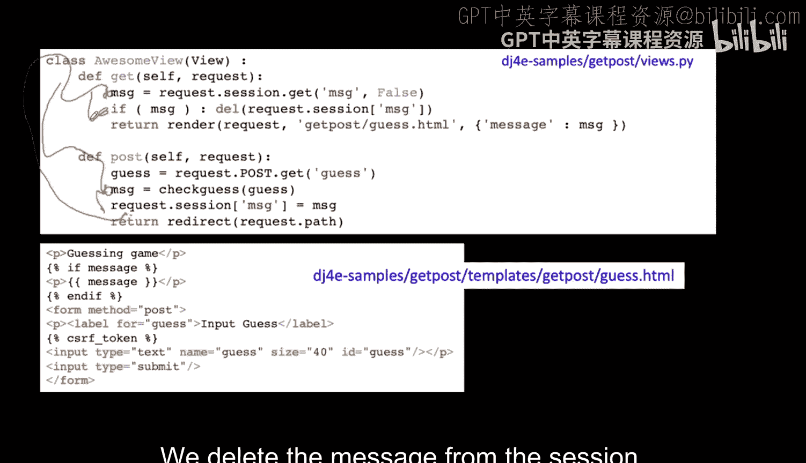

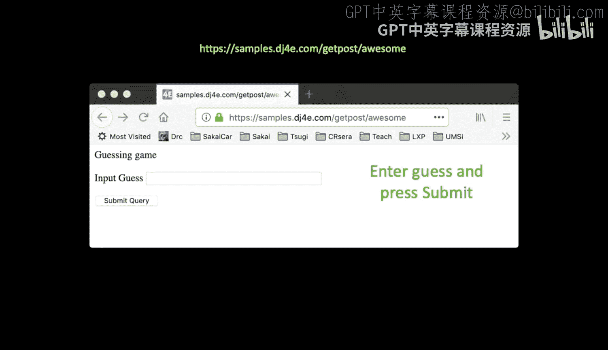

当用户提交猜测的数字时，处理的是POST请求。

```python
def post_guess(request):
    # 1. 从POST数据中获取用户猜测的数字
    user_guess = int(request.POST['guess'])
    
    # 2. 检查猜测结果，生成相应的提示消息
    if user_guess < secret_number:
        message = "太低了！"
    elif user_guess > secret_number:
        message = "太高了！"
    else:
        message = "恭喜你，猜对了！"
    
    # 3. 将消息存储到会话中，而不是直接渲染页面
    request.session['message'] = message
    
    # 4. 关键步骤：返回一个重定向响应，指向处理GET请求的同一个URL
    return redirect(request.path)  # request.path 是当前视图的URL路径
```

**流程说明：**
1.  从 `request.POST` 字典中获取用户提交的猜测值。
2.  根据业务逻辑（与秘密数字比较）生成提示消息。
3.  **不再使用 `render`**，而是将消息字符串存入 `request.session` 字典。
4.  调用 `redirect()` 函数，并传入 `request.path`（当前URL路径），这会返回一个302重定向响应，告诉浏览器“请重新访问这个地址（使用GET方法）”。

### 请求-响应循环演示

让我们通过浏览器的开发者工具（网络选项卡）来观察这个流程：

1.  **初始GET请求**：用户访问页面，服务器返回表单（200 OK）。
    

2.  **提交表单（POST请求）**：用户输入数字并点击提交。
    
    *   服务器处理POST后，**返回302重定向**，响应体为空。
    

3.  **自动重定向（GET请求）**：浏览器收到302后，立即自动向指定URL发送GET请求。
    
    *   这个GET请求到达 `get_guess` 视图，从会话中取出消息并渲染页面，返回200 OK和包含消息的HTML。
    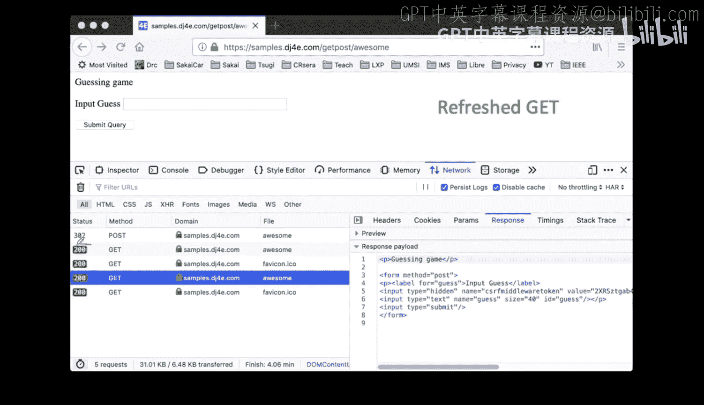


4.  **安全刷新**：此时页面显示“太高了！”。如果用户刷新页面，浏览器只是重复**步骤3的GET请求**，再次渲染页面（消息已在第一次GET时被删除，所以可能不显示或显示新内容），而**不会**重复提交POST数据，从而彻底避免了重复提交的问题。

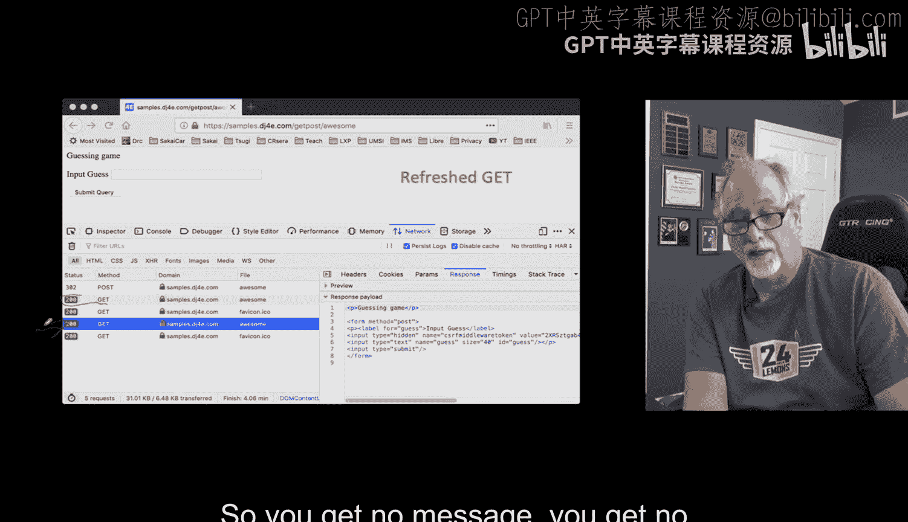

---

## 核心要点与最佳实践总结

本节课中我们一起学习了Django中处理表单提交的重要模式。

**核心规则**：在处理POST请求的视图函数末尾，如果需要向用户展示一个页面，应该使用 **`redirect`**，而不是 **`render`**。直接在POST后渲染HTML是错误做法，会导致刷新时重复提交。

**实现POST/重定向/GET模式的步骤**：
1.  **GET阶段**：显示空表单或初始页面。
2.  **POST阶段**：
    *   验证并处理表单数据。
    *   将需要反馈给用户的消息（如成功/错误提示）存入 `request.session`。
    *   使用 `return redirect('some_url')` 结束视图。
3.  **重定向后的GET阶段**：
    *   从 `request.session` 中取出消息。
    *   **（重要）** 显示消息后，立即将其从会话中删除（实现“闪现”效果，只显示一次）。
    *   使用 `render` 渲染最终页面并显示消息。

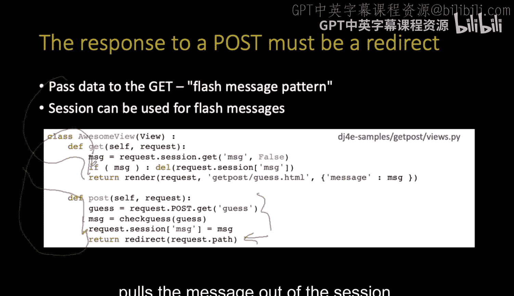

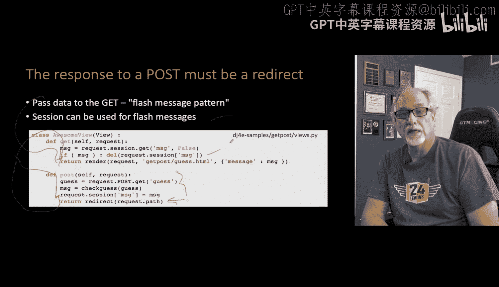

**闪现消息（Flash Message）模式**：利用会话在两次请求（POST -> 重定向 -> GET）间传递一次性消息，并在显示后立即清除，是Web开发中的常用技巧。

通过这种方式，我们构建了更健壮、用户友好的Web应用，有效防止了因浏览器刷新导致的数据重复提交问题。在接下来的课程中，我们将看到Django如何通过其内置的 `forms.py` 和表单类，让创建和处理表单变得更加简单和高效。