# 密歇根大学《给所有人的Django课程（简介、开发Web APP、特征和库、JavaScript和JSON）｜Django for Everybody》中英字幕 p94 34_07_02_构建HTML表单.zh_en -BV1Kt421V7EE_p94-

So now we're going to do a real simple run through of the kinds of things that you can do in HTML in forms。

 this is only the beginning and there's so many great online resources for how to do forms in HTML。

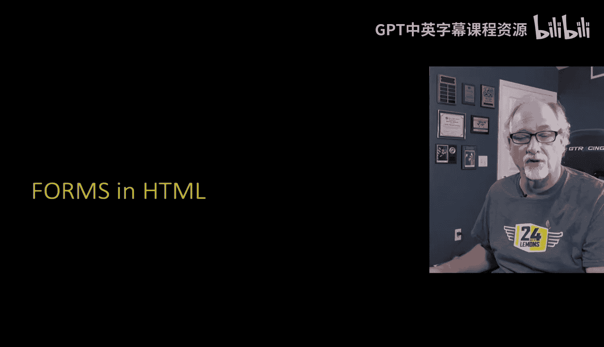

So I've already showed you the basic text field we'll talk about the password field， radio button。

 checkbox， select and drop down， and I just got kind of this one HTML page that you can view the source of and borrow I kind of write this stuff up for me for a quick reference。

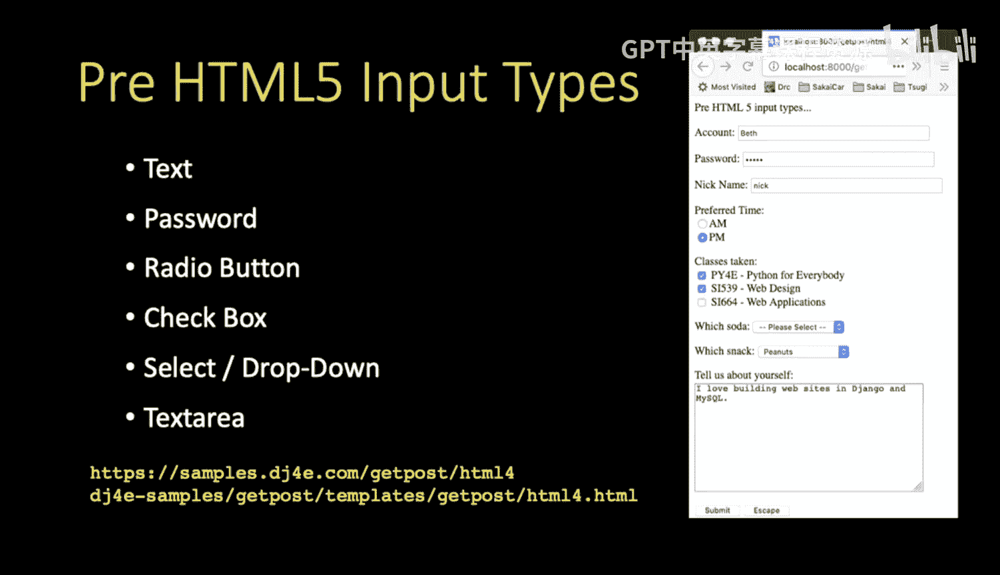

So we've already talked about the。Text field right so input type equals text and then the name is the value。

 the ID don't don't get too stuck on the ID。 The ID has to do with how you associate the label tag with the field and so that that knows that somehow account and this text box are connected so the idea is more of a browser thing and the name equals is the thing that it's going to be sent to the browser so the browser is always going to get key value pairs。

And so， you know when we type Beth and we hit submit。

 then we're going to get the incoming post data is going to have the value account equals Beth。

Now if you look at a password， that's a type password for all intents and purposes is a text type and it shows it so people can't shouldersur and see what it is。

 of course they can want you type your password， but it shows asterisks in the box while you're typing。

 but then it's important to realize that once the data is submitted。

 the data is submitted in plain text。And so here's another one， another nickname。So Nick equals NICK。

So that's basically the variance of the input types of text。

 hidden type equals hidden is another one where you just don't see it in the user interface。

 we're going to use one of those input type equals hidden in a bit。

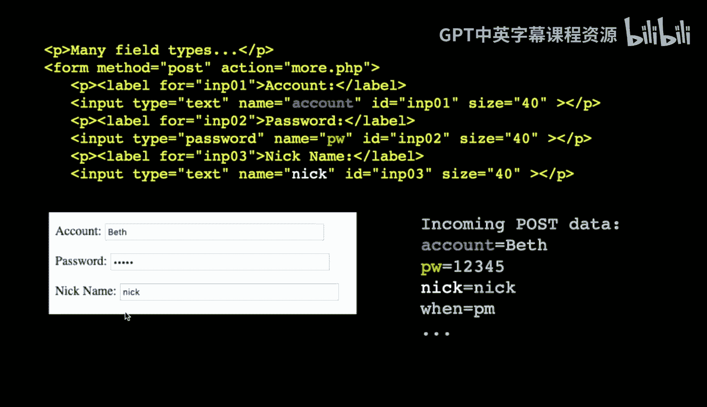

A radio button is designed for situations where there you can only pick one of two things so when you hit AM the PM goes off when you hit PM the em goes off and you can actually you have a whole bunch of them and you can click them now they're drawn together because they're type equals radio and then the name is identical and interestingly you can scatter these literally all over the page。

 it doesn't lead to very good user interface but where you go and so what happens is is again。

 no matter how many these you put with a name equals when no matter where you put them on the page if you click one all the others are going to turn off and so the one that's clicked they all have different values and so what will happen is whatever one is clicked at the moment that you actually send it。

That will be the key value pair where when equals PMm because only one can be selected and it's up to you to make these things unique or you't maybe don't want them unique you do whatever you want。

And so in this case， the PM1 is selected， so we see when equals PM in the incoming post data。

 so that's a radio button。

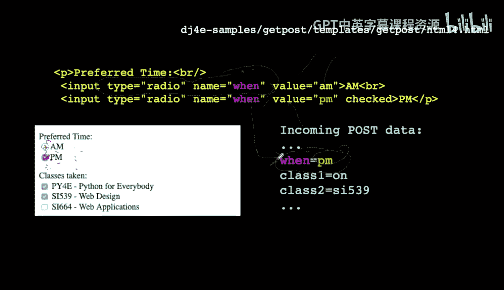

So this is a checkbox， this is more probably more useful in many ways checkboxes you can have as many that if you want and each of them are individual and distinct so if you take a look for example you see that。

You have different names class one， class two and class three， so thats at each checkbooks。

 each checkbox has its own name， but the checkboxes are actually just little checkboxes。

 the text here is just text the text is not really a critical part of it。The value。

Value is what will get sent if that checkbox is checked and so in this example we've checked pi for E and S539 and you'll notice that two of them have values and the one of them doesn't Now the key is is often you're just checking to see if the data is there in this case class3 is not in the in the post data。

And class1 is on， that's the default if you don't say value equals， it's like value equals on。

Or whatever the value is that you put in that checkbox and so you get to decide these you might easily think that you don't need any values whatsoever because you're really looking for the name of the field and you want the name of the field to be distinct and so again you can check as many of the checkbox as you want。

 you can uncheck them you can check none of them and you can check all of them so those are checkboxes so to describe a dropdown a dropdown is a multiple choice option basically for a single value that's going to be sent back to you and so。

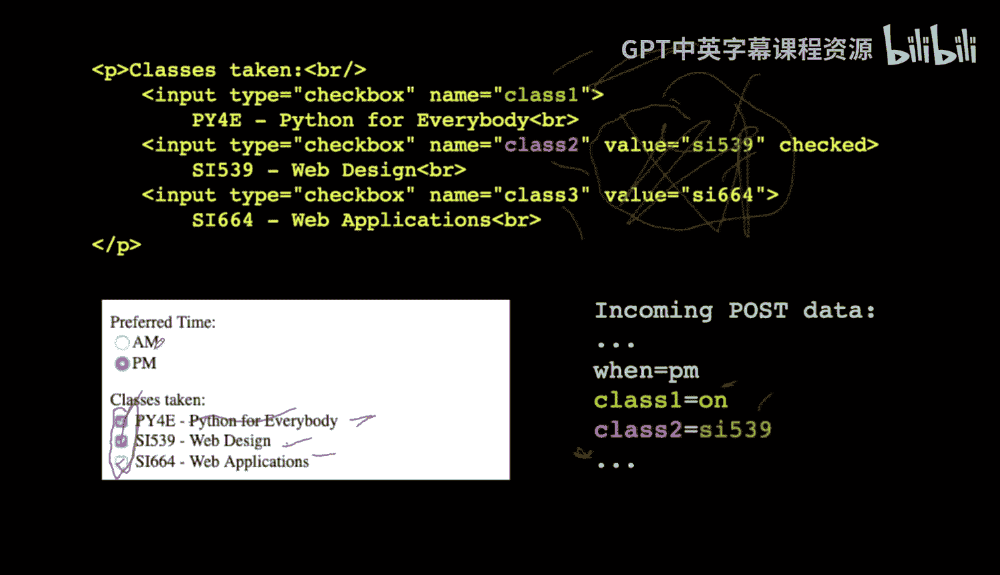

And so we have a select which is the whole thing and that gives the name key the keyword that it's going to be sent back to。

 and then we have a series of options and you'll notice there's no value on the select but each option has its own value so I happen to be going to012 and these are strings not numbers they often are just numbers to make our lives simple and then you have some text。

 etc， etc， etc。And so you pick one in this case I leave it default and I hit the submit。

 so soda is going to be equal to zero， so this happen to be the one thats selected when we hit submit okay so that's what a select looks like。

 you can also make a select that has some defaulted one and so you just put select on one of them so that means it's the dropdown they're all there right they're all there if you click on this thing you'll see if you click on which snack you're going to see all the different snacks peanuts is pre-selected and if I don't change it and hit submit then we're going to see snack equals the value which is peanuts so that's an example that you don't have to make numbers。

 although it's really common to be using numbers so that's a dropdown with a default other than the first item。

 the default is it's the first item unless you do it otherwise。

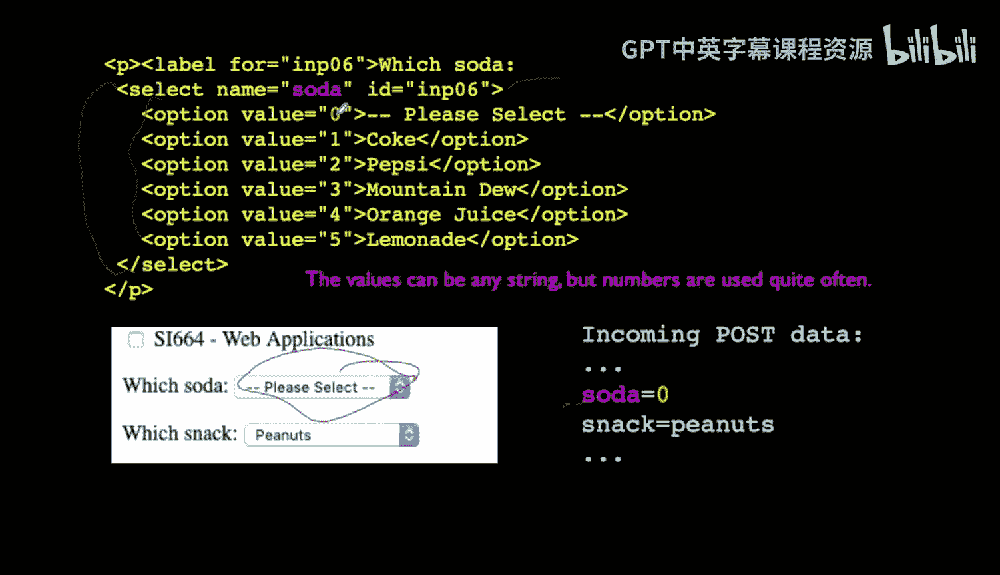

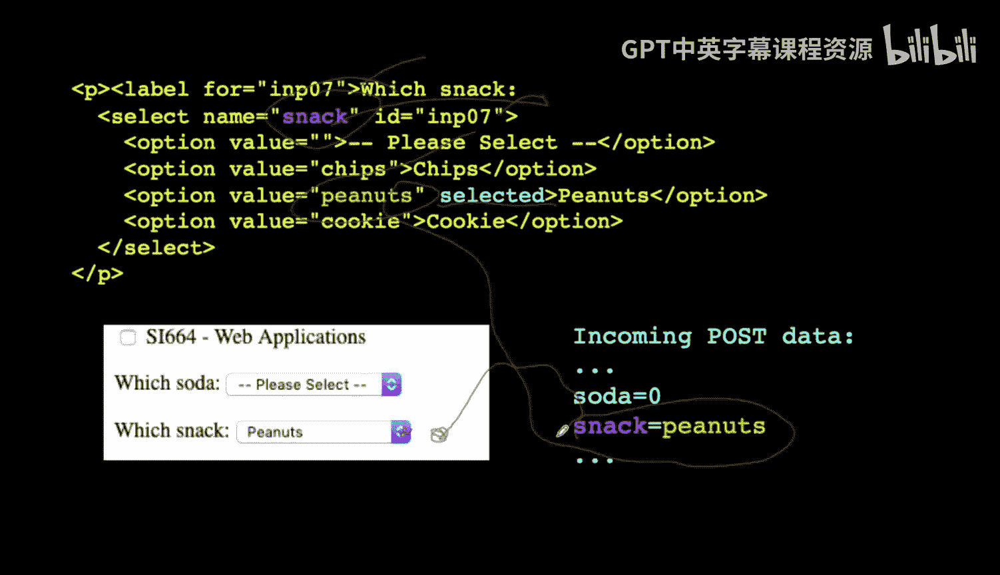

When you're typing in comments or a blog post， a big long blob of text， you use a text area tag。

 the text area tag is a little bit different and then it doesn't have a value equals it does have a name equals。

It has rows and columns to tell how tall it is and how wide it is。

There are clever styling libraries that make these a little prettier。

 but basically what it is it's a series of text， including paragraphs， including new lines etc ce。

 and you're just allowed to type with new lines and edit and cursor around in here and build all kind of stuff and then you send it in and you can put default text in here you can edit the text you can change it and it comes in as a key value pair with new lines and everything and any weird spacing that you might put in。

 but it's basically a block of text like a comment or like a。

Like a comment or a blog post or something like that。

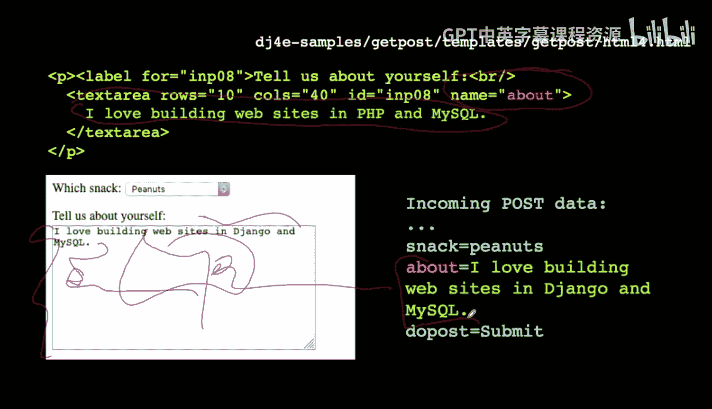

So the last thing on this page here is the submitit button。And so you can make a type equal submit。

And you can give it a name and again that's a key value put pair and a value Now the submit is a little bit weird in that the value actually appears on the submit。

What we tend to do is this submit and if you're in a multi languageguage environment you're going to want that to be whatever language of the user。

 so usually what we do is we I name carefully name the variables are the name of the form and then I check for this to exist and if I have a bunch of buttons I name them differently and don't really actually look at this text because that text might want to be translated at some point in time so that's an input type input type equals button this is a little pattern where I'm going to do like an escape or a back or something like that and then sometimes it's easier just to douce a little JavaScriptscript and what this little JavaScript chunk is location to HF equal location。

 HF equals quote wwdjfr。com return falses。What this says is that actually sort of when you press this escape button it goes up in the browser and in effect pastes this little URL into the URL bar and then hits enter and returnturn false keeps the form from being submitted。

 and so this is a way that I often will put a simple cancel or escape or something else in a form。

 just if I know the URL I want to go back to or go to。

 then you can put it in here on clickick location at HR。

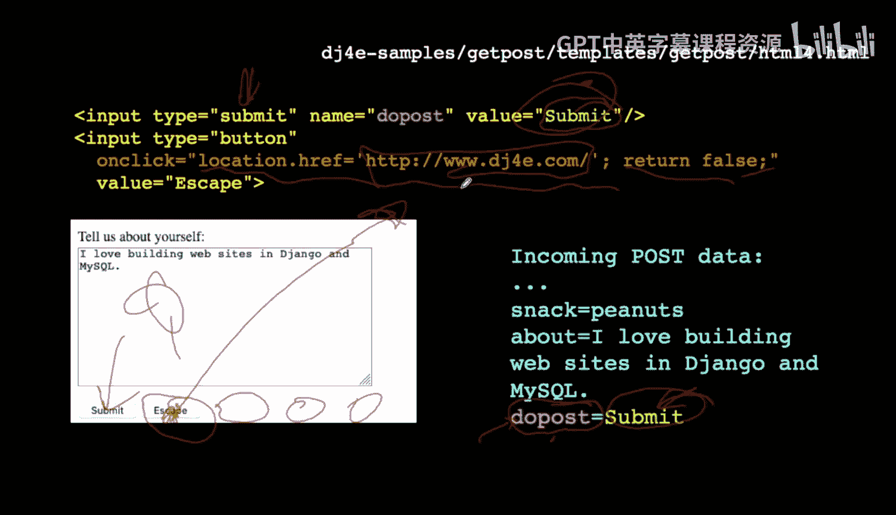

So those are the input types that have been around for probably 20 years。

Yeah at least 2025 years HTML5 is a more recent phenomenon。

 although by now it's pretty well supported in most browsers defined a whole new set of input types and what's nice about this is we were slowly but surelyly building complex libraries to solve all these problems。

 but now we can use these input types and now each browser can support them to their own way and they all fall back to Ty equals text and so if you have a really old browser these don't cause trouble so here's just some samples of some things so type equals color。

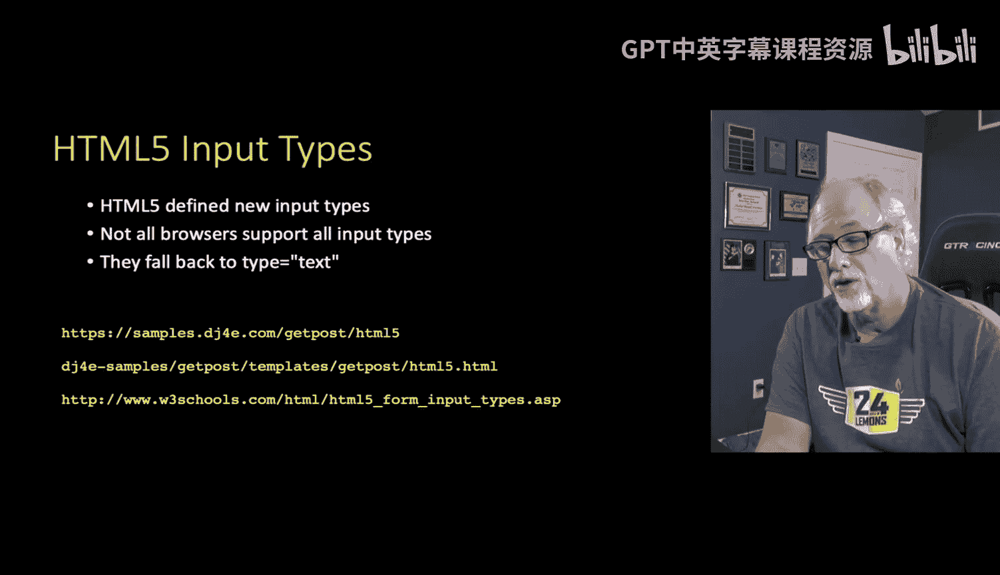

Is a color picker and that's going to pop up a color picker。

 let you cruise around that color picker is defined by the browser and usually the operating system and so you'll pick a color and then that color is going to go in in Hex format and's the red。

 the green and the blue and so that's what colors look like。

You can have type equals date and so here's a date and they pop in here。

 you're gonna to pop up a date picker for the birthday you'll pop up a date picker and you'll be able to kind of move around and pick a date and then that'll put that date in as a string they're all going to turn into strings when they're being sent in a couple of the other ones like email name equals email that basically does validation that says it's got to have an at sign there's some rules about what isnt isn't a valid email and so this will refuse to submit this form unless there's a valid valid email in there。

 the same is true for number， if you put something that's like 25 and it's not between one and five with min in Max here。

If we're going to refuse to submit the form， the same is true for a type equals URL。

 it's really a validation on the form to say， look。

 you can't put something in here that's not a valid URL。

And just to prove that it doesn't matter if you make any type which flying doesn't exist。

 you can type something in and it's just functions as a text field and so in a way all these fall back to text fields now the key thing is is when you hit the submit button。

Normally that gathers up the form and sends it to the server。

 but when you use this HTML 5 validation like date number， email URL， it actually will be for it。

Before it you hit the submit button before it actually sends it。

 it's going to do a quick validation on these things and it will actually stop and say you know what you didn't get that one right and it just refuses to submit so you can't override that in your application What happens is is the data doesn't get submitted at all until so the browser blocks the submission of the data Now if it's not an HTML5 browser it's going to get submitted with no validation whatsoever so we still have to kind of check this data for sanity which we'll talk about soon about how to do that in the server。

 but this is quite nice because it gives your user some immediate feedback kind of customize to the browser so the browser takes some responsibility for helping get the user to type the right stuff。

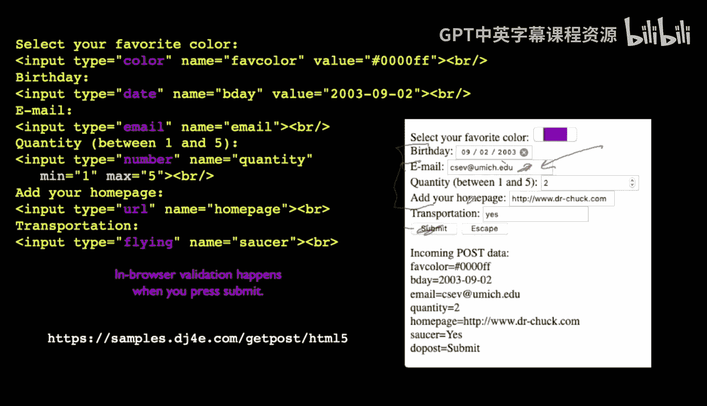

And so that is a ro through HTML forms， you will learn so much more。

 I just wanted to kind of cover some of them in case you hadn't seen it in a while。

