# 密歇根大学《给所有人的Django课程（简介、开发Web APP、特征和库、JavaScript和JSON）｜Django for Everybody》中英字幕 p95 35_07_03_表单的GET、POST与HTTP方法.zh_en -BV1Kt421V7EE_p95-

Hello and welcome to our lecture on Form there's actually whole quite a few lectures here because we're going talk about how forms work in HTML and HP and then we're going to talk about how they work in Django So forms are the way that we put HTML in browsers that have fill in the blank areas and so the ideas that you draw some fields and some places for the user to type and then you have some way of sending the data up to the server and so we'll take a look at a number of different ways to gather this stuff and send it to a server。

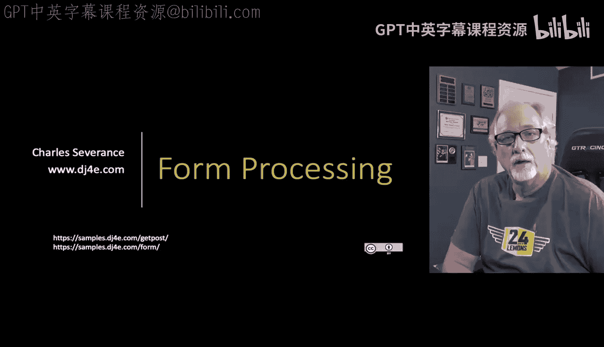

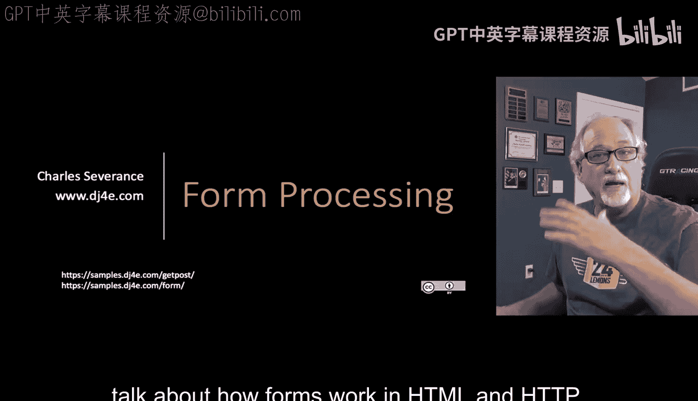

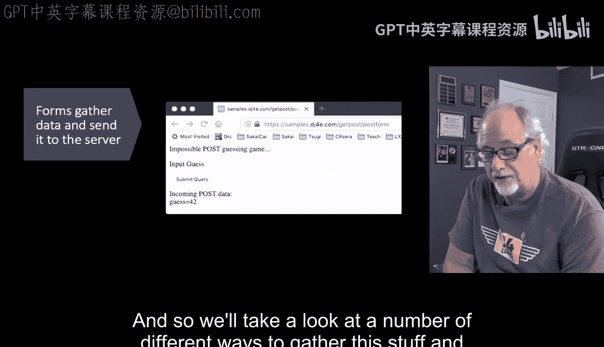

There are two basic ways to talk to the server with form data weve been everything we've been doing when you do a anchor tag is a get request。

 which means you're going to get a document and show it and you can put parameters on the end of those like question mark question mark guess equals 42 you can put that on the end of a URL but then what we're going to really introduce and talk more about is the notion of posting data so in forms you can actually do getting or posting。

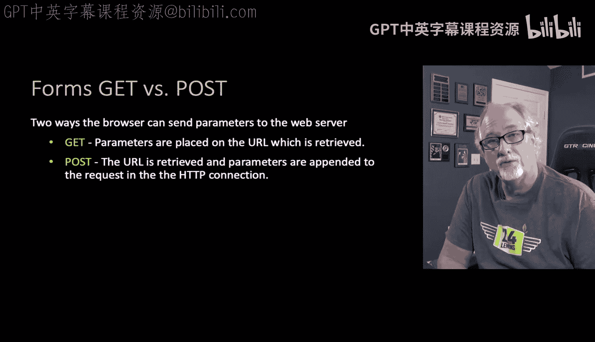

And so let's take a look at some code here。So this is a little bit of utility code that I'm going use over and over and over again because because the get data and the post data and' even the cookie data and stuff come in as dictionaries they look like dictionaries key value pairs and so I just wanted a way to dump the data on a little label I should call that guy label and then a dictionary and so I'm just going to retrieve。

 go through all the items and call HTML escape so that we just don't end up with HTML crosslight scripting injection just print the keys and values out and put some paragraph tags and stuff like that so it's just a way to dump this out so I can show it to you and not put this code on every one of my slides so just remember that that's what dump data does and here is a little form that prints out a form and then retrieves the form so you'll note the dump data if there is no data and request get it doesn't print anything out but this ends up producing a form。

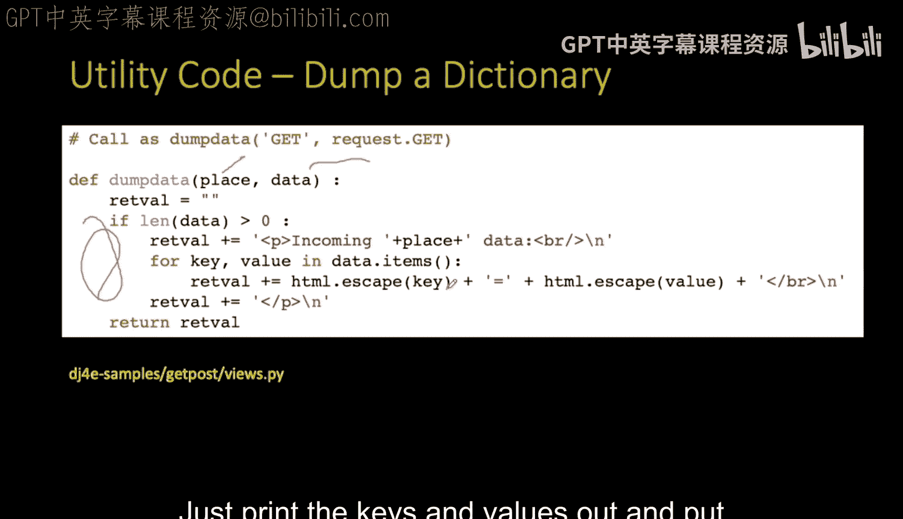

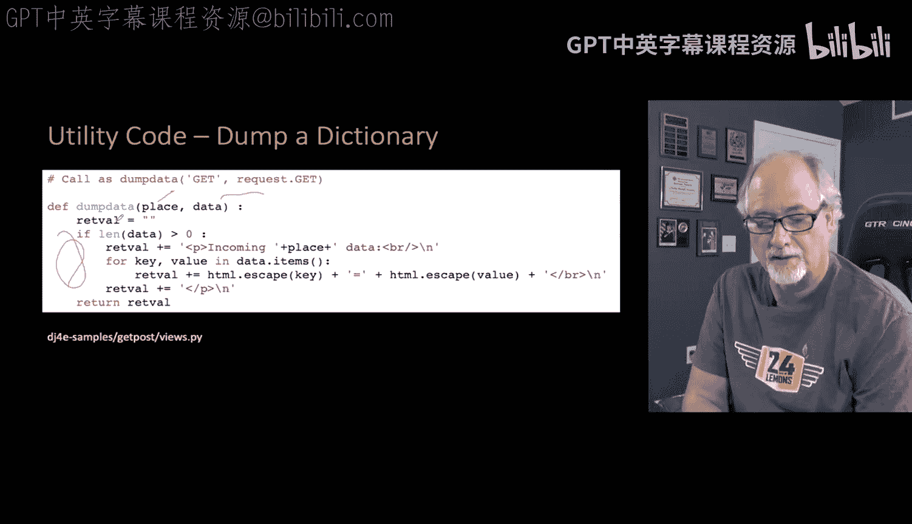

Right and there's a form tag， there's input tag input is the painting you know just put some text out and then this label is box here is the input type equals text name equals guess size equals 40 and then we put a submit button out and we can type some stuff in and we can hit the submit button type 42 in and hit submit button and you will notice that once this submit button is hit it adds automatically onto to the end of the URL that it came from Que mark guess equals 42 and then it sends that back and does another get request。

 but this time it does a get request with question mark equals 42 and comes this this guess equals 42 is put onto the request get and then we dump it out so we get to see the key value pair of guess equals 42 and again Jago is taking care of all that parsing and everything before we get to it。

Now this is pretty much the exact same thing Lady we're going to talk about this CSRF exempt。

 this is to keep it as simple as possible for now， and all we have to do is tell that we would like to communicate this same form of data。

 one input field and a submit button， we're going to communicate this from the browser to the server using the post method and so this is a communication to the browser when the server says I would like to send this data using the technique of post。

 not the technique of get。And so you know it prints out we put in the number， we submit it。

 and so the first thing that you'll notice is there's no key value pairs and that's because the post actually transports the data to the server in a different way。

 and it appears in a different key value pair， we can tell whether it's a post or a get and if it's a get we get our get parameters in request do get and if it's a post we get our post parameters in request do post and so we still get the same guess keyword equals the number 42。

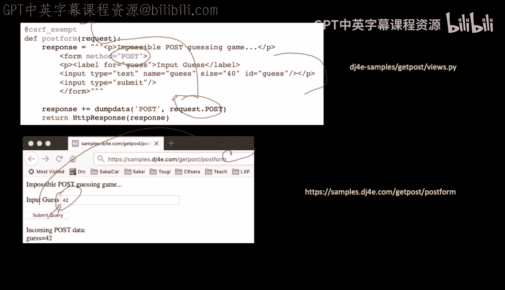

And so that's simply the two ways of transporting it and this is talking about those two ways right the browser has a form you know。

 blah， blah， blah input type equals guess and the name field name equals guess is the field that is going to tell what the key value pair is so if you're going to put a post I mean you're going you're going to hit the submit button on a get form。

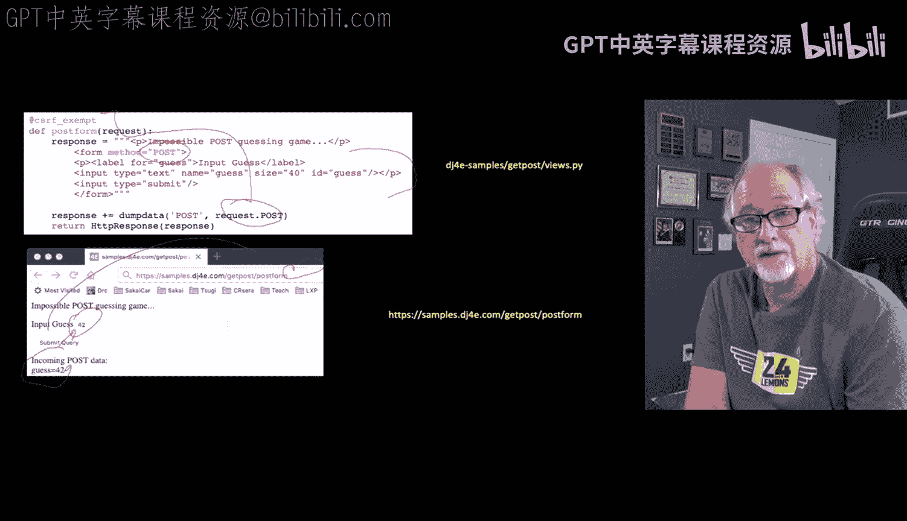

It doesn't get to wherever it came from， right？ And then appends the key value pair to the end。

 And again， that goes into Django， which parses it and puts it in request get， et cetera， et cetera。

 et cetera。 And if all you do is you tell it with a method equals post。

 Then it chooses a different way。 So the post is going to the same URL。

 But there are no parameters here。 And so there's a series of headers like you know what is my preferred language。

 et cea， et cetera。 what I'm using for my browser， the content type is this application URL form encoded and that's talking about this。

 Now， remember this is going into the server。 So the content type coming out tells us if it's an HTML page or a Jpeg。

 but the content type going in tells the browser tells the server how to parse this。

 So it leaves a blank line looks it's very symmetric with how the server sends us pages back and then guess equals 42。

 Now there's some complexity here， and theres some complexity， there's some complexity in。

Post data and there is some complexity in the get parameters where if you're sending special characters。

 there's ways they have to be encoded， but want to ignore that for now。

 just understand that the reason you don't see the parameters a get on the post request is the data has been transported it is part of the HtTP connection and that's later on in the connection after all the headers have been sent。

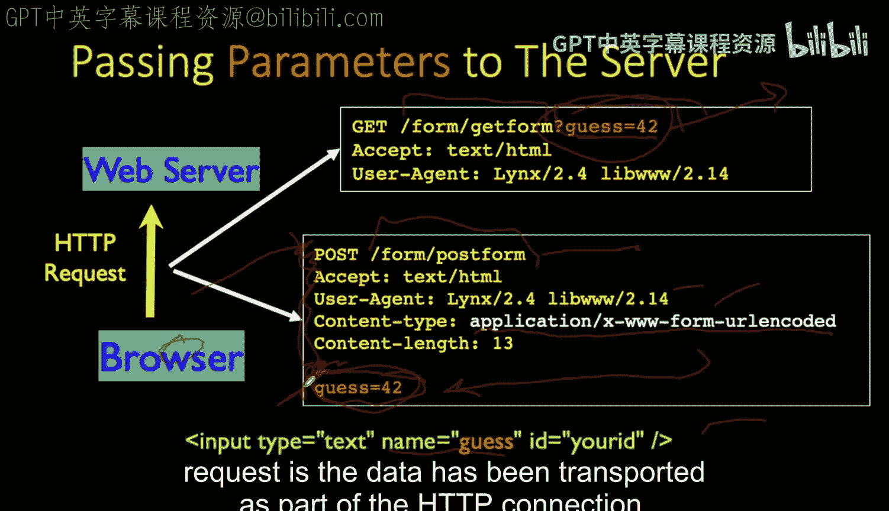

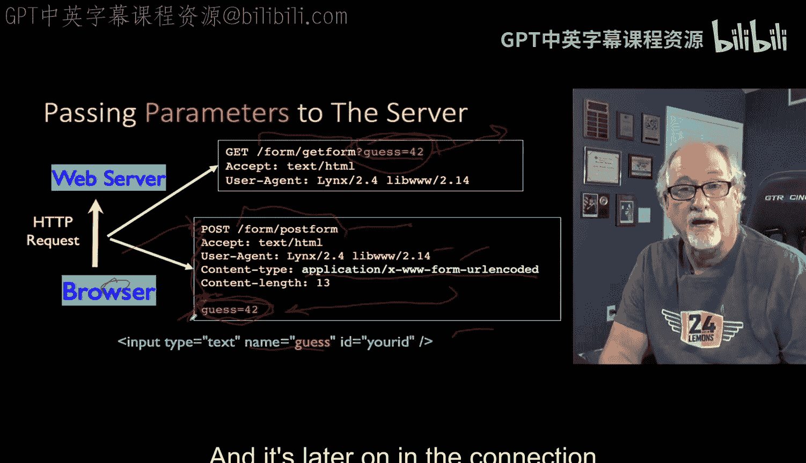

So you might say it doesn't matter， well， it does matter。

So there's a couple of simple rules the post needs to be used when data is going to be created or modified and we'll see situations where we force this where you don't want to delete something on a get request if you're reading or searching gett is great it should never be used insert mod or delete the data。

 anything that's going to change the state of the system and part of the problem is is that Web spiders will find gett request so might if you build a bad application and like a catalog of bearings for example。

 and you have a delete that happens to be a get request in a Web spider grabs your page and hits all those URLs。

 you might find that the Web spider just wiped out your database so Web spiders do not follow posts because they assume that by following posts they might be changing your data but by following Gts they're just reading your data and that's all that Web spider really wants to do unless of course it's doing some kind of automation。

So get URLs are supposed to be item potent， so the idea is if you say blah， blah， blah。

 guess equals 42， it's supposed to kind of give you back the same page now。🎼That's like saying。

 you know， blah， blah， blah current calendar， Well， what is the current calendar。

 it might be it's not identical， but it is sort of semantically the same thing。

 So you're supposed to be able to go bookmark a get。

 you know you can bookmark a get URL but not like you might say where's my inbox know here's a URL to my inbox in some kind of a system to read my data and so you can bookmark that and go back to your inbox。

 it should be a get request， you shouldn't be bookmarking posters The other thing is that depending on your browser。

 your web server software， etc ce， you may have an upper limit on the get。

 let's just think 2000 characters doesn't mean you should worry about it too much but just large things。

 especially when we start uploading files like pictures then all of a sudden the get is impossible and you have to use post and it also has the advantage that post doesn't mess up here you keeps your URLs looking prettier。

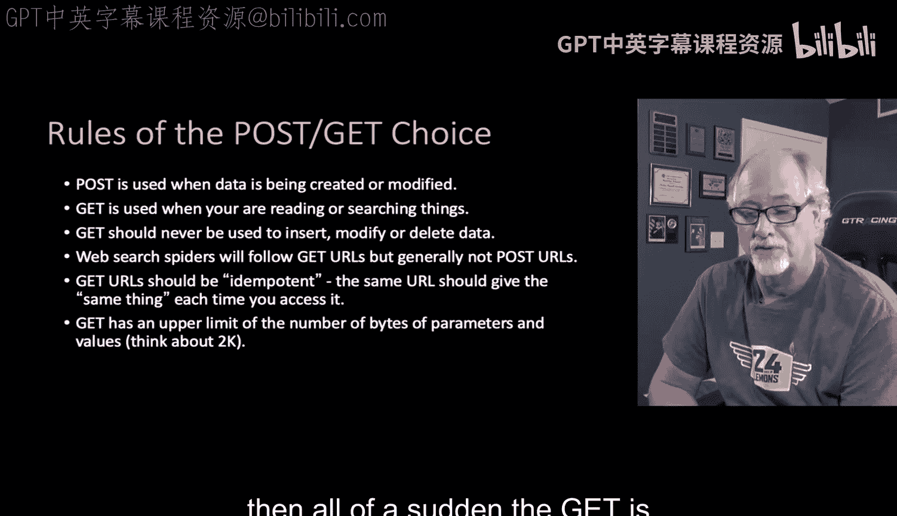

So next we're just going to do a quick review of the kinds of things that you can do in forms in HTML and different kind of input tags we can show in our HTML。

