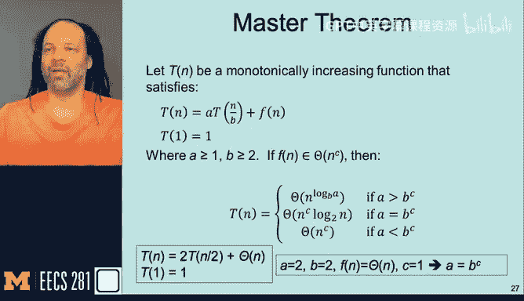
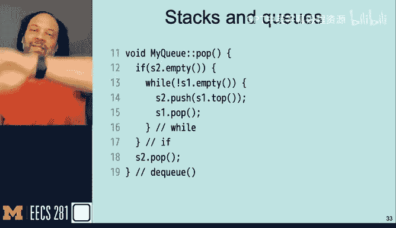
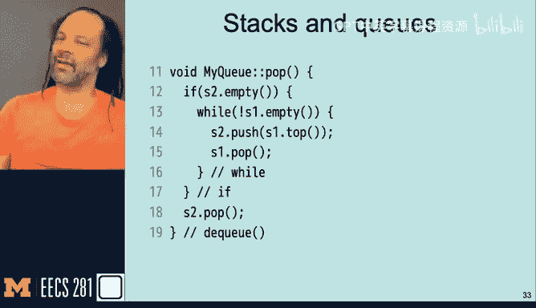
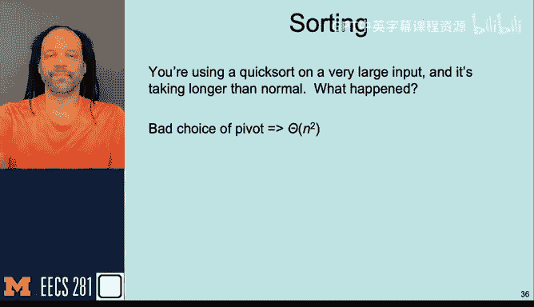
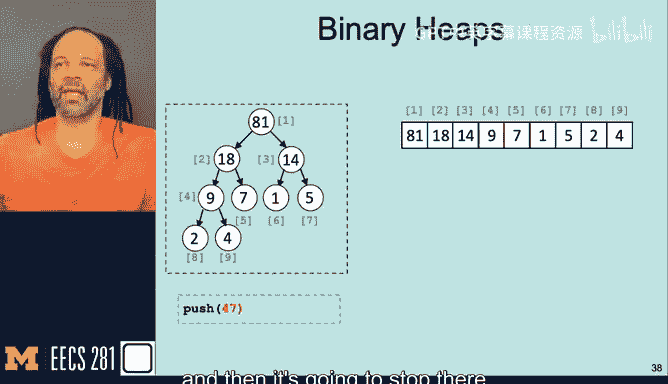
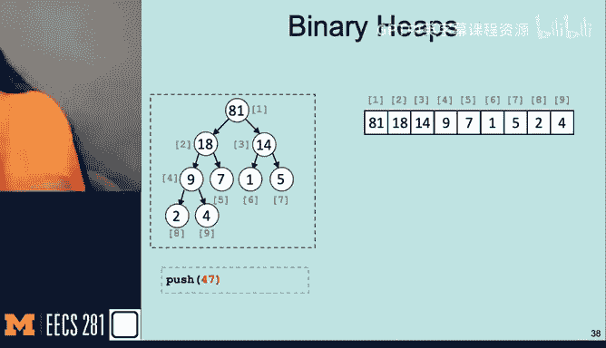
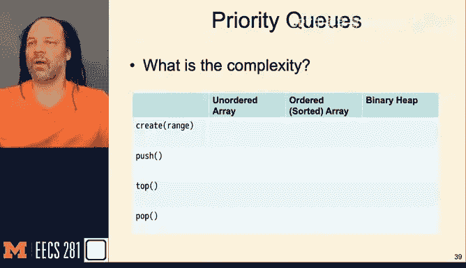

# 013：期中考试复习指南 📚

在本节课中，我们将一起回顾期中考试的结构、内容以及高效的备考策略。我们将涵盖考试形式、复习重点、答题技巧，并帮助你制定一个成功的应考计划。

## 考试结构与政策 📝

上一节我们介绍了课程的整体情况，本节中我们来看看期中考试的具体安排。

考试总时长为 **140分钟**，分为两个部分：
1.  **选择题部分**：通过Canvas平台完成，共24题，每题2.5分。
2.  **自由作答部分**：通过Gradescope平台完成，共2道编程题。

**重要提醒**：所有题目内容（包括自由作答题的描述）都将在Canvas的测验中提供。**请勿在完成两部分题目之前提交Canvas测验**，否则你将无法阅读自由作答题目。

考试期间如有疑问，请通过Piazza以**私密帖子**的形式提问，教学团队会尽快回复。请勿公开发布问题。

关于考试资料，允许使用课程提供的所有材料（如讲义PDF、实验资料）。虽然不强制要求，但**强烈建议手写一份“小抄”**。整理小抄的过程能有效激活记忆，帮助你聚焦核心概念。

## 考试内容概览 🧠

了解了考试形式后，我们来看看具体会考察哪些知识点。

考试内容涵盖第1至13讲的所有主题，重点是：
*   **复杂度分析**：包括递归关系及主定理（Master Theorem）的应用。
    *   主定理公式：对于递归式 `T(n) = aT(n/b) + f(n)`，比较 `a` 与 `b^{log_b a}` 的关系来确定主导项。
*   **容器对比**：数组/向量（连续存储）与链表（指针连接）的优劣。
*   **栈、队列与优先队列**：理解其特性和操作复杂度。
*   **排序算法**：包括插入排序、快速排序、归并排序、堆排序等，掌握其适用场景。
*   **二叉堆**：理解其结构（数组表示）及插入、删除操作。
*   **字符串与序列**：重点理解指纹（Hashing）的概念和应用。

每个主题大致对应1-2道选择题。两道自由作答题中，一道侧重于**迭代器机制**，另一道则综合性更强，分值也更高。

## 成功应考策略 🏆

现在我们已经明确了考试内容，接下来学习如何高效地应对考试。

以下是帮助你取得好成绩的关键策略：

*   **保持冷静**：焦虑不会带来分数。确保考前休息充分，饮食得当，以最佳状态应考。
*   **克服自我怀疑**：你能进入这门课程并坚持到现在，已经证明了你的能力。相信你自己。
*   **像专业人士一样备考**：运动员和音乐家都有周密的计划。作为“专业考生”，你也需要制定考试计划。
*   **通读试卷**：开考后，先用5-10分钟快速浏览**全部题目**。这能让你的大脑在后台开始处理所有问题，缓解面对新题时的紧张感，并帮助你规划答题顺序。
*   **制定答题计划**：根据题目分值和自身强弱项，提前规划时间分配。例如：
    *   **计划A（均衡型）**：选择题每题2分钟 → 编程题1（30分钟）→ 编程题2（30分钟）→ 回顾难题（10分钟）。
    *   **计划B（侧重编程）**：先攻编程题（各20分钟）→ 选择题每题3分钟 → 剩余时间检查编程题。
*   **做好笔记**：在答题过程中，及时标记存疑的题目或已排除的错误选项，方便后续快速回顾。

## 核心概念复习与例题 💡

掌握了策略，我们通过一些例题来巩固核心概念。

### 复杂度分析
分析以下代码段的时间复杂度。

```cpp
// 代码段1：二分查找变体
while (high >= low) {
    size_t mid = low + (high - low) / 2;
    if (array[mid] == x) return mid;
    else if (array[mid] < x) low = mid + 1;
    else high = mid - 1;
}
// 复杂度：O(log n)



// 代码段2：嵌套循环
for (size_t i = 0; i < size; ++i) {
    for (size_t j = 0; j < size; ++j) {
        // 常数时间操作
    }
}
// 复杂度：O(n^2)
```

### 容器选择
根据场景选择最合适（或最不合适）的容器（单向链表、双向链表、向量）。

*   **场景1**：需要频繁在特定已知元素前插入新元素。
    *   **分析**：链表在已知节点处的插入是O(1)，而向量需要O(n)移动元素。由于需要“在前插入”，双向链表更优。
*   **场景2**：存储大量1字节对象，且内存极度紧张。
    *   **分析**：链表每个节点都有指针开销（8或16字节），内存利用率低。向量（连续存储）开销最小，最合适；反之，双向链表最不合适。

### 用栈实现队列
以下是如何使用两个栈（`S1`, `S2`）实现队列的`pop`操作：

```cpp
void pop() {
    if (S2.empty()) {
        while (!S1.empty()) {
            S2.push(S1.top()); // 将S1元素逆序转入S2
            S1.pop();
        }
    }
    if (!S2.empty()) {
        S2.pop(); // 从S2弹出，即队列的队首
    }
}
// push操作始终将元素压入S1。
// 摊还复杂度分析：每个元素最多被压入S1一次、弹出S1一次、压入S2一次、弹出S2一次，因此摊还复杂度为O(1)。
```

### 排序算法选择
根据数据特征选择最佳排序算法：
*   **几乎已排序的数组**：**插入排序**（接近O(n)）。
*   **内存大小的大型数组**：**堆排序**（原地排序，O(n log n)）。
*   **快速排序在大型输入上异常慢**：可能**重复选择了糟糕的枢轴**，导致复杂度退化为O(n²)。





### 二叉堆操作
给定一个最大堆，插入新元素`47`并执行`fixUp`操作，需要能够画出调整后的堆树形图及其底层数组表示。

### 优先队列实现复杂度
回顾不同底层容器实现优先队列核心操作的复杂度：
| 操作 | 无序数组 | 有序数组 | 二叉堆 |
| :--- | :--- | :--- | :--- |
| **创建** | O(n) | O(n log n) | O(n) |
| **push** | O(1) 摊还 | O(n) | O(log n) |
| **top** | O(n) | O(1) | O(1) |
| **pop** | O(n) | O(1) | O(log n) |



### 字符串指纹
理解字符串指纹（哈希）的核心概念：
*   如果两个字符串的指纹**不同**，则它们**一定不同**。
*   如果两个字符串的指纹**相同**，它们**可能相同，也可能不同**（存在哈希碰撞可能）。







---

本节课中我们一起学习了期中考试的结构、核心考点以及一系列高效的备考和应考策略。记住，保持冷静、制定计划、相信自己的准备。考试很快就会结束。祝大家考试顺利！