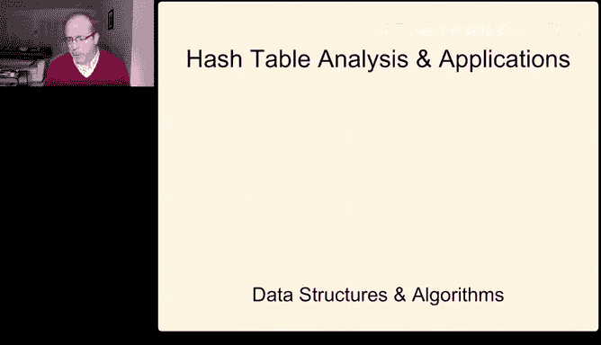
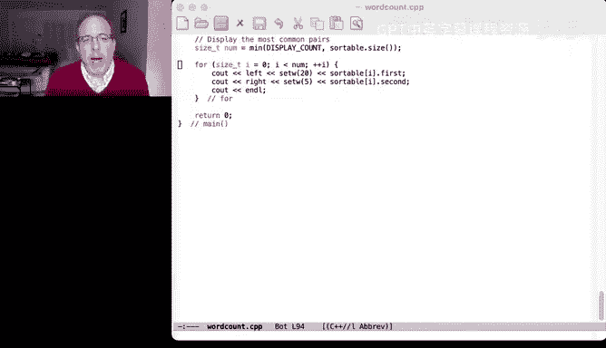

# 014：哈希表简介 🗂️

在本节课中，我们将要学习一种名为“哈希表”的强大数据结构。哈希表是实现“字典”这一抽象数据类型的一种方式，它能够让我们以非常快的速度进行数据的插入和查找操作。

## 字典抽象数据类型 📖

上一节我们提到了哈希表是实现字典的一种方式。那么，什么是字典呢？

字典抽象数据类型是一个存储项目的容器。这些项目通常是**键值对**，就像单词和它的定义一样。这个容器支持两个基本操作：
*   **插入**：向容器中插入一个新的键值对。
*   **搜索**：给定一个键，检索出与该键关联的值或键值对。

字典主要有两种应用场景：
*   **集合追踪**：检查某个元素是否在集合中（例如，根据学号检查学生是否注册了课程）。
*   **键值存储**：通过键查找对应的值（例如，根据学号查找学生的实验和项目分数）。

除了插入和搜索，字典通常还支持其他操作，如删除指定键的项目、排序、选择第K大的项目以及合并两个字典等。

## 为什么需要哈希表？⚡

我们已经学习过多种数据结构，那么哪种结构能快速实现字典的插入和搜索呢？

*   **有序向量**：搜索快（对数时间），但插入慢（线性时间，因为需要移动元素）。
*   **无序向量**：插入快（常数时间），但搜索慢（线性时间）。
*   **链表**：插入简单，但搜索也是线性时间。
*   **二叉搜索树（如STL中的`map`）**：平均情况下插入和搜索都是对数时间，但在最坏情况下（如输入顺序不当导致树退化成链表）会变成线性时间。

哈希表（在STL中实现为`unordered_map`）则提供了更优的平均性能：**插入和搜索在平均情况下都是常数时间**。虽然最坏情况下它也可能是线性的，但在精心设计和许多常见应用中，它都能保持接近常数时间的性能。

## 哈希表的基本思想 🧠

哈希表的核心思想是：将一个可能非常大的键空间，映射到一个更小、更易于管理大小的表中。

这个过程涉及三个关键部分：
1.  **翻译**：将任意类型的键转换成一个整数。公式表示为：`整数 = 翻译函数(键)`。
2.  **压缩**：将这个（可能很大的）整数限制到哈希表有效索引的范围内（例如，0 到 M-1，其中 M 是表的大小）。公式表示为：`索引 = 压缩函数(整数)`。
3.  **冲突处理**：由于我们将一个大空间映射到小空间，**冲突**（即两个不同的键被映射到同一个索引）不可避免。我们需要机制来处理这种情况（本节课稍作介绍，下节课深入讨论）。

哈希函数就是翻译和压缩这两个步骤的组合：`哈希值 = 压缩(翻译(键))`。

## 翻译：将键转换为整数 🔢

翻译步骤的目标是将任何类型的键（字符串、浮点数、自定义对象等）转换成一个整数。

**对于整数**：翻译非常简单，整数本身就是整数。
**对于浮点数**：如果已知其范围 [s, t)，可以使用公式：`floor((key - s) / (t - s) * M)` 直接得到索引（这里结合了翻译和压缩）。
**对于字符串**：简单的翻译（如将字符ASCII码相加）效果不好，因为“stop”和“tops”会得到相同的值。更好的方法是考虑字符位置，类似于构建一个“数字”，例如使用类似 `((c1 * p + c2) * p + c3) ...` 的方法（其中 p 是一个质数），这能有效区分字符顺序不同的字符串。

C++标准库为大多数基本类型和容器提供了 `std::hash` 函数来完成翻译步骤。

## 压缩：将整数映射到表范围 🔧

翻译得到的整数可能很大，我们需要将其压缩到哈希表索引的范围 [0, M-1) 内。



最常用的方法是**取模运算**：`索引 = 整数 % M`。
为了使分布更均匀，**M 最好选择一个质数**，这样可以减少键与 M 有公因数导致的分布不均。

如果我们不能控制 M 的选择（例如，使用别人提供的哈希表库），为了降低与未知 M 的关联性，可以使用以下公式进行压缩：`索引 = ((a * 整数) + b) % M`，其中 a 和 b 是质数，且确保 `a % M != 0`。

## 哈希函数的设计要点 🎯


一个好的哈希函数必须满足以下几点：
*   **必须快速计算**。
*   **必须完备**：对所有可能的键都能计算出哈希值。
*   **必须具有确定性**：相同的键总是产生相同的哈希值。

此外，它**应该**能将键均匀地分布在哈希表中，以最小化冲突。

## 哈希表的性能分析 📊

在**完美哈希**（无冲突）的理想情况下，插入、搜索和删除都只需要计算哈希函数（常数时间）和索引访问（常数时间），因此是 **O(1)** 复杂度。

然而，冲突是不可避免的（就像“生日悖论”所揭示的）。在最坏情况下，如果所有键都哈希到同一个值，性能会退化为 **O(n)**。但在平均情况下，通过良好的哈希函数和合适的表大小 M，我们可以将冲突控制在很低的水平，从而实现接近常数时间的操作。

## C++ STL 中的哈希表 🛠️

C++标准模板库提供了基于哈希表的容器：
*   `unordered_set`：只存储键的集合。
*   `unordered_map`：存储键值对的映射。
*   它们对应的“multi”版本（`unordered_multiset`, `unordered_multimap`）允许重复键。

以下是一个使用 `unordered_map` 统计单词频率的简单示例代码框架：

```cpp
#include <iostream>
#include <unordered_map>
#include <string>

int main() {
    std::unordered_map<std::string, int> word_count; // 键:单词，值:频率
    std::string word;

    // 模拟读入单词
    while (std::cin >> word) {
        // 清理单词（转小写、去标点等）...
        // clean_word = cleanup(word);

        if (!clean_word.empty()) {
            ++word_count[clean_word]; // 插入或递增计数
        }
    }

    // 查找示例
    std::string query = "hello";
    auto it = word_count.find(query);
    if (it != word_count.end()) {
        std::cout << query << " appears " << it->second << " times.\n";
    } else {
        std::cout << query << " not found.\n";
    }

    return 0;
}
```
使用 `map[key]` 访问不存在的键会创建该键（值初始化为0），而 `find(key)` 则更安全，它返回一个迭代器，需要检查是否等于 `end()`。

## 哈希表的应用与权衡 ⚖️

哈希表常用于需要快速查找的场景，例如：
*   数据库索引
*   编译器中的符号表
*   缓存实现
*   统计频率（如单词计数）

然而，哈希表并非万能，在以下情况可能其他结构更合适：
*   **键空间很小且连续**：直接使用数组（桶数组）即可，例如用数组索引表示一年中的天数。
*   **不需要频繁动态插入，但需要多次查找**：可以先将所有数据插入向量，然后排序，用二分查找。
*   **需要有序遍历键**：哈希表本身是无序的。如果经常需要有序输出，二叉搜索树（`map`）或额外维护一个有序结构可能更好。
*   **空间开销敏感**：哈希表有一定的空间开销（包括未使用的桶）。
*   **哈希函数计算成本高**：如果键本身很简单，直接索引或比较可能更快。

对于复合键（如经纬度对），需要组合其组成部分的哈希值。一种有效的方法是使用类似“Boost库哈希组合”的技术：`seed ^= hash_value(v) + 0x9e3779b9 + (seed << 6) + (seed >> 2)`。

## 总结 📝

本节课我们一起学习了哈希表的基础知识。我们了解了字典抽象数据类型，探讨了哈希表如何通过哈希函数将键映射到数组索引来实现平均常数时间的插入和搜索。我们深入分析了哈希函数的两个关键步骤——翻译和压缩，并讨论了设计良好哈希函数的要点。最后，我们通过实例看到了C++ STL中哈希表容器的用法，并探讨了其应用场景以及与其他数据结构的权衡。



下节课，我们将解决哈希表的核心挑战：**冲突处理**，学习当两个键哈希到同一位置时该如何解决。