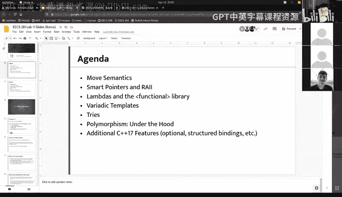

# 018：-19-W21 Lab 11 (Bonus)


## 概述

在本节课中，我们将学习C++中一些更高级的主题，包括移动语义、智能指针、RAII、Lambda表达式、变参模板、Trie树、多态性的底层实现以及结构化绑定。这些概念对于进行高级C++编程非常有帮助。

## 移动语义 🚚

上一节我们介绍了课程概述，本节中我们来看看移动语义。移动语义基于“三法则”的概念。如果你在EECS 281之前上过EECS 280，你会学到“三法则”：如果你定义了一个自定义类或结构体，并且需要定义以下任何一个：拷贝构造函数、拷贝赋值运算符或析构函数，那么你可能需要定义所有这三个。这通常涉及管理动态分配的内存。

### 三法则回顾

如果一个类在构造函数中调用了`new`来分配内存，那么在拷贝构造函数和拷贝赋值运算符中，我们通常希望对分配的数据进行深拷贝，而不仅仅是浅拷贝指针本身。在析构函数中，如果我们在构造函数中调用了`new`，我们很可能需要在析构函数中调用`delete`。

基于三法则，我们有时会遇到效率问题，存在可以优化的场景。例如，如果我们知道另一个对象不再需要其数据，我们可以直接“窃取”它，而不是进行完整的深拷贝。

### 移动语义的动机

窃取数据通常比复制数据快得多。对于我们的自定义向量类，深拷贝是O(N)操作，而窃取操作可以认为是仅复制指针本身，是O(1)操作。移动语义允许我们在确定不需要复制时窃取内部数据。

好的编译器在某些情况下（例如从函数返回临时对象时）会自动避免不必要的拷贝，这称为返回值优化（RVO）。但编译器并不总是足够智能，这时就需要我们显式地使用移动语义。

### 移动构造函数和移动赋值运算符

为了支持移动语义，我们引入了“五法则”，即在三法则的基础上增加移动构造函数和移动赋值运算符。

移动构造函数的语法是使用双引用`&&`，这表示参数是一个右值引用。在移动构造函数中，我们通常执行浅交换（shallow swap），即交换指针等成员，而不是深拷贝。

以下是移动构造函数的示例代码：
```cpp
MyVector(MyVector&& other) noexcept
    : size_(0), capacity_(0), data_(nullptr) {
    swap(*this, other);
}
```

移动赋值运算符类似：
```cpp
MyVector& operator=(MyVector&& other) noexcept {
    swap(*this, other);
    return *this;
}
```

在移动数据时，我们需要确保被移动的对象在析构时是安全的，因此通常先将其成员初始化为默认值（如`nullptr`），然后再进行交换。

### `std::move` 函数

`std::move` 用于指示一个对象可以被移动，即允许高效地将资源从一个对象转移到另一个对象。它本质上等同于将对象静态转换为右值引用类型。

使用 `std::move` 时需要注意，一旦对象被移动，其状态是未定义的，不应再被使用。

规则是：仅当你确定在移动后不再需要该变量的值时，才使用 `std::move`。

### 通用引用和完美转发

通用引用（使用 `T&&` 在模板中）可以同时接受左值和右值引用，并保留其原始值类别。结合 `std::forward` 可以实现完美转发，将参数以原始的值类别传递给其他函数。

## 智能指针 🤖

管理动态分配的内存很困难，容易导致悬空指针、双重释放和内存泄漏等问题。智能指针是一类对象，可以自动管理内存，避免显式使用 `new` 和 `delete`。

### `std::unique_ptr`

`std::unique_ptr` 独占对象的所有权。当 `unique_ptr` 被销毁时，它会自动删除所管理的对象。它不可复制，但可以移动。

### `std::shared_ptr`

`std::shared_ptr` 允许多个指针共享同一个对象的所有权。它通过引用计数来跟踪有多少个 `shared_ptr` 指向同一对象。当引用计数变为零时，对象被自动删除。

`shared_ptr` 的实现通常包含一个控制块，其中存储引用计数和指向对象的指针。

### `std::weak_ptr`

`std::weak_ptr` 是对 `shared_ptr` 所管理对象的弱引用。它不增加引用计数，因此不会阻止对象被销毁。它可用于解决 `shared_ptr` 的循环引用问题。通过 `lock()` 方法可以获取一个指向对象的 `shared_ptr`（如果对象还存在）。

### `make_shared` 和 `make_unique`

推荐使用 `make_shared` 和 `make_unique` 来创建智能指针，而不是直接使用 `new`。它们更安全、更高效。

## RAII（资源获取即初始化）🔒

RAII 是一种编程理念，将资源（如内存、文件句柄、锁）的生命周期与对象的生命周期绑定。在构造函数中获取资源，在析构函数中释放资源。这确保了即使发生异常，资源也能被正确释放。

一个常见的例子是管理输出流格式的类：
```cpp
class CoutFormatSaver {
public:
    CoutFormatSaver() : old_flags_(std::cout.flags()), old_precision_(std::cout.precision()) {}
    ~CoutFormatSaver() {
        std::cout.flags(old_flags_);
        std::cout.precision(old_precision_);
    }
private:
    std::ios::fmtflags old_flags_;
    std::streamsize old_precision_;
};
```

## Lambda表达式与函数式库 🔧

Lambda表达式是匿名函数，可以在需要函数对象的地方内联定义，特别适用于定义只使用一次的简单函数，例如比较器。

Lambda的基本语法是：
```cpp
[capture-list] (parameters) -> return-type { body }
```

捕获列表允许Lambda访问其所在作用域中的变量。Lambda可以按值或按引用捕获变量。

如果Lambda体包含多个返回语句或返回类型不明确，需要使用尾置返回类型来显式指定返回类型。

Lambda可以存储在 `auto` 类型的变量中，像普通函数一样调用。

## 变参模板 📦

变参模板允许函数接受任意数量的参数。在函数体内，我们处理部分参数，然后递归处理剩余的参数。

一个典型的变参模板函数如下：
```cpp
template<typename T, typename... Args>
void print(T first, Args... args) {
    std::cout << first << " ";
    print(args...);
}

// 基础情况
template<typename T>
void print(T last) {
    std::cout << last << std::endl;
}
```

需要定义一个处理单个参数的基础情况函数来终止递归。

变参模板在编写通用代码（如日志函数）时非常有用。

## Trie树（前缀树） 🌳

Trie树是一种用于存储字符串的节点型数据结构。它通过共享前缀来高效存储字符串集合，插入、查找和删除操作的时间复杂度为O(k)，其中k是字符串长度。

每个Trie节点包含一个子节点指针数组（例如，26个字母）和一个标志位，指示该节点是否是某个单词的结尾。

虽然Trie树在理论上与哈希表有相同的时间复杂度下限，但在实践中，由于避免了哈希计算，它可能更快。缺点是内存开销较大。

## 多态性的底层实现 🧬

在C++中，派生类对象也是基类对象。这是因为派生类对象在内存中包含基类子对象，指向派生类对象的指针与指向其基类子对象的指针指向相同的地址。

虚函数通过虚函数表（vtable）实现。每个包含虚函数的类都有一个vtable，其中存储了指向其虚函数的指针。每个对象包含一个指向其类vtable的指针（vptr）。调用虚函数时，通过vptr找到vtable，再通过偏移调用正确的函数。

这种实现方式非常高效，开销仅为一个指针解引用和数组访问。

## 结构化绑定 🎁

结构化绑定允许从元组或结构体中一次性解包多个值，类似于其他语言中的多返回值。

语法如下：
```cpp
auto [var1, var2, ...] = tuple_like_object;
```

例如，从`std::unordered_map::insert`的返回值中解包：
```cpp
auto [iter, success] = my_map.insert({"key", value});
```

结构化绑定提高了代码的可读性。

## 总结



本节课我们一起学习了C++中多个高级主题：移动语义允许我们高效转移资源；智能指针自动管理内存；RAII将资源生命周期与对象绑定；Lambda表达式提供内联匿名函数；变参模板处理可变数量参数；Trie树高效存储字符串；多态性通过虚函数表实现；结构化绑定简化了多值返回。掌握这些概念将有助于你进行更高效、更安全的C++编程。