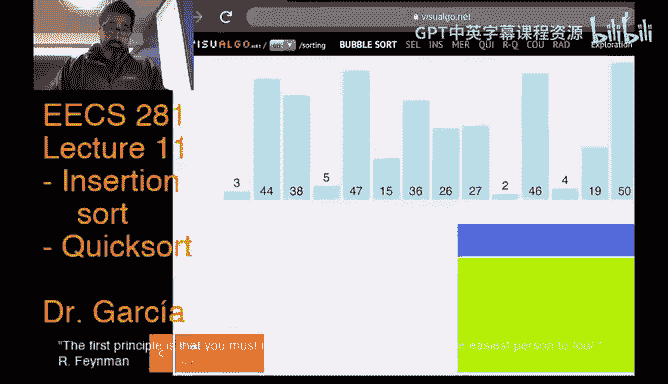
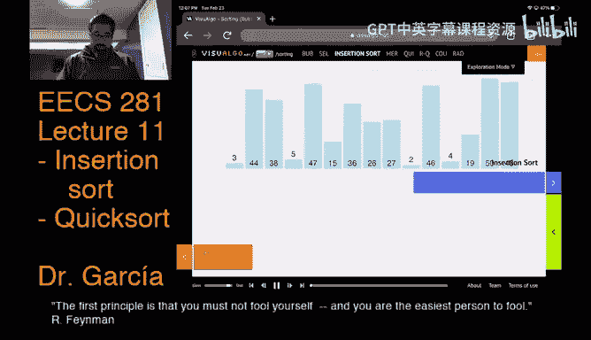
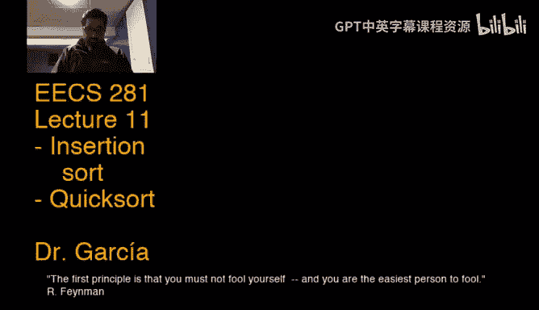

# 数据结构与算法：第11讲：快速排序，包括平均情况分析 🚀



在本节课中，我们将学习快速排序算法，这是一种高效的排序方法。我们将从回顾插入排序的改进开始，然后深入探讨快速排序的原理、实现细节，特别是其分区过程。最后，我们将分析快速排序的时间复杂度，包括其平均情况下的表现。



---

## 回顾：插入排序的改进 🔧

上一节我们介绍了基础的插入排序算法。本节中，我们来看看如何通过一些优化来提升其性能。

以下是插入排序的几个关键改进点：

1.  **移动代替交换**：在将元素插入到已排序部分时，使用移动操作代替交换操作。交换通常需要三次赋值（使用临时变量），而移动只需一次赋值，从而减少了操作次数。
    ```cpp
    // 交换操作示例（三次赋值）
    void swap(int &a, int &b) {
        int temp = a;
        a = b;
        b = temp;
    }
    // 移动操作（一次赋值）
    a[j] = a[j-1];
    ```

2.  **将内层循环改为while循环**：这可以使代码逻辑更清晰，便于后续优化。循环条件直接检查当前元素是否小于其左侧元素。

3.  **使用哨兵值**：首先找出数组中的最小值，并将其放在数组首位。这个最小值作为“哨兵”，可以确保内层循环在比较时不会越界，从而省去一个边界检查条件。

这些改进使得插入排序在处理小规模或接近有序的数据时非常高效，但其最坏情况和平均情况时间复杂度仍然是 **O(n²)**。

---

## 计数排序简介 📊

在讨论更高效的排序算法之前，我们先简要了解一种特殊的线性时间排序算法——计数排序。

计数排序适用于**键值范围有限且较小**的情况。它的基本思想是：
1.  **第一遍**：统计每个唯一键值出现的频率。
2.  **第二遍**：根据频率计算每个键值在输出数组中的起始偏移量。
3.  **第三遍**：根据偏移量将元素复制到输出数组的正确位置。

由于其需要额外的数组来存储频率和偏移量，空间复杂度为 **O(n + k)**，其中 k 是唯一键值的数量。当 k 远小于 n 时，这可以近似看作线性空间。

> **注意**：计数排序是稳定的排序算法，因为它按照输入顺序处理元素，保持了相等元素的相对位置。

---

## 快速排序：分而治之的典范 ⚡



现在，我们进入本节课的核心——快速排序。这是一种基于“分治法”的高效排序算法。

### 算法框架

快速排序的递归框架非常简洁：
1.  **基准情况**：如果当前要排序的数组段长度小于等于1，则直接返回（已排序）。
2.  **归纳步骤**：
    a.  **分区**：从当前数组段中选取一个“枢轴”元素，然后重新排列数组段，使得所有小于枢轴的元素都在其左侧，所有大于枢轴的元素都在其右侧。
    b.  **递归**：对枢轴左侧和右侧的子数组段分别递归调用快速排序。

其伪代码如下：
```cpp
void quicksort(vector<int>& A, int left, int right) {
    if (left + 1 >= right) return; // 基准情况
    int pivot = partition(A, left, right); // 分区，返回枢轴位置
    quicksort(A, left, pivot);   // 递归排序左半部分
    quicksort(A, pivot + 1, right); // 递归排序右半部分
}
```

### 分区函数详解

分区是快速排序的关键。一个简单的分区策略是选择当前子数组的最后一个元素作为枢轴。

以下是分区函数的一种实现思路：
1.  选择最右侧元素 `A[right-1]` 作为枢轴值。
2.  初始化两个指针 `i`（从左向右扫描）和 `j`（从右向左扫描）。
3.  移动 `i`，直到找到第一个**大于等于**枢轴的元素。
4.  移动 `j`，直到找到第一个**小于**枢轴的元素。
5.  如果 `i` 和 `j` 尚未交叉，则交换 `A[i]` 和 `A[j]`，然后重复步骤3-4。
6.  当 `i` 和 `j` 交叉时，将枢轴元素交换到位置 `i`，此时 `i` 就是枢轴的最终位置。

这个分区过程的时间复杂度是 **O(n)**，因为它只对数组进行了一次线性扫描。

### 枢轴选择策略

枢轴的选择直接影响快速排序的效率：
*   **理想情况**：每次都能选中中位数，这样每次都能将数组均匀分成两半，递归深度为 **O(log n)**，总时间复杂度为 **O(n log n)**。
*   **最坏情况**：每次选择的枢轴都是当前子数组的最小或最大值，导致分区极度不平衡（一边有 n-1 个元素，另一边为0）。这将导致递归深度为 **O(n)**，总时间复杂度退化为 **O(n²)**。
*   **平均情况**：在随机输入数据下，即使使用简单的枢轴选择（如随机选择或固定选择首/尾元素），快速排序的平均时间复杂度仍然是 **O(n log n)**。这是因为糟糕的分区发生的概率很低。

> **关键点**：虽然快速排序的最坏情况是 O(n²)，但在实际应用中，由于其平均性能优异且对缓存友好，它仍然是实践中最快的通用排序算法之一。C++标准库中的 `std::sort` 通常就基于快速排序的变体。

---

## 总结 📝

本节课中我们一起学习了：
1.  **插入排序的优化**：通过移动代替交换、使用while循环和哨兵值来提升性能，使其在小规模或部分有序数据上表现更佳。
2.  **计数排序**：一种在键值范围有限时的线性时间排序算法，但需要额外的空间。
3.  **快速排序的核心思想**：基于分治法，通过分区操作将数组分为小于枢轴和大于枢轴的两部分，然后递归排序。
4.  **分区过程与枢轴选择**：详细了解了分区函数的实现，并讨论了枢轴选择对算法性能（最坏情况 O(n²) 与平均情况 O(n log n)）的关键影响。

快速排序因其在实践中的高效性而广受欢迎。下节课我们将完成对快速排序的讨论，并开始学习另一种高效的排序算法——归并排序。