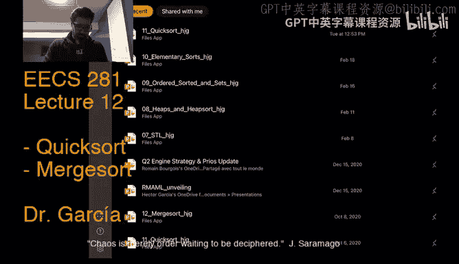
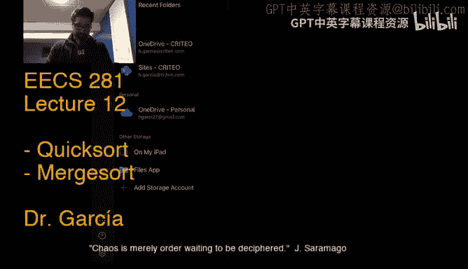
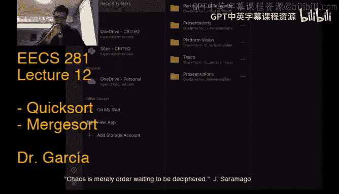
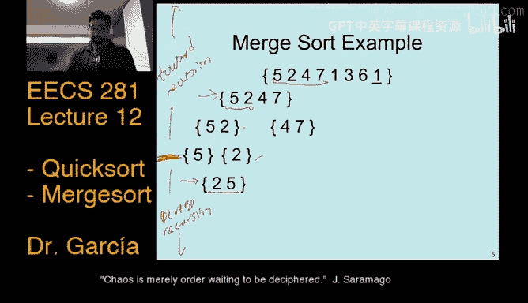

# 密歇根大学《数据结构和算法｜eecs281 Data Structures and Algorithms Winter 2021》中英字幕 - P11：-12-EECS 281_ W21 Lecture 12 - Mergesort.zh_en - GPT中英字幕课程资源 - BV1snk5BWEfc

利し。All right， we're coming up。Start time。嗯。Let's see， it tells me there's about a couple of people。

Current reviewing。Give me a thumbs up on the video and audio， that'd be great。

While I pick some water。🎼Yeah。🎼Yeah。行。このほ。Before。い。Great， video on audio sound good， all right。B。

A couple of minutes。And we'll get started。因6。可そです。しさ？And yeah， no I figured I I。

U try something different than u。上文 base。I am for some reason obsessed with this Jerusalemma song。

Forget who it is。It's the song that was playing just before it this one， it's from South Africa。也稣只有。

第个。He。All right， maybe one more minute moderator is here， thank you。おち。啊。😮，All right。

 I think we should get started， let's stop doing music， okay， we stop。Google， and Google is not that。

Let's okay， Google。Stop all right， there we go sometimes。Misbehaves。Oh。But not more than my children。

 So I appreciate that Google。嗯。All right， so last time。

We basically stopped at discussing the analysis for。Quick sort。

Well we kind of finish off the lecture。For elementary sorts。

 looking into details of insertion sort and county sort， then hopped into Quick sort。

 we kind of discussed most of it even down to parts of the analysis， we'll go over it again today。

And then discuss me sort and then we be done， will you all be done with sorts。

 will be done with all sorts of sorts。Discuss a summary of all that。

 All this will be in the midterm exam， which I will point out is March 10th。So just under two weeks。

 is that right，Um， so I thought I would start with the exampleum that we skipped last time for the partition function just a way of。

Review of what the partition function was meant to do and how it was implemented in the slides。

 So if you go back in the slides， this is the original。

Implementation that we had where if you recall， we were picking the rightmost elements in the range that we're looking to partition as the pivot。

Hey， that's what happens in line two， you recall， so let's look at an example of what it would look like。

So with this pick the last strategy， if you will。Six right here， this becomes your pivot。

Okay and if you go back， then we'll have left pointer that will start here， this will be left。

 and then right will actually start right here because of the minus minus in that line too of a code if you go back。

So that's where everything roughly starts and then what will happen is that we'll have the first while loop that will move the left pointer first。

And it will move it as long as it detects that the current element that you're looking at is less than the value add the pivot。

 which is now6， so it would check that two is less than6， which it is。

 which means that it would move left。Once， okay， then it would check 9 against6。

 determine that9 is greater than and therefore should be to the right of six。

 so the increasing of the pointer would stop。Okay， now again， go back to the code。

 we would go into the second while loop。Which the purpose is to move the right pointer until it finds a candidate that it can swap。

With the value that sits at the left pointer。So it would say that eight is greater than six。

 so it would move the pointer because would assume it would be assuming that。

 you know8 should be on the right to the right of six。We move it right here okay。

 notice that I haven't moved the pivot right if you recall from the code and we're going to see that happens actually at the end。

 so the pivot stays in place。We're only moving the pointers the left and right pointers Okay so move it once C5 determine that5 is less than6。

 so therefore this is a candidate to swap with the left pointer because it's less than6 and it should be on the left so now I've had I've found candidates for swapping and the next thing that happens in the code if you recall is it actually goes ahead and with the swap right it would swap9 and5 so then you would have2。

5，3，47，9。8， six， so the six， that's supposed to be a six。Weer6。Six still in place。

Okay now rinse repeat， so now we're back to moving the left pointer to get a candidate to swap with。

 so the left pointer was at nine which would now be five so it would then be moved to so right here。

 that's where left is right now。And then it we would。Try three。Three is less。Then six。

 so indeed we would continue moving it。Four is less than six， so continue moving it。Get to7。

Determine that that is greater than6， yeah。So that's a candidate to swap。Okay，All right。

 so I stop moving my left pointer， if you recall， the right pointer should be right here。

From the previous step。And then I determine， hey， nine is greater than six。

 so I should move the pointer。To move the pointer to the left because we're coming from the right。

So it would move here and then at that point， if you check the code。

 next thing is it's going to break right because we've reached a point where' right and left cross each other。

Okay。嗯。And so at that point， left is here at seven。

 right is actually also here at seven and then we would。

Basically break from the Y loop and the last thing that happens is the actual swap of wherever left is at at the moment。

With the pivot。It's the next thing that happens to come up with two， five。3，4，6，9，8，7。 and boom。

We have our partition。This is less than six， and this section is greater than six。Okay。

 so that's how it would work。 Remember this last swap that we did。

 I'm going to make it a different color。 This last swap is a swap that happens。Outside of the Y loop。

 So I'll go back to the code second， right， So that was this swap right here idea the end。Yeahep。酷。

All right， so this is the example for the partition code that we saw last time。嗯。😊。

There are other ways to implement the partition function in which case the example might be worked out a bit differently right it kind of the reason why we chose the simple pivot strategies because it's easier to explain in the lecture。

 but what we're going to continue to discuss today are additional better pivot strategies。Now。

 an interesting thing about this pivot strategy， while it's rather simple。嗯。

What could you think is a major issue given what the analysis ofquiser that we discussed last time and how pivotal the pivot strategy is to the performance？

What would be the issue with this picked the last， so it's it's simple， it's nice。

 but what would be the main issue with this picked last strategy， okay？

Can any identify what it would like what would be the impact to the Quickword algorithm？Um。

 under this particular strategy， if we consider certain kinds of input to the algorithm。You know。

You know， maybe take a minute， see if。Anybody point out？A major issue with this pivot strategy。嗯。

Where basically would behave。Very， very badly。If you're given a specific type of input。

What if the input is almost sort， it would take longer to pick yes， correct？It would be in fact。

 okay， yes， if it's already sorted， yes， so with this particular pivot strategy， while in general。

 since we're assuming that we would get a randomly distributed input array in general it should behave in N log N time。

😡，If the input is already sorted。😡，Okay。😊，Then it would actually be one of the worst case situations that we pathological situations that we talked about in the last lecture that would actually cause Quickor to behave in end square time。

And that would be the main issue with this particular strategy， So even though it's simple okay。

 and in general， it should work fine， it does have the major drawback of like。

 well if the input is already sorted， then it's going to behave n squared time， right？

So if you recall， it comes back to this analysis that we had last time， right。

 if we have this particular pivot strategy。 and the input。Aray was already sorted。

 then you basically fall。Into this case。Okay， and then get that N of event square time just back。

Okay。😊，嗯。All right， so let's say that。We don't， we're not assuming this kind of bad input where it's already sorted bad relative to you know。

 the quick sort of implementation that we're talking about。嗯。How about if I asked you。

 what is the worst pivot strategy that you could， which is it's kind of a related question like without thinking about the input that you could get to your QuickerRT algorithm。

 what's the worst pivot strategy that you could think of？😡，嗯。For the pivot。

OkayIt's a very related questions，s kind of similar question。 So I'll just answer it， right。

 So if your pivot strategy were to find a max of the range every time。

That would mean that you would always get the worst case situation for the unbalanced partitioning that would make。

It actually be worse than that because you'd have to spend like linear time to find a max。

 so it'd be actually worse than and squared。But just for you to think about and muse like what are。

Good and bad of pivot strategies。All right， but the。Why would be considered the best case situation。

 which is easier to analyze， but is that。Basically， every time that our partitioning function。

It splits the range half and half along the pivot， half the elements are set to the left。

 half of the M1 sit to the right， that would be the best situation。

 it is analogous to saying that oh， every time it's the median we're able to pick our pivot as the median and so that's the best case。

But what happens most of the time kind of is the average case。

 which we won't go into that analysis of what comes about。

You can by thinking about the best case and then you know thinking by you know law of average numbers and all that stuff。

 then you can see how runtime should be asymptotically similar。

 but I would encourage you to look up the average case analysis for Quick sortt quite interesting not terribly hard。

 but you'll have to go back to some 203 material that we won't discuss here all right。So that's。

Just a review of parts of what we discussed last time。How about in terms of memory。

 how will QuickSo do in terms of memory consumption？Well， we have already seen that it's in place。

 meaning any updates that I do are to the input array， I don't have to declare a separate array。😡。

To store my output or to temporarily store something。While the algorithm executes， no。

 everything happens in the same input array， which is a good thing， it's in place。

No no need for extra memory in that regard， but it does incur because it's a recursive algorithm。

And there are some recursive calls that you cannot make tail recursive。

You will incur some stack frame memory usage。Okay。😊，嗯。

So and just to for those who have not taken 280， so anybody that's taken 280 is very familiar with tail recursion。

 so on and so forth， we might have also touched。A bit on it when we were discussing solving recurrence relations。

 but just in case by way of review， let me actually show you by what we mean that the one of the recursive calls cannot be tail recursive right if you recall the advantage of tail recursion is that every stack frame can just forget about its current state and move on to the next stack frame for the next recursive call and so。

That's usually associated with recursive calls that happen at the very end of the closing curly brace。

UmIn a function。Okay， so it's the very last thing that you do。In your。Function。

Then that recursive call can be made tell recursive okay because it doesn't have to remember anything from each of the recursive calls that it goes into okay so it can reuse the stack frame every time so that last recursive call on line6。

 we can totally optimize to make tell recursive， but that's not true with the recursive call on line5。

Okay。😊，Because it's still on every recursive call in line five。

 it still needs to come back to that recursive call to then go into the recursive call in line six。

 then it kind of has to remember stuff so it cannot be made tail recursive and there's no way around this。

In in this quick sort algorithm， there's no way to optimize this side of things， right？I mean。

 you would think like， oh， well， then let's just write up。嗯。诶呀。Iterative solution to quickword。

 you know。Good luck doing that。All right， so then even though we cannot， you know。

 get around the fact that there will be a non tail recursive call。We can still do some optimizations。

 so that's， oops， let me go back to here。And that is， all right， well。

 if I'm going to have to incur that nontail recursor call。

 I might as well do it for the section of the range that is smaller。That way， if it's smaller。

 then it is assumed we won't have to do any further recursive calls。

You know that's a bit of an optimization， right， so that's what we do here line five if。

The left side of the pivot is smaller。Then my first recursive call is going to be on that left hand side。

Okay， so that I come back quickly。And then the larger I can take care of down here， okay？

And then otherwise， I do the。Reverse。嗯。Co。So that's it's a minor optimization。

 but it's good to discuss。嗯。Worst memory requirement it would be that in terms of stack frames。

 could be log end time， right？Because that's， you know。Potentially the largest。诶。

The largest number of recursive calls that it could do on one side of the array could be in the order of log n。

All right。Let me just debrase that， that's what I'm meant to say。All right。

 so quickword pros and cons to summarize we have on average is an N login algorithm。Okay。

 fairly efficient one of it， one of the big deals here is that it it does。Perform fairly well。

You know， that regards of the input。It has a very tight inner loop。Okay， just。

There's not much further optimization that can be done。

 I guess after our last optimization of the ordering of recursive calls。对。

It has efficient memory usage， but of course， there is a disadvantage right here that it can use a bit of。

Stack frames there， okay？mIt is not stable and it's actually very， very， very hard to make it stable。

Okay。😊，嗯。And then if you go back to the code， I would say it's not terribly hard to implement。

 there's not a lot of code， but there are a lot of like you know pointer movement that you have to get exactly right in say the partition function。

 so it can be a source of box。😡，Make sure to not go if you were to implement your own quick algorithm。

 don't go out of bounds in the partition function and such， because then you get sex faults。

All right， so let's go to picking a good。Partition strategy。Okay。😊，Well。

 the first thing that we discussed last time was that any partition strategy that we have needs to be all once constantantine right we cannot invest too much time。

嗯。To compute。The pivot。Because we're already going to incur linear time to actually do the partition。

Okay。So we don't want our pivot selection to take too long， otherwise it just defeats a purpose。诶。

If we were to rely on any single choice， right， like what we did with the very simplest one。

 the example that we just went over， which was like just pick the rightmost element every time。嗯。

You could have a particular situation in which the algorithm could be reverse engineered and then like。

 oh， I find a situation in which the input can make it blow up in terms of runtime。

Like we said for having a already sorted input array again with that very simple pivot strategy。Okay。

It is too expensive to actually compute whatever the best one is， which is the median， okay？

So rather than compute the Midn， what we can do is sample it。

And there we're going to discuss at least two ways to do this。Okay。

 you can pick three elements and take their medians。And。We can also， and I'll show you this in a bit。

 You can also pick the。Left。Right and the mid and pick the median of those。

Of the current range and then pick the median of those three elements。

 so we'll go over that in a bit。Okay and this has been shown there is no there's no。You know。

Theoretical work in terms of asymptotics that will show this。

 but there is a lot of practical research and analysis showing that just this simple approach does improve performance right and of course。

 it' performance in terms of practical usage not theoretical asymptotics okay and in general sampling is a very powerful technique In fact。

 anything that we。Anything that we term a randomized algorithm like Quick sort。

What they usually leverage is sampling rather than just a randomization of things， okay？

And so quick start is one of those examples， this is the sampling of the median。

That we are just describing is constant time so you don't have to spend too much work to do this well in whatever the range is that I'm looking at。

 I pick the first。Pig the mid。And pick the last element。Okay or the rightmost element。Right。😊。

And then whatever values are in there。😡，I'm going to pick the value that's mid。UBetween these three。

 it just so happens that 14 is the mid， but it doesn't is is the mid between 17 and two。But。

You knowIt doesn't the value that's in here。Need not actually have to be the mid between the three。

 it just happened to be in this example， okay？And whatever that mid is。

 that's what I'm going to pick hazard our pivot， okay， so we would select。嗯。14， has our pivot Valley。

So that's the one strategy， then there's a more randomized sampling strategy。

 this would actually need a random number generator。And it would be。Just find the median。

Of three random elements in the section in the section of the array that I'm looking at right now。

 right， so let's say that we have a random number generator and it comes up with the index to value 1。

 And that's what I would pick here。 and then do another call through the random number generator。

 It gives me。 well， let's say0，1，2，3，4。It gives me six， so that's what I pick as my。Second number。嗯。

And then finally， I do another random number generator call。

 tells me to pick whatever that index is at 28 and I pick that。Okay。

 so those are my three sampling elements， and I picked the medium between those three。

Which in this case would be 28。And actually， you can also say， well， instead of three。

 I would pick something like five。Okay， as long as it's a constant number of elements that you're picking each time。

 then this should work， but of course， the utility of， you know。

 picking amongst a larger sample of the array kind of I think after five it's not it's not much useful if I recall the research on this so I think。

The optimal number of random numbers to pick is between three and five。Okay。😊，客。

So let me stop here for a quick browse of the chat。嗯。😊，Right， I think we're good。

With the chat questions。嗯。All right， so what other improvements could we make in like if we were implementing our own sorting algorithm。

 okay？嗯。Especially with algorithms that are divide and conquer。Okay。😊，嗯。

You don't really want to spend the recursive calls on a raises that are。particularly small， right。

 and this is generally， you know， again， it depends on the architecture what we you know what we would say is small。

 but generally would say between you know 16 or 32 okay。

Main anything that's smaller than a word size in the architecture， we would say。

You don't want to do additional recursive calls just to sort， you know。Two or three elements， right。

 really a small number。So the idea is， and we've discussed this before in terms of intro sort it's like。

 well， we bail out of Quick sort once the range that we're considering is you know less than or equal to some constant which again would be 16 or 32 and from then on we would instead pass it to something like insertion sort。

 which we saw and in earlier lectures actually performs quite well。

When it's a small array and furthermore， when the input is almost sorted right。

 because we can' assume that I mean， there's no guarantee that the small array is going to be sorted right but you could see how we could roughly be almost sorted by the time right so if we spent so much time doing Quickert on this larger portion of the array。

😡，Right then。You could see how things in the smaller chunk。Can be close to sorted at that point。ok嗯。

By the way， a good interesting exercise you know， if you were fond of 203。

Is to go back to our slide where we had kind of the base case and the intuitive step。

Which if you recall the intuitive step。啊。And not intuitive stuff。

 inductive stuff was what we're calling the partition， the partitioning。Go back and， you know。

 write out proof。Of why。This inductive step works such that the output we can assure is sorted。

So just prove that using that inductive stuff at the end， we will get a sorted output。

That would be an interesting exercise。But of course， we won't test that in the exam。I know。Okay。

 you're saying we。If you miss the 203。Material， which I expect is not many of you。嗯。I I didn。

Oh I'm not going to comment on I have my issues with our two and three material， but anyway。Oh。

 keep going。All right。So summary on QuickSo is that it is considered on average。

 an n log n algorithm again。We have the worst case situation。

But it has to be with kind of a pathological approach to picking the pivot。Which we assume。

It's not going to be what we use in a standard Quick sort algorithm right we discussed it here for teaching purposes。

 but any implementation that is meant to be used by the world any implementation of QuickSo would not have such a simple pivot strategy that you can reverse engineer。

It would at least contain a form of sampling。ItIn practice， it would behave in N log N。

 have n log N performance， so it is quite an efficient algorithm。Okay。😊，呃。

So we've discussed other ways of tuning， which is to pick a different algorithm when the array is small enough。

 so it would look something like， oops， let me just it would look something like this right so this would be something like intro sort。

It would be like if and is small enough。Okay， didn use insertion sort。Else。

 if Quicksort has a recursion depth that is large， then instead you would use heap sort。

 because we said quick sort。Does have， we say there's no way to get around the fact that Quickert is going to use up log in stack frames。

Okay。😊，We discussed a small optimization， but we cannot claim that you know。

But that's going to work out always。So we have to assume that Quickser will spend O log n。

Stack frame memory。If we。Have some metric that tells us that this is going to be quite a large number。

Then we would fall back to something like HeapS， which is not a recursive。

 if you recall the implementation of HeapS， it was not a recursive implementation。

 so there's no usage。😡，Of the sacra。So that's where we would pick Hesword over quickword okay。

 if we knew that recursion depth。Would be large now。Notice that this is not going to happen often。

 I mean， it is。O log in， which is not a very large number。It goes really， really slowly。

As compared to N。嗯。So most of the times。You don't really fall into this situation。

 it's either n small when you go to insertion sort or quick sort。Okay。嗯。All right， so。

Let's go back to our summary of what we've discussed so far in terms of sorting algorithms before we jump into merge sort。

诶。We've discussed bubble sort， insertion sorts， selection sort， those are all elementary sorts。

 worst case， ON squared time。Heap sort， it is one of the efficient。

Sorting algorithm standing at N log N。Worst case and average case as well。It is non recursive。

 which is a good thing。It is in place， which is also a good thing。m。

 but Quicksort does perform better。Then heapert in general。

 even though asymptotics are the same for Quick sort。It depends on the pivot selection， but again。

 we're assuming a decent pivot selection strategy。OrIn terms of memory。You know we we just said that。

 you know， Heap sort is ideal because it's， you know， in place， no extra memory。

 but quickword our issue is。Would be stack frames。But to be honest。

 especially nowadays with the amount of memory in computers。Even small computers。

It's not really a big deal。All right。But it is a big deal to know that， let me go back。

 it is a big deal to know that for the exam， I'm saying in practice it's not a big deal。

 but big deal to know that， you know， that there is a stack frame cost too quick or know that for the exam。

All right。How about stability bubble sort and insertion sort are both stable？If you recall。

 we mentioned the fact that selection sort is not stable and we discussed in in lecture go back and see why selection sort is not。

 there was even a question about it that we covered。

 we also discussed that heapAP sort is not stable okay basically by because of the fixed ups and fixed downs that would need to be done。

And those can end up。嗯。Swing the places of equal keys， right？And then in Quickword。

 we also stated there is no guarantee that it's going to be stable， in fact。

 it's very hard to make stable。Stable quicker algorithm。

And the reason why is because of that partition function， right。

 If you wanted to make quick sort stable， then what you'd have to update would be the partition function to ensure that。

Stability is maintained。All right， so I think that covers Moda we just covered this and that's basically our summary。

 some interesting questions for Se study， encourage you to look at these for the exam， you know。

 illustrate worst case input for Quickstart， we kind of did that in this lecture already。

 but you know do it on your own， think of other particular situations in which you would run into this case。

Make sure to explain why the best case runtime for QuiISU is not linear。

It basically goes back to this slide where we had the analysis。

 we were considering the best case and we saw that it was still an end log end time。嗯。

So think about pivot selection strategies and how that actually impacts， discuss that quite a bit。

 but there's still more to just self study on this so make sure to read up on it okay。All right。

 so I'll stop it there and then move to Mer sort and that'll be the end of sorts。

 which I'm sure you're all happy about because you're probably tired of sorts。At this point。sorts。

Not this one。There was。Can't open what？Oh，'s let me， let me out。Come back in a second。Back。行。

I know I opened this file before， so I'm not sure what。Yess。But I'll just。Tell you what。

 I'll just open the one that we can。

Okay， maybe this one will。Nope，てよ。Sad。

All right， bear with me， excuse me。Sorry， it's not as easy as opening it because I want I'm I'm opening putting it in my iPad so I can write stuff。

 And so there's this。Need to upload to a specific place。In the cloud。

不。Right。Let me make sure everything's。All right， I think we're good now。 Sorry about that。

 my apologies。Alright。😊，嗯。Mercer。All right， it's another one of our efficient algorithms so。

And we'll end。Our discussion on sorts with this。We've actually already talked about I， you know I。

In previous lectures， I've every time I've talked about。

And asing algorithm room that would require additional memory， right？I already mentioned that A。

 it's Merer， okay？So here it is， let's look at how MerC sort works。嗯。It's actually。

It is very different from Quickword， but it is similar in that there's also a recursive algorithm。

 okay？Now， as compared to Quickert， it is a recursive algorithm that's much easier to implement iteratively which will go over such an implementation later on in the slides okay。

So quickword， if you recall。It was a divine and conquer algorithm right so it was with the partition function kind of deciding what sections to divide and then made recursive calls on each of those sections。

 right？Now merge sort is what we would call a combine and conquer algorithm okay mainly what it does it's going to combine two ordered files or two ordered arrays to make one larger order one。

And if that sounds familiar， is' because we've actually discussed。

Similar code before when we were talking about union of ordered sets， okay。

 so if you think of the two arrays that we're looking to merge。

 we're assuming that they're both sorted so they're definitely ordered and what merge sort will do。

Or is mainly based on is on taking those two smaller arrays。

 im them into a larger already sorted array， okay， so itlies that's what merge sort relies on that。

So。This is kind of pseudocode for both quick sort and Mer sort so you can compare okay， notice that。

 you know， Quick sort is going to do work。For dividing。This is the work。And then doing recursion。

Okay。😊，Whereas Mer sort is going to recurse。And then do the work。Okay， so in that sense。

 quick sort is。Known as a top to bottom。Okay， or top down approach？Whereas ME sort。

 as you're going to see in a bit， is more of a bottom up approach right because it's actually not going to do any work。

Um， until it's the gun all the way down in terms of the recursion。

And then as it comes back up from the recursion， that's when it's going to be doing the work。

 which is basically just merging。Okay， that's actually quite interesting in parts of it。

You think about it is。Kind of auto magical。嗯。But again， this is another interesting exercise is。

 you know， given the base cases。mOf me sort， you know， prove that the inductive step。

 which is to merge the two already sorted。诶。Sections of the array。

You do arrive at a fully sorted output array。All right。

 so the best way to look at Mer sort is through an example。

 the biggest issue in terms of conceptualizing Merer is the fact that it's very you know recursion heavy。

So let's look at how it would work。Okay， so here is an input array。Okay。😊。

And if you go back to the pseudo code， remember， the first thing that happens is I'm going to recurse。

On。One half of the array。Okay，And that half right now is this section right here。Okay。

 so that's one recursive call， remember， then on the next recursive call， it will again。

 the first thing that's going to do is go on the left hand side。

Left half of the current section of the array， right which in this case would be right here。

OkayAnd the base case would be like， oh。There's mainly no left hand side anymore， right。

 because it's just the left hand side is just one element。Okay。😊，嗯。That could be the base case。m。

There are base cases in which it would stop here and say like。Oh， I just。

 this is only two side two elements in this current range。

 So all I need to figure out is whether I need to swap。 That's it。 And you'd be done。

 But conceptually speaking， it really even needs to。Even if it has two elements。It。

Wouldood needs to split down to a single element。系。

At least for the type of implementation that we're discussing here in lecture。 But again。

 you can have an implementation that just only splits down to。

Size two range and decide whether to swap or not， all right。

 but now here we're splitting all the way down to a single element and now notice that this is going to be kind of the line。

系了。Where you know。There's going to be forward。I'm going to call it forward。Recursion。On this half。

And then I'm going to call this reverse。okay， it's not a very proper term。I apologize。

 it's just my angle for writing on this， It's terrible。Okay。

 so the lower half of this slide is going to be what's going to happen as we come back from the recursion calls。

Okay。😊，That I incurred on the upper half of the slide right as I was coming down to the different sections of the array。

 All right， so at this point， notice that this would be done with the first recursive call and at that point it would come back to then have the second recursive call at that level。

Which would again just see like one item on the right half of that section。呃。

And then at that point it would be done and so it would now do the work Now it would fall to the mergech part of that pseudo code that you just saw and well。

 merging，Two single element。Arays or list or whatever you want to call them， it's real easy right。

 I just merged them together boom， I arrived at this mech list。Again。

 this is the work that would happen coming back from the recursion。

 but now notice that if you were to follow the proper ordering of the recursion。

 what would happen next is that I'd be done with recursive call here because it would have，By here。

 I mean right here because it would have come back and it would have come back all the way up to this recursive call right here to finish up the right hand side of that array right because if you see we've finished off the right hand side here and here so it would come back all the way up here right and then R repeat。

 we would split into the two single element arrays。

 then our merge function would kick in to merge those two together。

Okay， and now that means that I would be done at this level up here。

 now I'm completely done at this level， so therefore I would。Call the mergech function。

 I'd be done with the recursive calls at that level。

 So now I would call my merge functions to do the work and merge the two smaller。Aray sections， okay？

And now at that point， notice that I'd be done with the left hand side only at this level， okay。

 so now I would go into my recursive call for the right hand side。At the top most top level。嗯。And。

Now we go on the left hand side right there， which would be one and three。Okay。

 notice that I I wouldn't go until the left hand side of this section yet。

 I would split down to one and three。Then I would be done at that level so I。

Merge one and three into a single array， then I'd be done。

With the right sorry with the left hand side at this level， so it should come back。

To that recursive call， then do the right hand side。Of that section， which goes to six and one。

Mmerse them together， and then I'd be done on either side at that level。

Which means that I would merge。诶。😊，And then now I've done at the topmost level right here。

 I'm done with。Left hand side and the right hand side。

 which means that I can go ahead and merge those two。Okay， and at that point。How would be done。Yeah。

So you might be thinking right now， I haven't talked about this underlined one right here。

 and if I think I might have seen a question about that on the。😡，On the chat。

This is to keep track of the fact that if I have repeated keys， right， so one is repeated。

Where things would fall with the repeated key and basically this shows that the order is preserved right so if you recall we mentioned that Merer is a stable algorithm。

 which in fact it is。So。We're not going to prove that it is we're going to。It's approved by example。

 which is not a real proof， but you can see how in general this should work if you have however many repeat keys。

 it's not going to swap the ordering keys of the repeat keys as they came in the input。Alright， so。

Remember， whenever we were talking about sorting what we have or how we've been evaluating our sorting algorithms。

嗯。We talked about the fact that there are things that are called external sorts。

Which if you don't recall， it was。When we couldn't fit everything in memory。诶。So think， you know。

Everything that we want to sort。Can be fit in memory， so it might be in this somewhere， okay？

And so you need to access the elements or the items sequentially or in largeged blockss。嗯。

Mer sort is。Well， first off， it is considered an external sort。

And it's very well suited to be an external sort。Okay， I mean。

 you could use MERS sort on things that it。You know。嗯。That you can fit in memory。But， you know。

 why would you when you have quicker？Now， if。Stability is particularly important。

 then you can't really rely on Quicksort at all， so you would have to fall back to Mer sort because if you remember we just said Heap sort is also not stable。

 so your only choice if stability is that important。Which it usually is not。

 but if there's a reason why it is， stability is that important。

Then all we have in terms of efficient sort is me sort。Okay。😊，嗯。

Memory efficiency is another thing that we've been talking about is' particularly important。

Of course it is， it's memory。We said quick， he sort are examples of vision sorts that are in place。

Mse sort is not in place。ok。😊，So for Mer short， you need extra memory。Okay。😊，嗯。

Basically to store the output of merging the two。sorthored lists or arrays that you're looking to emerge。

哎。嗯。Probably the question is， can you implement a Merer that is in place？Very， very hard。In fact。

 I don't I've heard that there are such implementations， I haven't really looked at them。

 so in my mind they don't really exist， but I've heard that there are。But it， you know。In fact。

 SDL has a stable sort。呃， function。Wwhichch behind the scene is this me sort and I don't recall it saying that it's in place。

 right it does use the extra memoryrm that it meet。Alright。

 so we've been talking about this merge function， so let's look at actual code for what it is it's syntax and or at least logic that you should be familiar with because we discussed it in the context of ordered sets it's very。

 very similar logic fact the same logic it's just going to be different syntax。

Just because we've been dealing with arrays rather than iterators so far in all the code that we have for sorting。

All right， so in terms of syntax， let's discuss this syntactic sugar， which is a terernary operator。

 you you might be familiar with it or maybe you're not。

 it's basically a shorthand notation for these eight lines of code that we have here。

So instead of having to write all those eight lines of code。

 we can have this single inline statement that accomplishes the same thing。

 and it's basically an if statement。Where you have the conditional right here and then you're asking。

 and yes， this is not pseudo， this is actual you' were using the question mark as an operator。In C++。

 So this means if this is true， then you do this statement， if it's not。

 you do this part of the statement， that's it， everything's in line。So that's what it does。对。

So let's。Let's look at the actual。Oh， that's what that's a conditional， that's the do with true。

 that's what I was alluding to， and then do with false。系系て。And so here is。

And notice there's two statements that are。Happening inside of this if。Right。

You're making the assignment of whatever the value is at。You know。

 at a and then incrementing I notice that here the incrementing。Is happening right here。

And then the assignment， it is by way of how this operator works。So basically。

 what this means is I'm going to set the value of C at K to either be whatever is at a。呃I。

Or whatever's that beat J。Okay， and then in each case， just increment either I or J。

All right so let's look at how that is used Basically we're using that turnernary operator to replicate the logic that we had for the union of order sets in which we were using iterators。

 but now this is all much simpler using arrays okay so notice that this merge AB function takes。

The output array as a parameter。Okay， and it is assuming that a C is already large enough to fit all the elements that are in A and all the elements that are in B。

Okay， so it's already making that assumption。And then this logic right here is again the same。嗯。

Basically， the current element that I should place in C is whatever is currently at A。

 that's what I would do， oops， not here。Sorry。This case right here。Well。

This case right here is if I don't have any more elements to look at in array A。

 which is why this is checking whether I is equal to the size of a if that's the case。

Then from then on， as I loop， it's going to come to line six here and it's just going to place the race the rest of the elements from B。

Okay， into C， right， because I'm done， this means I'm done with a， right so this。Done。With。

A conversely， this right here would me like。Os。Done。With。B， right， and if I'm done with B。

 then I would just place the race of the element， the rest of the elements from a。Otherwise。

 then we have to make a choice as to what to place in C at that spot and the choice is driven it's in A or B。

 so if whatever is at A is currently smaller， then what I'm looking at in B， then I'll place that。

 otherwise I place， whatever is in B。😡，Okay， and then move my pointers accordingly。喂。All right。

 so let's look at an example very similar to what we saw for unity order sets， you have a， which is。

This is always a bit confusing because we're using letters everywhere。

 but we have array A and array B， and then we have A D G H and then B D F for B this in the this is the indexing right here that would mean that size a is4 and size B is3 right。

 which is just whatever the sizes of the arrays are all right so what we would do is for。

The first slot in the output array。I would check and notice that our indices right now。

 which is I and J， are just pointing at zero， so it is looking at the first element from A and first element from B and so。

呃。A is less than B， so therefore that's what I would place in C down here。

Then I would at that point notice that。What I would increment。

Is I And notice that J is still a J equals 0 right here。 I I didn't increment J。 I did increment I。

 and then right now we would be comparing D， which is the second element in a against still the first element in B。

 which is B， so that's confusing because the value is the same as the name of the right。

 but you can already see similarities to the example that we saw for unit of ordered sets right。

 it's all basically the same logic and and then。So rinse repeat until we get to the point where we're done with one of the arrays。

 which in this case we would be done with B first because it's a smaller array than A。

 and then that's when it will。Fall back to the first if section or the first。

In the conditional that we had here， sorry right？That's when it would get here。And in that case。

 all we would do， right？Is a I'm just going to place。The next couple of elements。From a into C。

All right， so that's MerRSO by now you should be very familiar with this。In fact。

 there are other versions there is another yet another version of this function that we will discuss in the next few slides。

 which is a version of the function that does not take the output array as a parameter to the function right so internally the function will。

Declare the output array and then swap the input array with the internal output array。

And we'll look at that in the next couple of slides， can we get water？All right。

So now that we know how mech works， then it's easier to look at。Code for the merge short algorithm。

 which is right here on the slide， this is a recursive version of that function。嗯。

This is our base case， right if it has zero or one items again， as I mentioned in the example。

 you could extrapolate this， but you'd have to add more code right if you want to save on another recursion call。

嗯。And like not have to do that recursion call， then you can instead check whether you know。

The size has up to two items in which case I just have a quick quick if to determine whether I need to swap and then return right but we're not doing that here base case is zero or one items。

Then I would find whatever the MIt is， okay？Um， so that's just math and then a recursive call on the left hand side。

 recursive call on the right hand side， and then our call to the merge function。Okay。

 which is what would actually do the work and this is a prototypical combining conquer algorithm。嗯。

Okay， as you can see it's not that many lines of code to write up Mercer。But of course。

 you need the helper merge function。So notice that this line7 is using the mergech function that does not take the output array as one of the parameters。

 so that updated mergerch function would look something like this， right？Baically。

 the difference between the previous version and this one is that in line three。

 we are declaring our own internal array or vector。嗯。Because really。

 all I would need to do is that at the end， I would copy everything that's in that internal vector。

 copy it into the array that I'm giving as input。But everything。

 everything else in terms of the code is exactly the same as before。All right， so advantages。

 especially with you know comparing to Quicksort， it's fast， it's an analog log n algorithm。

 it is stable， okay？And as I mentioned earlier， if you want to try it out。

 you can use SDL stable sort。诶。And its biggest use case and this is where I usually interject some additional material for 403 students。

 it is the algorithm of choice to merge incredibly large amounts of data right if you're talking you know。

Amount of data that's in the terabytes， hundreds of terabytes， sometimes even petabytes。

 and you need to sort all that data。You're basically doing， you're going to use Merer。Okay， because。

If it's very， very useful for when we're doing this external。

External sorts right when all the data sits。In disk。Rather than in memory。

 then you'd rather basically deal with chunks and sort different chunks and then merge whatever chunks of data。

Together， then save them again， rinse repeat。Okay， so it's very good for Pa sorting sorting。

 which is。Basically， if you're going to sort terabytes of data。

 you're likely using something like a Hadoop file system。

YouYou know there's maybe Google's Big query is also another choice。

 but a more open source choice is。I do。😊，If you did sorting in Hadoop。

 which is a distributed cluster of computers。It is using Mer sort okay behind the scenes。

So all these files are sitting on different computers right and you can play with the chunks throughout the algorithm to pick them as you need。

 merge a chunk， save it as a chunk somewhere else， so on and so forth。

And usually I have some extra slides for 403 students with if you're。If you don't know if you're 281。

 there are 403 students in our sections， 403 students are master students that are taking this material。

And usually I go over kind of。You know。How Hadoop sorting works， but I'll leave that。

For the sake of time number one and of course， all you know pandemic stuff。

Makes it hard to have different sets of slides and stuff。Given different sections。はい。诶。Now。

 as I mentioned earlier， we can come up with an iterative version of Mer sort， okay。

 which means that it would be a top down approach， right， if you recall。Mer sort recursive。

Is bottom up because it doesn't really do any work until it splits the array the way excuse me。

 all the way down to single element。A race。嗯。If we come up with an iterative solution。

 it's actually going to be top down。Okay。😊，诶。you know。

 best way to see this is in the code that I'm going to show you。

 because what we're going to do in the iterative version is basically have nested loops for the indices of the sections of the array that I'm looking to merge together。

As opposed to having recursive calls to do the splits of the sections of the array， instead。

 we're going to have indices to determine what those splits are and then。

And then using the indices of those splits pass to call the mech function。Yeah。

It is typically slower than Quick sort， okay， and you can imagine why there's extra additional memory。

 okay？And so there's a lot of time spent copying。嗯。😊，But again， its biggest advantages。

If you need to do an external sort。Where the files sit on this。That's very useful。

So this is bottom up Mer sort。Doing an iterative approach。

It means that what we're doing is you have these nested for loops。

And you would say like oh it nested for loops， so this means that this is going to be n squared， no。

 if you look at how we're using these nested for loops， you can see that the jumps。In the。

Index variables， which is size and I okay。They're they're not incremental by one。

 they're not incring or decrementing by one， and you know I won't count the steps because we don't have time for that。

 but just know that even though it's nested for loops，You know， it's not。Not n square time。

 but not n square time。Okay。😊，Now， how all these work out。

 it's again easier to look at in an example which we'll do with a nice snap animation。

 but conceptually speaking， what I'm doing is all right。Taking。Perform one by one merges to produce。

 you know。And over two ordered subs sublets of size two。Then do the same thing， but for two by twos。

To have n over four ordered subus inside of the same array。

 and each one of these would be of size four。Grace repeat。Okay。😊。

It is basically the same thing that the recursive。Function was doing。

 except now we're just using iteration to do it right。

 so basically same input array as we had last time。Okay， and then what we would do。

 like if you would follow the arithmetic for the pointer。And by the way， this is。

 if you're looking at basically the math here for the for loop。

 the external for loop and the internal for loop and go like， oh my God， what is happening here。

 that's okay， it's hard to follow so the best ways is to look at it by example。

So what these four loops accomplish is to find the correct indices to call the mergech function right here。

Basically， the first call to merge would be amongst this section of the array， the five and the two。

 which would mean that， you know， calling merge would just turn it。

To two and five then the next call to merge down here would be picking so you can see how at that point it would have to jump by two right the index that would that was。

The indices that were here in order to jump。RightIt needs to do with times2。

 which is why the outer outer loop is times2 up here right so that's what it does and it looks at four and seven。

Passes them to the mergerch function， it does it， it will do its work， rinse repeat， right next pair。

Last pair Okay， then at that point。嗯。It would be so that would be one full iteration of the outer loop。

 which would have been several iterations of the inner loop that's done。

So now we go to the next iteration of the outer loop。

 which again would incur several iterations of the inner loop， so at that point I would be picking。

The two and the four。And then look at those。 And those are the starting pointers for the two sub lists that I want to merge。

 So I I pass that to the merge function do the same thing with。The right hand side。

 although really here we're not referringverring to the right hand side。

 we're just jumping the indices to get to the right position in the same array。

And then merge those two sublists and then that finishes the second。Iteration of the external loop。

 so we go to the third iteration of the external loop again。

 it's going to incur multiple iterations of that inner loop and then in this case it's actually just going to execute once and do whatever。

It needs to be merged， okay？So that's the bottom up merge sort。

 but using iteration rather than recursion so no you know another advantage of this no stack frames right there's no recursion so there's。

No stack ring， but remember that if we're already incurring。Linear space for the output array。

Then we don't really care even in the recursive version of the function。

That there are login stack frames that would be needed。Okay。

 because it's recursive because it's overtaken by the fact that it uses O of n。

External memory already。But it is true that the recursive solution will incur the login stack frames。

嗯。All right， and notice that also here the ordering of duplicate keys。It is preserved， right。

 so stability for Merer。It is particularly。Zi。All right， so I'll stop here， see if。主转。ok。We be good。

Useterernary operators on the exam。Um， no， we're not going to grade you for not using a ternary operator。

嗯。But they're nicer to write， keeps things concise。All right， I think there are no way。

 so top down is becausecur event iterative is bottom up。

There is a version that is both iterative and top to bottom。We don't have that here in the slides。

The one that we have here， I might have misspoken earlier。Is this is bottom up but iterative。嗯。Now。

 definitely the recursive function that we saw， that's top to bottom because it's recursive that' what we。

At least I don't know of a bottom up approach。That is。嗯。Recursive。I wouldn't expect there to be one。

 but honestly， I don't know that would be an interesting question。嗯。

But what we definitely discussed today was there is。Top to bottom。Merort， which is recursive。

And then there is。Bottom up。嗯。Eative solution that we just saw。Allright。So that covers merge sort。

Again， we're going to leave you with some。Questions for self study。Okay。😊。

We discuss at least two versions。Okay。😊，嗯。Well， we actually saw two versions of the mergech function。

I mean， the versions were not that different， it was whether it took on an output arrayius parameter or not。

Okay。But we also saw。Two full versions of Mer art algorithm。

 which by way of a question I just spoke about okay？嗯。So。

Interesting self studies show that both mesh shorts are stable if and only if the meH step is stable。

Okay。That wouldn't be hard to prove。喂。Not that important to do that in lecture。嗯。

What is the best case complexity for me？Soword。What is the best case complexity of mes sort？

Worse than linear。But why， not what， why is the best case complexity of meer worse than linear time。

 how can it be improved Well that's not hard to see。Right well， for one thing。No matter。What the。

Input array is we're always going to incur all those recursions。All， so already there。

 I'm going to have log in。And then there's the linear time for the meing Okay， I mean。

 that's not strictly the right analysis like you'd have to use。You know。You know， define a recursion。

And solve it。But roughly that's how you can look at it。嗯。So you're always going to end up splitting。

BRA into。Subs that you then sort and then merge。And that's about it。

I think we have one more lecture before the exam， which is on strings and sequences。

 you will have Professor Noble for that on Tuesday。

I am back to doing more office hours during the week。嗯。And then。

Please continue with your project too， okay make sure to you continue submitting。

Don't leave it for last minute。嗯。That's about it， have a great rest of your semester。

Stay warm and safe。See you around， Take it easy。