# 数据结构与算法：13：字符串与序列 🧵

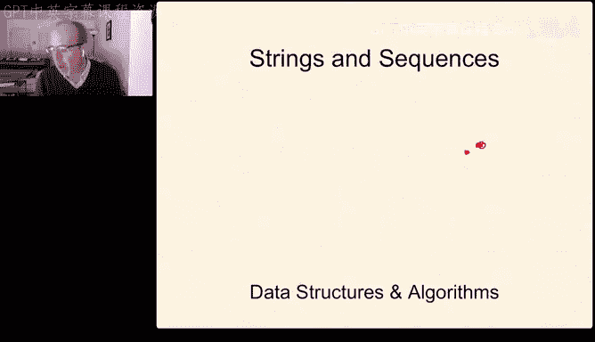

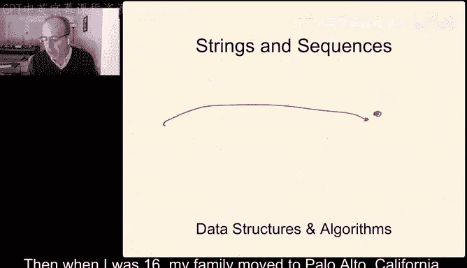

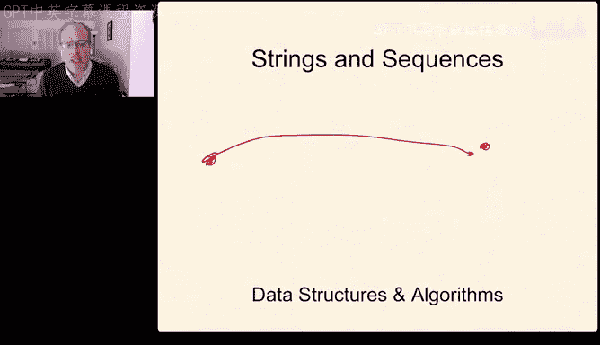

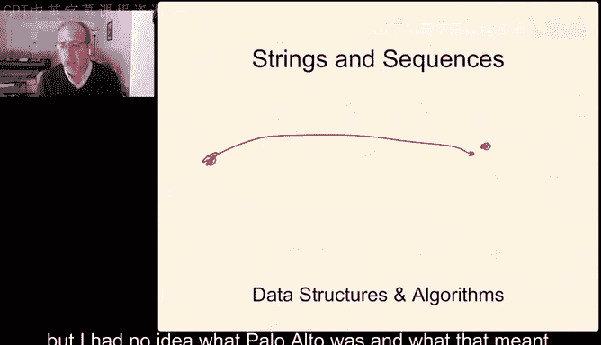

在本节课中，我们将学习字符串和序列的基本概念、相关算法及其应用。我们将从字符串的定义开始，探讨如何比较字符串，最后介绍一种高效的字符串搜索算法。

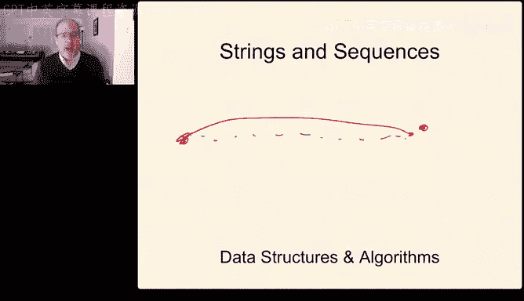

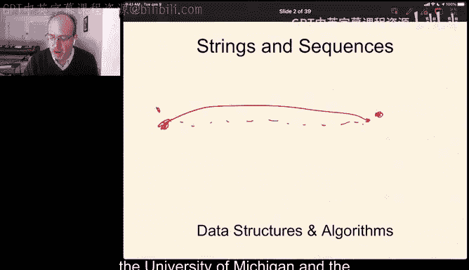

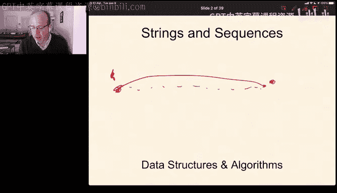

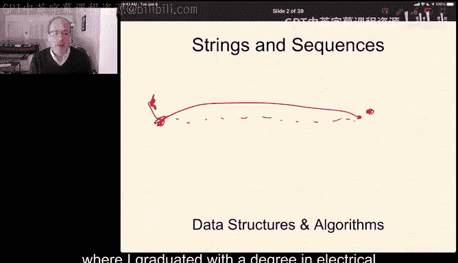

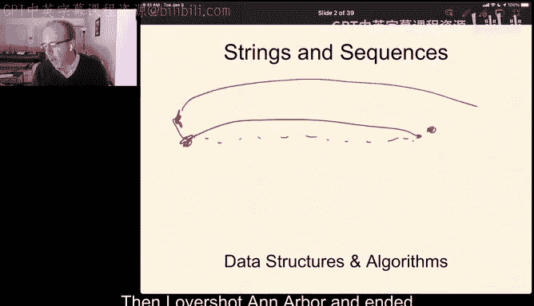

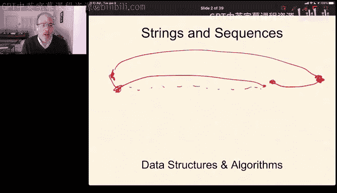

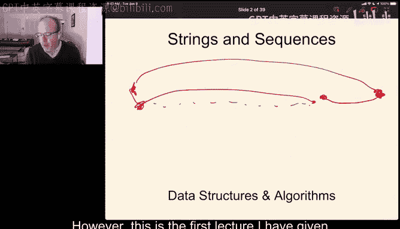

---

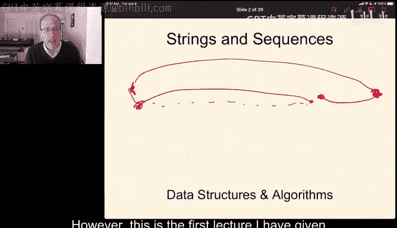

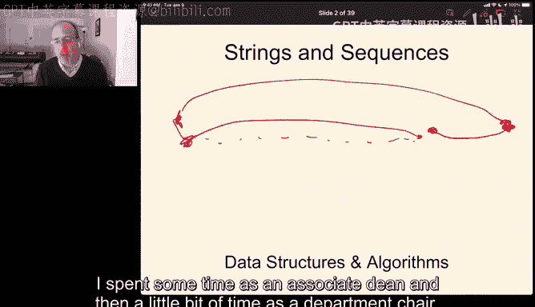

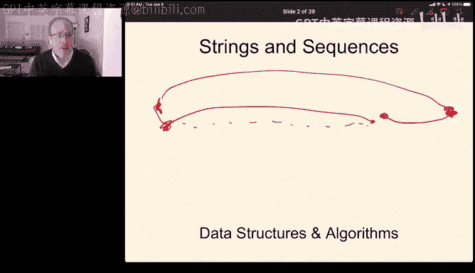


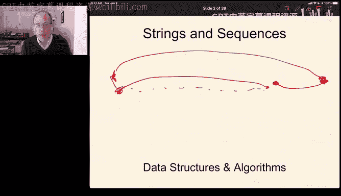


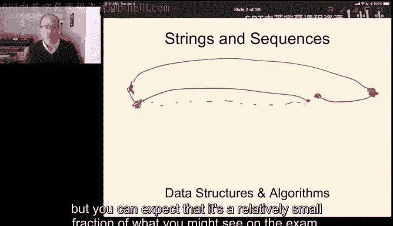

## 什么是字符串？🔤

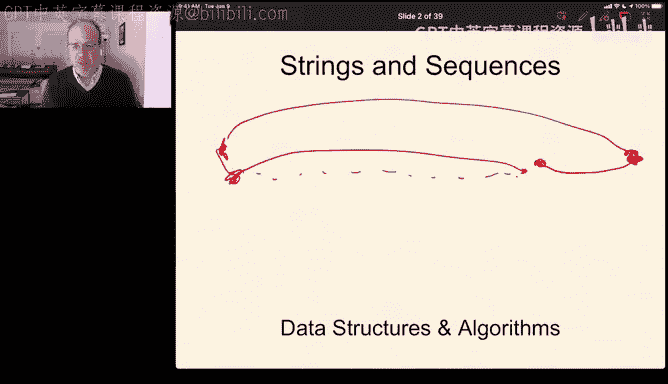

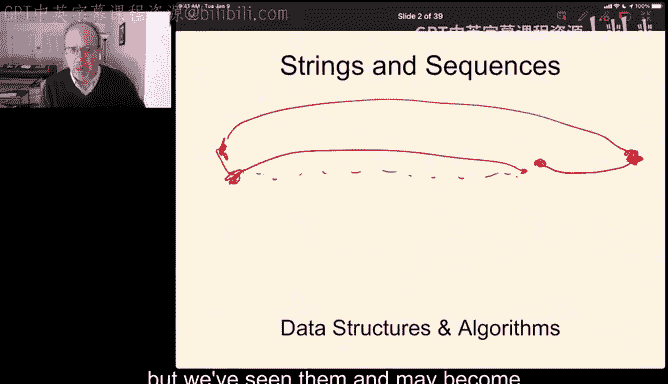

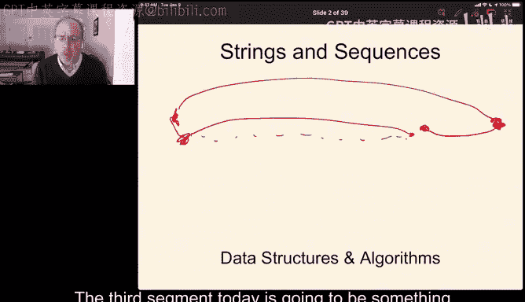


字符串是由零个或多个字符组成的序列，其中每个字符都来自一个有限的字母表。例如，英语句子就是字符串，因为它们由26个字母（大写和小写）、标点符号和空格组成。

序列算法处理这些结构，虽然数据结构本身不复杂，但某些算法可能非常微妙，需要我们深入理解细节。

字符串算法之所以重要，是因为它们非常常见，全球大量的计算能力都用于解决这类问题。任何与人可读文本相关的操作，其核心都是序列算法。

---

## 字符串的典型问题 ❓

以下是处理字符串时常见的几个基本问题：

*   **相等性检查**：判断两个序列是否相等。
*   **字典序比较**：给定两个序列和一个顺序定义，判断哪个序列在字典中排在前面（也称为字典序）。
*   **查找子串**：判断两个序列是否有共同的子串，这在DNA分析中非常常见。
*   **排序**：给定一组字符串，按字典序对它们进行排序。有序的数据便于使用二分查找等高效算法。

---

## 文本与语料库 📚

我们有时会讨论“文本”，它是由特定分隔符（如空格、标点）分隔的一个或多个字符串的集合。一个“语料库”则是文档的集合，每个文档包含文本及其他元数据（如标题、URL）。

例如，搜索引擎（如Google）会预处理网页文本，以便快速响应多个独立的查询。专利搜索工具也是一个庞大的产业，依赖于高效的文本搜索算法。

其他应用还包括文本压缩（如GZIP算法）和DNA序列分析。DNA由A、C、G、T四个字符组成，整个生命的信息都编码在这些序列中，字符串算法在基因比对、突变追踪等方面至关重要。

---

## 字符串的数据结构 💾

在C和C++中，最常用的字符串数据结构有所不同：

*   **C风格字符串**：以空字符（`\0`）结尾的字符数组。表示一个字符串只需要一个指向起始字符的指针。计算长度需要线性时间。
*   **C++ `std::string`**：一个更面向对象的类，通常包含指向缓冲区起始和结束的指针，可能还存储大小等信息。计算长度可以在常数时间内完成。

C++字符串支持迭代器，`begin()` 指向第一个有效字符，`end()` 指向字符串末尾之后的位置。标准模板库（STL）提供了丰富的算法来处理字符串和序列。

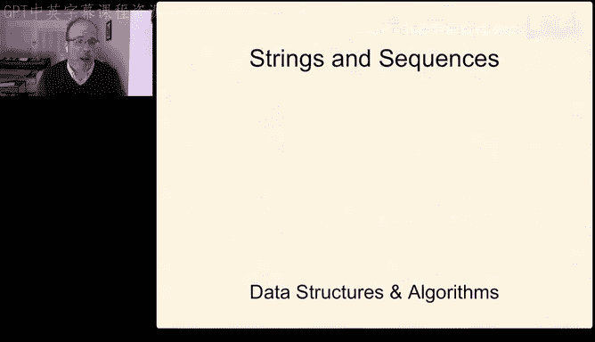

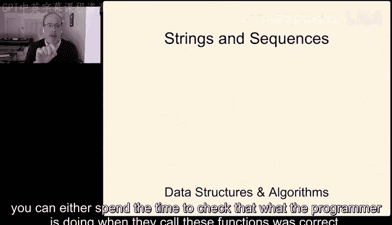

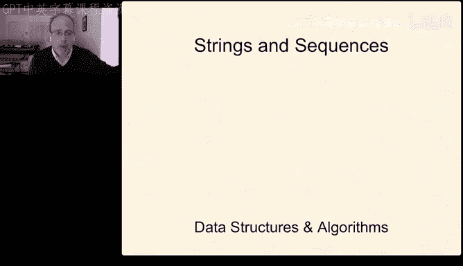

---


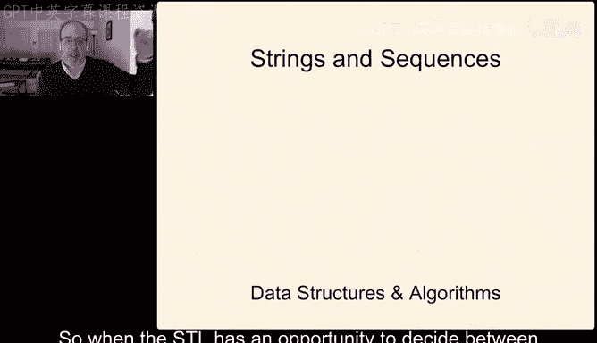

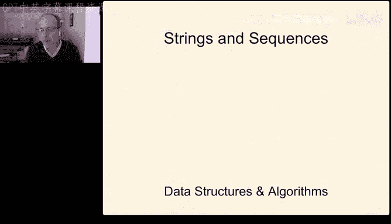

## 判断序列是否相等 ⚖️

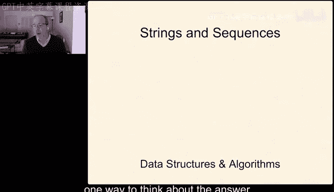


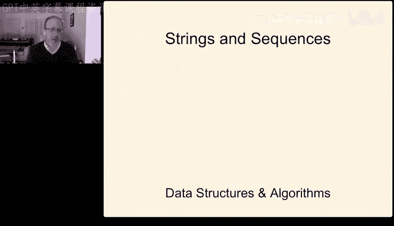

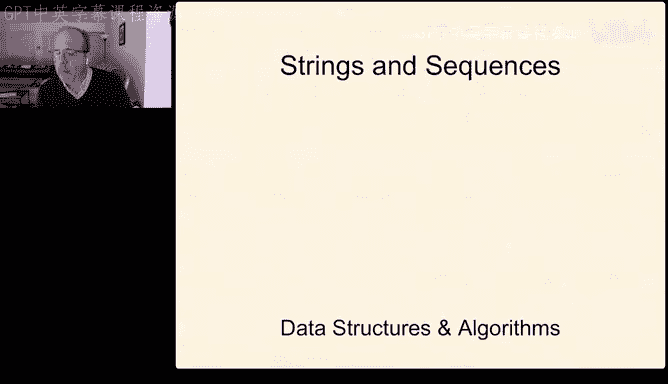

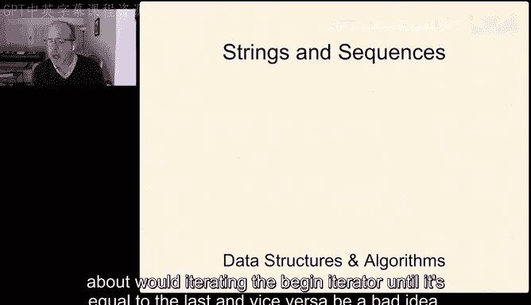

STL提供了 `std::equal` 算法来判断两个序列是否相等。它的函数原型大致如下：
```cpp
template <class InputIterator1, class InputIterator2>
bool equal (InputIterator1 first1, InputIterator1 last1, InputIterator2 first2);
```
该算法比较由 `[first1, last1)` 定义的第一个序列和从 `first2` 开始的第二个序列。它假设第二个序列至少与第一个序列一样长。

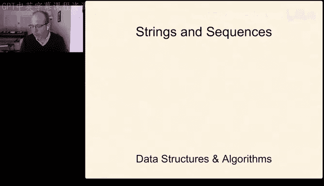

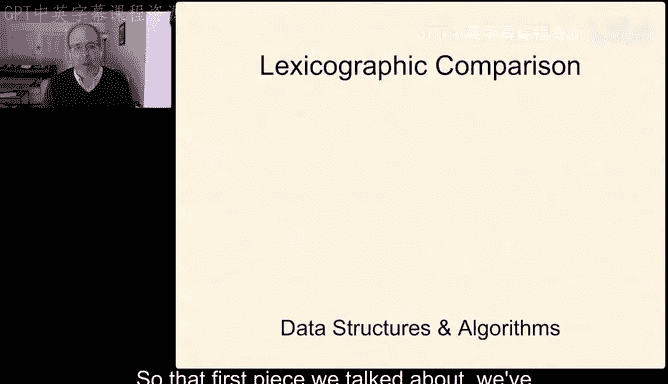

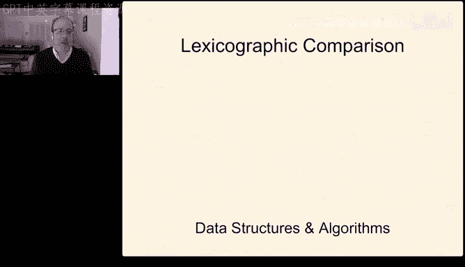

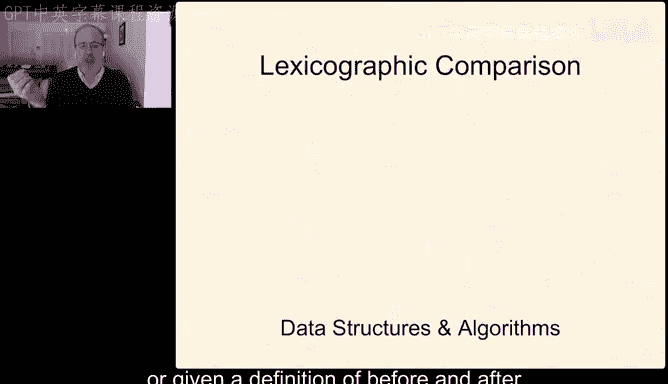

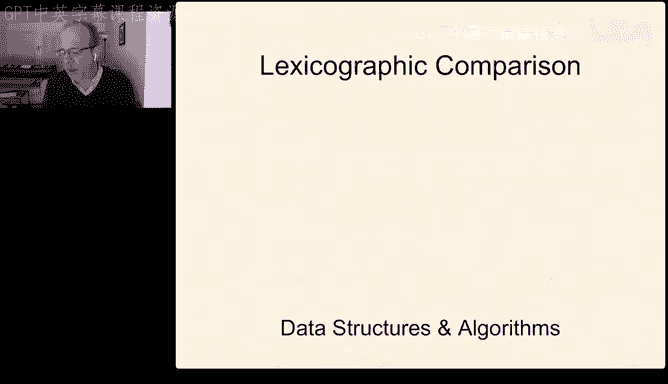

算法逐个比较元素。如果所有对应元素都相等，则返回 `true`；如果在任何位置发现不匹配，则立即返回 `false`。

**设计哲学**：STL倾向于性能优先，因此 `std::equal` 不检查第二个序列的长度是否足够，这需要调用者自己保证。

---

### 应用示例：判断回文 🔄

回文是正读和反读都相同的序列。我们可以利用 `std::equal` 和反向迭代器轻松判断一个字符串是否是回文。

```cpp
bool is_palindrome(const std::string& s) {
    return std::equal(s.begin(), s.begin() + s.size()/2, s.rbegin());
}
```
这段代码将字符串的前半部分与后半部分（反向）进行比较。如果相等，则是回文。

---

上一节我们介绍了如何判断序列相等，本节中我们来看看如何比较序列的顺序。

---

## 字典序比较 📖

字典序比较用于判断一个序列是否在另一个序列之前。规则可以递归定义如下：

1.  两个空范围相等。
2.  空范围总是小于非空范围。
3.  逐个比较元素。在第一个不匹配的位置，元素较小的序列整个序列较小。
4.  如果所有比较的元素都相等，但一个序列是另一个序列的前缀，则较短的序列较小。

例如：
*   `"" < "A"`
*   `"A" < "AB"` （`"A"` 是 `"AB"` 的前缀）
*   `"AB" < "B"` （在第一个字符处，`'A' < 'B'`）
*   `"BC" < "BC0"` （`"BC"` 是 `"BC0"` 的前缀）

---

### 实现与优化 ⚡

实际上，只需要实现 `等于` 和 `小于` 两个操作，其他比较操作（不等于、大于、小于等于、大于等于）都可以通过它们推导出来。

一种常见的实现方式是先编写一个三路比较函数 `compare(x, y)`，它返回：
*   `0`：如果 `x == y`
*   负数：如果 `x < y`
*   正数：如果 `x > y`

然后基于此函数实现所有比较运算符。

**STL实现细节**：
*   C++ `std::string` 可能使用“短字符串优化”，将短字符串直接存储在对象内部，避免堆内存分配。
*   对于不等比较，如果两个字符串长度不同，可以直接判断为不相等，这是一个快速的短路优化。
*   现代CPU支持单指令多数据（SIMD）操作，可以并行比较多个字符，极大提升性能。

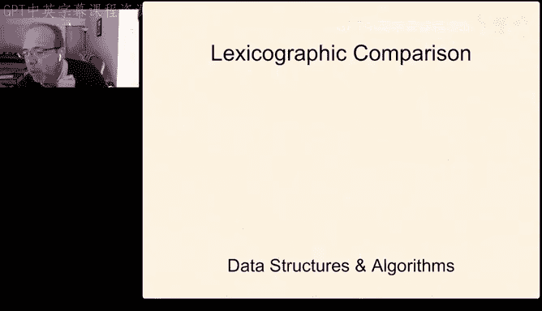


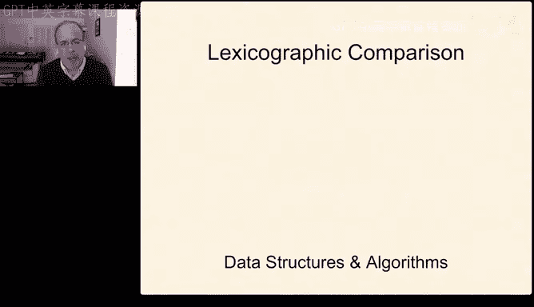

STL提供了 `std::lexicographical_compare` 算法来执行字典序比较，它也允许自定义比较函数和执行策略（用于并行化）。


---

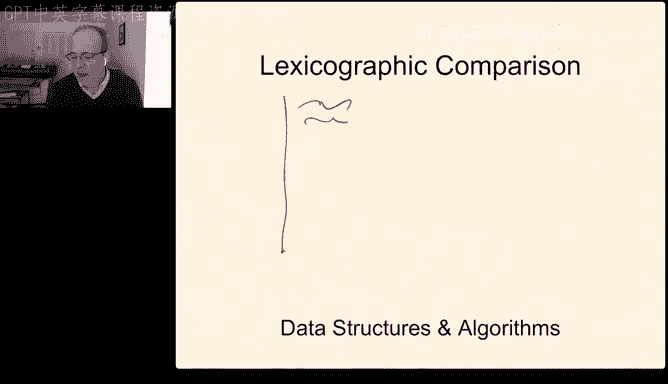

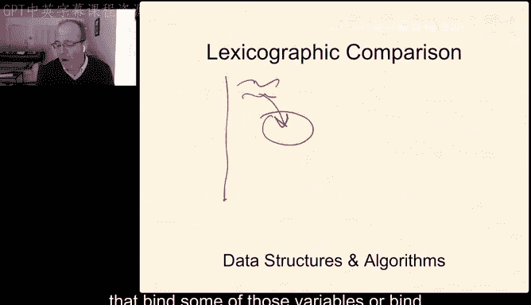

### 应用示例：获取唯一字符串列表 🗃️

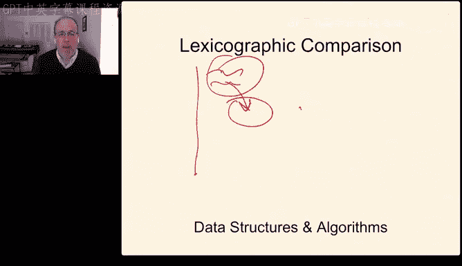

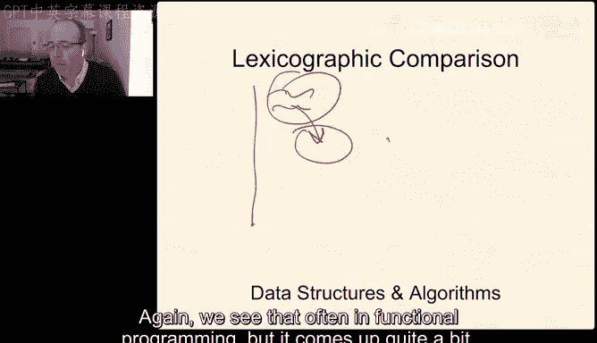


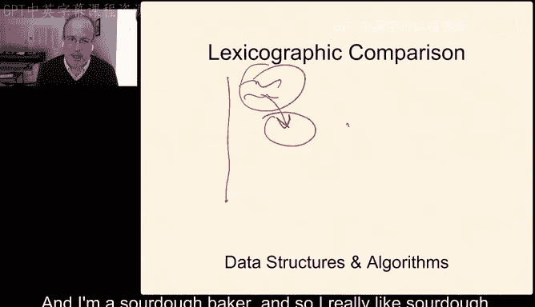

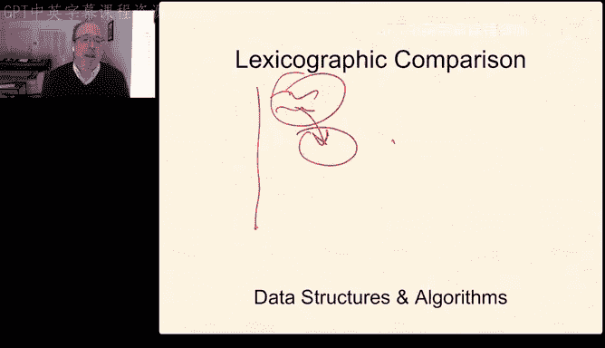

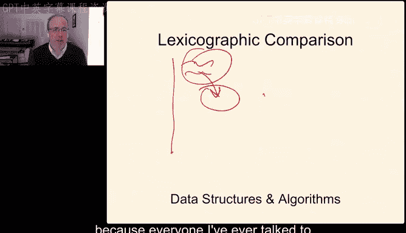

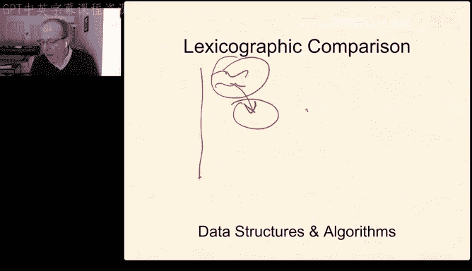

假设我们有一个包含重复字符串的列表，想要获取唯一的字符串列表。可以结合排序和 `std::unique` 算法实现：


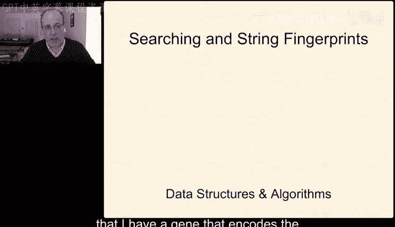

```cpp
std::vector<std::string> names = // ... 可能包含重复项
std::sort(names.begin(), names.end());
auto last = std::unique(names.begin(), names.end());
names.erase(last, names.end());
```
首先对字符串排序，使相同的字符串相邻。然后 `std::unique` 将重复项移到范围末尾，并返回指向唯一范围末尾的迭代器，最后删除重复项。

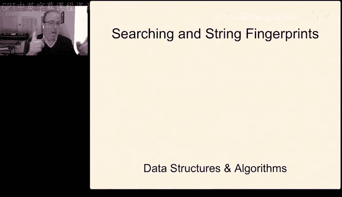

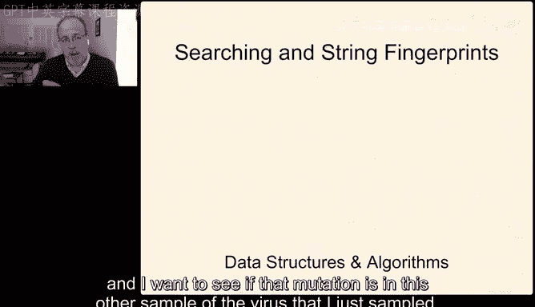

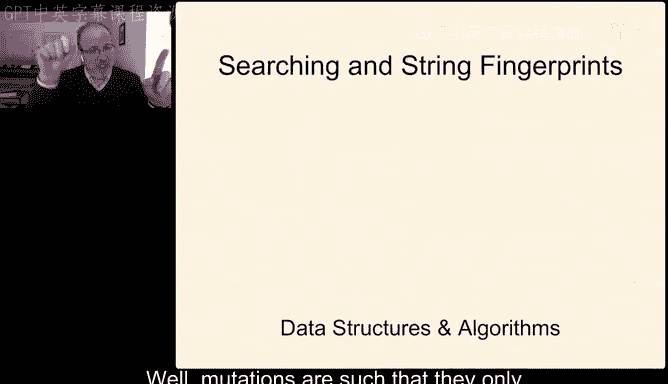

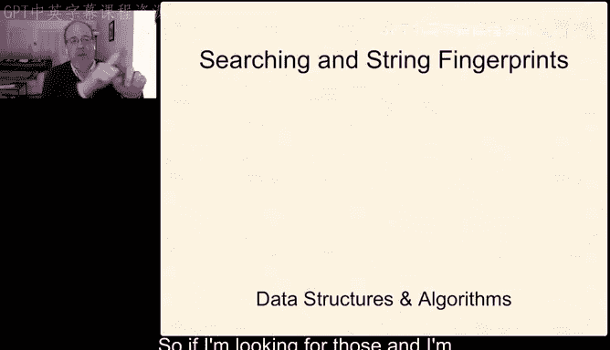


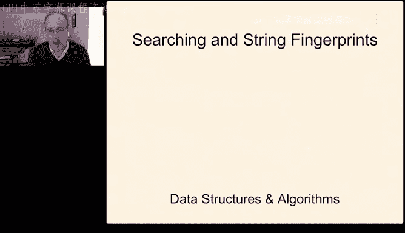

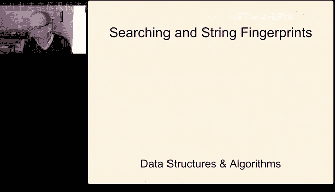

---

上一节我们讨论了字符串的比较，本节中我们将探讨一个核心问题：如何在字符串中高效搜索。

---

## 字符串搜索：Rabin-Karp算法 🎣

在长字符串（“干草堆”）中搜索子串（“针”）是一个常见问题。朴素算法需要 O(干草堆长度 * 针长度) 的时间，在最坏情况下（如DNA序列，字符集小，容易产生长前缀匹配）效率很低。

Rabin-Karp算法的核心思想是使用“指纹”函数。我们为字符串计算一个整数“指纹”（哈希值）。如果两个字符串的指纹不同，那么它们一定不同；如果指纹相同，则**很可能**相同（需要进一步确认，因为可能存在哈希碰撞）。

**大思路**：先计算“针”的指纹。然后在“干草堆”上滑动一个与“针”等长的窗口，计算每个窗口的指纹。只比较指纹：
*   指纹不同 => 窗口与“针”肯定不同，跳过。
*   指纹相同 => **可能**匹配，需要逐个字符验证。

关键在于，滑动窗口时，我们可以根据旧窗口的指纹**常数时间**地计算出新窗口的指纹，无需重新计算整个窗口的哈希值。

---

### 指纹函数与滑动窗口 🧮

一个简单的指纹函数是将字符串视为一个多位数。例如，字符串 `"TOM"`，字符`T`、`O`、`M`的ASCII码分别为84, 79, 77。指纹可以计算为：
`((84 * base + 79) * base + 77)`，其中 `base` 是一个选定的基数（如128）。

滑动窗口时，例如从 `"TOM"` 移动到 `"OMM"`：
1.  减去最高位字符 `T` 的贡献：`T * base^(n-1)`。
2.  将剩余结果乘以 `base`（相当于左移一位）。
3.  加上新字符 `M` 的贡献。

为了避免整数溢出，我们使用**模运算**。选择一个大的质数 `P` 作为模数，所有运算结果都对 `P` 取模。模运算下，加法和乘法的结合律、交换律依然成立。

---

### 算法步骤与复杂度 📊

1.  **预处理**：计算“针”的指纹和用于滑动窗口计算的幂值 `Z = base^(len(针)-1) mod P`。
2.  **初始化**：计算“干草堆”中第一个窗口的指纹。
3.  **滑动搜索**：
    *   如果窗口指纹与“针”指纹匹配，则进行逐字符验证。
    *   否则，滑动窗口：减去旧字符贡献，乘以基数，加上新字符贡献，所有操作取模 `P`。
    *   重复直到找到匹配或遍历完“干草堆”。

**时间复杂度**：
*   理想情况（无碰撞）：O(干草堆长度)。绝大多数窗口指纹比较都是常数时间。
*   最坏情况（每次指纹都碰撞）：O(干草堆长度 * 针长度)。但通过精心选择 `base` 和质数 `P`，可以使得碰撞在实际中极其罕见。
*   平均性能通常接近 O(干草堆长度 + 针长度)。

**参数选择**：
*   `base`：常选择2的幂（如128），因为乘法相当于位移操作，速度快。
*   `P`：选择一个足够大的质数（如 `2^31 - 1`），且与 `base` 互质。

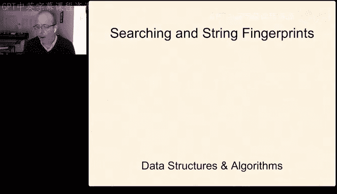

---

## 总结 🎯

本节课中我们一起学习了：
1.  **字符串与序列的基础**：定义、数据结构和常见问题。
2.  **序列比较**：如何使用 `std::equal` 判断相等，以及字典序比较的规则和实现。
3.  **高效字符串搜索**：介绍了Rabin-Karp指纹算法，它通过哈希值和滑动窗口，在平均情况下能显著提升在长文本中搜索子串的效率。

字符串算法是计算机科学的基础，广泛应用于文本处理、生物信息学、数据压缩和搜索引擎等领域。理解这些基本算法将为你解决更复杂的问题奠定坚实的基础。