# 密歇根大学《数据结构和算法｜eecs281 Data Structures and Algorithms Winter 2021》中英字幕 - P15：-16-EECS 281_ W21 Lecture 16 - Hashing and Collision Resolution.zh_en - GPT中英字幕课程资源 - BV1snk5BWEfc

Okay， I'm going to give it a few more minutes as usual， just to let people come in。

Not too many people are here yet， but。Daylight savings time is awful。

 and I'm still managing to try and switch to it。Does anyone have any questions before we get started。

 go ahead and put them in the chat if you do。Okay。Before we get started， just a few announcements。

The midterm grading is continuing we're getting pretty close to being done we have some final grading on the last questions still to go as as that's done we'll have grades released including some statistics so you get a sense for how things are going if you are worried about how things are going for any reason at all please stop by and chat with us the easiest way to do that is during the Pro hours which are the joint hours that one or two of the faculty will hold together we can have sidebar conversations during those that are private and if you're really concerned please drop an email to the admin email address and we can reach out and schedule something separately then。

I know this is a really difficult time in the semester。

The point where a lot of stress is starting to build up and so I want us to also be mindful of that and do whatever you can get sleep。

 eat well， get outside once in a while， I know that's really hard even for me to get outside of my apartment。

But but I every time I managed to do it， I realized it was a good thing to have done。

Today we're going to be talking about。Hash collision resolution。 So if you'll remember。

 the last time we talked about these things called hash tables。Which have a bunch of entries。

There's a large universe of things that gets mapped down into this smaller space。

That mapping happens。With a composition of two functions。 So if we have a key。

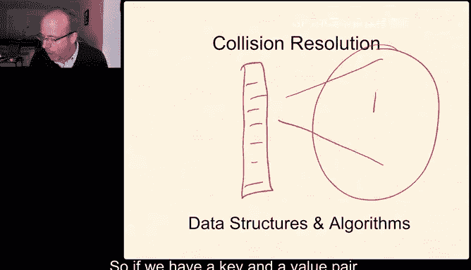

And a value pair。We take a transform of that key。And then we compress that key。

 The transform gives us an integer。The compression of that integer gives us a valid index。

Into our table。And so today what we're going to talk about is how can we deal with the fact that it's because this is a very large space relative to this much smaller space。

 the idea and the possibility of collisions or of two different things hashing to the same value are going it's going to happen so today what we're going to talk about is how do we handle that。

This is needed in every basic hash table function， it's needed to handle insert。

 search and removal anytime more than one key hashes to the same table index。

There are two basic families of collision resolution。 their separate chaining。

And in separate chaining， the idea is that each bucket。

Is a linked list of key value pairs so that when two different keys hatch to the same value。

 we'll store both of those keys in a linked list hanging off of that bucket's particular pointer。

These other methods called open addressing methods。Use。Otherwise， empty slots。So linear probing。

 quadratic probing and double hashing are three very common techniques to find a free slot that's available if the slot we're trying to use is full and we'll talk about each of these linear probing is the simplest one but also has some unfortunate performance characteristics。

 especially as our table gets full。Quaddratic probing and double hashing are both techniques to reduce the impact of that。

To reduce the problems of what happens when our table gets full in terms of performance when we're using open addressing。

But we'll also see that the other thing we'll do is something very similar to what happens with vectors so if you remember when a vector gets full the standard template library implementation of the vector allocates a larger space of stuff。

Puts that vector into or copies the vector into its。

New new larger allocation and continues from there。 And you'll remember。

 we talked about something called amortized analysis。

An amortized analysis allowed us to spread the cost of very infrequent but very large operations over much more frequent quick operations。

 which allows us to talk about the performance of these things in a much more sensible way and at the end of today's lecture。

 we have another demo of a little bit of code we'll look at and the code implements a very simple version of separate chaining in hash tables。

All， let's start with separate training。Now as I mentioned in the introduction。

 the idea behind separate chaining is that we're going to resolve collisions by maintaining M linked list。

 remember that M。Is the size。Of our table。And so we're going to resolve collisions by maintaining instead of M buckets for individual key value pairs。

 we'll have M pointers， each of which point to a linked list that is zero or more elements long。

 every element in one of those linked lists is represents a key that hash to that value in the table。

And you can think of this like shopping in a grocery store， you know， when I'm looking for hot sauce。

 I find the aisle that has the condiments and then I look in the condiment aisle until I can find the one that has the hot sauce that I'm looking for the barbecue sauce if I'm looking for barbecue sauce。

嗯。And then so I can very quickly go to the aisle and then I kind of have to search the aisle until I find the right space。

And we're going the same idea works for separate training， when we hash to a value。

 we're going to have to first check to see if the key is already there if we're trying to insert it。

 if we're modifying it， or if we remove it， we have to find to see if it's there at all。

The idea behind separate chaining is that it reduces the number of comparisons for a sequential search。

 so if we had an unordered vector or list of our key value pairs and we wanted to see if we inserted something by either modifying its existing value or adding it if it didn't exist or finding something in the list。

 on average that takes a linear number of comparisons looking for the right key。

Separate chaining reduces that number of comparisons by a factor of M on average in exchange for using the space for those links。

So in a table with M lists。Or M different index values in the table and N keys。

The probability of the number of keys in each list。Is within a small， constant factor of n over M。

It's very， very close to one if the hash function is good。So in other words， if the hash function。

Is able to distribute。keyeys randomly or uniformly throughout the table index。

 then it's pretty likely that if we have n entries in our table of M。

 that each list is going to be about n over M entries in length。

Now because this number n over m is so important， to use we're going to actually name it something called alpha and alpha is the load factor。

 which is equal to n over M， so if we have n keys in an M size table。

 then it's the ratio of those two is called alpha。Set in separate chaining。

 alpha is the average number of items per list， and one of the interesting things about separate chaining is that alpha can be greater than one。

 in other words， we can have more elements in our list or in our hash table than we have positions in the index values。

For open addressing， instead of where when we aren't using this chain of linked list entries and we're just using nearby or other empty spots。

Alpha is the percentage of table index entries that are occupied。

 and it must be less than or equal to one， so if we're using actual buckets of the table to store values。

 we can have more values than we have buckets in the table and so alpha has to be less than or equal to one when we're using open addressing。

Okay， for insert， if we think about separate training complexity， if we're allowing duplicate keys。

 in other words， if one key can appear more than once in our hash table， insert is constant time。

 we just insert it into the head of the list at that index。嗯。And if duplicate keys are not allowed。

 it's order alpha because we have to search the alpha entries in that list。Likewise。

 search is proportional to alpha。When we're looking for a key。

 we have to search everything in the list at that index value and if we find it it's there if we don't。

 we don't remove depends on search because to remove something we first have to find it。

 that's also order alpha。And again， if we're choosing an M that's approximately equal to n or maybe even a little bit bigger。

 then alpha is bounded above by one。And as long as they're roughly in proportion to one another。

 this is a constant time algorithm。Darren， you asked how would using a vector instead of a linked list increase the number of comparisons。

 it doesn't really change anything， so if we had a vector instead of a linked list if the vector was unsorted。

We would still have to search it linear if linear Li， if the vector were sorted。

 we could use binary search。Until we found it， and then it would be logarithmic in alpha。And in fact。

 so Darren， the check is in the mail， thank you for asking that question。

 I forgot this was the very next thing I was going to talk about。And。

Using something other than linked lists if so again。

 the worst case is if all of our elements hash into exactly the same value。嗯。

And if all of our elements hash into exactly the same value， then all of our operations are linear。

So one of the things we can do is Darren suggested we can use M vectors。

 and if we keep the contents in those vectors sorted， our insert is alpha。

 but that's what it was before if we're using unique keys。

 but search becomes logarithmic because we can use binary search。

You can also use binary search trees that are self balancing。

 we're going to talk about those in the next two lectures。嗯。

And that's logarithmic insert in search as long as the tree is balanced。

 but that has a significant memory overhead because there are extra pointers we have to keep around for all of these。

And Monique。Let me see if I just give you a really quick idea behind what the separate chain。

 let me find something that doesn't have a lot of space in it。The idea is we have a table。

Which has entries， and each entry is a pointer to a list。And each list is a key value pair。Okay。

So that's the basic idea behind separate chaining separate chainings pretty simple pretty straightforward and it's it's pretty common it's the one I tend to default to use if I'm building my own hash table which I try never to do because I try and always use them from the standard T library but if for some reason I am building my own I almost always default to separate chaining until I can find something else until I find a reason not to and that's actually。

A principle。The kiss principle， keep it simple， and I'll leave off the last ask because it's really only it's not a very nice word to say and so I'm just not going to use it。

Um， but I tend to use the simplest implementation I can come up with until I discover that that implementation is not good enough for the application that I have。

嗯。So I will tend to default to separate chaining。But there are also times when we want to use open addressing and in open addressing。

 we resolve collisions by using empty locations at the table。

 so parking at my apartment a really good example。There aren't very many parking places right in front of the doors to the apartment and if I'm coming back from the grocery store。

 I have lots of bags I need to carry into the apartment。

I'd like to park as close to my apartment as possible and I have a space like I have the space that I like to park in and and it's not my space。

 it's not a sign， but I like it and so I sort of think of it as my space and if my space is parked by somebody else because someone else got there before I did。

 I'll just find the closest space to it that's open that might be someone else's favorite space and then they have to find a space closest to their favorite space and so on。

And so this is a pretty if you've driven a car and parked in a parking lot like this is a pretty common sort of thinking about the algorithm if the spot you really want is full you go to the closest one to that using your definition of close and we may have different definitions of close and when you're returning to your car you remember more or less where you parked and then you have to search around that area and open addressing works more or less the same way Nigel thank you for putting that in the chat that is a。

There are lots of really good visualization tools， and when we find them。

 we'll try and remember to include them。嗯。So open addressing is based on a method called probing。

So the first step to probing is you hash。To a value。In the hash table。

And you use probing to find nearby or other suitable locations if that one happens to be full。

So we'll use it to search if we're finding data or to find available locations to insert new elements into the table。

And there are three possible outcomes when we're probing looking for a particular key。

The place we're looking is empty， which means if we're looking for the data。

 it doesn't exist in the table and if we're trying to insert it， that's where it goes。It's a hit。

 which means if we're looking for the data， this is where it lives。And if we're trying to insert。

 it's already there。 and this is where we modify the value if we're only using one value per key。

Or it's full， so this is when the place the bucket we're looking at has something in it。

But that something is not the something we want。 and so now we have to find the next best place to put this particular location。

So if the probe results in full， then we probe the table at the next cell and we'll talk about what the next cell means in a minute until we either hit。

 we found the key we're looking for or empty， which means the key that we're looking for isn't there and we either have nothing to return or we can insert the key at this location。

So I'm going to talk about three different mechanisms for finding the next cell and the first one's linear probing。

And the idea behind linear probing is that。If we end up in a place。If this is where we want to start。

And it's not I'll actually sorry， let me change that。

So this is where we wanted to find our key to insert it， while there's something already there。

 so we go up by one， while there's something already there， so we go up by one。

 and this is where we put our new key。So linear probing。

 we hash to the value we're looking for if the thing we're looking for。

 if that location is full and not the thing we're looking for。

 we'll increment by one until we find us either the key we're looking for or an open space because this is a finite。

T we might end up getting to the end of the table if we do that。

 we want to loop around to the beginning and the way we loop around to the beginning is by using modular arithmetic。

So just like we were using mod arithmetic in our hash functions。Yeah， my pen is lagging。

 I don't know why。And because it's lagging for me too， and I apologize for that。

 but I don't know why it is doing that。Let me take a look and see if I can figure it out。啊。嗯。

We just restart the capture。That's a little better。 great。 We'll see how that goes。

 Hopefully that'll be a little bit better。Oh， that is a lot better。So when in doubt， try it。

 maybe it'll work。嗯。Okay， let's see。 So linear probing。

The thing we're looking for is occupied and not thing if the index we hash to is occupied and not the thing we're looking for will increment by one。

 those increments are using modular arithmetic， so we'll soak around at the beginning and we just keep going until we either find the key or we find a hole。

Okay， once we start talking about probing， the next idea we want to think about is cluster。

 so what is a cluster？

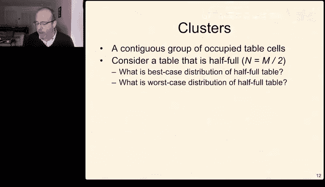

A cluster is a contiguous group of occupied table cells。

So if we have a table that's half full and this half full。

Table is one that's going to be really interesting to us and we'll use it a lot。

What's the best case distribution of a half full table and what's the worst case distribution of a half full table？

And。Once we think about that， what is the average cost？In terms of n。

 the number of elements in our table to obtain a miss。Finding an empty cell in the best case。

What's the average cost in terms of N to obtain a missed if it's the worst case？

And what can we do to try and improve the chances that we get a best case distribution？Okay。

 so the best case。W， that was done。 Keep。The best case。Is a table？Where it's half full。

And it's every other element。So that's the best case we can possibly have and on average。

We'll either find it where we look or we'll find that it's not there when we look or we have to move by one。

 So on average， we're going to need 1。5 probes。The average cost in the worst case。

 the worst case is when all of the elements are in。One big contiguous cluster and chunk。

So on average， we're going to look somewhere in the middle for the thing we're looking for and we'll have to go from there to the end。

 so it'll be n over2。In the worst case， so this is constant。And this is linear。 So in the best case。

 the average number of probes will be constant。 And in the worst case。

 the average number of probes will be linear。So what can we do to sort of improve that？

So that's one of the questions we're going to think about well one of the things you could do is make sure you have a really good hash function so if hash functions distribute keys randomly and the keys don't have a lot of regularity and patterns to them as they're being inserted。

 in other words you don't keep inserting the same key over and over again or something like that。

Then that will tend to disperse the elements in the hash table and tend to spread out the clusters more more likely。

 there are going to be some other tricks we can use by using a different probing mechanism we'll come back to that。

嗯。Next problem we have to think about after we think about this question of how do we try and preserve the properties。

 the good performance properties of our table is what do we do about deletions？嗯m。

And the reason this is hard。Suppose we have a cluster。

We want to delete a key that normally hashes to this location。

We eventually find it at this other location。So that's where it's going to go。

 But any of the other keys in that cluster could have hased to that value。

 We have no idea what would happen， So we have two choices here。

 One is that we could remove it and rehash。The rest of the cluster。嗯。

Which is expensive if the cluster is large。The other option is that we use a special value that represents that it's deleted。

So the deleted value I'll use in this example a different color。So。

The deleted value is one that says。This is just no interesting key at all when we have a deleted value in search。

 we just passed past it as if it were the value that we're not looking for but a valid value and in we can overwrite any deleted value that we find。

Um， so。When we have deleted our new probing outcome， it could have been empty。

 it could have been full， something that' we're not looking for， it can be a hit。

 and now there's a fourth outcome deleted。And as I mentioned in the prior slide。

 when I'm trying to insert something， I can consider a deleted entry as if it were a miss and overwrite it because it doesn't have anything interesting。

 but if I'm using search I have to treat the deleted entry as if it were occupied or full and I have to keep searching within this cluster。

嗯。And Ja， I think that's， I think I'm seeing your question Le。

 why couldn't you just overwrite the key to be empty and reuse it later if you need to doing certain new things。

 that's exactly the idea behind the deleted representation is that we need a value for the key that says this is not a valid key。

Which means that one of our key values has to be non impossible， which isn't always true。

 sometimes that doesn't happen。嗯。So this is how we think about what happens to manage bucket states。

 so it's pretty easy if we have a key value that can't exist to represent an empty bucket。

But often all key values are possible。And if all key values are possible。

 we need some other way of managing the state， whether a bucket is used or unused。

 and then that requires a boolean， now maybe together with that little entry in the bucket we may have another vector of boolean that tell us because it's a little more space efficient to manage it that way there are different ways to manage it。

 but in principle， we need a Boolean value to tell us whether a bucket is used or unused。

If we're also going to consider deleted now we have three states that we need to represent and if we're going to represent three states。

 we need at least two bits of information because one bit can only represent two states。

So three states。Implies。At least two bits。And there are two ways to do that one is that we can use two bos。

 that's two bits directly， but a more common way is an enumeration type。

 you may have seen enumeration types earlier either in 101 or 183 or maybe in 280。

 but I'm going to remind us what these are for because they turn out to be very， very， very helpful。

嗯。So an enumeration is a variable type that can only take on certain enumerated values。

And it's really valuable， particularly for making our program more readable。

So we can have an enumeration that this is because I'm using the word class。

 I could also equivalently use the wordstruct here。

 this is going to create a scope enumeration so that every enumeration has the scope。Plus。

 the scope operator and which enumeration value we're talking about。And our bucket types are empty。

 occupied or deleted。So we can compare them if bucketsi。 type。Is equal to empty。嗯。😊。

Or we can switch on them。 There are lots of other ways to do it。

 The main advantage of this over using Booles directly is that it makes things much more readable you there are other ways to do it with two Booles is a this is the one I happen to like。

In particular， because one of the things- and you'll hear me say this a lot。

The most valuable person on your team when you have a team in a company or。

What have you of people in software engineering is almost never the person who writes the fastest code。

And it's almost always the person who writes the most readable code because readable code can be made faster pretty easily。

 but fast code can sometimes be really hard to read。

And often code doesn't need to be fast if code isn't going to execute a lot。

Very often for very large structures， it doesn't really matter how fast it is because it doesn't happen very often。

So let me come back to a couple of questions that have filtered in is there a two bit type that we can force the enM to represent。

 no， at least not for the best of my knowledge。They all get coerced into an integral type。And again。

 if space really， really becomes a premium， then we may have to hand code this， usually it's not。

 usually we don't worry about it， but you can represent it as a character as well。嗯。

Bullions can be packed。So a bit field can actually allow you to pack booles into a smaller element。

 which is helpful。And also， if you ever want to know how big something actually is in your program。

There's something called the size of operator and size of a type will tell you how many bytes that type occupies。

 which is pretty helpful。嗯。And Malik it doesn't have to take two bytes。

 the compiler can represent it however it chooses to。

 and the compiler could represent it as a bitfield if it really， really wanted to。

 although I don't think most compilers would。And again， this is one of those times when。

Don't worry about the absolute most efficient way to do something until you realize you need more space。

Um， so you know， use the use a straightforward。Not more wasteful than it needs to be。

 but readable implementation first。Only make it better if you really decide later you really need to。

Okay， so this next bit I'm going to ask you to take on faith。 We're not going to derive this。

 You would derive it in a in a more advanced course。

 I'm going to instead give you this is an intuition。 So so this slide we care about。

We're going to care about for this slide， we're going to care about things qualitatively。

Because even though I'm giving you a quantitative version。

 we're going to think about it qualitatively。And the idea is that as our load。嗯。

As our load factor goes up。So we have。About a load factor of alpha n equals alpha M keys where alpha。

 and remember， alpha has to be less than or equal to one in open addressing。嗯。If we're looking。

 if we find a hit。It's 1 plus1 over1 minus alpha。And this number gets bigger。As alpha or sorry。

 the denominator gets smaller。All right， let me back that up。

So the denominator gets smaller as alpha gets bigger。

 which means this entire ratio gets bigger as alpha gets bigger and as alpha approaches1。

That that grows to infinity。For misses， it's even worse because this number， which is less than one。

Will be squared， which makes it even more less than one， which means this grows。Smaller， much faster。

 which means this grows larger， much faster。 And so misses grow faster。Then it hits。

So the number of probes it takes us to identify a miss can grow faster very quickly as our table becomes full。

Okay， so the details are not that important here because again。

 we're not going to do the derivation in 281， but the intuition is misses get pretty serious when the table gets full。

Or sorry， hits get pretty serious when the table gets full and misses get very。

 very serious when the table gets full。So one of the ways we often think about load factors in hash tables is we think about the halfway point。

 so if a hash table is about half full。What does it take， and this is on average。

 a successful search with a good hash function。So this assumes。A good hash function。

The average probes in linear probing for a successful search in a half full table。

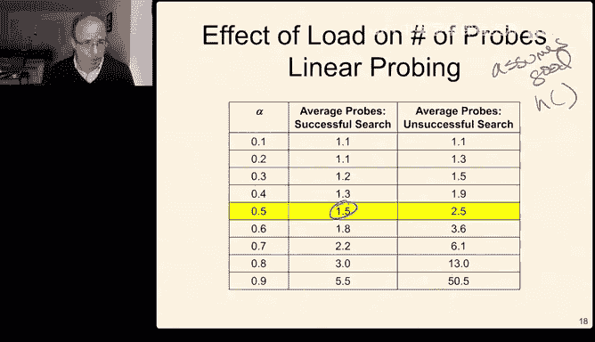

About one a half， it's the best case。 It's the one we looked at before。

 The average probes for an unsuccesful search， about2 and a half。Okay。

 and one of the things we see is that is the table becomes more and more full。

The number of probes for a successful search starts to get pretty large。

 the number of probes for an unsuccessful search becomes ridiculously large。It gets very， very large。

 very quickly。嗯。So we would like to do something about that and there are really two things to do about this。

 one is find something that works better than linear probing。So that's one。2。Never go past half full。

And as long as we either never go past half full because one and a half， two and a half。

 we can kind of live with that， that's okay， but if we have to go more than half full。

 then we want to do something more clever than linear probing。

 so that's what we're going to talk about next。Let me take a quick look at the chat。嗯。The enum。

I don't know so I don't actually know what a compiler will use for an enum that could be represented as a character in one byte。

I think that still uses a short integer， which on most compilers is two bytes long。

But I'm not 100% certain about that and that may differ different compilers may implement that differently if the standard doesn't actually require a particular choice and I don't know if the standard requires a choice it may。

 but this is one of those times when so this is one of those families of questions that my answer to it is I'd have to go look it up and I still have to go look things like this up。

 in fact I still have to sometimes look up operator precedes because it's just not something I ever convince myself that I remember。

For operator precedes， I'm actually one of those people who just uses parentheses even when I don't need to。

 because that way， even if person because I can't really remember them and if the person reading my code doesn't remember them either they know exactly what I mean。

Okay， so what we're going to talk about first is doing something better than linear probing。

So the first thing we'll look at is quadratic probing。

Qudratic probing uses the same idea as linear probing。

 except that instead of just incrementing it by one each time。We'll increment it。By one。

And then by 4 and then by 9， and then by 16。 So we'll increment it by。J square。

So in linear probing our。Advance function is T key plus J， sorry， not I。TP plus J。

In quadratic probing， it's T plus J squared。So this will tend to spread out these clusters a little bit because we keep looking farther and farther and farther away this idea of adaptively looking farther and farther away or adapting。

 waiting longer and longer， it comes up a lot in computer science we use it all the time so for example。

 when you're looking at your Gmail and you get disconnected from the Gmail server。

 it'll say you know can't connect trying again in one second。And then it'll say two seconds。

 and it'll say four seconds， and then it keeps getting longer and longer and longer between retriries。

Part of the reason for that is that one of the reasons why the server could not be responding is that too many people are trying to talk to at once。

 and if all of those people are Gmail clients， this what's called exponential backoff allows the server to recover so that not everyone is trying to hammer at once and instead they sort of spread themselves out in a line a little bit more。

😡，嗯。Yes， thank you， the N just as a reminder， n is the size of our table and M is the number of things in it。

So n equals capacity。Or sorry， this is Nd， I'm exactly backwards， let's try that again。

So n is the occupancy。M is the capacity。And alpha， the load is n。And over。Yeah， scared me too。

 Elliot， for sure。So this turns out to be better， so remember the old one。Let me go back to it。

 The old one was one plus what grew with one over one minus a。And one over one minus a squared。

The new one grows。Linear logarithmically won over a for both hits and misses， much， much better。

It still grows。嗯。It still grows， but it grows much， much more slowly。

 so let me step back because there are a couple questions that I think are going to be helpful。

So Sve asked sorry， but I'm still confused to what probing is， so probing is the idea。

That if we have a table。And we're going to store the elements in the table。

And we were looking for the hash the key number five。

 and it hashe us to this value and key three is already there。

 how do we find a better place in other words probing is my favorite parking place is full。

 how do I find a better parking place or a good parking place， a good enough parking place。Jy。

From this prior is the number of times we had to probe。So the first one is the first， second。

 and so on。Okay。So the the counting， or when we have quadratic probing， in other words。

 instead of next one， next one， next one， if we search， well。

 this and this actually happens if you've ever driven to the Detroit airport and needed to park in the parking deck right next to the terminal。

On a Wednesday。Thing is full my favorite place to park， I'm going to tell you a secret。

My favorite place to park anywhere in the Detroit terminal is the fourth floor。

And the fourth floor is because you can walk from the fourth floor into the terminal without having to wait for an elevator。

 I hate hate waiting for elevators。Early in the week the fourth floor usually has lots of spaces in the middle of the week it's a lot trickier so early in the week I'll go to my favorite area of the fourth floor try and find a spot and find something near there。

 but if it's a Wednesday， which is the day that parking structure tends to be the fullest。

I'll do one pass through the fourth floor really quickly and if I can't find anything in that row。

 I'll go up to the top。And so。That's part of the idea behind sequential programming probing versus quadratic programming。

On a Saturday， I use sequential programming because the law is just not that full On a Wednesday。

 I use quadratic programming probing。Because if that one row I check in the fourth floor is full。

 the others probably are too。嗯。And Richard， we are using。For this conversation。

 we are talking about hash tables in which keys are unique。Otherwise。

 hits and misses would always be the same。And how why is separate chaining more popular because this probing stuff can get complicated to analyze。

 even though it's a little even though separate chaining is space efficient is less space efficient。

 we'll come back to this comparison in a bit。So if we're using quadratic program。

 remember this was in linear probing， this was about five and change and this was about 50 and change。

 so this is a pretty significant improvement here you know if we start getting into this and I call this the danger zone。

Once our table is more than half full。Our successful search performance doesn't really do too bad。

 it's still kind of okay， and our unsuccessful search performance doesn't completely fall off a cliff。

 it's bad， but it's not as bad as it used to be。The final approach is something called double hashing。

Where we use the we hash the search key to get the initial table index， and if that's a collision。

 we'll use a second hash function。To calculate an interval。So the idea is。H of key。

Is the initial index？And remember， for linear probing。

 the way we increment is we increment by J each time where J is one on up。

For quadratic programming or quadratic probing， sorry， I keep seeing programming。

 and I really apologize for linear probing。We add one we add one extra each time for quadratic probing。

We add j squared each time。For double hashing， we have a second hash function H prime of k。

And we multiply that by J。And that is how that is our increment。crament。嗯。

So if the bucket of the index table is full， we're going to define this other function as- so this is the original one at the T mod index。

And we're going to use this。Kind of cool little function for H prime。

 So H prime is going to equal to some。Prime Q。S prime Q minus。The original function。Moud Q。

 And as long as Q is less than。M。This will give us something pretty interesting and will this increment。

 this value will tend to be different for different keys。

 so we're not always using the same back off principle and this turns out to be much， much better。

We won't do the analysis for this。 This one's really， really complicated。

 but it turns out to be much better， however。There's another thing that we're going to do。

 so remember I said that there were two ideas。1。嗯。Fix linear probing。

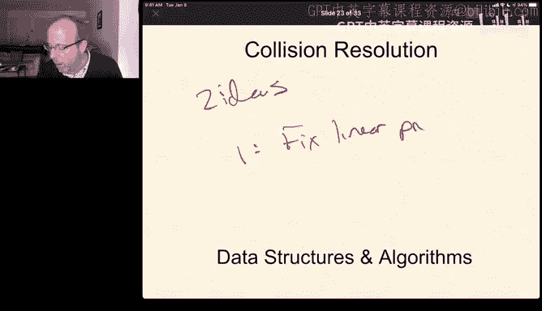

2。Never grow。Alpha passed。And so the next thing we're going to talk about is how what do we do to avoid growing alpha past half？

嗯。Okay， so let me back off a little bit， there are a couple questions that have come up。

So let's just remind ourselves what the terminology is。Probing is when we're using open addressing。

 So open addressing is when we're going to use the elements of a hash table。

The buckets and a hash table to directly store values， rather than separate chaining。

 which uses a linkeded list of values to store things。Probing is what we do when we collide。

 so if two different。Keys hash to the same value。And this bucket is already occupied by some other key。

 we have to find another open space in the table to either insert or to decide the key is not there。

A hit is where we're searching for a key， we find it。

 a miss is where we're searching for a keye it does not exist in the table。嗯。Okay。

 so that's just a quick refresh of， I think that covers the questions that have come up in the chat so far。

So again， the second thing we've taken care of fixing linear programming that's checked off。

 we either use quadratic sorry linear I keep saying linear programming， we fixed linear probing。

We either use quadratic probing or double hashing and the next thing we're going to do is never allow our table to grow past half occupancy and if it ever gets that big。

 we'll make a bigger table。And so that's what we're going to talk about next。Frankie。

 that's exactly right， so for open addressing alpha cannot be more than one because you can't fit more things in a table than you have room in the table。

For separate chaining， alpha can be greater than one because the linked list can store arbitrarily long thing。

Okay， so dynamic hashing is。You can think of as grow the table。

So the idea behind dynamic hashing is we're going to keep inserting things into our table when we delete things from the table。

 we'll mark them as deleted， we'll keep doing this until the total occupancy of the table。

Maybe including the deletions， maybe not up to us becomes。

One over two that half of all of the entries in the table are occupied。

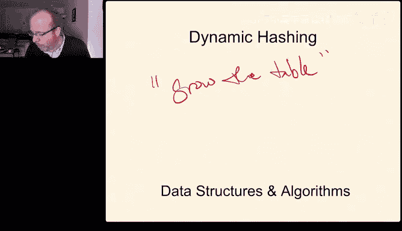

So again， as we've seen as the number of keys in this table increases。

 search performance goes down and it can go down very。

 very quickly depending on our probing mechanism。Separate chaining， search time increases gradually。

 it doesn't fall off a cliff like it did for linear probing。嗯。But。

Doubling the number of keys means on average doubling the list， the length at each of our M tables。

 so it does grow if alpha becomes greater than one and then it becomes proportional to the size of the table。

嗯m。In contrast， linear probing， search time can increase very， very dramatically as the table fills。

 and we might also reach the point where the table is just full。So。The simpleple idea。

Is that we decide when a table becomes too full and we use this magic valued magic。

 we use this value half。Because when a table's half full。

 remember that's about one to three or four probes ish depending know between maybe two and three probes for a hit and a miss。

 even with linear probing that's kind of okay， we can live with two or three each time。嗯。

When it goes above half， things get ugly in a hurry。

 and so what we'll do is that when our table becomes half full。We will double the size。

So we have a table。It's half full。We want to insert something else。

 so we create a table that's twice the size。And then each of these things get rehashed to something else。

And then we continue。Now it's pretty clear that when we double the size of this table and rehash all of the elements that already exist。

 that's pretty expensive。But because we're doing it in proportion to the size of the occupancy。

 it happens very infrequently and because it happens infrequently。

 we can think of it in a way that helps us reason about it being inexpensive。

And this this is our gold friend amortized analysis。

 we've seen amortized analysis once before when we were talking about growing the size of a vector when it became full。

 And remember when a vector became full， we doubled it。

Copiied all of the elements from the old vector into the new vector。

 got rid of the old space and kept the new one around。

And the idea is that every time we inserted an element into the vector that paid for the insertion and for one copy。

So that means that amortized on average， in other words， amortized is another fancy way。

 amortized is a fancy way of saying。On average。So if we average the runtime across all of the operations in our table。

 what is the cost per operation？Amortize analysis comes up a lot when some operations are really expensive。

But they're very infrequent， which means the average cost per operation will still be low。

This means that if you just ran the if you measure the total time like we do in one of the projects。

 we measure your total runtime the total cost is very reasonable。

 but some of those operations might be really really expensive so the operation that grows the hash table that insert is really expensive but all of the other ones are super fast and so in total the whole thing is pretty fast。

嗯。So because most operations are really fast， we can sort of spread the cost of this really big one across a bunch of other stuff。

So here's the idea and one way to think about this。

 suppose you're saving for spring break which we don't have and I'm super disappointed about that believe me I'm at least as disappointed about that as you are because I would like to be somewhere warm but we can't do it so the idea is you know keep you keep a change jar every time you buy a coffee you put a dollar in the jar and at the end of the semester you have a lot of dollars at least if you drink as much coffee as I do you have a lot of dollars in the jar the same thing works here every time I'm going insert。

We pay the cost to do the insertion， and then we basically charge ourselves a cost。

 sort of like the dollar we're setting aside each time we drink a coffee。

 that dollar we're setting aside that time we're setting aside is going to later pay for growing the table。

So we're going to pay a one unit for the insertion and we're going to put an extra one unit aside。

So the first M over 2 minus1 insertions stores。M over 2 minus1。Units of spare time。

The one that makes us reach our threshold。Will rehash。是。Those M over2 minus1 things。

Then will then it will do the M over2 insert。But this got paid。

By the balance that we had laying around when we saved a unit every time we did an insert。

So we get to spread that out， so basically every insert costs us two units。Instead of one unit。

 while two is still constant， so it's still constant time。Average。Or amortized。

So we say that the cost of insert is amortized， constant， even though some inserts。Are very。

 very expensive。Okay， this idea of amortized analysis very， very common。

And when we amortize analysis using linearte probing。Because we're using that threshold at 0。5。

Each insertion in a table is less than half full。The average cost of that is no more than 2。

5 probes because the tables never more than two half full。2。

5 probes is a constant number times M over two， which is order M。So the actual cost of inserting。

I order am。Okay， we're going we're going to store another group of that off to the side and then we can we're going to be able to use that later。

 So when we insert this M over second key we have to build a new table。

So we remove the keys from the old table insert in the new each insert。

Is in a table that's at most a quarter full。So it's at most it's somewhere between 1。2 and1。

 or sorry 1。3 and 1。5。Because we are。We're inserting something into a new table that's at most a quarter full。

 we're going to just guess on the high side we'll call it 1。5 because。

What's a little bit of extra between friends？嗯。So each insert into this table that's at most a quarter full is going to cost us another 1。

5 probes for each of those M over two things， 1。5 times M over 2， that's still a constant times M。

 which is still linear。So we paid linear for the actual costs。

We paid a linear amount for the savings。For for the inserts。

 which means the whole thing runs in linear time。 So to insert。M over two keys。Cosus。Linear time。

 which means each individual insertion is amortized constant。So Samuel。

 what does the balance do the balance the idea is。I'm going to insert a key， insert a key。

 insert a key， insert a key， and each of those insertions of the key is really quick。Eventually。

 I'm going to insert a key that's really expensive。

And when I insert that key that's really expensive。

 I want to have the balance off to the side of savings that I because every time I insert a key。

 I put a dollar in the jar。Insert a key put another dollar in the jar。

 and then when I insert the key and it's really expensive to rehash the whole table。

 my jar happens to have enough dollars to pay for the whole thing。

So the savings are in advance of the expensive operation。

Is there a resize or reserve for hash tables yes there are if I remember correctly unordered map and remember unordered map is the thing that is a hash table in the STL。

 I believe allows us to do reserve， I don't think we do resize that's something we don't typically think about too much。

Okay， so that's dynamic hashing。The next thing we're going to do is is a quick example。

 I'm going to take a moment to。If anyone wants to download this i'm going to take a moment turn my camera off for a sec and refill my water go ahead and download this demo I also have an extra file that that I've made to make it look a little bit simpler and we're going to see a very simple example of。

A chained hashtag。So I'll give you a couple minutes to download that if you want to throw some questions in the chat。

 feel free。And then in about maybe。Three or four minutes I'll resume so if you want to take a break let's take a break until it's by my clock it's currently one o'clock Eastern daylight time welcome to daylight savings we'll reconvene at 105。

So Darren， I was able to use the link earlier today because I downloaded this onto my laptop。

 hopefully it is working， that's a dash O not a dash zero at the top on the command line。嗯。

Need delayed savings more than ever that does make sense， I'll be right back。Okay， sorry。

 I ducked out。Wasn't quite there on time。So。Here's the the。

This is the structure that we're going to talk about， so the hash table。

Hash table is a templated type。It takes three different types and what I'm going to do is I took the implementation of the hash table and just abstracted away the interface so I create this is a file that I created。

嗯。And it's this hash interface， and so we're going to look at the just the interface for the hasht。

 we'll come back and look at the implementation in a minute。嗯。

So the hash table is something that has three templated types， a key type。

SoThat's the type of the key， the value type。Which is the thing keys mapped to。

 And then this is a funter that takes a key and returns。

An integer because we don't know how big the table is so this is actually。

So it's the translation of the key， not the compression。

 the compression happens separately within the implementation of the hash table。嗯。This has。

5ive methods of interest。We can add a key and a value pair to the table if the key already exists。

 this probably should have said that。If the key exists。

 it overwrites it otherwise that it inserts it。Remove removes the selected key from the container。

And I think。If the key doesn't exist， this is just a noop， it doesn't do anything。

Then these next two do basically the same thing， but they do it using different syntax。

 get returns a get takes a key。sorry， takes a key and returns a reference to its value。

And one of the interesting things about get is that if the value doesn't exist。

It will be created with its default constructed element。😡，So a default constructed element。

 any of the basic types， the default constructed element is bitY zero。

 comp any aggregate types uses the default constructor。

So this is a really common idiom this this gets used a lot the alternative is to throw an exception and exceptions are kind of a pain to handle and so often we'll have。

People who design interfaces will design them in this sort of fail safe way that if you ask for something that doesn't exist。

 it will give you the default value for it。There are two different。Methods that do this。

 there's an explicit getter and there's an index operator。

So the operator the square brackets operator， I usually the index operator。And so。

 the index operator。Says given a key return of reference to its value。As get did。

 it will automatically add it with a default constructed element if it doesn't already exist。

And then there is finally a method clear that clears out the hash table completely and removes everything from it so that's the basic idea and let me drop that into a save that's the basic idea behind the abstraction of the hash table that we' the simple hash table that Dr。

 P has implemented。

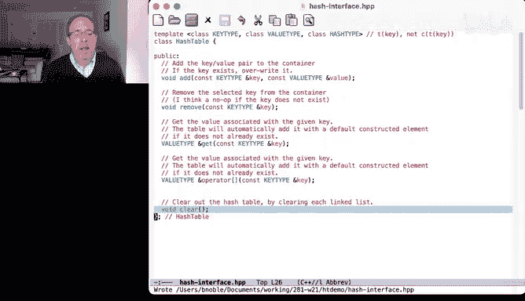

So given this simple abstraction。嗯。

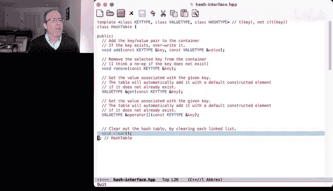

How do we use it？We have a hash table， we've declared， it's going to map from strings to doubles。

And it's going to use a hash function to perform the translation。

 so let's look at the hash function first。So the hash function。

Is an accumulator that works kind of like a raine。Fingerprint。Let me just add that。

So it's very similar to a raine fingerprint， it uses this shift operator as the multiplier that happens to be two to the seventh。

嗯。This happens to be in 32。Max。It also happens to be prime。

 which is kind of a cool little feature of N32 maxs。

So in32 max will definitely fit in an unsigned in Max。嗯。For sure。

 so that's also a pretty handy thing。嗯。The operator， the funter operator， takes its key as an input。

And then just walks each character。Starting with 0 as its accumulator。

 It accumulates this value into 0。 It adds the key into the。It multiplies the existing sum by D。

 that's our shift。It adds the key to it， and it takes the whole thing modo。

 this this prime and then returns it。 So very similar in structure to the raine fingerprint。

 We've seen the rabin fingerprint a couple of times。 Now， this works basically the same way。

 So this will return a number between。0。And Q minus-1。嗯。Q being this prime。Okay。

So that's the table we're going to create let me go back。Get main back into the top。Okay。

So that's the table we're going to create。嗯。And then this driver just demonstrates a couple of really simple things。

The first is。It's going to look to see what David Poetti happens to hash2。

 and at the beginning the table is empty。So table get string will find that it's not there。

 we'll default， construct the initial value， which adds it to the table， or sorry。

 which will be zero。Then we're going to add the value 12，3。4 to the table and we'll get it back。

And we'll see that it's one，2，3，4。Then we'll remove this string。After we remove it。

 we'll use the getter again and it will be zero again。And William， no， Q is not like him， remember。

This function。So this function is the translate step， it doesn't also compress。So it's not M。

 M comes later。

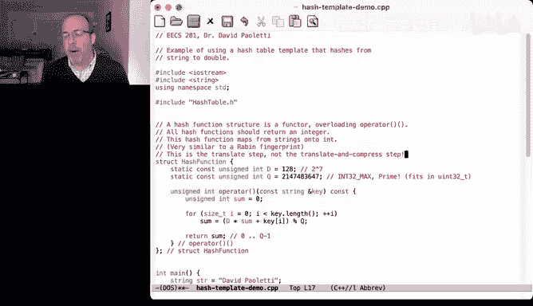

Where does the one， two， three， four come from， it's a simple double that they just wanted to use。

So that'll show how it works using gett。Then we're going to do the same thing with the。

With the subscript operator or the index operator， at the beginning it will be zero。

 then we'll assign it。To be something else， we'll print that value， we'll remove it。

Then this is kind of cool， post this pre increment。

 because we've removed it from the table right before。

 this will then recreate it using the default constructor incremented and return the incremented values。

 so this should be one。And then we'll clear the table。So I'm going to compile this， let me save it。

Okay， that compiles it。And it does exactly what we thought， so it starts out。

So it starts out because David Poetti hadn't never been inserted so。Default can so this。Its this。

 it's the default constructor， then we add it to the table。And after we add it to the table。

 we're going to retrieve that same value， one， two， three， four。

And so we see the value associated with David Polateti is now 1，2，3，4， we remove it， check it again。

 and it's back to zero。And the same thing works with subscripting， so subscripting。

Subscripting starts here and the code it starts here， it works the same way that did with get。

 except it just uses the subscript operator， the index operator。Okay。

So this is the interface and I only have a few minutes left to talk about it。

 so I'm going to talk real quickly about the implementation and you are welcome and in fact really strongly encouraged to look at the implementation and think about it and if you have questions about the implementation。

 come talk to us in office hours we're happy to talk more。嗯。Okay， so it's。

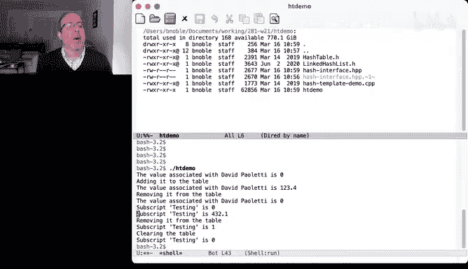

It's implemented in this hash table H is the implementation of that interface。

 and it relies on another interface called the linked hash list。So， this。

The linked hash list implements the chained list of keys that hash to the same value in our table。

And again， this is a really simple implementation， it's not very flexible。😊。

We hard code the size of the table it will always have。251 entries in it。

 no matter how big the table gets， it will have 250 room for 251 buckets。嗯。It's。😊。

Template it over the key type， the value type and the hash type。

The hash type is stored in this value called hasher。

And that reminds that remembers it's like the comparator that you used in the project2。呃。

Priority cues。Same idea this just remembers what that funter is。And then it creates a table。

Of linked hash list values。 I'm going to come back to that。 We're going to so let's。

Take a look at what the linked has list interface looks like。Because it's a table of 251。

Entries of linked hash lists。That take key type and value type。So let me come back to the interface。

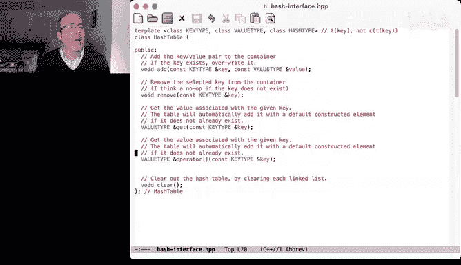

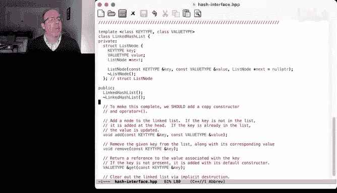

Okay， so。This is the linked hash list， oops， what happened？

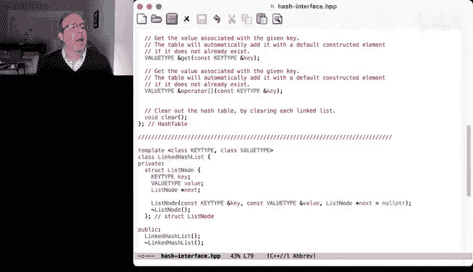

This is the link has list。It represents its containers， its the things it holds in nodes。

 nodes have a key， a value， and a point or to next， sort of what we would expect in a linked list。

There's a way to create nodes， given a key and a value and a next。By default， the next is null。

 there's a way to destroy nodes。Then there's a way to create the list and a way to destroy the list。

Now this is really important， this implementation does not follow the rule of the big three if we were doing this completely。

 we should add a copy constructor and a quality operator。

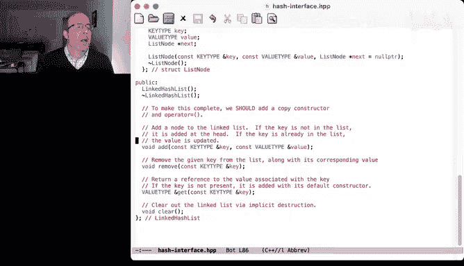

There are ways to add a note to the list。So this looks to see if the key is in the list。

If it's not in the list， it's added to the head， if it is in the list， the value is updated。Remove。

 remove the given key list along with its corresponding value。And again， I think it's a no op。是。

Does not exist， it doesn't do anything。Get returns a reference to the value associated with the key。

If the key is not present， it's added to its default， it's added with its default constructor。

 and there's a clear。 So the hash table is going to be implemented as as a vector of these individual things。

Or actually an array of these individual things。嗯。

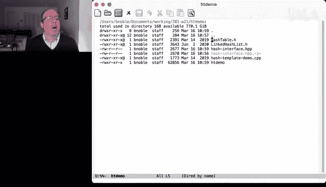

So the hash table。Well， to add。We hash the key， we mod it by the table size， so this is。

The compressed step。So remember that the hassher is the translate step。

 this compresses it to make it fit in the table， and then it adds it to the linked list that happens to sit。

At that index。Remove same thing。Gets the index of the table。Then， it removes。

The pair with that key from the linked list at that index。Get。死 idea dear。Paash is the value。Returns。

 what's at that value， constructing it if it doesn't exist。

And the index operator is implemented exactly the same way that the get operator is。

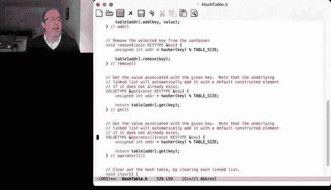

Clear just calls clear。Okay， so all of the good stuff happens inside of this linked list linked has list。

 so let's take a look at that。So this is the implementation of that。

The constructor is exactly what you would expect， it just initializes the values that are passed in。

 the last value is the next pointer is optional， it can be null。This disruptor is kind of clever。

 it's worth going back and looking at it we're already over time。

 so I'm not going to talk about it right this second， but it's worth going over。

I'm going to walk through just。

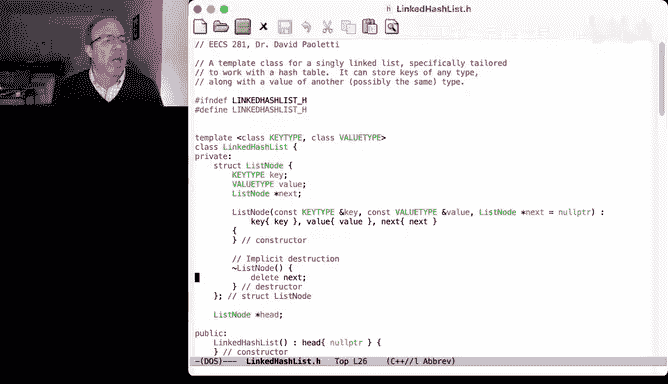

Get because get is actually probably the most interesting one。So get。Remember。

 GE is invoked on a particular linked list。And it's passed as an argument a key。

 and it's going to return a reference to its value type。So it starts with the head。

And while we haven't exhausted the list。So while we haven't， while we're not at nullpointer。

 we still have things to check。See if the current key happens to be equal to the key we're looking for。

 if so， we return its value。If not， we just advance the pointer。If it was never found。

 we have to insert it。 So we're going to create a new version。

Of the key value pair using the default constructor。It's going to be at the head。

 so its next pointer is whatever head used to point。嗯。

It's reestablished and then we return its value。So get is n so get is order of n。

 but where n is the length of these lists。So remember。Get is order。Average。Length of one list。

But the length that remember the links。Of one list。Assuming we have a good hash function。Is。

N over M or alpha。Now， the worst case is that it's linear because everything hashes to exactly the same bucket。

 but again， if we have a good hash function。Relative to the size of the hash table。

 it should work out okay。I know I'm over time by a few minutes。

 so I want to go ahead and bring the formal part to a close。

 anyone who wants to stick around and ask questions in the chat can for the next few minutes and then enjoy the rest of your Tuesday and I will see you again on Thursday while we'll start talking about binary search trees。

So he， that's correct。 So the wild loop usually won't go very far at all。 so on average。

So on average， it's n over M elements。Where， again， and。Total number of key。Value pairs in the table。

And in this case。M is the size of the table。Which we hard coded at 251。Hoti。

 what can be categorized as a good hash function， a good hash function is one that given two keys at random。

Is very unlikely to produce the same value。Still a little confused about the separation of translation and compression。

嗯。Where did we use the result of translation and compression here， that's in the hash table。

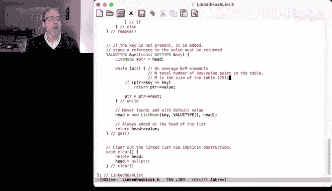

So the hassher。Is the translation of the key？And then we translate the key and taking the mod by the table size is the compression。

And yes， he， this this demo is separate chaining。 This is a chained hash table。You are welcome。Okay。

 it looks like we don't have any more questions so I'm going to go ahead and end the stream again any questions that you have。

 please come to Pro hours or office hours and I will see you again on Thursday and we'll talk about balance search trees and have a good time until then and good luck getting started on Project  three。

