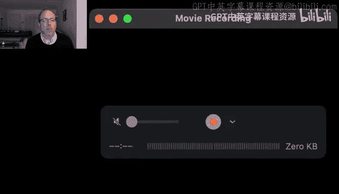
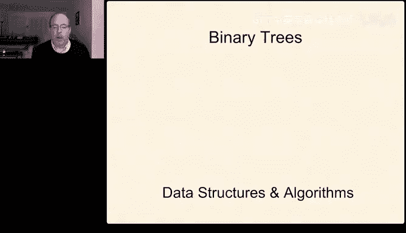
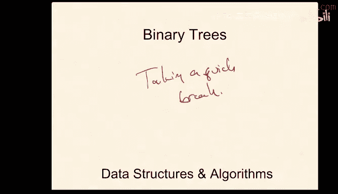
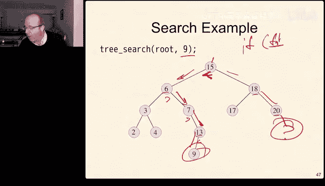
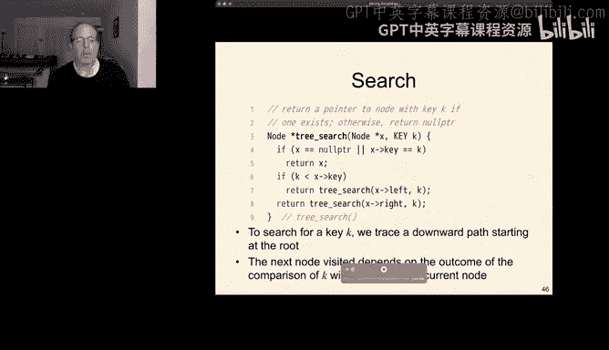
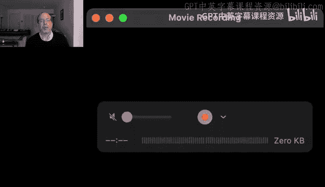
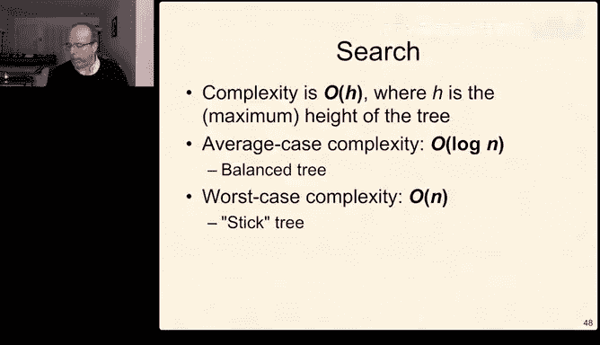

# 密歇根大学《数据结构和算法｜eecs281 Data Structures and Algorithms Winter 2021》中英字幕 - P16：-17-EECS 281_ W21 Lecture 17 - Tree ADT, Searching in Trees, Binary Trees.zh_en - GPT中英字幕课程资源 - BV1snk5BWEfc

So。As I mentioned in the chat， I'm happy to take a few questions and yes。

 if it's about earlier lectures， that's okay， the first is from Massimo。So question is。

 do we use hashing and hash tables only when we know how much input we're going to get beforehand and the answer is no。

 when we do know approximately how much input we're going to get。

 it's convenient because then we can size our hash table originally to be on the order of the number of elements we're going to insert into it。

But remember at the very end of the lecture we talked about last time we talked about dynamic hashing。

Which tracked how full our hash table got。 and if it ever got too full。

 which we used half full as our threshold of two full， we would then。

Create a bigger hash table that was twice the size。

 rehash everything in the old table into the new table and go on。

And one of the things we discovered is that using amortized analysis。

 that still meant that the average cost of insertion。

Was still proportional to the load factor and since the load factor is less than one。

 it's constant time。Even though some inserts are very， very expensive。So the。

Sfik askeds a question regarding deletions and open addressing。 Why can't both insert and search。

 consider a deleted item empty， They could consider deleted items empty。

 but insert may as well use it because a deleted item isn't really occupying any space in a meaningful way。

 It's only telling search that。That this isn't a safe place to stop looking。

But certainly could use that space because we're not using it for anything else。

That's also why hits and misses tend to cost a little that's one of the reasons why hits and misses cost a little bit more a little bit different。

And let me see how。Or doing on attendees， getting there。

We're a little shy of what we normally are on a lecture day， so I'll give it another minute or two。

 and again， if anyone has questions， feel free to fire them in the chat。

So your asks if we only want half of our hash table filled does it mean we initialize the hash table to twice the size of the input if we know that size beforehand and in that case the answer is no well it depends if we're using open addressing then we probably want to have this 50% threshold so if we're using linear probing or quadratic probing or double hashing and we're storing elements actually in the table then having it be about half the size of the total number of inputs we're expecting as a good idea if we're using separate chaining however that's less of a concern because separate chaining given a good distribution of the hash function doesn't have this sort of performance cliff as you get to having a full table with separate chaining the performance gets slower very very gradually instead of very dramatically as it does for open addressing so if we're using open addressing yes。

 we want our hash table to be about twice the size of the input weeks。For using separate chaining。

 we want it to be about the size of the input we expect。So the follow on question is about search。

 why does search consider a deleted item full and not empty？So suppose we have。Our hash table。

And there's a cluster。That's full and we want to insert something somewhere in the cluster。

So we hash to this point in the cluster， using linear probing。

 we keep sort of bouncing around until we find the spot for it to exist。

now imagine that we delete something。Good。We delete something from here。And now we want to search。

For this item again。So if we're searching for this item again and we stop at a deleted element。

 we'd go here， here， here， here， here， and we'd say oh， it's not in the table。

 but it is in the table because we put it up higher so that's why we want to consider a deleted item as occupied for search but unoccupied for insert。

Okay with that i'm going to go ahead and start today's material today's lecture is going to be a little bit different this material doesn't break very cleanly into 80 minute segments。

 so i'm going to stop sort of in the middle of a little bit and that's why we've combined these into one set of slides I think I have a pretty good idea of where i'm going to stop we'll see how things go。

And then we'll move on and Maimo just as an aside， yes， the end condition for search。

 it either finds the element or it knows the element can't be there so it's gone through the entire cluster。

 including any deleted spots。So we're going to start today with some fundamental definitions of how trees work and some basic ideas。

 and then we're going to talk about a particular kind of tree called a binary search tree or an ordered binary tree and we've seen trees already in this class because in project two we implement。

We implemented pairing heaps and pairing heaps use a kind of tree structure。

 they're not binary trees， they're general trees， but they use a kind of tree structure。

 so when we looked at implementing pairing heaps in Project 2， those are a form of a tree。

We're going to start talking more about both today and next Thursday， more about trees in general。

 what their properties are and why they're interesting and some techniques to make them very。

 very efficient for lots and lots of interesting purposes。

So just to start a tree is just a mathematical abstraction that captures common properties of data。

 so collections of data that are related to each other plus the relationships between them given certain constraints and trees are very very common sorts of algorithms we use them all the time for example。

 your compiler when it's creating when it's evaluating expressions that are in the code creates trees that represent the operations and operas of that expression。

 so this tree represents the quantity X plus3。Oneant of the x plus 3。Times the quantity y minus2。

And this is exactly this sort of representation that your compiler will use if you wrote some code int。

Z equals x plus3 times y minus2， it would generate something that looks very much like this in its internal parse tree。

嗯。So more formally， trees are a form of a graph， we're going to say a lot more about graphs in the coming lecture。

 but for now a graph consists of a set of nodes， we'll sometimes call those vertices， so one vertex。

Many vertices or vertexes both are okay， I usually use vertices。

 but sometimes I'll use vertexes connected together by a set of edges。

 So in this A is a node or a vertex， and the line connecting A to B is an edge between A and B。啊。

Every node typically contains some data and sometimes in some graphs。

 the edges have data associated with them too， when we're looking at them in the context of trees。

 the edges only describe connectivity and nothing else。嗯。A tree is a subset。

 so there's the space of all graphs that are possible and out of all of the possible graphs。

So there's graphs。And trees are a subset of graphs。And a tree is a connected graph。

And a connected graph is one in which。All nodes are connected to all other nodes， at least one way。

And it's a tree if it's a connected graph without any cycles。Alternatively。

 it's a graph where any two nodes are connected。By a unique shortest path。

 and these two definitions are the same。So you can describe it as a connected graph without cycles。

Or you could describe it as a graph where any two nodes are connected。

That means they're connected by a unique shortest path。

 that means there's no cycle involved in that connection。嗯。Furthermore。

 we often think about trees as having a designated direction where we can identify parent and child relationships。

 so in this tree E is a child of B because the arrow is directed。嗯。And in a directed tree。

 there's one particular node that's called the root。And in a binary tree。

 every node has at most two children so we can see that this tree is a binary tree because A has two children。

 B and C， B has two children， D and E， D has two children H and G。

 E doesn't have any children C has two children I and F and even if。There was another node。K。

This would still be a binary tree because I has one child and it's at most two children。

 so we're allowed to have zero， one or two children at any node。

There are simple trees where any acyclic connected graph， an acyclic is just a graph without a cycle。

A what it means a graph without a cycle， this graph。Here。Doesn't have any cycles。

 but if I added an edge to it。Now there's a cycle because there's a way to now there are two ways to get from this node to this node。

 I can go this way or I can go this way。So a simple tree is any acyclic connected graph and simple trees don't have directions。

 like I mentioned before， a rooted tree is one where a particular node serves as the root and the way to imagine this is we could pick this tree up at any point。

 so imagine we picked this tree up。By holding that node， and then we shake it。

And then all the other ones sort of come out to the bottom。

 the node we picked it up by becomes the root， and then the weights。

 the way they fall become the parent child relationships。And in a tree。

 any node could be selected as the root， it doesn't matter which one we pick。

 now it will turn out to matter in terms of performance。

But it doesn't matter in terms of whether or not it's actually a tree。So some more just definitions。

 the root。Is the topmost part of the tree？A parent。Is an immediate predecessor of a node。

 so A is parent of B。A child is an immediate successor of a node。

 so I is a child of C because it's immediately beneath。The child。

An ancestor is any parent of a parent， and so let me put this in。Any parent of a parent。

 So H's ancestors are D， its parent。B， its grandparent and A， its great grandparent。Likewise。

 a descendant is any child of a child。Or any child so A's。

A's descendants are the entire rest of the tree。So all of these nodes are A's descendants。And then D。

 E， H and G are B's descendants。Let me just erase this a little bit so that we have have our。

Context back。An internal node is any node that has children。 So in this in this tree， A has children。

 So it's internal。 B has children。 It's internal。 C has children。 D has children。

 None of the others have children。 So the internal nodes are A， B， C， and D。

 and external or leaf nodes are nodes without children。 and so E。I have。H and G。

External nodes and leaves， you will also sometimes see definitions of trees where leaves are we can also sometimes think of。

These children being null and I write I will often write the null pointer as the ground symbol from electrical engineering or circuit analysis。

 it's just an artifact of the fact that I had an EE degree when I was an undergrad。

 you'll see some other definitions called the null pointers the leafaf。

 we won't do that here we will call any node without children a leaf。

One of the other really cool things about trees is that they're recursive structures。

 so the tree rooted at two is a tree。But it's also the case that the tree rooted at six。

 if we just considered six， the subt tree。Rooted at 6， that is also a tree。

 If the entire structure is a binary tree， then all of its substructures are also binary trees。

 because if every node at or below two in our tree has it most two children。

 then it must be the case that every node at or below the tree rooted at6 also has it most two children。

 because it's just transitive。Now， the fact that trees are recursive structures will turn out to be very valuable because many of the algorithms we write about trees。

 although not all， but many will be recursive algorithms and will be able to depend on the invariance of trees being true recursively。

 and it will also make it easier for us to represent trees in a pretty efficient way。

Some more definitions， and again， there are lots of definitions， the height of an empty tree is zero。

The height of any node is。One plus the maximum of its left child's height or its right child's height。

 So the height of the height of this tree is one。The height of this tree is two。

The height of this tree is three。And the height of this tree is also three。

 so that's height equals one。Equals 2， equals 3。嗯。The size is the total number of nodes in the tree。

 so the size of the tree is one plus the size of the left subtre plus the size of the right subt again。

 it's a recursive definition。So in our。In our example。So。In our example。The size of this tree is。

One size plus。The size of this tree， which is2。The size of this tree is one， so it's1 plus two plus1。

 the size of the total tree is four。Depth is very much like height。

 except it's measured from the bottom up。 So the depth of the empty node is0 and the depth of。

Any the depth of the empty tree is zero and the depth of a node is the depth of his parent plus one。

 so the depth of the parent is one。The depth of its children are two。

The depth of those children's children are three， and the depth of D's children is four because it's the depth of the parent plus one。

 and we start it with one at the root。OkayI think that's the definitions there might be one more let's see a nope we're good。

 so let's take a minute。Just take maybe a couple minutes on your own and write down what are the roots？

What are the internal nodes？What are the leaf nodes？What's the maximum depth of this tree？

Pick any subtree and label it and then answer the question is this a binary tree and I'll give you you know just it's about 1219 for now I'm going to give you a few minutes to think about it I'd ask you so when each hold on to questions for a minute because I want to give people a chance to work through this themselves and then we'll come back and we'll answer all of them together。

啊。Okay， so let's take a look at the answers to the quiz。

The root is a because it's the one at the top。Internal nodes are any nodes with children。

 A has children， B， C。An F。Those are the nodes that have children。

 The leaf nodes are all of the others， So E， I， J， K， G， H， and D。The maximum depth is four。

Because this is depth one， depth2， depth three， depth4。

This is a subt you could pick anything D is a subtree， K is a subt， B， any node becomes a subtree。嗯。

And is it a binary tree， and the answer to that is no， for two reasons， one， a has three children。

And F also has three children， so it's not a binary tree， and Monish to answer your question。

 the height the height of A is also for because the height of the tree is always the height of the tree at the root is always equal to the maximum depth of the lowest leaf。

Okay， so that's the set of definitions。Now we're going to move on and talk about a subclass of trees called binary trees。

And as I've alluded to already， a binary tree is just a tree that where every node has it most to children。

 and we're going to add an extra sort of condition to our binary trees that we're going to care about。

 we also might want to have some ordering between the nodes and we'll talk about that a little bit today as well。

So。A binary tree is an ordered tree， there is a linear ordering for the children of each node。

 so there is a less than relationship just like there was a less than relationship when we talked about heaps。

 just like just as there was a less than relationship when we talked about sorted order and there's also an equality relationship。

And remember， from less than and from equality， we can define all of the other comparators。

 So there's going to be an enforced ordering for the children of each node。

 and a binary tree is an ordered tree in which every node has at most two children。

And there are a couple different ways to implement this。

And we' we'll look at those the first is with an array， so remember when we implemented heaps。

 heaps are represented as a form of a tree。In heaps。

 we talked about something that was really convenient called a complete binary tree。

Where the tree has some depth。And the depths。So here's depth1， here's depth D。At depth D minus1。

The tree is complete。In other words， there's a node everywhere in this parent tree and that all of the elements at the level of D are in their leftmost position。

So this is a complete binary tree so if you were going to add a node to a complete binary tree。

 it would have to go right there because that's the only place it could go So that's a complete binary tree and remember we talked about complete binary trees when we implemented heaps。

And heaps， the heap invariant， which said this node has to be more important than every node below it and recursively true that allowed us to implement a heap in an array as a complete binary tree。

And if you remember from when we implemented Heap and Project2 the binary tree array implementation was pretty simple we put well it wasn't simple。

 I actually had to debug I had several bugs in mind so it was easy to explain it was a little less easy for me to implement let's put it that way The route was an index one。

The left child of any node at any node at index I is2 times I。

The right child of any noted index I was2 times i plus1。Now。

 the difference between a complete tree and in general。

 a binary tree is that some of these indices might be skipped because in a binary tree we have a more constrained ordering。

Among the elements that we do in a heap， so in a heap。

The only constraint was the node rooted any tree or sub tree was more important than all of its descendants。

For an ordered binary tree。We can think of a node and its two subtes。

 The left sub tree contains all the nodes that are less than。

The parent and the right subt contains all the nodes that are greater than or equal to the parent。

Now it turns out when we have this constraint， so this is the binary。Tree constraint。

 This was the heap constraint。 When we have the binary tree constraint and we insert a new node into an existing tree。

 there is only one place it can ever go， and it's not necessarily the place that would form a complete tree。

 And so in a binary tree， we may end up skipping some indices。

And so if we're going to implement a binary tree in an array。

 it can be very expensive in space if our tree is quote sparse and so a sparse tree is one where instead of having a complete tree。

 maybe we have，Some node here。Some notes here， some notes here， some notes here。

 and this is a binary tree， but it's very， very sparse because it's not complete。

 There are lots of holes in this tree versus what we would see in a complete tree。

But for completeness， we'll talk about what the expense is。

 the best case that we inserted a key we happen to pick the right place to start with。

 but the worst case we have to check every possible location of，Of all of the leaves。

 there are approximately n over two leaves， so that's approximately linear。

The same is true for remove and remove， it could be very expensive if we have a tree that's kind of a stick。

So we have to check each element until we find the right one to remove。That's linear， however。

 parent in a binary tree implementation。In an array based。

 binary treey implementation is really cheap， it's the index over two in the floor。

The child is also really cheap， it's index times 2 or index times 2 plus1。In the best case。

 if it happens to be a complete tree， it's very efficient in space， it's linear。

 you have to represent all of the elements， you can't do better than linear to represent an elements。

 you need pieces to do it。Assuming they're unique， we'll come back to that in a minute when we talk about compression leader in the class。

But in the worst case， it's two to the end。And it's two to the end again when we have a stick。

So trees can be very bushy。So really complete or they can be very sparse and sticky or like a stick and when trees are like a stick then they're pretty bad for us and Elliot yes best case for a movie is also linear because to remove something first you have to find it。

So we don't typically use arrays to represent bin trees because many binary trees are sparse。

Um and so。Oh， in Svik， the complete， this is for a binary assorted and ordered binary tree。

 ordered binary trees are by definition potentially sparse。For for a complete tree， in other words。

 if it were a heap， all of those operations would be logarithmic we't because remember in search。

 we don't really remove arbitrary keys， we only remove the top。If it was a heap and for insert。

 there's only one place we need we put it in and then we fix up that was logarithmic。

 So if it were a heap ordered tree，It would we can guarantee that we can represent it。

Complete as a complete binary tree for an ordered binary tree。

 which is not the same remember an ordered binary tree is this version where everything in the left subre is less than the root。

 everything in the right subre is greater than or equal to the root。

What's the difference between using the initializer list with？

Curly brackets and parentheses that's a question I actually don't know the answer to I am about two standards behind in my deep knowledge of C++ so that's one I would have to look up。

嗯。So the。Yeah and again， I wish I knew the answer that I know that you can use both and I will come back when we talk next time on Thursday with an answer to that。

 drop me an email aga and remind me that I'm going to do that for us。So instead of using an array。

 we almost never use arrays to represent binary trees instead we use pointer based structures and again。

 we've already seen this because in project two， we built a pairing heap。

And appearing heap happens to be implemented with pointers instead of as an array。

 so typically it's a templated class。The class contains some data。

It's stored in the thing called key and it has a left。Subree， which is by default the null pointer。

 a right subtree， which is also by default the null pointer。

 and we initialize the value key to whatever the user has passed to us。Eliot， yeah。

 it might it might just kind of look cool， I don't actually remember the details and again I'll go back and look them up。

嗯。As for the what whether people choose the and again， we'll have to。

 after I can tell you what the difference is， then I can tell you why we might choose one over the other。

 but I don't have a good answer for that right now。So a node contains some information， the key。

 and it points to its left child and right child， so sometimes I will draw that as K left， right。

and it's very efficient to move down the tree， it's not very efficient to move up the tree because we have no easy way of getting to it without walking the entire tree and finding it。

So now inserting the key best case。Is constant time， so inserting into an empty tree pretty easy。

 that's just going to go at the root。Inserting a key in the worst case， still linear。

 and it's linear if we have a tree that's a stick。Remove key again。

 we have to find it to remove it still linear。Finding the parent is now linear because if we have some node that's deep in the tree and we want to find its parent。

 we have to start at the top and walk the entire tree until we find the one that happens to point to it so that's linear turns out we're not going to need to do that very often and i'll come back to why that is in a second but the intuition for why。

Is that because trees are recursive structures。We either can pass the parent pointer along as we descend in the recursion or as the recursion unwinds。

 we're back to where we're back to a place where we know where the parent was。

 because the recursal call returns to that point。 So recursion gives us sort of an easy out for not being able to remember the parent。

Child is constant。The space， in the best case， is linear because we're going to represent every element with three items。

And O of three is。Per element is o of1 per element or n elements that gives us linear space in the best case。

 and in the worst case， because the representations are exactly the same。So we get a much better。

 you know， anytime you can take something that's。Exponential， exponentials are horrible and bad， bad。

 bad。 When you see an exponential， you have to go running。

 screaming from the room and avoid them at all costs。

 So any time we can convert an exponential to a linear thing， that's a huge win。

 So binary trees using pointers。 And this is a pointer。Basedste。Binary tree。

 binary trees using pointers， big， big whim。OkayThere is another way to do this if for some applications。

 if we need a cheap way to get to the parent。We add the parent pointer explicitly if we have a parent pointer in our implementation and the node is the root and the parent is null otherwise。

 it points up to its parent。嗯。This is very， very uncommon。Again。

 it's not common because for most applications of trees。

 we don't really need to get to the parent cheaply because most of the time we have a recursive function that gives us an easy out for being able to do that。

Now it turns out as an oddity， this is kind of just a side light。

 but it is interesting to think about it is always possible given any general tree。

To buy construction， create a binary tree。So this is a mechanical。

Transformation and it's sort of like the transformation， if you remember from 280。

 when we converted tail recursive functions into iterative functions and there was just an algorithm for being able to do that。

嗯。Same thing， there's just an algorithm that takes a general tree and creates a binary tree out of it。

The intuition behind how this works is that if we have a node with。Some number of children， C1， C2。

 C3， C4。We convert that into a binary tree by having C1。B。The left child of。嗯。Of the new node。

And its siblings become the right children of this， So C1， C2。C 3， C 4。

 So that's not a very efficient structure。 Not now we've converted this very bushy tree into a stick。

But it doesn't work。And then we can justs we can recursively descend through each of these structures and do the same thing。

And so the idea is that when we're moving left， that's a new generation。And right are siblings。

 the root doesn't have any siblings， so the root is the root's right sub childild is always null。

But the rest of the tree might be bushy， it might be sticky in it or more stick like。

 shouldn't you sticky， more stick like。So imagine we wanted to do this with。

A and what I'm going to do， there's a little animation and the animation might run a little quickly。

 so I won't talk about it so much， but I'll come back and point out how it worked。

So we'll start with a note A。Its leftmost child is B， C And D are its siblings。

B's leftmost child is E， F is its sibling。Cs leftmost child is G， H is its sibling。

 F's lessmost child is I， J and K are its siblings。 And so this is a mechanical construction。

 And I actually managed that。 I didn't I couldn't do it in practice。 So。

 and it might have gone a little fast。 So I'm going to talk about it again just in case that was faster than anyone followed。

 So B。Is the leftmost child of A， C and D。Are its siblings。Bs child， and now we're going to recurse。

 so we're going to call it for B， C and D。B's leftmost child is E。E's sibling is F。

C's leftmost child is G。G G's sibling is H。And for D。There's nothing to do because D is a leaf。

 so we're done with D。 Now we recurse E leaf， we're done， nothing to do there。嗯。Recur F。

 F's leftmost child is I， J and K are its siblings。 G is a leaf。 H is a leaf。IJK or leaves were done。

So it's a simple recursive algorithm that given any tree。

Can generate a tree that's guaranteed to be a binary tree。Okay， we're going to take a pause。

We've been going for a little more than。Just about 40 minutes。

 I'm going to just take maybe like a three minute pause。

 collect yourselves if you want to check email， we're going to reconvene at 12， it's 12 38 right now。

 we're going to reconvene at 1241。啊。

Okay。Let's go ahead and pick things back up where we left off The next thing we're going to do is we're going to take a look at some algorithms that work on sorted binary trees。

And the first family of algorithms we're going to talk about are traversals。 So in other words。

 given a tree， how do we process。The nodes in the tree。

 if we want to compute over the tree and either print them all out or maybe add one to every node or do something else if we wanted to iterate over every node in the tree。

 how do we do it？And it turns out there are a couple different ways to make this happen。

And we're going to talk about four of them。And the first three。A recursive descents。And the last one。

Is an iterative desent。U。So the first one is preor and for the recursive ones。

 so all of the recursive ones have the same form。That in the function， they're going to call。

Function on left。Function on right and the question is whether we visit them we deal with the node before we recurse in any of them between the two recursive calls or if we do it afterwards。

So in pre order。We visit the node before we recursively visit the two subtrees。In order。

We visit the node between。Recursively visiting the subre。So it's in between。

 so pre is before in is in between for post order。We're going to recursively visit the trees and then visit the node last。

And something called level order。Which is also called breadth。Sorry。

It's one of those times when I need to be a little more careful about how I'm writing。嗯。

Laf level order is sometimes also called。Breth。First。

 because we're going to examine the breadth of the tree， the others are all depth first。

So the three recursive。Our depth。是。First。Level order is breadth first， where we go each level。

 we go broad instead of deep。嗯。Here are the implementations for each of those and the implementations。

 one of the cool things I love recursion， I'm a big fan of recursion'm'm。😊，I'm。

Hugeually into recursion， recursion is great， and the reason I like recursion is once you've written down the recursive definition of something。

 the code for that is just translate the definition directly into code and it makes a lot of sense。嗯。

So the recursive version of。The preorder。If we have the definition of the node we had before。

 where we have a key and a left and a right is we visit the key， process the key。

 and then we recurse。The definition of post order。Is we recursively descend through the trees and then we visit the Qua。

And the difference the version of in order is we visit， we recurse on the left， then we visit。

 then we recurse on the right。And yes， I definitely sensed this the。Let me actually take a break。

 let's take a minute because I'm seeing a lot of chat in the chat about the projects。

 so I think it's probably worth talking about it for a second。嗯。

There are lots of different ways to attack a project in anyone one。

And I will tell you my favorite way。My favorite way。Is I print the spec。

 I go to a quiet place now I used to go to my favorite cafe or the library on the west side which has a cafe attached to it I don't get to do that anymore。

 so I go to the couch in the back here I print it out。

 I get under a blanket and I read the spec from beginning to end。Then I put the spec away。

And I don't look at it again for at least 24 hours， and I go to work on something else。

And then the next day I do the same thing， I get under the blanket， I pick up the spec。

 and I read it and I start circling the things that I don't remember ever reading before。

And there are usually a lot of things that I'm circling that I don't remember ever reading before。

But after I've read it a couple times。Then I start thinking about sort of the big picture architecture of how I want things to work and I talked about this a little bit in one of the video explainers that I posted earlier in the semester。

 I think about structuring my program a lot like I think about structuring an essay where the functions are like paragraphs and each function should do one thing。

So I start plotting data structure， start plotting functions， and then I'll fill out little bits。

One of the things that I really encourage you to do next is。

Once I build some little piece of the program， I test that little piece right away。So for example。

 when I solved Project two， and I wrote the comparator for the heEap。For the for the Jedi。

 the Jedi comparator and the Sth comparator， the very first thing I did was hand code a bunch of deployments that had some ties。

 and I dropped each that list of deployments into the Jedi heap and into the sch heap。

 and then I pulled them out again to see if they were right and printed them。 And sure enough。

 I had gotten the tiebreakers wrong。Now I found out that I got the tie breakers wrong right after I wrote the function。

 instead of days and days later when I got the feedback from the audit that said。

If your error is online 472， you might be breaking ties wrong。

So incremental building and incremental testing is really， really helpful。But I do one more thing。

 And this is my， this is my most important。 So if， if you remember none of the rest of my advice for the rest of your careers at Michigan and beyond。

 remember this piece。Because the next thing I do is that every time I'm working on something other than the project。

And I need a break。I keep a copy of the printed spec next to me。

And I put a sticky note where I stopped reading it。

 and whenever I need a break just a couple minutes。

 I'll pick up the spec and I'll read the next two or three paragraphs。

 and then I'll put a sticky note down。And when I read those next two or three paragraphs。

 I'll take a note of things I never remember reading before。 and I keep doing this。

Until one of three things happens。one。The deadline arrives。

Note since working on it after the deadline two， I complete the project and pass all the test cases and I'm happy with it。

Or three。I have read all the way through the spec from beginning to end and haven't found anything that I thought was surprising。

Now， if I'm not the one who wrote the project in the first place。

Which is true for all of the 281 projects， true for some of the 42 projects。

And it's even now true for a couple of the 280 projects if I wasn't the one who wrote the project in the first place。

 three never happens。I never。Get to the end of one of these full reads of the speck without realizing。

 oh， I don't think I ever remember seeing that or， oh。

 I don't think I did that or something that jumps out at me as a surprise。

 That's because these things are complicated。They are complicated to the point where it's really hard to keep everything in your head all at once and expect to have all of the details right。

Now some of that could be because I'm 52 and my brain has deteriorated to the point where I just can't do it anymore。

 but I don't think so because this has been true for me for a very， very long time。

 so continuously reading small chunks of the spec and you only want to read two or three paragraphs at a time because if you start reading a whole bunch more than two or three paragraphs。

 you're going to start glossing over stuff and you're going miss the things you missed the last time you read it or least I do like let's let me use this in eyephrasing。

 I will miss things if I read more than three paragraphs at a time。

I will start glossing over details and I'll miss the same details that I missed the last four times I read this。

 so it slow incremental reading is really， really， really helpful。

Okay pop the stack let's come back to the recursive implementations so as I mentioned the recursive implementations and Matt that's a really good you know skim it and then read in more detail a recursive read of the spec is also a really good way to do that and I think I find myself doing that with longer specs as well that's really good advice。

嗯。😊，So again， the recursive versions they all recursively call left and right and the question is just whether I visit before in the middle or after in pre I visit before in in I visit in the middle and post I visit after and post visit is just whatever we're doing with the element and for now let's think a visit。

As being print。So we'll think of it the same way。All right， so to summarize。

Pre order in order and post order are all depth first。Recursive。

Tversals level order is breath first and it turns out we will write this。Iteratively。

 when we get to that point。Okay， so take a moment。And given this tree。And remember， it's。

The the form of our functions is。Recurse。Left。Recurse。Right。And we either visit pre。In or post。So。

 pre。And。So given that general form of recursive dissent。And this tree。

 what order do the nodes get visited if we're visiting in pre order in order， post order。

 or so these are the three recursive versions。Or level。 And remember， level is breadth first。

 where we do all of one level before we come to the next one。So for take just a couple minutes。

Maybe two or three。And。Take a look at the nodes， take a look at this and see if you can come up with the preorder。

 the in order， the post order， and the level order of each of these。

I need to get the Jeeopardy theme music that we can play while we're doing this。Okay。

 let's take a look so for pre order， we're going to visit。Visit。😊，Then left recursive visit。

 then left recursive visit。Then， left recursive。That's it that we're done， right recursive。

 we're done， pop， right recursive we're done， pop， right recursive visit， left recursive visit， so 0。

1，2，3，4。AExcell， so zero， one， two， three， four was good。In order， we recurse left。Recur left。

Re curse left。The course left we done。 pop2。The curse， right， pop。Park。Visit one， re right， pop。

Is it zero or curse right？Curse left。Left， pop， visit， right， pop。Visit right。 So this is 2，1，0，4，3。

2，1，0，4，3。And then。For post order， we recur left。Left， left， left。 Po， right。别 it。😊，Pop right visit。

Pop， right。Left， left。 Top right visit。Pop right visit。Pop visit。 So I think that was 2，1，4，3，0，2，1。

4，3，0， excellent。And then level order， level order is， in some sense， the easiest one。

Because for level order。We're just going to start at the root。And then 1，2，3，1，3， and then 2，4。

 So it's 0，1，3，2，4，0，1，3，2。Yeah。Now。That's given a tree， you can compute its various traversals。

 One of the other cool things is that given。And given two traversals， you can order the tree。

 You can draw the tree， and you can't do it with just one， because， for example。

 if we only had preorder， well we know7 is the root。Because it prints before it descends。

 So seven is definitely the root。 But three for preorder， we don't know where it could go。

 It could go either left or right。 So we're going to use some other traversal to tell us how to do that。

 and this example will walk through both of those。So for this， we know that7 has got to be the root。

That takes care of7。3 is the next one that we're going to consider。

3 could be either seven's left child or the right child。 we don't know yet。Now。

 because three appears。To the left of 7 in the in order traversal， that means 3 must be。

On the right hand side。And sure enough that or sorry， on the left hand side。

 So I will also apologize。 I， I periodically。Confuse， left and right。

But I do it non deterministically。So I will， with some probability P that is greater than 0 and less than one。

And actually close to about maybe 03， I will say left when my brain is thinking right or I will say right when my brain is thinking left。

Now back in the days before GPS， which。II know probably none of you remember。

 but there was a time when we didn't have GPS routing and we had to use paper maps to get hither and yawn。

 And if I was the navigator and my wife was the driver， I would occasionally say， go right。

 pointing left。And she would respond， do you mean left， right or right， right， I said。

 oh of course left， of course I meant left。As a result。

 I was very rarely allowed to be the navigator and I was usually the driver because if she said left I would do the right thing but I couldn't produce the right word。

 so I will probably do that and and I will apologize。Okay， so we've placed three。

Now we want to play six， six can be the children of any of these。

So it could go be the left child of or the right child of seven。

 or it could be either child of three。Well， six。Is to the right。Of three， but the left of 7。

 So it's to the right of three。But the left of 7。 So 6 has to go right here。 And once we've placed 6。

 we know nothing can ever be to the right of three or to the left。 Sorry， to the left of。

 I don't have to do this permanently to the left of three。嗯。

And so we no longer need to consider that as our next segment at all。 So that's place six。

 Now we have to figure out what to do with nine。Well， again， nine。

If we're only using preorder can be in any one of these three positions， but if we look at9。

 it's to the right of seven。So it has to go to the right of seven。 And that's where it lives。

ItTake care of nine now we're looking at eight。E could go in either child space of nine。

 but because it's to the left of nine。It has to go there。13。Could be。

Either child of eight or the right child of nine。But 13 is to the right of 9 in the in order。

 so it has to go here。And once it goes there， that means nothing else will ever be to the left of eight because we。

We haven't gone there anymore。And then finally， we can do the same thing with 27 and 27 lives to the right of 13。

嗯。And Asha， I can't imagine getting anywhere without a GPS anymore either， in fact， it is amazing。

How fast I lost。Some fairly important spatial reasoning abilities， once I started relying on a GPS。

 I just stopped thinking about where things were because it tells me and I don't have to think about them anymore。

 which is pretty interesting。Okay， if we're going to do a level order traversal。

 that's breadth first。And so the next thing we're going to do is look at a function that does that and I'm going to build this function one line at a time。

So the first thing we're going to do， remember that we're going to start' going to the argument to this function is the root。

They wrong。No还。We。Oh， interesting。 It does censors。 I forgot about that。

 I was pushing too hard on it。Pool。So we're passing in the route， the tree could be empty。

So the first thing we have to do is check to see if it's an empty tree， if it's an empty tree。

 we just returned， there's nothing for us to do。If it's a not empty tree。

 what we're going to do is we're going to use， this is going to remind you a little bit of the Q。嗯。

Search from Project one when we were searching for the princess so in Project one when we were looking for it wasn't Princess Peach I forgot what we called her in the hopes that we weren't violating copyright somewhere when we were looking for the princess we would insert things in a queue and then we would pull them out Countess Countess chrry。

 thank you。So what we're going to do， we're going to work similarly to the way we did when we started with a start location in that search。

 we primed our queue with the start location and then we had an iterative algorithm that worked on it。

 we're going to do the same thing here so we're going to have a queue of pointers to nodes。

And we're going to push the root into that queue to seed the cu and then。

We have a wild loop that's going to iterate。 and as long as the queue is not。Is not all。

As long as the queue is not out of。Out of nodes， we'll continue to be able to revise them。

continuetinue to be able to search through them so as long as the queue is not empty。

 we're going to get the front。And then we're going to pop it。嗯。Yeah。

 imagine getting a ease to diss from Nintendo。 It could happen。 Yeah， no no doubt。

 and this is another idiom where we see this idiom a lot where we where we。

Take a front and we pop immediately afterwards so that we know that we've quote。

  removedd it from the queue。We'll print it。If this node has a left child。

 we'll push it into the queue， if the node has a right child， we'll push that into the queue。

And then we'll return。 And so the idea is at the root。Will' first push all of the children。

 the left child and the right child into the queue。Before any subtes are examined。

 so we're going to get both of these before we get any of these。

 And because we're doing this in Q order， we'll do the same thing。

 So when we pull the left child out， we'll get the left child's children first。

Then we'll pull the right child out and get the right child's children first。

 and then because it's a cue， we're going to go here next。So we get this behavior。Of。

Sort of a winding descent down the tree。Okay， so that's the basic idea。So yes。

 it is similar to some of the functions in Project two so for example。

 when we removed the top element of the pairing queue and then we created a queue that did pair insert pair creations。

 I actually did mine in something that looked more like a stack because I did the forward and then backward version。

 but there were lots of ways to do it in an iterative queue until it's just got one thing left as another way to have done Project2。

嗯。So the question is why do we why do we？Note Q front and then pop。

Right away instead of using Q front and pop at the end。Um。

So I like to use there are two parts to this question。

The first is why do we create a variable for Q front instead of just reusing QF？

I like that for a couple reasons， one， if you keep reusing QF that continues to call that function over and over and over again。

Now。It may be the case that the compiler can optimize that away in some circumstances if it knows that。

There are some but it's very rare， so I want to call this function exactly once。

And store the result in some local variable， so I don't have to keep calling the function over and over again。

The second piece of that question is， why do I pop right away？

And the answer for me is I want to pop as soon as I know it can be popped because otherwise if it's a long function。

 it's easy to forget so this idiom says remove the top node and use it。If I push the pop down later。

 it separates the removal from the use of it and that makes the code just for me it makes the code a little bit harder to read and yes。

 front is order one， but function call and function return cost you something。

And maybe when we come back next time， so I have two things that I have to do。

 I have to look up curly braces and we have to look at the costs of function call and return because function call and return can cost you something。

嗯。Because you have to push things onto the stack and pop things back off the stack and you have to keep doing that over and over and if you can avoid doing that work。

 it's better to avoid doing that work， it's much more pleasant to avoid it than to do it if you can get away with it。

Okay。The best code is no code Yeah I'm a big fan of writing as little as possible because every line of code I write with some probability P has a bug。

And my value of P is pretty high， it turns out other people's values of P might be lower。

 but my value of P is pretty high。Okay。So getting back to this binary search， this ordered business。

 remember I talked earlier in the lecture about the idea that the root。

Has a left subt and a right subt。In the left subte， all of the nodes are less than the root。

 and in the right subt， all of the nodes are greater than or equal to the root。

So that's this same thing in text， key the key of the node is greater than things in the left subt and less than or equal to the things in the right subt。

ow。One of the other cool things about this is that that means insert。

Is almost exactly the same as search， because that turns out that with this constraint。

When we're adding a new element， there is exactly one place it can go。

And it's defined by this recursive invariant of the binary search tree property。

So while we're inserting， we just search until we find where that node would have gone。

 and once we run into a leaf， we put it where that leaf points。And then， we're done。Okay， very。

 very cool。So this is two different versions of the same set of data。

 so notice everything in the so in the first tree， everything to the left of six is less than six。

Everything to the right of six is greater than six。At the sub rooted at five。

 everything to the left of five is2， everything to the right of five sorry everything to the left of five is2。

 Everything to the left of five is less than five。 Everything to the right of five is greater than or equal to5。

 they happen to be equal， but that's okay。UAnd same thing with seven。

 every there's nothing to the left and everything to the right of seven is greater than or equal to seven。

U。This is the same。Tree or the same data。In a different shape。

But it still works because everything to the right of two is greater than or equal to two。

Everything to the right of five is greater than or equal to5。

Everything to the left of 7 is less than 7。 Everything to the right of 7 is greater than or equal to 7。

 Everything to the left of 6 is less than 6。So one of the things。

One of the things that's interesting the take home about this particular example is that。

The shape of the tree depends on the order in which elements are inserted。So， order。Of insertion。

Dictates shape。And we'll see why as we develop this going forward， but that's the essential idea。

And remember， the other thing that we've been thinking about when we talk about trees is that。

Busushy trees or complete the more complete the tree is， the more efficient it is。

 because the depth is log。And the more like a stick a tree is。

The worse it is because the depth becomes linear。So the order in which we see elements inserted into our binary search tree will determine whether our tree looks more like this really dense shrub like thing or more like this really awful stick。

And yes， Joseph the idea is the root can be anything and the root will be the first element inserted into the tree because when we start with an empty tree and we insert a root。

 the root the new node becomes the root and that's where it goes and then if we insert the next element we're going to check to the left or right depending on whether the next element is less than or greater than or equal to。

Okay。So to sort of bring this home。Let's think about this tree and we'll write the output for in order preor and post order traversals of the binary search tree。

In order。So it's， we recurse left， left，2， pop 5。And I'm going to underline the second five so we know which order it was visited in。

5 pop。Visit6。No recursion， P visit。No recursion P 8。 So the in order is 2，5，5 underscore 6，7，8。

And as we look before， I'm not going to go through the details of preorder because it's a little less interesting。

And the same with post order， but remember pre order， the root is always the first one， post order。

 the root is always the last one。One of the other things about preor and post order。

 post order changes the order in which these two fives appear。

 preorder and in order happened to preserve them。Okay。

But one of the things that with this definition。There's something kind of interesting about the in order toveral。

And the in order traversal is in order。That will turn out to be kind of interesting。嗯。

Which I kind of gave so I kind of gave I forgot that I'm giving this was going to be a question I was going to ask you so given that the in order traveral is in order。

That gives us a way of sorting something using a binary search tree。嗯。

Because if we just insert all of the elements into the tree and then do an in order traversal。

 they're going to be in order because again。If we have a node。And a left subre and a right subt。

 and these are all less than。And these are all greater than or equal to we're going to if we're using an in order traversal。

 we're going to print all of the less than things before the node and then all the greater than are equal to things。

And since that's a recursively true property， that will work all the way down to the leaves。

 and this will end up sorting our tree for us。So a binary search tree where we preserve the binary properties of less than or greater than or equal to。

 this turns out to be an incredibly powerful and cool data structure。Okay。

 so I think I have time to do one more topic before we'll close for the day and then we'll pick it up here when we come back a week from today because next Tuesday is a wellness day。

 so I won't be giving a lecture next Tuesday。So how do we think about search。

 how do we find a key in the binary search tree and so the idea is that we're going to return a pointer to the node that contains this key。

嗯。given。A root。是。And the key we're looking for。And this is going to return the pointer to the node containing the key K if it exists in the tree。

 otherwise we're going to return the null pointer。And remember because of this binary search tree property。

 the key of any node is greater than the key of all of the nodes in its left subte and it's less than or equal to the keys of all the nodes in its right subte。

So we'll think about what are the average and worst case， we'll think about how to do this。

 and then we'll think a little bit about what the average complexity of this is and what the worst case complexity of this is。

So first， let's think about search， so the way search works。

And I'll just give the let me give the intuition on this page， we're going to start at the root。

If the route's empty， it's not there， we can return null pointer。

But if the root exists and it's the thing we're looking for， well。

 then we're going to return that note。If the root isn't what we're looking for and it's greater than what we want。

 we're going to look in the left subree because if it exists。It would have to be in the left subt。

If it's not the root， but it's less than， but the root is less than the thing we're looking for。

 it has to be in the right sub tree because everything in the right sub tree is greater than or equal to。

So if the root is greater than the thing we're looking for， we're going to search in the left subte。

 if the root is less than the thing we're searching for， we're going to search in the right subte。

That's the intuition behind the algorithm， and this is the algorithm implemented。

So were it's going to be a recursive we're actually going to write this iteratively。

 you could write it recursively and I might what I might do is write this recursively and bring it to start with us next time。

 but we're going to do it iteratively for now。嗯。So the first thing is。

We could have been past nu the empty tree。And if it is， we better not actually dereference it。

If it's not the empty tree， then we can compare。The root of this tree or the node we're currently considering with the key we're looking for。

 and I want to put I want to make an aside on this。In the exam in question 26。

 I graded questions a number of question 26es and many people used the following structure。嗯。

They would say if。嗯。Something like Q top。And。Not too empty。

And that turns out to be unsafe because when we have a logical and。

 we evaluate it from left to right， short circuiting。So if the first condition is true。Or sorry。

 if the first condition is false， we know the whole thing has to be false。

 we don't have to evaluate the second condition。 But if the first condition is true。

 then we have to evaluate the second condition。 In this case。

 we don't evaluate the second condition until after we've evaluated the first condition。

 and this is unsafe。 If it's empty， it's undefined。

So just sort of as a side note that I wanted to mention something that I saw pretty commonly。

 I would say I saw that one out of every five or six exams that I graded in question 26 so that was a fairly common error and it's one that can get you into some pretty serious trouble down the road。

Okay， so coming back to our example。If we haven't run out of room。Yeah。

 just I've had a lot of s faults doing this too， which is how I've learned it the hard way if we haven't run out of the tree so if we haven't gotten to the bottom of the tree and found nothing。

And thing we're not looking the thing that we have is not the thing we're looking for。Well。

 if if the key is greater than what we're looking for or what we're looking for is less than the key。

 it has to be because remember there's the key。Here's the left subree， which is less than。

 Here's the right sub tree， which is greater than or equal to。

If what we're looking for is less than the key we're currently considering。

Then we're going to check the left subte。Otherwise。

 while it's not equal and it's not less than that means it has to be greater than we're going to check the right subree and then we recurse。

 So if we were looking and it was in the left subte， then the next the next the X X starts here。

 X moves from there to point to this left subree and we'll just descend we'll make our way down the tree So if we have some tree。

 we start at the top and we sort of make our way down the tree until we either find the node or we。

Run out of room， so if we find the node。Then x points to the node that contains the key。

 if we ran out of room， then x is the null pointer either way returning x is fine。Sorry。

 I kind of made that a little unreadable。 I me erase that。Okay， so search will run。

On the order of the height of the tree。Okay， now if the tree is really wide and bushy。

The height of the tree is logarithmic。If the tree is a stick。The height of the tree is linear。

So the runtime of search depends very， very much。On the overall structure of the tree。

And when we come back。We'll come back and we'll look in an example。

 in fact now let me do the example really quickly。Just because I know we're at time。

 but let me use one more minute。So if we're looking for the key9 and we're going to start at root。

 well，9 is less than 15。So it has to be in the left subte then we're going to consider six。

Nine is greater than six， so it has to be in the right sub tree then we'll consider seven。

9 is greater than 7。 So it has to be in the right sub tree， Then we'll consider 13，9 is less than 13。

 So it has to be in the left subtre， and we found it。

And if we were searching for something that didn't exist in the tree， say 23， well。

 23 is greater than 15， it has to be in the right， 23 is greater than 18， it has to be in the right。

 23 is greater than 20， it has to be in the right， whoops， there's nothing there。

 we return the null pointer。When we come back， we'll see how we can start working on some of this。

Yes，ga， the question is if we had the line of code if。False。

And。Unfined。That's safe， this is called a guard。嗯。Yeah， and so sorry， I am。 I。

 you type in the chat before you saw my my response。 But yes， so when we have this， this structure。

 So we'll say if。Not X。 And X。K equals 3。This is called a guard。So if not x is false。

Then it doesn't evaluate the rest of this and it's totally okay if or sorry， this would be ifx。Okay。

 so if x。And x D reference k equals3。 So this will only evaluate the second half if this is not null。

So this guard is one of the this is a pretty common technique。

 we use it quite a lot and it's a way of being able to track。

why's doing that it's a way of being able to track what's going on so with that I'm going to pause today we'll pick up where we left off next time and Monish you have a question about one of the lectures on strings please feel free to fire it away and I'll stick around for a few more minutes until 130 if people have other questions they want to put in chat otherwise I will see you in a week and enjoy decompressing a little bit on Tuesday and good luck continuing with project three。

Someone each to go ahead and fire away。Is it true that the string A is less than the string B is less than the string C。

 and I believe the answer to that is yes， because the less than operator is defined for standard string？

In fact， let me pull that up real。啊。So， the。So。String does define。啊。

So the question is if that's true， how'll come when I do quote a and quotes B and C plus plus you get false。

 that's because quote A。In C++ is a C style spring， not a C++。Okay。

And so what you're really comparing in with C style strings。Comparisons are on the。

The comparisons are on the pointer to the first character， not the string itself。

 so if a happens to appear before B in memory， that will be true if A happens to appear after B in memory。

 that will be false。So this is one of those times when managing the difference between C strings and C++ strings is really。

 really important。So if you said string a equals。Because。哎。String B equals。B。Then， a。

Less than B would evaluate to true。Okay， if you think so if you think that doesn't work。

 I will double check it and make sure that it does work and I will report back so I have three things to report back on curly braces。

嗯。Of a。Recursive version of binary search and spring comparisons and whether they are defined lexiographically or not。

Okay。And I'm happy to take other questions， if anyone has more。

