# 密歇根大学《数据结构和算法｜eecs281 Data Structures and Algorithms Winter 2021》中英字幕 - P17：-18-EECS 281_ W21 Lecture 18 - Binary Search Trees; AVL Trees.zh_en - GPT中英字幕课程资源 - BV1snk5BWEfc

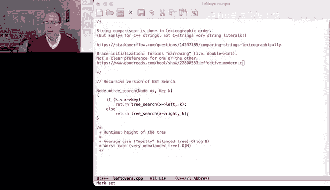

Okay， good morning， good afternoon and good evening。咁。Okay， getting close。

 I'm going to give people just a few more minutes to filter in I'm not going to wait as long today as I often do。

Because today is a pretty packed lecture。I want to try and get everything in if we can。Okay。

 as we're having people filter in， there were a few things that。

We're left over from the last lecture that I wanted to mention。

The first question that came up is string comparison and what order it's done。

 and I did look into this， the strings are compared C++ strings。R compared in lexographic order。

But not C strings and not string literals because string literals turn out to be interpreted as C strings。

 not C++ strings unless you explicitly cast them。And there's a really good stack overflow thread on this。

That I found， I thought was really helpful， so I'm going to post that into the chat。

In case someone finds it useful to look in。The other。

Thing that came up that I didn't have a good answer for last time was brace initialization versus parentheses initialization。

And the key difference between brace and parenthe's initialization is that brace initialization forbids narrowing。

So for example， if you're supplying a double to a type that is an integer in most other circumstances。

 that will automatically be converted by truncating the double。

 so narrowing it throws away a little bit of the information of the double。

If you use brace initialization， then that is an illegal initialization because brace initialization does not allow for narrowing and narrowing。

 I'll just add that into the。Narrowing is throwing away。Information。U。

I saw a variety of opinions on this， some people were pretty strongly in favor of always used braces。

 some other people there were some moments where maybe it wasn't a great idea and I was pointed to a really great reference that talks about this and a lot of other things this book is by Scott Myers。

 this effective modern C++ I have several of his books。

 I have this one I't read I haven't read it all yet， but he's excellent at being able to describe。

Some of the trickier features of the language and why you might or more importantly might not want to use some of them。

 so I'll put that in the chat as well。Okay， someone would like to pick that up。

Highly I really like his writing and I think he's really clear and concise。

And I found it pretty helpful。嗯。Switching over to slides。

 it looks like I do have a little bit of a lag again between my tablet and the display and I tried to restart it。

 I don't know what else to do so hopefully it won't be too disturbing but I'll try and be mindful of it as we go。

So just to refresh your memory so far we've been talking about data structures called trees。

Trees are undirected or sorry trees are fully connected but acyclic graphs。

Most trees are directed and that they have a designated note that is the root。

 roots can have children， any node that has children as an internal node。

 any node without children is a leaf node。And then we started talking about a particular data structure called binary search trees。

Um， where and again， in a binary search tree， we have a node and for every node。

Anything in its left subt is strictly less than。The value of the node and anything in its right subte。

Is greater than or equal to the node greater than or equal to if duplicates are allowed strictly greater than if duplicates are not allowed so this is the basic data structure that we're thinking about。

There's one other thing that I promised。Which was to。Show you。The recursive version of tree search。

 remember for tree search， we started a node if it's the one we're looking for。嗯。Oh。

 this is totally wrong。So I left the base case out， so if we found the node we're looking for。

 this is the node we're looking for， if we haven't found the node we're looking for。嗯。Oh。

 and this is also wrong because if。X or。Sorry， I should have paid a little more attention to this when I did it。

 so if x is the null pointer。We haven't found the note in the tree。Otherwise。

 if K happens to be equal to the。Notode we're looking for either way we return x。

 x is either the null pointer because we didn't find it。

It's either the null pointer because we didn't find it。

 or it's the node that happens to hold the key if we did find it。If neither of those are true。

 it's not null and this isn't the node we're looking for。

 then if the key node we're looking for happens to be less than the current one。

 it's got to be in the left hand tree， otherwise it's got to be in the right hand tree so that's the recursive version of the binary search tree search algorithm。

 the runtime of this is the height of the tree because each time we're descending one level。

The average case in the average case nodes that we're inserted in sort of a random order with random values。

 we'll have a mostly balanced tree which gives us logarithmic runtime。

 but in the worst case we have a stick， a very unbalanced tree。

 that'll be linear time and we'll talk a little bit more about how we get to either of those as we develop our notion of trees as we go along。

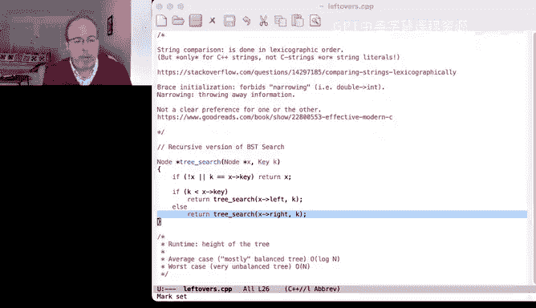

So that brings us to how do we build these things， so we know how to search them。

 how do we build them， and it's very similar to search and the idea is we're going to start at the root。

And we're going to if the is where we if the route is where what we're looking for or sorry。

We're not searching anymore， we start at the root and we keep tracing a path。

Through the tree until we find an empty spot where this node could legally go and we'll put it there。

So for example， if we wanted to insert the node a node with a value 15 into this existing tree。Well。

15 is greater than equal 15 is greater than or equal to 15， so it's in the right hand side。

 it's less than or equal to 18， so it would be in the left hand side， it's less than or equal to 17。

 and so what we'll find。Is that in fact that is exactly where it goes， it belongs right there。

So that's the basic idea and the example of how this does。

 and I'm also mindful that maybe I'm going a little bit fast so I'm going to try and slow down a little bit。

So when we take a deep breath， have a little tea。And then we'll move on。嗯。

Now when we think about this， the previous example we used talked about how do we handle how to duplicate insertion because we were inserting 15 into a tree that already has 15 if we don't have duplicates then we're always we're either going to return that we've already got the node in the tree or it's strictly less than。

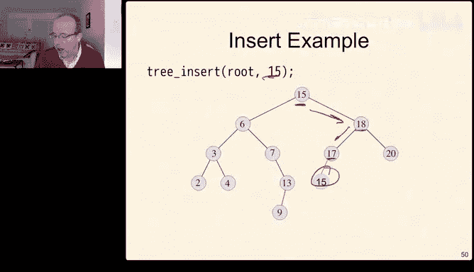

Strictly less than or strictly greater than。If we have duplicates。

 we have to pick which side of the tree is going to have the equal the values that are equal to the root。

 you could choose either one， the STL uses this side and so pick that's the one we pick。嗯。

So we are willing to so we have to pick one particular way， the STL chooses this particular way。

 we're going to use the same way as we build out our binary search trees。

Here's the code that does that， so we're going to insert and one of the things I want you to pay particular attention to is that we're passing a pointer to a node by reference。

So one of the things whenever you see a complicated or a complex type signature。

 I tend to read them inside out， so this so X。X is a reference。To a pointer to a node。

Which means that if we change the value of x， we will change the value of the pointer that was passed to us。

 not just a local copy because it's being passed by reference， not by value。

So if were in if we found an open spot in the tree。This is where this node goes。

This assignment will modify the version of the pointer that we were passed。

 and if this is an empty tree， that's the root pointer。So if it were an empty tree， the root pointer。

Would point？To our new node end。Now， if we haven't found a null pointer。

 we haven't found an empty spot in the tree yet， we have to keep looking until we find the empty spot。

If the key we're inserting is less than the current key value。

 it has to be in the left hand side of the tree。Otherwise， if it's greater than or equal to。

 it has to be in the right side of the tree， and these are just recursive calls。

So we do a recursive descent through the tree， very similar to the way we saw insert work。

And as soon as we find a null pointer， so if we have an arbitrary tree。嗯。

And the node we're looking for belongs here will create the node and set this child pointer to point it because we're passing that pointer in by reference。

So a little subtle if you haven't seen pointers by reference before。

 it's a little bit subtle and it's worth thinking about a little bit and maybe even walking it through with a debugger to sort of convince yourself that it works the way you expect it to work。

 but the basic idea is that when we do this assignment we're actually changing the value of the pointer that was passed to us。

 not our local copy。So here's the thing to try on your own， start with an empty tree。

Insert these keys in this order。And draw that tree out。What do you get？Write a new order to insert。

Exactly the same keys that generates the worst case tree and remember a worst case tree is a stick。

With no branches。嗯。And a really interesting question is how many worst case trees are possible for N different unique values。

 so take a couple minutes。Start working through the insertion。

 or if you'd rather think about what maybe just think about this question or think about this question。

 and we'll take a minute or two for you to work through that if you'd like and then I'll come back and we'll work through it together。

Okay， so let's go ahead and look at it。So。I forgot it did this， so let me just do the first few。

 we insert 12 that becomes the root。Five is less than 12， so it goes here。18 is greater than 12。

 so it goes here。Two is less than 12 and less than five， so it goes there。

 nine is less than 12 greater than five， it goes here and so on， and if we keep building。

 this is the tree that we're going to end up。With。So 12 is first。Then the five goes here，2。18 is3。

The two to the right to the right。That's the fourth node we insert。The9，9 is less than 12。

 greater than 5， so it goes here。15 is greater than 12。But less than 18。 So it goes there。

19th greater than 12， greater than 18， it goes there。17 greater than 12， less than 18。

 greater than 15， it goes there。13， greater than 12。Less than 18， less than 15。

 and it goes there and that's the picture of the tree。

 And one of the things to notice about this tree is that it's kind of balanced。

 I mean it's there are some pieces that are taller than others。

 but there's really not much you can do about it because everything above this line is completely full。

 that's a good sign and these are both on the same level。

 that's also a good sign that's not the only set of criteria we might care about for a balanced tree。

 but this is a really good one。So it turns out this order happens to have given us a treaty that will behave pretty well because it's approximately。

Lug and high。Because the height of the tree is basically the cost of doing any search or insertion。

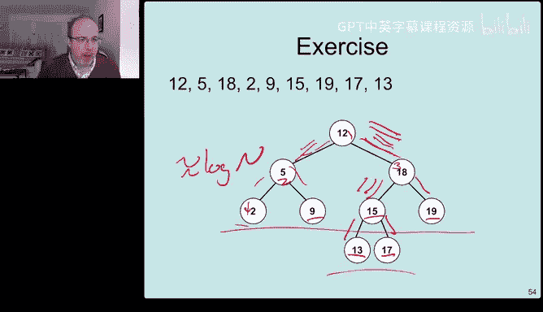

Now， in order that inserts the keys that generates the worst case tree， just insert them in order。

 so two is the first one， five is greater than two。9 is greater than 2 and 5， 12 is greater than2，5。

9。goeses there， 13 is greater than two greater than 5， greater than9， it goes greater than 12。

 it goes there and so on'm going to and what we'll end up with is just one big straight tree。

 which is really a stick。What's interesting about this though， is that that's not the only one。

Because we could do it in the opposite order。So if we said 19， 18， 17， so on。

 we'd get the same thing， except instead of a tree that goes off in this direction。

 we'd have a tree that goes off in the left。Just in one straight line and in fact。

 it turns out that there are lots and lots of ways to construct a really bad tree and the way is that at each insertion。

We pick either。The largest。Or smallest。That remain。And if we do that。

 so let's say we picked the two first。And then so that's gone， then we pick the 19 that goes here。

 so that's gone and then we pick the 18， it goes here， that's gone， and then we pick the five。Well。

 five is greater than two。嗯。Oh no， this isn't quite right， hu all right。嗯。

I'll have to think about this more because now I've managed to confuse myself。Oh， no。

 because I drew the tree wrong。诶。Yeah。Anyway， so now I've managed to confuse myself and I don't want to unwind myself I'll come back and post something on Piazza that talks about this because we do have a long lecture I don't want to get this bogged down into me confusing myself by not having enough tea and yes I am I am actually an equal opportunity caffeator I saw someone was on on team tea I'm also on team coffee。

And yes， that's exactly right the tree becomes a stick that isn't straight。

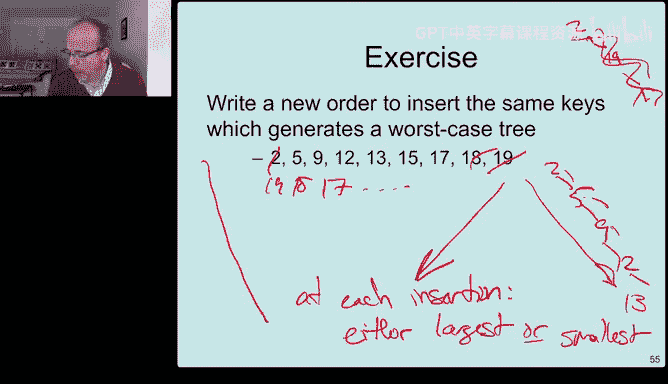

So。That's kind of bad news because what it turns out that there are about two to the n trees that are。

Really bad for us now therere n factorial possible trees n factorials quite a bit bigger than two to the end so most trees are pretty good。

 but there are enough trees that are bad that things get pretty get pretty evil。

And so the complexity of all of our tree functions depend on this height of the tree。And again。

 if it's average， we get them in kind of a random order。It's login。

 but if we get a particularly bad order and there are lots of particularly bad orders。

 we get a really unbalanced or stick and it could be a jagged stick that would work。

 but it could be pretty bad。And that gives us a linear depth。So what's average case。

 well random data in a random order is pretty average and that's sort of the definition that we use for average is a random set of data inserted in a random order what do we get well that's likely to be very well balanced because there are many more things in n factorial than there are and2 at the end。

But there are enough bad spots that can get us into trouble。So we'll talk a little bit。

 we'll continue to flesh out how we work with regular binary search trees。

 and then we'll introduce a new kind of search tree that allows us to keep these things in balance or at least approximately in balance。

So here's another thing just to think about really quickly。

 how do we find the node with the smallest key？And what are the average and worst case complexities of that well we sort of know the answer to this。

 the average and worst case complexities of anything to do with our tree is usually log n。

Log and average。No， it's pray。Or linear if it's not。Um。And so， but to find that that。The tree that。

To find the node with the smallest key in the three sorry I got distracted by the questions in the chat。

 thanks Blake for handling that。嗯。You just go to the left as far as you can until you can't go left anymore。

 so you start at the node and if there's a left child， you go there， if that node has a left child。

 you go there， if that node doesn't have a left child which two doesn't。

 two must be the smallest node in the tree。To find the smallest node， you go left， left， left。

And again， it's on average， the height of the tree。嗯m。In worst case， it's linear。

So this is the function that does it。If the tree is。If the tree is empty。

 so this is going to be an iterative version of this function of the tree is empty。

 well there is no smallest node， but while there is a left child we descend down the left side and eventually we return the one that doesn't have a leftmost child and again。

 average log n worst case complexity n。Now it's a little bit of a setup to use Professor Daren's terminology because we're going to come back to this idea。

 we're going to need this idea later in a second when we talk about removal。

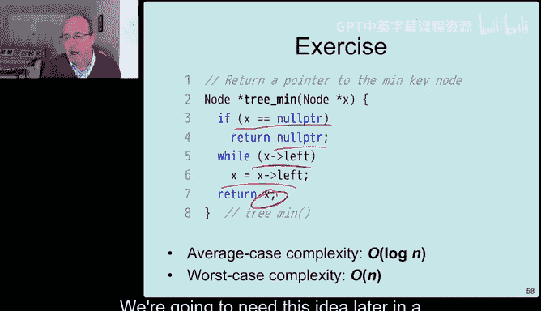

So how do we remove something well they're if we're going to remove some random node in the tree。

There are four possibilities， so we have a tree。If one of the things we're removing has no children。

 no problem， we just snip it off the tree。If one of the nodes we're removing has。ANo left child。

 that's okay， we just cut it and replace it with its right child。If it doesn't have a right child。

Same thing。 We just cut it and replace it with its left child。

But what if we're trying to delete something in the middle that has two children？

And there is a complete algorithm in the textbook that we use that's quite elegant。

 but we're going to walk through it today as well， and so the idea is we're going to need to find something below this node that we can replace here and make sure that the tree retains its sorted order or its binary search invariant that everything to the left is less than and everything to the right is greater than or equal to。

Okay， again， easy case。If， this is the node we're removing。It doesn't have a left child。

 We just replace it with the right child and the right child might have。Children on both sides。

 totally fine， we're not losing any information because we just had something that didn't point to anything anyway。

 so it doesn't matter if we keep it around。same thing if it happens to be the other way。

 if it doesn't have a right child just replace it by the left child。

 so this is the one we're getting rid of， we just promote this up and this whatever was underneath it continues to be underneath it。

 everything is fine and because everything in this subte is less than Z。嗯。It's less than Z。

 but everything in this subtree is either less than  Q or greater than or equal to Q。 Well。

 everything here is still less than Q。 and if everything in this subt is greater than or equal to Q。

 this is still greater than or equal to Q。 So no matter which way Q went， whether Q。

Was whether Z was the left child of Q or Z was the right child of Q。

 this promotion continues to obey the binary search tree in variantant。Okay， the hard case。

So there are left and right children， and so the idea is that you want to replace this Z with a way of combining the two。

 so Z has some left subt tree and some right subre and it belongs to some other larger subt。嗯。

We know that everything to the left is less than or equal to Z。

 everything to the right is greater than or equal to Z。So if we find the smallest node。

If we find the smallest node in that subte。It's going to be sort of off in this corner。

 that node can replace Z。And this node can't have right a left hand subte。Because if it did。

 there would be a smaller node， remember the way we find the smallest node is go left， go left。

 go left， go left， go left until we can't go left anymore， so since this doesn't have a left subtree。

 this can become its new left subtree and everything is going to be fine。

So this new node that we find that's the， we call this the smallest successor of Z that takes the place of Z。

And then then if it happens to have a right hand child。

 that gets promoted into the node we just moved out of the way。Okay， so a little subtle。

 but we'll walk through the whole thing。And here's a picture example of this too。

So we have the smallest， we have we want to remove V。

We're going to go once to the right and then left as far as we can until we bottom out。

That gets copied into the node we want。And then we trim it。Okay， here's the whole thing put together。

嗯。So we're going to remove。We're going to remove some node。

 we may need to find its in order successor because the node that we remove。

May have a bunch of children。If the tree was empty。Or we didn't find it。

 so we we're looking for some value， if we never found the value in the tree。

 there's nothing to do because there's nothing to remove so that's easy。Otherwise。

If the thing we're looking for is less than the current node， it must be in the left hand subte。嗯。

If the value we're looking for is less than val， well， then it must be in the right hand subtre。

And if we get to this point。We found the note。And one of the things I want to mention is that this seems a little odd that we do both of these in the opposite order。

 so Valal vowal less than tree value and tree value less than Valal。

 that's an idiom that's common in the standard template library because remember operator less than is the one that our comparisons usually implement when we're providing custom comparison。

So if we get to this point， we have found the node。And we know which one we're trying to remove。Okay。

 here are the two simple cases。If the left pointer of the tree is null。

So here's the node we're trying to remove。That's no。And there's a right hand tree。Oops， sorry。

 so this is the pointer T。We'll reset the pointer T to point to the left hand node。

And then we'll delete this node。And this covers the case when both of them are null as well。

 because if they were both null。V is the one we're getting rid of V is null。

And left is null and right is null。 Well， then this pointer will just beat change to null。

 and then we'll delete this node and everything is good。 So this covers both。U。

Also covers both of them being null sort of free。This is the mirror case of that。

 so this is V is the node we're getting rid of。It has a left subt。But not a rights subre。Same thing。

 we'll take the pointer that points to this node， we'll move it to point to the new left subte and we'll delete this node。

So those are all the easy cases。Okay， the thing that's left is the hard case。

 and so I'm going to walk through this one a little bit carefully。So here's the picture。

 we have a node V， we want to delete， we have a pointer to it。Which is tree。It has both。

A left subte and a right subte。Okay。So what we're going to do is we're going to look for the in order successor。

We're going to start to the right。Which has to exist because we know the right subt isn't null。

 if it was null， we would have already been done。And then we're going to go left。As far as we can。

Which is what this line is saying。 So while there is a left child。

We're going to descend to the left and we're going to go until we hit。Something that doesn't have。

A left hand pointer anymore， but it might have a right hand pointer。

And we'll come back to that in a sec。Okay。We clone the value。Actually， let's not call it clone。

 let's call it copy。Yes。We copy。This value into V。And then we call ourselves again， remove， remember。

 the name of this entire function is remove。We're going to remove。From tree right， from this tree。

This is tree， right。The in order successor value this one and that one will be easy because we know that it doesn't have a left hand child。

 it may have a right we know it doesn't have a left hand child。

 it may or may not have a right hand child and if it does that right hand child will become the new occupant of the old。

Smallest successor。So this is a little subtle again and it's worth walking through because understanding how this works will turn out to be pretty helpful to understanding a lot of things that you might be asked to do about trees。

With that， I want to take a quick pause and see if there are any questions before we move on to the next topic which is going to be how we manage to keep things balanced。

 so I'm going to take just a couple minutes and I'll take questions in the chat or if you want to just take a couple minutes to stand up and stretch please feel free to do that。

Okay， we have one question from from Fawn， can we explain why we go to the right at the beginning of else？

We go to the right at the beginning of the else because we want the smallest node。

Larger than or equal to the node we're deleting。So we have to go right first because this sub tree is the subtree that is greater than or equal to。

啊。Could we have done the same thing with the largest value that is less than the node to the right？嗯。

Not。Necessarily， no。Because if the largest value in the left subtree could be equal to something else higher in the tree。

And if we promote it above， we will violate right the left hand sub principles。

 so we're not allowed to do that。Okay。So coming back to just summarize where we are so far。

 binary search tree， every node。Has two children， a left or a right， possibly a parent。

All of the nodes are ordered， everything in the left subte is less than the root。

 and everything in the right subt is greater than or equal to the root。

The modification to nodes if we're messing around at the leaves， this is really pretty easy。

 if we're trying to modify something in the middle things get a little more complicated but doable。

 and in general， the operations are logarithmic in the average case and linear in the worst case。

So the big question is， how do we make sure？That we are in the average case。

 even when we get a bad set of input， and that's going to be the next thing that we look at。So。

AVL trees， A VL trees are a way of。

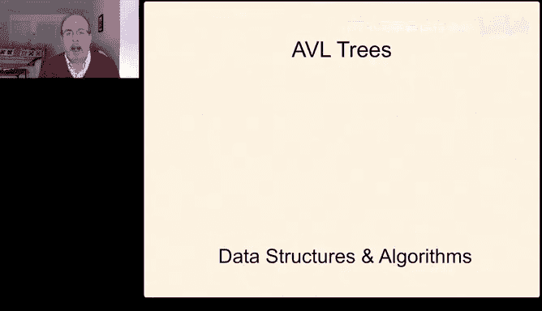

Creating trees that no matter what order the nodes get inserted。

 the tree ends up being relatively well balanced， so it's a self balancing binary search tree。

And it's name for Adelson Velski and Landis。And the idea is we're going to start with a binary search tree and remember the binary search tree has the following property。

对。This is less than。This is greater than or're equal to。

 and then we're going to add an extra invariant。That the heights of these two trees。

 so this is H left。This is H， H。I can manage to type correctly。Draw correctly。This is H right。

That the difference。Between those two。Is less than or equal to one。So the heights at every load。

 the heights of each of its subtes differ by at most one。

And what we're going to do is whenever we break this invariant。

 we're going to use a trick called rotations where we reorder some things in the tree in a special way to correct the imbalance。

And because we can do that， the absolute worst case search and insert will now be logarithmic。

 which is a huge win， so now we don't have to worry about linear worst case。

 the worst case will also be the average case， which is now the best case， which means every insert。

 every search and it turns out every removal will be logarithmic in total costs。Okay。

 just as a reminder， tree height is measured upward from leaf nodes an empty tree has height of zero。

 every leaf node has a height equal that's equal to one， so there's a recursive formula。

 the empty tree has a height of zero。So the empty tree has nothing in it。Otherwise。

 the height of any node n。Is the max？Of its children's heights。Plus one for this note。

Okay this is something that we talked about last week and this is just a refresher of something that we've seen before。

So。The idea is that for every internal node of T， so we're going to look at these four examples。

Do the heights of the children differ by it most more？Well， an empty tree。Yeah， I mean。

 there are no children， the height is zero， there are no children to measure。

 so the empty tree is certainly a balanced ABL tree。If we insert five。Yet， sorry， Darren， yes。

 that's the detion in a nonABL tree is linear in the worst case， because again。

 we could be deleting out of a stick， deleting it the root have to go all the way down。

 or in any case we have to do the search。嗯。For tree one。Well。

 left the height of the left subtree is 0， the height of the right subtree of 0 is0 minus0。

 absolute value is equal to zero， zero is less than one， so that one's good。Tree two。

 the height of the two is one。The height of the right subte is 0， max 1 and 0 is1。

 the height of 5 is 2。嗯。These two differ only by one， so that tree is an AVL tree。

Trey3 is a little more interesting， so the height of three is one。

The height of two is the max of zero。And one plus one， so that's two。

 the height of five is the max of zero。Sorry。s the height of  five is the max of0 and2。

 so the height of five is three and this。It's not an AVL tree because five's left subtrees height is two and its right height subtree is zero。

 so that is not an AVL tree。嗯。Look at some more trees。Tree4。

 and again I'm going to go through these just a little bit more quickly， the height of that is one。

 the height of that is two， the height of that is one， height of that is three。

Everywhere this is only differs by one， this only differs by one， we're good。嗯。So tree4 is good。

The height of three is one， the height of six is one， leaves are automatically balanced， this is two。

 one and zero is differ by one， this is two， one and zero， differ by one， this is three， two and two。

 differ by zero，3，5 is good。Three，6， this is one。This is two， those differ by one， this is one。

This is two， these differ by one。The height of this is three， but the height of this is zero。

So at this point， tree6 is not an AVL tree。Therefore， 36 is not an A VL 3 at all。 Now。

 it turns out that this， the height of this is max2 and 3。Is。

So the height of that is four so because this is unbalanced， this tree is not an AVL tree。

 so what we'll see。Is that there's some simple？And elegant ways to be able to fix a tree as we're inserting things。

 to be able to rebalance them， because the idea is if we start with an A VL tree。And we add a node。

That's potentially going to make one subte taller than another。

 and if the subt that it makes taller was already one taller than the other。

 it's going to make it too taller than the other and we're going to have to fix it at that point。

Okay。嗯。So。😡，It turns out I' going to I'm going to this is going to be a very hand wavy proof。

 this is not going to be a 203 or a 376 proof or a 477 proof。嗯m。

But we we'll come back to it so the basic idea of H is the height of the tree。嗯。

We were going to define the term n of sub H。Which is the smallest number of nodes in an AVL tree of height H。

And what we want to prove is that that's approximately。嗯。H squared。

 which means that everything is approximately。Log in。So in an empty tree， obviously n0 is zero。

 the minimum number of nodes in an empty tree is zero。

The minimum number of nodes that's one high is a root， just a single node one。

 so these are the base cases of our recursive proof。So for any age， greater than one。

The height of the tree contains。嗯。The root node， one for the root node。

An AVL and then a subre of height h minus1。On one side and without loss of generality。

 we'll say that this it's the left side。So， this is H。This is h minus1。

And another subree on the right， whose height is H minus 2。

And this has to be H minus2 because if it were H minus3， it wouldn't be an AVL tree。

And if it were h minus1， then there would be more nodes than we need。

 so one of these subtrees has to be H minus1 and the other subtree has to be H minus2。

 so we know that for any tree that's larger than one deep。

 the minimum number of nodes in that tree is that node plus the minimum number of nodes in a tree of height H minus1 plus the minimum number of nodes of a tree of H minus2 and this iscur this is a recurrence relation like a lot of others we've seen and we'll solve it in pretty similar ways。

嗯。And Joseph， if you're talking about the current tree。嗯。

We're going to come back to that why don't you go ahead and chat with Blake about this a little bit。

 and then we'll come back and see if we can catch a question a little bit。

 but I want to keep talking about the proof of the slide before。嗯。So that the。

Right subte from node 7。Now， the left subt is to。Yeah， I think we're going to tree five。So no。

 you're looking at this is the height， not the difference because the height of the left subt is one。

 the height of the right subree is zero， one minus zero is1， so this is balanced。Okay。

 coming back to our proof。So we have from the prior slide H is the height of the tree。

 N of H is the minimum number of nodes， we know that N of H follows this。

Now we also know that n of H minus1 has to be greater than n of H。inus2。Which means that N of H。

There have to be at least。2。Times n of h minus2 nodes in the tree because n of h minus1 has to have at least as many nodes as n and n of H minus2。

And what that means is we can start doing an induction， so it's also greater than4 of N H minus4。

 and it's also greater than。Six of n H minus6 and so on。嗯。The closed form solution of that。

 which I won't work out for you here， but I may follow up with a Piazza post。

Is that it's at least2 to the H minus1 total nodes。And remember。

 what we were looking for was something on the order of two to the H total nodes。

 and this is because these are just some constant factors。

So if we take the logarithm of both sides of these things。嗯。老 game。

Is greater than or equal to H over 2 log base 2 and of H is greater than or equal to H over 2 minus1。

 And then we solve for that and we end up。The。H is less than two of log n。

 so we know that the height of the tree。In other words， the height of the tree。

If we have about and nodes is about logarithmic。And again， I'm waving my hands very vigorously。

 this is not really a 203 or 376 proof and the faculty who teach those courses would be aghast that I'm calling this proof。

 so I may come back and follow it up or point you at a better one in Piazza later but this is sort of good enough to take it on faith for now and we'll come back and see if we can come back to it。

But the basic idea is if something holds， if something is an AVL tree。

 we know that it's height that that。That' the number of its height is approximately logarithmic and the total number of nodes in the tree so now the trick is we just need to be able to build these things。

And that turns out to be a little tricky。Okay。So if just how do we do AVL tree algorithms。

 search is the same in a binary search tree and AVL search tree is a binary search tree。

 we're not modifying it so we can't modify the AVL property。

 so search just works the same as a binary search tree， the same with sorts。

So if we're going to use an AVL tree to sort a bunch of numbers， we insert the nodes one at a time。

 but the worst case complexity of insertion is now。Log in。We're going to insert n of them。So it's。

Order and log n。To do all of the insertions， we're going to perform。In order traveral。

 that's just linear because we're going to touch all of the nodes once。So it's O。Log n plus n。

 we can get rid of that。So an AVL tree， using an AVL tree to perform a search can be done in N log N time。

 which is the don't pass go do not collect $200， it's the fastest asymptotic search time you can have。

Insert is trickier， so the basic idea is we're first going to insert if as if we were a binary search tree and if we break the AVL heighten bear invariant。

We're going to rearrange the trees to rebalance the height。

So every node needs to know its own height， and remember as we insert going down。

 we can propagate any changes in height back up as our recursive algorithm unwinds。And as we unwind。

 we can compute the nodes balance factor。So the balance of a node。Is the height of its left tree？

Minus。The height of its right tree。If it's if。If it's negative， so it's left minus right。

A negative is also called。Right， heavy。A positive tree is called left。Heavy。And if they're equal。

 then they're equal。嗯。So if the balance a node is AVL balanced if and only if its balance is either zero。

 which means both subtrees are equal in height。Positive， which means left is taller by one or left。

Heavy。Negative is right as taller by one or right heavy。

And if the absolute value of these is greater than one。

 so if it's plus2 or bigger or negative2 or smaller。

 then that node is out of balance and we have to fix it。Okay。

 so I'll just take a look at a little bit of these。

So what I'm going to do is I'm going to walk through the heights first in red。

 and once I compute all of the heights in red， I'll compute the balance factors in blue。

So the height of node3 is a one。So the height of node two must be two because it's the maximum of its children plus one。

The height of node7 is one， it's a leaf， the height of node5 is the max of its children plus one。

 that's three。The balance factor at node5 is2 minus or sorry the balance factor at node 3 is0 because0 minus0 is0。

 the balance factor at node 2 is1 because zero， remember this is zero0 minus1 is minus1。

The balance factor at node 7 is 0，0， minus00， the balance factor at node 3 is not minus1 minus 0。

 which would be minus1， it's2 minus1。So2 minus1。Is plus one。Okay。

Do the same thing for the tree on the right hand side。I'm going to go a little faster。

 the leaves are always one because their children are zero on each side， one plus zero is zero。嗯m。

Three's height is two， two's height is three， five is the max of three and one plus one is four。

And now the balance factors at each node， well the balance factors of leaves are always zero。

The balance factor of three is zero。Zero minus1， negative one。

The balance factor at node two is0 minus 2， which is negative2。

And the balance factor at the root is three minus1。Which is two。

 So there are two different nodes that are out of balance。

The node with value of two is out of balance， and the node with value of5 is out of balance because the absolute values of their balance differences is greater than one。

Okay we can do the same thing in a slightly more complicated tree。

 label the balance factor on each node， so and I'll just draw the heights off to the left。

 so this is height one。WellActually， that's not going to work。So。This is height1。

So all the leaves are height one。Everything that's parent of a leaf is two。This is 3。This is4。

And then if I were going to compute the balance factors， well。

 the balance factor of all the leaves is always zero。嗯。One minus1， that balance factor is zero。

 zero minus1， that balance factor is negative one。2 minus2， that balance factor is zero。1 minus1。

 that balance factor is0，3 minus2。 that balance factor is one。 so this tree is in fact。Balanced。Okay。

 what if we insert it and again， it begins just like the binary search tree。

 so if we're going to insert node 14。Well， 14 is less than 15， so it has to go to the left。

14 is greater than6， it has to go to the right， 14 is greater than7， it has to go to the right。

 14 is greater than 13， so it belongs down here。However， once we do that。Then， this node。

Becomes out of balance。Sorry， I got a little enthusiastic about what I was doing。

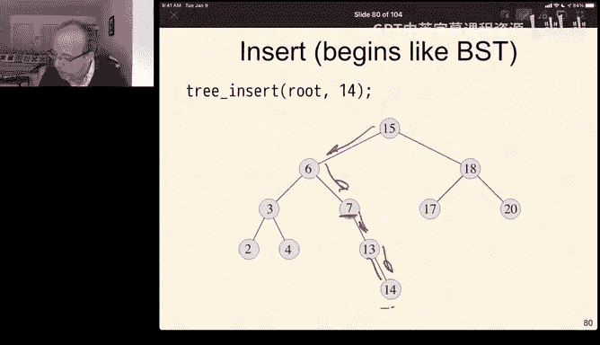

。So the node at7 becomes unbalanced because the height of its left subtree is 0。

 the height of its right subtree is 2 that's a negative 2。

 and the node at 15 is unbalanced because the height of its left subtree is4，1， two， three，4。

 the height of its right subte is 2， that's also a negative 2。So bad news。

 so once we do this insertion， we're going to have to fix it。

And the idea is that we're going to use rotations。This idea of rotations to rebalance the binary tree。

So to do that， we're going to swap a parent in one of its children preserving the binary search tree ordering。

So we're going to swap。Two with three， but because two is less， we're going to swap two with three。

 but because two is less than three， it's going to have to become three's right hand child。

So this rotates in this direction。And that gives us。This tree。So the new child of five is three。

 three that this node swaps down and we end up with a balanced tree。

So what's really interesting about rotation is that it's a local change that involves at most three pointers and two nodes。

And we'll see why when we talk about that in a minute。

 but this is really important because if it's three pointers and two nodes， that's five things。

 five is independent of n。That means rotations happen in constant time relative to the size of the tree。

Okay， so one rotation happens in constant time。So that's going to turn out to be really。

 really important for us as we keep working through this。Okay， so as I said before。

 this is just restating the prior slide， we're going to use rotations to rebalance the binary tree。

We're going to interchange the role of a parent in one of its children preserving。The order。

 which means the old parent has to become a new parent。If the old child was to the right。

 the old parent has to be to the left。If the old child was to the left， sorry。

Can't do it the old child was to the left， the new parent has to be to the right it's hard to do when I'm trying to see this in the camera and mirrored。

嗯。So。The second part， this preserving the BSD organ is a little bit tricky， so I'll write rotation。

We copy the right pointer。So here's the left child， here's the right pointer。

 we copy the right pointer of the left child to be the left pointer。Of the old parent。

And for a left rotation， we do it in the opposite， the right child。Left pointer。Becomes。The， the。

Sorry， the left pointer of the right child becomes the right pointer of the old parent。

And this is what this looks like in pictures， So if we're going to rotate right。Rotate， right。

Around P。Then the left。Sorry， the right child。The right pointer of the left child。

Becomes the left pointer of the old parent。And because this。Was in between。

 so everything in here is less than P。But it's greater than or equal to LC。

Because that's where it is， well， everything in that tree is still。Greater than or equal to LCc。

 and it's still less than P。 So this preserves。The binary search tree order。

And the same thing happens if we rotate left。So if we rotate left。

The left subre of the right child will become the right subre of the old parent。

This fell between the parent and the right child before it is still going to fall between the parent and the right child when we're done。

So。Either way， when we rotate right and rehome the old left right subre as the parent。

Or we rotate left and we reho the old right left subte as the parent。嗯。

Then we preserve the order of the tree。And the question of how do we know where to move the parent Samuel is whether we're rotating a right or a left and we're going to rotate right。

If this is too tall。And we're going to rotate left。If the right is too tall。Because rotation can。

 but doesn't always shorten the length of the heights of subtes。Okay。So let's take a look at this。

 so imagine we were going to try and use a rotation to balance this tree。So for this one。

We're going to rotate。Left。Remember I have left and right and I can't ever remember。

 so this is going to rotate to the left。Which means B becomes the new parent。

Bee's right subt or bee's left subt is empty。And so that becomes。The right subre of the old parent。

Okay， we could try and do the same thing here。If we were going to rotate。To the left。

Well C becomes the new node， C's right subt is B。So B becomes the new left sub of A。

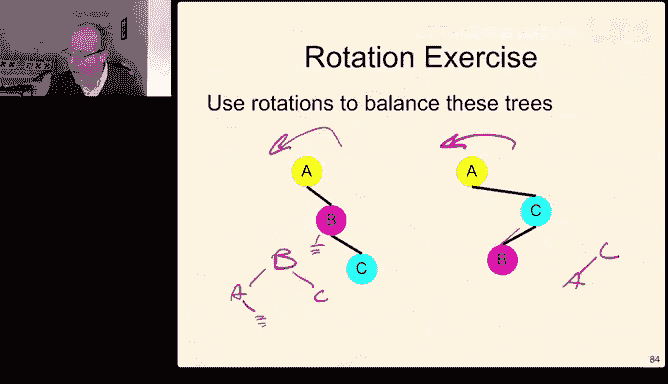

Now this works because this is balanced， this really doesn't help us。So。

 and this is that same thing in pictures。If we have a stick， a straight line stick。

A single rotation will solve our problem for us， so a straight line stick has an imbalance because one side is zero and the other side is two。

For a straight line stick， a single rotation， in this case， a rotate left at A solves our problem。

A jagged stick needs two rotations。The first one。A right rotation at sea to give us a straight line stick。

And then a left rotation at A to fix the overall imbalance。So if we have。A jagged stick to the left。

We're going to rotate。This way。Which gives us a straight line stick。

 and then we're going to rotate this way。Which gives us a balance。Okay。

 so when we have a straight stick， we only need one rotation。If we have a jagged stick。

So either a straight stick in one direction or the other， one rotation solves our problem for us。

 but if we have a jagged stick， we're going to need two rotations the first to convert it into a straight stick and then the second one to fix the straight stick。

Okay， we call these double rotations。So there are four cases where we might be inserting and end up making things bad。

So if we insert。So the first thing is if we're inserting into something that is that is。

That doesn't have if we're inserting into a node that has no children on either side。

 then it doesn't matter and we're fine that insertion just works。If we're inserting into a node。

 sorry， that's not true。For inserting into a node that doesn't leave things out of balance。

 we're fine， if it does leave things out of balance there are four things we might have done。

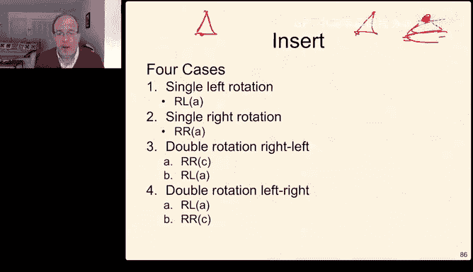

A straight stick to the right。Which needs only a single right rotation。A straight stick to the left。

Which is a single right rotation。嗯m。Let me see if I can remember which ones these are。

 so if we're rotating left。A stick to the left and right。No， that's wrong。So if we have a stick to。

Yeah， no， that was right， that was right the first time stick to the right and to the left。

We're going to do a left rotation at the child， which gives us a stick to the left and then a right rotation。

Or sorry。Yeah， a left rotation and then a red rotation at the node。

 which gets us to where we were going to go。If we have a stick the other way， we need to rotate this。

 which gives us a stick。And rotate this。Which gives us the thing we were looking for。

This is the same thing in pictures。So in this case。ThisThis tree is too bigger than this tree。

But it's。It's left so it's。Unbalanced， but left heavy。Yeah。

Rotating at A gives us what we need because it moves this up to here。These are now all equal。

Same thing going in the other direction。This is out of balance because this one is too shorter than this one。

A single rotation at this point moves this tree to be the new child of sea。

 and that gives us a balance。If we have this jagged situation。So。It's。Right heavy at the top。

And left heavy at the second level， we need a double rotation。So this is。A plus two out of balance。

 And this is -1 in balance， but。Left heavy。Then we need a double rotation， one at C。

 a right rotation at C， which gives us this tree， and then a left rotation at A。

 which gives us this tree。And one of the things to notice is this difference is， sorry。

 I got the signs inverted。Let me take a deep breath。Yeah。Try this again。Yeah。

I don't know why I'm discombobulated today。Okay。The difference， this is T0。This height is。

T1 and t0 are the same plus2， so this is something minus something bigger than 2， this is minus2。

But this。B is one taller than the subchild that B is one taller than the subchild the subt at T3。

 so this is plus1， so their signs are different。Then first， we're going to rotate at C。

 which makes their signs the same。 This is plus 2。 And now this is or sorry， this is-2。

I really wanted to have that inverted。That makes their signs the same。 is minus2。 this is minus-1。

So it didn't actually solve our problem， but it made the signs the same。

 so now that when we rotate back。We get everything working and if we look at this side。

We had the same thing， so this is minus2， this is minus1， so the signs already agree。Same thing here。

 C as plus 2， B is plus 1。 The signs already agree in the double rotations， the signs are different。

And it's when the signs are different that tells us it's a jagged stick instead of a straight stick。

So the same thing will happen here， the height of C's left subtre is two greater than the height of its right subtree。

 but the height of A's left subtree is one smaller than the height of A's right subt。

So because the signs differ， we need a right rotation at A。Which gets us to。

Sore sorry we need to root， sorry。I need to slow down。

Okay we need a left rotation at A to get B back to swap A and B。That makes this plus two。

 this is now plus one because it's left heavy， not right heavy。

 and then a right rotation at C solves the problem for us。So the intuition is。

When we have a plus two or a minus2。If the direct， if the heavy side has the same sign as。

As the unbalanced node， we just need a single rotation。

 if the heavy side has a different sign than the unbalanced node， we need a double rotation。

So this is an example just sort of in pictures。And this picture is going to turn out to be really。

 really helpful for you as you think about how to reason these things through。嗯。

So if it's heavy left and heavy left。Then a single rotation to the right solves the problem。

If it's heavy， right and heavy right， then a single rotation to the left solves the problem。

If it's heavy， left and right。Then we need a rotation。To the left。To make it。Heavy left， heavy left。

Well once we have heavy left， heavy left， we know how to solve that。If it's heavy， right， heavy left。

Then we're going to rotate to the right。To move the heavy side to the right。And heavy right。

 heavy right， we know what to do there。Oh Ian that's very。

 very clever I wish I had thought of that so this this tree this picture is going to come in pretty handy for us and we'll refer back to it both as we reason about this and as we think about things for the remainder of our conversation。

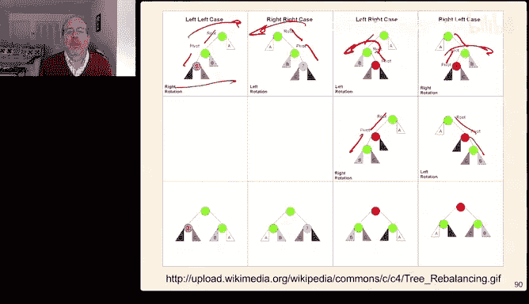

Okay， so here's the basic idea。The basic idea is that we're going to insert。

 which is just this recursive descent insertion， and then as we unwind on the way。On the way back。

 we check the balance and rebalance if it's broken。So the outermost if。

If the balance is greater than plus one。Or less than minus1， we need to rebalance something。Okay。

Additionally， if。So remember if plus one means it's left heavy。Minus1 means it's right heavy。So if。

The balance of the left child is negative。

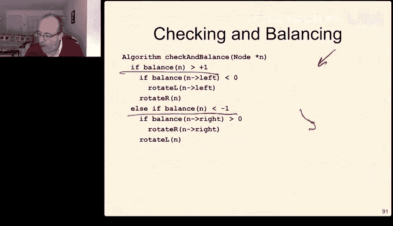

Which means it's right heavy， then we have to do an extra rotation。Which rotates the rotate left。

At the left child。And then once we do that， we're guaranteed to have a stick and then we rotate right at the top。

The same thing in the else condition。If the balance is。Less than negative one。

 that means it's left heavy。If the right child is positive。Which means it's right heavy。

 then we have a jagged stick。So let me erase the stuff that I was using to illustrate because I'm now。

Over。The text。 So the idea is that the outermost if。Which is this part。

Its just is the no out of balance？And if it's out of balance by more than one。

 then it's left heavy and the left is too big， if it's out of balance by less the negative one。

 then it's right heavy and the right is too big， if the left is too big。

 we're going to rotate right to fix it if the right is too big， we're going to rotate left to fix it。

Then the inner ifs are do we need a double rotation， and that is again。

 only if the signs of the balance check disagree？And if the signs of the balance check disagree。

 then we have to do this double rotation。So。Again， we have a tree。

We're going to recursively descend down to the tree until we find the place to insert。

 and then we're going to walk our way back up。We're going to update the height of the as we unwind the recursion。

 we update the height of every recursive node， and then we call check and balanceance on every node。

So the first question is， what's the time complexity of this？At each， at each step。

We have a couple of comparisons and a couple of rotations。And remember。

 the rotations are fixed time because they only involve a couple of nodes and three pointers。So。

The rotates are constant time。And the comparisons are also constant time。

So every check and balance is constant time。So as we're moving up at each level it's constant time。

 so the real question is after we insert something。

 what are the largest number of fixes we can possibly need？

Now we needed logarithmic time to find the place to insert。

Even if we needed as many fixes as possible， it would still be constant time each time on the way up。

 it's still logarithmic on the way back。But it turns out that when we're fixing things。

 when we add a node， we increase the height of it， most a left or a right subte by one。

 rotations bring that thing into balance from above， it doesn't change anything else。嗯。

So here's an example that we're going to follow and we have an animation to do this。

 I'm not going to ask you to do this yourself because it'll take a while to actually walk through。

 but we're going to insert this set of keys into an AVL tree we're going to rebalance if we need to and again this cheat sheet is really really helpful hint。

 hint， hint hint。Really helpful。 hint， hint， hint， hint。嗯。So here's what we're going to do。

We insert three， then we insert two。Three is still in balance， then we insert one。Two is in balance。

 three is out of balance， rotate， right。Insert four and5。Three is in balance， two is in balance。

 insert five。F is in balance， three is out of balance， rotate left。Okay， now we insert six。

Five is in balance。Four is in balance， but two is out of balance， rotate left。Now we insert seven。

Five is out of balance， rotate， left。Everything else is fine。Now we insert 16。

Everything is still in balance。Now we insert 15，7 is out of balance， but it's inverted。

 so we need a double rotation。Everything else is balanced on the way back up。14。Seven's in balance。

 15s ins six is out of balance， but it's a jagged， so we need a double rotation。

And everything is in balance on the way back up。So this is the final tree we get when we insert that set of things into our tree and if you look at it。

 it looks pretty good， you know， it's kind of bushy。

 it's not very tall and it's approximately logarithmic。And this website is very。

 very handy for being able to visualize how these sorts of things work as you're trying to make sense of it in your head。

Okay， if an AVL tree is a binary search tree that sayss balance without any time trade off。

 why use a plain binary search tree and the answer is you never do。嗯。有。

You could maybe use a plain binary search tree。if you know。

 for sure that your input is likely to be random。Not not actually likely that your input is going to be random if you know your input is random then you don't need to do the checks on your way back up then that's what Blake is referring to is that you pay the cost but in general you really don't so for example an ordered map is implemented with basically an AVL tree because it provides this。

The basic idea is that the cost of the rotations to retain the balance is more than paid back if you happen to have a bad set。

When you need to fix the tree do we progress from the bottom up， yes。

 so remember these are recursive algorithms， so to do the insertion you recurse down the tree and then as you unwind the recursion up。

 you fix heights and balance factors and rebalance。Okay。

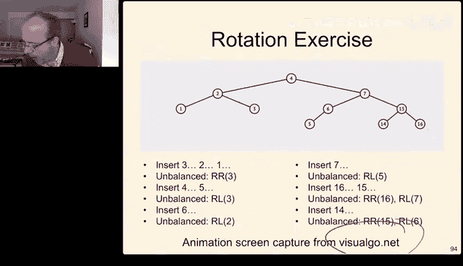

Removal removal is even a little more tricky and I know we're running short of time。

 so I'm going to but I do want to work through this。嗯。For removal。

 remember that all of the keys are in the left hand sub or less。Then any then all any。

Are less than all of the keys in the right hand subte。

So what we're going to do is rearrange the right hand subtree so that its smallest node is in its root。

There has to be something since the right hand subtre was not empty。嗯。

The new right hand subtree root has a right child， but no left child。

 Then the right hand subtrees root is the left hand subchild of the left hand subre root。

 So we take whatever this note is that has nothing to its left。

We make this the new root of this tree。And then we can get rid of this。

 this becomes the new left hand side。And then once we do that。

 we just have to rearrange the tree to balance the height。So wherever we remove。

 we have to go up the tree。Now at every unbalanced node that we encounter。

 we have to rotate is needed and what's really interesting about removal。

Is that insertion only makes one subtree somewhere one deeper。

 so the only un balance is in one place， a removal may remove from the shortest subte pair of the shortest subte pair of the shortest subtre pair of the shortest subtre pair。

 so removal may actually cost you a lot。嗯。So if we were going to remove node 32。Well 17 is balanced。

 so that's okay， but 44 is unbalanced， so we're going to have to do a rotate。

And it's actually unbalanced。Oh， it's unbalanced even。So we remove 32。Then we rotate left at 44。

Which moves this subtre as the child of 44， and this is balanced。So we have to keep。

 but we have to keep doing this up to the root， this happened to be the root so it was pretty simple to do。

 but we might need to fix something at every possible spot。So。If suppose we wanted to remove 62。

 we find the in order successor。The in order successor is 78。We copy 78 into the node。We remove 78。

From the right hand subt and replace it。嗯。With its left hand subtre， but now again。

 we need to balance。So we need to rebalance this way。嗯。

And we actually need to do a double rotation because if we just did one rebalance。

We would just swap this tall sub tree for another subtall sub tree over here， so instead we need two。

We're going to。We're going to rotate left。At this child， and then rotate right。

So this is the rotate left。This is the rotate right and 50 becomes new and we have a really nice balanced tree when we're done with that。

Okay， so remember a fix shortens a sub that's too tall。

 but if we're moving something it may make something too short。

 so we're not we're not actually fixing everything all the way so when we're inserting。

The new note is the source of the two tallness。 It only makes one of those。Side too tall。

 a single rebalancing will fix it。When we're removing the deleted node can only create an imbalance making subtes shorter because we're removing something。

 but it could be already the shortest so it might make something shorter and shorter and shorter and shorter all the way up and so we have to fix it potentially all the way up but again each fix。

His constant time。There's log N levels。So， it's log and。Total time to do the rebalancing。U。So。换。

If we were going to remove this four。And I don't know why lost I lost the animation。

 I'll put a link to an animation in this too there we go， let's try that there we go。Hm。

 that doesn't seem to work。That's funny when I tried it earlier， it worked。 So I apologize。

 but we are running short on time We're already in 5 over。 Oh， no， it does work。

 I just didn't give it enough time。So we're removing the four。Three is out of balance， it rebalances。

Now we're going to go back up， five is out of balance。

We need to do a double rotation to make that work。Or a single rotation to make that work。

Their team is out of balance。ro地。And now we're good。So in this example。

 we had to rotate every single layer that we went up。

So very useful website to be able to do all of these。Rebalances。Close the help。

 click on the AVL tree near the top and you can insert and remove trees at once。Speed it up。

 slow it down， very， very useful。Useful thing oh good Blake。

 I had forgotten that uses red red black trees and we'll talk about that maybe in a Piazza post as well。

So this is a pretty complicated lecture I' I'm gonna to just sort of finish this by saying this one's a little subtle so it is worth spending more time thinking about this lecture as you can see even I'm still stumbling over it and I went over it pretty carefully last night and again this morning and I still got some details wrong so that should be a hint that this stuff's a little bit more complicated than the average thing that we talk about so I do encourage you to spend a little more time thinking about this lecture and reviewing the material in the text then maybe some of the others this is also my last lecture with you so I've really enjoyed this as a little plug I'll be teaching 42 in the fall so if that's next on your radar please feel free to join me there and it should be a lot of fun so it's been great I'll see some of you in office hours。

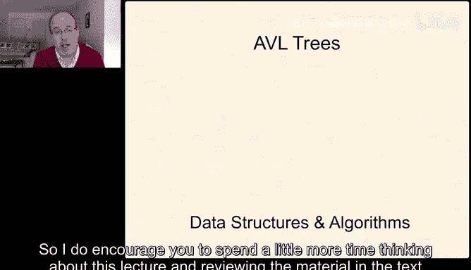

Good luck in the rest of Project  three and then the rest of Es 281。

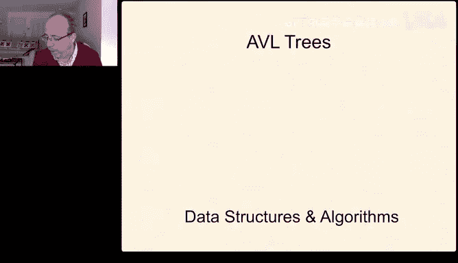

And I'll stick around for questions that anyone has for the next couple of minutes。All right。

 the question is can I go back to slide 92？92。So。Remember that when we're checking and balancing。

 we're going to insert something。And then on the way back up。

 we're going to update the height of the node and check and rebalance。

The time complexity of the insertion is logarithmic because it's logarithmic in height。At each step。

 we're going to update the height。 That's a single operation。 We may。

 we're going to check and balance。 That's a constant operation。

 and we're going to do that logarithmic times。 So the total time。For insert to go all the way down。

 add the node and all the way back up is logarithmic， no matter how many fixes we need。

And it turns out for insertion， we're only going to need one fix。

Because rotation shortens the largest sub tree， and insertion makes one of the subtes longer。

By by rebalancing， we shorten the longer subte， which means that the overall height of this node stays the same as it was before。

So if we're doing a rotation on a node， its height is guaranteed to be the same。

 since its height is the same， everybody above it remains in balance。So if this node doesn't rotate。

 then its height might differ， but then somebody above it will be out of balance and when it does everything above that will be in balance so for insertion you only need one fix on the way back up。

 you need to update the heights everywhere， and you need to update the balance factors every check the balance factors but you only need to fix one of them。

ickNholas， what are the benefits of a tree versus a vector well let's talk about what the downsides are vectors fit in contiguous memories so they're very cash efficient。

Vectctorors have random access through the index operator。

 so if you need a random know something at index 42 from a vector， that's really easy to get。

Trees have the advantage that they are always sorted。

Particularly and eight binary search trees are always sorted。

Now they pay a little extra overhead in the pointers for that。

 but they make sure that all of their things are always sorted and AVL trees or another kind of tree red black trees。

 which I don't think we're going to talk about in 281。

 but it's another version of this self-balancing tree idea。嗯。

Those trees are always guaranteed to be logarithmic in depth。

 so insertion and removal is always logarithmic as opposed to vector where if you're inserting something in the back it's constant time but finding something in there is linear finding something in the search tree is logarithmic so one of the things that I think we're going to see at the beginning of next lecture if I remember correctly is just a quick review of some of this。

 but it's but I will also come back for that and so I think I have a couple things on piazza to talk about it's。

Kryd to remember what they were， but but it's。Comparison of runtime。Pros cons。And of。

Te versus vector。And maybe I'll do a couple more as well。And Michael， you're welcome。是。All right。

 it looks like most people have filtered out so I'm going to go ahead and end the stream again。

 thanks a lot for joining me and enjoy the rest of 281 and hopefully I'll see you in 42 in the fall。

