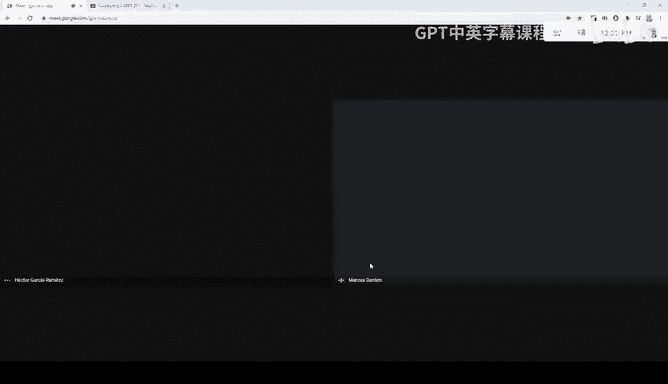
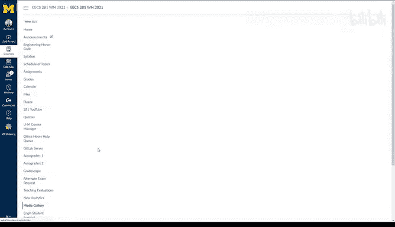
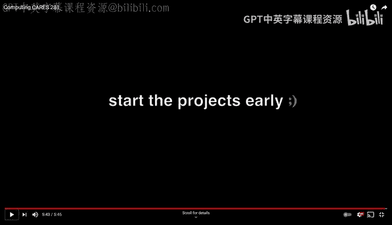
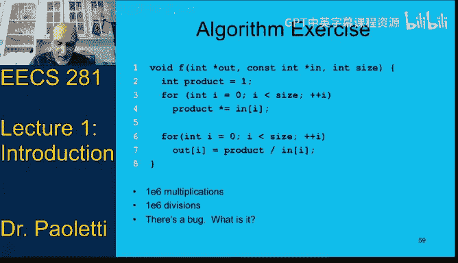

# 密歇根大学《数据结构和算法｜eecs281 Data Structures and Algorithms Winter 2021》中英字幕 - P1：-01-EECS 281_ W21 Lecture 1 - Introduction.zh_en - GPT中英字幕课程资源 - BV1snk5BWEfc

Okay， hello everyone， I'm Dr。 Paletti， I've got a couple of the other instructors on the line here with Google Meet。

这上面。Don't wait， I'm doing a feedback loop， oh， that's now。Okay。

 so let me just bring them over and they can introduce themselves。let's see whats my。What it is。

 I muted the YouTube。I'm Professor Daren here。 I am happy to be with you all。

 even though I'm not with you all， so we'll be meeting like this for the rest of the semester and it's going to be exactly what it was last semester。

 but we're still going to。😊。

Do our very best we had a good time in 281， you're going to have a good time in 281 just remember that the vast majority of people who tell you how hard 281 was。

They've already passed 281 and you can too。All right， with that I'm Eto Garta。

 I've been teaching one for a couple of years now， two years with Marcus and David。

 it's been a great ride， I'm sure you all find it。Extremely useful to this scores。

 both now and the near future， so happy to be here。Happy to meet you all throughout the semester。

Probably won't get to meet all of you， but at least a good portion of all of you。Right。Me。Hi。

 my name's Brian Noble I'm in my I don't know why I'm not coming in across as a video I don't know how any of this works even though I have a PhD in computer science so don't mind me I've been on the faculty for a while now I have taught 281 before but it was in 2001 so a lot of things have changed and I'm really looking forward to getting back and I just want to echo exactly what the other faculty have said this course is one that everyone who is here we we know can can do it is a ton of fun and I'm really looking forward to doing it。

Okay， now I should be back on my microphone now to close that window so I don't get any feedback loops。

 okay。So excuse me a little bit about me， this will be， I think。

 my 23rd time teaching 281 in the last few years。And I'm going to be telling you just to tell you a little bit about myself between my master's and PhD。

 I worked for a couple different companies from a small startup trying to turn ideas into technology to a company that had their own hardware product with software inside like three quarters of a million lines of code of C plus plus。

 So Ive worked on really small projects。 I've worked on really big projects。

 and that's what I want to help you with is bridging that gap。

So things we're going to look at today sove seen you've seen faculty。

 here's a list of our other staff， a couple of GSIs。

 they were almost in alphabetical order until they got out of alphabetical order。

 so we've got a bunch of staff who are going to be working with us you'll see them in labs and office hours。

We've also got potato bot who you might have met on piazza Pota bot is。

Artificialally semi intelligent program that tries to suggest posts that might have already answered your question and sometimes it gets it thought on and sometimes it gets it completely wrong。

Just one of those things you have to live with， oh speaking things you have to live with with me。

You have to live with the fact that I'm colorblind。

 so if I say purple you can type blue into the chatter， just play along。

 I try to know what I'm doing ahead of time so I know what color words to say at different times。

 but I don't always get it right。Other thing about me is I'm not great with names and of course that's a little worse with online but with so many students it's really hard。

 even if I see you a lot in office hours I may not remember your name afterward。

 but I'm trying my best。啊吗？One other thing about me is that you might have had other professors that tell you there's no such thing as a stupid question。

And I feel differently about that。 I feel there is a whole category of stupid questions。

 Those are the questions you never get an answer to because you never asked them。

So those are the stupid questions are the ones that you never ask。

 so if you've got a question that's great to me because it means you've identified where you have a gap in your knowledge。

And you want to get that gap filled to link up between what you know and what you are trying to understand so get those questions asked we're going to have faculty today and next lectures we'll have staff we got to get our schedules all worked out。

Monitoring the chat window and we're going to have。

Office hours we're going to have lab time and we want you to ask those questions you may feel like you're the only one who doesn't understand it that's not true。

There's lots of other students who don't understand it。

 but maybe they're not as brave as you are to ask the question。Now our weekly schedule。

 we've got our Tuesdays and Thursdays 12 to 120， we might run over a few minutes。

 sometimes we'll try to get done on time， the links to each video in the schedule of topics on Canvas and speaking of Canvas。

 let's go look there at Canvas together。Make sure I'm in the right window over here。Okay。

 so let's look at Canvas together here and we've got the syllabus up front。

 you can read through that。There's。The schedule of topics， I've got that loaded in a separate window。

 so the schedule of topics make this a little bit bigger font。

So our schedule of topics you can say each topic， the link is the same for both the live stream and the topic and then the playlist is the individually recordings that Professor Garen made of like smaller pieces of each lecture so the introduction and the exam reviews don't have a separate set of playlist videos but all of the others already do you can look at the lecture column to see who's teaching that day it's going to go in basically in chunks like I'm going to do the first six and then Hectors going to do a bunch Brian Noble will be doing a bunch and Professor Garen and then Professor Garen and I split up the exams because we've done this the most。

And then you can look at the projects when projects are assigned and do in labs and also over on Cans。

 if you look at the assignments， it'll have the due dates for everything I believe they're all correct。

 if something looks wrong in there post on Piazs and let us know。

 but I spent a while getting those all corrected。Gras we don't want to look at that because if I pull up grades it's going to show you everybody else's grades calendar is basically a link to our Google calendar and it doesn't have a lot in it yet so we've got a bunch of professor hours added so far the other so Professor Garner and I put ours in other instructors are going to be adding theirs soon we'll get our staff adding theirs in etc。

Fileles really useful place to look out here。The exam practice is not populated yet， it's visible。

 but the individual folders in there I haven't made those visible yet so I'll put some practice exams in there。

 I've got to go fix the dates on them so that they are the same dates as this semester before the public exam images we definitely don't want to look at that labs。

 most of the lab materials are going to be on Gitlab and we've got to link to that over here somewhere on the left lecture materials。

So you can see we've got like the first seven， eight lectures are posted already。

 Professor Gar's working on the rest of them because he updated a bunch of them last semester。

 so we'll get those posted soon。The project so far。

 the only thing visible in there is the makefilile。 TxT。

 which just has a link to our Gitlab master make file project。

 you can also just copy the first part of this。And that's the same as the link over on the left that has our Gitlab link。

 so that's our make file。Project  zero， which is up there right now has Project zero identifier。

 which you have to put in your source code and your make file it's not it's in the Pdf。

 but start learning right now do not copy and paste from Pdf files Pdfs have invisible characters to make the font like。

spaceace correctly and look pretty and if you copy anything from a PDF file it might not work if you copy code it might have like long minus signs that give you compiler errors if you copy stuff that you want to put in your output it might have hidden characters that'll make your output wrong so always copy from a TXT file。

We got the PDF about project zero， project zero notice it says project zero is ungraded。

Project Ze is just there to help you get used to using the autograder MTAC used to how some tools that we need for。

Use inside of your IDE visual Studio， Xcode， etc， and if you look at it it's got links to videos for using and setting up a Mac an Xcode Windows and Vi Studio so you can look at one of those。

 there's also a folder on Canva we'll look at it in a minute for Vi Studio code。

 we got a project zero tutorial and a thing about using the make file。

There's also starter files here， there's a section in the PDF on why there's two different sets of starter files。

 which one to use when。Resources。The most important one is resources right now is optimization tips。

 There's a thing also here about file formats and why there's different。

Startter files basically or input files There's a section way at the end you want to read soon about optimizing your exam grade。

 You want to read this and start doing what it says now not the day before the exam So there's things that you can do that are not going to increase the amount of time you spend in this course by a lot。

 but it'll get you a lot more ready for the exams So there's a bunch of suggestions there。

There's a section in the middle， right where is it？Oh， actually。

 it's right before exam grade optimization。 There's a section right before that about reading input and the correct rate or read input。

 that's also some of that is in the。Project zero video and the rest of this document is the everything in between that we didn't look at is all about optimizing for memory。

 so making sure you don't use too much memory and optimizing for whereas optimizing for speed so there's a bunch of stuff in there that's really useful that you're going to want to refer to throughout the semester。

Okay that's the most important things in there， there's also oh down here there's the visual Studio installing and using PDF Xcode installing and using PDF。

 there's an Xcode files folder， there's a visual Studio files folder。

 and there's a whole folder full of stuff just with VS code。Okay。

 piazza linked to piazza pretty straightforward linked to our E281 YouTube channel quizzes。

 we don't have any quizzes。 that's just what Canvas calls the tool。

 but the quizzes will consist of things like there's a notice there's。It says lab4 quiz。

 but it's not really a quiz， it's the multiple choice portion of your lab。

 the exams will be on here and notice we haven't done the exams yet it still has the fall ones there。

 it's got a preparedness survey and some old junk。That so the quizzes， we have no quizzes。

 but we will use the quiz tool for the multiple choice portions of the lab and the multiple choice portions of the exams。

Off hours Help Q is a link to getting in the queue for off hours Gitlab server pretty straightforward autograder 1 and two there's links to them they are identical hardware we expect you to load balance so if you get over here and you see that it says the Q size is 20 hey。

 maybe you better go check auto the other autograder and maybe there's only five people on there and you'll get your answers faster。

The autograders will allow six people to run out of time。

 they have eight CPUs and you won't see all of this stuff you'll see basically the home。

 the queue and the fAC， I think is the things that you can see。

But if you look at like when you go to your homep page you'll see something like this。

 you won't see the quick debug box， but you'll see Project labs on all。

 we've got Project zero ungraded， oh look I didn't I've submitted before I was quite done actually did that on purpose and my project zero or the project zero which is ungradedd is visible to you now Project one rescuing the Countess from the castle that will be available in a little bit after we get the project finished。

So there's the two auto graders gradecope we're going to be using for for the part of the labs sometime or yeah。

 so part of the labs， the written part of the labs you'll submit there。

The part of the exams will be submitted on grade scopepes， so you'll be using that this semester。

Alternate exam request if you've got a conflict， we don't have the times for the exams yet。

 but we have the dates and we'll have at least two times on the exam days for you to take it。

 So when we get the times worked out if you've still got a conflict with both of them you can put an exam request in there teaching evals。

 you can do that later Media gallery has the basically playlists of the piecewise videos that Professor Daren recorded so they're sort of in a weird they're in sort of reverse order so oh you got a load more So there's playlists Oh that's right lecture 1 doesn't have a。

Pace wise， so we've got these are basically the playlists that are linked from the。

The playlists that are linked from the schedule of topics， so that's the stuff that's。Canvas。Okay。

 so that's what's on campus。So watch also on Piazza。或 one。

Pazza at6 post number six tells you to put your unique name in parentheses when we need to help you it will be easier for us to look you up on the auto grader every once in a while we have students with the same first and last name and so that makes it impossible to tell who you are without that and also potatobot will complain if you don't put your unique name in there and you post potato bottle point out that you should be putting your unique name on your on your info also it'll show you how to turn off the email notifications every hour and you want to do that so that you。

The thing you don't want to do is you don't want to send Piazza email to spam that's bad because we will post announcements on Piazza that are critical for you to read and so you want to make sure you see those。

Okay， let's see， so the crash course。This link， sorry， this link is outdated。

 I forgot to update the slides。 You don't want to view the crash course You want to go to。

 don't go to that link， go to the project  zero。PDF and look at the four links there。

Which really you only want to view three of them because you probably don't have both a Mac and a PC and need both the visual Studio and the Xcode so look at that。

 don't look at the crash course that's from a previous semester and it's like two hours long。

 we broke it into chunks that are much more manageable and also updated。

So the midterm and final those are the dates， like I said， we'll have at least two dates to or sorry。

 at least two times on those dates to accommodate different time zones。So that okay， so again。

 crash courseur， but this is some of the things that will be in those videos。Okay， syllabus。

 so like I said， read the syllabus on Can， it's got the grading scale， stuff like that。

Lots of useful info， prerequisites。203 and 280。You will have to drop if you didn't get a passing rate in 203 or 280。

With the 203， we also count some math courses for people who are dual majors。

Now per department policy graduate students cannot register in 281， however。

 we do have grad students this semester who are taking 403， but neither of you should be worrying。

Because when it comes time to assign grades， you are going to be graded completely separately。

 there will be one grading scale for undergrads of different grading scale for graduate students and these aren't CS grads。

 these are statistics， data science， grad students。Okay， the preparedness self surveyve。

 I mentioned that when we were looking at the Canvas quizzes。

 so look at that and go through that and help you realize what maybe you have to go back and study a little bit from 203280。

Collaboration。The projects and exams must be your code。Or stuff that we gave you。

 if we gave you a piece of something that's useful， use it。

 that that's anything that we give you is yours to use if you're retaking 281。

 you can reuse your own code that's you。Don't postcode on piazza， don't make public repositories。

Your test files， you should be submitting your own test files。

 we'll talk about those in a little bit， what we mean by test files。The honor code。

 there's a link for it on Canvas， at least I think there was。

 I think it's under the engineering student support， it's under there。We do take it seriously。

 we don't like doing it and we have great tools for detecting cheating and we hate using them and we hate turning people into the honoror Council。

Is it okay to use other sources？Sure to understand things。But we don't have to find。

The source that you copied some code from because we've got 900 other students to do it for you。

 for us， so if you find some code online and use it and someone else finds the same code。

 we'll catch both of you together or three of you are however many。So if you're looking at like。

Videos how to understand things， great。Just understand that other sources might not do things exactly the same way we do。

They also might show you code that starts from that's starting deing at one。

That makes it a little harder。So it is good for a resource for understanding things。

 but don't start copying it。Getting help， we've got the email E281 admin@ Uishedduu。

 that goes to all of the instructors， the four instructors， and it says TAs， but it's not all TAs。

 we have a subset of like two TAs who are helping us with the email。If you need one on one。

 you can come to the Pro hours and just when we open up the queue for Pro hours。

 get in there and we'll talk to you individually， you can also contact E281 admin if our Pro hours don't fit your schedule that week。

 you can email the ES281 admin and try it we'll try and find another time。CPP reference and C++。com。

 either one of those。Look at them both， figure out which one you like the best and use one of them。

They have equivalent information in different formats。Another thing in there about postcode。

 et ceter， when we have office hours and I think this is coming up soon yeah。

 so when we have office hours please come prepared with questions is good。You can come when we have。

Our Pro hours， we have a public meet that we want people to join and you can just listen to other people's questions。

You know， we're going to be and it says as long as they're not personal in nature。

 we're going to take the personal ones into a lot online。

 but when we have the office hours and we have the。The one。

 I'm trying to remember which slide it's on here。Yeah so we'll get to that in a second but we have the Pro hours。

 we have a meet that you can join to come and do one on many questions and so we'll have like one or two professors in there answering questions and lots of students asking them and you'll find that listening to other people's questions will really help you because many other students will have the same questions that you do。

We've also got the edot helpp that's also linked on the canvas on the side。

 the office help queue is linked from there。With our staff like like it says here about the end of the first week as they're getting their schedule set。

 they'll start adding their office hours to that office hours calendar which is again that's on the canvas under the what says calendar so they'll be adding those just remember that the staff the GSIs and IAAs are students also so if they get to the end of their time and they have to leave you know it's probably because they've got to go to their own class or go work on their project or go to their group meeting so if they can stay late great thank them if they can't then you have to sort of respect their time I think our doors doors okay that line is out outdated sorry that one made it past the COVID filter。

So come to Pro hours， join the one on many meet and ask questions there you can use your mic。

You can use your camera， you can use neither， you can just type them in the Google Meet chat window and we've seen this。

 Professor Garen， if you want to get him upset， here's how to get Professor Daren upset。

Go get in the queue that has 80 people in it when we've got a one on many meet with seven people and you can go join that 80 person queue and some of them have been waiting five hours and meanwhile the seven people that are in the one on many meet。

 I've already answered three questions for everybody in there and I'm going back around for a fourth question and that's just in the first 20 minutes。

So join the one on many meet， you want to get those questions asked and answered。

 and that's the fastest way to do it。You might hear me say。Oh yep。

 I just answered that one five minutes ago before you joined， but that's not a complaint。

That''s my way to keep myself amused is rather than being upset about having to answer the same question five times a day。

 I'd much rather answer it five times a day in the one on many meat than answering it 80 times in one on one meat。

So it's always going to happen that someone is going to show up right after I've answered a question。

 I'm happy to answer it again。I might roll back on my tablet to my previous example and erase a little bit and restart it。

Now grading， so 20% of your grade comes from labs， there's 10 labs。

 40% comes from your four projects， the rest is from the exams。

So what do you need to do to pass this class， we know you want to pass this class， you need to。

Earn so it's not a it's not a this is the only way to pass This is a guarantee of passing so if you earn greater than or equal to 50% on exams and greater than or equal to 55% on projects and greater than or equal to 75% on labs。

 you will pass the course Now if you are a little bit below that doesn't mean you don't pass this is just the guarantee。

So if you're a little bit below， we look at everyone that's in that category very， very carefully。

So don't give up just because you're a little bit below。Come and talk to us。

Well also when after the midterm， we will send out a mids grade estimate and tell you where you are right now。

 if the class was ending， what grade we would be assigning and if you're not passing exactly what you've got to do to meet these different criteria。

Now， if you had and I've worked out the math for this， I think the numbers are right。

 if you had 30% projects and 100% labs and 90% exams。

 you are not passing and you are so far below that 55 that we are probably not going to make an exception for you。

But if you were like。啊。52% projects and 190 that would very likely be okay。

Especially if you had like your projects kept going up like you really messed up on the first project and you learned your lesson and did better on each of the others and even if you didn't quite reach that 55 but almost and you're passing the other things we'd very likely pass you so come and talk to us if you're not sure come and talk to us in Prors。

 let us know you need a one on one。So the labs， you are going to work with other students。

 we've got a survey， make sure you read， oh now I got a look at the number。I believe it's at 15。Yep。

 at 15。So do at 15 on piazza， there's a。Ting about in there about the lab sections and there's a form linked at the top it doesn't it's not easy to see it says fill out this form so this form is what you got to click on so what we're going to do is we're going to stick with our scheduled lab sections when they need but not what you're signed up for so it doesn't matter what lab you're signed up for you can pick a different one and then or pick multiples and we will and we will then assign you to one of the ones that you can meet your schedule and we will assign you to groups and the groups will probably be around like four to six depending on how many people are in the lab in that section。

And we want you to work together， we want you to use that time。

 there's going to be things that you have to do in that lab session to get points。

 you have to show up。So we got that， we'll be sending out， okay， sent， we've sent。

We've sent that okay so it's not necessarily the one you signed up for but we do want you to sign up for them and attend the same lab every week。

 we had a question about the Care fair day so we'll probably make an allowance for there you could probably just attend any other one that week。

 but for your average week we want you to attend the one that you're signed up for to be consistent。

We'll have breakout rooms where you and the other students that you're working with go and talk about the lab。

 we'll have one of the lab instructors who also be in the zoom and we'll rotate through the breakout rooms and answer questions。

And they'll also basically be taking attendance during that lab time of who's there。Now。

 the written problem in pre COviID days， this was really actually done on paper。

 which was how you would be doing it during the real exam now it's。

Done online and graded online the same way you're going to be doing the exams。

 so it's still good practice for the exams。And。You must attend lab and when you're in the lab Zoom。

 you're going to send a personal message directly to the lab instructor with your unique name and that's how they will keep track of who was there that day。

These written problems are graded by effort， so if your code consists that you submit to Canvas and the way they're going to do it is whoever sends a personal message to the lab instructor that to that lab instructor is responsible for grading if no lab instructor gets a personal message from you then。

No one's there to grade you。So that code that you submit to Grscope is going to be graded by effort。

 It doesn't have to compile。 It doesn't have to get the right answer。

 but it should be something approaching the problem if it just consists of a comment saying I didn't have time this week。

 no。So you don't have to finish it during lab， during lab you must send a message to the lab instructor and then by the end of the week you have to go to GrScope and submit the file。

So there's no need to register these， we're going to assign them and then if you have to attend a different one。

 that's okay。The important thing is everyone must submit every part individually。

So if there's a quiz portion on canvasva， you've got to submit your quiz portion。

 the multiple choice on canvasva， if there's a written portion which there is for every lab。

 you've got to submit that yourself on the canvas。Or on the grades scope。

 if there's an auto grader portion， you must submit it on the auto grader。

Now the projects are 40% your grade， it's all individual work， it's submitted to the auto grader。

 we're going to look at that in a few minutes， it's about two weeks per project you can see from the schedule of topics when they're signed and when they're due we do give you late days to use as you choose during the semester。

Don't use them on the first one。Start the first project early， come to Pro hours， ask questions。

 start coding it。If you are someone who say， wow， in 280。

 I could start that project two days before it was due。Okay。

 there might be of the 900 students signed up， there might be one of you who can do that。

 there might not。But there are not 800 of you who can do that if you start the 281 projects two days before they do are due。

 most likely they will not work。That is your median student。

So don't leave them until the last minute， we're going to have a video in a few minutes of some other students to tell you the same thing。

Now， the。Late days there's two per semester actually grad students get three and also grad students get an extra number of submits per day。

 so if you see someone and or you're talking to someone who says you have still got five submits left today。

 that's because they're a grad student and again they're graded on a completely different scale than you and the reason they get more submits on an extra late day is they're at computer science majors。

They need a little extra work on getting this CS stuff going。

So the one exception about late days is on Project zero， you can use late days， in fact。

 I urge you to use late days on Project zero because after the time has expired when everybody could have used their late days。

 I'm going to refund them。And so if you use the lateate days on Project zero。

 you will see how the late dayss system works。Now， how late days work when you do use them is。

You must use up a late day for every day past the deadline， so if it was due on Tuesday。On Wednesday。

 I could use one late day， and I would get a full day worth of submits。 and on Thursday。

 I could use one late day and get a full day worth of submits on Thursday。

 But if I don't submit on Wednesday， if I go from Tuesday straight through to Thursday。

 it takes two late days to submit on Thursday to get one day worth of submits。 you don't。

 there's no easy way in the autograder。 It would take。

Pileles of recoding to to give you extra submits based on a skip day。 There's no， no。

 not going to do that。 And the reason why it takes two late days to submit on Thursday instead of one is you can say。

 hey。See the end of the semester， I haven't used any late days yet。

 I'll use one late day to submit Project one that was due two and a half months ago no。You know。

 you would need like 75 late days to submit that two and a half month old project。

So that's why it takes two late days to submit on Thursday if you didn't submit Wednesday。

We're going to be using C+ plus 17 actually we only have C++ 14 compiler so don't use 17 specific stuff。

 we're using GCC 6。2。0 it's what our autogrator supports。

 we'd have to get a new machine a a new software new OS and everything to upgrade to a 17 compiler so really we have a 14 compliant compiler available for you。

If you're doing development in another environment like。Xcode or visual Studio。

 it's great to do that development there。It might not compile on the autograr。

 that's why you want to submit to cane because cane has exactly the same compiler that the autograder does。

 so if it compiles on cane it'll compile on the autograr， but if it compiles。On a PC。

 it might compile on the autograor， if it compiles on a Mac， it might compile on the autogrator。

So if you run into problems with it compiling， you can do a little bit more interactive debugging on cane than you can on the autogrator。

So our autograder， and I've got a screenshot of it coming up here in another slide or two。

 the autograder text for not only correctness， but also time and memory。So if you're over on time。

 your points start going down and the further over you are on time， the faster you start losing。

Same for memory， if you're over on both， you will lose points proportionally for both of them。

Most of our test cases， you will give immediate feedback。And there are a few that are hidden。

 they are generally not the tricky ones。 the ones that we save for after the project is due for final grading are basically more of the files that were generated by the same program that generated most of the input files。

So we get about three submits per day， you can earn an extra submit per day for finding enough of our bugs。

 we'll talk about that in a minute and when we are done and everybody has used up all possible late days。

 we'll run the final grading and there's a project will tell you the link to a form and also the autograr fact has a link to a form that says。

 hey， don't use my best one， use the most recent because I'm sure that's the right one。

So now before you ask for debugging help you should have done these things so before you come to officers and say wow I just can't figure this out。

 do some of these things first， so submit to the autograr。

 include your own test files if your test file reveals a bug the very first one we see we will give you the right output and your output。

Any example that we've given you， test it using Valgriide。

Try to find as small an example as possible like hey。

 you know this one this you know like our first our first project is a maze search。

 so if it's like a three by three maze， you could say hey this three by three maze I get right and this three by three maze with one character different in the maze I get wrong。

And now that's a place that's a lot easier for us to help you than， hey， you know that 10，000 by 10。

000 with 10 rooms that you gave us， yeah， I don't get that one right。

That's really hard for us to debug， that's why you should be making smaller input files。Okay。

 so here's a screenshot， an old screenshot， obviously， but it's still relevant to the autogrator。

 it's got when the project was due。How many submits you've used so far today。

 how many late days are remaining， and this one was taken。

 I believe I took this screenshot after like several days after it was due。

 and so even though the person had late days remaining。

 they weren't usable because it was like five days after it was due。

If if they were usable instead of not usable， it would have a link there and would say， hey。

 you can click here to use a late day。Some projects will have a storeboard。

 I think we're getting rid of that we're trying to update it maybe change some statistics。

 you click to select a file and then hit the upload submission button and then what you see in here is for every submission this is what we call the timestamp。

So the timestamp is basically the date and time that you submitted it if you click on the timestamp you'll see a bunch of feedback from the autograder。

 the button here to the left that looks like an arrow and a hard drive that's download your submission so if you somehow mess up your code and you've only got the only remaining copies on the autograder you can always download it from the autograder。

The other ones so beyond that is how many you passed， how many bugs you've caught test cases。

 so each of these columns over here is a test case name。

 so and you can see from the bottom WA is a wrong answer。

 anything that's in blue is a little bit over time or memory。呃。If there was SIG there。

 there'd be a signal like a Sg fault or some sort of other problem。

 look at the timestamp and it'll tell you what signal it was， don't just assume it's a sg fault。

You can get a signal for。Hey， you went over the allowed disk space like your program tried to fill up our hard drive and we cut you off after 200 megabytes。

So look at the timestamp， click on that and it'll show you feedback for each test case。

 so then you say， hey， L2B， I got wrong， so I'll go click on the timestamp and search for L2B and see what I got wrong there it'll give you some feedback。

The bugs caught is what we did was we took our perfectly good solution and we made some mistakes in the code。

And those are our bugs that we created， and we tried to create bugs that we think were things that students would do。

So when you submit test files。Test files are what you submit。And these are basically input files。

This is not like 280， this is not code， this is an input file。

 so the format of this will change with every project。

 so for project1 your input file would consist of a valid 2D Maize description file or 3D Ma sorry。

It could be 2D if it had only one room， it would basically be a 3D maze with one room would basically be 2D。

 but you you basically would have an input file in the correct format that describes a。3D mates。

You might give us an input file that doesn't have a solution。

 You might give us an input file that does have a solution。 we'll tell you which ones you get wrong。

 the first one that we find that you get wrong， we will show you the right answer for it。

So that's what we talk about test files， these here， these are test。Cases。So try to。

 I try to keep very strictly to that terminology， test case is what we give you。

 test file is the input file that you submit。A， this is a graph。 So this is a graph。

 You can see this is fall 13。 This's the first semester I taught this， but。

I could reproduce this graph for any semester， it's always almost exactly the same。

What this graph shows you is along the X axis is the first day the student submitted。

 and the Y axis is that student's final score。So this does not mean， hey。

 someone who submitted on the first day got 100， it means their first submission was on the first day and they eventually got 100。

So people that submitted other than this weird out here， other than that person who I think dropped。

 everyone who submitted up to like here got in the like 98 to 100 range。And then after that。

 you can see it starts to fall off。The people that submitted in like the three hours before it was due。

Was their first submission？You might as well have rolled some dice to find their score。

Nobody who submitted in the last couple hours got 100。So this is。

Encouragement and when we teach this in person， I can hear you laughing。

 this is amusing to you and then。Three weeks from now when project one is due you're going to be doing the same thing over again。

 so listen to us， please listen to us， please submit early， submit early submit often。

If you're not using the autograr submits， you're wasting time。Even if you don't have code。

 you can submit test files。And try to find bugs if the goal is really， the goal isn't really。

To find our books。Yes， you get points for finding our bugs。

 but the real goal is if you have test files that find our bugs。

Hopefully they'll find your bugs and they will help you debug your project。

That's the real goal behind the test files。Okay， so the exams， like I said。

 20% each is both understanding and problem solving， they'll be analyzing complexity， analyzing code。

 answering questions， you know like multiple choice questions。

 there will be coding problems and like I said， I'll post those practice exam soon。

 you can take a look at what a real previous exam looked like。

The format will be slightly different because we're electronic now。

 but it'll be the same structure of the same percentage for the multiple choice。

 the same percentage for the coding problems， etc。Now。We will curb things if we have to。

I try to as an instructor， I try to take responsibility for things。So if。

If the exam average is too low， that's our fault。we will help you get back to a more easier to pass like like we said。

 50 is the bo， 50 is if you get 50 on the exam， you are guaranteed to pass。

But if the exam is too hard， like maybe the midterm is too hard。

 maybe a 47 will be passing on the midterm。And we will announce that when we send out the mid semester grade estimates。

 we'll tell you what the passing bar was for the midterm and if you didn't pass that bar we'll tell you。

 oh， you know you were three points under that， you know， so you got a 44。

 that means if you get a 53 on the final， you are guaranteed to pass。

If the final's too hard and we drop it， well， then maybe a 51 will be passive。

But if you got a 44 and a 47 is passing on the midterm， if you get a 53。

 if you make up those three points over to three points under， you will be passing on the exams。

We also often adjust the overall grades， so we may say， let's let's move the bar down a little bit。

 you know maybe instead of 87 being this next grade level maybe 86。

5 so we'll do that at the end of the semester when we assign grades。If。

And this rarely happens in 281， but if an exam was too easy。And the average is like 79。

That's my fault too， we will not make it harder to pass。We go with what we said。At the very worst。

So I've had this happen to me。 I've had a lot of professors that I learned from how to teach I had。

Freshman chemistry Lab， I got， I think， a 93 in chemistry lab。 I got to see。

Because my lab instructor didn't know that every lab section had to be。

 every lab section had to be fitted to a bell curve at the end of the semester。

And so somebody had to fail， I knew someone who was not getting a C with like an 88。

Not passing and that was just dumb the the lab instructor was his first time teaching it。

 he was really lack aadaisical about grading and he didn't know how he was hurting us and so I learned not to do that。

Will solutions be posted， yes for the labs look at I think my staff said they' are going to put the solutions on Can and that'll be after it's due no for the projects。

 no for the exams， the midterm written problems we might talk about like what were the necessary parts to a written problem solution。

 we will also let you look at them individually but we won't like show you here's the coded solution but we will be happy to have individual meets and go over your multiple choice with you etc。

Lectures， like we said， we got the lecture notes available， you should be。

 you should be reading the notes before， not today， not a big deal， but starting for Thursday。

 start reading the lecture notes before the lecture。

Watch the lecture or come to the lecture live is better。嗯。Come prepared with questions。

 You don't have to read and understand every word of the slides to be ready for lecture。

 but you shouldn't go lecture2 is stack and Qs， okay， I'm ready。

 now that's a little too little so you don't have to feel like， oh gosh。

 I didn't understand that One example on slide 43 I'm unprepared No you're more than prepared。

 but you want to be at sort of a happy medium you want to have read through the slides before lecture you want to know what you understand。

 you want to know what you don't understand and you want to know what you need to ask a question about if the lecture doesn't make it clearer。

Take notes during lecture， long hand written out physically。

 whether with a pencil on paper or a stylus on tablet。

Makes better long term memory connections than typing studyy after study shows that。

 So writing things out my hand makes better long term memory connections。For the midterm。

 it's going to be open book， open notes because we're online。 But if you handr a cheat sheet。

You will be better off than if you type it。You can start getting ready for your cheat sheet now。

 even electronically saying， these are the things I want on my cheat sheet。Because hey， I didn't。

 it was hard for me to remember this in the lecture。

 I think it might be hard to remember when it comes time for the midterm。

Type out that list but then write it by hand a couple days before the exam， it'll help。

Not everything that we do in lecture will be in the slides。I may do extra examples on my tablet。

It might do an extra problem to make things clearer。If you're not following along with lectures。

 if you're saying， I'll just binge watch it the week before the exam。Not a good plan。

 not a good plan， you want to understand this thing a piece out of time。

 we've tried to put a lot of effort into structuring this class。

So that the lectures will lead you to the labs and the lectures and the labs will help prepare you for the projects and everything helps prepare you for the exams。

So not just past， what do you need to do to succeed， you don't want to just get a C。

 you want to do better than that。Well， be serious about this class， this class。

 students rank it as a heavy workload。It is。We know that。

You will get out of this class what you put into it if you work hard in this class and you are serious about it。

You will get a lot out of it This is the class that gets you ready for those job interview。

Alloccate sufficient time。 I don't know how many hours you need per week， but。At least。

A couple hours outside of lecture for every hour of lecture。

 you're going to be spending a lot of time coding in this class。Be proactive。

 that means don't wait till the last minute。Ask questions as you don't understand things。

Wait to ask those questions until the day before the exam。

Get those questions about the projects answered early， not the day before the project is due。

 If you've still got questions before the project is due， that's okay。

 but don't wait until the day before it's due to say。I don't understand this project。

 you're a little late on that one， but if you're like， hey， I've got this one test case。

 I still can't get right and I need a little help understanding what's going wrong here。 Sure， sure。

 that that will I be happy to help with and we can do a lot of those things one on many If you've got a test case you're not passing and you don't know why I'll probably other people in the one on many meat do too。

 you don't need a one on one meat to get help on like I can't find a couple of bugs or I can't find why I'm wrong on this test case。

Prioritize things， don't waste your time， what I'm talking about there and that goes along with don't Get stuck。

If you are stuck and you know it's 10 o'clock at night and there's no more office hours today。

 hey how's I have a plan okay， I'm stuck on the project but I'll go work on my lab for a while or I'll go read my my stuff for tomorrow or I'll go work on another class so be ready if you do get stuck have a backup plan for what you're going to do until you can get help。

Practice writing code by hand if in a normal semester this would be on paper now it means in your IDE。

 but write code like the the and look at the how to optimize your exam grade it's got some tips in there on how to not write a lot of extra code but how to use what you already have to write as prep for the exam。

Okay， computing cares， I'm going to have to switch my inputs over here for just a second and I'm going to play a little video with you from。

Some student feedback。And we might get an infinite recursion here for a second as I change inputs。No。

 it does not deserve its repetition at all。 I think it gets a bad rap because people like are complaining about it when they're taking it。

 but when you're like actually like looking back on it。

 I don't think it was nearly as bad as you know， at least I didn't think it was as bad as people like made it sound or as I thought it was when I was doing it in the moment So I guess it's a weirder in that。

If you have bad habits， you'll get bad scores， but like all of my friends do all enjoy the course。

Study like pretty fine。Like I feel like it does have that weirder aspect to it。

 but I don't think people should take it as seriously as a。Everybody says it is。Deedbugging for sure。

 but that's always the most frustrating part and the most rewarding one time I had a make file that would not compile because I used spaces instead of tabs when I copied it over。

It took me like a whole week to fix。I wasn't ready for the time commitment with the projects。

Also wasn't ready to ask for help from other people with project one I pretty much decided that I was just going to figure this out by myself。

And after like a couple of those 10 hour sessions at Haer。

 I realized that wasn't going to happen so Id say。Be comfortable with talking to。

Other instructors or things like that， because that's where you。

 that's where I've learned the most is not by， I mean。

 a lot of the concepts in this class are pretty hard it's fine to like ask for help from someone else。

I didn't do so well in the midterm。And then。What happened eventually was that on。

When we moved to new content。I really started to get it and I was able really to't understand it。

 which was really nice and even though I didn't know it for the midterms，I knew it from the final。

Gets something correct that I've been working on for a while I think it's really。

It's just very exhilarating to like type in like don't want diftchecker。

com or whatever and put it the two outputs and then it's like the two files are identical。

It's very killinging。One time I wrote code。It was like a pretty considerable amount。

Compile them with first try。I mean， it didn't work， it didn't run correctly， but it compiles。

Oh my gosh， it was usually midnight。So I still lived in the dorms when I took to anyone。

 so there wasn't really much to go celebrate， but since pizzaizza house is open really late。

 I usually got fed of bread。I usually get a bag of flame and Hacitos and just chill out with some Netflix。

The best meal is probably the pizzaizzhouse late night Favs deal because you get like you get cheesy bread or like a personal pizza。

 whatever you want， plus a milkshake of any flavor， that's super good。No。对对。No。

 I had to devote a lot of time to class more than。Really I know the class that I had this semester。

 but at the same time I know I'll use。Tools and things that I've learned in this class。

Throughout the rest of my career， I actually really enjoyed this class so just like。

I think a lot of people kind of dread this course in a lot of ways。

 but you can learn a lot from this and I think if you just tacklele with the right attitude of just wanting to go to class like every day and learn。

 it's actually really fun and you learn a lot。I think I'm definitely。

Happier now that it's been like a little while because I think I've been able to use the stuff that I learned in that class and apply into other classes and kind of getting the chance to like create your own data structures and go about the process of starting a project from like start to finish in really like your own creative way。

 I think just really translated well into what I needed to do for other classes。

 especially upper levels and Es and so I think being able to apply it later on。

 I look back on it and I'm really glad that that's what I got to do。

I feel like now that I've taken to anyone， I really know what computer science is。

 I feel like beforehand I didn't really know what was expected of me。And now I do。

Start earlier on the projects， just start the projects like right when they're assigned。

And go to office hours。Definitely good office hours to not be afraid。To ask questions。Writing。

that make sense。Especially like。Writing functions so that when you analyze your code later。

 you can tell which parts are slowing down and which parts are。Go to lecture， watch the lectures。

 at least that crche into the things on the project starting early has a lot of benefits。

 especially when you go to office hours， I know I've gone office hours sometimes I've been there for three hours。

 I move up like two spots。It's frustrating but。If I started early。

 I only have to wait like five minutes。I know everybody says start the projects early。

 but when they say start the projects early， they don't mean start coding day one。

 they mean like read the spec， figure out kind of like how you want to set up your classes and how you want to set up all of your code that doesn't necessarily mean you need to start coding right away but I feel like start the project early means have a sense of what you're going to be doing for the next four weeks。

Okay， so that's from the Comp cares group， so we， the 281 staff had no part in making that video so you can look at the link to their website and we just watch this video that's linked there。

And like they said， start the projects early doesn't mean start coding day one。

 it means start understanding the project， start planning a project。

I had a student in previous semester， I want to say about two years ago。

Who mid project three broke their right hand in a door， needed surgery， and they were right handed。

 That was their moing hand and their primary typing hand。

So we gave them some extra time for Project three， obviously， they got it done。

And then we asked them if they needed extra time for Project4， and he said， no。He said， I。

 because I couldn't type， I spent so much time planning。 I spent。

Way less time coding and less time overall on the project。

Because I did a lot of planning before I started coding so when you have questions about that planning。

 come to our office hours， office hours， ask questions about like the data structures and the project structure we listen to other people and we'll also have for each of the project like Project zero there will be a tutorial video now the project zero tutorial video really went overboard and said Gilda let's code it together because that was project zero it's not graded。

But for the other projects there will be a there will be a video for each project。

 each project will have a bunch of tips on things that you should do， things that you shouldn't do。

 and a bit about organizing it and what the whole project basically means。Okay。

 so how many hours per week， like we said， previously this can vary widely based on how well you know the materials。

 how much planning you do， you know， do you have to fix your code？You always have to fix code。

 it rarely comes out perfect the first time。This function might be perfect。

 but the other one isn't so you know you're going to have to do some debugging and fixing and how good you are at that will affect how long you have to spend on the project。

Study groups， whether it's your assigned people in lab or other students， it is a good idea。

 just make sure that you're not。Coding together， but if you are talking about the project。

 like what do we have to do like what did this part of the tutorial video mean。

 what does this part of the spec mean？Like what would we put in a date structure sure。

 but I've seen when we were in physical semesters， I would literally have someone。

 I'd sit down next to meal there in the queue， I got to the queue， I sit down next to them。

 I start answering their question， and their friend is leaning over their shoulder looking at their code。

And I'm just like， should I just take a picture of you two and send it to the honornor council because you can't unsee someone else's code once you see it。

So make sure that your code is your own， but understanding things together is great。

Useful tools make and our make file， so our make file has a big to do block at the top。

So there's a big 2 do block at the top and there's another one at the bottom with just dependencies。

Using our make file will do a lot for you and make your life easier it's all set up for the autograder。

 it does a lot of things it even has if you type make help，With our make file in the current folder。

It'll tell you what it can do， it'll tell you all the different things the Ma file can do。

Lning an editor like Vm or EMX is a good thing to know because you know。

 you can have a time where you're working at a job and， oh you've got a that that server， you know。

 you've got to log into that server that's in the other room that has no monitor。

 it has no graphic user interface， you've got to log into that server and edit a file。And。

Knowing something like V or Emax can make your life a little bit easier when you're logged into a UniI system。

Learning something like git is useful， we've got a gitlab。umish。

edu we actually there's also a gitlab。es。umish。edduu which existed first Professor Garner was the one who started the gitlab。

ec。umish。edu and got the college actually the department to set one up for the college and then the university eventually set one up also。

 but the gitlab server at the university is nice because it's free unlimited public repositories but again don't make your projects public。

 don't make your lab code public。But if you've got some side project that you do that you want to use as an example for like job interview is great。

 but just make sure you don't make your code for this class public。

So suppose you don't do any of these things Like we tell you， upload to the autogrator。

 use it every day that you can upload your code to the autogrator or upload Cane to test your make with G+ plus upload your code to a Gitlab server or we haven't said this one before。

 but you could have a flash drive and they are like 5 bucks， copy your files to a flash drive。

 But invariably we have a student sometime during the semester with 900 students whose computer dies。

And then you look like that。And we don't want you to look like that the funny thing is him。

 guy was a student in 281 the semester before this game with the shocking ending when Michigan State won。

 so he took it before I added this video to the lecture notes。So an IDE is very， very useful。

 an IDE integrated a development environment is a bunch of tools put together。😊，It'sが。Coding editor。

With some tool tip help like error detection and pop ups for function parameters and other things。

Auto completion， it's got advanced browsing tools where if you're on this function and you control right left click or something or some control or command function key will take you to the code for that function。

 so it's like you're on a call to a function called read input and you press a certain key it'll take you to the implementation of read input。

So very， very useful to speed up your coding and debugging。Project management is built into IDEs。

 compiler， debugger， profile， version control， all those things going to an ID。So IDs， things like。

So Vi code 20， whatever 2017， 2019 community or enterprise doesn't matter， X code works great。

 those are full IDEs。Net beanss and eclipse are IDs that don't come with a compiler so you have and VS code doesn't come with a compiler you have to install the compiler separately。

 VS code is less of an IDE than anything else listed here VS code is like a nice editor with some stuff that's IDE ish。

 But when I have to edit a J file to change my what my input I'm going to read that's not a real IDE to me at least So Professor Darin is the。

AFinal expert if no one else can answer a question about Xcode， that's Professor Garner。

 if no one else can answer your visual studio question， that's me。For VS code。

 Professor Dardner knows it somewhat， there's some people on staff that know it。

 but these are the two that we suggest the most。Plottting tools。

 there's nothing that you have to do this semester that needs a plotting tool。

 but it's good to know one， and I should update this slide because not just Excel now。

 but Google Sheets has plotting tools like Excel does。Now， a little bit of a shift in focus。

 So before the midterm， our focus is going to be a little bit more on the。

On the concrete so we're still going to have this this class is a lot of theory and a lot of concrete before the midterm there's a little bit more concrete after the midterm a little bit less and more theory after the midterm。

 but both things are going to be there throughout the semester。

 both of those foci are going to be there throughout the semester。

 your projects are going to be a combination of both very concrete and getting it to be fast enough and memory efficient data structures but also。

The right algorithm that can allow you to get to the right complexity class and then a good implementation of that idea。

So we're going to be looking at in the first half of the class。Complexity analysis of algorithms。

 building blocks like stacks and cues， which you've seen some of that in 280， priority cues。

 which you probably haven't sorting， which you've seen some of that in 280。

 we're going to look at measurement and optimization。Algorithms and problem solving。

 how to select the right algorithm for a task。After the midterm。

 we're going to look at more sophisticated algorithms and data structures。

So we're going to look at binary search trees， hash tables， graph algorithms。

Different algorithm types， and we're going to see how many， not all。

 but many of the algorithms we've been looking at up until that point fall into different types of categories of algorithms。

 how they're structured， and we're going to look at some complex。Problems like MST。TSP。

 these are graph algorithms， minimum spanning trees， traveling salesperson problem。Npsackack。

 etc cea。Now， really， throughout the semester， we're going to have data structures。

We talk about abstract data structures like a Q or a stack。

 but we'll also look at how to implement them in different ways。

So a data structures provides some concrete implementation of this abstract data type。是的。Okay。

When we talk about algorithms， an algorithm is some sort of。Set of procedures for solving a problem。

Now， the first thing it says here is actually really important under algorithm。

All useful programs and by useful I mean things beyond Hello world。All useful programs。

Do the same thing。They all transform information from one form to another。

Whether we're talking about the video software that I'm using that turns camera and audio input into video that you can see remotely。

 whether we're talking about。The tablet software that lets me scribble on it。

 an IDE that turns source code into executable code on a machine。

 a game that turns mouse and keyboard or game controller input into video and sound。

 every program does basically the same thing it transforms input to output。

And every algorithm does the same thing。So every function inside of your program does the same thing and part of getting better at programming is。

Not just realizing that， but using it as your problem solving methodology。

I have a big problem turning this complex input into this complex output， well。

 if I can break that down into pieces。Just turning the input in a file into a data structure in memory。

 that's an important part of my code， and that's one of the things I have to do。

 so I have to transform C the input coming into my program on standard input into a data structure in memory。

And there's an algorithm for that， and then there's another algorithm for。

Turning that memory data structure in memory into a different data structure in memory。

And then there's another algorithm for turning that data structure into the output of my program。

So all of these are going to be pieces that we break down into different functions。

 hopefully different functions， right， we don't want to see a thousand line main。

 We don't want to see the same code repeated five times We want you to start using functions and classes。

Member variables， member functions and for project one。

 I'll be talking about this in my project one video is a basic outline of some data structures for project one Project one。

 we are not going to be giving a starter code。 It's going to be here's a you know 15 page spec。

 go make it happen。So we'll give you some input and some starting point with some tips in this spec and the tutorial video to help you get started。

So algorithms， for example， sorting data。Finding the shortest path between two places。

 packing as many boxes as possible into a truck， there's algorithms for things like this。Now。

 when we look at analyzing data structures and algorithms， we want to know。For an algorithm。

 how many steps does it take， for a data structure， how many space does it。

 how much space does it use？These two may be related， so with a certain data structure。

 some algorithms。Are not possible， so if I have an unsorted array， I can't do a binary sort。

I need a sorted array before I can do a binary a binary search， so if I have a sorted array。

 I can do a binary search， but an unsorted array， I can't do binary search。

So they may be tied together and making a bad decision on one may make in like making a bad decision on your data structure may make your algorithm inefficient so they are somewhat linked together you've got to think about。

What does my data structure allow me to do with it？As we。Analyze and build up our algorithm。

 we have to look at like which algorithm do I want to pick。

 which data structure will allow me to do that。And。

Many times we can tell before that we write the code。

 sometimes you have to write it to see if it's fast enough or memory efficient enough。

 the first semester I taught 281。I said， wow， I better write this first project before I go helping people in office hours and my staff already had the autograr was all up and running and I got my code written and I submitted to the autograr and I was like。

 what do you mean I'm over memory， I can't be over memory I'm the professor and oh yeah that was dumb。

Yep， yep， that was inefficient。I was like， man， I want to get 100 on this before I go to bed。

230 in the morning， but that's okay。I can code for another hour and a half or so。

 and I got it work and I got it under memory。 I realized where my inefficiency and memory was。

 where I had saved some data inefficiently that I could have saved in a much less space and。

Took about an hour of reccoding after that and testing to get it working again with that change to the data structure。

So even when you're really good at this， you don't do everything right the first time。

So when you've got a specific piece of code and you've identified， hey。

 I think this is where the bottleneck is bottleneck is an analogy， says if if I have a bottle。

 then the smallest part of the bottle is the neck of the bottle。

 if I'm trying to pour fluid into there。The neck of the bottle is the one that limits how fast I can fill it If I had a larger neck。

 I could fill it faster if I can't change the size of the neck。

 then I've got to make my pouring methan more efficient。So we've got to。

 we want to know where in the code we are and so the bottleneck is where are we spending the most time relative to what we could be spending and how do we speed that up？

So we're getting close to end of time weve got an something here we want to look at and I'll do a little example at the bottom of this slide so here's it says I've got a function that I want you to write and I've got an in and out are two arrays Wait a minute in and out aren't two arrays those are two pointers but pointers are arrays arrays or pointers I can treat in and out as if they're arrays。

And I want I would sub I equal to in sub0 in sub I minus-1。

 not in sub I in sub i plus1 all the way up to end。 But that means it'， let's do an example。

 So here's in3，1，2。 Here's what I want in the output。 in the output。

 I want the product of everything except the same index。

 So if these are my elements over there over here， I want it to be the product of everything but three。

 So that's1 times 2。The product of everything but one。

 that's six and the product of everything but two， that's three so that's what we want there we want the product of everything in the input except the index that we're on in the output。

So take a minute to think about this， think about a straightforward way to do it and an inefficient way and a more efficient way to do it。

So we're going to have an inefficient way and an efficientient way。

 I'm going to mute my mic here and we'll come back in a minute。Okay， we're almost done here。

 so I've got the code written out already， I've got some hidden slides here that can you can't see in your PDF version。

So here's a straightforward version， I've got two four loops。I'm going to go through every index。

 I set my out sub I equal to1， and then I run through another loop。

 And as long as I is not equal to J， I multiply what's in the output by what's in the input。

And so basically， I've got a four loop， my outer floor loop runs。N times， this loop runs n times。

 this loop runs n times， which meansve got and I've got an if statement that skips one of them。

 which means that multiplication happens n times n minus1 times。Which is basically。

They go of n squared。Or we could say big theta n squared。Okay， so it's big theta n squared。

 Can we do better？Okay， let's think about how we could do better。 What if let's go back to our input。

 What if I worked out。The product of everything， What if I worked out that the product was six that would take one for loop？

Then that forward loop would stop。 and then I'd run another loop and say， hey。

 this one is 6 divided by 3。 This one is 6， divided by 1。 This one is 6 divided by 2。 Allright。

 so that's this one。 So now I've got two separate for loop。

 I've got a loop that runs M times another loop that runs M times。 This is big theta of n。

A lot more efficient， I've got N multiplications， I've got N divisions， but there's a bug。

What if there's zero in the input， then my product would be0。But one of my outputs shouldn't be 0。

 So if I had 3，0，2， I should end up in my output should be 0，6，0。 but my product。Would be0。

 That didn't work。 So if there's one0， I have to have the product without the zeros。

What if there's more than one， if there's more than one zero， then everybody's zero。Also。

 I could get division by 0 if I'm not careful。 so I can still do this in big theta n time。

 I just got to be a little bit more careful。 I might need a few more variables。

 I might keep the product of everything that's not zero and maybe keep account of how many zeros there are。

And if there's more than one0， I just set all the output to zero， and if there's exactly one0。

 I put that one thing where it belongs。And if there's no zeros， then I just do it like I did here。

 so you could fix that with a little few more if statements， I know we're a minute over。

 we're almost done。So during this semester you want to develop your skills on solving problems。

 that's what we do every day in year， we're solving problems， analyzing algorithms。Coding。

 developing software。Practice repetition， rewriting。 So go through that design stage。Coding。

 debugging， when you run into a problem， go back to the beginning。Memorization is important。

 I don't mean rot memorization。 I don't mean you have to remember everything。 What I mean is。

Know your own code。Know what's in your data structure， know what's in your class。

 know what's in your member variables， know what each member function is called and what it does。

 and yes， your IDE can help with that， but knowing the data structure of your own code。

 your data structures and your coding structure will help you code fast。And。

Learn when to use things pointers， okay right off the bat Project one。

 don't use pointers we don't need pointers in project one。

 you don't want pointers in project tip1 in project two part B。

 there will be pointers and we will make you we will make you sorry that we put pointers in project two part B。

 but we don't want pointers in project one， we want to if we pass things but to a function pass by reference when they're big pass by value。

 when they're small pass by reference if we have to modify。

 there's a whole section of the optimization tips on when you should pass by reference。

Good code versus bad code， good code is all of these things， it's modular。

 it's broken down into pieces， it is concise but readable。

 concise and readable kind of are in a tug of war， you know like a variable named the product of everything that is not zero is' very descriptive but a little little too long so。

Product would still be probably a pretty good variable name。So。Debugable。

 it will be debugable if it's all of these other things。But if you've got a thousand line name。

 it's not very debugable。Functional robustness， every function should know either the input coming in has to be checked for validity or somebody else has already done it。

 It should be checked at some point， It shouldn't be checked at every point。

Like once I've gotten past the point， like in project one。

 once I know that there is exactly one routing scheme stack or Q。

 I don't need an if else if anymore Once I've determined that I know it's stack or Q later on in my code。

 I only need an if else。codeode reuse， if you find yourself writing the same thing you've already written。

 think about， wait a minute， I can make a function for this and then I can call it twice。

Less work in the long run， less debugging when the outputs wrong。

 and all of these things help you write code that minimizes bugs。Okay。

 I'm going to finish up the video here and I'm going to。

Feed a cat and head over to office hours if a cat stopped by。

 I will be happy to show cat during lecture。