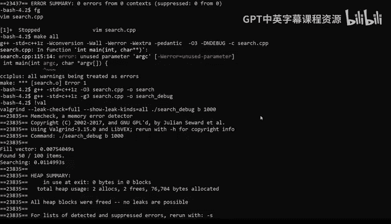
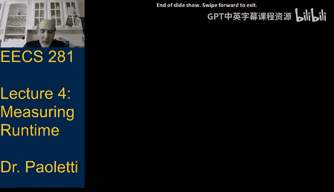

# 数据结构与算法：04：性能测量与分析工具 📊

在本节课中，我们将学习如何测量程序的运行时性能，并介绍几种实用的分析工具。我们将探讨如何在代码内部进行计时，如何使用外部工具（如 `time`、`perf` 和 `Valgrind`）来评估程序效率，并理解如何解读这些工具的输出结果。此外，我们还将通过解决递归关系来分析算法的时间复杂度。

---

## 概述

性能分析是算法设计和优化的关键步骤。仅仅通过理论分析（如大O表示法）可能不足以揭示代码中的实际性能瓶颈或隐藏错误。因此，我们需要结合实验测量来验证理论预测，并找出改进代码的方法。

上一节我们介绍了时间复杂度的概念和计算方法。本节中，我们来看看如何通过编程和外部工具来实际测量程序的运行时间。

---

## 程序内计时 ⏱️

我们可以在程序中添加代码来测量特定部分的执行时间。在C++中，可以使用 `<chrono>` 库来实现一个简单的计时器类。

以下是一个计时器类的示例代码：

```cpp
#include <chrono>
#include <iostream>

class Timer {
private:
    std::chrono::time_point<std::chrono::high_resolution_clock> start_time;
    double elapsed_time;

public:
    Timer() : elapsed_time(0) {}

    void start() {
        start_time = std::chrono::high_resolution_clock::now();
    }

    void stop() {
        auto end_time = std::chrono::high_resolution_clock::now();
        elapsed_time += std::chrono::duration<double>(end_time - start_time).count();
    }

    void reset() {
        elapsed_time = 0;
    }

    double seconds() const {
        return elapsed_time;
    }
};
```

使用该计时器的示例：

```cpp
int main() {
    Timer timer;
    timer.start();
    // 执行任务1
    timer.stop();
    std::cout << "任务1耗时: " << timer.seconds() << " 秒" << std::endl;

    timer.reset();
    timer.start();
    // 执行任务2
    timer.stop();
    std::cout << "任务2耗时: " << timer.seconds() << " 秒" << std::endl;

    return 0;
}
```

需要注意的是，在循环内部频繁启动和停止计时器会引入显著的开销，因此应确保计时操作不会影响被测代码的性能。

---

## 外部测量工具 🛠️

除了在代码内计时，我们还可以使用操作系统提供的外部工具来测量程序性能。

### `time` 命令

`time` 命令可以测量程序的执行时间，并提供以下信息：
- **用户时间**：程序在用户模式下运行的时间。
- **系统时间**：操作系统代表程序执行系统调用所花费的时间。
- **实际时间**：从程序启动到结束所经过的“墙上时钟”时间。

使用示例：
```bash
/usr/bin/time ./my_program arg1 arg2
```

输出示例：
```
0.26 user 0.65 system 0:00.92 elapsed 99% CPU
```

### `perf` 性能分析器

`perf` 是一个强大的性能分析工具，可以统计程序中各函数的执行时间占比，帮助定位性能瓶颈。

使用示例：
```bash
perf stat ./my_program
```

在实验室环境中，可能需要先加载特定模块：
```bash
module load gcc/6.2.0
```

`perf` 对于优化代码非常有用，但需要足够大的输入数据才能获得有意义的采样结果。

---

## 内存分析工具 🧠

### `Valgrind`

`Valgrind` 是一个内存调试和性能分析工具，主要用于检测内存泄漏和未初始化内存的使用。

使用示例：
```bash
valgrind --leak-check=full --show-leak-kinds=all ./my_program_debug
```



为了获得行号信息，需要使用调试版本的可执行文件（使用 `-g` 编译选项）。

`Valgrind` 的输出会指出内存泄漏发生的位置，帮助开发者修复问题。

---

## 实验数据与理论预测的对比 📈

在测量程序性能时，可能会遇到实验数据与理论预测不符的情况。以下是几种常见原因及解决方法：

以下是可能的原因及解决方法：

1.  **实验数据比预测差**：
    *   检查复杂度分析是否正确。
    *   检查代码是否存在错误（如不必要的拷贝）。
    *   确保使用了正确的编译优化选项（如 `-O3`）。

2.  **实验数据比预测好**：
    *   可能未测试最坏情况输入。
    *   复杂度分析可能过于悲观。
    *   输入规模可能不足以体现渐进行为。

3.  **数据匹配但程序过慢**：
    *   可能存在性能“小问题”，如使用低效的库函数或I/O操作。
    *   检查是否启用了编译器优化。

---

## 递归关系求解 🔍

递归算法的时间复杂度通常通过递归关系来描述和求解。我们通过“代入法”来解递归式。

### 线性递归示例

考虑以下递归关系（如线性搜索的递归版本）：
```
T(n) = T(n-1) + C1, 当 n > 0
T(0) = C0
```

求解过程：
1.  反复代入展开：
    `T(n) = T(n-1) + C1`
    `= [T(n-2) + C1] + C1 = T(n-2) + 2*C1`
    `= [T(n-3) + C1] + 2*C1 = T(n-3) + 3*C1`
    `= ...`
2.  重复 k 次后：`T(n) = T(n-k) + k * C1`
3.  当 `k = n` 时，到达基例：`T(n) = T(0) + n * C1 = C0 + n * C1`
4.  因此，时间复杂度为 **Θ(n)**。



### 对数递归示例

考虑以下递归关系（如二分搜索）：
```
T(n) = T(n/2) + C1, 当 n > 1
T(1) = C0
```

求解过程（假设 n 是2的幂）：
1.  代入展开：
    `T(n) = T(n/2) + C1`
    `= [T(n/4) + C1] + C1 = T(n/4) + 2*C1`
    `= [T(n/8) + C1] + 2*C1 = T(n/8) + 3*C1`
    `= ...`
2.  重复 k 次后：`T(n) = T(n / 2^k) + k * C1`
3.  当 `n / 2^k = 1`，即 `k = log₂n` 时，到达基例：`T(n) = T(1) + log₂n * C1 = C0 + C1 * log₂n`
4.  因此，时间复杂度为 **Θ(log n)**。

对于更复杂的递归式（如分治算法），我们将使用**主定理**来求解，这将在下一讲中介绍。

---

## 总结

本节课中我们一起学习了多种测量和分析程序性能的方法：

1.  我们学会了如何在C++程序内部使用计时器类来测量代码段的执行时间。
2.  我们介绍了外部工具 `time` 和 `perf` 的使用，它们可以测量整体运行时间和分析性能瓶颈。
3.  我们使用 `Valgrind` 来检测内存泄漏和其他内存错误。
4.  我们讨论了实验数据与理论预测出现差异时的可能原因和排查思路。
5.  我们通过代入法练习了求解简单递归关系，以确定递归算法的时间复杂度。

掌握这些工具和技术对于开发高效、可靠的程序至关重要。在接下来的课程中，我们将继续深入算法分析，并学习更强大的分析工具（如主定理）。