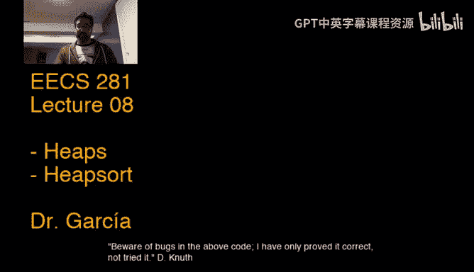

# 数据结构与算法：08：堆与堆排序

## 概述
在本节课中，我们将要学习一种重要的数据结构——堆，以及基于堆的排序算法——堆排序。我们将从堆的基本概念开始，逐步深入到其实现细节和核心操作，并探讨堆如何用于实现优先队列。通过本节课的学习，你将掌握堆的原理、实现方法及其应用。

## 堆的基础知识

上一节我们回顾了树的基本概念，本节中我们来看看堆的具体定义和性质。

堆是一种特殊的完全二叉树，它满足堆序性质。堆主要分为两种类型：最大堆和最小堆。在最大堆中，对于树中的任意节点，其所有子节点的值都小于或等于该节点的值。这意味着根节点存储的是整个堆中的最大值。最小堆的性质则相反。

堆通常使用数组来实现，而不是使用指针连接的节点结构。这种实现方式利用了完全二叉树的特性，使得我们可以通过简单的数学运算在数组中找到任意节点的父节点或子节点。

以下是堆中节点索引关系的公式：
*   父节点索引：`parent(i) = i / 2` （整数除法）
*   左子节点索引：`left_child(i) = i * 2`
*   右子节点索引：`right_child(i) = i * 2 + 1`

注意，上述公式基于数组索引从1开始。如果索引从0开始，公式需要相应调整。

## 堆的核心操作

理解了堆的结构后，我们来看看如何维护堆的性质。当堆中某个节点的值被修改，可能破坏堆序性质时，我们需要通过两个核心操作来修复它。

### 上浮操作

当堆中某个节点的值**增大**（在最大堆中）时，它可能变得比其父节点还大，从而违反堆序性质。上浮操作通过不断将该节点与其父节点进行比较和交换，使其“上浮”到正确的位置。

以下是上浮操作的伪代码描述：
```
function fix_up(heap, k):
    while k > 1 and heap[k] > heap[k/2]:
        swap(heap[k], heap[k/2])
        k = k / 2
```
该操作的时间复杂度为 **O(log n)**，其中n是堆中元素的数量。

### 下沉操作

当堆中某个节点的值**减小**（在最大堆中）时，它可能变得比其某个子节点还小，从而违反堆序性质。下沉操作通过不断将该节点与其较大的子节点进行比较和交换，使其“下沉”到正确的位置。

以下是下沉操作的伪代码描述：
```
function fix_down(heap, k, n):
    while 2*k <= n:
        j = 2*k
        if j < n and heap[j] < heap[j+1]:
            j = j + 1
        if heap[k] >= heap[j]:
            break
        swap(heap[k], heap[j])
        k = j
```
该操作的时间复杂度同样为 **O(log n)**。

## 基于堆实现优先队列

掌握了修复堆的操作后，我们可以利用它们来实现优先队列的基本操作：插入和删除。

### 插入元素

向堆中插入一个新元素时，我们首先将其添加到数组的末尾（即完全二叉树的下一个空闲位置），然后对这个新元素执行上浮操作，以恢复堆序性质。

插入操作的步骤非常简单：
1.  将新元素置于数组末尾。
2.  对该元素的索引执行 `fix_up` 操作。

### 删除最大元素

从最大堆中删除元素通常指的是删除并返回根节点（即最大值）。我们首先将数组末尾的元素移动到根节点的位置，然后对根节点执行下沉操作，以恢复堆序性质。

删除操作的步骤如下：
1.  将根节点（最大值）取出。
2.  将数组末尾元素移至根节点位置。
3.  对新的根节点索引（1）执行 `fix_down` 操作。
4.  堆的大小减一。

## 堆排序与堆化

堆不仅可以用于实现优先队列，还可以用于高效的排序，即堆排序。堆排序的第一步是将一个无序数组转化为一个堆，这个过程称为“堆化”。



### 堆化

堆化是指将一个无序数组重新排列，使其满足堆的性质。一种高效的方法是自底向上地对每个非叶子节点执行下沉操作。

以下是堆化过程的描述：
```
function heapify(arr, n):
    for i from n/2 down to 1:
        fix_down(arr, i, n)
```
令人惊讶的是，这个看似简单的循环可以在 **O(n)** 的线性时间内完成堆的构建，而不是直观上的 O(n log n)。我们将在后续课程中详细分析其原因。

### 堆排序算法

一旦数组被堆化，堆排序算法就变得非常直接：
1.  将数组堆化（构建最大堆）。
2.  此时，最大元素位于 `arr[1]`。将其与数组末尾元素 `arr[n]` 交换。
3.  堆的大小减一（忽略末尾已排序的最大值），并对新的根节点 `arr[1]` 执行 `fix_down` 操作，以恢复最大堆性质。
4.  重复步骤2和3，直到堆中只剩下一个元素。

堆排序是一种原地的、不稳定的排序算法，其时间复杂度为 **O(n log n)**。

## 总结
本节课我们一起学习了堆数据结构和堆排序算法。我们首先定义了堆作为一种完全二叉树，并介绍了其堆序性质。然后，我们深入探讨了如何使用数组高效地实现堆，并详细讲解了维护堆性质的核心操作：上浮和下沉。基于这些操作，我们实现了优先队列的插入和删除功能。最后，我们介绍了堆化过程以及如何利用堆进行排序。堆是一个功能强大且高效的数据结构，在优先队列和排序等场景中有着广泛的应用。