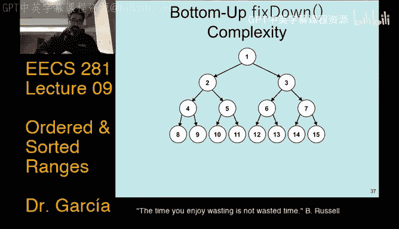
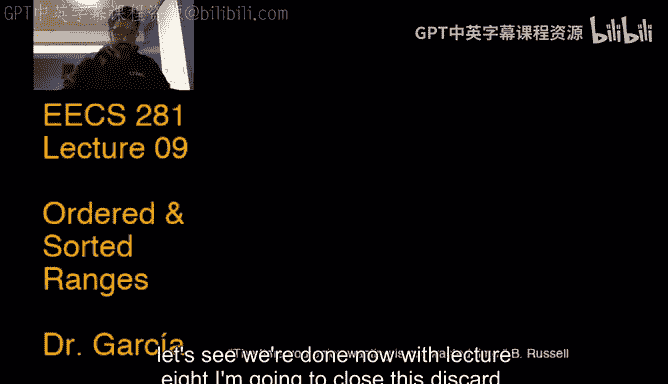
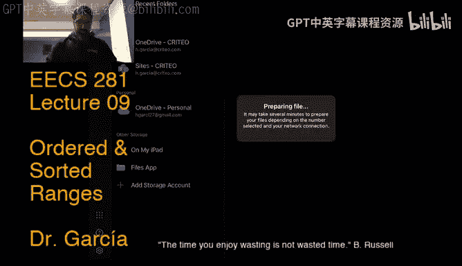
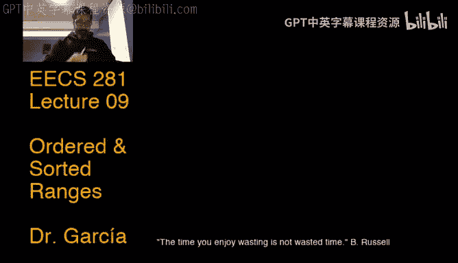

# 密歇根大学《数据结构和算法｜eecs281 Data Structures and Algorithms Winter 2021》中英字幕 - P8：-09-EECS 281_ W21 Lecture 9 - Ordered Arrays and Related Algorithms.zh_en - GPT中英字幕课程资源 - BV1snk5BWEfc

Right。🎼Let's see。Hello everyone， we're down to。Five minutes or so to start at node。嗯。

Can I get a quick check mic on the chat？Well， there you go， I got Connor。Good。

 I'll be right back to my kids to log off any the devices。🎼，🎼听。🎼你。Great。Coming up。🎼通。

Maybe give it another couple minutes for folks to join。Oh quote of the day。

 the time you enjoy wasting is not wasted time。It is by。Quote from my favorite philosopher slash。

Loagician。For Trend Russell。He has many interesting quotes that I encourage you to check out。

This one is my favorite because it。You know。Basically how I justify the many hours that I spent playing Apex legendds。

嗯。There。Academic way to justify life。Wasting up timeline。🎼て。不けことスた。Yeah， that's so。

This quote for Bran Russells is definitely out of context in the course。嗯。

You don't want to apply necessarily this for the course or do so at your own peril。嗯。Okay。

 I'm just tried。 Oh， Apex has been out for。 I think， I think it's the。This month。

 it was the two year anniversary or something they' had been playing it for the full two years。

 Love that game， spent way too many hours playing8pex legends。I play with my kids。

My 14 year old is way better at it than I am。All right， let's see we're kind of two after 12。

 So let's get started because so hopefully this time around we don't have technical issues I've kind of。

Updated some configuration in my router to basically get priority priority to my laptop。

 Let's doing the streaming。 So hopefully we don't run into any issues。

 I think it was more of an Xfinity type of。Issue at the time because honestly I hadn't seen that before。

 but still just to make sure。So last time run to some technical issues put us a bit behind so even though today's lecture is lecture nine on ordered and sorted ranges。

 before we started we need to finish a previous lecture which is we still needed to cover HeEPAify and HeAPSo right HeEPAify specifically is' particularly important for project two。

And basically the last lecture that we had， lecture 8。

 it you heard me say throughout the lecture is very important for Project two which is now out。

 so again do not apply for the quote that's on the slide for project two。

 you want to start as early as possible get you submitted to the autograder as early as possible。

So yeah， let's get started just to finish off of these two topics。No。

If you recall last time hepaphi is a way in which I take some array or vector， again。

 I use those terms interchangeably vector array。They a random， say say they're integers， right。

 they're all in random order。And I pass it to this hepaphy function。Which。When it comes out。

 when the array comes out of that heEPA Phi function。

 it's now going to be an array that follows all the properties that I need for a heap。

 namely it represents a complete binary tree where each node satisfies the heap ordered property。

So that's the point of the hePApaphy and we spoke about the fact that that's a summary there。

When he spoke about the fact that there's basically four ways that you can do this and basically only one of those four is what you would want to do。

 two of them do not work。Flat out， they do not work， two of them do work。But out of those two。

 you only want to use the one that's fastest， which is what we call the hePAphi function。

And that is where you proceed bottom to top， do and repeat fix down on the array okay when bottom to top is kind of the tree view of the heap。

If you're looking at it from the array point of view， which is what you're using to implement。

 then what you're doing is just traversing the array。Right to left。If you remember。

 go back to the previous lecture and all the properties that the array would obey behind the scenes as long as it's following the heat border property。

 it means that the second half of the array is basically all the leaves。

InIn the tree that represents the heap。And then the first half would be all the internal nodes of the heat tree。

 Okay And again， we always made the difference between representation with a tree， but。

Implementation was just using the array Okay， just because it's way faster。 Yes。

 you could implement it using your good old you know tree node implementation。

 but then you'd have to traverse nodes and all that stuff and you can't take advantage of random access。

 So kind of the ideal way to implement。A heap tree is using an array。All right。😊。

So let's look at how this works。 and then I'll convince you that this。

 the runtime of this procedure is in linear time， right。

 which is quite interesting because you would expect it be something like n log N。

 right because take the。A last bullet point。There shows the other way that it would work。

 which is to do top down， meaning traverse the array left to right or iterate over the array left to right doing fix up。

 that would work， but that would give you a runtime of n log n right and you would that makes sense because if if I'm doing ups and each fix up is worst case。

 log n。And I'm doing n of those， then it makes sense that it's n log n right， no。

 nothing too complex about that runtime but then。If you look at the first bullet。

What we're doing is also iterating。嗯。Over the array， doing fixed down。

 which we said is also log n time。 So how come there we arrive at a linear time run time rather than N log n。

 And that's what we're going to talk about because it's not。It's not trivial to come up with that。

Alright， so here's the procedure that we're going to do。

 There is both our tree representation on the slide and also down below is the array representation。

And so what we're going to use is bottom up， fix down，Again。

 bottom up is nothing but I traverse the array right to left。

And if I were to traverse the array right to left， I would immediately see that there's no fixed down that I need to apply for one half of the array because it's all leaves。

Okay， remember the right half of the array， all leaves， there's nothing to fix down。

 remember fix down would move the nodes would swap with one child all the way down until it reached the bottom。

It's already the bottom。 There's nothing to swap down All right， so nothing to do。 So in fact。

Our loop can just start at half of the array， right。

 you don't even need to start at the rightmost element in the array。😡。

And so the first note that I would。The check whether I need to fix down is one is the node that contains the value one。

 which would be the node index by4。And just to make that distinction。

 because it's confusing that the values contained in the tree are integers。

 but we're also using integers for iniceacy。The node index at 4 has value1 and that's the one that I would try to fix down。

 which indeed I would pick the max out of the two which would be 81 and I'll swap with that right and then I would the next node that I would check would be five because that's the next one up right？

That node that has so the node3 that has value 5 and then do a fix down there。

 which would make a swap with 14， then the next node that I would check that has value2 and it also happens to be node2 I。

Check that one and of course， pick 81 to swap with。And then lastly， I check， oh， excuse me。

 there's one more， so fixed down had not done its work by doing one swap。

 and needed to do two swaps at that point。And then it's all on。

 and then we would check the root node。Wwhich contains value 4 and decide that I would swap with 81。

 still not done， that might require another swap with 18 and at that point it would be done。嗯。Cool。

 and that would be that that would be our procedure， so notice that we really only iterate it。

This oops。We only really iterated。On this hat。哎。😊，Doing fixed down all along。 And if you notice。

 you see that a lot of them。I only needed to do one swap。

Other times I needed to do two swaps right with the fixed down call would cost two swaps and at most。

The fixed down would cost three swaps， okay？So that's the rationale that I'm going to use to come up with the linear time runtime is I'm going to。

Count how many possible swapwas can the F down be doing？Okay， at each point。All right， so， oh。

 that's my tree right there。 So now let's， let's go about our business。嗯。Oh， so this is the， let me。

 let me go back。 This is the array representation means like。

I'm done with half of the array because every they're all leagues no need to do anything there。

 right I check one， I compare against the two children。

 pick 81 to swap with and the animation does that really nicely for me and then check five against9 at 14 and so on and so forth。

So it's basically the same thing that we did with the tree， I like the tree representation better。

 it's nicer， but of course the actual code would be using array so it's particularly relevant as well。

Then we're done。So now let's look at in terms of number of swaps。

 how much work is actually being done by this particular hepaify function okay？So。

Let's say if we're counting how many swas we would need to do if we're doing to fix down on the leafs nose。

 but that's easy， that's zero swas because they're already leaves right。

 and there's half of the nodes in the tree are leaves。Okay。😊，So。Basically。

 a big chunk of the nodes don't really need to do anything。嗯。

Then for end divided by four leaf internal nodes。😡，I'll have a max of one swap， right。

 because if you look at the tree representation， it'll be the next level up and there's only one possible。

Fix down swap that you could do because the next level that you run into is the leaf is the bottom of the tree is where the leaves are at。

You cannot do any more swaps down。Okay， and then。Say one level above， then have。

 I'd have n divided by8 internal nodes there with a potential number of swaps being two Okay。

 so that gives。A total of swaps for that level， right， two nodes times two swaps get four max。

 four swaps max， right？And then similarly， at the top level。

 I have n divided by 16 internal nodes with a maximum of three swaps each。Um。

 and that gives you well， topmost level， just given by the size of this tree， only has one node。

 which is the root node。Times the three possible swaps worst case that you end up doing。

 that gives me three swaps max， okay， and if I add all that up， okay？

Then you see that the total number of nodes。Roughly it's going to equate the number of potential swaps that you'll have to do。

 in fact it's always a little bit smaller。Okay the number of swaps as compares to the number of total nodes in the tree and you can generalize all this math right so instead of you know you have end nodes with K levels right and then you come up with all the math for doing it and it'll come down to being linear time so that's how。

You get linear time for this approach， right？Whereas with other approaches is and login。Okay so very。

 very efficient method。嗯。So I leave it as an exercise to generalize all this math。You can also。

 I believe CLRS has a nice discussion on this where all the math has worked out for again。

And generalized tree with end nodes and K levels。All right。Let me quick check on questions。Oh。

 by the way， and I think that was in the previous light， right， let me go back， oh。

 this is a lot of momentum see if I can jump real quick。Yeah， this that we just discussed。

 the implementation in the STL for this function is called makeHeap， so it's not called HePAify。

 it's just called mateHeap， and it works on any vector。

It might also work for other types of containers I'm not sure you'd have to check very sure it works on vectors and what you'll be using in Project2 is makehe on a vector。

 you would pass it iters， the begin and iterator of the container。Okay， I think that was a question。

That was askedop。嗯。DexX might work， but again， you would have to check。All right。

 so that's hepophy now heap sort。

Okay， so if I ask you to give in a heap， if I and usually do this when it's like live lecture in person。

 like we do it as an exercise， all right， so you know what a heap is。Give me an algorithm。

For shorting， using。A heatap， right so if I gave you a vector of random integers。

Develop an algorithm that uses a。That gives the output。The same vector， but in sorted order。

And so you would， you know you would say， well， I mean， if a heap。You know。

 all I got to do is push a bunch of stuff into it and then I can easily get whatever the max， again。

 assuming it's a max heap。Um，And I would every time I pop， I would just get whatever the max is。

Then all I need to do is push everything into the heap right and then pop everything out and everything' is going to come out in sorted order and there it is。

 that's my He sort algorithm and in fact， yeah， that's basically how Heap sort works but in the explanation that I just did notice that I had to use an extra vector。

Because if I have my input vector that contains all random ints。

 that is separate from the internal vector that's going to exist inside of the heap that I's still going to need because as I said。

 I would push everything that's in the first vector into the heap so the heap will need to fill all the way up and then I pop everything out。

And everything will indeed come out and sorted over there， but I ended up using。嗯。

Linear space with that extra vector that I use for my heat。Also the runtime would be and log in。

Because I will spend n pushes into the heap and that's already n log n and then I'm going to pop everything out。

 that's another n log n which overall runtime is to be two times n log n but O of n log n。Okay。

 so that would be a heap sort algorithm straight up， but we can do way better。

And because what we can do is effectively reuse the same。😡，Vectctor that's given to us。

To do heap sort right so rather than using a separate heap container to push all the elements in there。

 I can reuse the same vector that I'm given。And this works specifically because we have the heEpa P function。

So this heap sort algorithm， if you see line  two right here， first thing it does is say， all right。

 I'm just going to hepify the same vector that I'm given or the same array that I'm given。

 essentially what we're using here an array rather than a vector。嗯。Just heapify， all right。

 so now I have my heap。But I still need everything to be inserted order not in heap order。😡，Okay。

So what I would need to do is something very similar。To hepaify。Except that before I call fix down。

 I do a swap。ok。😊，Because notice what I would want to do is like， all right， so my max element。

 I know where it is right， it's the very first element in the array。😡，Um， so I know that's the max。

 so I just swap it with the other end。Of the array and then call fix down on it。Okay。

 so that's what it's being done here in line four， you're doing the swap with your swapping。

Whatever the max element is and put it at the end of the array， the current end of the array。Okay。

 and then from then on out， I would just fix down on that correct。Where the current max is。诶。😊。

So this is easier to see with a neat animation， right， so let's look at it。This is both my tree heap。

Picture。And also， my。Aray heap。Representation。What I would do then is， oh， I'll just take the root。

 let me so the root right now is 81 and the last element in the array is one right so I'm going to swap 81 and1 so I do that swap and then all I would need to do is call fix down。

All the way。From one through eight。Okay。😊，So then after that's done then I would swap 18 with two and then call fix down that may notice that that the fixed down and I'm skipping all the fixed down swapwas that would happen right because otherwise this animation would take forever right but if you see two was here after the swap and I would call fix down and then it would place it all the way down here right this is where two is now at。

😡，诶。And then I'd be done with that， and then I would swap now 14 with five place five。

At the beginning of the array and the call fix down again puts five down here， right。

 then I'd be done， then move。Sorry， swap。Nine with two okay， fix down， moves two down here。

To the index at four now。And then so， you know， we would just rinse repeat。

All the way down so effectively， what we're doing is the same approach。As we described earlier。

 except we're using the same array that we're given as input to also store the elements that I'm popping effectively popping out of the。

Out of the array， right， but we're not really popping， we're just swapping。

So that's how Heap sort works。 and so now instead of having a linear space algorithm with an n log n runtime。

 I have a constant time， sorry， excuse me， constant space algorithm。But I'm still at n log n runtime。

 right， There's no way to get around n log n because I have a for loop and inside of the for loop。

 I'm calling fixed down each time Okay， and， and yes， that the fixed down in this case。

Would be log end time， would be considered log end time。Cool。

 and then the other work that I did in my Heap sort algorithm is the hepaphy。

 but then that means that overall I just have O of n with the hepahi plus O of n。Loin。Which is。

And log， right。Okay， because。This right here is of N log N。 Sorry， O n。 and then this right here。

Of and。冇嘅。系。For a total and login。So that's sorry right， this is the problem with having animations。

Find a different way to jump to So that's our summary for Heap sort。Okay。😊。

Given an n elements in a vector or array， you first convert to a heap， okay？

Using your hePA P function。W which just takes linear time。

Then conceptually remove elements one at a time so pop every element one at a time from the heap。

 except that if you go back to the code， we're really not popping all we're doing is swapping。😡。

To store whatever was popped in the same array。Um， so what you're doing is removing by just swapping and filling the original array from back to front。

系。Um， and that's， you know。That's the algorithm， you know， fairly。Fairly smart algorithm。

 so it's an analog login。Soting algorithm， which we consider to be an efficient sorting algorithm as compared to elementary sorting algorithms which we'll cover in the next lecture we'll start covering in the next lecture。

嗯。Other examples of fast or efficient sorting algorithms。

 which we will discuss are quick sort and merge sort。

And we'll compare each one of these algorithms in turn。

And we'll dive deep into what each one of these algorithms do Okay， so fairly。

Fairly cool algorithm that takes advantage of a neat data structure。All right。

 so that's set for Heapify and Heap sort let's see we're done now with lecture 8， I' to close this。

Discard。う。

With me while I open。

This slides for lecture9。

不。All right。😊，I think we're good now， well， that's not what I want。

 You' all seeing the percenter view。Well， that's not good。I'll just do that。

Then I have no percent of you all right。So before I move along to lecture nine， let me make sure。

 so I don't know if have do we have anyone from staff today answering questions， hopefully。

Not I'll try to paint someone。Let's see wait which version of Heapert was O of n then So no version it was O of n in terms of space Okay。

 notice theres always a space complexity and the time complexity the first algorithm that I described I didn't give code for right it's kind of the algorithm that you probably would have thought of if I assigned you the task so like using a heap give me a sorting algorithm okay。

That will require。Or then extra space。Okay， but it's still。O of N login， total runtime。😡，Okay。

There is no linear time。Heap sort algorithm。 Heap sort is considered an in login algorithm it does。

If you look at the code， it does use HeEA5 function。

 but the HeEPAfi function just does take linear time， right。

 but then because you have the for loop that calls fix down， the overall runtime is still and login。

I think we just said， okay， oh， and I guess I answered it again。 Okay， Heapify。

 why use this instead of me sort or quickword the space benefit， Yes， we so Owen。

 we will get to talk a lot about that in later lectures There are instances in which you would want to use Heap sort。

Over me sort or quick sort， but most of the time in practice， you would want to use Quicksort。

There are specific situations where you can only use mergech sort， which again， we'll talk about。嗯。

We haven't seen any staff in the chat yet， yeah， it looks like only try to ping someone， but if not。

 then I think we'd be good for today。But there's a heap sort that's in place， Yes， correct Sohi。

 that was the algorithm that I gave you the code for in the previous set of slides。

That algorithm is in place and notice that the big difference was with doing the swaps right。

 the swaps will just move each of the maxes that you get on each pop and just move it to the back of the array。

 So you're basically using reusing the same array in which you're called hepaphy。Yeah。All right。

 so let's move on to our next topic which is ordered and sorted ranges。

So this lecture is actually a mishmash of a couple of things that are quite important in practice。

So when you go off in your careers， you will have to pay close attention to when the container that you're using to do whatever it is that you're using is number one。

 whether it's ordered number two， whether it is sorted。

 so ordered and sorted are not the same things okay as you're going to discuss okay。All right。So。

So far we've been using and reusing the term container for a lot of things and really there's kind of no way to avoid it。

I mean， in its most generic definition， a container is something that contains objects。

 so it holds objects in one form or another。Okay。Um， you know。

 it could just be for storing variables， okay， or it could be for storing more complex objects。

 right that are instances on some class， so on and so forth。

Now the idea is if you're storing all these elements， because again， whatever they are。

 whether just simple variables or permanent data types or more complex objects。

 right so we just call them elements right？If you're。

Have this particular structure that's containing this set of elements。

 you're facilitating a way to protect or control all those elements。Okay。

So that means that it facilitates， say copying all the elements， making updates， you know。

 modifying by maybe sorting them right or doing anything with this collection of elements or objects。

So examples of these that you're very familiar with by now， especially given project one and then。

Probably already starting in project two， hopefully。Vector D stack map list， right。

 they're all examples， specifically SDL examples of what we mean by a con， right？

And you can have several types of containers。 You can have a container where really。

 you don't care in what order you're storing the elements， right。

 You just basically throw all those elements in the container。 Don't care。 right。

 That's an unordered container。 There are some benefits to。Using an uneared container。

Which we'll talk about。Now you have an ordered container。 which is， hey。

 I'm placing these elements in there， but they should follow a particular order。Okay。

 and the advantage there。Is that because the elements are following a particular order。

There's stuff like querying whether an element exists in the container。Is way easier。

Because we can rely on the ordering to do things a lot faster than if we have to assume that there's no ordering right so well if there's no order have all I can do is like search everything potentially。

Till I find what I need。And then you have nested containers， we don't cover them here。

 but of course if you have you definitely use nested containers in project one right when you were declaring classes and in there there was a vector of vectors and stuff like that。

 right。But there's nothing specific to say about an nesttic container other than you can declare them。

 and then you you'd have to manipulate them in whatever way you seem fit。哎。😊，All right。

 so more specifically types of containers that you know。

 with regards to the SDL right so if you're searching STL literature or general C++ literature。

We there are these distinctions made about types of containers， which is， you know。

 a container just a。Soy call it generic so plain container that's going to support add and remove operations。

 That's kind of like the base level of operations that you would need to call yourstruct a container right。

 you need to add elements， but you also need to be able to remove elements okay。

A searchable container would mean that it also implements some sort of fine function or query。

 right depending on books instead of fine that I call this query right or just search。

But it's just an operation where what you're looking to do is find some specific element that exists in the container。

Then there's sequential container that allows iteration over elements in some order。

Planin old vector is an example of this。 You can iterate over the elements in the vector。

 I have often often get asked a question like well。

 isn't any container sequential then because I should be able to take any container and iterate over each one of the elements。

 No， for example， the SDL stack or the SDL Q does not allow you to iterate over the elements in。

The stack or the Q okay and there's reasons for that it would basically violate the ADT for either a Q or a stack。

So there's an example of when， even though behind the scenes。

 a stack or cube might be using a vector， the abstract data type of a queue does not facilitate a sequential iteration over the elements in the stack or the cube。

Then there's an order container， which is a sequential container that maintains some current order。

Okay， now。This is often confused with the mathematical term for the ordering。😡，Of a set。Okay。😊，This。

 when we say ordering here is kind of very SDL specific。OkaySo an order container means。

 and there's the example there on the slide that is like a bookshelf， right？

If I have a bookshelf and the books are in some particular ordering。I don't know my color or height。

If I take one of those books out， that doesn't change the ordering of the rest of the books that are currently in the show。

Okay， so same deal but with containers right an ordered container would mean that in whatever order it has right now。

 if I take something out， that's not going to change the ordering of anything else that still remains in the vector or array。

Okay。😊，And then there's a sortded container， which is this sequentialial container with a predefined order。

Okay， so you cannot arbitrarily insert elements， right。

 because it would break the constraint sorted of the sorted container。😡，Right。So。

That begs the question。Which would sort of containers be preferred or when， Excus me。

 Would sort of containers be preferred over an ordered container。 Okay。

 And the answer to that would be， well， if I knew to， if I know。That in my particular。Requirements。

I'm supposed to search this container。😡，Quite often， and in fact。

 if I need to search it or call the find operation。😡，A lot more times than I need to insert into it。

Then asorted container is ideal。Because if it's sorted， I could take advantage to do faster queries。

😡，And if you're if you're thinking， oh， yes， because it would be binary search， yes， indeed。

 which we're going to cover in the next。couple of slides， but more generic。

If it's some particular sorted order。That should allow me to do faster queries。And again。

 if in the requirements is specified。Well， I just have this pool of elements that you'll just store in memory and then I really don't need to add。

 right， let's say that if we're storing the cities。In in the US， right？Well。

 that doesn't really change that often， right？I would basically load up my container with all the cities in the US。

And I ordered them alphabettic or order。Okay， so now it's sorted。

And now if I need to query whether you know。Some particular city is in there is an actual US city。

 then all I need to do is just do a binary search on my container。You know， real fast lookup。

Well let me tell if it's a valid city in the US。And only now and day would I need to insert a new city？

Okay， and so inserting。Will take。Um， call it a runtime penalty because you need to insert in a way that maintains the sortded order。

But that's okay because most of the time I'm just doing lookups。So I'd rather do that。All right。

 so a quick clarification again on what we mean by ordering。order containers， the elements in them。

 maintain their relative physician unless they are moved。So as I was mentioning earlier。

 if a comes before Q， and then you insert Z or z。Okay。😊，Then the relative ordering。Between A and Q。

Has not changed， is effectively the same， and the same also applies if we're removing an element from the container。

诶。So that's what we mean by ordering it is the emphasis is that this is different from the mathematical definition of ordering。

 okay， because。I mean， if you want to look it up right， there's weak ordering。

 there's strict ordering， in fact。The heap ordering constraint that we talked about in the last lecture is an example of a week or excuse me。

 a partial ordering， okay？Just means that。Some of the elements follow a particular order， but。

Some of them might not。喂。So that's what is known as partial ordering。But again。

 that's not what we're interested in in terms of ordering is straight container specific。

 which is what's described on this slide that I just went over， okay？And it's very relevant to SDL。

 not the mathematical definition of order。Okay。😊，All right。

 so now that I know what difference is between sorted and ordered containers。

What if I want to implement such types of containers right because yes。

 we have the SDL you might be like， well， why do I need to implement them if I have。

 you said we have the SDL deck and vector and so so and so forth。

 Why do I need to implement them Well， because this is a fundamentals course right so you might。

You know， want to implement your own specific custom container。

 which in fact you will in Project two， specifically a bunch of priority cues。嗯。Well， for。

 not a bunch， four， it's not a bunch。All right so。You。

The two main types of implementations that we will focus on here is array based versus linked list base。

Array， if you recall， contiguous you know， slots in memory that are assigned for the array。

Whereas a linked list is more like connected node that might exist in different spots in memory。

 okay？Now， so which type of implementation you would？Pick whether an array or a linked list。

It really depends on the context and the requirements that you have for the container。听。嗯门。

So you'd have to really think about like which of the operations。

 specifically the ones that I talked about in the previous slide。

 which ones would I call more often than which others than what other ones that I have？

So I just gave an example。With that for the US cities， right？嗯。

So it does benefit to study kind of multiple implementations that you can have for both you know。

 array array versus some linked lists so that you understand the trade offs and the benefits so that you can make。

 you know a。Good decision。So that begs the question。

 when would a linked list be preferred over an array， Okay， and this was maybe。

Two lectures ago when we were。When I was showing plots of vectors versus lists in STL。

 right so when we were discussing the performance of STL containers。嗯。

I described the benchmarks and you know one of the benchmarks was something like， well， if I just。

 you know， take my container and basically insert a bunch of elements in the middle。

Of the container you saw in those performance comparisons that that's when lists would shine and that's an example。

Of a context in which you would。Pick a list over an array。And I mentioned last time I'll repeat it。

 that's kind of our contrived situation like in practice。

What you'd want to do is like implement your overall requirements。

Such that you don't fall into a situation where you have to insert in the middle of the container。

 right， so basically you know。You would structure the feature that you're trying to implement。

 say if you're implementing a feature for an app right， you would decide like well。

 I just rather redesign how I implement that feature so I don't end up having to insert in the middle of a container。

 you'd rather do that， which is why in practice you often kind of end up staying away from lists and。

Most of the time want to use a rights， but again。Theoretically and for the purposes of fundamentals in this course。

There are specific situations in which， a linked list would actually be pre fair。Okay。All right。

 so I'll pause here， take a quick glance at the chat。

You can pass a comparison factor that tells sort how to sort。Actually。

 so I don't know whether there's a Heap sort STL I dont I don't can anybody check whether there is I've never used it if there's a heap sort STL function。

 I usually well not usually always use。The SDL sort function rather than keep underscore sort if there is such a thing。

So I'd be curious。嗯。But how does it reverse anything， wouldn't that ensuresure the right order？

Each sword will start with a heap with the smallest element at the head。

 then stored by placing that at the bottom， yes。And then because heaps are usually sorted maxim in。

Those men to maximize default well， this is kind of a。And I think Ian。

Ian just checked there is no heap sort in the SDL。 Thank you Ian for looking at that。

 but there is a sort heap。Oh。Which I've never actually used either， so that's interesting。

 we should look this up for the course。All right， but most of the questions are about heap。

 So let me just keep going with sorted and order containers。 All right。

 so here's the table comparing。Complexities of an ordered container that I might implement with either an array or a linked list right。

 so the idea is to highlight where the trade offs would be， right？Adding an element。

 whether it remember ordered container。It means。All it means is that again。

 if I insert or remove something， the rest of the elements currently in the container。

 they do not change。😡，嗯。Their relative order to each other。So an order container using an array。

 that's just going to be constant time because， you know， all I would need to do is just place。

Place the element in an open position in my array。Okay， and I assume， you know。

 or we're going to take away the question of whether I have enough capacity in my array。

 we're going to take that question out of all of this right， if assume that we have enough capacity。

 so all I need to do is just well just place it at the next open slot in my array。

And then a linked list， you know， that's just create a new note okay。

 and then attach it to the linked list by attaching。

 I mean updating the pointers so that you don't get a broken list。All right。

 now removal in an array is linear time， but this is assuming that what we want to do is keep an array as compact as possible right so this is removing a specific value。

Okay， so that would mean that I need to find a value that I'm looking for。

 so as long as find this linear time right here down here， I remove Val， which is again， a value。

That's going to be linear time because I need to call find function to find a value。

That I need to remove from my array and then remove the array。

So and remove the element from the array。In a linked list， well， similarly。

 I would need to traverse to the value。😡，Okay， same the because the fine function is linear time removal of the value is going to be linear time。

 Then you have removing， but having already an iterator。

 meaning I already know what I want to remove。 So I don't have to search for it。 You might think。

 well， that's advantageous。 That means that in an array， I can just go ahead and remove it。

 But remember if it's。You know。Somewhere in the middle of the array。

 we're assuming that we're going to always keep the array as compact as possible， So if we remove it。

 we're going to have to shift all the elements by one right so that my array is always as compact as possible and I don't have like empty。

😡，Elements。In the array， now， this is an example of when you might think back like， well。

 I don't want to spend that time doing。You know。But whenever I remove。

I don't want to spend the time to shift all the remaining elements onto to the left。Okay。😊。

So maybe I'll just change my requirements' like all right， so I won't shift， Ill just don't。

 I won't do that。 I won't shift all the elements。 I'll just mark this element as deleted， right。

 so now I make things a little bit more complex because I have to keep track whether an element in the array is deleted currently deleted or not。

😡，And then I could make my remove iterator operation right here。

I can make that constant time in my array。Okay， but again， for the purposes of the comparison。

 since you know， we're not adding all this complexity about keeping empty elements in the array。

 everythings kept as compact as possible and would I would need to invest linear time to make sure that that array stays as compact as possible。

 All right， and then a linked list。UIt it kind of depends on whether I have a singly linked list or a doubly linked list right if it's a doubly linked list。

 it's constant time。 because again， this is assuming that you're removing already having an iterator to where you want what you want to remove。

Remember， an iterator is really just a pointer， so you basically already have access to the node that you're looking to remove。

Okay， so if it's a doubly linked list， I can just yank it out， fix my pointers， and I'm done。Okay。

 but if it's a singly linked list， I cannot do that。Okay，Because if in a single linked list。

 I don't have a pointer to the previous node， so I would still have to traverse my list to find what the previous node is to the current node that I'm looking to remove。

😡，So that I can fix the pointers properly， otherwise I end up with a broken list。Okay， so that's why。

It's linear time if it's a linked list， it's constant time if it's a doubling linked list。

Find operation for a particular value in the container， that's going to be linear time。

For either an array or a linked list。You know， not hard to see that right worst case。

 we assume last element is at the very end of the linked list or array so。Wororsse case linear time。

诶。The star operator for an iterator， which is just dereferencing。😡，The iterator。

That's basically given a pointer to some element in the container。I want to look at the value。

 so I need to dereence the pointer so I can actually get access to the object。That is constant time。

 whether it's an array or linked list。嗯。😊，And then random access。

 which is the opening and closingloings square brackets operator。

 well that's going to be constant time for an array because I can always just use pointer arithmetic right and get jump to that element。

Okay。😊，呃。Right， because the input to this is an unassigned int， not unassigned unsigned int。

 So given that index， I can just。Jump there， remove that element。Okay sorry， not remove it。

 look at get access to that element。But then a linked list。

Okay that's one of the big disadvantages with a linked list， whether it be Sly or doubly linked list。

I don't have random access。I can't use pointer arithmetic because my nodes can be in different places in memory。

 so I can't jump to a specific note， I have to traverse my way through to that node。

Then you have insert after， which is an operation where you're trying to do exactly that。

 you want to insert just before the given iterator， so notice this takes on two parameters。

 one is the iterator。And what is the value that you want to insert。

 the iterator is the node basically the position in the container where you want to insert that。Okay。

That petition is given by an iterator， so in an array。Similar to the situation for removal。

 it's linear time， and this is where a linked list would shine， this would be constant time。いケ。😊。

Because。You know， all I would need to do is just fix the pointers because it's it's insert after。

And a singly linked list would always have pointers to the element that comes next， right。

 what a singly linked list would meant would。Not have is appointed to the previous node right。

 but to the node that comes after that we can easily access so if I'm inserting after that's constant time for whether it be a singlely linked list or a doubly linked list。

😡，But insert before， right， that's something that's still linear time for an array based again。

 same situation that we have for removal and such。But then in a singly linked list is different from a doubling linked list。

If it's a singlely linked list， it's going to be linear time。诶。😊，Singly。And in a doubly linked list。

 it would be constant time， basically for the same reason than for the removal given an iterator。그。

Allright， so that's comparison of array linked list implementations for order containers Okay。

 all right， so how about for sorted containers， Okay， so sorted containers。

 we're assuming that there's some particular constraint on the ordering。Okay， so you know。

 the way to see it is sorting is a stricter ordering。Okay。

 it's stricter because whatever happens with the container with each operation。

 I want to make sure that that constraint is maintained and I don't break that constraint。

 otherwise you'd have a broken sorted container which is bad because then you know。

 it would just misbehave throughout。诶。So adding an element is linear time， okay？

Adding an element is linear time because you need to find a position the right。

 given the sorted ordering， you need to find the right position at which you're going to insert the element right so it's similar。

嗯。To the previous case， okay and then。But then after that。

We're again assuming that we're going to keep this array as compact as possible。

 so even if I would have， say fast access to find the element。😡，Okay， which I haven't talked about。

 but in fact， for a sortic container。A fine would be， you know。

 way faster than in the ordered container， because if it's sorted， I can rely on binary search。

 which is login right， which is shown here on the slide。 So let's just say that we have fast access。

 I still run into the issue of we're not keeping these like arrays that might have like theest spots in the middle。

 right， our array needs to be as compact as possible， so。B。

 it's still linear time to either add an element or remove it。对。So that's these two right here。诶。

And then for a linked list， it's linear time， largely because they're linked list。ok 啊。

Basically same case as in the ordered container。So removal is a linear time for an array。

Even if you have the iterator。Okay， for the same principle。

We're assuming that if you remove something from the middle of the array， keeping it as。

 it's probably like the third or fourth time， I'm saying it just so it's clear。

It's hopefully expire by now。Um， keep it as back as possible。

 so I still need to shift everything if I remove in the middle end up removing in the middle。

And then linked lists， it's either O of N for a singlely linked list or constant time for a double linked list。

 then you have the find operation， this is where a sorted container would shine right the find operation would be really fast it would be log in time right because I would take advantage of the sorted constraint。

And exploit binary a research whenever I need to find an element in the container。

I can't do that if it's a linked list because I still need traverses to traververse no matter what。

 and I also can't jump， I don't have random access， can't make jumps。So I still need to traverse。

 takes linear time。Then。D reference operator is just constant time， it's always constant time。

Random access， which is open in closing square brackets。

 this is where array will shine and it's01 time right it's constant time because I can use pointer arithmetic it's linear time in a linked list because I still need to reverse don't really have random access and then the insert after an insert before it's not available it's not available in them you know。

In this sortded container concept because。If it's following some specific sortid constraint。

Having something like insert after or insert before would potentially violate that constraint right if you give someone the option to potentially use insert after insert before。

 there's no way that you can ensure that what is' being insert follows the sorted ordering constraint。

😡，So they're basically not available。嗯。How I think Frankie is asking how is remove01 for a doubly linked list again。

 well， because if it's doubly linked list right， so let me draw here， so if it's doubly linked list。

 note here， note back。There's another node。If it's a doubling let。

 I make this one just close to nothing and then this room goes to nothing。

If it's a doubly linked list， yeah。嗯。It's constant time because。This， and I'm going to use it。

 how can I use a different color here？Because I'm not in my usual percenter view。

So I don't know how to switch colors on my pen， but the point is this。

 because I have the arrow pointing to the previous node。

I can easily reconstruct my list after I remove the element in the middle， right。

 all I would need to do。😡，After removal， this would mean that my list would now look like。Yeah。

 and I'm able to reconstruct it so that it looks to the picture that's on the right because I have access to this previous arrow right here and because I have access to this next arrow right here in the middle of the node that I'm looking to remove right so I'm assuming that I want to remove this guy。

😡，In the middle。So it's constants' time because it's a matter of just updating the pointers。

 that's it。Okay。😊，Does that make sense， was it Frankie？

Can ordered and sorted so a good question by Sahiil can ordered versus sorted be understood as partially or totally ordered no just。

The mapping of ordered and sorted to what I mentioned。

 which is mathematical definition of ordering partial and totally ordered。

 there's no mapping between those two those are completely separate concepts， right？😡，There is the。

StL container specifics that we're discussing here。 and there's the mathematical concept of ordering。

 which is completely separate。 Do not mix the two。 It's very easy to get confused there。Okay。😊，ok。

Because Es breaks every rule normal people live by。U。Yeah， maybe， hey。

 that's I can't argue with that， that's that might be true， especially with math， right？嗯。😊，Okay。

 all right， so let's keep going because you know， got。coupleup of things to still cover today。

 I might not get to Union fight today， which is okay， usually the merge sort lecture。

 which is you know a week and a half from now。It's always like half a lecture so。

All the material kind of shifts a little bit is completely fine。

 will be right on time for finishing lectures as we intended to schedule before the exam。All right。

 so order and sorted containers， let's look at the usage of binary search because this is something that you will use in Project2。

All right， so binary search as a concept is fairly simple is you know like if you had a dictionary。

 although chances are you've never used a dictionary。

 this generation doesn't even use dictionaries anymore， but if you had a dictionary。

 which is a book which a bunch of pages in it， and then you need to look up a a word because it's an alphabetical order。

 then you know you can just open a book， see which page you're at and decide on which half of the book is the word that you're looking for。

 where is it at， right？Compar to whatever words are in the current page that you're looking at。

Or if you happen by chance to open at the right page， then you're done。

 you found the word that you're looking for。All right。

 so let's say that let's look at this example for binary research。

 let's say we need to find the value 21 in this array container that is shown on the slide。

And notice that for binary search， we're always assuming that it's an array or a vector。

 never a linked list because all of this breaks， it doesn't work。

 none of this works for a linked list， okay， only for arrays， slash vectors， slash decks okay。

Al right， so if we're finding 21 right there on the slide。

 first thing that we would do is find the element that's in the middle of the array visually that's very easy to find it's 13 and of course what we would want to do is do some math right to find what the mid element is。

 but visually it's just 13 and then compare hey， it's 21 greater than 13 Yes。

 it is all right so that means that I could just forget about the left half of the array and what remains this interest to me is the right hand side of the array because I know that's where 21 is at。

So now I look at the right half and find its middle right。

 but of course it doesn't look like the middle right there because there's an even number of elements on the right hand side。

So you're always going to run into this， so you need to take care of it when you're finding the mid。

know dependingending on the implementation， you could have picked a to be 31 here， right。

 but by conception， it's usually the one on the left， so it would be 25。

25 is the mid for these four element array， so compare us 25， I see yeah， 21 is less than 25。

 so I need to look to my left and then all I have left，On my left。

Is just one element which is 21 right and I would then check， oh， I only have one element。

 let me see if it's 21 if it is， yeah， I found it if it wasn't 21。

 I would have said like there's no 21 in this container。I is right。好。you know， very simple。

 you've probably already seen this before okay and what is the asymptotic complexity of the search。

 well you also probably heard this before because every time reducing the amount of elements that I need to look at by half。

This is a log and algorithm， okay？So not an n log n， this is a log n algorithm， Okay。

 so it's really fast。Okay。And and in。And I'll say this side note because I often get this at office hours。

 students often confusing in log N with log N okay and log N would be I do N binary search on my container。

If that's the algorithm， then that's an n log n algorithm because you're doing N。Binary searches。

 each binary search is log in， so you get that n times login。

But if you're just considering the binary search algorithm by itself。😡。

Then it's just a login algorithm， okay？嗯们。Al right， so that's fairly simple。 That's binary search。

 Okay， and of course， for binary search to work。It needs the elements to be sorted。

And this is by the way， you know， the concept of sorting here。

 although for the purpose of this course， we're only for the most part， looking to sort integers。

It need not be just integers， right， it's some sorting some specific sort of ordering。

That should be satisfied by some generic set of elements， not necessarily just integers。

 but of course， integers are always the easiest example to use， but you can generalize this again。

For any type of complex elements in a container。Alright。

 so here's the implementation for binary search。 Okay。

 and what we're going to do now is basically look at better ways to implement your binary search。

 Okay， so suppose that you have this very。Like if I told you， hey。

 go implement binary search and you took a couple of hours and you might have arrived at something like this。

 right， of course its you implemented it as already knowing what the algorithm is right because if I you if you didn't know anything about the algorithm that probably take longer to figure out I couldn't figure out into hours。

 but if you told me what the algorithm is implementing it， Yeah， sure。

 couple of hours and this is probably what you would come up with。

Okay so you're given an array again just to keep it simple， iss just an array A。

 there is some specific value that you're looking for。

 and then you have the boundels of what you're currently searching for that that bound is given by left and right。

ok。😊，So my binary search takes up four parameters， now I want to remove what I wrote and I don't know how d it all right。

So I don't have a percenter view all right。So while I have those bounds。Okay， left and right。

I want to be doing the binary search on this specific bound。😡，Bos okay or a specific range。

 is a better way。So while right is greater than left。

 which means that while I still have some range to search。Okay that's what it means， okay？

So line three translate to while I still have some range in my array to search， okay？

Which it translates to that because all I'm checking is whether the right call it pointer。

 even though it's an integer。Which corresponds to an index。

 we can call it a pointer because it's an index that's pointing to some element in the array。

If my right pointer is still。To the right of my left pointer。So they haven't crossed each other。

 then I still have some range that I still need to search Okay， so if that is true。

 then what I would want to do in line4 is compute this mid element。

Which I can do by just doing you know left plus right minus left again because of the check in on line three right is always going to be greater than left。

 so I won't run run into any negatives with this。😡，Right minus left difference。

And then divided by two， the fact that this is integer division means that if know it's not the element exactly in the middle。

 it's going to be the one to the left of where it would be in the middle。

If I've line five is if I found what I'm looking for， I'm done boom。

 and I know the position in which I found that element so I would return it， so by the way。

 this binary search function， what it's returning， it's the index of where the element lies in the array。

😡，Now if the value is less than the right hand side of the array。😡，Excuse me。

 That was completely wrong。 And if the value is less than the value that's contained in the middle。

 right， So that means that it's in the left hand side of the array。

 then I just update the right pointer。Otherwise， I I would end up updating the left cornerer。

 which if I'm falling into that case， it would need to be mid plus one。 and that goes because of。

The calculation of the mid element in line four。You would have to include the next element after the min。

So that's that's what you're going to update your left pointer to and then if you run oh in。

This wild loop through and you。Didn't execute line six。Which means you didn't find the element。

 then I would return negative one to say the value was not found。Okay。😊，嗯。All right。

 so if we can look at this code in terms of runtime， you have you know。

If we assume that n is the size of the。Rang that I'm looking at， so it'll be right minus left。

 that's we're assuming it's whatever you know n。Each time I'm splitting by half。

 so that means that I have a total like if I were to count all these steps right here。Okay。

 and I'm looping k times。Okay， but K。you know， assuming。

 and this is my particular assumption to make the math easy for computing the runtime。

 I'm saying that in I'm going to describe it as being two to decay K。Right。😊，嗯。

There's no specific reason for that。 I'm using that assumption so that it's easy for me to then say。

 all right， well， if the number of steps is in the order of k。

 and I'm assuming that n is equal to 2 to decay， that means that K is login。

Because this kind of applies。That K equals。我嘅。And there is nothing in the code that tells me that this is so right。

 I'm just making the assumption。That n is the number of elements。 That's the number one assumption。

And that set number of elements is in the order of two to decay。

I'm specifying that that's the case so that this math works out。

So the acemptotic complexity is lowgged。Boom， so those are the specifics。嗯。And you might。

 as I was mentioning earlier， you know， all of this， even though we're picking integers。

 you can generalize to more complex objects。If I needed to compare more complex objects。

 how would you do that， well， that goes through the previous lecture， which is a usage of oops。😡，呃。

 function。Objects or functors Okay， so we had this example in the previous lecture where say that I you know。

 I have astruct that's a point。It contains a pair of integers。

 but I might want to sort point by either the x coordinate or the Y coordinate。

 and so I would provide it as part of my implementation for point。

 I would also provide functors that would facilitate comparisons by only the X coordinate or only the Y coordinate。

Okay， and so。Those are examples of， you know， how you can end up sorting more complex objects Okay。

 so how about if we needed to speed up binary search。And in fact。

 it's interesting because this is how the binary search in STL works and more on that in a little bit。

ok。😊，But before we get to that， if I wanted to speed up binary search。

 I could look at the code that I had in previous slide and be like， well， the first thing I'm doing。

😡，Is comparing to see whether I found the element。Okay。😊，Where well， clearly。You know。

 finding the element occurs much more rarely。Then all the other element， right。

 There's only one of the elements that I'm looking for。

 and there's a bunch of other elements that are not the same as the element that I'm looking for。

 So if I。Check whether the element that I'm looking at is the one that I found。

I'm going to end up making that comparison。UA bunch of times， but it's only going to be true once。

So it's rarely going to be triggered。So why do that first， it's kind of it's a bit wasteful。

 so basically don't check whether the element。That I'm looking at is the one。

That I'm currently looking at is the one that I'm looking for， don't do that first。

 basically do it last。😡，And that's a bit of an optimization on binary search that STL does， okay？

So this is the code that we had earlier right， if you see in line six and seven。

 that's where we're making the comparison if the value that I'm looking for is equal to the current element that I'm looking at。

 which is going to be the mid element。😊，Okay嗯。That's， you know。

 the very first thing that I'm doing in my while loop after I compute them in。

Okay so I want to kind of shift things around or refactor my code to avoid doing that so what I can do is basically all right。

 so I'm just going to check instead whether mid is less than Val， I'm going to do that first。

Conversely， you can reorder this if statement to you know。Do the check in line8 first。I mean。

 it would be up to you so， but here we've chosen to check whether MI is less than vow。

 we're going to do that first。Okay， and so that means that there's a lot less comparisons against min that would occur。

 in fact， I wouldn't even need to compare against MI because if it's not the case that's in the right and not the case that's to the left。

 thenve it means I' found the element and I can just return mid。Okay。So that's one optimization。

 so that means that I've now narrowed it down to two comparisons。Rather than three and yet。

Another optimization would be to instead。Instead of having a binary search function。

Make it a lower bound function。OkayAnd then I don't need to worry about comparing against men at all。

 so I don't need to check equality at all。 And in fact， this is how binary search in STL works。

 We don't have there is a binary search function in STL， but it just returns a boolean。😡。

Which is oftentimes quite useless。I mean it could be useful if you just want to know whether the element is in the container。

 but oftentimes you want to know whether the container is in there and also know where it is at。

So that's where the binary search STL function is kind of useless， it only returns a boolean。

Whether you might you rather want to know where that element was found。

 so you want to return the integer。😡，That's the index to where that element is at。Okay。😊，Um。

 so this is now what it boils down to， there's just if and else， there's no if else at all。😡。

Okay but that would that means that what I end up returning right so if I escape that wire loop。

 it means that I just returned whatever is left and this is both a pun and the actual code right I just returned whatever is being indexed right now with the left pointer。

And then whether we determine that that is， in fact。

 the element that I'm looking for is now outside of the scope of this function。

 that's why we've changed name from binary search to lower bound。😡，Okay。

 because all it's going to do is return。An element that it's either equal or less than。ok。😊，So。

It's up to you after the call to lower bound to check whether it is indeed the element that you're looking for okay so。

😡，That's going back to STL， that's what we end up using most of the time to do a binary search on a vector or a deck is the lower bound function rather than binary search because it just returns a bull。

 okay， not the location。And then furthermore， we have an STN upper bound function。

 which is similarly is going to return the element。

 the first element that is greater than the element that you're looking for。ok。😊，Alright。

 so let's look at how this works， because I will tell you right now。

 you will be using upper bound in your project， too。

 So please pay attention to how this lower bound function works。 which is really。Not that complex。

All right， so this is， let's say that we have a call to the lower bound function on this array and notice that I'm you know I give the range as just being begin and N right and the value that I'm looking for is7。

Okay。😊，Well in this call， what's going to happen is all right， I'm going to find a mid which is 13。

 so compare 13 against 7 and determine that I just need to continue searching the left hand side of the array。

 then compare against three， that's my new mid seven is greater than three so therefore I just need to。

Search the right hand side of that submarine。In rinse repeat compared against  five determine that it's greater than and then boom。

 I have arrived at seven。Okay。😊，So lower bound， if the element is in there， it will find it。Okay。😊。

Again， it won't tell you that I found it， it'll just tell you that， hey。

 this is the index to the element that I found。So here it would not actually return seven。

 it would return assuming zero indexing， right zero，1，2， three， it'll return three。Okay。

And it'll say， all right， the element that you're looking for， I found it to be at three。

Now it might or might not be what you're looking for。

 it's up to you to check whether it's indeed 7 because I could have arrived at a different value。

 which would mean that7 is not in the array right if I arrive with something other than7 if by I。

 I mean the lower bound function， if the lower bound function arrived at an element that's different than7。

 it means that seven was never there。Okay， so that's the next example in the next bullet point。

 which is I'm going to look for 26。Okay， so mid again was 13。

 I determined that's on the right hand side， compare against 25。

 determined that's on the right hand side again and then。You find the mid。

 which is 31 and then that's it what I would return here with this lower bound function。Is seven。

Okay， the index to the element that I found as the lower bound。But you can see that it's not 26。

 right？Again， lower bound is going to return either the element if it's there。But if not。

 it's going to be the next element that is greater than 26。Which would be 31。

But if you're strictly looking for whether 26 is in there。

 then you would compare  31 against guess 26 say， oh， they're not equal。

 so therefore 26 was never there and indeed 26 was never in the earth。All right， so low upper bound。

 interestingly enough， is never going to return the value that you're looking for。

This is not the value that you're looking for。Jed， I would say sorry， that was very。0But anyway。

 upper bound， if I'm looking for 21， it would compare against 13， look at the right hand side。

 compare against 25， determine that's on the left hand side and then get 21 and in fact， sorry。

 not get 21 but compare against 21 and in fact return turn 25。诶。😊，That's upper bound。

And so notice that even though 21 was there， I'm returning 25 because you're trying to find the。

The next largest element after the value that you're looking for right so that's why even though I passed 21 here。

 what it returns to 25 is the next largest element after 21。

And then if you like the upper bound of trying to look for four， which is never in the array。

 then I'll let you run through the animation， but it excuse me it'll basically return 01。

It will return two， which is the element that has value five。Okay。

 so I suggest do play around with these functions outside of the context of your project。

so that you're very familiar with them。I feel students often we give you all this information and then you immediately start using lower bound in your project without really understanding how it works。

 and then that runs you into trouble， so just you know play around with it you know we' given you code to generate random at a vector of random integers。

 pass it to lower bound， see how it's working， you know be comfortable with it and then go ahead and make use of it in the private。

All right， cool。All right， so we'll finish the today with representing sets。

 definitely Union F will discuss on Thursday。All right。

 so we discuss the notion of having searchable containers right。

 those we didn't mention this in the beginning， but those are otherwise known as sets right if you have a container。

Where the objective of the container is to facilitate EC query or EC finds or EC lookups。

 however you want to call them， right？By EC here， we also mean that they're fast right so the fine lookup operation is real fast okay。

 we want to make it that way。In a lot of languages， those are known as sets。Okay。😊。

And beyond just facilitating the fine。A fast， fine function。

There's also a bunch of other operations that we would want to do on sets right。

 so things like union intersection， set difference， symmetric difference and all these definitions。

If you hearken back to your 203 days。Those are。You know。

 the same as opposed to the ordering that I was talking about earlier here。

 the definition of set union set intersection set difference and symmetric difference。

 all that does map with the concepts that you have in discrete math okay。There。

 there's no difference。 They basically build the STL such that those definition match what we have in。

You know， discreteet math。All right， so you might be oh my God。

 that is so much stuff that we need to worry about in terms of searchable containers or sets， right。

 Harvard， So I'll use the word sets。Easier to say than a searchable container。诶。😊。

The only operation that we will care about is or at least for this lecture。😡。

Will be the union operation， this is the one that we will discuss in detail okay。Intersection。

 set difference， semantic difference， those are available， right。

 And also you have add element and is element， so is element is the function that's analogous to find look up。

 Okay， search。嗯。The union operation is of particular importance。Okay。😊，嗯。So what do we mean by union。

 well， if we have two separate sets。We want to out of those two sets， create a larger set。

That is now composed of both of the two sets that I was given as input。

And the output set is also satisfies the same constraint that the two input sets follow。

 right that's what we mean by union。So assume that we have two sorted sets， you know。

 say there are names and the sorted constraint is alphabetical order。

 so we have set one shown there on the slide and set two and then the output set we're going to call it set three。

Okay。So what set union would do is， okay， so I compare my first element in set one， which is Amy。

 compare it against my first element in set two so those are so the blue arrow is basically the iterator or pointer to the first set。

 the red arrow is the pointer or iterator to the second set the green arrow is an output iterator。

 we call from the last lecture that there are such things as output iterators right so it means it's the iterator to the currently empty set three。

😡，Okay， so I compare Amy and Amy。Determ that they are equal， and I basically put a single Amy。

In set 3。 So this is what union does。 It's not going to。嗯。Put duplicate elements in the output set。😡。

So I would place one Amy and now because I've done inserting Amy into the output container。

 I can move both my blue and red pointer to look at the next elements in each of the input sets。😡。

So now I'm comparing Beth and Blake， of course here I would determine that be would be the next one up。

 so that's what I insert into set three， move that move that pointer。

 the green pointer I've already moved because I basically decided you know I've inserted my second element so I move my pointer there and because I ended up inserting Beth。

 I would also move my blue pointer， but notice my red pointer stays in place because I have not inserted Blake yet。

😡，Okay so now I'm comparing Brian and Blake okay and determine that Blake should come up next。

 so that's what I insert move my green pointer and now I'm comparing Brian and Bob determined that Bob should be next so I insert Bob into the output container and move my red pointer only known as blue stays put because I ended up inserting Bob which is in the second。

Set I move my red pointer， but Brian still in the set one。

So then I'm done with set two right there's nothing else to compare against in set two so now I would say okay。

 so I'm just going insert Brian and in fact all I need to do is just insert everything else that's in set one right so I'll just continue moving my blue pointer along inserting everything that's in set one into my output set。

😡，嗯。So that's。That's set union right of two sored ranges。😡，And by ranges here。

 really you can also think of it as two sort of containers because you know that's what we're doing。

 but we use the term ranges here because notice that we're relying quite a bit in the pointers。

 the blue， the red and the green pointers， which again。When it comes to implementation。

 we don't want to use pointers， we want to use iterators。Okay。😊。

So that's the code for basically implementing the sample that we had before， but using。Iterators。

Okay。So notice that you have first one and last one right here。

The iterators that correspond to set one notice。Yeah， in the example， we only had one pointer。

 but it's you know， it's because of simplicity， but at all times。

 you know the code does need to be aware， you know。Where set one ends。

 So even though if I go back to the beginning。At all times。

 we actually in part in the fact that this arrow is going to be red。

 we also have pointers to here right？So that's why in the code。RightAgain。

 we didn't have those arrows there for simplicity， those arrows actually never move。

 but we still need them because we need to determine with our iterators when are they done right when they have reached the limit of the container so that's why we need them so that's why you have two sets of pointers for set1 two sets of pointers for set two then the output iterator that corresponds to the green arrow and then you're given the functer for how to compare right so this is kind of a generalized templated function so it says like I'm not assuming that these are integers or strains specifically you need to give me a compare a functer so that I can compare these elements whenever I dereference the iterators。

Allright， so I'll stop it here because we're a bit overtime。

 I think we're just right on time because we started a few minutes later so I'll continue here on Thursday I'm sorry I could not get there's probably a bunch of questions there make sure to have somebody on the chat on Thursday to answer questions basically what we have remaining in this lecture is union fine so I'll start with that in the next lecture again do not worry too much about it it often happens with 281 material that there are slips but I'm sure I can get through all the material that we need before the exam and if we don't get through all the material then we'll leave material out of the exam we can always do that All right so everyone have a good afternoon stay warm and safe you know my kids it was a virtual snow day which sounds like an oxymar to me but that's what they had。

Of course， we don't have snow days in Michigan。But do take。

Do start project two again as soon as possible， all right， you' all have a great night。

 great afternoon， great night'll see you on Thursday。

