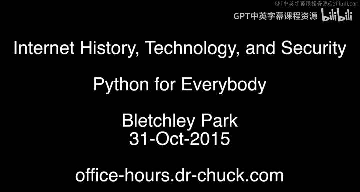
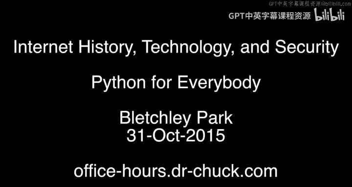

# 006：布莱切利园同学会 🏛️

在本节课中，我们将跟随查克博士，探访计算机科学与互联网历史的重要起源地——布莱切利园。我们将通过一次特别的“线下答疑课”，认识来自世界各地的课程学员，听听他们学习本系列课程的经历与收获。

---

大家好，我们现在位于布莱切利园。计算机科学、互联网历史、技术以及整个计算领域都起源于此。我们在这里举办了一次破纪录的特别线下答疑课，我想让大家认识一下你的同学们。

以下是参与本次活动的学员介绍：

**史蒂夫**：我是Python课程的导师之一。欢迎你，史蒂夫。多年来与你共事是我的荣幸。史蒂夫和其他导师们承担了所有艰巨的工作，而我收获了赞誉。非常感谢你，史蒂夫。

**博诺瓦**：我来自法国，现居伦敦。很高兴来到这里。查克博士，很高兴见到你。我上过互联网历史课程，非常喜欢，并且很期待接下来的树莓派相关课程。

**克雷格**：我正在学习Python网络数据课程，我们网上见。

**史蒂夫（另一位）**：我完成了第一个Python课程，并且计划很快开始学习其他课程。这门课程对我入门这门语言非常有帮助，真的非常感谢。

**珍妮**：我是一名软件开发者。我在泰国清迈的一所国际学校使用《Python for Everybody》课程来教授编程课。很高兴来到英国的布莱切利园。你知道吗，这本书有中文译本。这在泰国好用吗？可能没那么好用。好吧，看来我没那么酷。

**阿尔诺**：我来自法国，在大学担任Arduino讲师。因为学习了Python课程，我忘记了Arduino的语法，这在我的工作中有点尴尬。我现在主要用Python，而不是Processing。不过，我仍然在使用Arduino。我的工作是在大学里进行调试。Python无处不在，然后我就把Arduino的语法忘了。

**凯文**：我只从伦敦过来。能听到课程是如何构建的以及你是如何制作课程的，真的很好，谢谢你。

**苏（来自中国）**：嗨，我们来自中国，是你的学生。我们目前在英国工作。很高兴在布莱切利园见到你，Python课程很棒。

**扬尼斯**：我使用Python很长时间了，但这是我第一次专门上课来系统地学习这门语言。谢谢你。

**米**：我用你的课程来刷新我的计算机科学知识。是的，我正在跟你学习Python。我来布莱切利园至少五次了，像你一样，我也是这里的粉丝。我多希望二战期间能在这里工作，那一定非常激动人心。你知道吗，这里四分之三的工作人员是女性。是的，非常令人印象深刻。她们可能没有最有趣的工作，但我们……确实如此。

**帕特里克**：我上过互联网历史课程。今天对我来说是非常激动的一天，因为当我上那门课时，我说我想来布莱切利园，今天我来了。我还说过我想参加一次查克博士的线下答疑课。所以今天我一下子实现了两个愿望，这太棒了。我的一个想法是，这就像是我们的同学会。

**大卫**：我上过你的Python课程和互联网历史课程，非常喜欢。欢迎你，很高兴你在这里。

**保罗**：我上过Python课程，它们非常棒，谢谢你。

**休**：我来自剑桥，上过你的Python课程，目前正在学习网络课程。非常兴奋能在这里和你在一起。我学习也是为了教孩子，因为我儿子考试要考Python，希望我能帮到他。你就住在树莓派总部附近吧？他们也在那里做很多Python相关的事情。是的，我想把所有这些联系起来，想一个巧妙的计划。

**罗杰**：我上过Python入门课程，刚刚开始学习网络课程，非常期待能顺利完成。

**达留什**：我来自波兰，现居英国。我刚刚开始我的Python学习之旅。我应该非常感谢你所做的一切，真的非常棒。那么，问题来了：你知道布莱切利园的历史和那三位波兰密码学家吗？哦，非常厉害。但这里的每位历史学家都很好地阐明了这一点。这引出了我的下一个问题：你还会在其他地方举办线下答疑课吗？我会去很多地方，也许我们会找到办法的。还有一件事，向我的妻子和两个女儿问好。

**玛蒂**：我住在伦敦北部。我上第一个Python课程是为了能跟上我小儿子的学习进度，他在学校正在学这个。很高兴见到你。

**安德鲁**：我是一名退休人员，学习Python课程是出于兴趣。我希望能把它和我正在用树莓派做的小项目结合起来。我认为Python课程是一门引人入胜的课程。你作为退休人员来说非常年轻。我70多岁了。

**马达姆**：我和家人一起来的。我开始学习Python了。我原本学生物学，后来从事相关工作。我希望将来能教我女儿编程。是的，在某个时候，这会变得很平常。是的，就是下一代密码破译者。没错，带他们来这个一切开始的原点很重要。在未来，一切会变得更好。我们开辟了这片天地，它会一直保持被开辟的状态。

**爱丽丝**：我住在布里斯托尔。我几个月前完成了Python课程，我打算学习你的新课，课程3。我试过Coursera上的一些课程，我可能不会把那部分剪掉。很高兴在现实中见到你。我是一名分析师，希望能将学到的Python知识应用到工作中。我会跟着你学到顶点课程。希望到我们开始顶点课程时，我能搞明白它。

**大卫（另一位）**：我来自利物浦，是一名学习技术专家。我对学习Python很感兴趣，想提升我的编程技能。

**辛西娅**：我正在上你的Python课程，这门课非常优秀，我强烈推荐给任何想学习编程的人。我现在正处于职业间歇期，在抚养孩子。这门课程对保持理智非常有帮助。这实际上是一个非常重要的应用场景。但你的职业是和核反应堆或隐形飞机有关吗？有点关系，质谱分析。哦，质谱分析，我知道这很复杂。没有计算，质谱分析就毫无用处。质谱分析是一个大海捞针的问题，如果没有编程，我们根本无法理解那些数据。我以前从来不知道怎么做，我希望当我重返职场时，我能真正知道自己在做什么。这是度过职业间歇期的一个好方法。

**奥芬**：我来自伦敦，已经完成了互联网历史与技术课程，我期待学习Python课程。

以上就是我们的同学会。也许这是我们在布莱切利园举办的多次同学会中的第一次。那么，网上见。

---

本节课中，我们一起在计算机历史的圣地布莱切利园，进行了一次特别的“同学会”。我们认识了来自全球各地、拥有不同背景的课程学员，听到了他们如何利用本系列课程开启编程之旅、提升技能、辅助教学甚至规划职业转型的故事。这次相聚不仅是一次地理上的重逢，更是对学习社区和知识共享精神的生动体现。