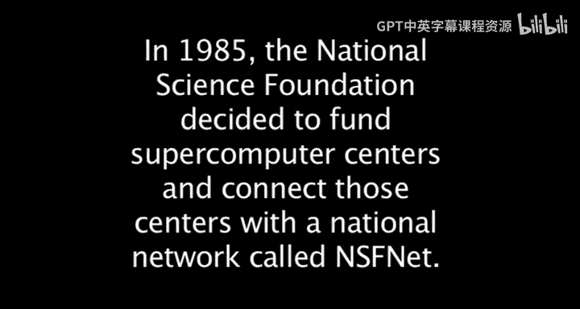
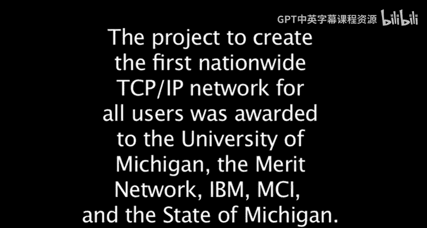

# 014：13_Doug Van Houweling与NSFNET

在本节课中，我们将跟随道格·范·霍韦林（Doug Van Houweling）的讲述，了解美国国家科学基金会网络（NSFNET）从构想到实现的历程。我们将看到密歇根大学如何从一个超级计算中心的竞标者，转变为连接全美科研网络的关键建设者，以及产业界如何参与其中，共同推动了互联网基础设施的早期爆炸式增长。

---

密歇根大学是当时提交国家超级计算中心提案的机构之一。

这份提案恰好在我于1985年初抵达密歇根大学时提交。

密歇根大学的提案中，其核心硬件设备是一台在日本制造的机器。

我向我的新同事们解释，我认为这份提案获得资助的可能性极低，因为我不认为在那个时期，一台日本制造的机器能通过美国国家科学基金会的评审流程。

不久之后，我访问了美国国家科学基金会。

我认识了当时的基金会主任埃里克·布洛克（Eric Block），虽然不算熟识。

我与埃里克就密歇根大学的提案进行了一次交谈。

从谈话中我清楚地认识到，密歇根大学的提案没有获得资助的前景。我对埃里克说，在我看来，对密歇根大学而言，比拥有一个超级计算中心更好的选择，或许是运营那个将所有超级计算中心连接起来的网络。

一段时间后，关于那个网络的提案征集发布了，该网络后来被称为美国国家科学基金会网络（NSFNET）。

那时，我已经成为Merit网络（密歇根州全州网络）的董事会主席。

多年来，Merit网络与ARPANET所涉及的分组交换协议发展并行，开发了自己的分组交换网络。因此我们知道，NSF设想的是一个为期约五年、总耗资1500万美元的项目。

在构思如何撰写这份提案的过程中，我们很快意识到，500万美元的年度预算只够建设一个56千比特的网络。很明显，即使建成，这个网络也会迅速被流量淹没。

因此，我们立即开始思考：如何才能扩大这个提案的规模？

于是我与杰米（时任密歇根州州长詹姆斯·布兰查德的代表）取得联系，告知他我们有一个NSFNET的机会，并打算尝试引入产业界，询问州政府是否有兴趣参与。杰米表示肯定，并让我们在整合好各方资源后再联系他。

接着我们找到了IBM公司。尽管IBM和Merit一样，在互联网协议工作方面没有太多资历，但它是一家拥有强大通信设备制造能力的大公司。

我有一位在IBM研究院工作的老朋友，名叫阿尔·韦斯（Al Weiss），他负责IBM研究院的所有计算设施。我打电话给阿尔说，这是一个绝佳的机会，但IBM单打独斗不会成功，我需要他的帮助。于是阿尔召集了IBM研究院的一些人员，那里确实正在进行TCP/IP协议等方面的工作。我们又安排了一次会议。

我设法把汉斯·沃纳（Hans-Werner Braun，Merit网络的工程师）也拉来参加了与IBM的另一次会议。

在那次会议结束时，汉斯·沃纳承认，IBM内部确实有人懂这方面的技术，他们可以成为项目的一部分。

于是我们初步获得了IBM的同意，他们将贡献硬件和软件，来构建网络的路由结构。

但我们仍然需要通信设施。

那时，IBM的首席财务官我记得姓克劳（Crow）。通过IBM，我们联系到了他。他认识一位前IBM员工，此人当时是MCI公司的首席技术官，实质上也是首席网络运营官，名叫迪克·利巴伯（Dick Liebhaber）。

于是IBM联系了迪克·利巴伯，询问MCI是否有兴趣为这个网络提供通信设施。

你可能记得，当时MCI还是一个新兴组织，有人形容它更像一个律师事务所，试图在AT&T强大的游说攻势下，创造一个能够真正提供电信服务的环境。他们刚刚取得成功，正在美国各地建立设施。迪克·利巴伯将此视为一个让MCI跻身主流、参与NSFNET提案的机会。

最终我们达成了一项协议，将提交一份联合提案。Merit作为主要组织，与IBM（负责建造所有路由硬件和软件）以及MCI（提供全国范围的通信设施）合作。

此外，我们还让布兰查德州长承诺从州政府资金中每年额外投入100万美元。

最终，我们得以向国家科学基金会提交了一份提案，金额大约是1470万美元，因为我们知道上限是1500万。但实际上，通过纳入所有这些实物贡献，这份提案的实际价值更接近5500万美元。

它的设计起点不是56千比特，而是T1速率，即1.5兆比特，并计划在网络生命周期内进行升级。

我们后来得知，这份提案受到了国家科学基金会评审员的极大怀疑，因为Merit在TCP/IP方面没有深厚历史，IBM则被视为互联网的敌人（当时它专注于自己的专有协议）。因此，人们真的怀疑我们是否有技术能力完成此事。

但那份评审没有参考实际的资助模式。当评审员们了解到合作伙伴为此提案承诺投入的资源总量后，它立即在NSF的名单上跃升至首位。

我们一直觉得这可能是一件大事，但并不确定。

因为从我们在1988年启动这个网络开始，直到大约1994年，网络流量、网络上的主机数量等所有指标，都以每月约15%的速度增长。

这个网络可以说是在我们脚下爆炸式地扩张。我们极其幸运的是，TCP/IP协议套件和网络的基本理念允许它以这样的速率增长。

但我们不得不进行大量创新。为了允许多个网络相互交互，边界网关协议（BGP）必须被开发出来。我们还必须建设能力越来越强的路由和通信设施。

我记得大约在1990年左右，这个网络增长如此之快，以至于很明显这些T1线路将无法满足需求。因此我们必须升级到下一步，即DS3速率，从1.5兆比特提升到45兆比特。这是一个非常大的跨越，容量增加了30倍。

为了做到这一点，我们最终创建了另一个非营利组织，名为“高级网络与服务公司”（Advanced Network and Services）。Merit仍然是该资助项目的主要研究者，但它将开发这个新的45兆比特网络的任务分包给了总部位于纽约埃尔姆斯福德（Elmsford）的高级网络与服务公司。

NSFNET是当时最快的互联网网络，直到最终退役。

退役是在1995年，当时国会认定联邦政府不应再支持一项在他们看来本应已成为商业设施的服务。

我永远不会忘记坐在国会大厦的一个听证室里，旁边是米奇·卡普尔（Mitch Kapor，Lotus创始人）和一些小型互联网初创公司的CEO们。他们向国会抱怨，国家科学基金会资助NSFNET是不合适的，因为他们可以作为商业服务来提供这项服务。

然而，就在他们提出投诉的同时，他们却在使用NSFNET作为备用网络，当他们在全国范围内可靠性低得多的网络出现故障时，由NSFNET来承载流量。

MCI后来当然也成为了主要的互联网服务提供商，同样使用着相同的技术。

在一个经典的“创新者窘境”时刻，当时作为互联网骨干网路由技术领导者的IBM，却决定终止他们在开发这些路由器方面所做的所有工作，因为他们认为这会威胁到其专有网络业务。这几乎一手导致了思科（Cisco）而非IBM成为美国占主导地位的路由器公司。

---

本节课中，我们一起学习了NSFNET的诞生故事。我们看到，一个最初看似不可能的提案，通过整合大学（密歇根大学/Merit）、产业界（IBM、MCI）和政府（州政府、NSF）的多方资源与远见，最终构建了推动互联网早期爆炸式增长的关键基础设施。这个故事不仅关乎技术，更关乎合作、创新以及在面对质疑时坚持愿景的重要性。NSFNET的成功为互联网的商业化铺平了道路，而其建设过程中的经验与教训，至今仍具启发意义。