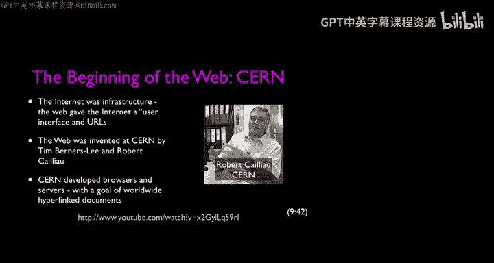

# 021：万维网成为内容载体 🌐

在本节课中，我们将探讨万维网如何从一个协作编辑工具演变为主要的内容载体。我们将回顾早期网络的技术限制、设计选择背后的逻辑，以及关键人物如何无意中推动了这一转变。

---

我非常喜欢那段视频，它对我来说非常珍贵。我在1999年拍摄了它。你可能注意到了，我当时留着马尾辫和“村民乐队”式的小胡子。当我第一次来到密歇根大学时，我觉得自己很特别，所以留了马尾辫。我现在没有马尾辫了，头发颜色也更深了一些。

我特别喜欢他开始对我大喊的那个时刻，因为我喜欢HTML。如今的HTML5比当时的HTML好得多。他完全正确，HTML并不优雅，但它同时具有惊人的力量。我们能看见它的事实意味着人们相信它，它不再是魔法。

你可能注意到的另一点是，他对于网络浏览器应该如何设计有着非常强烈的观点。当你第一次听时，这些观点可能显得不合逻辑。他说的一件事是，每张图片都必须在同一个屏幕中弹出。而Mosaic浏览器是用一个页面替换整个页面，图片是内联显示的，这不是我们想做的。这是罗伯特说的。

今天，在Farmville和Facebook的时代，这听起来可能不合逻辑。但你必须理解，在1990年，网络环境与1995年时都大不相同，它非常慢。如果你在每个页面上都放图片，加载速度会变得极其缓慢。

因此，当时的用户界面是这样的：你有一个包含文本、粗体、斜体等内容的文档，当你点击某个东西时，你会得到一个新页面。然后这个页面需要一段时间才能显示出来，因为网络确实非常慢，电脑也很慢。

所以，这对你来说可能听起来像是一个非理性的设计选择。但在1990年，这是一个完全理性的设计选择。随着时间的推移，随着网络速度变快、计算机速度变快、技术能够更自然地处理图像，这种设计选择变得越来越不理性。

---

上一节我们回顾了早期网络的设计哲学与限制，本节中我们来看看故事如何继续发展。

我们的故事从伊利诺伊大学厄巴纳-香槟分校开始，我们去了密歇根大学，在1990年建立了NSFNET，随后CERN创造了万维网。当美国第一台网络服务器在斯坦福大学上线时，网络向前迈进了一大步。

事实上，它是第一台网络服务器并不那么重要，重要的是服务器上有什么。上面有30万篇物理学论文，存储在斯坦福直线加速器中心（SLAC）的大型机数据库中。罗伯特·卡约在对话中提到了这一点。接下来发生的事与保罗·昆斯有关，我们马上会见到他。他说他会把自己的数据库放上去。这个数据库非常有名，人们有很多方式使用它，但有了网络，它变得更容易使用。

因此，我认为在某种程度上，保罗·昆斯无意中创造了第一个搜索引擎，第一个主要用于人们阅读内容的网站。在那之前，蒂姆·伯纳斯-李和罗伯特真正试图构建的是一个允许对存储在世界各地服务器上的信息进行集体编辑的工具。

让我们来听听保罗·昆斯怎么说。