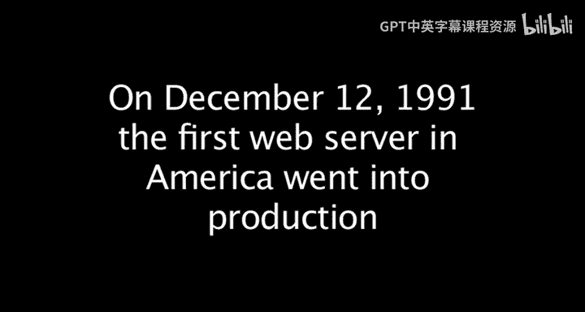
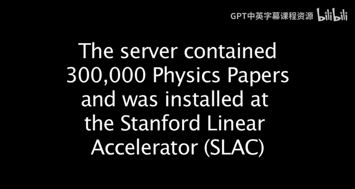

# 022：保罗·昆茨与美国首个Web服务器 🌐

在本节课中，我们将跟随保罗·昆茨的讲述，了解世界上第一个Web服务器在美国斯坦福直线加速器中心诞生的背景、过程及其深远影响。我们将看到，一个为解决特定领域访问难题而生的工具，如何意外地成为推动互联网普及的关键转折点。

---

## 背景：SLAC数据库的访问难题 🔧

在Web出现之前，位于斯坦福直线加速器中心的数据库虽然被全球的研究人员使用，但访问过程极为困难。用户不仅需要在大型机上拥有账户，还必须掌握一套复杂难用的数据库查询语言。

为了改善这一状况，保罗·昆茨在Web诞生前就发明了一种方法，允许用户无需登录即可查询数据库，这类似于后来的即时通讯概念。随后，人们又增加了电子邮件接口，用户可以通过邮件发送查询并接收结果。

## 灵感的诞生：在CERN的会面 💡

1991年9月，当保罗·昆茨在欧洲核子研究中心时，蒂姆·伯纳斯-李将他拉到办公室，首次演示了万维网。

起初，保罗并不十分感兴趣。然而，当蒂姆演示如何通过Web查询大型机上的帮助系统数据库时，保罗立刻将两者联系起来。他意识到，既然能查询帮助系统，那么同样也能查询SLAC的数据库。这个想法激发了他的兴趣。

关键在于，他们无法改变数据库内置的查询命令，但网页可以提供示例并提醒用户查询语句的格式，从而降低使用门槛。

## 首个Web服务器的搭建 🛠️

保罗被问及是如何创建第一个Web服务器的，是重头编写协议，还是使用了现有软件。

他使用了用C语言编写的CERN服务器软件。幸运的是，当时SLAC的大型机上恰好有一个C编译器。保罗所需要做的，就是编写一些额外的C代码，用于接收用户的查询请求，并将其转换为数据库能理解的查询命令。

1991年12月12日，他们安装并启动了SLAC的Web服务器，并立即邀请蒂姆·伯纳斯-李进行了首次测试。

## 转折点：法国南部的研讨会 🚀

真正的转折点发生在大约一个月后，即1992年1月，在法国南部举行的一场关于高能与核物理计算主题的研讨会上。

蒂姆·伯纳斯-李在会上做了一个长达一小时的主题演讲，向来自全球的大约200位高能物理学家介绍了万维网。作为演示的一部分，在演讲的最后，他连接到了SLAC的Web服务器，并现场进行了一次数据库查询。

这个演示让在场所有人震惊不已。因为每个人都熟知那个数据库，也深知访问它有多么困难。而现在，蒂姆只是点击了几下，输入几个查询词，结果就立刻被格式化地返回了。

保罗形容，在那一个小时里，对Web感兴趣的人数从大约20人激增到了200人。随后，这200人回到各自的国家，如果每人再告诉10个人，那么在一周之内，对Web感兴趣的人数就增长到了2000人。保罗认为，这正是Web腾飞的关键转折点，蒂姆也认可这一点。

## Web迅速普及的原因：双赢模式 🤝

保罗分析了Web能够如此迅速被商业领域接受并普及的原因。他认为这创造了一个双赢的局面。

*   **对消费者而言**：他们可以进行价格比较、自主浏览航班时刻表、快速可视化所需信息，并且可以凭借耐心尝试各种组合来降低价格。这极大地改善了消费体验。
*   **对提供商（如航空公司）而言**：由于这一切都通过运行在机器上的软件完成，成本大大降低。因此，他们同样是赢家。

## 总结与反思 🧠

在本节课中，我们一起回顾了美国首个Web服务器的诞生故事。我们看到了一个为解决特定科研领域访问难题而生的工具，如何通过一次关键的公开演示，迅速点燃了全球的兴趣，并因其创造的双赢商业模式而得以飞速普及。

保罗在演讲接近尾声时提出了一个发人深省的观点：在进行大型科学研究时，我们往往在解决或寻找一些公众尚未意识到自己存在的问题的方案。

因此，谁能预料到，从高能物理研究中会诞生出像万维网这样的东西呢？这似乎是不可预测的。但事后看来，这又是一个自然而然会发生的地方。正如他所说，对于Web的出现，这既是一个“事件”，也是一个“自然的结果”。