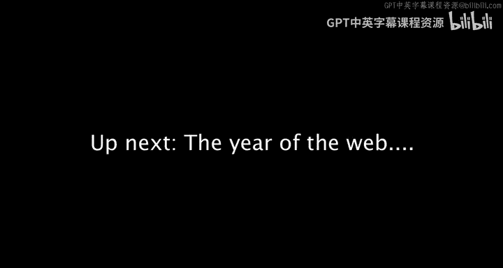

# 025：Mosaic浏览器的历史回响

在本节课中，我们将探讨Mosaic浏览器如何引发互联网产业的连锁反应，特别是微软公司如何应对网景（Netscape）的崛起，以及随之而来的市场剧变与投资热潮。

上一节我们介绍了Mosaic浏览器的诞生与早期影响，本节中我们来看看它如何重塑了整个商业格局。

约瑟夫在最后部分，重点阐述了微软公司如何被迫对网景浏览器作出反应。突然间，整个市场开始剧烈震荡，并伴随着海量投资与高度竞争。

以下是这一系列事件的关键发展脉络：

*   **微软的应对**：面对网景浏览器的迅速普及及其对操作系统潜在主导地位的挑战，微软必须采取行动。
*   **市场震荡**：互联网领域突然出现了激烈的竞争，导致市场格局发生快速且剧烈的变化。
*   **投资热潮**：大量资本涌入互联网相关企业，形成了巨大的投资强度与关注度。

这些因素共同作用，标志着互联网从学术和研究工具，向一个充满商业机遇与竞争的全新大众市场时代过渡。

本节课中我们一起学习了Mosaic浏览器引发的商业与技术浪潮。我们看到，一个关键软件如何迫使科技巨头调整战略，并催生了激烈的市场竞争与空前的投资热度，这为后续互联网的爆炸式增长奠定了基础。