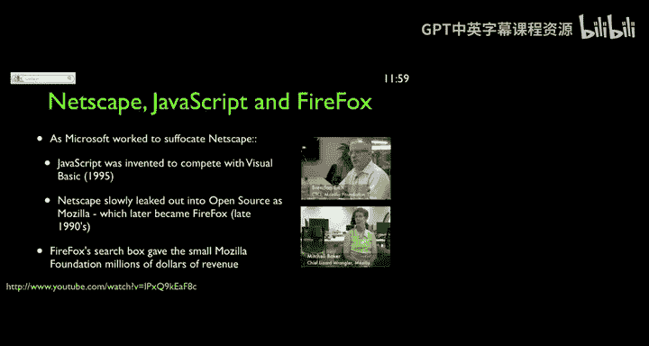
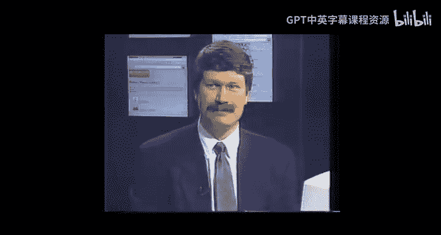

# 030：29_万维网的潜能假设 🌐

在本节课中，我们将回顾万维网发展历程中的关键人物与事件，探讨开放标准与商业竞争如何共同塑造了今天的互联网格局，并展望其未来的潜能。

## 回顾与影响

上一节我们介绍了布伦丹·艾希和米切尔·贝克等人在推动JavaScript和开源浏览器发展中的关键作用。本节中，我们来看看商业竞争如何意外地促进了万维网的开放。

网景公司最初的商业策略是将其浏览器和服务器软件作为专有产品出售，价格在70到100美元之间。当时，计算机并不预装浏览器，用户需要单独购买。

微软为了追赶网景，采取了将其浏览器**Internet Explorer**免费捆绑在Windows操作系统中分发的策略。这一举动虽然引发了反垄断诉讼，但它使得网景无法继续对浏览器收费，从而在客观上挫败了网景将网络核心组件私有化的计划。

微软的竞争行为，尽管其初衷并非维护网络开放，但其结果是为火狐（Firefox）等开源浏览器的诞生、以及万维网联盟（W3C）的壮大和更公平的市场环境铺平了道路。

## 万维网联盟的诞生

面对网景可能主导网络标准的局面，蒂姆·伯纳斯-李等人坚信网络应为所有人免费开放，并依赖于多浏览器、多服务器的互操作性。实现这一目标的关键在于建立开放标准。

欧洲核子研究中心（CERN）意识到，一个物理实验室不应承担定义网络未来的责任。因此，在蒂姆·伯纳斯-李的领导下，万维网联盟于1994年10月在麻省理工学院（MIT）成立。

以下是W3C的核心使命：
*   **制定标准**：定义HTML、CSS等核心网络技术的规范。
*   **保持开放**：确保网络技术不被任何单一公司所控制。
*   **促进互操作**：让不同的浏览器和服务器能够协同工作。

尽管成立之初，W3C在财力和影响力上都无法与网景公司相比，但IBM和微软等公司的早期加入为其提供了至关重要的信誉。如今，W3C制定的高质量标准已成为维护网络开放与健康发展的基石。

## 网络的潜能假设

至此，网络的基础设施已基本完备，浏览器、服务器、开源与闭源软件共同构成了我们熟悉的网络生态。现在，让我们通过一段珍贵的采访，聆听万维网发明者蒂姆·伯纳斯-李对未来的展望。

> “你们还什么都没看到呢，等着吧，当网络成为像电力一样可以‘假设其存在’的基础设施时……当信息空间的基础全部铺设完毕，下一场革命就该到来了……那可能是一场文化革命，一场比任何文化法案都更美好的文化革命。”

蒂姆的深刻见解在于，他认为网络的下一阶段将超越技术层面，引发根本性的社会与文化变革。他是一位对网络作为世界变革推动力有着坚定信念和深刻承诺的远见者。

## 从“如何实现”到“用来做什么”

我们接触过的这些网络先驱有一个共同点：他们很少将自己视为英雄或伟大的创新者，而更倾向于将自己看作集体探索和好奇心的一部分。他们的工作本质上是研究和探索。

大约在20世纪90年代末期，网络的焦点发生了一次根本性转变：
*   **前期（至90年代末）**：核心问题是 **`如何构建网络`**。
*   **后期（90年代末以后）**：核心问题转变为 **`用网络来做什么`**。

随着这个转变，一批新人开始登上舞台，其中一位早期的杰出代表就是亚马逊的创始人杰夫·贝佐斯。他的思维方式与早期的技术先驱截然不同。他视网络、浏览器和协议为既存的基础设施，并思考如何最大限度地利用它们来创造新的商业价值和社会效率。早在1997年，他就清晰地看到了电子商务的潜力，这远早于大多数人的认知。

## 总结

本节课中，我们一起学习了：
1.  商业竞争（如微软与网景）如何意外地推动了网络浏览器的免费与开放。
2.  万维网联盟（W3C）在制定开放标准、维护网络健康生态中扮演的关键角色。
3.  蒂姆·伯纳斯-李提出的“网络潜能假设”，即当网络成为社会默认基础设施时，将催生超越技术层面的文化与社会革命。
4.  网络发展从技术构建（如何实现）到应用创新（用来做什么）的历史性转变，以及像杰夫·贝佐斯这样的企业家如何利用已建立的基础设施开创新局面。

保护互联网的自由与开放至关重要，这需要所有人的共同努力，以抵御任何试图控制网络的力量。