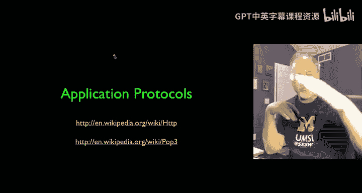
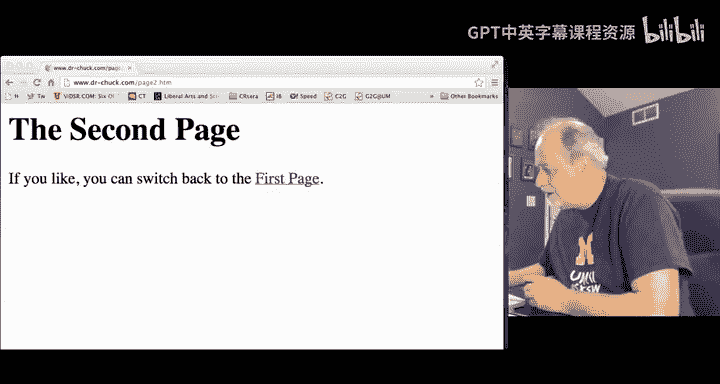
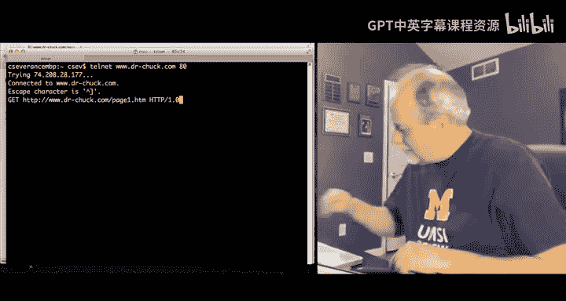

# 045：应用层技术解析 🌐

在本节课中，我们将要学习互联网四层架构中的最顶层——应用层。我们将了解应用程序如何利用下层网络服务进行通信，并重点解析万维网（WWW）的工作机制。

---

上一节我们介绍了TCP层如何提供可靠的端到端数据流。本节中，我们来看看应用程序如何利用这个“管道”进行通信。

应用层建立在TCP层提供的可靠连接之上。TCP层确保数据能在一台计算机的某个应用与另一台计算机的某个应用之间，有序、可靠地双向传输。我们可以发送“Hello”，经过价值数十亿美元的硬件、数十万工程师、四十年的工程设计，最终在另一端准确地显示出“Hello”。四层架构的美妙之处在于，我们可以将这个过程视为“魔法”——我们发送数据，数据就出现了。

有了这个“魔法”管道，我们能用它做什么呢？TCP提供了可靠的管道，我们现在要思考的是，如何在这个管道之上构建应用。

## 客户端与服务器模型 💻 ↔️ 🖥️

现在，我们暂时忽略网络底层细节。假设你的电脑上运行着一个应用程序（客户端），而另一台服务器上也运行着一个应用程序（服务器）。客户端和服务器通常是不同的应用：客户端负责**请求**信息，服务器负责**响应**并提供信息。

这种客户端-服务器的通信机制，可以用来构建电子邮件系统、万维网，或者用于视频流传输。本节课我们将聚焦于**万维网**，因为它非常简单、优雅，也最容易理解，并且是最流行的应用协议。

## 端口：连接特定服务的“分机号” 📞

应用层需要解决两个基本问题。第一个是：数据应该交给哪个应用程序？这是通过**端口**机制实现的。

端口允许一个IP地址（即一台计算机或服务器）提供多种服务。客户端可以像拨打电话分机号一样，连接到它感兴趣的特定服务。

**端口**和TCP一起工作。IP地址定位到特定的服务器硬件，而**端口号**则进一步指定我们要与服务器上的哪个应用程序通信。

以下是一些常见的TCP端口及其对应的服务：

*   **25**: 接收电子邮件 (SMTP)
*   **22/23**: 远程登录 (SSH/Telnet)
*   **80/443**: 网页服务 (HTTP/HTTPS)
*   **109/110**: 个人邮箱访问 (POP2/POP3)

## 应用协议：对话的规则 📜

一旦我们通过端口连接到目标服务器（如网页服务器、邮件服务器），接下来就需要知道如何与它“对话”。这就是**应用协议**，它定义了通信的规则。

TCP提供了可靠连接，端口让我们连接到目标服务，而应用协议则规定了在这个连接上**谁先说话、发送什么内容、会得到什么回应**。这取决于你正在与哪种类型的服务器通信。

我们将主要探讨万维网协议，因为它最简单，也最能清晰地展示这个过程。

## 万维网与HTTP协议 🌍

万维网客户端（即浏览器）和服务器使用名为**HTTP**的协议进行通信。事实上，你可以在浏览器地址栏的URL开头看到“http://”。

HTTP协议规范非常简单。其核心是**HTTP请求-响应周期**：
1.  你在浏览器中点击一个链接。
2.  浏览器（客户端）向服务器建立一个连接。
3.  客户端发送一个对特定文档的**请求**。
4.  服务器查找并处理请求，然后将文档作为**响应**发回。
5.  浏览器接收响应，显示文档，随后连接通常会被关闭。

这个过程就是：点击 -> 请求 -> 响应 -> 显示。

## 深入HTTP：模拟浏览器请求 🛠️

那么，浏览器具体发送了什么命令呢？通过TCP连接发送到服务器的命令是一个**GET**请求。例如，点击一个指向`page2.htm`的链接，浏览器会发送：`GET /page2.htm`。服务器则会返回描述页面如何显示的HTML代码。

如果我们想自己编写一个浏览器，就需要遵循IETF制定的规范，例如RFC 1945（HTTP/1.0）。规范规定，请求一行应包含：`GET` + 空格 + 请求的URL + 空格 + 协议版本。

我们可以通过一个简单的方法来“模拟”浏览器：使用**Telnet**工具。Telnet可以建立到指定主机和端口的TCP连接，并将我们输入的内容直接发送过去。这对于理解公开协议（如HTTP）非常有用。

**操作示例（在命令行中）：**
1.  连接到服务器的80端口（HTTP默认端口）：`telnet www.drchuck.com 80`
2.  手动输入符合HTTP规范的请求行：`GET /page1.htm HTTP/1.0`
3.  按两次回车（发送请求并结束头部）。
4.  服务器将返回响应状态码（如`200 OK`）、头部信息和请求的HTML文档内容。

通过这种方式，我们成功地“手动”与Web服务器进行了对话。只要我们遵循协议规则，服务器就会回应我们。这展示了应用层的本质：知道连接到哪个端口，并使用该端口对应的协议进行通信，就能获取数据。

## 互联网：一个有机的整体 🌱

应用层是一个丰富多彩的领域。我们有了“管道”抽象（TCP），用“分机号”（端口）连接不同服务，并用“对话规则”（应用协议）进行交流。

至此，我们已经走完了互联网四层架构：从底层的链路层（以太网、光纤、无线），到网络层（IP，负责不可靠的地理位置跳转），再到传输层（TCP，负责可靠传输和重传），最后到应用层（我们实际使用的网络服务）。

令人印象深刻的是，这套架构源于20世纪70年代的研究工作，其核心思想至今仍在支撑着拥有数十亿设备的全球互联网。它被设计成能够**自我修复**，而非追求完美无缺。这种韧性使得互联网在面对局部故障（如自然灾害）或人为中断时，能够寻找其他路径，保持整体连通。它就像一个有生命的有机体，是人类共同构建的最大规模的集体工程。

## 展望未来：持续演进 🔮

最后需要思考的是，互联网架构并非一成不变。正如范·雅各布森（Van Jacobson）等先驱者所探讨的“内容中心网络”等概念，未来的网络形态可能与我们今天所知的完全不同。作为工程师和互联网的使用者，我们不应自满，而应持续质疑和创新，因为技术永远在演进。

---

本节课中，我们一起学习了应用层的工作原理。我们了解了客户端-服务器模型、端口如何像电话分机一样定位服务，以及应用协议（特别是HTTP）如何定义通信规则。通过手动模拟HTTP请求，我们直观地看到了浏览器与服务器之间的对话过程。最后，我们回顾了互联网架构的韧性，并认识到技术需要持续演进。