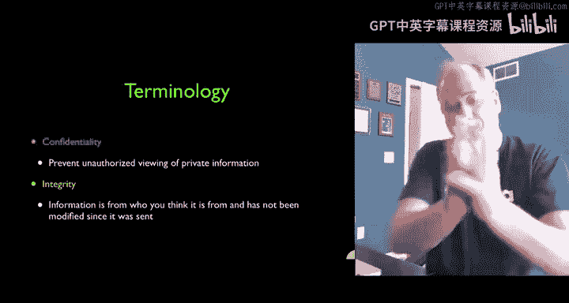
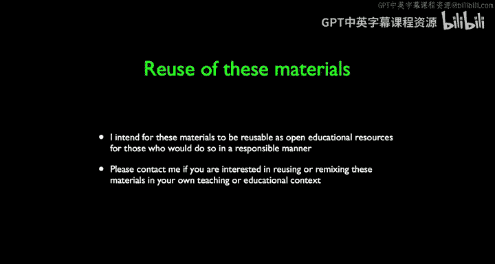

# 048：信息安全导论 🔐

在本节课中，我们将要学习信息安全的基本概念。我们将认识通信中的主要角色，理解安全的核心目标，并探讨在实际应用中如何权衡安全与成本。

## 认识通信中的角色 👥

在密码学领域，我们通常用一些特定名称来指代通信中的各方。

以下是通信中常见的角色：
*   **Alice 和 Bob**：他们是希望安全通信的双方，是“好人”。在计算机术语中，他们常被简称为 A 和 B。
*   **Eve**：这是一个常见的“坏人”角色，代表窃听者。其他可能的“坏人”名称还包括 Carol、Carlos、Charlie 或 Chuck。
*   **Trinity**：这个来自电影《黑客帝国》的角色，在这里被用作一个具有恶意意图的中间人形象。

Alice 和 Bob 相距甚远，他们需要安全地通信。而中间可能存在像 Trinity 这样的恶意角色，意图窃听、篡改或完全重定向他们的通信。

## 理解安全威胁 🎯

上一节我们介绍了通信中的基本角色，本节中我们来看看谁可能对我们构成威胁。思考安全问题时，需要明确谁想攻击你以及原因。

对于大多数普通人而言，我们面临的主要威胁是：
*   犯罪分子试图窃取信用卡号等财务信息。
*   如果你是有影响力的人物或公职候选人，对手可能会试图入侵你的电子邮件。

然而，对于绝大多数普通人来说，我们的生活相对“平淡”，并非恶意攻击者的高价值目标。但这并不意味着可以忽视安全。我们仍应尽可能保护自己的信息和通信安全，保持警惕。

## 视角的转换：我们与政府 🔄

在最初的课程中，政府（如布莱切利公园的密码破译者）是破解敌方密码、拯救文明的“好人”。但现在，当我们作为普通公民试图保护自己的通信时，视角发生了转换。

现在的情况是：
*   **我们**（试图加密通信的普通人）成为了需要保护隐私的“好人”。
*   **政府**（拥有强大监控和破译能力的机构）在某种程度上扮演了试图解读我们私人通信的角色。

这本质上是一场“军备竞赛”。加密方不断发明更强大的加密方法，而解密方则持续开发更强大的破译技术。哪一方是“好人”取决于我们自身的立场。

## 安全与成本的平衡 ⚖️

在深入技术细节之前，我们需要理解一个关键概念：安全需要与成本进行平衡。

安全专家有时会认为“安全性越高越好”，但这是一个误区。完美的安全是无法实现的。安全本质上是一种成本效益分析。

以信用卡为例：
*   信用卡号为我们提供了巨大的支付便利。
*   虽然偶尔会发生盗刷，但银行通过监控异常交易（例如，持卡人在密歇根州，交易却出现在新泽西州）能将损失控制在很低水平。
*   如果为了绝对安全，要求每次交易都有安保人员陪同，那么交易成本将高得无法承受。

因此，真正的安全专家明白，安全并非追求完美，而是在风险与成本、便利性之间找到最佳平衡点。

## 信息安全的两大核心目标 🎯

现在，我们进入信息安全的技术术语部分。在后续关于安全的讲座中，我们将主要解决两个基本问题。

以下是信息安全的两大核心目标：
1.  **保密性**：防止信息泄露给未经授权的个体。其核心问题是信息的**泄露**。例如，确保只有指定的接收方能看到信用卡号，而其他人都无法看到。
    *   **公式/目标**：`发送信息 M， 确保只有接收方 B 能解密并读取 M， 而窃听者 E 无法获取 M 的内容。`
2.  **完整性**：确保信息在传输过程中未被篡改，并且确实来自声称的发送方。这包括验证信息来源和内容是否被修改。数字签名等技术就属于这个范畴。
    *   **公式/目标**：`接收方 B 能够验证收到的信息 M' 确实来自发送方 A， 且 M' 等于原始发送的信息 M（即 M' == M）。`

保密性和完整性这两个主题将贯穿我们后续所有的安全课程。

---

本节课中我们一起学习了信息安全的基础。我们认识了通信模型中的经典角色（Alice, Bob, Eve），理解了安全威胁因人而异，并认识到安全措施需要在成本和效益之间取得平衡。最后，我们明确了信息安全的两大核心目标：**保密性**和**完整性**，这是构建所有安全技术的基石。在接下来的课程中，我们将深入探讨实现这些目标的具体方法。