# 049：加密与保密性 🔐

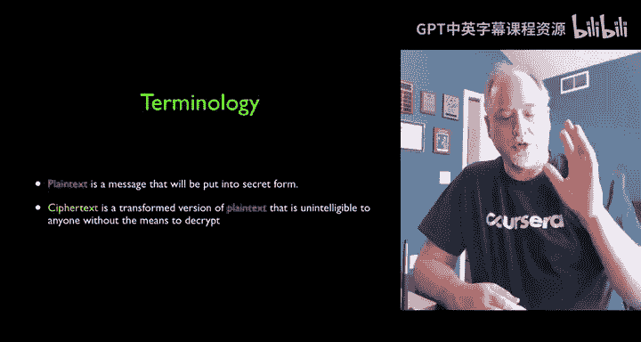

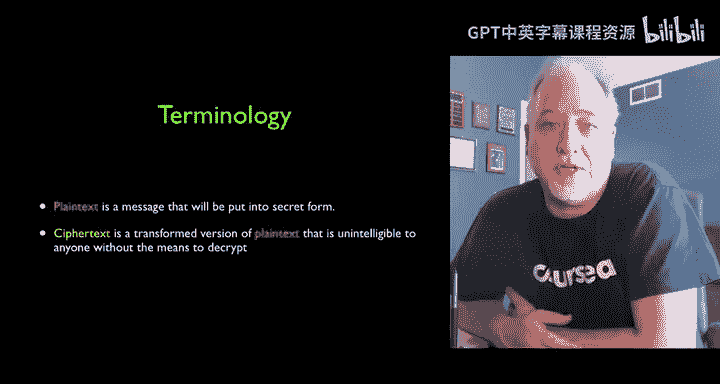

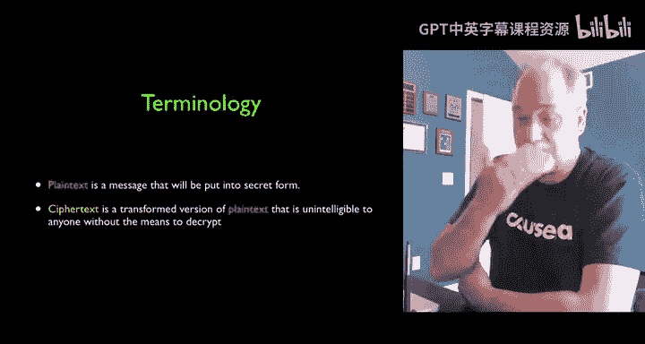

在本节课中，我们将要学习信息安全的核心概念之一：保密性，以及实现它的基础技术——加密与解密。我们将从最古老的凯撒密码入手，理解其工作原理，并通过动手练习体验如何“破解”它。

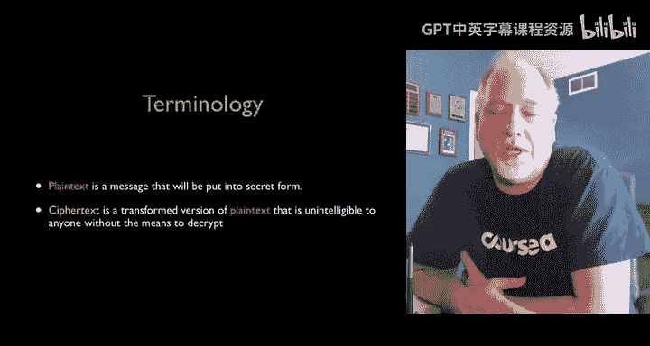

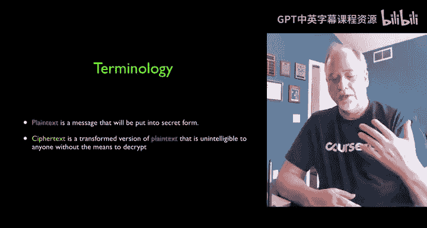

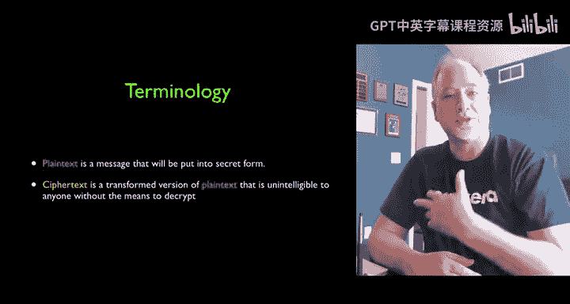

## 概述：加密的基本概念

上一节我们介绍了信息安全的目标，本节中我们来看看实现保密性的核心技术——加密。

加密的目的是确保信息在传输过程中不被未经授权的人理解。其核心涉及三个基本概念：**明文**、**密文**和**密钥**。

*   **明文**：指我们希望传输的原始信息，例如一段文字或一个信用卡号。
*   **密文**：指经过加密处理后的信息，看起来是杂乱无章的字符。
*   **密钥**：指用于加密和解密的一串数据或一个算法。加密是将明文转换为密文的过程，而解密则是利用密钥将密文恢复为明文的过程。

在通信中，我们假设密文可能会被中间人（如路由器或窃听者“Eve”）截获。因此，密文的设计目标是让截获者无法理解，并且难以（或不可能）在没有密钥的情况下还原出明文。

## 对称密钥加密

接下来，我们将探讨两种主要的加密系统。首先介绍的是对称密钥加密。

对称密钥加密，也称为共享密钥加密，意味着通信双方（例如“Alice”和“Bob”）必须拥有并使用相同的密钥进行加密和解密。其过程可以概括为：
1.  Alice 使用密钥加密明文，生成密文。
2.  Alice 通过网络发送密文。
3.  Bob 收到密文后，使用相同的密钥进行解密，得到原始明文。

这种加密方式历史悠久，从古罗马时代一直沿用到第一次世界大战。但它存在一个关键问题：双方必须通过某种安全的方式（例如面对面交换）预先共享密钥。这个“密钥分发”问题，正是后来推动非对称加密（公钥加密）发展的原因。

## 凯撒密码：一个古老的例子

为了更具体地理解对称加密，让我们来看一个最著名的例子——凯撒密码。

凯撒密码是一种替换密码，其加密方法是对字母进行固定位数的“移位”。例如，移位数为1时：
*   明文 `A` 变为密文 `B`
*   明文 `B` 变为密文 `C`
*   … 以此类推，`Z` 循环回到 `A`

移位数就是密钥。如果 Alice 想用移位 2 加密单词“CANDY”，过程如下：
*   C -> E
*   A -> C
*   N -> P
*   D -> F
*   Y -> A
*   得到的密文是：`ECPFA`

Bob 收到密文 `ECPFA` 后，如果他知道密钥是“减2”（即移位-2），就可以将每个字母反向移位，恢复出明文“CANDY”。

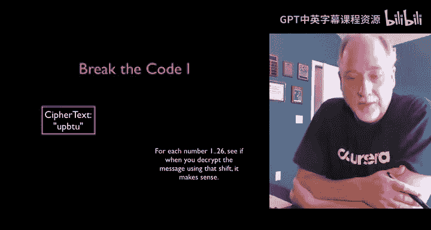

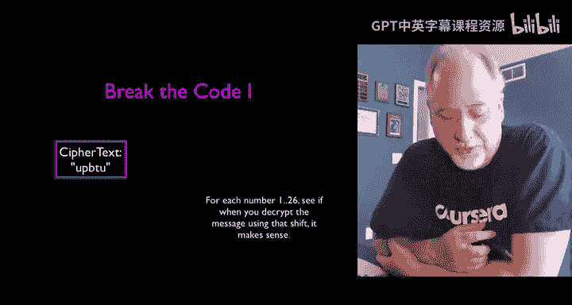

## 动手练习：使用“秘密解码环”

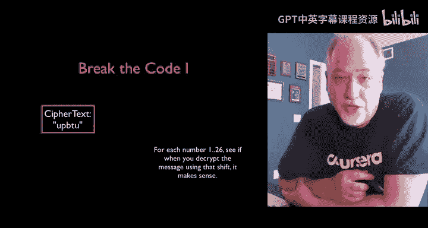

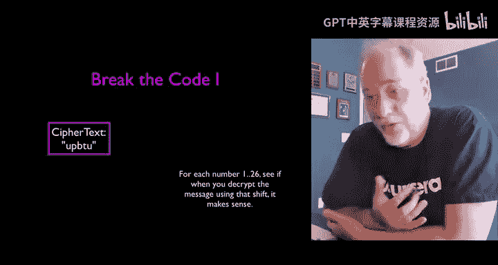

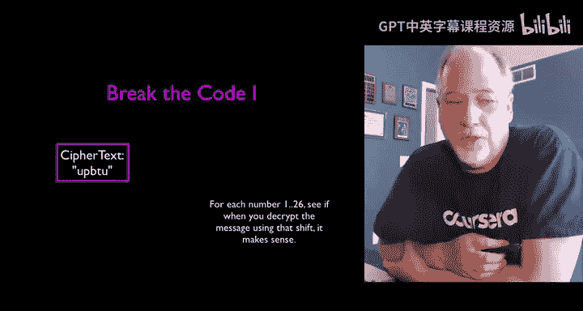

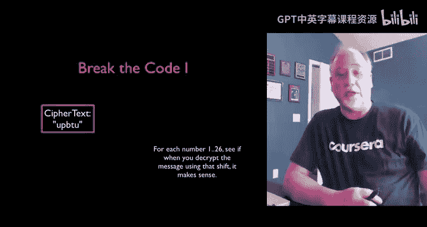

理论需要结合实践。现在，我们将扮演二战时期布莱切利园的密码破译员，尝试破解一段密文。

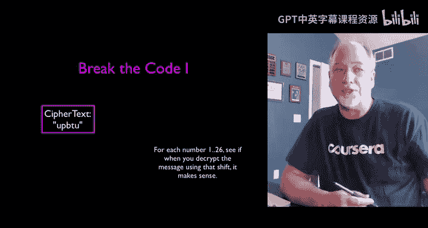

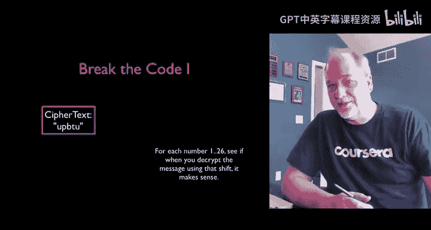

首先，你需要获取我们的“秘密解码环”工具。请访问以下链接下载PDF文件，并建议打印出来以便操作：
`drchuck.com/secretdecoder.pdf`

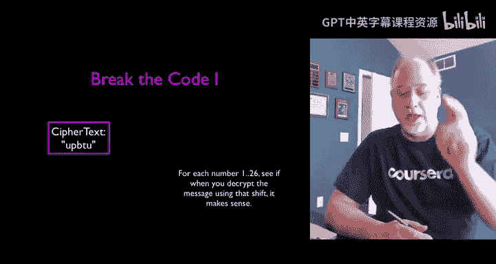

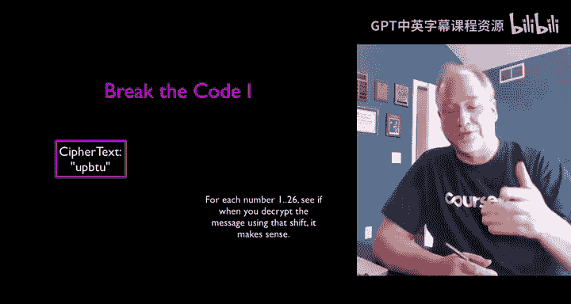

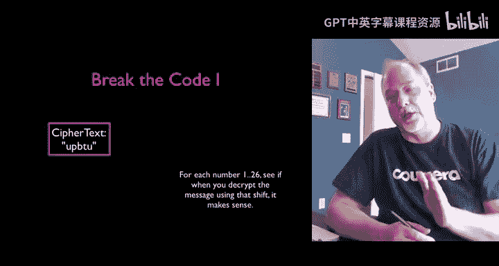

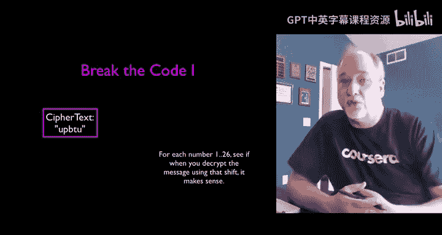

这个解码环的使用方法很简单：
*   **加密（明文 -> 密文）**：在明文行找到字母，向下对齐到指定的“移位”行，该位置对应的字母就是密文。
*   **解密（密文 -> 明文）**：在密文行找到字母，向上对齐到指定的“移位”行，该位置对应的字母就是明文。

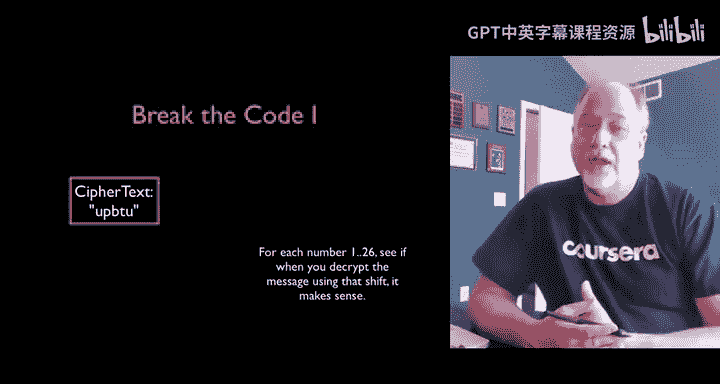

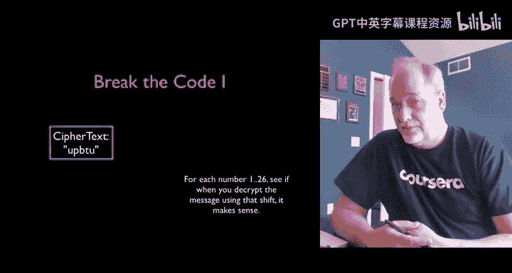

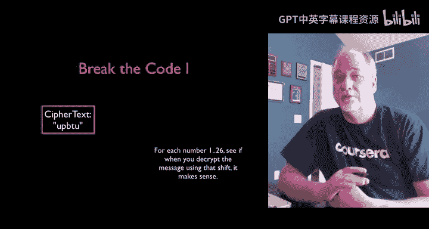

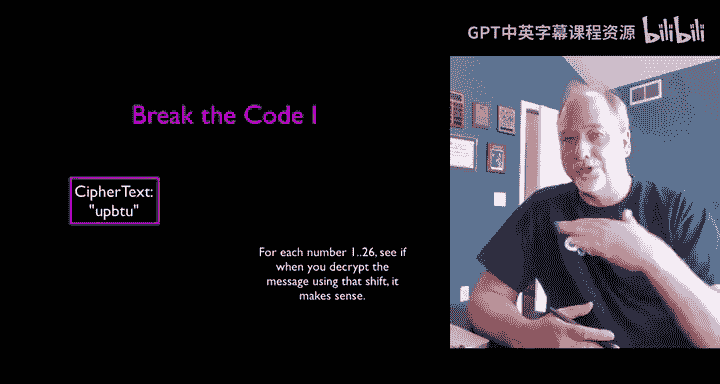

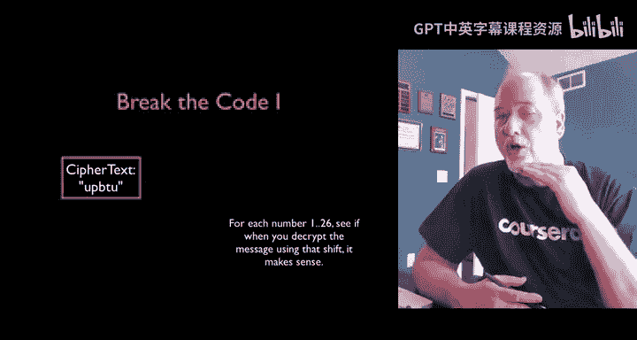

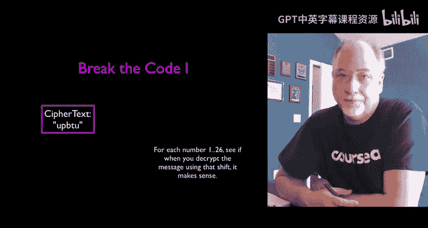

你的第一个挑战来了！以下是截获的一段密文：
`UPO UBTU`

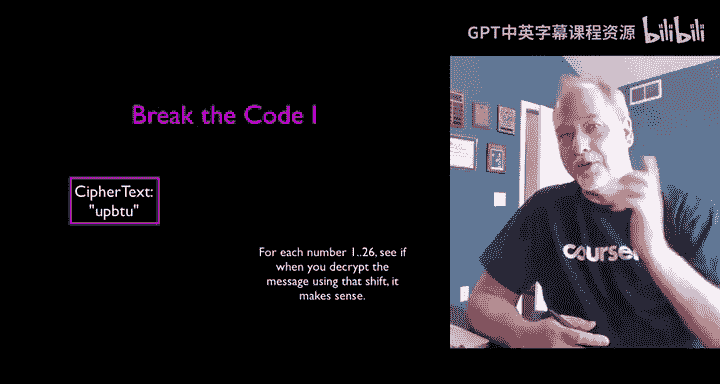

你的任务是破解它。由于不知道移位密钥，你需要扮演“人肉计算机”，尝试所有26种可能的移位（1到26），然后找出哪一次解密的结果是有意义的英文单词或句子。

（请在此暂停视频，尝试破解……）

你成功了吗？答案是**移位1**。解密后的明文是：`TOAST`。就像布莱切利园的专家一样，我们通过判断解密结果是否“有意义”来确定破解成功。

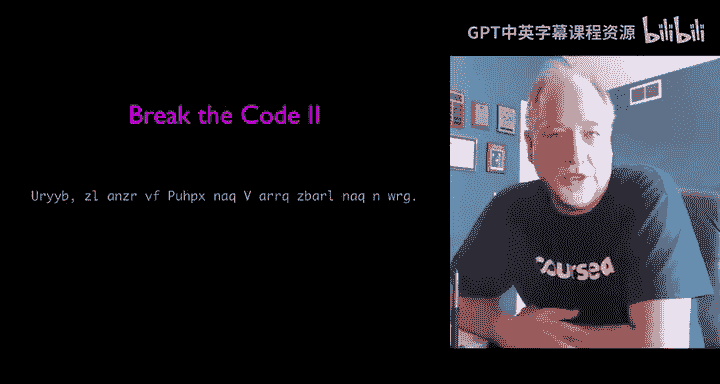

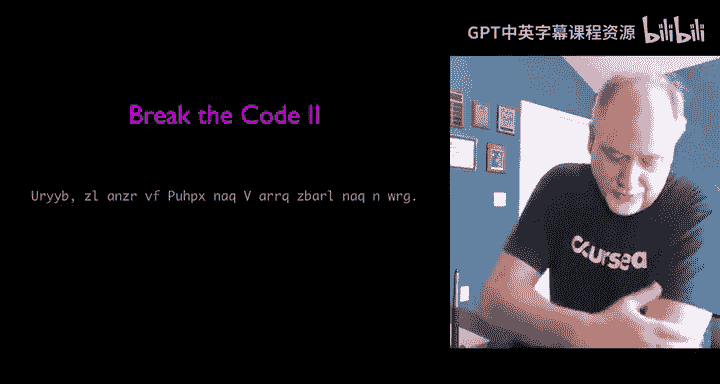

## 优化破译：利用信息泄漏

现在，难度升级。这是一段更长的密文，而且它不是简单的移位1：
`GUR FUVSG VF ABG BAR`

如果尝试所有26种移位，工作量会很大。但这里存在一个“信息泄漏”，让我们可以更聪明地找到密钥，而不必暴力尝试所有可能。

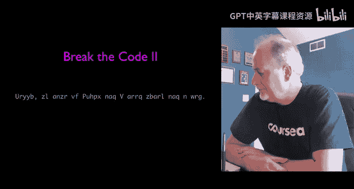

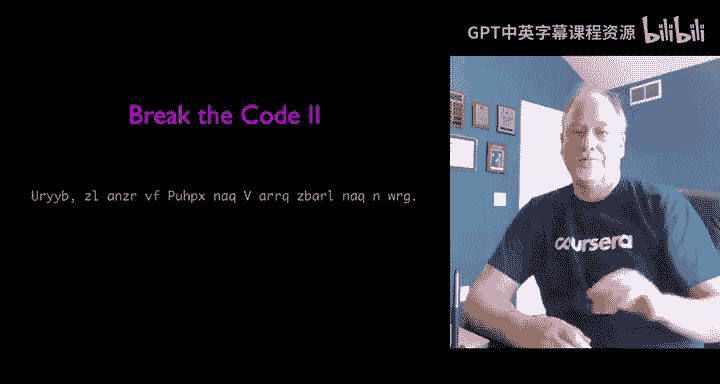

仔细观察密文。你发现了什么？**密文中保留了空格，并且有一个单独的大写字母单词“GUR”和一个单独的小写字母单词“BAR”。**

在英语中，常见的单个字母单词有哪些？大写的情况通常是“I”，小写的情况通常是“a”。我们可以利用这个线索进行推测。

例如，假设密文中的“V”对应明文中的“I”。那么，我们在解码环上从“V”向上寻找“I”，看看需要移位多少。你会发现，这正好是**移位13**。验证其他部分，整个密文“GUR FUVSG VF ABG BAR”在移位13后，会变成有意义的句子：“THE SHIFT IS NOT ONE”。

通过利用语言习惯（信息泄漏），我们极大地减少了破译所需的工作量。历史上，布莱切利园的破译专家也经常利用这类已知的明文模式或通信习惯来加速破译过程。

## ROT13：一个有趣的应用

移位13（ROT13）在凯撒密码中有一个有趣的性质：因为字母表有26个字母，移位13等于移位-13，所以加密和解密是同一个操作。

在互联网早期（如80年代的新闻组时代），ROT13被用来轻微隐藏一些可能令人反感的内容（例如脏话笑话），以绕过简单的脏话过滤器。人们甚至熟练到可以直接阅读ROT13编码的文字。你可以访问 `rot13.com` 来体验这种古老的“加密”文化。

## 总结

本节课中我们一起学习了加密技术的基础。我们从**明文**、**密文**和**密钥**的核心概念出发，重点探讨了**对称密钥加密**，并以古老的**凯撒密码**为例进行了详细说明。通过动手使用“秘密解码环”，我们实践了加密、解密以及暴力破译的过程。最后，我们还了解到，即使加密算法本身没有数学缺陷，**信息泄漏**（如语言模式、通信习惯）也可能严重削弱其安全性。这些基础知识为我们理解更复杂的现代加密技术做好了准备。