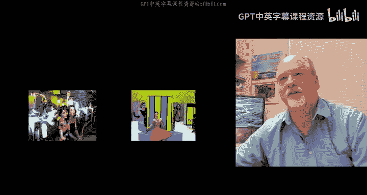
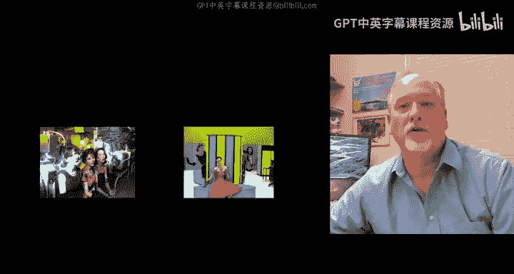
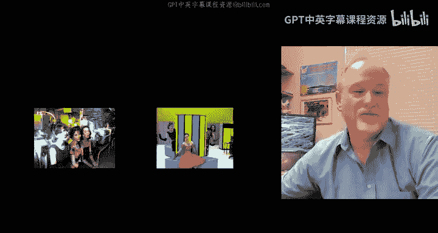
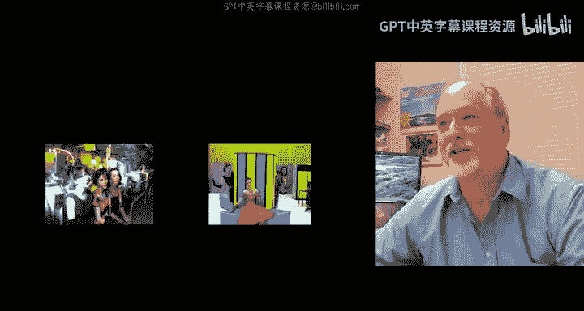
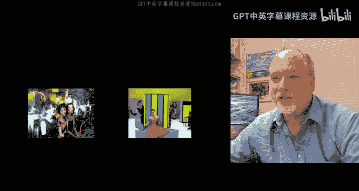
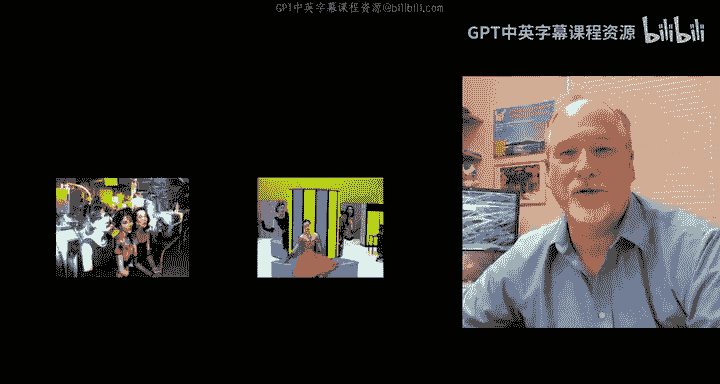
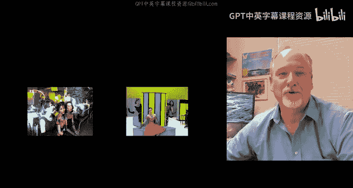

# 密歇根大学《互联网历史、技术和安全Internet History, Technology, and Security》中英字幕 - P19：18_通往万维网之路.zh_en - GPT中英字幕课程资源 - BV1DE421c7CT

So we started our picture where we had supercomputers at University of Illinois。

 we went to the University of Michigan， we got the NSF net funded。

 and now we are going to fly across the ocean to CEN。Serern of course。

 is a high energy physics laboratory， they do this 26 mile circle and smash particles and take pictures of the smashing particles and looking for the Higgs boson or found the Higgs boson。

嗯。😊，It's a really cool place I recommend that you visit the Cern is a place that physicists from all over the world visit。

Live at and collaborate with for experimental physics it really revolves around those experimental facilities and so regardless of whether you live in Russia or Australia or Germany or America or Japan。

 if you're a hydrogen nuclear physicist， you have got to work with CEernN or spend time at CEernN and those who spend time at CEern tend to make the best discoveries。

And so these projects have such long lead times and they take so many different kinds of talented people。

 you know， they're metallurgy， welders， physicists， engineers。Designers。

 project managers there's a ton of people involved in it and it's a pretty well fundunded operation and everyone's pretty smart so one of the things that they do is they have fun they have these clubs like the softball club。

 the cricketrick club， the blues club and it's kind of like these people are somewhat away from home a lot and so they just have fun with each other。

This is a picture that I will show you of the Sernets。

 They are famous for being the first band photo on the web。

 Some people wonder if they're the very first photo on the web。

 but they are a do op group and they sing sort of 50 style doop songs， they are very fun to watch。

 but their songs are about like。

particles and internet and modems and stuff like that， stuff that I care a lot about。

 they sadly they've been doing this since the 1990s， know 1991。

 92 kind of timeframe and they all grew up and their kids grew up and our kids are all in college and so they did their farewell tour in 2011 and one of them's moved to Australia so we don't know if the Cnets are ever going to get back together and sing but for now they're on permanent hiatus but。

For your viewing pleasure， take a quick look at one or more of the Cnett songs。So like I said。

 you should go visit CEN， I have had the great fortune to visit CEN。

 I have visited CEN in a professional role， I helped them record lectures with my Smatic software that you may have heard me talk about。

I have visited sort of in helping other technology things and teaching and learning with technology and things like that and so they've got a wonderful cafe and if you were working with people you get to go in the back and hang out that's pretty cool they also have a wonderful museum that you can go see the first web server and all kinds of other cool stuff and in 2006。

06， I was lucky enough to have an invited talk at CEern where I talked about Sakai and how they might use Sakai to do collaborative work and I brought my family with me and so my wife Teresa and my daughter Mandy and my son Brent and there is me。

 we are in the pit and this pit is like eight or nine stories underground， it is six stories tall。

 this is where the beam comes in right here， it's three stories from the bottom of the pit。

 the pit is six stories tall。At this point it was only less than one thirdd complete and so we could go on a tour and so I have a family photo with hard hats in the Cern pit and that's pretty cool another time I visited I went and sang with one of our University of Michigan physicists and that would be this guy right here。

 his name is Stephen Goldf and he's a physicist that works on the Atlas project but。

He also is the band leader of a all physicist band called the Kets Blues Band。

 and he let me sing a song。I was coming to do some video work for him。

 I happened to be in the area and I just stopped by on one of my trips and me and another Michigan staffer we grabbed a couple of cameras。

 we made some music videos for him and put thenet some of the Sernet's music videos up on the web and then they let me sing one song called got my Mojo working and so I've got I'll share with you the video of got my Mojo working this just oh so everybody in this band is a physicist。

And pretty much everybody dancing is a physicist too Now the reason I'm showing you all this is to give you a sense of the energy and joy。

In addition to the hard work that goes on at CEern。So I don't know if you noticed halfway through。

 I knew that song by heart， but I had still written the lyrics on my hand and so halfway through you can see me look at my hand to check the lyrics that I knew made me look like a Dork。

 I'm not I really want to sing I'm just not a very good singer and thankfully Steve let me sing with the band。

So back to the topic at hand in 1999。I visited CEN as one of my first tasks at the University of Michigan to help them with lecture recording。

I said hey， I got a camera you know are the inventors of the World W web here and we still had a little bit of the television show going back then。

 so I went and interviewed Robert Kayu who was still at Cern。

 he was just sort of across the street from the cafeteria and we walked into his office and gave him a microphone and just started talking about the beginnings of the World Wide Web and Robert Kayu is the co-inventor of the World web along with Tim Bers Lee who built it at Cern and so let's take a listen to Robert Kayu。

