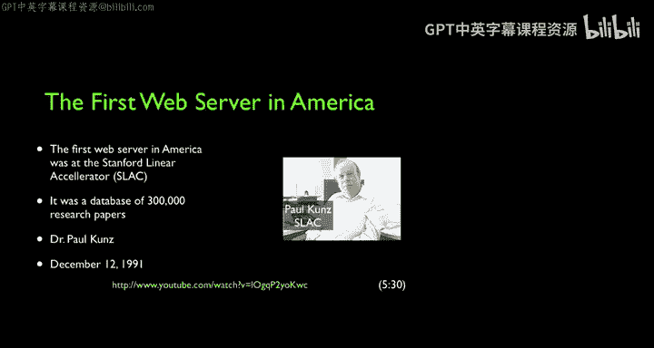

# 互联网历史、技术和安全：P23：Mosaic浏览器的诞生 🌐

在本节课中，我们将探讨万维网从学术工具转变为大众平台的关键转折点。我们将了解早期网络的局限性、竞争技术Gopher的兴衰，以及最终由NCSA开发的Mosaic浏览器如何引爆了互联网的普及浪潮。

## 早期网络：内容与认知的挑战

上一节我们介绍了万维网的诞生，本节中我们来看看它早期面临的推广困境。蒂姆·伯纳斯-李发明了万维网，但最初几年它主要局限于物理学家和小部分技术爱好者群体。

保罗·孔斯（Paul Coons）的优势在于他拥有大量内容，并且这些内容至少对物理学家而言极具价值。他为我们创建了第一个搜索引擎，并证明了网络可以成为一个以消费内容为主的环境，且极其有用。试想一下，如果没有网络也没有内容，人们如何能知道网络是查看内容的绝佳方式呢？

我记得当我第一次看到网络时，我的反应是：好吧，它有图片，但那又怎样？因为像Gopher这样的其他工具同样出色。直到我看到了使用网络前往联邦快递追踪包裹的功能，我才觉得：这才是个很酷的想法。事实上，Gopher无法做到这一点。

## 1993年的十字路口：Gopher与Web的竞争

到1993年，也就是万维网诞生约三年后，网络实际上并不那么流行。1991年是保罗·孔斯的时代，但用户主要是物理学家和包括我在内的少数极客。而在1993年，Gopher是更优秀、更受喜爱的产品。

问题再次归结于网络速度太慢，基于纯文本的应用比高度图形化的应用运行得更好。有一个广为流传的故事发生在1993年3月，当时互联网工程任务组（IETF）召开会议，为所有这些技术制定标准。

以下是当时会议的情况：
*   他们为Gopher安排了一个“兴趣小组”会议，也为万维网安排了一个。
*   Gopher的会议人满为患，房间里挤不下，人们不得不坐在地上，挤在门口。
*   相比之下，万维网的“兴趣小组”会议几乎没人参加。

蒂姆·伯纳斯-李当时很沮丧，他说：“我为这个东西工作了三年，它比Gopher更好，但没人想用。”房间里的人告诉他，原因在于它太复杂，太难搭建和运行了。在那个遥远的年代，万维网的成功并非板上钉钉，前景并不明朗。1993年是一个真正的分水岭，很多事情都可能走向不同的方向。

## 业界的远见与史蒂夫·乔布斯的间接影响

当时，大型电信供应商发布了一系列全国性的广告宣传活动。电信行业看到了这一切正在发生，他们知道这将是巨大的变革，知道它将允许多种方式的交互。他们并不愚蠢，他们完全知晓。这系列精彩的广告令人惊叹。

回顾这段历史，思考那些可能不存在的联系，很少有人真正指出史蒂夫·乔布斯可能对万维网产生过影响。但在某种程度上，他确实颇具影响力。史蒂夫·乔布斯创立了苹果公司，后在麦金塔电脑发布后被赶出苹果。他创立了一家名为NeXT的新公司。

如果你仔细听罗伯特·卡里奥和保罗·孔斯的讲述，你会发现，在整个90年代初期，我桌上用的电脑都是NeXT计算机。NeXT是史蒂夫·乔布斯被苹果解雇后创立公司时打造的一款大胆的、基于UNIX、高度网络化、具备高分辨率显示器的强大计算机。他最终回到了苹果，而NeXT的技术也成为了麦金塔电脑的基础——即麦金塔操作系统。因此，如果你在麦金塔上操作出错，可能会看到一个以“NSS”开头的错误信息，那就是源于这些NeXT计算机上的操作系统NeXTSTEP。

在万维网的头三年，它几乎只在NeXT计算机上运行。甚至服务器和浏览器都在NeXT计算机上。因此，NeXT计算机在某种程度上确实承载了早期的网络。我在史蒂夫·乔布斯去世几个月后，为我们《IEEE计算机杂志》2012年1月号写了一篇文章，试图至少从历史角度指出史蒂夫·乔布斯在帮助互联网形成方面可能有多么重要。

## 回归起点：伊利诺伊大学与Mosaic的诞生

我们的旅程始于伊利诺伊大学厄巴纳-香槟分校（NSF网络在此创建），经历了密歇根大学（我们在此创建了网络和第一个网络服务器），现在我们将回到旅程的起点——伊利诺伊大学厄巴纳-香槟分校。正是这里的人们，真正引爆了网络，将网络从学术空间推向了商业和终端用户空间。

当时，各种条件正在成熟：网络在增长，速度在变快，个人电脑正以非常快的速度变得更好（因为IBM PC已诞生近十年），90年代的计算机及其显示能力正在飞速提升。

在这样的环境下，伊利诺伊大学厄巴纳-香槟分校的国家超级计算应用中心（NCSA）开发了一款开源的网页浏览器，它能在Mac、Windows和UNIX系统上运行。这是第一款实现跨平台的网页浏览器。

**`Mosaic`** 的出现，真正使得普通家庭用户，只要拥有PC或Mac电脑并能连接网络，就可以开始享受万维网上涌现的所有新内容。

此后，NCSA的员工、学生程序员和软件开发人员共同成立了网景公司（Netscape），以将这一切商业化。约瑟夫·哈丁（Joseph Hardin）是NCSA软件开发团队的负责人，该团队负责构建并以开源形式发布Mosaic网页浏览器和HTTPD网络服务器，并将Mosaic免费提供给公众。

## 总结

本节课中我们一起学习了万维网早期发展的关键阶段。我们看到了尽管技术优越，但早期万维网因复杂性和网络限制而难以普及，一度被更简单的Gopher协议超越。我们了解了史蒂夫·乔布斯通过NeXT计算机为早期网络提供了重要的硬件和软件基础。最终，伊利诺伊大学NCSA中心开发的跨平台、开源且免费的Mosaic浏览器，打破了这些障碍，成为将万维网推向大众、引爆互联网革命的决定性产品。从学术工具到全球平台，Mosaic浏览器的诞生是互联网历史上一个至关重要的转折点。