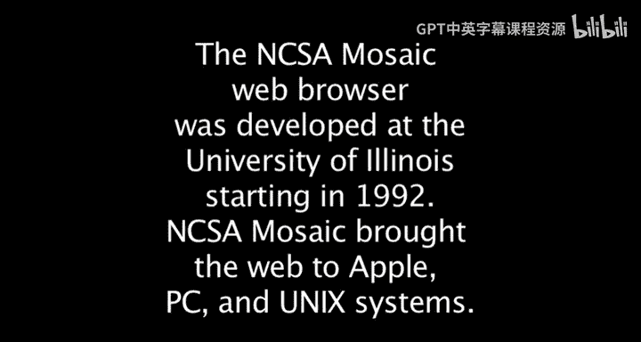
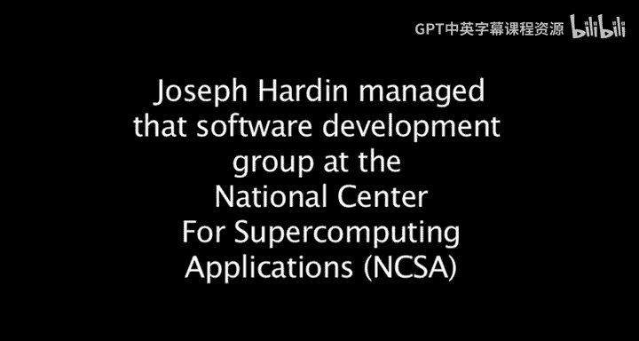

# 互联网历史、技术与安全：P24：约瑟夫·哈丁与国家超级计算应用中心Mosaic项目 🌐

## 概述
在本节课中，我们将跟随约瑟夫·哈丁的讲述，了解国家超级计算应用中心（NCSA）的特殊环境，以及Mosaic浏览器诞生的背景、开发过程与早期影响。我们将看到一个小团队如何创造出改变世界的工具，并探讨其引发的连锁反应。

---

## NCSA：一个充满能量的特殊之地 ⚡

NCSA是一个非常特殊的地方。这种地方极为罕见：那里充满了能量、拥有大量资源、具备远见的领导力，并为人们提供了大量自由探索的空间。

从一开始，拉里（Larry）就认识到，并且我们所有人都热爱这样一个想法：桌面上的这些小东西，实际上是每个人通往后台大型机器的门户。而所有这些，最终将汇聚成屏幕后方的一片“云”。我们需要思考如何让用户尽可能深入地参与进来。

---

## 从同步协作工具到Web浏览器 🔄

上一节我们介绍了NCSA充满活力的环境，本节中我们来看看他们最初的工作重点。

最初，我们的兴趣在于同步协作工具。当我们思考协作工具时，我们正在构建一个名为 **NCSA Collage** 的东西。

以下是NCSA Collage工具集的特点：
*   它是一套工具集。
*   一个重要的特点是，它们能在三种平台上运行：为Unix用户准备的X Window、Windows环境和Mac系统。
*   这某种程度上是底层文化的一部分：我们希望让尽可能广泛的社区能够使用它们。

我们开始致力于协作工具。每个平台上都有一组人员，致力于让人们能够实时共享他们的数据图像、数据电子表格，以及他们发现的、包含有趣参考文献的论文，并与地理上相隔遥远的同事分享。

---

## “我们可以做得更好” 💡

正是在这样的背景下，开发者戴夫·汤普森（Dave Thompson）——他是Collage工具的X Window主要开发者——下载了一个早期的Web浏览器。

他下载的是CERN的浏览器。他费了很大劲让它运行起来，然后拿给马克·安德森（Mark Andreessen）和我看。

我们俩看着屏幕，戴夫描述了他展示给我们的东西。我们说：“我们可以做得比那个更好。那是个复杂的系统，而且界面看起来很糟糕。”戴夫说，对他来说，下载、安装、编译并让它运行起来非常痛苦，而且它只能在NeXT工作站上运行。如果它能跨所有三种平台运行，并且像我们其他工具一样即插即用，那该多酷。

---

## Mosaic的诞生与早期反响 🚀

马克和埃里克（Eric）正在开发第一代NCSA Mosaic，这是一个X Window应用程序。当时还没有人开发Windows或Mac版本。

我们看到它的第一个版本在什么时候出现？是93年初，还是92年底？大概是93年初。当然，反响非常热烈。能够点击某个东西然后立刻看到它，这太棒了。

实际上，**超链接**作为一种用于文档导航和检索的用户界面，结合在文档中，简直太棒了。很多人立刻理解了它，尤其是那些在NCSA和公司里使用工具的人。

我记得有一次，一位惠普（HP）的高管来访。马克和埃里克写了一个小过滤器，能将Unix文档转换成HTML，并将所有引用变成链接。他们访问了HP的站点。那位高管问：“这是从哪里来的？”因为他能在NCSA的房间里看到自己所有的HP文档，并且非常轻松地浏览。我们说：“嗯，你们后面有三四个人架设了HTTPD服务器，你可能还不知道那是什么。”他说：“我从来没听说过这个。”我们说：“但这可能就是未来，对于那些试图以分布式方式管理文档的人来说，会非常有用。”

我们继续讲着这样的故事，这位高管在他的座位上兴奋得坐立不安。这就是我们得到的反响类型。

---

## “一枪响遍世界” 🌍

到了93年底、94年初，出现了一套完整的Mosaic浏览器，可以在X Window、Mac和Windows系统上运行。正是在这个时候，当时的互联网协会主席说：“NCSA打响了全世界都听到的一枪”，因为它现在可以在所有这些平台上使用，任何人都可以使用它。

我们看到HTTPD服务器的数量和流量呈指数级增长，等等，所有这些都发生了。当然，蒂姆·伯纳斯-李（Tim Berners-Lee）这时会说，他从一开始就看到了指数级增长，他是对的。

我们俩都对。我们从推出浏览器的时候看到了增长，它们确实对此有帮助。但我认为，在人们能够轻松地用HTML发布材料并做所有事情这方面，已经存在一个潜在的指数增长基础。

---

## 商业化的浪潮与浏览器之争 💼

我记得和来访的商业人士坐在房间里，我会把整个软件开发团队叫进来，说：“听听这些人怎么说，然后告诉我你们的想法。”

当时没有人确定它会发展成什么样子。有些人开始构建浏览器，但基本上没有成功起步。直到网景（Netscape）公司开始努力，我认为才有了足够的能量和资源来真正推进、驾驭和推动这股浪潮。你知道，在几个月内组建起几百名开发者的团队。

然后，他们很快就被微软投入的努力所超越。我记得一位网景的员工说，他从西雅图的一些人那里开会回来，他们说微软现在有……这是在网景处于巅峰时期，对吧，处于游戏的顶端。这家伙说：“微软刚刚告诉我，他们大约有2000名开发者在做这个。”他说在那一刻，他意识到我们将遇到一些困难。

---

## 对标准与多样性的期望 📜

当然，我们一直觉得应该不止有一种浏览器。我们之所以希望这样，是因为我们对标准和开放性感兴趣。如果在某个时期只有一种浏览器，那么那家公司就可以决定标准是什么。早期有各种各样的麻烦，比如在浏览器中加入不同的功能来推动标准，而不是由标准来驱动浏览器，诸如此类的事情。所以我们希望有一些多样性。

但是，在93年，也许到94年，没有人……我认为在93年，我们仍然对我们所拥有的东西感到惊讶，对得到的反响感到惊讶，并且对整个想法——即这将是一个很多人会觉得有用、并且我们玩起来会很有趣的东西——感到欣喜若狂。我们并没有真正的预感。

每个人都谈论，我们谈论了所有的可能性，但我们并没有真正预感到它会如此迅速地起飞并被商业化。

---

## 总结

本节课中，我们一起学习了NCSA Mosaic浏览器诞生的故事。我们看到了在一个资源丰富、鼓励创新的特殊环境中，一个小团队如何因不满现有工具的复杂与局限，而萌生“我们可以做得更好”的想法，并最终开发出首个广泛流行的图形化Web浏览器。Mosaic的跨平台特性使其迅速传播，引发了互联网使用的指数级增长，并拉开了后来浏览器大战的序幕。尽管开发者们最初并未预料到其巨大的商业影响，但他们对开放标准和多样性的追求，为早期网络的发展奠定了重要基础。这段历史提醒我们，伟大的创新往往源于解决具体问题的简单愿望，并在开放协作的环境中开花结果。